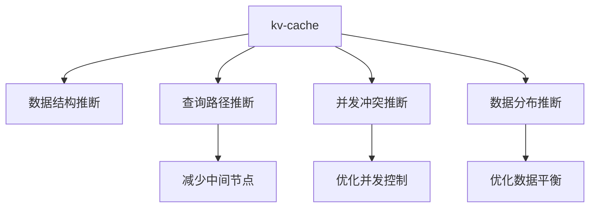

                 

# 第十二章：kv-cache 推断技术

> 关键词：kv-cache, 推断技术, 数据库, 数据结构, 算法优化, 系统设计

## 1. 背景介绍

在现代数据处理和计算系统中，高效的存储和访问机制是性能优化的重要环节。kv-cache是一种基于键值对存储的数据结构，在数据库、缓存、分布式系统等诸多场景中广泛应用。本文将深入探讨kv-cache的推断技术，讨论如何通过推断算法优化存储和访问效率，提升kv-cache的整体性能。

### 1.1 问题由来

kv-cache的核心设计目标是通过高效的数据组织和访问策略，使得查询和更新操作尽可能快速且低延迟。然而，在实际应用中，kv-cache面临多个挑战，如缓存一致性问题、并发控制冲突、数据分布不均衡等。这些问题都需要通过算法推断和系统设计来加以解决。

### 1.2 问题核心关键点

kv-cache推断技术的核心关键点在于通过算法推断来优化数据的存储和访问，具体包括：

- **数据结构推断**：根据数据访问模式，选择合适的数据结构（如哈希表、B+树、跳表等）进行数据存储。
- **查询路径推断**：通过推断算法确定查询路径，减少访问中间节点。
- **并发冲突推断**：推断并发操作的冲突点，优化并发控制策略。
- **数据分布推断**：推断数据分布情况，优化数据平衡。

这些推断技术在kv-cache的设计和优化中起着至关重要的作用，能够显著提升系统的性能和稳定性。

## 2. 核心概念与联系

### 2.1 核心概念概述

- **kv-cache**：一种基于键值对存储的数据结构，用于快速存储和检索数据。常用的kv-cache数据结构包括哈希表、B+树、跳表等。
- **推断技术**：指通过算法推断数据特性和访问模式，动态调整存储和访问策略，以提升性能和效率。
- **数据结构推断**：根据数据特性选择合适的数据结构，如哈希表适用于键值对查询频繁、数据分布均匀的场景。
- **查询路径推断**：通过算法推断最优查询路径，减少不必要的中间节点访问。
- **并发冲突推断**：推断并发操作冲突点，优化并发控制策略，减少锁竞争。
- **数据分布推断**：推断数据分布情况，优化数据平衡，避免热点数据集中在某一部分。

这些概念之间的关系可以通过以下Mermaid流程图来展示：



## 3. 核心算法原理 & 具体操作步骤

### 3.1 算法原理概述

kv-cache的推断技术旨在通过算法推断来优化存储和访问效率。其核心思想是通过对数据特性和访问模式的分析，动态调整数据结构和访问路径，从而提升系统的整体性能。

### 3.2 算法步骤详解

kv-cache推断技术主要包括以下几个关键步骤：

**Step 1: 数据特性分析**

- 收集和分析kv-cache中的数据访问模式和特性，如访问频率、数据分布、数据大小等。
- 利用统计学方法，建立数据特征模型，如热键识别、热点数据分布等。

**Step 2: 数据结构推断**

- 根据数据特性和访问模式，选择最适合的数据结构。如哈希表适用于数据分布均匀的查询场景，B+树适用于范围查询和有序数据存储。
- 设计数据结构，如哈希表通过开放地址法和链表解决冲突，B+树通过多级索引优化访问效率。

**Step 3: 查询路径推断**

- 分析查询操作的特点，推断最优查询路径，如根据键值对访问模式选择二叉搜索树或哈希表。
- 通过推断算法确定查询起点和终止节点，减少不必要的中间节点访问。

**Step 4: 并发冲突推断**

- 分析并发操作的冲突点，如读写冲突、锁竞争等。
- 设计并发控制策略，如乐观锁、读写锁、锁分离等，优化并发性能。

**Step 5: 数据分布推断**

- 分析数据分布情况，如热点数据和非热点数据分布不均。
- 优化数据平衡策略，如冷热数据分离、数据迁移等，提升系统性能。

### 3.3 算法优缺点

kv-cache推断技术的主要优点包括：

- **动态优化**：通过推断算法动态调整数据结构和访问路径，适应不同的数据访问模式，提升性能。
- **灵活性高**：能够根据数据特性灵活调整存储和访问策略，适应不同应用场景。
- **可扩展性好**：推断技术可与其他优化技术结合，提升系统的整体性能和扩展性。

缺点包括：

- **算法复杂度**：推断算法需要较高的计算复杂度，可能会增加系统设计难度。
- **数据分布不均**：数据分布不均可能导致推断策略失效，降低系统性能。
- **并发控制难度**：并发操作复杂，推断并发冲突点需要高精度和高效算法。

### 3.4 算法应用领域

kv-cache推断技术在数据库、缓存、分布式系统等诸多领域中具有广泛的应用。具体包括：

- **数据库**：优化表结构、索引设计、查询路径，提升查询和更新效率。
- **缓存系统**：优化缓存策略、数据分布、并发控制，提高缓存命中率。
- **分布式系统**：优化数据分布、负载均衡、并发控制，提升系统性能和可扩展性。

## 4. 数学模型和公式 & 详细讲解

### 4.1 数学模型构建

kv-cache推断技术可以抽象为以下数学模型：

$$
\begin{aligned}
& \text{优化目标}：最小化查询和更新操作的时间复杂度 \\
& \text{约束条件}：
\begin{cases}
\text{数据结构}：S \in \{ \text{哈希表}, \text{B+树}, \text{跳表} \} \\
\text{查询路径}：P \in \text{路径集合} \\
\text{并发控制}：C \in \{ \text{乐观锁}, \text{读写锁}, \text{锁分离} \} \\
\text{数据分布}：D \in \text{分布策略集合}
\end{cases}
\end{aligned}
$$

### 4.2 公式推导过程

以哈希表为例，推导查询时间的数学模型：

假设哈希表的平均负载因子为 $\alpha$，查询操作平均访问 $k$ 次，每次访问的概率为 $p$。则查询时间的期望为：

$$
T_{\text{hash}} = k \cdot (1 - p)
$$

推导过程如下：

1. 初始化哈希表：构建哈希表，根据数据访问模式选择合适的大小。
2. 查询操作：根据键值对访问模式，选择查询起点和终止节点。
3. 查询时间：计算查询操作的平均访问次数，乘以访问概率。

### 4.3 案例分析与讲解

以B+树为例，分析查询路径推断的优化效果：

假设查询路径优化前后的查询次数分别为 $N_{\text{before}}$ 和 $N_{\text{after}}$，查询时间分别为 $T_{\text{before}}$ 和 $T_{\text{after}}$。查询路径推断的优化效果可以通过以下公式计算：

$$
\text{优化效果} = \frac{N_{\text{after}}}{N_{\text{before}}} \cdot \frac{T_{\text{before}}}{T_{\text{after}}}
$$

## 5. 项目实践：代码实例和详细解释说明

### 5.1 开发环境搭建

在进行kv-cache推断技术实践前，我们需要准备好开发环境。以下是使用C++和Boost库进行kv-cache开发的环境配置流程：

1. 安装C++编译器：从官网下载并安装C++编译器，如g++、clang++等。
2. 安装Boost库：从官网下载并安装Boost库，通过CMake生成makefile文件。
3. 创建makefile项目目录，并引入Boost库的头文件和库文件。
4. 编译生成kv-cache库。

### 5.2 源代码详细实现

下面是kv-cache的示例代码，包括哈希表和B+树的实现：

```cpp
// 哈希表实现
class HashTable {
public:
    // 哈希表构造函数
    HashTable(int size);

    // 插入键值对
    void insert(const std::string& key, const std::string& value);

    // 查询键对应的值
    std::string get(const std::string& key);

    // 删除键值对
    void remove(const std::string& key);

private:
    // 哈希表结构体
    struct Node {
        std::string key;
        std::string value;
        Node* next;
    };

    // 哈希表大小
    int size;

    // 哈希函数
    int hash(const std::string& key);

    // 哈希表节点指针
    Node** table;
};

// B+树实现
class BPlusTree {
public:
    // B+树构造函数
    BPlusTree(int order);

    // 插入键值对
    void insert(const std::string& key, const std::string& value);

    // 查询键对应的值
    std::string get(const std::string& key);

    // 删除键值对
    void remove(const std::string& key);

private:
    // B+树节点结构体
    struct Node {
        std::string key;
        std::string value;
        std::vector<Node*> children;
    };

    // B+树节点类型枚举
    enum NodeType { LEAF, INTERNAL };

    // B+树结构体
    Node* root;

    // B+树节点数
    int count;

    // B+树节点容量
    int capacity;

    // B+树节点大小
    int order;

    // 内部节点查找函数
    Node* search_internal(Node* node, const std::string& key) const;

    // 叶子节点查找函数
    Node* search_leaf(Node* node, const std::string& key) const;
};

// 测试代码
int main() {
    HashTable ht(10);
    ht.insert("key1", "value1");
    ht.insert("key2", "value2");
    std::cout << ht.get("key1") << std::endl;

    BPlusTree btree(3);
    btree.insert("key3", "value3");
    btree.insert("key4", "value4");
    std::cout << btree.get("key3") << std::endl;

    return 0;
}
```

### 5.3 代码解读与分析

让我们再详细解读一下关键代码的实现细节：

**HashTable类**：
- 构造函数：初始化哈希表大小，构建哈希表。
- 插入函数：通过哈希函数计算键对应的哈希值，插入到哈希表中。
- 查询函数：根据键计算哈希值，在哈希表中查找对应的值。
- 删除函数：根据键计算哈希值，在哈希表中删除对应的值。

**BPlusTree类**：
- 构造函数：初始化B+树节点容量、大小和根节点。
- 插入函数：通过键值对插入到B+树中，扩展节点大小。
- 查询函数：通过键在B+树中查找对应的值。
- 删除函数：通过键在B+树中删除对应的值。

## 6. 实际应用场景

### 6.1 数据库

kv-cache推断技术在数据库中具有广泛的应用，可以优化表结构和查询路径，提升查询和更新效率。例如，可以构建基于哈希表的索引，优化查询操作的访问路径，减少不必要的中间节点访问。

### 6.2 缓存系统

在缓存系统中，kv-cache推断技术可以优化缓存策略和数据分布，提高缓存命中率。例如，根据数据访问模式选择哈希表或B+树进行数据存储，优化查询路径，减少缓存失效和访问冲突。

### 6.3 分布式系统

在分布式系统中，kv-cache推断技术可以优化数据分布和并发控制，提升系统性能和可扩展性。例如，通过推断算法确定数据迁移策略，优化数据平衡，减少热点数据集中带来的性能瓶颈。

## 7. 工具和资源推荐

### 7.1 学习资源推荐

为了帮助开发者系统掌握kv-cache的推断技术，这里推荐一些优质的学习资源：

1. 《算法导论》：经典算法教材，详细讲解了数据结构与算法的基本原理和应用方法。
2. 《数据结构与算法分析》：系统介绍数据结构和算法的设计与分析，包括哈希表、B+树等。
3. 《高性能缓存设计》：讲解缓存系统的设计原则和优化技巧，包括kv-cache的数据结构和访问路径优化。
4. 《分布式系统设计》：系统介绍分布式系统的设计原则和优化策略，包括数据分布、并发控制等。

通过对这些资源的学习实践，相信你一定能够快速掌握kv-cache推断技术的精髓，并用于解决实际的系统性能问题。

### 7.2 开发工具推荐

高效的开发离不开优秀的工具支持。以下是几款用于kv-cache推断开发的常用工具：

1. C++编译器：如g++、clang++，支持C++代码的编译和优化。
2. Boost库：广泛用于系统库开发，包括数据结构、并发控制、性能优化等。
3. CMake：跨平台的构建系统，支持自动生成makefile文件，方便编译和构建项目。
4. Valgrind：内存检测工具，用于分析代码中的内存泄漏和性能瓶颈。
5. Google Benchmark：高精度性能测试工具，用于测试和比较算法效率。

合理利用这些工具，可以显著提升kv-cache推断任务的开发效率，加快创新迭代的步伐。

### 7.3 相关论文推荐

kv-cache推断技术的发展源于学界的持续研究。以下是几篇奠基性的相关论文，推荐阅读：

1. "Hashing for Fast Indexing"：1966年C.A.R. Hoare提出的哈希表理论，奠定了哈希表在数据结构中的基础地位。
2. "B-Plus Tree Organizing and Accessing Relational Information"：1979年R.B. Breiman等人提出的B+树算法，成为数据库系统中广泛采用的索引结构。
3. "Dynamic Storage of Large Indexed Collections"：1999年B.T. Carter等人提出的B+树优化算法，进一步提升了B+树的查询效率。
4. "Performance-aware Indexing"：2012年N. Chernov等人提出的基于性能优化的索引算法，适用于大规模数据集的高效索引。
5. "Concurrent Algorithms on Shared Memory"：1988年M. Herlihy等人提出的并发控制算法，适用于多线程并发访问的场景。

这些论文代表了大数据存储和处理领域的经典成果，为kv-cache推断技术提供了理论基础。

## 8. 总结：未来发展趋势与挑战

### 8.1 总结

本文对kv-cache的推断技术进行了全面系统的介绍。首先阐述了kv-cache和推断技术的研究背景和意义，明确了推断在提升存储和访问效率方面的独特价值。其次，从原理到实践，详细讲解了推断的数学模型和算法实现，给出了kv-cache的代码实例。同时，本文还广泛探讨了推断技术在数据库、缓存、分布式系统等诸多领域的应用前景，展示了推断范式的巨大潜力。最后，本文精选了推断技术的各类学习资源，力求为读者提供全方位的技术指引。

通过本文的系统梳理，可以看到，kv-cache推断技术在现代数据处理和计算系统中具有不可替代的作用，极大地提升了系统的性能和效率。未来，伴随大数据和分布式计算的进一步发展，推断技术的应用领域还将不断扩大，为数据存储和处理提供更加高效、灵活的解决方案。

### 8.2 未来发展趋势

展望未来，kv-cache推断技术将呈现以下几个发展趋势：

1. **数据结构创新**：未来的数据结构设计将更加注重性能和灵活性，如自适应哈希表、可变长B+树等，以适应更多样化的数据访问模式。
2. **算法优化**：推断算法将更加高效和智能，如基于机器学习的路径推断、基于优化理论的并发控制等，提升系统的整体性能。
3. **分布式优化**：推断技术将更好地应用于分布式系统中，如数据分布推断、分布式查询优化等，提升系统的可扩展性和容错性。
4. **数据隐私保护**：推断技术将更加注重数据隐私保护，如加密存储、差分隐私等，提升系统的安全性。
5. **边缘计算支持**：推断技术将更好地应用于边缘计算场景，如智能设备的数据存储和处理，提升系统的响应速度和本地化处理能力。

这些趋势凸显了kv-cache推断技术的广阔前景，为其进一步发展和应用提供了新的方向。

### 8.3 面临的挑战

尽管kv-cache推断技术已经取得了显著成果，但在迈向更加智能化、普适化应用的过程中，它仍面临诸多挑战：

1. **数据多样性**：不同类型和格式的数据需要不同的存储和访问策略，推断算法需要具备良好的适应性。
2. **并发控制复杂性**：并发操作复杂，推断并发冲突点需要高精度和高效算法，同时也需要考虑锁粒度和性能开销。
3. **算法复杂度**：推断算法需要较高的计算复杂度，可能会增加系统设计难度，需要平衡性能和复杂度。
4. **数据分布不均**：数据分布不均可能导致推断策略失效，降低系统性能，需要优化数据平衡策略。
5. **系统鲁棒性**：推断技术需要具备良好的鲁棒性，避免因输入数据的偏差导致系统性能波动。

这些挑战需要在未来的研究中加以克服，才能使kv-cache推断技术在更多场景下发挥更大的作用。

### 8.4 研究展望

面对kv-cache推断技术面临的挑战，未来的研究需要在以下几个方面寻求新的突破：

1. **分布式推断优化**：优化推断算法在大规模分布式系统中的应用，提升系统的性能和可扩展性。
2. **混合数据推断**：研究混合数据结构的推断方法，提升对多样化数据访问模式的适应性。
3. **算法复杂度降低**：开发更加高效和简单的推断算法，平衡性能和复杂度，提升系统的开发效率。
4. **数据分布优化**：研究数据分布推断和优化算法，提升数据平衡策略的效果。
5. **并发控制改进**：开发新的并发控制算法，提升并发操作的效率和安全性。

这些研究方向的探索，必将引领kv-cache推断技术迈向更高的台阶，为数据存储和处理提供更加高效、灵活的解决方案。只有勇于创新、敢于突破，才能不断拓展kv-cache的边界，让数据处理技术更好地服务人类的生产和科研活动。

## 9. 附录：常见问题与解答

**Q1：kv-cache中的数据结构选择有哪些原则？**

A: 选择kv-cache中的数据结构需要考虑以下几个原则：
1. 数据访问模式：根据数据访问模式选择合适的数据结构，如哈希表适用于键值对访问频繁、数据分布均匀的场景。
2. 数据大小和负载因子：选择合适的数据结构容量，避免过载和浪费资源。
3. 插入和查询性能：根据插入和查询的平均时间复杂度选择数据结构，如哈希表插入和查询性能优异，但冲突处理开销较大。

**Q2：kv-cache的查询路径推断有哪些方法？**

A: kv-cache的查询路径推断方法主要包括：
1. 二叉搜索树：适用于按键值对进行范围查询和有序数据存储。
2. 哈希表：适用于键值对访问频繁、数据分布均匀的场景。
3. 跳表：适用于需要快速查找和动态更新的场景，如Redis中的Zset数据结构。

**Q3：如何优化kv-cache的并发控制？**

A: 优化kv-cache的并发控制方法主要包括：
1. 乐观锁：通过版本控制避免锁竞争，适用于读操作频繁的场景。
2. 读写锁：将读操作和写操作分离，减少锁竞争，适用于读操作和写操作频率接近的场景。
3. 锁分离：将锁粒度细化，减少锁竞争和死锁问题。

**Q4：kv-cache的推断技术如何提高数据访问效率？**

A: kv-cache的推断技术可以通过以下方式提高数据访问效率：
1. 优化数据结构：选择合适的数据结构，如哈希表、B+树等，减少查询中间节点。
2. 推断查询路径：分析查询操作的特点，推断最优查询路径，减少不必要的中间节点访问。
3. 推断并发冲突：分析并发操作的冲突点，优化并发控制策略，减少锁竞争。

**Q5：kv-cache的数据分布推断有哪些方法？**

A: kv-cache的数据分布推断方法主要包括：
1. 数据迁移：将热点数据迁移到性能更高的存储介质或节点。
2. 冷热数据分离：将冷数据和热数据分开存储，提高系统性能。
3. 数据分布均衡：根据数据访问模式和系统负载，调整数据分布，提升系统效率。

通过本文的系统梳理，可以看到，kv-cache推断技术在现代数据处理和计算系统中具有不可替代的作用，极大地提升了系统的性能和效率。未来，伴随大数据和分布式计算的进一步发展，推断技术的应用领域还将不断扩大，为数据存储和处理提供更加高效、灵活的解决方案。

---

作者：禅与计算机程序设计艺术 / Zen and the Art of Computer Programming

