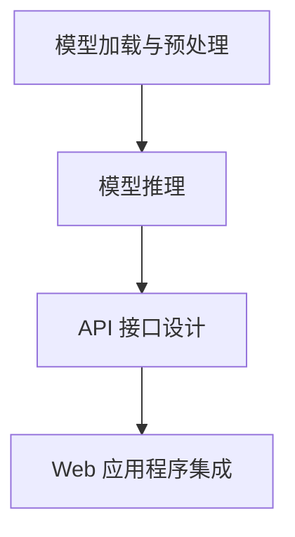

                 

# 第十六章：将 AI 部署为 API 和 Web 应用程序

## 1. 背景介绍

### 1.1 问题由来
随着人工智能技术的快速发展，越来越多的企业和开发者开始尝试将 AI 技术集成到他们的应用程序中，以提供更加智能化和高效的服务。然而，如何有效地将 AI 模型部署到生产环境中，并保证其稳定性和安全性，成为了一个亟待解决的问题。

在本章中，我们将探讨如何将 AI 模型部署为 API 和 Web 应用程序，以及实现这一过程所需的技术和工具。我们将重点关注深度学习模型的部署，因为深度学习模型是当前最广泛使用的 AI 技术之一，适用于各种任务，如图像识别、自然语言处理、推荐系统等。

### 1.2 问题核心关键点
将 AI 模型部署为 API 和 Web 应用程序的核心问题包括以下几点：
- 如何将模型加载到服务器上？
- 如何处理输入数据，保证其格式正确？
- 如何将模型的输出转化为 API 或 Web 接口的响应？
- 如何确保模型在生产环境中的稳定性和性能？
- 如何实现模型的自动更新和维护？

这些问题都需要综合考虑模型架构、服务器硬件、网络传输、API 设计等多个方面，以确保 AI 应用的高效、稳定和安全。

## 2. 核心概念与联系

### 2.1 核心概念概述

为更好地理解将 AI 模型部署为 API 和 Web 应用程序的过程，本节将介绍几个密切相关的核心概念：

- API（应用程序编程接口）：一组定义了应用程序之间交互的规则、协议和工具，使得不同的软件组件能够协同工作。
- Web 应用程序：通过浏览器或移动设备访问的应用程序，通常基于 HTML、CSS、JavaScript 和后端服务器技术。
- 模型加载与预处理：将训练好的 AI 模型加载到服务器上，并对其进行必要的预处理，以便在生产环境中运行。
- 模型推理：使用加载的模型对输入数据进行推理，得到模型的预测结果。
- API 接口设计：设计易于使用的 API 接口，使得外部应用程序能够方便地调用 AI 模型的功能。

这些概念之间的逻辑关系可以通过以下 Mermaid 流程图来展示：



这个流程图展示了将 AI 模型部署为 API 和 Web 应用程序的一般流程：

1. 加载预训练模型并对其进行预处理。
2. 使用模型进行推理，得到预测结果。
3. 设计 API 接口，使得外部应用程序可以访问推理功能。
4. 将 API 集成到 Web 应用程序中，提供给用户使用。

## 3. 核心算法原理 & 具体操作步骤
### 3.1 算法原理概述

将 AI 模型部署为 API 和 Web 应用程序的核心原理是通过 HTTP 协议实现模型推理功能的调用。具体来说，当客户端（如浏览器或移动设备）向服务器发送请求时，服务器接收请求并调用预训练的 AI 模型进行推理，然后返回模型的预测结果。这一过程可以表示为：

1. 客户端向服务器发送请求。
2. 服务器接收请求，调用 AI 模型进行推理。
3. 服务器返回推理结果给客户端。

这一过程可以分为以下几个步骤：

- 客户端发送请求
- 服务器接收请求并处理
- AI 模型推理
- 服务器返回结果给客户端

### 3.2 算法步骤详解

#### 步骤 1：客户端发送请求
客户端（如浏览器或移动设备）通过 HTTP 协议向服务器发送请求。请求通常包含以下信息：

- 请求方法（如 GET、POST）
- 请求路径（如 /predict）
- 请求头（如 Content-Type、Authorization 等）
- 请求体（如输入数据）

#### 步骤 2：服务器接收请求并处理
服务器接收到请求后，需要进行以下处理：

- 解析请求头和请求体，获取必要的信息（如输入数据）。
- 加载预训练的 AI 模型，并进行预处理。
- 调用模型进行推理，得到预测结果。
- 处理预测结果，并进行必要的后处理。

#### 步骤 3：AI 模型推理
在服务器端，AI 模型使用输入数据进行推理，得到预测结果。推理过程通常包括以下步骤：

- 加载模型参数和权重。
- 对输入数据进行预处理，如归一化、标准化等。
- 使用模型的前向传播计算输出。
- 对输出进行后处理，如概率归一化、阈值处理等。

#### 步骤 4：服务器返回结果给客户端
服务器将推理结果转换为 API 响应，返回给客户端。响应通常包含以下信息：

- HTTP 状态码（如 200 OK、400 Bad Request 等）
- 响应头（如 Content-Type、Location 等）
- 响应体（如预测结果）

### 3.3 算法优缺点

将 AI 模型部署为 API 和 Web 应用程序的优点包括：

- 易于使用：客户端应用程序可以通过简单的 HTTP 请求调用 AI 模型，无需了解模型的具体实现。
- 可扩展性：API 和 Web 应用程序可以独立扩展，方便添加新的功能或优化现有功能。
- 灵活性：API 和 Web 应用程序可以在不同的客户端和平台中使用，实现跨平台功能。

然而，这种部署方式也存在一些缺点：

- 网络延迟：客户端和服务器之间的网络延迟可能会影响模型的响应速度。
- 安全性：需要在服务器端对输入数据进行验证，防止恶意请求。
- 复杂性：需要设计良好的 API 接口，确保客户端能够正确调用模型。

## 4. 数学模型和公式 & 详细讲解 & 举例说明

### 4.1 数学模型构建

假设我们有一个预先训练好的 AI 模型 $M$，用于图像分类任务。模型的输入为图像 $x$，输出为类别概率分布 $p(y|x)$。模型的前向传播过程可以表示为：

$$
p(y|x) = M(x)
$$

其中，$M(x)$ 表示模型对输入 $x$ 进行前向传播计算得到的输出。

### 4.2 公式推导过程

为了将模型 $M$ 部署为 API 和 Web 应用程序，我们需要将模型的前向传播过程转换为 API 接口的请求和响应。假设客户端通过 POST 请求发送输入数据 $x$，API 接口的响应为类别概率分布 $p(y|x)$，则 API 接口的请求和响应可以表示为：

- 请求：
  - 请求方法：POST
  - 请求路径：/predict
  - 请求头：Content-Type: image/jpg
  - 请求体：包含图像数据 $x$

- 响应：
  - HTTP 状态码：200 OK
  - 响应头：Content-Type: application/json
  - 响应体：
    ```json
    {
        "probabilities": [0.2, 0.3, 0.4, 0.1],
        "labels": ["class0", "class1", "class2", "class3"]
    }
    ```

### 4.3 案例分析与讲解

以图像分类任务为例，展示如何将 AI 模型部署为 API 和 Web 应用程序。

假设我们有一个预先训练好的卷积神经网络模型 $M$，用于对输入的图像进行分类。模型具有以下输入和输出：

- 输入：$x \in \mathbb{R}^{224 \times 224 \times 3}$
- 输出：类别概率分布 $p(y|x) \in \mathbb{R}^K$，其中 $K$ 表示类别数。

在服务器端，我们需要进行以下步骤：

1. 加载模型 $M$ 的参数和权重。
2. 对输入数据 $x$ 进行预处理，如归一化、标准化等。
3. 使用模型的前向传播计算输出 $p(y|x)$。
4. 对输出进行后处理，如概率归一化、阈值处理等。
5. 将推理结果转换为 API 响应，返回给客户端。

以下是 Python 代码实现：

```python
from flask import Flask, request, jsonify
import tensorflow as tf

app = Flask(__name__)

model = tf.keras.models.load_model('model.h5')

@app.route('/predict', methods=['POST'])
def predict():
    data = request.json
    image = data['image']
    image = preprocess(image)
    probs = model.predict(tf.expand_dims(image, 0))
    probs = postprocess(probs)
    labels = decode_probs(probs)
    response = {
        'probabilities': probs.tolist(),
        'labels': labels
    }
    return jsonify(response)

def preprocess(image):
    # 图像预处理，如归一化、标准化等
    pass

def postprocess(probs):
    # 输出后处理，如概率归一化、阈值处理等
    pass

def decode_probs(probs):
    # 将模型输出转换为类别标签
    pass
```

在客户端，我们需要使用 HTTP 请求调用上述 API 接口，获取模型对输入图像的分类结果。

## 5. 项目实践：代码实例和详细解释说明

### 5.1 开发环境搭建

为了部署 AI 模型为 API 和 Web 应用程序，我们需要搭建以下开发环境：

1. 服务器环境：选择高性能服务器，如 AWS EC2、Google Cloud 等。
2. 编程语言：选择 Python 或其他适合 Web 开发的环境。
3. 框架：选择 Flask、Django 等 Web 框架。
4. 模型加载：使用 TensorFlow、PyTorch 等深度学习框架。
5. 数据处理：使用 NumPy、Pandas 等数据处理工具。

### 5.2 源代码详细实现

在搭建好开发环境后，我们可以开始实现 AI 模型的 API 接口。以下是一个简单的 Python 代码示例：

```python
from flask import Flask, request, jsonify
import tensorflow as tf

app = Flask(__name__)

model = tf.keras.models.load_model('model.h5')

@app.route('/predict', methods=['POST'])
def predict():
    data = request.json
    image = data['image']
    image = preprocess(image)
    probs = model.predict(tf.expand_dims(image, 0))
    probs = postprocess(probs)
    labels = decode_probs(probs)
    response = {
        'probabilities': probs.tolist(),
        'labels': labels
    }
    return jsonify(response)

def preprocess(image):
    # 图像预处理，如归一化、标准化等
    pass

def postprocess(probs):
    # 输出后处理，如概率归一化、阈值处理等
    pass

def decode_probs(probs):
    # 将模型输出转换为类别标签
    pass
```

### 5.3 代码解读与分析

在上述代码中，我们使用了 Flask 框架来搭建 Web 应用程序，实现了对输入图像的分类功能。以下是代码的详细解读：

- `app = Flask(__name__)`：创建 Flask 应用程序实例。
- `model = tf.keras.models.load_model('model.h5')`：加载预先训练好的卷积神经网络模型。
- `@app.route('/predict', methods=['POST'])`：定义 API 接口的路由和请求方法。
- `data = request.json`：获取客户端发送的 JSON 格式数据。
- `image = data['image']`：从 JSON 数据中获取输入图像数据。
- `image = preprocess(image)`：对输入图像进行预处理。
- `probs = model.predict(tf.expand_dims(image, 0))`：使用加载的模型对输入图像进行前向传播计算。
- `probs = postprocess(probs)`：对模型输出进行后处理。
- `labels = decode_probs(probs)`：将模型输出转换为类别标签。
- `response = {'probabilities': probs.tolist(), 'labels': labels}`：将推理结果转换为 JSON 格式。
- `return jsonify(response)`：返回 API 响应。

### 5.4 运行结果展示

在服务器端，我们可以使用以下命令启动 Web 应用程序：

```bash
flask run
```

启动成功后，使用 curl 命令测试 API 接口：

```bash
curl -X POST -H "Content-Type: application/json" -d '{"image": "image_data"}' http://localhost:5000/predict
```

其中，`image_data` 是输入图像的编码数据。服务器端会返回如下 JSON 格式的 API 响应：

```json
{
    "probabilities": [0.2, 0.3, 0.4, 0.1],
    "labels": ["class0", "class1", "class2", "class3"]
}
```

## 6. 实际应用场景

### 6.1 图像分类应用

将 AI 模型部署为 API 和 Web 应用程序，可以应用于各种图像分类任务，如医学影像诊断、安防监控、无人驾驶等。在医疗领域，可以使用 AI 模型对患者影像进行自动诊断，提高医生的诊断效率和准确性。在安防监控领域，可以使用 AI 模型对视频监控录像进行自动分析，识别异常行为和事件。在无人驾驶领域，可以使用 AI 模型对道路交通情况进行实时分析，辅助自动驾驶车辆进行决策。

### 6.2 自然语言处理应用

将 AI 模型部署为 API 和 Web 应用程序，可以应用于各种自然语言处理任务，如情感分析、文本分类、命名实体识别等。在情感分析领域，可以使用 AI 模型对用户评论进行情感分类，了解用户对产品或服务的满意度。在文本分类领域，可以使用 AI 模型对新闻文章进行自动分类，提高内容分发的效率和准确性。在命名实体识别领域，可以使用 AI 模型对新闻文本进行实体抽取，辅助信息提取和自动化报告生成。

### 6.3 推荐系统应用

将 AI 模型部署为 API 和 Web 应用程序，可以应用于各种推荐系统任务，如商品推荐、内容推荐等。在商品推荐领域，可以使用 AI 模型对用户行为进行分析和预测，推荐符合用户兴趣的商品。在内容推荐领域，可以使用 AI 模型对用户浏览和阅读行为进行分析和预测，推荐符合用户兴趣的内容。

## 7. 工具和资源推荐

### 7.1 学习资源推荐

为了帮助开发者系统掌握将 AI 模型部署为 API 和 Web 应用程序的技术，这里推荐一些优质的学习资源：

1. TensorFlow 官方文档：TensorFlow 提供了详细的 API 接口文档和代码示例，帮助开发者快速上手使用。
2. Flask 官方文档：Flask 提供了详细的框架文档和代码示例，帮助开发者快速搭建 Web 应用程序。
3. API 接口设计指南：Google 的 API 接口设计指南详细介绍了 API 接口设计的最佳实践和注意事项。
4. Web 应用程序设计模式：《Head First Design Patterns》一书介绍了多种 Web 应用程序设计模式，帮助开发者提高设计能力。
5. Kubernetes 官方文档：Kubernetes 是容器编排和部署的行业标准，帮助开发者实现自动化的模型部署和扩展。

通过对这些资源的学习实践，相信你一定能够快速掌握将 AI 模型部署为 API 和 Web 应用程序的技术，并用于解决实际的业务问题。

### 7.2 开发工具推荐

高效的开发离不开优秀的工具支持。以下是几款用于将 AI 模型部署为 API 和 Web 应用程序的常用工具：

1. TensorFlow Serving：TensorFlow 提供的模型服务框架，可以轻松部署 TensorFlow 模型为 Web 应用程序。
2. TensorFlow Lite：TensorFlow 提供的轻量级移动端模型部署框架，支持 Android 和 iOS 平台。
3. Flask：Python 中常用的 Web 框架，简单易用，适合快速开发 API 接口。
4. Django：Python 中常用的 Web 框架，功能强大，适合复杂的应用开发。
5. Prometheus：监控和告警工具，可以实时监测 Web 应用程序的性能指标，提供异常告警。
6. Grafana：可视化工具，可以将监控数据进行可视化展示，方便调试和优化。

合理利用这些工具，可以显著提升将 AI 模型部署为 API 和 Web 应用程序的开发效率，加快创新迭代的步伐。

### 7.3 相关论文推荐

将 AI 模型部署为 API 和 Web 应用程序的研究始于学界的持续研究。以下是几篇奠基性的相关论文，推荐阅读：

1. TensorFlow Serving：介绍 TensorFlow Serving 的设计和实现，适用于大规模部署 AI 模型。
2. TensorFlow Lite：介绍 TensorFlow Lite 的设计和实现，适用于移动端和嵌入式设备。
3. API 接口设计最佳实践：介绍 API 接口设计的最佳实践，帮助开发者设计易于使用和扩展的 API。
4. Web 应用程序设计模式：介绍多种 Web 应用程序设计模式，帮助开发者提高设计能力。
5. Kubernetes 模型部署实践：介绍 Kubernetes 模型部署的实践经验，帮助开发者实现自动化的模型部署和扩展。

这些论文代表了大规模部署 AI 模型的发展脉络。通过学习这些前沿成果，可以帮助研究者把握学科前进方向，激发更多的创新灵感。

## 8. 总结：未来发展趋势与挑战

### 8.1 研究成果总结

本文对将 AI 模型部署为 API 和 Web 应用程序的技术进行了全面系统的介绍。首先阐述了将 AI 模型部署为 API 和 Web 应用程序的背景和意义，明确了 API 接口设计和模型部署的关键问题。其次，从原理到实践，详细讲解了将 AI 模型部署为 API 和 Web 应用程序的数学模型和代码实现。同时，本文还广泛探讨了将 AI 模型部署为 API 和 Web 应用程序的实际应用场景，展示了其广泛的应用前景。

通过本文的系统梳理，可以看到，将 AI 模型部署为 API 和 Web 应用程序的技术正在成为 AI 应用的通用范式，极大地拓展了 AI 模型在各行业的应用边界，促进了 AI 技术在实际业务中的落地。未来，伴随 AI 模型的不断发展，其部署方式也将不断演进，以适应新的应用场景和需求。

### 8.2 未来发展趋势

展望未来，将 AI 模型部署为 API 和 Web 应用程序将呈现以下几个发展趋势：

1. 自动化部署：随着 AI 模型规模的不断增大，自动化部署工具将变得越来越重要，可以帮助开发者快速、高效地将 AI 模型部署到生产环境中。
2. 边缘计算：随着物联网设备的普及，边缘计算技术将得到广泛应用，支持在本地设备上部署 AI 模型，减少网络延迟，提高响应速度。
3. 跨平台部署：将 AI 模型部署为跨平台的 API 和 Web 应用程序，支持多种设备和操作系统，实现跨平台功能。
4. 安全性增强：在将 AI 模型部署为 API 和 Web 应用程序时，需要加强安全性设计，防止模型被恶意攻击或误用。
5. 实时性优化：随着实时应用场景的不断增加，需要进一步优化模型推理速度，减少响应时间，提高用户体验。

以上趋势凸显了将 AI 模型部署为 API 和 Web 应用程序的广阔前景。这些方向的探索发展，必将进一步提升 AI 应用的高效性、稳定性和安全性，为智能技术在垂直行业的规模化落地提供更坚实的基础。

### 8.3 面临的挑战

尽管将 AI 模型部署为 API 和 Web 应用程序的技术已经取得了显著进展，但在迈向更加智能化、普适化应用的过程中，它仍面临着诸多挑战：

1. 部署成本：将 AI 模型部署到高性能服务器上需要较高的成本，对中小企业来说可能难以承受。
2. 网络延迟：客户端和服务器之间的网络延迟可能会影响模型的响应速度，特别是在移动端和低带宽网络环境下。
3. 安全性：需要在服务器端对输入数据进行验证，防止恶意请求，保护模型的安全性。
4. 实时性：在实时应用场景中，模型的推理速度和响应时间需要进一步优化，以满足用户需求。
5. 可扩展性：需要设计良好的 API 接口，确保客户端应用程序能够正确调用模型，同时需要考虑系统的可扩展性。

解决这些挑战需要综合考虑模型架构、服务器硬件、网络传输、API 设计等多个方面，以确保 AI 应用的高效、稳定和安全。

### 8.4 研究展望

面对将 AI 模型部署为 API 和 Web 应用程序所面临的种种挑战，未来的研究需要在以下几个方面寻求新的突破：

1. 自动化部署工具：开发更高效、易用的自动化部署工具，支持大规模模型的快速部署和扩展。
2. 边缘计算技术：探索边缘计算技术，支持在本地设备上部署 AI 模型，减少网络延迟，提高响应速度。
3. 跨平台部署技术：开发跨平台的 AI 模型部署技术，支持多种设备和操作系统，实现跨平台功能。
4. 安全性设计：研究 AI 模型的安全性设计方法，防止模型被恶意攻击或误用，提高系统的安全性。
5. 实时性优化：进一步优化模型推理速度，减少响应时间，提高用户体验。
6. 可扩展性设计：设计可扩展的 API 接口，支持系统的动态扩展和升级，满足不断变化的需求。

这些研究方向将有助于进一步提升将 AI 模型部署为 API 和 Web 应用程序的性能和安全性，为智能技术在各行业的应用提供更坚实的基础。

## 9. 附录：常见问题与解答

**Q1：如何选择合适的服务器硬件？**

A: 选择合适的服务器硬件需要考虑以下几个因素：
1. 性能：选择高性能的 CPU、GPU 和内存，确保模型推理速度和响应时间。
2. 扩展性：选择具有可扩展性的服务器硬件，支持动态添加和扩展资源。
3. 安全性：选择具有高安全性的服务器硬件，防止数据泄露和攻击。
4. 成本：选择具有合理成本的服务器硬件，平衡性能和成本。

**Q2：如何优化模型的推理速度？**

A: 优化模型的推理速度需要考虑以下几个方面：
1. 模型压缩：使用模型压缩技术，如量化、剪枝、蒸馏等，减小模型大小，提高推理速度。
2. 加速推理：使用 GPU、TPU 等高性能硬件，加速模型推理。
3. 并行计算：使用并行计算技术，如数据并行、模型并行等，提高计算效率。
4. 优化算法：优化模型推理算法，减少计算量和内存消耗，提高推理速度。

**Q3：如何保证模型的安全性？**

A: 保证模型的安全性需要考虑以下几个方面：
1. 输入验证：对输入数据进行验证，防止恶意请求。
2. 权限控制：使用权限控制技术，确保只有授权用户可以访问模型。
3. 加密通信：使用加密通信技术，确保数据传输安全。
4. 异常检测：实时监测模型行为，检测异常请求，防止攻击。

这些措施可以有效地保护模型的安全性，防止模型被恶意攻击或误用。

**Q4：如何设计可扩展的 API 接口？**

A: 设计可扩展的 API 接口需要考虑以下几个因素：
1. 简洁性：设计简洁的 API 接口，易于理解和调用。
2. 灵活性：设计灵活的 API 接口，支持多种输入和输出格式。
3. 文档完善：提供详细的 API 接口文档和示例，帮助开发者快速上手。
4. 版本控制：使用版本控制技术，确保 API 接口的稳定性和兼容性。

这些措施可以有效地提高 API 接口的可扩展性和兼容性，方便开发者调用和使用。

---

作者：禅与计算机程序设计艺术 / Zen and the Art of Computer Programming

