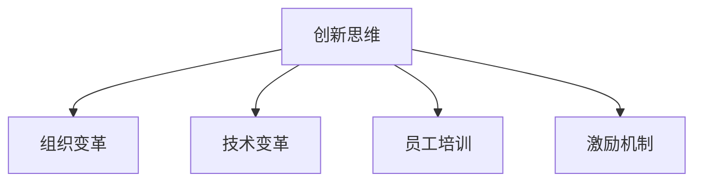

                 

# 管理者如何培养创新思维

> 关键词：创新思维,企业管理,技术变革,组织变革,员工培训

## 1. 背景介绍

### 1.1 问题由来
在快速变化的市场环境中，企业面临前所未有的竞争压力。创新成为企业生存发展的核心动力。然而，传统的管理模式和思维方式，难以适应新时期的挑战。管理者如何在复杂多变的环境中引领企业不断创新，成为亟待解决的重要课题。

### 1.2 问题核心关键点
创新思维的核心在于突破常规，不断探索新方法、新路径，驱动企业从产品创新、技术创新、模式创新等方面实现突破性发展。管理者应具备创新思维，以引领团队在激烈的竞争中脱颖而出。

## 2. 核心概念与联系

### 2.1 核心概念概述

为更好地理解管理者如何培养创新思维，本节将介绍几个密切相关的核心概念：

- 创新思维(Innovation Mindset)：指管理者应具备的创造性思考方式，能够打破常规，不断探索和尝试新方法。
- 组织变革(Organizational Change)：通过改变组织的结构、流程、文化等，推动企业向更加高效、灵活、创新的方向发展。
- 技术变革(Technology Change)：指利用新技术和新方法，改善企业产品、服务和流程。
- 员工培训(Employee Training)：通过培训和教育，提升员工的技能和知识，激发其创新潜力。
- 激励机制(Incentive Mechanism)：通过奖励和激励，引导员工主动参与创新活动。

这些核心概念之间的逻辑关系可以通过以下Mermaid流程图来展示：



这个流程图展示了一些关键概念之间的关系：

1. 创新思维是企业管理中的灵魂，推动组织变革、技术变革和员工培训。
2. 组织变革是实现创新思维和创新的重要手段。
3. 技术变革是创新的重要工具，为组织变革和员工培训提供支撑。
4. 员工培训是创新思维和技术的承载体，通过培训提升员工能力。
5. 激励机制是创新思维和培训效果的保障，激发员工参与创新的积极性。

这些概念共同构成了管理者培养创新思维的理论基础，为后续的技术实践提供了指导。

## 3. 核心算法原理 & 具体操作步骤
### 3.1 算法原理概述

管理者培养创新思维的过程，本质上是一个系统性的学习和管理优化过程。其核心在于通过不断的知识积累和实践探索，逐步构建和完善创新思维体系，并将其转化为实际的管理行动。

### 3.2 算法步骤详解

基于系统性的管理优化，管理者培养创新思维可以按照以下步骤进行：

**Step 1: 知识积累和自我认知**
- 阅读前沿管理书籍、研究论文，了解最新的管理理论和实践。
- 参加管理培训和研讨会，与专家进行交流和互动。
- 反思自身的管理经验，总结成功的经验和失败的原因。

**Step 2: 创新思维的构建**
- 学习创新思维的理论基础，如设计思维、创新方法论等。
- 通过案例分析、头脑风暴、角色扮演等方法，训练创新思维能力。
- 应用设计思维工具，如用户画像、原型设计、迭代测试等，解决实际管理问题。

**Step 3: 组织变革的推动**
- 评估组织当前的流程、文化和结构，识别出改进和创新的机会。
- 制定变革策略，明确变革目标和步骤，设计变革路线图。
- 引入敏捷管理、精益管理等方法，提升组织适应性和灵活性。

**Step 4: 技术变革的实施**
- 评估现有技术架构和流程，寻找改进和优化的空间。
- 引入先进的技术和管理工具，如人工智能、大数据分析、自动化系统等，提升效率和质量。
- 定期更新技术，跟踪最新的技术动态，保持企业的竞争力。

**Step 5: 员工培训和激励**
- 设计多样化的培训计划，提升员工的技能和知识。
- 引入激励机制，如奖励计划、股权激励、晋升机会等，激发员工参与创新的积极性。
- 建立创新文化，鼓励员工提出新想法，进行小试、中试和大试，快速迭代改进。

**Step 6: 监测和反馈**
- 设置关键绩效指标(KPIs)，定期评估创新活动的效果。
- 收集员工和客户的反馈，及时调整和优化创新策略。
- 保持持续改进的姿态，不断提升创新思维和实践能力。

### 3.3 算法优缺点

基于系统性的管理优化，培养创新思维的方法具有以下优点：
1. 系统性强。通过知识积累、创新思维训练、组织变革、技术变革、员工培训和激励等多个环节的协同，确保创新思维培养的全面性和有效性。
2. 实践性强。将理论知识转化为实际管理行动，通过不断实践和改进，提升创新能力。
3. 动态适应。通过持续的监测和反馈，确保创新策略与时俱进，适应市场变化。

同时，该方法也存在一定的局限性：
1. 资源投入大。培养创新思维需要投入大量时间、金钱和精力，短期内可能难以见效。
2. 执行难度高。需要管理者的高度关注和持续努力，否则难以取得理想效果。
3. 风险高。创新活动往往涉及高风险，需要谨慎评估和管理。

尽管存在这些局限性，但就目前而言，基于系统性的管理优化方法是培养创新思维的主流范式。未来相关研究的重点在于如何进一步降低培养成本，提高执行效率，同时兼顾创新和风险管理等因素。

### 3.4 算法应用领域

基于创新思维培养的管理优化方法，在企业管理中已经得到了广泛的应用，覆盖了几乎所有常见管理场景，例如：

- 产品开发：通过创新思维，研发新产品，满足市场需求。
- 市场推广：通过创新思维，设计营销策略，提升品牌影响。
- 运营管理：通过创新思维，优化流程，提高效率。
- 供应链管理：通过创新思维，构建灵活的供应链体系，提升响应速度。
- 客户关系管理：通过创新思维，提升客户满意度，增加忠诚度。

除了上述这些经典应用外，创新思维还广泛应用于企业战略规划、风险管理、绩效评估等多个环节，成为企业管理的重要手段。

## 4. 数学模型和公式 & 详细讲解  
### 4.1 数学模型构建

本节将使用数学语言对管理者培养创新思维的过程进行更加严格的刻画。

假设企业管理目标为最大化企业的创新价值 $V$，其中创新价值由产品创新价值 $V_{\text{product}}$、技术创新价值 $V_{\text{tech}}$、流程创新价值 $V_{\text{process}}$ 组成。

定义企业创新活动为 $I$，创新活动对创新价值的贡献为 $f(I)$，则企业的创新价值可以表示为：

$$
V = V_{\text{product}} + V_{\text{tech}} + V_{\text{process}} = f(I) + f(I_{\text{tech}}) + f(I_{\text{process}})
$$

其中 $I_{\text{tech}}$ 和 $I_{\text{process}}$ 分别代表技术创新和流程创新的活动贡献。

### 4.2 公式推导过程

假设 $I$ 的投入成本为 $C$，创新活动的期望回报为 $R$，则创新活动的净收益 $P$ 为：

$$
P = R - C
$$

假设创新活动的成功率概率为 $p$，则期望回报 $R$ 可以表示为：

$$
R = pV(I)
$$

将 $V$ 和 $P$ 代入上述公式，得：

$$
P = pv(I) - C
$$

进一步简化得：

$$
p = \frac{P + C}{V(I)}
$$

即创新活动成功的概率 $p$ 与创新价值 $V(I)$ 和成本 $C$ 有关。

### 4.3 案例分析与讲解

以一家制造企业为例，分析如何通过创新思维提升其产品创新价值 $V_{\text{product}}$。

假设企业当前的创新价值为 $V_{\text{current}}$，期望净收益为 $P_{\text{current}}$，创新成本为 $C_{\text{current}}$。

通过引入新技术和新流程，企业计划实施一项新产品创新活动 $I_{\text{product}}$，预计创新价值为 $V_{\text{product}}$，期望净收益为 $P_{\text{product}}$，创新成本为 $C_{\text{product}}$。

通过公式计算，可以得到新旧活动对企业创新价值的贡献变化：

$$
\Delta V = V_{\text{product}} - V_{\text{current}}
$$

其中 $\Delta V$ 为创新价值的变化量。

通过公式计算，可以得到新旧活动对企业创新净收益的影响：

$$
\Delta P = P_{\text{product}} - P_{\text{current}}
$$

其中 $\Delta P$ 为创新净收益的变化量。

通过公式计算，可以得到新旧活动对企业创新成功概率的影响：

$$
\Delta p = \frac{P_{\text{product}} + C_{\text{current}}}{V_{\text{product}}} - \frac{P_{\text{current}} + C_{\text{current}}}{V_{\text{current}}}
$$

其中 $\Delta p$ 为创新成功概率的变化量。

通过以上计算，企业可以评估新技术和新流程对产品创新价值的贡献，并调整创新策略。

## 5. 项目实践：代码实例和详细解释说明
### 5.1 开发环境搭建

在进行创新思维培养的管理优化实践前，我们需要准备好开发环境。以下是使用Python进行项目开发的环境配置流程：

1. 安装Anaconda：从官网下载并安装Anaconda，用于创建独立的Python环境。

2. 创建并激活虚拟环境：
```bash
conda create -n innovation-env python=3.8 
conda activate innovation-env
```

3. 安装PyTorch：根据CUDA版本，从官网获取对应的安装命令。例如：
```bash
conda install pytorch torchvision torchaudio cudatoolkit=11.1 -c pytorch -c conda-forge
```

4. 安装TensorFlow：
```bash
pip install tensorflow
```

5. 安装pandas、numpy、scikit-learn等常用数据科学库：
```bash
pip install pandas numpy scikit-learn
```

完成上述步骤后，即可在`innovation-env`环境中开始管理优化实践。

### 5.2 源代码详细实现

这里我们以一个简单的创新管理平台为例，给出基于Python的创新思维培养和管理优化的代码实现。

首先，定义一些基本的数据结构：

```python
class Innovation:
    def __init__(self, name, value, cost, success_prob):
        self.name = name
        self.value = value
        self.cost = cost
        self.success_prob = success_prob
        self.status = 'Not Started'

class InnovationManager:
    def __init__(self):
        self.innovations = []
    
    def add_innovation(self, innovation):
        self.innovations.append(innovation)
    
    def evaluate_innovation(self, innovation):
        innovation.status = 'Completed'
```

然后，定义一些基本的管理方法：

```python
class InnovationManager:
    def __init__(self):
        self.innovations = []
    
    def add_innovation(self, innovation):
        self.innovations.append(innovation)
    
    def evaluate_innovation(self, innovation):
        innovation.status = 'Completed'
    
    def select_innovation(self):
        # 选择创新活动
        best_innovation = None
        best_value = -float('inf')
        for innovation in self.innovations:
            if innovation.status == 'Completed':
                continue
            if innovation.value > best_value:
                best_value = innovation.value
                best_innovation = innovation
        return best_innovation

    def evaluate_all(self):
        for innovation in self.innovations:
            self.evaluate_innovation(innovation)
```

最后，启动管理优化流程并输出结果：

```python
# 创建创新活动
manager = InnovationManager()
innovation1 = Innovation('新技术', 100, 50, 0.7)
innovation2 = Innovation('新流程', 50, 30, 0.6)
manager.add_innovation(innovation1)
manager.add_innovation(innovation2)

# 选择创新活动
best_innovation = manager.select_innovation()

# 评估创新活动
manager.evaluate_all()

print('选择的创新活动为：', best_innovation.name)
```

以上就是使用Python对创新管理平台进行实现的代码实例。可以看到，通过定义基本的数据结构和算法，即可实现创新的选择和评估。

### 5.3 代码解读与分析

让我们再详细解读一下关键代码的实现细节：

**Innovation类**：
- `__init__`方法：初始化创新活动的名称、价值、成本和成功概率，以及当前状态。

**InnovationManager类**：
- `__init__`方法：初始化创新活动的列表。
- `add_innovation`方法：将创新活动添加到列表中。
- `evaluate_innovation`方法：评估创新活动，将其状态更新为已完成。
- `select_innovation`方法：选择当前未完成的创新活动，返回价值最高的创新活动。
- `evaluate_all`方法：对所有创新活动进行评估，将已完成的活动状态更新为已完成。

**代码实例**：
- 首先创建创新活动，并添加到列表中。
- 选择当前未完成的创新活动。
- 对所有创新活动进行评估，并更新状态。
- 输出选定的创新活动。

可以看出，通过Python实现创新思维培养的管理优化，可以简洁高效地处理创新活动的评估和选择，为实际管理工作提供决策支持。

当然，实际的管理平台还需要考虑更多因素，如创新的优先级、预算限制、人员分配等，进行更为全面的优化设计。但核心的创新思维培养和管理优化流程基本与此类似。

## 6. 实际应用场景
### 6.1 智能制造系统

基于创新思维培养的管理优化方法，可以广泛应用于智能制造系统的构建。智能制造系统通过引入先进技术和新流程，大幅提升生产效率和产品质量。

在技术实现上，可以引入物联网、人工智能、自动化系统等技术，实现生产过程的数字化、智能化。同时，引入精益生产、敏捷制造等管理方法，提升生产组织的灵活性和效率。通过持续的创新和优化，智能制造系统能够快速响应市场需求，提升企业竞争力。

### 6.2 电子商务平台

电子商务平台通过创新思维，能够不断提升用户体验和服务质量，实现业务增长。具体而言，可以引入新的支付方式、物流模式、营销策略等，提升平台的用户粘性和转化率。同时，引入数据驱动的管理方法，通过用户行为数据分析，优化产品推荐和个性化服务，提升用户满意度。

### 6.3 人力资源管理系统

人力资源管理系统通过创新思维，能够提升员工的工作效率和满意度，实现人力资源的高效利用。具体而言，可以引入新的人力资源管理工具，如人工智能招聘系统、员工绩效管理系统等，提升招聘、培训、绩效评估等环节的效率和准确性。同时，引入激励机制和员工参与制度，激发员工的创新潜力和积极性，提升企业的人力资源管理水平。

### 6.4 未来应用展望

随着创新思维培养和管理优化的不断发展，创新活动将在更多领域得到应用，为企业的业务发展和组织变革提供新的动力。

在智慧医疗领域，基于创新思维的医疗设备、药物研发等创新，能够提升医疗服务的智能化水平，辅助医生诊疗，加速新药开发进程。

在智能教育领域，创新思维可以应用于课程设计、教学方法、学习系统等方面，因材施教，促进教育公平，提高教学质量。

在智慧城市治理中，创新思维可以应用于城市事件监测、智能交通、智慧能源等环节，提高城市管理的自动化和智能化水平，构建更安全、高效的未来城市。

此外，在企业生产、社会治理、文娱传媒等众多领域，创新思维也将不断涌现，为经济社会发展注入新的动力。相信随着技术的日益成熟，创新思维必将在更广阔的应用领域大放异彩，深刻影响人类的生产生活方式。

## 7. 工具和资源推荐
### 7.1 学习资源推荐

为了帮助管理者系统掌握创新思维的培养方法，这里推荐一些优质的学习资源：

1. 《创新思维与变革管理》系列博文：由管理专家撰写，深入浅出地介绍了创新思维的核心理论和实战方法。

2. 《变革管理》课程：斯坦福大学开设的管理学课程，涵盖创新思维、变革管理等核心内容，提供丰富的案例分析。

3. 《创新思维工具与方法》书籍：介绍各类创新思维工具和方法，如设计思维、六顶思考帽、创新流程等，是实战培训的重要参考资料。

4. 哈佛商学院开放课程：哈佛商学院提供的各类创新思维和管理课程，涵盖创新理论、战略规划、组织变革等，值得管理者深入学习。

5. TED Talks演讲视频：TED平台上的创新思维演讲视频，涵盖各种创新案例和方法，启发思维，激发灵感。

通过对这些资源的学习实践，相信管理者一定能够快速掌握创新思维的精髓，并用于解决实际的业务问题。
### 7.2 开发工具推荐

高效的开发离不开优秀的工具支持。以下是几款用于创新思维培养和管理优化的常用工具：

1. Jupyter Notebook：免费的开源笔记本环境，支持Python、R、SQL等多种编程语言，方便开发者快速迭代实验。

2. GitHub：全球最大的开源社区，提供代码托管和协作功能，支持版本控制和代码审查，方便团队进行创新项目的管理和分享。

3. Microsoft Visio：专业的企业级流程管理工具，支持复杂流程图的设计和管理，方便企业进行流程优化和创新。

4. Google Docs：在线文档编辑工具，支持多人协作，方便团队进行创新项目的文档管理和沟通。

5. Slack：企业级即时通讯工具，支持创建不同频道和团队，方便团队进行实时沟通和协作。

合理利用这些工具，可以显著提升创新思维培养和管理优化的开发效率，加快创新项目的迭代和优化。

### 7.3 相关论文推荐

创新思维培养和管理优化的发展源于学界的持续研究。以下是几篇奠基性的相关论文，推荐阅读：

1. "The Innovator's Dilemma" by Clayton M. Christensen：揭示了创新过程中的市场和技术冲突，以及企业如何应对颠覆性创新。

2. "Blue Ocean Strategy" by W. Chan Kim and Renée Mauborgne：介绍了蓝海战略的概念和方法，帮助企业通过创新突破竞争红海，创造新的市场空间。

3. "Design Thinking: Understanding Artistic Creativity" by Bill Mumford：介绍了设计思维的核心原理和实践方法，帮助管理者培养创造性思维。

4. "Innovation Management: Achieving Competitive Advantage through Creativity" by Walter W. Powell：介绍了创新管理的理论框架和实践方法，帮助管理者系统化地进行创新活动。

5. "Agile Innovation: Organizing for Innovation Growth" by Yves Pigneur and Bas Vandenberghe：介绍了敏捷创新的概念和方法，帮助企业在快速变化的市场环境中保持创新活力。

这些论文代表了大语言模型微调技术的发展脉络。通过学习这些前沿成果，可以帮助管理者把握学科前进方向，激发更多的创新灵感。

## 8. 总结：未来发展趋势与挑战
### 8.1 总结

本文对管理者如何培养创新思维进行了全面系统的介绍。首先阐述了创新思维在企业管理中的重要性，明确了创新思维培养的核心目标和方法。其次，从原理到实践，详细讲解了创新思维培养的数学模型和具体操作步骤，给出了管理优化的代码实例。同时，本文还广泛探讨了创新思维在智能制造、电子商务、人力资源管理等多个行业领域的应用前景，展示了创新思维培养的巨大潜力。此外，本文精选了创新思维培养的各类学习资源，力求为管理者提供全方位的技术指引。

通过本文的系统梳理，可以看到，创新思维培养的方法正在成为企业管理的重要范式，极大地拓展了企业的创新能力和应用范围。管理者需要在知识积累、创新思维构建、组织变革、技术变革、员工培训和激励等多个环节进行全面优化，方能得到理想的效果。

### 8.2 未来发展趋势

展望未来，创新思维培养的方法将呈现以下几个发展趋势：

1. 数据驱动。利用大数据和人工智能技术，通过数据分析提升创新活动的决策和评估。
2. 跨领域融合。创新思维培养将与其他学科，如心理学、社会学、经济学等进行更深入的融合，提供更全面、系统的解决方案。
3. 开放式创新。企业将更加开放地与外部创新资源合作，共同推动创新活动的开展。
4. 持续学习。创新思维培养需要持续学习和改进，通过不断迭代和优化，提升创新能力和效果。
5. 文化建设。企业文化和组织氛围对创新思维的培养至关重要，将通过系统化建设，营造创新友好的企业文化。

以上趋势凸显了创新思维培养方法的广阔前景。这些方向的探索发展，必将进一步提升企业的创新能力，使其在激烈的市场竞争中脱颖而出。

### 8.3 面临的挑战

尽管创新思维培养方法已经取得了显著成果，但在迈向更加智能化、普适化应用的过程中，它仍面临诸多挑战：

1. 资源投入高。创新思维培养需要大量的资源和时间投入，包括人力、物力和财力，短期内可能难以见效。
2. 管理难度大。创新思维培养需要管理者的高度关注和持续努力，否则难以取得理想效果。
3. 风险控制难。创新活动往往涉及高风险，需要谨慎评估和管理，以避免不必要的损失。
4. 绩效评估难。创新活动的评估需要考虑多种因素，难以简单量化，容易导致绩效评估的偏差。
5. 知识共享难。创新思维培养需要跨部门、跨学科的协作，知识共享和沟通难度较大。

尽管存在这些挑战，但就目前而言，基于系统性的管理优化方法是培养创新思维的主流范式。未来相关研究的重点在于如何进一步降低培养成本，提高执行效率，同时兼顾创新和风险管理等因素。

### 8.4 研究展望

面向未来，创新思维培养的研究需要在以下几个方面寻求新的突破：

1. 大数据与人工智能的深度融合。通过数据驱动的决策和评估，提升创新活动的科学性和有效性。
2. 跨学科的创新思维培养。将心理学、社会学、经济学等学科的知识和方法引入创新思维培养，提供更全面的解决方案。
3. 开放式创新和创新生态系统的构建。通过开放式创新和创新生态系统的建设，提升企业的创新能力和资源整合能力。
4. 持续学习与自我改进。建立持续学习和自我改进的机制，通过不断的优化和改进，提升创新思维和实践能力。
5. 文化建设与创新氛围营造。通过企业文化和组织氛围的建设，营造创新友好的企业文化，激发员工的创新潜力和积极性。

这些研究方向的探索，必将引领创新思维培养方法走向新的高度，为企业的创新活动提供更强大的动力和支持。相信随着技术的日益成熟和应用的不断深入，创新思维培养将能够更好地适应复杂多变的环境，推动企业向更高的目标迈进。

## 9. 附录：常见问题与解答
----------------------------------------------------------------

**Q1：创新思维培养是否适用于所有企业？**

A: 创新思维培养方法适用于大多数企业，特别是那些有较强创新需求的企业。然而，对于一些传统制造业、服务业等企业，创新思维培养可能需要更多的引导和支持。

**Q2：如何评估创新活动的成功与否？**

A: 评估创新活动的成功与否需要考虑多个因素，如创新活动对企业创新价值的贡献、净收益、成功概率等。可以通过设计评估指标(KPIs)，定期评估创新活动的效果，并结合反馈进行优化。

**Q3：创新思维培养的资源投入如何控制？**

A: 创新思维培养需要大量的资源和时间投入，但可以通过以下方法进行控制：
1. 优先级排序。将创新活动按优先级排序，优先投入高价值、高成功的项目。
2. 资源共享。通过跨部门协作，共享资源和知识，提升资源利用效率。
3. 持续改进。通过不断的优化和改进，逐步降低创新活动的成本。

**Q4：如何激发员工的创新潜力和积极性？**

A: 激发员工的创新潜力和积极性，需要以下方法：
1. 提供培训和支持。通过培训和支持，提升员工的技能和知识。
2. 设计激励机制。通过奖励计划、股权激励、晋升机会等，激发员工的创新积极性。
3. 营造创新文化。通过企业文化和组织氛围的建设，营造创新友好的环境。

**Q5：创新思维培养和管理优化的工具有哪些？**

A: 创新思维培养和管理优化的工具包括：
1. Jupyter Notebook：支持Python、R、SQL等多种编程语言，方便迭代实验。
2. GitHub：提供代码托管和协作功能，方便团队进行创新项目的管理和分享。
3. Microsoft Visio：支持复杂流程图的设计和管理，方便企业进行流程优化和创新。
4. Google Docs：在线文档编辑工具，支持多人协作，方便团队进行创新项目的文档管理和沟通。
5. Slack：企业级即时通讯工具，支持创建不同频道和团队，方便团队进行实时沟通和协作。

通过对这些工具的学习实践，相信管理者一定能够快速掌握创新思维的精髓，并用于解决实际的业务问题。

---

作者：禅与计算机程序设计艺术 / Zen and the Art of Computer Programming

