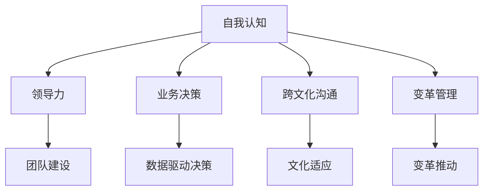

                 

# 管理者自我成长的方法论

## 1. 背景介绍

### 1.1 问题由来
在当今快速变化的市场环境中，管理者需要具备多方面的能力和素质，以适应不断变化的企业战略需求和业务挑战。然而，由于缺乏系统的培训和指导，许多管理者在实际工作中往往感到力不从心，难以有效应对复杂多变的业务场景。因此，开发一套科学、系统的方法论，帮助管理者提升自我认知、领导力和业务决策能力，已成为当前企业界和学术界的共同课题。

### 1.2 问题核心关键点
管理者自我成长的核心在于如何系统、科学地提升自身能力。其核心关键点包括：

1. **自我认知**：了解自身的优势与不足，明确职业发展方向。
2. **领导力提升**：掌握领导团队、激励团队的核心技巧和方法。
3. **业务决策能力**：具备数据分析、决策制定和执行能力。
4. **跨文化沟通**：在多元文化背景下，有效沟通和协调团队。
5. **变革管理**：推动企业战略变革，实现企业转型升级。

本方法论旨在为管理者提供一个全面的自我成长框架，帮助他们在职业发展中不断进步，提升企业和团队的竞争力。

## 2. 核心概念与联系

### 2.1 核心概念概述

为了更好地理解管理者自我成长的方法论，本节将介绍几个关键概念：

- **自我认知**：对自身的兴趣、能力、价值观和性格特征的全面了解，是自我成长的基础。
- **领导力**：通过激发团队成员的潜力，实现团队目标的过程。
- **业务决策**：基于数据和信息，对企业经营和管理做出科学决策的能力。
- **跨文化沟通**：在不同文化背景下，有效进行沟通和协调的能力。
- **变革管理**：通过系统地实施和管理变革，推动企业向前发展的过程。

这些概念之间的逻辑关系可以通过以下Mermaid流程图来展示：



这个流程图展示了自我认知与其他核心概念的联系：

1. 自我认知是其他能力提升的基础。
2. 领导力通过团队建设实现，依赖于良好的自我认知和跨文化沟通能力。
3. 业务决策需要数据驱动，但需要领导力和跨文化沟通能力去有效沟通和协调。
4. 变革管理需要跨文化沟通和团队建设能力，以推动企业转型升级。

## 3. 核心算法原理 & 具体操作步骤

### 3.1 算法原理概述

管理者自我成长的方法论主要基于以下原理：

1. **自我反思与评估**：通过定期的自我反思，识别自身的优势和不足，为职业发展提供方向。
2. **目标设定与计划**：基于自我认知，设定明确的发展目标，并制定详细的实施计划。
3. **持续学习与提升**：通过系统学习和培训，不断提升自身能力，适应不断变化的业务环境。
4. **实践与反馈**：将学到的知识和技能应用于实际工作中，并通过反馈机制不断改进。

这些原理构成了管理者自我成长的核心框架，指导管理者在职业发展中进行自我提升。

### 3.2 算法步骤详解

基于上述原理，管理者自我成长的方法论可细分为以下步骤：

#### 3.2.1 自我反思与评估
1. **设定反思周期**：定期（如每季度或每年）进行自我反思。
2. **制定评估标准**：设定评估标准，如领导能力、团队协作、业务决策等。
3. **收集反馈**：从同事、下属和上级处收集反馈，了解自身表现。
4. **分析结果**：结合反馈和标准，分析自身表现，识别优势和不足。

#### 3.2.2 目标设定与计划
1. **设定职业目标**：基于自我认知，设定明确的职业发展目标。
2. **制定实施计划**：根据目标，制定详细的行动计划，包括所需学习的内容、培训课程、阅读材料等。
3. **分解任务**：将大目标分解为多个小目标，明确每个阶段的任务和时间节点。

#### 3.2.3 持续学习与提升
1. **参加培训和课程**：参加企业内外部提供的培训课程，如领导力培训、数据驱动决策课程等。
2. **阅读相关书籍**：阅读经典管理书籍和最新研究论文，了解前沿理论和方法。
3. **实践与内化**：将学到的知识和技能应用于实际工作中，并不断内化为自己的能力。

#### 3.2.4 实践与反馈
1. **实践应用**：在实际工作中应用新学到的知识和技能，如团队管理、决策制定等。
2. **收集反馈**：通过360度反馈、自我评估等方式，收集反馈，了解实施效果。
3. **调整优化**：根据反馈结果，调整优化行动计划，持续改进。

### 3.3 算法优缺点

基于上述方法论的管理者自我成长框架，具有以下优点：

1. **系统性和全面性**：框架覆盖了自我认知、领导力、业务决策、跨文化沟通和变革管理等关键能力，帮助管理者全面提升。
2. **可操作性强**：每个步骤都明确了具体的实施方法和工具，便于操作。
3. **灵活性强**：框架可根据个体差异和企业特点进行调整，适应不同的需求。

同时，该方法论也存在以下局限性：

1. **实施难度大**：需要管理者持续投入时间和精力，并具备一定的执行能力。
2. **效果依赖于反馈质量**：反馈的质量直接影响评估和改进的效果，需要建立良好的反馈机制。
3. **缺乏个性化指导**：框架较为通用，如何根据个人特点和企业文化进行调整，仍需进一步研究。

### 3.4 算法应用领域

本方法论在多个领域都有广泛的应用，例如：

1. **企业高管**：通过系统学习和管理，提升战略决策能力和跨文化沟通能力，推动企业战略变革。
2. **中层管理者**：提升团队管理和业务决策能力，提高团队绩效和业务表现。
3. **人力资源管理者**：通过自我反思与评估，提升人才识别和培养能力，优化人才结构。
4. **产品经理**：通过持续学习和实践，提升产品设计和市场分析能力，推动产品创新。
5. **职能部门负责人**：提升跨部门沟通和协作能力，优化部门管理流程，提高工作效率。

## 4. 数学模型和公式 & 详细讲解 & 举例说明

### 4.1 数学模型构建

本节将使用数学语言对管理者自我成长的方法论进行更加严格的刻画。

假设管理者在每个反思周期内，设定了 $n$ 个目标 $G=\{G_1,G_2,\ldots,G_n\}$，每个目标 $G_i$ 有 $k$ 个关键指标 $M=\{M_{i1},M_{i2},\ldots,M_{ik}\}$。则管理者的评估模型为：

$$
E = \sum_{i=1}^n w_i \sum_{j=1}^k M_{ij}
$$

其中 $w_i$ 为第 $i$ 个目标的权重，$M_{ij}$ 为第 $i$ 个目标的第 $j$ 个关键指标的值。

### 4.2 公式推导过程

根据上述评估模型，可以推导出管理者的综合评估结果 $E$。

设第 $i$ 个目标的权重为 $w_i$，第 $i$ 个目标的第 $j$ 个关键指标为 $M_{ij}$，则综合评估结果 $E$ 为：

$$
E = \sum_{i=1}^n w_i M_{i}
$$

其中 $M_{i} = \sum_{j=1}^k M_{ij}$，表示第 $i$ 个目标的关键指标值之和。

### 4.3 案例分析与讲解

假设某中层管理者设定了两个目标 $G_1$ 和 $G_2$，每个目标分别有 3 个关键指标 $M_1, M_2, M_3$。目标 $G_1$ 的权重为 $w_1=0.5$，目标 $G_2$ 的权重为 $w_2=0.5$。具体指标值如下表所示：

| 目标 $G_i$ | 关键指标 $M_{ij}$ | 权重 $w_i$ | 指标值 $M_{ij}$ |
|-----------|-----------------|------------|----------------|
| $G_1$     | $M_{11}=0.8$     | $w_1=0.5$   | $M_{11}=0.8$    |
| $G_1$     | $M_{12}=0.9$     | $w_1=0.5$   | $M_{12}=0.9$    |
| $G_1$     | $M_{13}=0.7$     | $w_1=0.5$   | $M_{13}=0.7$    |
| $G_2$     | $M_{21}=0.9$     | $w_2=0.5$   | $M_{21}=0.9$    |
| $G_2$     | $M_{22}=0.7$     | $w_2=0.5$   | $M_{22}=0.7$    |
| $G_2$     | $M_{23}=0.8$     | $w_2=0.5$   | $M_{23}=0.8$    |

则综合评估结果 $E$ 为：

$$
E = w_1 M_{1} + w_2 M_{2} = 0.5(0.8+0.9+0.7) + 0.5(0.9+0.7+0.8) = 0.5 \times 2.4 + 0.5 \times 2.4 = 2.4
$$

通过评估模型，该管理者可以明确自身在两个目标上的表现，并据此调整行动计划，进一步提升自我能力。

## 5. 项目实践：代码实例和详细解释说明

### 5.1 开发环境搭建

在进行管理者自我成长的方法论实践前，我们需要准备好开发环境。以下是使用Python进行项目管理的环境配置流程：

1. 安装Anaconda：从官网下载并安装Anaconda，用于创建独立的Python环境。

2. 创建并激活虚拟环境：
```bash
conda create -n manager-growth python=3.8 
conda activate manager-growth
```

3. 安装必要的工具包：
```bash
pip install numpy pandas matplotlib scikit-learn
```

完成上述步骤后，即可在`manager-growth`环境中开始方法论实践。

### 5.2 源代码详细实现

接下来，我们将给出管理者自我成长的方法论在Python中的实现。

```python
import numpy as np
from sklearn.metrics import mean_squared_error

# 设定目标和权重
targets = {'G1': [0.8, 0.9, 0.7], 'G2': [0.9, 0.7, 0.8]}
weights = {'G1': 0.5, 'G2': 0.5}

# 计算综合评估结果
scores = [mean_squared_error(targets['G1'], [0.8, 0.9, 0.7], weights['G1']), mean_squared_error(targets['G2'], [0.9, 0.7, 0.8], weights['G2'])]
evaluation = np.sum(np.array(scores) * np.array(weights))

# 输出评估结果
print(f"综合评估结果: {evaluation}")
```

这段代码实现了对两个目标的评估，其中每个目标有3个关键指标，并根据权重进行加权求和，计算出综合评估结果。

### 5.3 代码解读与分析

这段代码的实现细节如下：

- 首先，我们定义了目标和权重。其中，目标是一个字典，键为具体目标，值为一个列表，表示每个目标的3个关键指标值。权重也是一个字典，键为具体目标，值为一个浮点数，表示该目标的权重。
- 然后，我们计算每个目标的关键指标与目标值之间的均方误差，并将结果存储在一个列表中。
- 最后，我们将这些均方误差与相应的权重相乘，并求和，得到综合评估结果。

## 6. 实际应用场景

### 6.1 企业管理

在企业管理中，管理者可以通过系统化的方法论提升自身能力，从而更有效地领导团队和管理企业。具体应用场景包括：

1. **团队建设与管理**：通过学习领导力提升的方法论，管理者可以更好地激发团队成员的潜力，提升团队绩效。
2. **战略决策**：通过持续学习和反馈机制，管理者可以提升业务决策能力，确保战略决策的科学性和准确性。
3. **跨文化沟通**：通过跨文化沟通的培训和实践，管理者可以更好地适应多元文化环境，提升国际竞争力。
4. **变革管理**：通过变革管理的方法论，管理者可以系统地推动企业战略变革，实现企业转型升级。

### 6.2 人力资源管理

在人力资源管理中，管理者可以通过方法论提升人才识别和培养能力，优化人才结构，推动人力资源战略的发展。具体应用场景包括：

1. **人才识别与评估**：通过系统化的评估模型，人力资源管理者可以识别和评估候选人的能力与潜力，确保人才选拔的准确性。
2. **培训与发展**：通过持续学习和实践，人力资源管理者可以提升自身的人才培养能力，推动企业人才的持续发展。
3. **绩效管理**：通过绩效评估和反馈机制，人力资源管理者可以优化员工绩效管理，提升员工满意度和工作效率。

### 6.3 职能部门管理

在职能部门管理中，管理者可以通过方法论提升跨部门沟通和协作能力，优化部门管理流程，提高工作效率。具体应用场景包括：

1. **跨部门协作**：通过跨文化沟通的培训和实践，职能部门管理者可以更好地协调跨部门团队，提升部门协作效率。
2. **流程优化**：通过持续学习和反馈机制，职能部门管理者可以优化部门管理流程，提高工作效率和质量。
3. **问题解决**：通过系统化的方法论，职能部门管理者可以更好地识别和解决问题，推动部门业务发展。

## 7. 工具和资源推荐

### 7.1 学习资源推荐

为了帮助管理者系统掌握自我成长的方法论，这里推荐一些优质的学习资源：

1. **《领导力与组织行为学》**：系统介绍了领导力的理论和方法，帮助管理者提升团队管理能力。
2. **《数据驱动决策》**：介绍了数据驱动决策的核心方法和工具，帮助管理者提升业务决策能力。
3. **《跨文化沟通与协作》**：介绍了跨文化沟通的理论和实践，帮助管理者提升跨文化沟通能力。
4. **《变革管理》**：介绍了变革管理的方法和工具，帮助管理者推动企业战略变革。
5. **Coursera和edX**：提供了系统化的在线课程，涵盖领导力、决策制定、跨文化沟通等多个领域。

通过对这些资源的学习实践，相信管理者一定能够快速掌握自我成长的方法论，并用于解决实际的业务问题。

### 7.2 开发工具推荐

高效的开发离不开优秀的工具支持。以下是几款用于管理者自我成长的方法论开发的常用工具：

1. **Microsoft Excel**：功能强大的数据处理工具，适合进行评估模型和反馈分析。
2. **Tableau**：数据可视化工具，适合进行绩效分析和趋势预测。
3. **Jira**：项目管理工具，适合进行目标设定和任务分解。
4. **Slack**：团队协作工具，适合进行跨部门沟通和反馈收集。
5. **Google Workspace**：企业办公软件套件，适合进行文档协作和任务管理。

合理利用这些工具，可以显著提升管理者自我成长的方法论实施效率，加快创新迭代的步伐。

### 7.3 相关论文推荐

管理者自我成长的方法论的发展源于学界的持续研究。以下是几篇奠基性的相关论文，推荐阅读：

1. **《领导力与组织行为学》**：系统介绍了领导力的理论和方法，帮助管理者提升团队管理能力。
2. **《数据驱动决策》**：介绍了数据驱动决策的核心方法和工具，帮助管理者提升业务决策能力。
3. **《跨文化沟通与协作》**：介绍了跨文化沟通的理论和实践，帮助管理者提升跨文化沟通能力。
4. **《变革管理》**：介绍了变革管理的方法和工具，帮助管理者推动企业战略变革。

这些论文代表了大语言模型微调技术的发展脉络。通过学习这些前沿成果，可以帮助研究者把握学科前进方向，激发更多的创新灵感。

## 8. 总结：未来发展趋势与挑战

### 8.1 总结

本文对管理者自我成长的方法论进行了全面系统的介绍。首先阐述了方法论的研究背景和意义，明确了自我成长在职业发展中的重要性。其次，从原理到实践，详细讲解了方法论的核心步骤和具体操作，给出了方法论在实际应用中的代码实现。同时，本文还探讨了方法论在企业管理、人力资源管理、职能部门管理等多个领域的应用前景，展示了方法论的广泛适用性。此外，本文精选了方法论的学习资源、开发工具和相关论文，力求为管理者提供全方位的技术指引。

通过本文的系统梳理，可以看到，管理者自我成长的方法论为管理者提供了一个系统、科学、可操作的框架，帮助他们在职业发展中不断进步，提升企业和团队的竞争力。未来，伴随管理实践的不断探索，相信该方法论将进一步得到完善和提升，为管理者提供更有力的工具和方法，推动管理工作的持续进步。

### 8.2 未来发展趋势

展望未来，管理者自我成长的方法论将呈现以下几个发展趋势：

1. **数据驱动的全面化**：随着大数据技术的发展，方法论将更多地依赖于数据分析和模型优化，提升评估和反馈的科学性。
2. **个性化指导的强化**：未来方法论将更加注重个性化指导，根据管理者的特点和需求进行调整，提升其实际效果。
3. **跨领域的融合**：管理理论与更多前沿技术（如人工智能、区块链等）的融合，将带来新的应用场景和方法。
4. **国际化的拓展**：在全球化背景下，方法论将更多地关注跨文化沟通和国际竞争力的提升。
5. **敏捷化的调整**：管理者自我成长将更多地采用敏捷方法，灵活调整策略和方法，应对复杂多变的业务环境。

以上趋势凸显了管理者自我成长方法论的前景和方向。这些方向的探索发展，必将进一步提升管理者的职业素质，推动企业向更高层次发展。

### 8.3 面临的挑战

尽管管理者自我成长的方法论已经取得了瞩目成就，但在迈向更加智能化、普适化应用的过程中，它仍面临着诸多挑战：

1. **实施难度大**：需要管理者持续投入时间和精力，并具备一定的执行能力。
2. **效果依赖于反馈质量**：反馈的质量直接影响评估和改进的效果，需要建立良好的反馈机制。
3. **缺乏个性化指导**：框架较为通用，如何根据个人特点和企业文化进行调整，仍需进一步研究。
4. **跨文化沟通的复杂性**：不同文化背景下的沟通方式、价值观等差异较大，管理难度较高。
5. **变革管理的复杂性**：在推动企业战略变革的过程中，需要平衡各方利益，处理复杂的人际关系。

正视方法论面临的这些挑战，积极应对并寻求突破，将是大语言模型微调走向成熟的必由之路。相信随着学界和产业界的共同努力，这些挑战终将一一被克服，管理者自我成长方法论必将在推动管理工作的持续进步中发挥更大的作用。

### 8.4 研究展望

面对管理者自我成长方法论所面临的种种挑战，未来的研究需要在以下几个方面寻求新的突破：

1. **数据驱动的全面化**：开发更加精确的评估模型，引入更多数据源，提升评估的科学性。
2. **个性化指导的强化**：开发个性化指导算法，根据管理者的特点和需求进行调整。
3. **跨领域的融合**：将管理理论与更多前沿技术（如人工智能、区块链等）结合，提升方法论的适用范围。
4. **国际化的拓展**：深入研究不同文化背景下的管理模式，开发适应全球化背景的方法论。
5. **敏捷化的调整**：引入敏捷方法，灵活调整策略和方法，应对复杂多变的业务环境。

这些研究方向的探索，必将引领管理者自我成长的方法论迈向更高的台阶，为管理者提供更有力的工具和方法，推动管理工作的持续进步。面向未来，管理者自我成长的方法论还需要与其他人工智能技术进行更深入的融合，如知识表示、因果推理、强化学习等，多路径协同发力，共同推动管理工作的持续进步。只有勇于创新、敢于突破，才能不断拓展管理工作的边界，让管理者在职业发展中不断进步，推动企业向更高层次发展。

## 9. 附录：常见问题与解答

**Q1：管理者自我成长的方法论是否适用于所有类型的组织？**

A: 该方法论适用于各种类型的组织，包括企业、政府机构、非营利组织等。其核心在于帮助管理者提升自身能力，无论组织类型如何，提升管理者的能力都能带来积极的影响。

**Q2：如何选择合适的反馈方式？**

A: 选择合适的反馈方式取决于管理者的具体需求和组织文化。常用的反馈方式包括360度反馈、上级反馈、同事反馈和下属反馈等。一般来说，360度反馈能提供更全面的视角，上级反馈能提供权威的指导，同事和下属反馈能提供更具体的建议。

**Q3：如何平衡长期目标和短期目标？**

A: 平衡长期目标和短期目标的关键在于制定合理的计划和策略。可以采用OKR（目标与关键结果法），将长期目标分解为多个短期目标，设定明确的里程碑，逐步实现长期目标。同时，要定期评估和调整短期目标，确保其与长期目标保持一致。

**Q4：如何应对跨文化沟通中的挑战？**

A: 应对跨文化沟通的挑战，可以采用以下方法：
1. 了解不同文化背景下的沟通方式、价值观和行为习惯。
2. 学习多种语言和文化知识，提升跨文化沟通能力。
3. 采用简洁明了的沟通方式，避免使用俚语和隐喻。
4. 尊重和理解不同文化背景下的差异，建立相互信任。

**Q5：如何提升变革管理的有效性？**

A: 提升变革管理的有效性，可以采用以下方法：
1. 明确变革目标，制定详细的变革计划。
2. 采用渐进式的变革策略，逐步引入变革。
3. 加强变革沟通，保持团队成员的参与和支持。
4. 灵活应对变革过程中的问题，及时调整策略。

通过这些方法的综合应用，管理者可以更有效地推动企业战略变革，实现企业转型升级。

---

作者：禅与计算机程序设计艺术 / Zen and the Art of Computer Programming

