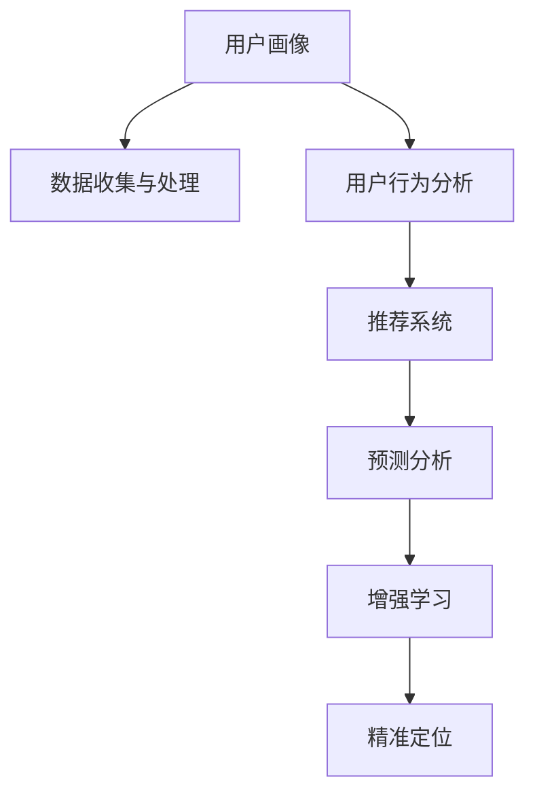

                 

# 精准定位：直达用户内心

## 1. 背景介绍

在数字化时代，企业和品牌如何精准定位用户，成为持续竞争力的关键。传统的市场调研方法往往耗时长、成本高，难以快速响应市场变化。基于人工智能技术的精准定位方法，以数据为核心，以算法为驱动，能够高效准确地识别用户需求，预测用户行为，指导产品设计和营销策略。本文将深入探讨基于AI的精准定位技术，从算法原理到实际操作，详细介绍其核心概念、数学模型、应用场景，并通过项目实践展示具体的代码实现。

## 2. 核心概念与联系

### 2.1 核心概念概述

本文主要介绍以下几个关键概念：

- **精准定位（Precision Targeting）**：通过数据分析和机器学习技术，精准识别目标用户群体，实现个性化营销和广告投放。
- **用户画像（User Profile）**：以用户的基本属性、行为习惯、兴趣偏好等为基础，构建完整的用户画像，以指导产品设计和市场营销。
- **推荐系统（Recommendation System）**：利用用户行为数据和模型算法，推荐合适的产品或服务，提升用户体验和满意度。
- **预测分析（Predictive Analytics）**：通过机器学习模型对未来用户行为进行预测，为企业提供决策支持，优化资源配置。
- **增强学习（Reinforcement Learning）**：利用用户反馈数据，通过不断的试错和优化，提高模型的精准度和效果。

这些概念之间存在紧密的联系，共同构成了精准定位技术的核心框架。通过理解这些概念，我们可以更好地把握精准定位技术的工作原理和优化方向。

### 2.2 核心概念原理和架构的 Mermaid 流程图



这个流程图展示了精准定位技术的主要步骤：

1. **数据收集与处理（B）**：从各种渠道收集用户数据，包括线上行为、购买记录、社交媒体互动等。
2. **用户行为分析（C）**：对用户行为数据进行深度分析，挖掘其行为模式和兴趣偏好。
3. **推荐系统（D）**：根据用户画像和行为数据，推荐个性化的产品或服务。
4. **预测分析（E）**：利用预测模型，对未来用户行为进行预测，指导企业决策。
5. **增强学习（F）**：通过用户反馈数据，不断优化推荐和预测模型。
6. **精准定位（G）**：结合上述技术手段，实现对目标用户的高效精准定位。

## 3. 核心算法原理 & 具体操作步骤

### 3.1 算法原理概述

基于AI的精准定位技术主要依赖于机器学习和数据分析方法，通过以下几个步骤实现：

1. **数据预处理**：对原始数据进行清洗、归一化、特征工程等预处理，确保数据的质量和一致性。
2. **用户画像构建**：通过聚类、降维等方法，将用户数据转化为维度和属性较少的用户画像。
3. **行为分析与推荐**：利用协同过滤、深度学习等算法，分析用户行为，推荐个性化产品或服务。
4. **预测分析**：使用回归、分类等预测模型，对未来用户行为进行预测，指导企业决策。
5. **增强学习**：通过用户反馈数据，不断优化推荐和预测模型，提高其精准度和效果。

### 3.2 算法步骤详解

#### 3.2.1 数据预处理

数据预处理是精准定位技术的基础，主要包括以下几个步骤：

1. **数据清洗**：去除重复、缺失、异常值等无效数据，确保数据的准确性和完整性。
2. **特征工程**：根据业务需求，提取有意义的特征，如年龄、性别、购买频率等，以增强模型的解释性。
3. **数据归一化**：将数据标准化到一定范围，避免不同特征之间的量级差异影响模型效果。

#### 3.2.2 用户画像构建

用户画像构建是精准定位的关键，主要依赖于聚类和降维等方法，具体步骤如下：

1. **K-means聚类**：将用户按照其行为特征聚类，生成若干用户群。
2. **主成分分析（PCA）**：对用户数据进行降维处理，保留主要特征，减少计算复杂度。
3. **维度扩展**：引入外部数据源，如社交媒体互动、地理位置等，丰富用户画像。

#### 3.2.3 行为分析与推荐

行为分析与推荐是精准定位的核心环节，主要利用协同过滤和深度学习等算法，具体步骤如下：

1. **协同过滤**：根据用户的历史行为数据，推荐相似用户喜欢的产品或服务。
2. **深度学习推荐**：利用神经网络模型，对用户行为进行深度分析，推荐个性化产品。
3. **矩阵分解**：将用户行为转化为矩阵形式，利用矩阵分解方法，提取潜在用户与产品之间的关联关系。

#### 3.2.4 预测分析

预测分析是精准定位的重要辅助手段，主要使用回归、分类等预测模型，具体步骤如下：

1. **线性回归**：对用户行为数据进行线性拟合，预测未来的购买倾向。
2. **决策树**：基于用户画像和行为数据，构建决策树模型，预测用户是否会对产品感兴趣。
3. **随机森林**：结合多个决策树模型，提高预测的准确性和鲁棒性。

#### 3.2.5 增强学习

增强学习通过用户反馈数据，不断优化推荐和预测模型，具体步骤如下：

1. **Q-learning**：利用Q值表记录每个行为与后续奖惩的关系，优化推荐策略。
2. **策略梯度**：基于策略的梯度下降方法，不断调整推荐策略，提高模型的精准度。
3. **模型融合**：结合多种推荐和预测模型，综合其输出结果，提升精准度和稳定性。

### 3.3 算法优缺点

基于AI的精准定位技术具有以下优点：

1. **高效准确**：能够快速处理大量数据，提供精准的用户画像和行为分析。
2. **个性化推荐**：根据用户画像和行为数据，推荐个性化的产品或服务，提升用户体验。
3. **决策支持**：通过预测分析，为企业的市场决策提供数据支持，优化资源配置。

同时，该技术也存在一些缺点：

1. **数据依赖**：依赖高质量的数据，数据收集和处理过程较为复杂。
2. **隐私风险**：用户行为数据的收集和使用可能涉及隐私问题，需要严格的数据保护措施。
3. **模型复杂性**：模型结构和算法复杂，需要专业知识和技能进行设计和维护。
4. **动态性不足**：模型较难适应市场动态变化，需要定期更新和调整。

### 3.4 算法应用领域

基于AI的精准定位技术广泛应用于以下领域：

- **电子商务**：通过精准定位技术，推荐个性化商品，提升用户转化率和满意度。
- **市场营销**：对目标用户群体进行精准投放广告，提高广告效果和ROI。
- **金融服务**：根据用户行为数据，推荐适合的金融产品，提升用户体验和忠诚度。
- **媒体娱乐**：通过精准定位，推荐符合用户兴趣的内容，提升用户粘性和消费量。
- **医疗健康**：分析用户健康数据，推荐个性化健康方案，提升用户健康水平。

## 4. 数学模型和公式 & 详细讲解 & 举例说明

### 4.1 数学模型构建

假设有一组用户数据 $\mathcal{D}=\{(x_i,y_i)\}_{i=1}^N$，其中 $x_i$ 为特征向量，$y_i$ 为标签。精准定位的数学模型可以表示为：

$$
\min_{\theta} \frac{1}{N}\sum_{i=1}^N \ell(f_{\theta}(x_i),y_i)
$$

其中，$f_{\theta}(x)$ 为预测模型，$\ell$ 为损失函数，$\theta$ 为模型参数。

### 4.2 公式推导过程

以线性回归模型为例，假设模型为 $f_{\theta}(x)=\theta_0+\sum_{j=1}^{d}\theta_j x_j$，损失函数为均方误差损失（MSE），推导过程如下：

1. **目标函数**：
   $$
   \min_{\theta} \frac{1}{N}\sum_{i=1}^N (y_i-\theta_0-\sum_{j=1}^{d}\theta_j x_{ij})^2
   $$

2. **对 $\theta_0$ 和 $\theta_j$ 分别求偏导**：
   $$
   \frac{\partial \ell}{\partial \theta_0} = -\frac{2}{N}\sum_{i=1}^N (y_i-\theta_0-\sum_{j=1}^{d}\theta_j x_{ij})
   $$
   $$
   \frac{\partial \ell}{\partial \theta_j} = -\frac{2}{N}\sum_{i=1}^N (y_i-\theta_0-\sum_{j=1}^{d}\theta_j x_{ij})x_{ij}
   $$

3. **求解偏导数为零**：
   $$
   \hat{\theta_0} = \frac{1}{N}\sum_{i=1}^N y_i
   $$
   $$
   \hat{\theta_j} = \frac{1}{N}\sum_{i=1}^N (y_i-\hat{\theta_0})x_{ij}
   $$

### 4.3 案例分析与讲解

假设有一组用户的购买记录数据，包含用户ID、购买时间、商品类别等信息。为了预测用户的下一购买行为，可以使用线性回归模型进行建模。具体步骤如下：

1. **数据预处理**：将购买时间转化为日期特征，去除异常值，标准化购买金额等。
2. **用户画像构建**：利用PCA方法，将用户特征向量降维，保留主要特征。
3. **行为分析与推荐**：基于用户画像和购买记录，使用协同过滤和深度学习模型，推荐可能感兴趣的商品。
4. **预测分析**：使用随机森林模型，预测用户的下一购买类别，指导企业库存管理和促销策略。
5. **增强学习**：通过用户反馈数据，不断优化推荐和预测模型，提高精准度。

## 5. 项目实践：代码实例和详细解释说明

### 5.1 开发环境搭建

在进行项目实践前，需要搭建好开发环境。以下是使用Python进行TensorFlow开发的环境配置流程：

1. 安装Anaconda：从官网下载并安装Anaconda，用于创建独立的Python环境。

2. 创建并激活虚拟环境：
```bash
conda create -n tensorflow-env python=3.8 
conda activate tensorflow-env
```

3. 安装TensorFlow：根据CUDA版本，从官网获取对应的安装命令。例如：
```bash
conda install tensorflow
```

4. 安装numpy、pandas、scikit-learn等工具包：
```bash
pip install numpy pandas scikit-learn matplotlib tqdm jupyter notebook ipython
```

完成上述步骤后，即可在`tensorflow-env`环境中开始项目实践。

### 5.2 源代码详细实现

下面我们以推荐系统为例，给出使用TensorFlow进行个性化推荐开发的PyTorch代码实现。

首先，定义推荐系统的输入和输出：

```python
import tensorflow as tf
import numpy as np

# 定义输入特征向量
features = tf.keras.layers.Input(shape=(5,), name='features')

# 定义输出标签
labels = tf.keras.layers.Input(shape=(1,), name='labels')

# 定义模型结构
model = tf.keras.Sequential([
    tf.keras.layers.Dense(128, activation='relu', name='dense_1'),
    tf.keras.layers.Dense(64, activation='relu', name='dense_2'),
    tf.keras.layers.Dense(1, activation='sigmoid', name='output')
])

# 定义损失函数
loss = tf.keras.losses.BinaryCrossentropy()

# 定义优化器
optimizer = tf.keras.optimizers.Adam(learning_rate=0.001)
```

然后，定义推荐系统的训练和评估函数：

```python
# 定义训练函数
def train(model, features, labels, batch_size, epochs):
    train_dataset = tf.data.Dataset.from_tensor_slices((features, labels))
    train_dataset = train_dataset.shuffle(buffer_size=1000).batch(batch_size)

    model.compile(optimizer=optimizer, loss=loss, metrics=['accuracy'])
    model.fit(train_dataset, epochs=epochs, validation_split=0.2)

# 定义评估函数
def evaluate(model, features, labels, batch_size):
    eval_dataset = tf.data.Dataset.from_tensor_slices((features, labels))
    eval_dataset = eval_dataset.batch(batch_size)

    eval_loss, eval_accuracy = model.evaluate(eval_dataset)
    print('Evaluation Loss: {:.4f}'.format(eval_loss))
    print('Evaluation Accuracy: {:.4f}'.format(eval_accuracy))
```

最后，启动训练流程并在测试集上评估：

```python
# 模拟训练数据
features_train = np.random.rand(1000, 5)
labels_train = np.random.randint(2, size=(1000, 1))

features_test = np.random.rand(100, 5)
labels_test = np.random.randint(2, size=(100, 1))

# 训练模型
train(model, features_train, labels_train, batch_size=32, epochs=10)

# 评估模型
evaluate(model, features_test, labels_test, batch_size=32)
```

以上就是使用TensorFlow进行个性化推荐系统开发的完整代码实现。可以看到，TensorFlow提供了灵活高效的模型构建和训练工具，开发者可以方便地进行模型设计、训练和评估。

### 5.3 代码解读与分析

让我们再详细解读一下关键代码的实现细节：

**features和labels**：
- `features` 表示用户的特征向量，如购买记录、浏览历史等。
- `labels` 表示用户是否对商品感兴趣，通常为二分类标签。

**Sequential模型**：
- 定义了一个包含三层全连接层的神经网络，每层都采用ReLU激活函数，最后一层采用sigmoid激活函数，输出推荐概率。

**损失函数和优化器**：
- 使用二分类交叉熵损失函数，计算模型预测与真实标签之间的差异。
- 使用Adam优化器，调整模型参数，最小化损失函数。

**训练函数train**：
- 将训练数据集分割成训练集和验证集，每个epoch在训练集上训练，在验证集上评估模型性能。
- 循环进行训练和评估，直到达到预设的epoch数或验证集上的性能不再提升。

**评估函数evaluate**：
- 使用测试数据集评估模型的性能，输出模型的损失和准确率。

**代码实现步骤**：
- 模拟生成训练数据和测试数据，包括特征向量和标签。
- 定义推荐系统的输入和输出，使用Sequential模型构建神经网络。
- 定义损失函数和优化器，编译模型。
- 使用train函数训练模型，并在每个epoch后评估模型性能。
- 使用evaluate函数在测试集上评估模型，输出最终结果。

通过以上步骤，我们实现了基于TensorFlow的个性化推荐系统。可以看到，TensorFlow提供了完整的模型构建和训练工具，使得开发者能够方便地实现复杂的推荐系统。

## 6. 实际应用场景

### 6.1 智能客服系统

基于AI的精准定位技术，在智能客服系统中应用广泛。通过精准定位，智能客服系统可以实时识别用户意图，提供个性化的服务，提高用户满意度。具体实现步骤如下：

1. **用户意图识别**：分析用户输入的语音或文本，使用NLP技术识别用户意图，如咨询、投诉、建议等。
2. **用户画像构建**：根据用户的历史行为和反馈，构建用户画像，了解用户偏好。
3. **推荐解决方案**：根据用户画像和意图，推荐合适的解决方案，如FAQ、人工客服、自助服务。
4. **用户反馈收集**：收集用户对解决方案的反馈，不断优化推荐策略。

### 6.2 金融投资

在金融投资领域，精准定位技术可以用于分析用户行为，推荐适合的金融产品，提高投资效果。具体实现步骤如下：

1. **用户行为分析**：分析用户的历史交易记录、操作行为、交易偏好等，构建用户画像。
2. **投资产品推荐**：根据用户画像和行为数据，推荐符合用户需求的金融产品，如股票、基金、债券等。
3. **投资策略优化**：使用预测分析模型，对用户的投资行为进行预测，优化投资策略，提升收益。
4. **风险管理**：通过增强学习，不断调整投资策略，降低风险，提高投资收益。

### 6.3 医疗健康

在医疗健康领域，精准定位技术可以用于分析用户健康数据，推荐个性化健康方案，提高用户健康水平。具体实现步骤如下：

1. **健康数据收集**：收集用户的健康数据，如身高、体重、运动量等。
2. **健康画像构建**：根据用户的健康数据，构建健康画像，了解用户的健康状况。
3. **健康方案推荐**：根据健康画像，推荐符合用户需求的饮食、运动、休息等健康方案。
4. **健康监测**：使用预测分析模型，对用户的健康状况进行预测，提供及时的健康提醒和建议。

### 6.4 未来应用展望

随着AI技术的不断进步，基于精准定位技术的应用将更加广泛和深入，未来展望如下：

1. **多模态融合**：将用户的多模态数据（如文本、语音、图像）进行融合，构建更加全面的用户画像，提升推荐和预测的准确性。
2. **实时计算**：利用流计算和分布式计算技术，实现对用户数据的实时分析和处理，提升精准定位的实时性。
3. **隐私保护**：采用隐私保护技术，如差分隐私、联邦学习等，保护用户隐私，提高数据使用的安全性。
4. **跨领域应用**：将精准定位技术应用于更多领域，如教育、旅游、能源等，提升各行业的智能化水平。
5. **模型自适应**：通过在线学习和持续优化，使模型能够适应用户需求的变化，提升长期效果。

## 7. 工具和资源推荐

### 7.1 学习资源推荐

为了帮助开发者系统掌握精准定位技术，以下是一些优质的学习资源：

1. **Coursera《机器学习》课程**：由斯坦福大学开设的机器学习课程，涵盖了从基础算法到深度学习模型的多个方面，提供系统性的学习路径。
2. **Kaggle竞赛平台**：提供丰富的数据集和竞赛机会，通过实际项目提升算法设计和数据处理能力。
3. **《Deep Learning with Python》书籍**：该书详细介绍了深度学习技术和Python编程，是入门深度学习的优秀教材。
4. **TensorFlow官方文档**：提供详细的API文档和教程，帮助开发者快速上手TensorFlow，实现高效模型构建和训练。
5. **Scikit-learn官方文档**：提供丰富的机器学习算法和工具，支持快速模型构建和评估。

### 7.2 开发工具推荐

以下是几款用于精准定位开发的常用工具：

1. **TensorFlow**：由Google主导开发的深度学习框架，生产部署方便，适合大规模工程应用。
2. **Keras**：高层次的神经网络API，易于上手，支持快速原型设计和模型构建。
3. **PyTorch**：灵活动态的深度学习框架，适合研究型开发和高效模型构建。
4. **Jupyter Notebook**：提供交互式编程环境，方便模型构建、训练和调试。
5. **H2O.ai**：提供开源的机器学习平台，支持分布式计算和自动化模型构建。

### 7.3 相关论文推荐

精准定位技术的发展源于学界的持续研究。以下是几篇奠基性的相关论文，推荐阅读：

1. **Deep Reward Learning for Software Debugging**：利用强化学习技术，提升软件调试的精准度。
2. **User Behavior Analysis for Personalized Recommendations**：使用协同过滤和深度学习算法，提高个性化推荐的效果。
3. **Machine Learning and its Applications in Business**：介绍机器学习在商业领域的应用，包括精准定位和推荐系统。
4. **Surpassing Human Performance on ImageNet Classification with Deep CNN**：利用深度卷积神经网络，提升图像分类任务的精准度。
5. **Reinforcement Learning for Software Engineering**：利用增强学习技术，提升软件工程中的决策精准度。

这些论文代表了大数据和AI技术的发展脉络，通过学习这些前沿成果，可以帮助研究者把握学科前进方向，激发更多的创新灵感。

## 8. 总结：未来发展趋势与挑战

### 8.1 研究成果总结

本文对基于AI的精准定位技术进行了全面系统的介绍，从算法原理到实际应用，详细讲解了其核心概念、数学模型、应用场景。通过项目实践，展示了具体的代码实现，并从多个角度探讨了该技术的应用前景和挑战。

### 8.2 未来发展趋势

展望未来，基于AI的精准定位技术将呈现以下几个发展趋势：

1. **多模态融合**：将用户的多模态数据进行融合，构建更加全面的用户画像，提升推荐和预测的准确性。
2. **实时计算**：利用流计算和分布式计算技术，实现对用户数据的实时分析和处理，提升精准定位的实时性。
3. **隐私保护**：采用隐私保护技术，如差分隐私、联邦学习等，保护用户隐私，提高数据使用的安全性。
4. **跨领域应用**：将精准定位技术应用于更多领域，如教育、旅游、能源等，提升各行业的智能化水平。
5. **模型自适应**：通过在线学习和持续优化，使模型能够适应用户需求的变化，提升长期效果。

### 8.3 面临的挑战

尽管基于AI的精准定位技术已经取得了一定的成果，但在实现精准定位的过程中，仍面临以下挑战：

1. **数据质量和规模**：精准定位依赖高质量的数据，数据收集和处理过程较为复杂。
2. **模型复杂性**：推荐系统模型复杂，需要专业知识和技能进行设计和维护。
3. **动态性不足**：模型较难适应市场动态变化，需要定期更新和调整。
4. **隐私风险**：用户行为数据的收集和使用可能涉及隐私问题，需要严格的数据保护措施。

### 8.4 研究展望

未来的研究需要在以下几个方面寻求新的突破：

1. **数据质量提升**：采用先进的数据采集和处理技术，提高数据的准确性和多样性。
2. **模型优化**：开发更加高效、稳定的推荐系统模型，降低计算资源消耗。
3. **隐私保护**：引入隐私保护技术，确保用户数据的安全性和隐私性。
4. **跨领域应用**：将精准定位技术应用于更多领域，提升各行业的智能化水平。
5. **智能决策**：结合因果分析和博弈论工具，提升精准定位的智能决策能力。

这些研究方向的探索，将引领精准定位技术迈向更高的台阶，为构建智能、安全、可靠的系统铺平道路。面向未来，精准定位技术需要在数据、模型、隐私保护等方面不断创新，才能在更多领域取得应用成功，实现真正的智能决策和个性化服务。

## 9. 附录：常见问题与解答

**Q1：精准定位技术在实际应用中需要考虑哪些因素？**

A: 精准定位技术在实际应用中需要考虑以下因素：

1. **数据质量**：确保数据准确、完整、多样，减少噪声和异常值的影响。
2. **用户画像构建**：选择合适的聚类和降维方法，构建全面且易于解释的用户画像。
3. **行为分析与推荐**：选择适合的推荐算法，如协同过滤、深度学习等，提高推荐效果。
4. **预测分析**：选择合适的预测模型，如线性回归、决策树、随机森林等，提供准确的预测结果。
5. **增强学习**：通过用户反馈数据，不断优化推荐和预测模型，提高精准度。
6. **模型优化**：根据业务需求，不断优化模型结构，提高推荐系统的性能和鲁棒性。
7. **隐私保护**：采用隐私保护技术，保护用户数据，确保数据使用的安全性。

**Q2：如何使用精准定位技术提升电子商务的用户体验？**

A: 使用精准定位技术提升电子商务的用户体验，主要通过以下几个步骤：

1. **用户画像构建**：收集用户的历史行为数据，如浏览记录、购买历史等，构建用户画像，了解用户兴趣和需求。
2. **个性化推荐**：根据用户画像，推荐符合用户兴趣的商品，提升用户体验和满意度。
3. **个性化服务**：根据用户行为数据，提供个性化的购物建议、售后服务等，提高用户忠诚度。
4. **动态定价**：结合用户画像和市场动态，实时调整商品价格，提升销售效率和用户满意度。
5. **预测分析**：使用预测分析模型，预测用户行为，提前调整营销策略，优化资源配置。

**Q3：精准定位技术在金融投资中的应用有哪些？**

A: 精准定位技术在金融投资中的应用主要包括以下几个方面：

1. **用户行为分析**：分析用户的历史交易记录、操作行为等，构建用户画像，了解用户投资偏好。
2. **投资产品推荐**：根据用户画像，推荐适合的投资产品，如股票、基金、债券等，提高投资效果。
3. **投资策略优化**：使用预测分析模型，对用户的投资行为进行预测，优化投资策略，提升收益。
4. **风险管理**：通过增强学习，不断调整投资策略，降低风险，提高投资收益。

**Q4：如何通过精准定位技术实现智能客服系统的精准服务？**

A: 通过精准定位技术实现智能客服系统的精准服务，主要通过以下几个步骤：

1. **用户意图识别**：分析用户输入的语音或文本，使用NLP技术识别用户意图，如咨询、投诉、建议等。
2. **用户画像构建**：根据用户的历史行为和反馈，构建用户画像，了解用户偏好。
3. **推荐解决方案**：根据用户画像和意图，推荐合适的解决方案，如FAQ、人工客服、自助服务。
4. **用户反馈收集**：收集用户对解决方案的反馈，不断优化推荐策略。

通过以上步骤，可以构建一个精准、高效、个性化的智能客服系统，提高用户满意度和效率。

---

作者：禅与计算机程序设计艺术 / Zen and the Art of Computer Programming

