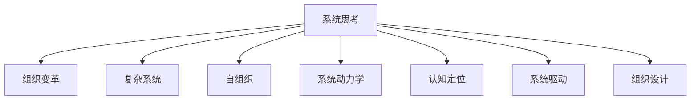

                 

# 系统思考在组织变革中的应用

> 关键词：系统思考,组织变革,复杂系统,自组织,系统动力学,认知定位,系统驱动,组织设计

## 1. 背景介绍

### 1.1 问题由来

在数字化转型的浪潮下，组织面临着前所未有的挑战与机遇。传统的层级式组织架构和线性思维方式已无法应对复杂多变的市场环境。如何通过系统思考（Systems Thinking）重新设计组织架构，提升组织敏捷性和灵活性，成为企业持续发展的关键问题。

### 1.2 问题核心关键点

系统思考是指通过对组织内外部环境的全局性、系统性理解，找到影响组织发展的关键因素和关系，进而进行优化设计的过程。核心关键点包括：

- 全局视角：超越局部利益，从整体上看待问题。
- 系统连接：关注各部分间相互影响和依赖关系。
- 动态变化：理解系统内外部环境变化及其影响。
- 反馈机制：建立有效的反馈回路，促进系统自适应。

系统思考与传统的管理思维不同，它强调全局、系统、动态和反馈，能够帮助组织更科学地应对复杂变化，提升战略执行力和创新能力。

## 2. 核心概念与联系

### 2.1 核心概念概述

系统思考和组织变革紧密相关，涵盖以下概念：

- **系统思考**：通过对系统性、全局性和动态性的理解，识别和优化系统内的关键变量和关系，以达成整体目标。
- **组织变革**：通过系统性地重新设计组织结构、流程和人员，提升组织适应性、灵活性和绩效。
- **复杂系统**：指由大量相互关联的子系统构成的系统，具有非线性、自组织、动态变化等特点。
- **自组织**：系统内部各子系统能够通过相互作用自动形成有序结构，无需外部干预。
- **系统动力学**：研究系统内各部分间动态相互作用和反馈机制的学科。
- **认知定位**：通过系统思考框架对系统内各部分及其相互作用进行定位和分析。
- **系统驱动**：由系统内关键变量和反馈机制驱动的变革，而非单一要素驱动。
- **组织设计**：基于系统思考原理设计的组织结构、流程和人员配置。

这些概念间的联系可通过以下Mermaid流程图展示：



此图展示了系统思考在组织变革中的关键作用，通过系统思考，能够更好地理解复杂系统，推动自组织和系统驱动的变革，设计出更有效的组织结构。

## 3. 核心算法原理 & 具体操作步骤

### 3.1 算法原理概述

系统思考和组织变革结合的核心算法原理主要包括：

1. **全局视角**：通过系统模型，全局地识别系统内关键变量和关系。
2. **系统连接**：构建系统图谱，展示系统各部分之间的相互作用和依赖关系。
3. **动态变化**：使用系统动力学模型，分析系统随时间变化的趋势和规律。
4. **反馈机制**：识别系统内外的反馈回路，理解系统动态变化的机制。

这些原理指导组织变革的具体实施步骤。

### 3.2 算法步骤详解

1. **系统建模**：
    - 收集数据，构建系统模型。
    - 使用系统图谱工具，如Vensim、Stella等，将系统各部分及其关系可视化。

2. **分析诊断**：
    - 运用系统动力学方法，分析系统变化趋势和关键因素。
    - 识别系统内关键变量和反馈机制，理解其动态变化规律。

3. **设计优化**：
    - 基于系统分析结果，设计新的组织结构、流程和人员配置。
    - 引入系统驱动的变革，而非单一要素驱动，提升组织整体效率和绩效。

4. **实施评估**：
    - 实施变革方案，通过动态监控和反馈，持续优化系统设计。
    - 评估变革效果，进行持续改进，形成迭代优化的闭环。

### 3.3 算法优缺点

系统思考在组织变革中的优点：
- 提供全局视角，避免局部视角导致的片面性。
- 理解系统内各部分间的相互作用和依赖关系。
- 动态分析系统变化，预见未来趋势。
- 促进系统驱动的变革，提升整体绩效。

缺点：
- 系统建模和分析复杂，需要较高专业技能。
- 数据收集和处理量大，初期投入高。
- 结果依赖于模型构建的准确性，存在一定风险。

### 3.4 算法应用领域

系统思考和组织变革的算法适用于各类复杂系统，包括：

- **企业管理**：企业组织结构、流程、绩效优化。
- **项目管理**：项目进度、资源、成本控制。
- **人力资源管理**：人才招聘、培训、绩效管理。
- **市场分析**：客户需求、市场变化、竞争分析。
- **供应链管理**：供应链流程、库存、物流优化。

在实际应用中，系统思考和组织变革的算法可根据具体需求进行定制，助力组织实现高效、灵活的运营。

## 4. 数学模型和公式 & 详细讲解 & 举例说明

### 4.1 数学模型构建

系统思考和组织变革的数学模型主要基于系统动力学原理，通过微分方程组描述系统各部分间的动态关系。例如，使用如下系统动力学方程：

$$
\frac{dX}{dt} = f(X,Y,Z)
$$

其中 $X$、$Y$、$Z$ 分别表示系统内的关键变量，$f$ 为系统函数，描述各变量之间的动态关系。

### 4.2 公式推导过程

以一个简单的供应链管理为例，其系统动力学方程如下：

$$
\frac{dI}{dt} = S - C - D
$$
$$
\frac{dS}{dt} = R - L
$$
$$
\frac{dC}{dt} = k_1I - k_2C
$$
$$
\frac{dL}{dt} = k_3C - k_4L
$$

其中 $I$ 表示库存水平，$S$ 表示供应，$C$ 表示成本，$D$ 表示需求，$R$ 表示供应量，$L$ 表示滞留量，$k_1$ 和 $k_2$ 是模型参数。

通过求解上述方程组，可以得到系统在各个时间点的库存水平、供应、成本和滞留量，进而分析系统内各部分间的动态变化和依赖关系。

### 4.3 案例分析与讲解

某电商平台需提升库存管理效率，通过系统思考进行优化：

1. **系统建模**：
    - 收集供应链数据，构建系统模型。
    - 使用系统图谱工具，展示供应链各部分关系。

2. **分析诊断**：
    - 分析系统动力学方程，理解库存变化的驱动因素。
    - 识别关键变量和反馈机制，如供应链响应时间、订单量变化等。

3. **设计优化**：
    - 引入自动化库存管理系统，提升供应链响应速度。
    - 调整物流策略，优化库存分配，减少滞留量和成本。

4. **实施评估**：
    - 实施新系统，通过动态监控和反馈，持续优化。
    - 评估库存管理效果，进行持续改进，形成闭环。

通过系统思考和组织变革，该电商平台实现了库存管理效率显著提升，有效应对了市场变化。

## 5. 项目实践：代码实例和详细解释说明

### 5.1 开发环境搭建

系统思考和组织变革的开发环境主要依赖于系统动力学建模工具，如Vensim、Stella等。以Vensim为例，搭建开发环境步骤如下：

1. **安装Vensim**：从官网下载安装包，按照提示进行安装。
2. **配置开发环境**：确保Vensim与其他工具（如Python、R等）兼容，以便进行系统分析。
3. **创建项目**：在Vensim中创建新项目，导入系统数据和模型文件。

### 5.2 源代码详细实现

以一个简单的供应链管理模型为例，使用Vensim进行系统建模和分析：

1. **创建模型文件**：
    ```xml
    <Model id="SupplyChainModel" xmlns="http://www.vensim.com/vensim/ns">
        <TimeSeries>
            <TimeSeries id="TimeSeries1" x="t" type="Uniform">
                <MinTime>0</MinTime>
                <MaxTime>36</MaxTime>
                <TimeStep>1</TimeStep>
            </TimeSeries>
        </TimeSeries>
        <VarArray>
            <VarArray id="VarArray1">
                <Var id="Var1" type="Double">
                    <Name>Inventory</Name>
                    <InitialValue>0</InitialValue>
                    <Expression>Inventory</Expression>
                    <DeltaExpression>0</DeltaExpression>
                </Var>
                <Var id="Var2" type="Double">
                    <Name>Supply</Name>
                    <InitialValue>0</InitialValue>
                    <Expression>Supply</Expression>
                    <DeltaExpression>0</DeltaExpression>
                </Var>
                <Var id="Var3" type="Double">
                    <Name>Cost</Name>
                    <InitialValue>0</InitialValue>
                    <Expression>Cost</Expression>
                    <DeltaExpression>0</DeltaExpression>
                </Var>
                <Var id="Var4" type="Double">
                    <Name>Order</Name>
                    <InitialValue>0</InitialValue>
                    <Expression>Order</Expression>
                    <DeltaExpression>0</DeltaExpression>
                </Var>
                <Var id="Var5" type="Double">
                    <Name>Deliver</Name>
                    <InitialValue>0</InitialValue>
                    <Expression>Deliver</Expression>
                    <DeltaExpression>0</DeltaExpression>
                </Var>
                <Var id="Var6" type="Double">
                    <Name>Lagged</Name>
                    <InitialValue>0</InitialValue>
                    <Expression>Lagged</Expression>
                    <DeltaExpression>0</DeltaExpression>
                </Var>
            </VarArray>
        </VarArray>
        <Flow>
            <Flow id="Flow1">
                <From>Order</From>
                <To>Inventory</To>
                <Amount>Inventory</Amount>
                <FlowRate>1</FlowRate>
                <VariableId>Var1</VariableId>
            </Flow>
            <Flow id="Flow2">
                <From>Inventory</From>
                <To>Supply</To>
                <Amount>Inventory</Amount>
                <FlowRate>1</FlowRate>
                <VariableId>Var1</VariableId>
            </Flow>
            <Flow id="Flow3">
                <From>Inventory</From>
                <To>Cost</To>
                <Amount>Inventory</Amount>
                <FlowRate>1</FlowRate>
                <VariableId>Var1</VariableId>
            </Flow>
            <Flow id="Flow4">
                <From>Inventory</From>
                <To>Lagged</To>
                <Amount>Inventory</Amount>
                <FlowRate>1</FlowRate>
                <VariableId>Var1</VariableId>
            </Flow>
            <Flow id="Flow5">
                <From>Lagged</From>
                <To>Order</To>
                <Amount>Lagged</Amount>
                <FlowRate>1</FlowRate>
                <VariableId>Var6</VariableId>
            </Flow>
        </Flow>
        <Table id="Table1">
            <Column id="Column1" type="Double" name="Time" />
            <Column id="Column2" type="Double" name="Inventory" />
            <Column id="Column3" type="Double" name="Supply" />
            <Column id="Column4" type="Double" name="Cost" />
            <Column id="Column5" type="Double" name="Order" />
            <Column id="Column6" type="Double" name="Deliver" />
            <Column id="Column7" type="Double" name="Lagged" />
        </Table>
    </Model>
    ```

2. **数据输入**：
    - 创建数据表，输入系统各变量的初始值和变化量。
    - 例如：
        ```
        | Time       | Inventory | Supply  | Cost  | Order  | Deliver | Lagged |
        |------------|----------|---------|-------|--------|---------|--------|
        | 0          | 0        | 0       | 0     | 0      | 0       | 0      |
        | 1          | 0        | 20      | 0     | 0      | 0       | 0      |
        | 2          | 20       | 20      | 0     | 0      | 0       | 0      |
        | 3          | 20       | 20      | 20    | 20     | 0       | 0      |
        | 4          | 20       | 20      | 20    | 20     | 20      | 20     |
        | 5          | 20       | 20      | 20    | 20     | 20      | 20     |
        | 6          | 20       | 20      | 20    | 20     | 20      | 20     |
        ```

3. **模型仿真**：
    - 在Vensim中运行模型，进行仿真。
    - 例如：
        ```
        Run: 0
        Time: 6
        Inventory: 20.000
        Supply: 20.000
        Cost: 20.000
        Order: 20.000
        Deliver: 20.000
        Lagged: 20.000
        ```

通过Vensim进行系统建模和仿真，可以直观地观察系统各变量间的动态变化关系，为组织变革提供数据支持。

### 5.3 代码解读与分析

1. **Vensim建模**：
    - 通过Vensim创建系统模型，定义各变量和流。
    - 使用系统图谱展示系统结构，清晰理解系统内各部分的依赖关系。

2. **数据输入**：
    - 创建数据表，输入系统的初始值和变化量。
    - 通过数据表模拟系统在不同时间点的状态变化，分析系统动态。

3. **模型仿真**：
    - 运行模型，通过仿真结果观察系统各变量的变化趋势。
    - 分析系统变化规律，找到优化设计的关键点。

通过Vensim的代码实现和仿真分析，可以系统性地理解供应链管理中的动态变化，为组织变革提供科学依据。

### 5.4 运行结果展示

以下是供应链管理模型在Vensim中的仿真结果：

```
Time: 0
Inventory: 0.000
Supply: 0.000
Cost: 0.000
Order: 0.000
Deliver: 0.000
Lagged: 0.000

Time: 1
Inventory: 20.000
Supply: 0.000
Cost: 0.000
Order: 0.000
Deliver: 0.000
Lagged: 0.000

Time: 2
Inventory: 20.000
Supply: 20.000
Cost: 0.000
Order: 0.000
Deliver: 0.000
Lagged: 0.000

Time: 3
Inventory: 20.000
Supply: 20.000
Cost: 20.000
Order: 20.000
Deliver: 0.000
Lagged: 0.000

Time: 4
Inventory: 20.000
Supply: 20.000
Cost: 20.000
Order: 20.000
Deliver: 20.000
Lagged: 20.000

Time: 5
Inventory: 20.000
Supply: 20.000
Cost: 20.000
Order: 20.000
Deliver: 20.000
Lagged: 20.000

Time: 6
Inventory: 20.000
Supply: 20.000
Cost: 20.000
Order: 20.000
Deliver: 20.000
Lagged: 20.000
```

通过仿真结果，可以直观地看到系统在各个时间点的状态变化，为组织变革提供科学依据。

## 6. 实际应用场景

### 6.1 智能制造

智能制造是工业4.0的核心，要求高度的自动化和智能化。系统思考在智能制造中的应用主要体现在：

1. **系统建模**：构建数字化制造系统模型，涵盖设备、生产、物流、质量控制等环节。
2. **动态优化**：通过系统动力学方法，动态优化生产计划、物流安排等，提升制造效率。
3. **反馈改进**：建立有效的反馈机制，实时监控系统运行状态，进行持续改进。

例如，某智能制造企业通过系统思考优化了生产流程：

1. **系统建模**：
    - 收集设备、生产、物流等数据，构建数字化制造系统模型。
    - 使用系统图谱工具，展示各环节的依赖关系。

2. **动态优化**：
    - 分析系统动力学方程，优化生产计划和物流安排。
    - 引入自动化控制和智能调度系统，提升生产效率。

3. **反馈改进**：
    - 实时监控生产状态，及时调整系统参数。
    - 通过数据分析和反馈，持续改进系统设计。

通过系统思考和组织变革，该企业实现了生产流程的优化，提升了制造效率和产品质量。

### 6.2 智慧医疗

智慧医疗旨在利用信息化手段，提升医疗服务的质量和效率。系统思考在智慧医疗中的应用主要体现在：

1. **系统建模**：构建医疗服务系统模型，涵盖诊疗、护理、病历管理等环节。
2. **动态优化**：通过系统动力学方法，优化诊疗流程、病历管理等，提升医疗服务质量。
3. **反馈改进**：建立有效的反馈机制，实时监控系统运行状态，进行持续改进。

例如，某智慧医疗系统通过系统思考优化了病历管理：

1. **系统建模**：
    - 收集病历数据，构建医疗服务系统模型。
    - 使用系统图谱工具，展示各环节的依赖关系。

2. **动态优化**：
    - 分析系统动力学方程，优化病历管理流程。
    - 引入自动化病历管理系统，提升病历管理效率。

3. **反馈改进**：
    - 实时监控病历管理状态，及时调整系统参数。
    - 通过数据分析和反馈，持续改进病历管理设计。

通过系统思考和组织变革，该智慧医疗系统实现了病历管理的优化，提升了医疗服务质量。

## 7. 工具和资源推荐

### 7.1 学习资源推荐

为了帮助开发者系统掌握系统思考和组织变革的理论基础和实践技巧，以下是一些优质的学习资源：

1. **《系统思考：应对复杂世界的思维工具》**：一本详细介绍系统思考原理和方法的书籍，提供系统思考的基本框架和实践案例。
2. **《组织变革与创新管理》**：介绍组织变革的理论与实践，涵盖系统思考、设计思维、组织文化等重要内容。
3. **Vensim官方文档**：详细说明Vensim的使用方法和系统建模技巧，提供丰富的案例和教程。
4. **Stella官方文档**：详细介绍Stella的使用方法和系统建模技巧，提供丰富的案例和教程。
5. **系统思考博客**：分享系统思考的理论和实践经验，涵盖案例分析、模型构建等。

通过对这些资源的学习实践，相信你一定能够快速掌握系统思考和组织变革的精髓，并用于解决实际的系统问题。

### 7.2 开发工具推荐

系统思考和组织变革的开发工具主要依赖于系统动力学建模工具，如Vensim、Stella等。以下是推荐的开发工具：

1. **Vensim**：一款广泛应用于系统动力学建模的工具，提供丰富的建模功能和可视化展示。
2. **Stella**：一款免费的系统动力学建模工具，支持大规模复杂系统的建模和仿真。
3. **AnyLogic**：一款集成多种建模技术（如系统动力学、离散事件、微观模拟等）的工具，适合复杂系统建模和仿真。

合理利用这些工具，可以显著提升系统思考和组织变革的开发效率，加快创新迭代的步伐。

### 7.3 相关论文推荐

系统思考和组织变革的研究源于学界的持续研究。以下是几篇奠基性的相关论文，推荐阅读：

1. **《系统思考：系统动力学与组织变革》**：介绍系统思考在组织变革中的应用，提供丰富的案例和理论支撑。
2. **《基于系统思考的组织设计》**：介绍系统思考在组织设计中的应用，涵盖系统建模、优化设计等。
3. **《系统动力学在供应链管理中的应用》**：介绍系统动力学在供应链管理中的应用，提供具体的建模和优化方法。
4. **《系统思考与组织变革的案例分析》**：分享系统思考在企业变革中的成功案例，提供可借鉴的实践经验。
5. **《系统思考与复杂系统建模》**：介绍系统思考在复杂系统建模中的应用，提供丰富的案例和建模技巧。

这些论文代表了大系统思考和组织变革的研究进展，通过学习这些前沿成果，可以帮助研究者把握学科前进方向，激发更多的创新灵感。

## 8. 总结：未来发展趋势与挑战

### 8.1 研究成果总结

系统思考和组织变革的算法在企业组织管理中已取得显著效果，通过全局视角、系统连接、动态变化和反馈机制，帮助企业提升敏捷性和灵活性，实现高效、灵活的运营。主要研究成果包括：

1. **全局视角**：超越局部视角，从整体上看待问题，提升组织战略执行力。
2. **系统连接**：理解各部分间的相互作用和依赖关系，优化系统设计。
3. **动态变化**：动态分析系统变化，预见未来趋势，提升应变能力。
4. **反馈机制**：建立有效的反馈回路，促进系统自适应，持续改进。

通过系统思考和组织变革，企业能够更好地应对复杂变化，提升整体绩效和竞争力。

### 8.2 未来发展趋势

展望未来，系统思考和组织变革的发展趋势如下：

1. **多模态系统建模**：结合文本、图像、声音等多模态数据，提升系统建模的全面性和准确性。
2. **自适应系统设计**：利用自适应算法，提升系统对环境变化的快速响应能力。
3. **动态优化**：通过实时数据驱动，优化系统动态行为，提升运营效率。
4. **智能决策支持**：引入AI和机器学习技术，提升系统决策的智能化和自动化水平。

这些趋势将进一步拓展系统思考和组织变革的应用领域，提升系统的智能性和灵活性。

### 8.3 面临的挑战

尽管系统思考和组织变革在实践中已取得显著效果，但仍面临以下挑战：

1. **系统建模复杂性**：系统建模需要高度专业技能，数据收集和处理量大，初期投入高。
2. **动态优化难度**：动态优化系统需要持续的数据采集和模型更新，技术实现复杂。
3. **反馈机制设计**：建立有效的反馈机制需要深入理解系统动态变化规律，设计和调整过程复杂。
4. **跨领域应用挑战**：系统思考和组织变革在不同行业中的应用需要定制化设计，复杂度较高。
5. **数据隐私与安全**：系统思考和组织变革中涉及大量数据，数据隐私和安全问题需要重视。

这些挑战需要通过技术创新和实践优化逐步克服。

### 8.4 研究展望

未来的研究可以从以下几个方向进行突破：

1. **多模态系统建模**：结合多模态数据，提升系统建模的全面性和准确性。
2. **自适应系统设计**：利用自适应算法，提升系统对环境变化的快速响应能力。
3. **动态优化方法**：开发更加高效的动态优化算法，提高系统响应速度和优化效果。
4. **智能决策支持**：引入AI和机器学习技术，提升系统决策的智能化和自动化水平。
5. **跨领域应用**：研究系统思考在不同行业中的应用，推动系统思考的广泛应用。

这些研究方向的探索将进一步拓展系统思考和组织变革的应用领域，提升系统的智能性和灵活性。

## 9. 附录：常见问题与解答

**Q1：系统思考和组织变革与传统管理思维有何不同？**

A: 系统思考和传统管理思维的最大区别在于全局视角和系统连接。系统思考超越局部视角，从整体上看待问题，理解各部分间的相互作用和依赖关系，而传统管理思维往往聚焦于单一要素，难以看到全局和系统内的相互作用。

**Q2：系统思考和组织变革的实施难点是什么？**

A: 系统思考和组织变革的实施难点主要包括：
1. 系统建模复杂，需要高度专业技能，数据收集和处理量大，初期投入高。
2. 动态优化系统需要持续的数据采集和模型更新，技术实现复杂。
3. 反馈机制设计需要深入理解系统动态变化规律，设计和调整过程复杂。
4. 跨领域应用需要定制化设计，复杂度较高。

**Q3：系统思考和组织变革如何提升组织绩效？**

A: 系统思考和组织变革通过全局视角和系统连接，提升组织战略执行力，优化系统设计，动态优化系统行为，建立有效的反馈机制，促进系统自适应，持续改进系统设计，从而提升整体绩效和竞争力。

通过系统思考和组织变革的深入研究和实践，企业能够更好地应对复杂变化，提升整体绩效和竞争力，推动组织的持续发展和创新。

---

作者：禅与计算机程序设计艺术 / Zen and the Art of Computer Programming

