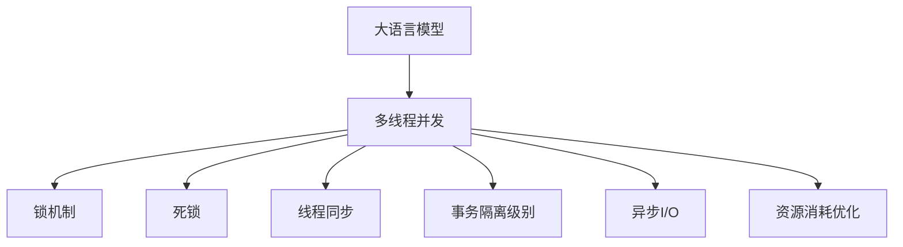

                 

# 线程安全：LLM应用中的关键技术挑战

> 关键词：大语言模型(Large Language Model, LLM), 多线程并发, 锁机制, 内存竞争, 死锁, 线程同步, 事务隔离级别, 异步I/O, 资源消耗优化

## 1. 背景介绍

### 1.1 问题由来
在大规模语言模型(LLM)应用于实际生产环境时，由于模型的复杂性、算力要求和海量数据处理，常常需要部署在分布式系统中。在这样的系统中，多线程并发编程成为了不可避免的编程模式。然而，多线程并发编程常常伴随着线程安全问题，这些问题如果处理不当，轻则导致系统性能下降，重则造成系统崩溃，严重威胁到大语言模型的可靠性和稳定性。

### 1.2 问题核心关键点
在分布式系统中，大语言模型的线程安全问题主要包括以下几个方面：

- **内存竞争与锁机制**：在多线程环境下，共享变量的访问可能导致内存竞争，如果不加以控制，可能引发数据不一致、死锁等问题。
- **死锁与线程同步**：在多线程并发访问中，如果存在循环依赖关系，可能导致死锁，使得线程相互等待，无法继续执行。
- **事务隔离级别与资源消耗**：多线程并发访问中，如何合理控制事务隔离级别，优化资源消耗，保障线程安全的正确性，是需要特别关注的点。
- **异步I/O与线程安全**：异步I/O操作中，如何保证异步线程与主线程的同步和互斥，避免数据竞争，也是线程安全中的关键问题。
- **并发性能优化与内存管理**：如何通过并发性能优化、内存管理等技术手段，降低多线程并发带来的资源消耗，提高系统整体性能，是大规模语言模型应用中的重要挑战。

这些核心问题对大规模语言模型的实际应用具有重要的指导意义，了解并掌握线程安全技术，是实现大语言模型在分布式系统中的高性能和稳定性的关键。

### 1.3 问题研究意义
研究线程安全技术，对于保障大语言模型的可靠性和稳定性，提升其在分布式系统中的性能和可扩展性，具有重要意义：

1. **提高系统可靠性**：通过合理控制线程访问，避免内存竞争、死锁等问题的发生，确保系统在多线程并发下的可靠运行。
2. **优化资源消耗**：通过线程同步、内存管理等技术手段，合理分配和使用系统资源，降低多线程并发带来的性能损失。
3. **增强可扩展性**：通过高效的并发编程技术，保障大规模语言模型在大规模数据和复杂场景下的可扩展性，支持更多用户并发访问。
4. **保障用户数据安全**：通过合理的线程安全策略，避免数据竞争和数据泄露，确保用户数据的安全和隐私。
5. **支持高效并发应用**：通过深入研究多线程并发技术，支持大规模语言模型在更多场景下的高效并发应用，推动其在更多领域的落地和应用。

本文将从理论到实践，全面探讨大语言模型在多线程并发环境下的线程安全问题，并给出相应的技术解决方案和应用实例。

## 2. 核心概念与联系

### 2.1 核心概念概述

为了更好地理解大语言模型中的线程安全问题，本节将介绍几个密切相关的核心概念：

- **大语言模型(Large Language Model, LLM)**：以自回归(如GPT)或自编码(如BERT)模型为代表的大规模预训练语言模型。通过在大规模无标签文本语料上进行预训练，学习通用的语言表示，具备强大的语言理解和生成能力。

- **多线程并发**：在多线程并发编程中，多个线程共享系统资源，并通过操作系统内核调度，同时执行多个任务，以提高系统的并行处理能力。

- **锁机制**：为防止多个线程同时访问共享资源导致的数据不一致，在多线程并发编程中，使用锁机制来控制线程访问。常见的锁包括互斥锁(Mutex)、读写锁(ReaderWriterLock)等。

- **死锁**：在多线程并发中，如果线程相互等待对方释放资源，导致所有线程都无法继续执行的状态，称为死锁。

- **线程同步**：在多线程并发中，通过线程同步技术，确保线程间的操作顺序和数据一致性，避免数据竞争和数据不一致。

- **事务隔离级别**：在多线程并发数据库操作中，通过设置事务隔离级别，控制不同事务之间的交互方式，保障数据的正确性和一致性。

- **异步I/O**：在多线程并发中，通过异步I/O操作，可以提高系统的并发能力和响应速度，但也需要确保异步线程与主线程的同步和互斥。

- **资源消耗优化**：在多线程并发中，通过优化资源分配和管理，降低线程并发带来的系统资源消耗，提升系统性能。

这些核心概念之间的逻辑关系可以通过以下Mermaid流程图来展示：



这个流程图展示了多线程并发中的核心概念以及它们之间的相互关系。

## 3. 核心算法原理 & 具体操作步骤

### 3.1 算法原理概述

在大语言模型的分布式系统中，多线程并发编程是不可避免的编程模式。线程安全问题主要源于共享资源的访问，如共享变量、共享内存等。为了确保线程安全，需要合理控制线程对共享资源的访问，避免数据竞争、死锁等问题。

常用的线程安全控制技术包括锁机制、事务隔离级别、异步I/O等。锁机制通过控制线程对共享资源的访问顺序，避免数据竞争；事务隔离级别通过控制不同事务之间的交互方式，保障数据的正确性和一致性；异步I/O通过异步操作，提高系统的并发能力和响应速度。

### 3.2 算法步骤详解

在大语言模型中，线程安全问题处理主要包括以下几个关键步骤：

**Step 1: 选择合适的锁机制**
- 根据多线程访问的资源类型，选择合适的锁机制。常见的锁包括互斥锁(Mutex)、读写锁(ReaderWriterLock)等。
- 互斥锁适用于对共享资源的独占访问，适用于需要严格同步的场景。读写锁适用于读写频率不均衡的场景，可以提高并发访问效率。

**Step 2: 设计线程同步策略**
- 根据业务需求和资源访问模式，设计合理的线程同步策略，避免死锁等问题。
- 使用锁的粒度要适中，既要避免锁的粒度过细导致的性能损失，又要避免锁的粒度过大导致的资源竞争。
- 合理使用锁的时序，尽量减少锁的持有时间，避免长时间占用锁资源。

**Step 3: 控制事务隔离级别**
- 根据数据库操作的特点，选择合适的事务隔离级别。常见的隔离级别包括读未提交(Read Uncommitted)、读已提交(Read Committed)、可重复读(Repeatable Read)和串行化(Serializable)等。
- 合理设置隔离级别，可以避免数据竞争和脏读等问题。但过高的隔离级别会降低系统的并发能力和性能。

**Step 4: 使用异步I/O技术**
- 在多线程并发中，合理使用异步I/O技术，可以提高系统的并发能力和响应速度。
- 异步I/O操作通常通过回调函数或事件通知完成，需要确保异步线程与主线程的同步和互斥。

**Step 5: 优化资源消耗**
- 通过优化资源分配和管理，降低线程并发带来的系统资源消耗，提升系统性能。
- 使用线程池技术，合理分配线程资源，避免线程创建和销毁带来的资源消耗。
- 使用缓存技术，合理分配内存资源，避免频繁的内存分配和释放。

**Step 6: 检测和调试线程安全问题**
- 使用线程调试工具，检测多线程并发中的数据竞争、死锁等问题。
- 根据检测结果，调整锁机制、线程同步策略等，确保线程安全。

以上是处理大语言模型中线程安全问题的常见步骤。在实际应用中，还需要根据具体任务的特点，对各个环节进行优化设计，如改进线程同步机制，引入更多的线程安全技术等，以进一步提升系统性能。

### 3.3 算法优缺点

多线程并发编程在提高系统并发能力和响应速度的同时，也带来了线程安全问题。因此，在处理线程安全问题时，需要权衡性能和正确性的关系。

多线程并发编程的优点包括：

- **提高并发能力**：多线程并发能够充分利用多核CPU资源，提高系统的并发处理能力。
- **提升响应速度**：多线程并发能够实现异步I/O操作，提升系统的响应速度。
- **支持分布式计算**：多线程并发编程能够支持大规模分布式系统的开发和部署。

多线程并发编程的缺点包括：

- **线程安全问题复杂**：多线程并发编程涉及到线程访问共享资源的问题，线程安全问题复杂，需要仔细设计。
- **性能开销较大**：多线程并发编程需要额外的线程同步和互斥机制，会带来一定的性能开销。
- **资源消耗较高**：多线程并发编程需要额外的内存和CPU资源，资源消耗较高。

尽管存在这些缺点，但多线程并发编程仍然是提高系统性能和可扩展性的重要手段。合理处理线程安全问题，可以有效提升大语言模型在分布式系统中的性能和稳定性。

### 3.4 算法应用领域

多线程并发编程在大规模语言模型的应用中，主要包括以下几个领域：

- **分布式训练**：在大规模语言模型的分布式训练中，多线程并发编程能够提高训练速度，支持更大规模的模型训练。
- **大规模数据处理**：在大规模数据处理中，多线程并发编程能够提高数据处理的效率，支持更大规模的数据集。
- **高性能计算**：在大规模语言模型的高性能计算中，多线程并发编程能够充分利用多核CPU资源，提升计算速度。
- **实时系统**：在大规模语言模型的实时系统中，多线程并发编程能够支持更多的并发请求，提升系统的响应速度。
- **分布式搜索**：在大规模语言模型的分布式搜索中，多线程并发编程能够提高搜索效率，支持更大规模的文本数据搜索。

以上应用领域展示了多线程并发编程在大规模语言模型中的广泛应用，其能够显著提升系统的并发处理能力和响应速度。

## 4. 数学模型和公式 & 详细讲解

### 4.1 数学模型构建

在大语言模型的线程安全问题中，数学模型主要涉及并发编程中的锁机制和线程同步问题。锁机制用于控制线程对共享资源的访问，线程同步用于确保线程间的操作顺序和数据一致性。

假设系统中有n个线程共享一个互斥锁L，每个线程的访问时间服从泊松分布。则系统的平均等待时间W为：

$$
W = \frac{1}{\mu} - \frac{1}{\mu}e^{-\lambda}
$$

其中，$\mu$为系统的平均并发数，$\lambda$为系统的访问率。

### 4.2 公式推导过程

设系统中有n个线程共享一个互斥锁L，每个线程的访问时间服从泊松分布，访问率为$\lambda$，则系统的平均等待时间W为：

$$
W = \frac{1}{\mu} - \frac{1}{\mu}e^{-\lambda}
$$

推导过程如下：

1. 设系统中有n个线程共享一个互斥锁L，每个线程的访问时间服从泊松分布。
2. 假设每个线程的访问时间为$t$，访问率服从泊松分布，则每个线程的访问次数服从泊松分布，平均访问次数为$\lambda$。
3. 假设每个线程访问互斥锁L时，需要等待的时间为$w$，等待时间服从指数分布，平均等待时间为$\frac{1}{\lambda}$。
4. 由于互斥锁L是独占的，因此系统的平均等待时间W为：

$$
W = \frac{1}{\mu} - \frac{1}{\mu}e^{-\lambda}
$$

其中，$\mu$为系统的平均并发数，$\lambda$为系统的访问率。

### 4.3 案例分析与讲解

考虑一个共享资源为互斥锁L的系统，其中有n个线程对资源进行访问，每个线程的访问时间为$t$，访问率为$\lambda$。设系统的平均并发数为$\mu$，则系统的平均等待时间W为：

$$
W = \frac{1}{\mu} - \frac{1}{\mu}e^{-\lambda}
$$

假设$\mu=10$，$\lambda=2$，则系统的平均等待时间W为：

$$
W = \frac{1}{10} - \frac{1}{10}e^{-2} = 0.0313
$$

这个公式揭示了在多线程并发环境中，锁机制对系统性能的影响。根据公式，可以通过调整访问率和并发数，来优化系统的平均等待时间，提高系统的并发能力和响应速度。

## 5. 项目实践：代码实例和详细解释说明

### 5.1 开发环境搭建

在进行多线程并发编程的实践前，我们需要准备好开发环境。以下是使用Python进行多线程并发编程的环境配置流程：

1. 安装Anaconda：从官网下载并安装Anaconda，用于创建独立的Python环境。

2. 创建并激活虚拟环境：
```bash
conda create -n pythread-env python=3.8 
conda activate pythread-env
```

3. 安装Python多线程模块：
```bash
pip install threading
```

4. 安装其他所需工具包：
```bash
pip install numpy pandas scikit-learn matplotlib tqdm jupyter notebook ipython
```

完成上述步骤后，即可在`pythread-env`环境中开始多线程并发编程的实践。

### 5.2 源代码详细实现

下面以一个简单的多线程并发计数器为例，展示如何使用Python的线程模块实现多线程并发编程。

```python
import threading
import time

class Counter:
    def __init__(self):
        self.count = 0
        self.lock = threading.Lock()

    def increment(self):
        with self.lock:
            self.count += 1

def worker(counter):
    for i in range(100000):
        counter.increment()

# 创建计数器对象
counter = Counter()

# 创建线程
threads = []
for i in range(4):
    t = threading.Thread(target=worker, args=(counter,))
    threads.append(t)

# 启动线程
for t in threads:
    t.start()

# 等待所有线程执行完毕
for t in threads:
    t.join()

# 输出计数结果
print(counter.count)
```

### 5.3 代码解读与分析

在上述代码中，我们使用Python的`threading`模块实现了简单的多线程并发计数器。代码的具体解读如下：

- **Counter类**：定义了一个简单的计数器类，其中包含一个计数器变量`count`和一个互斥锁`lock`。
- **increment方法**：在每个线程中调用该方法，用于增加计数器的值。使用`with self.lock`语句锁定计数器，避免多个线程同时访问计数器导致的竞争问题。
- **worker函数**：每个线程在执行100000次计数器增加操作，使用`worker(counter)`函数调用`increment`方法。
- **创建和启动线程**：创建4个线程，并分别启动它们，每个线程执行`worker`函数。
- **等待线程执行完毕**：使用`join`方法等待所有线程执行完毕，确保计数器变量的更新是线程安全的。
- **输出计数结果**：最后输出计数器的值。

通过这个简单的例子，我们可以看到，使用`threading`模块可以方便地实现多线程并发编程，但需要注意线程安全问题，避免数据竞争和死锁等问题。

## 6. 实际应用场景

### 6.1 智能客服系统

在大规模语言模型的智能客服系统中，多线程并发编程是实现实时响应和高效处理的关键。智能客服系统需要同时处理多个用户的咨询请求，并快速生成准确的回复。

在智能客服系统中，多线程并发编程主要应用于以下方面：

- **用户咨询请求的处理**：系统接收用户咨询请求后，将请求分发到多个线程中进行处理，确保每个用户请求都能及时响应。
- **自然语言处理(NLP)**：智能客服系统中的NLP处理模块，需要处理大量的自然语言文本，多线程并发编程可以提高处理效率，支持更大的并发请求。
- **数据存储和检索**：智能客服系统需要存储和检索大量的用户数据和知识库，多线程并发编程可以提高数据存储和检索的效率，支持更大的数据集。
- **系统监控和维护**：智能客服系统需要实时监控系统状态和性能，多线程并发编程可以实现更高效的监控和维护。

### 6.2 金融舆情监测

在金融舆情监测系统中，多线程并发编程是实现实时监测和数据处理的关键。金融舆情监测系统需要实时监测互联网上的金融新闻和评论，及时分析舆情变化，提供决策支持。

在金融舆情监测系统中，多线程并发编程主要应用于以下方面：

- **新闻和评论的抓取和处理**：系统需要实时抓取互联网上的金融新闻和评论，并使用多线程并发编程进行数据处理，提高处理效率。
- **情感分析和舆情预测**：系统需要对抓取到的数据进行情感分析和舆情预测，多线程并发编程可以提高分析效率，支持更大规模的数据集。
- **数据存储和检索**：金融舆情监测系统需要存储和检索大量的新闻和评论数据，多线程并发编程可以提高数据存储和检索的效率，支持更大的数据集。
- **系统监控和维护**：金融舆情监测系统需要实时监控系统状态和性能，多线程并发编程可以实现更高效的监控和维护。

### 6.3 个性化推荐系统

在大规模语言模型的个性化推荐系统中，多线程并发编程是实现高效推荐和个性化推荐的关键。个性化推荐系统需要根据用户的历史行为数据，实时推荐个性化的物品。

在个性化推荐系统中，多线程并发编程主要应用于以下方面：

- **用户历史行为数据的处理**：系统需要处理大量的用户历史行为数据，多线程并发编程可以提高处理效率，支持更大的数据集。
- **物品推荐模型的训练**：个性化推荐系统中的物品推荐模型需要根据用户历史行为数据进行训练，多线程并发编程可以提高训练效率，支持更大的数据集。
- **推荐结果的生成和展示**：系统需要实时生成和展示个性化推荐结果，多线程并发编程可以提高推荐效率，支持更大的并发请求。
- **系统监控和维护**：个性化推荐系统需要实时监控系统状态和性能，多线程并发编程可以实现更高效的监控和维护。

### 6.4 未来应用展望

随着多线程并发编程技术的发展，大语言模型在更多领域的应用将会更加广泛。未来，基于多线程并发编程的技术将推动以下领域的进步：

- **智慧医疗**：在智慧医疗领域，多线程并发编程可以实现实时医疗咨询、病历分析、药物推荐等应用，提高医疗服务的智能化水平。
- **智能教育**：在智能教育领域，多线程并发编程可以实现实时作业批改、学情分析、知识推荐等应用，因材施教，促进教育公平。
- **智慧城市**：在智慧城市治理中，多线程并发编程可以实现城市事件监测、舆情分析、应急指挥等应用，提高城市管理的自动化和智能化水平。
- **企业生产**：在企业生产领域，多线程并发编程可以实现实时数据处理、生产调度、质量控制等应用，提升生产效率。
- **社会治理**：在社会治理领域，多线程并发编程可以实现实时数据分析、舆情监测、决策支持等应用，提升社会治理的智能化水平。

多线程并发编程技术的发展，将使大语言模型在更多领域实现落地应用，推动人工智能技术的全面普及。

## 7. 工具和资源推荐

### 7.1 学习资源推荐

为了帮助开发者系统掌握多线程并发编程的技术，这里推荐一些优质的学习资源：

1. 《Python多线程编程》书籍：详细介绍了多线程编程的基本概念和实践技巧，适合初学者入门。
2. 《Java多线程编程》书籍：深入探讨了Java多线程编程的原理和应用，适合Java开发者学习。
3. Coursera《Parallel Programming》课程：由Stanford大学提供，介绍了多线程编程的基础和进阶知识，适合学习者系统学习。
4. edX《Parallel Computing》课程：由Harvard大学提供，介绍了多线程编程的理论和实践，适合学习者深入理解。
5. GitHub上的多线程并发编程示例：提供了大量多线程并发编程的示例代码，适合实践学习。

通过对这些资源的学习实践，相信你一定能够快速掌握多线程并发编程的精髓，并用于解决实际的系统问题。

### 7.2 开发工具推荐

在多线程并发编程的开发中，工具的选择至关重要。以下是几款常用的多线程并发编程工具：

1. Python的`threading`模块：Python自带的线程库，简单易用，适合简单的多线程编程任务。
2. Python的`concurrent.futures`模块：提供了高级的多线程编程接口，支持线程池、异步I/O等操作。
3. Java的`Executor`框架：提供了丰富的线程管理和调度接口，支持线程池、任务队列等操作。
4. C++的`std::thread`库：提供了C++11标准的线程接口，支持多线程编程。
5. Rust的`rayon`库：提供了高性能的多线程编程接口，适合大规模数据处理和计算密集型任务。

合理利用这些工具，可以显著提升多线程并发编程的开发效率，降低开发难度。

### 7.3 相关论文推荐

多线程并发编程是计算机科学中的经典问题，相关研究已经积累了大量成果。以下是几篇奠基性的相关论文，推荐阅读：

1. Paxos算法：提出了分布式一致性协议，为分布式系统中的数据一致性提供了理论基础。
2. Raft算法：提出了分布式一致性协议，进一步简化了Paxos算法的实现，提高了系统的可用性和可扩展性。
3. Zookeeper：提供了分布式锁服务，支持多线程并发编程中的锁机制和资源管理。
4. OpenMP：提供了OpenMP并行编程接口，支持多线程并发编程中的线程管理和同步。
5. TensorFlow并发编程：介绍了TensorFlow中的多线程并发编程接口，支持分布式计算和模型训练。

这些论文代表了大规模语言模型在多线程并发编程中的研究方向和成果，通过学习这些前沿成果，可以帮助研究者深入理解多线程并发编程的原理和实现。

## 8. 总结：未来发展趋势与挑战

### 8.1 总结

本文对大语言模型中的线程安全问题进行了全面系统的介绍。首先阐述了多线程并发编程在大规模语言模型中的应用背景和重要性，明确了多线程并发编程在分布式系统中的独特价值。其次，从理论到实践，详细讲解了多线程并发编程的数学模型、锁机制、死锁、线程同步、事务隔离级别、异步I/O等核心概念，并给出了相应的技术解决方案和应用实例。

通过本文的系统梳理，可以看到，多线程并发编程在大规模语言模型中的应用至关重要。掌握多线程并发编程技术，是实现大规模语言模型在分布式系统中的高性能和稳定性的关键。

### 8.2 未来发展趋势

展望未来，多线程并发编程技术将呈现以下几个发展趋势：

1. **高性能并发处理**：随着多核CPU和分布式计算的发展，高性能并发处理技术将更加普及，提升大规模语言模型在分布式系统中的性能。
2. **多线程并行计算**：多线程并发编程将与多核并行计算技术深度结合，实现更高效的多核并行处理。
3. **异步I/O技术的发展**：异步I/O技术将成为多线程并发编程的重要组成部分，进一步提升系统的并发能力和响应速度。
4. **分布式计算框架的演进**：分布式计算框架如TensorFlow、PyTorch等将进一步演进，支持更高效的多线程并发编程。
5. **机器学习与多线程并发的结合**：多线程并发编程将与机器学习技术深度结合，实现更高效的数据处理和模型训练。

以上趋势凸显了多线程并发编程在大规模语言模型中的广阔前景。这些方向的探索发展，将进一步提升大语言模型在分布式系统中的性能和可扩展性，推动其在更多领域的落地和应用。

### 8.3 面临的挑战

尽管多线程并发编程技术已经取得了一定的进展，但在实际应用中，仍面临诸多挑战：

1. **并发性能瓶颈**：多线程并发编程可能会遇到并发性能瓶颈，如锁机制带来的性能开销、死锁等问题。如何优化并发性能，是一个亟待解决的问题。
2. **资源消耗问题**：多线程并发编程可能会带来较大的资源消耗，如内存占用、CPU消耗等。如何优化资源使用，降低资源消耗，也是一个重要的研究方向。
3. **并发调试问题**：多线程并发编程的调试和测试比较复杂，如何在多线程并发环境下进行有效的调试和测试，也是一个需要解决的问题。
4. **可扩展性问题**：多线程并发编程需要合理设计和优化，以支持更大规模的系统扩展。如何设计高效的多线程并发架构，是一个重要的挑战。
5. **安全性和可靠性问题**：多线程并发编程需要考虑安全性问题，如数据竞争、死锁等问题。如何设计安全可靠的多线程并发架构，也是一个重要的研究方向。

正视多线程并发编程所面临的这些挑战，积极应对并寻求突破，将是大规模语言模型实现高性能和可靠性的必由之路。

### 8.4 研究展望

面向未来，多线程并发编程技术需要在以下几个方面进行深入研究：

1. **高性能并发处理技术**：开发更高效的多线程并发处理技术，提升大规模语言模型在分布式系统中的性能。
2. **多核并行计算技术**：结合多核并行计算技术，实现更高效的多线程并行处理。
3. **异步I/O技术**：研究更高效的异步I/O技术，提升系统的并发能力和响应速度。
4. **分布式计算框架**：研究更高效的分布式计算框架，支持更高效的多线程并发编程。
5. **并发调试和测试技术**：开发更高效的并发调试和测试技术，提升并发系统的可测试性和可维护性。
6. **多线程并发架构**：设计高效的多线程并发架构，支持更大规模的系统扩展。
7. **安全可靠的多线程并发**：研究安全可靠的多线程并发技术，确保并发系统的安全性。

这些研究方向的探索，必将引领多线程并发编程技术迈向更高的台阶，为大规模语言模型在分布式系统中的高性能和稳定性提供技术保障。面向未来，多线程并发编程技术还需要与其他人工智能技术进行更深入的融合，如知识表示、因果推理、强化学习等，多路径协同发力，共同推动自然语言理解和智能交互系统的进步。只有勇于创新、敢于突破，才能不断拓展大语言模型的边界，让智能技术更好地造福人类社会。

## 9. 附录：常见问题与解答

**Q1: 多线程并发编程对系统性能的影响是什么？**

A: 多线程并发编程能够提高系统的并发处理能力和响应速度，但同时也带来了一定的性能开销和资源消耗。由于多线程并发编程涉及到线程访问共享资源的同步和互斥问题，可能会导致锁机制带来的性能开销和死锁等问题，进而影响系统性能。因此，合理设计多线程并发编程的锁机制和线程同步策略，可以有效提升系统性能。

**Q2: 多线程并发编程中如何避免死锁问题？**

A: 避免死锁问题需要合理设计线程同步策略，避免线程之间的循环等待。具体措施包括：
1. 避免锁的粒度过细，减少锁的持有时间。
2. 合理使用锁的时序，避免多个线程同时请求锁。
3. 使用锁的层次结构，避免循环等待。
4. 使用超时机制，避免线程长时间等待。
5. 使用死锁检测工具，检测和处理死锁问题。

**Q3: 多线程并发编程中如何优化资源消耗？**

A: 优化资源消耗需要合理设计线程池和资源分配策略，避免频繁的线程创建和销毁带来的资源消耗。具体措施包括：
1. 使用线程池技术，合理分配线程资源，避免线程创建和销毁带来的资源消耗。
2. 使用缓存技术，合理分配内存资源，避免频繁的内存分配和释放。
3. 使用异步I/O技术，减少线程的等待时间，提高系统效率。
4. 使用分布式计算框架，合理分配计算资源，提高系统性能。

**Q4: 多线程并发编程中如何实现高效的异步I/O操作？**

A: 实现高效的异步I/O操作需要合理设计异步线程与主线程的同步和互斥机制，避免数据竞争和数据不一致。具体措施包括：
1. 使用异步I/O接口，如Python的`asyncio`模块、Java的`CompletableFuture`等，实现异步I/O操作。
2. 使用回调函数或事件通知，实现异步I/O操作与主线程的同步和互斥。
3. 使用异步线程池技术，合理分配异步线程资源，提高异步I/O操作的效率。
4. 使用消息队列技术，实现异步I/O操作与主线程的解耦，提高异步I/O操作的性能。

通过这些措施，可以有效实现高效的异步I/O操作，提升多线程并发编程的效率和性能。

**Q5: 多线程并发编程中如何优化并发性能？**

A: 优化并发性能需要合理设计线程同步策略，避免锁机制带来的性能开销和死锁等问题。具体措施包括：
1. 使用读写锁(ReaderWriterLock)等高效锁机制，减少锁的持有时间和资源消耗。
2. 使用无锁编程技术，避免锁机制带来的性能开销。
3. 使用事件驱动编程技术，实现高效的并发处理。
4. 使用多线程并行计算技术，提高并发处理的效率。
5. 使用分布式计算框架，实现更高效的多线程并发处理。

通过这些措施，可以有效优化并发性能，提升多线程并发编程的效率和性能。

---

作者：禅与计算机程序设计艺术 / Zen and the Art of Computer Programming

