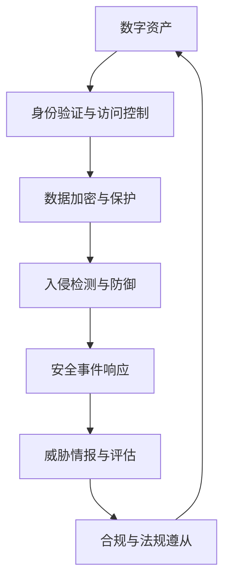

                 

# 网络安全管理：保护组织数字资产

在数字化浪潮的推动下，企业的数字资产正迅速增长，包含大量的敏感信息，如客户数据、商业计划、内部通讯等。这些资产对于企业的运营至关重要，一旦遭受安全威胁，可能造成重大损失。本文将全面探讨网络安全管理的核心概念、关键技术和最佳实践，帮助组织建立强大的数字安全防线。

## 1. 背景介绍

### 1.1 问题由来
随着网络技术的普及和业务数字化进程的加速，企业的数据资产管理变得更加复杂和多样化。过去分散在各个部门和业务系统中的数据开始被整合到云端，为企业的运营、决策和创新提供了强大的数据支持。但与此同时，数据安全问题也随之突显：黑客攻击、数据泄露、内部滥用等安全事件频发，对企业的声誉和利益造成了严重威胁。

### 1.2 问题核心关键点
网络安全管理的主要任务是识别、保护、检测和响应数字资产面临的安全威胁。其核心关键点包括：
- 数据的分类、识别和价值评估。
- 建立多层次的安全防护体系，覆盖不同安全级别。
- 实时监控和分析网络活动，及时发现并阻止潜在威胁。
- 建立应急响应机制，快速处置安全事件。
- 持续改进安全策略和技术，适应不断变化的安全威胁。

### 1.3 问题研究意义
网络安全管理对于保障企业的数字资产安全至关重要。有效的安全管理不仅可以保护企业免受网络攻击和经济损失，还能增强客户信任，提高企业竞争力。从宏观层面看，网络安全管理有助于维护国家的网络空间主权和信息安全，促进数字经济的稳定发展。

## 2. 核心概念与联系

### 2.1 核心概念概述

为更好地理解网络安全管理的核心内容，本节将介绍几个关键概念及其相互关系：

- **数字资产**：指企业内部所有的数字化信息，包括但不限于文档、邮件、数据库记录等。
- **网络安全管理**：涉及对数字资产的安全识别、保护、检测和响应，旨在防止未授权访问、数据泄露等安全事件。
- **身份验证与访问控制**：通过密码、双因素认证等手段确保只有授权用户才能访问敏感信息。
- **数据加密与保护**：对数据进行加密处理，防止数据在传输和存储过程中被窃取或篡改。
- **入侵检测与防御**：实时监控网络活动，及时发现并阻止潜在的安全威胁。
- **安全事件响应**：针对已发生的安全事件，快速响应和处置，最小化损失。
- **威胁情报与评估**：收集和分析威胁情报，评估安全风险，指导安全策略的制定。
- **合规与法规遵从**：确保企业符合相关法律法规，避免法律风险。

这些概念共同构成了网络安全管理的基础框架，使企业在面对多样化的安全威胁时，能够采取综合措施，保护数字资产的安全。

### 2.2 核心概念原理和架构的 Mermaid 流程图



这个流程图展示了数字资产在网络安全管理中的流转路径，从生成、存储、使用到销毁，每个环节都有相应的安全措施进行防护。

## 3. 核心算法原理 & 具体操作步骤

### 3.1 算法原理概述

网络安全管理的核心算法原理主要涉及数据加密、入侵检测、威胁情报等多个方面。以下是这些算法的基本原理概述：

#### 3.1.1 数据加密

数据加密通过将明文转换为密文，确保数据在传输和存储过程中无法被未授权访问者解读。常用的加密算法包括对称加密和非对称加密。

#### 3.1.2 入侵检测

入侵检测系统(IDS)通过监控网络流量，识别和阻止恶意活动。其原理包括异常检测和误用检测：异常检测通过分析正常网络流量特征，发现异常行为；误用检测则基于已知的攻击模式，检测潜在的攻击行为。

#### 3.1.3 威胁情报

威胁情报系统通过收集和分析网络威胁信息，提供有关新威胁的情报支持。其原理包括情报收集、情报分析和情报共享：情报收集通过从多个源获取威胁信息，情报分析通过技术手段识别和评估威胁，情报共享则通过机制和平台进行信息共享和协作。

### 3.2 算法步骤详解

#### 3.2.1 数据加密

1. **密钥生成**：使用密钥生成算法（如RSA、AES等）生成对称和非对称密钥对。
2. **加密**：将明文数据使用对称密钥进行加密，生成密文。
3. **传输**：将密文通过安全通道传输到接收方。
4. **解密**：接收方使用对称密钥解密密文，恢复明文数据。

#### 3.2.2 入侵检测

1. **数据采集**：收集网络流量、系统日志等信息。
2. **特征提取**：从采集到的数据中提取有用的安全特征。
3. **规则匹配**：将提取出的特征与已知的攻击模式进行匹配。
4. **事件分析**：分析匹配到的攻击事件，判断是否为威胁。
5. **响应处置**：对确认的威胁采取相应的响应措施，如封锁攻击源、记录日志等。

#### 3.2.3 威胁情报

1. **情报收集**：从多个来源（如互联网、安全报告、行业情报等）收集威胁情报。
2. **情报分析**：通过自然语言处理(NLP)、机器学习等技术，分析情报内容，提取威胁特征。
3. **情报共享**：通过API、共享平台等方式，将情报信息分享给合作伙伴和社区。
4. **情报利用**：将情报信息用于指导安全策略的制定和实施，提升安全防护能力。

### 3.3 算法优缺点

#### 3.3.1 数据加密

**优点**：
- 加密数据在传输和存储过程中无法被解读，安全性高。
- 对称加密速度快，适合大规模数据的加密。

**缺点**：
- 密钥管理和分发复杂，容易泄露。
- 一旦密钥被破解，加密数据将完全暴露。

#### 3.3.2 入侵检测

**优点**：
- 实时监控网络活动，及时发现和阻止威胁。
- 误报率较低，准确度高。

**缺点**：
- 需要大量资源进行数据处理和特征提取。
- 误报或漏报可能导致误判和资源浪费。

#### 3.3.3 威胁情报

**优点**：
- 提供全面的威胁情报支持，提升安全防护能力。
- 情报共享可以提高社区整体的安全防护水平。

**缺点**：
- 情报收集和分析需要大量人力和技术投入。
- 情报更新频率和准确度影响防护效果。

### 3.4 算法应用领域

网络安全管理的技术和算法广泛应用于多个领域，包括但不限于：

- **金融机构**：保护客户信息，防范金融诈骗。
- **医疗行业**：保护患者隐私，防止医疗数据泄露。
- **政府机构**：保护国家机密，防范网络攻击。
- **企业组织**：保护商业秘密，提升市场竞争力。
- **互联网公司**：防范DDoS攻击，保护用户数据安全。

## 4. 数学模型和公式 & 详细讲解 & 举例说明

### 4.1 数学模型构建

网络安全管理的数学模型涉及多个方面，包括密码学、统计学和机器学习等。以对称加密为例，基本数学模型如下：

$$
C = E_k(P) = k_1 \oplus k_2 \oplus ... \oplus k_n \oplus P
$$

其中，$C$为密文，$P$为明文，$E_k$为加密函数，$k_1, k_2, ..., k_n$为对称密钥。

### 4.2 公式推导过程

#### 4.2.1 对称加密

以AES加密算法为例，其核心步骤包括密钥扩展、轮密钥加和字节代换。具体推导过程如下：

1. **密钥扩展**：
   $$
   k_i = (RCon_k \oplus k_{i-1})
   $$
   其中，$RCon_k$为轮密钥，$k_i$为扩展后的密钥。

2. **轮密钥加**：
   $$
   S = P \oplus k
   $$
   其中，$S$为明文，$P$为密文，$k$为轮密钥。

3. **字节代换**：
   $$
   F(S) = S
   $$
   其中，$F(S)$为代换后的明文。

### 4.3 案例分析与讲解

#### 4.3.1 对称加密案例

假设某企业需要对一条明文消息进行加密传输，使用AES算法和128位对称密钥。其加密流程如下：

1. **密钥扩展**：将128位密钥扩展为多轮轮密钥。
2. **轮密钥加**：对明文进行多次轮密钥加操作。
3. **字节代换**：对加密结果进行字节代换。
4. **传输**：将密文通过安全通道传输到接收方。

#### 4.3.2 入侵检测案例

某企业部署了入侵检测系统(IDS)，监控网络流量以检测潜在威胁。其基本流程如下：

1. **数据采集**：收集网络流量、系统日志等信息。
2. **特征提取**：提取网络流量中的关键特征。
3. **规则匹配**：将提取出的特征与已知的攻击模式进行匹配。
4. **事件分析**：分析匹配到的攻击事件，判断是否为威胁。
5. **响应处置**：对确认的威胁采取相应的响应措施，如封锁攻击源、记录日志等。

## 5. 项目实践：代码实例和详细解释说明

### 5.1 开发环境搭建

#### 5.1.1 选择合适的开发平台

选择适当的开发平台是项目实践的基础。常用的平台包括Linux、Windows和MacOS等操作系统，以及各种编程语言如Python、Java等。

#### 5.1.2 安装必要的工具

安装必要的工具和库，如Python的PyCrypto库、Java的BouncyCastle库等。这些库提供了加密和解密的API接口，支持常用的加密算法。

### 5.2 源代码详细实现

#### 5.2.1 数据加密实现

以Python的AES加密为例，实现步骤如下：

```python
from Crypto.Cipher import AES
from Crypto.Util.Padding import pad, unpad
from Crypto.Random import get_random_bytes

# 密钥和明文
key = get_random_bytes(16)
plaintext = b'Hello, World!'

# 加密
cipher = AES.new(key, AES.MODE_CBC)
ciphertext = cipher.encrypt(pad(plaintext, AES.block_size))
```

#### 5.2.2 入侵检测实现

以Python的SnortIDS为例，实现步骤如下：

```python
from snortutils import Snort

# 初始化SnortIDS
snort = Snort()

# 规则配置
rules_file = 'rules/snort.rules'
snort.load_rules(rules_file)

# 数据采集
snort.set_stream('input_1')
snort.start_stream()

# 事件分析
snort.start()

# 关闭流和SnortIDS
snort.stop()
snort.close()
```

### 5.3 代码解读与分析

#### 5.3.1 数据加密代码解读

- **密钥生成**：使用`get_random_bytes`函数生成128位随机密钥。
- **加密**：使用AES算法和CBC模式进行加密，并使用`pad`函数进行补位。
- **传输**：将密文`ciphertext`通过安全通道传输到接收方。

#### 5.3.2 入侵检测代码解读

- **规则配置**：使用SnortIDS的`load_rules`函数加载规则文件。
- **数据采集**：使用`set_stream`函数设置输入流，`start_stream`函数开始数据采集。
- **事件分析**：使用`start`函数开启事件分析，SnortIDS会自动检测和响应网络流量中的威胁。
- **关闭流和SnortIDS**：使用`stop`和`close`函数关闭流和SnortIDS，释放资源。

### 5.4 运行结果展示

#### 5.4.1 数据加密结果展示

在加密后，明文`Hello, World!`被转换为密文`ciphertext`，存储在本地或通过安全通道传输。

#### 5.4.2 入侵检测结果展示

SnortIDS会实时监控网络流量，分析网络活动，并根据规则文件中的配置，自动检测和响应威胁事件。例如，检测到可疑的HTTP流量时，SnortIDS会发出告警，并采取相应的防御措施。

## 6. 实际应用场景

### 6.1 智慧医疗

在智慧医疗领域，网络安全管理对于保护患者隐私和医疗数据的安全至关重要。例如，某医院使用数据加密技术对患者电子健康记录(EHR)进行加密，防止数据泄露和未授权访问。同时，部署入侵检测系统(IDS)实时监控网络流量，防止恶意软件和攻击行为，确保医疗信息的安全。

### 6.2 金融行业

金融行业涉及大量的敏感信息，如客户账户数据、交易记录等。网络安全管理在防范金融诈骗、保护客户信息方面具有重要意义。例如，某银行部署了入侵检测系统(IDS)，实时监控交易活动，检测可疑的金融欺诈行为，保护客户的财产安全。

### 6.3 政府机构

政府机构需要保护国家机密和敏感信息，防止数据泄露和网络攻击。例如，某政府机构使用数据加密技术对机密文件进行加密处理，防止文件在传输和存储过程中被窃取。同时，部署威胁情报系统，实时获取和分析全球范围内的安全威胁情报，提高安全防护能力。

### 6.4 企业组织

企业组织需要保护商业秘密和客户数据，防止信息泄露和内部滥用。例如，某企业部署了入侵检测系统(IDS)，实时监控内部网络活动，检测和响应潜在的安全威胁，确保企业信息的安全。

## 7. 工具和资源推荐

### 7.1 学习资源推荐

#### 7.1.1 网络安全管理课程

- Coursera上的《网络安全基础》课程：由斯坦福大学提供，涵盖网络安全的核心概念和实践技术。
- edX上的《网络安全与隐私》课程：由麻省理工学院提供，深入讲解网络安全攻防技术和隐私保护策略。

#### 7.1.2 网络安全工具和框架

- OWASP：开源安全项目，提供大量安全工具和指南。
- Metasploit：渗透测试框架，用于评估和修复系统安全漏洞。

### 7.2 开发工具推荐

#### 7.2.1 加密算法工具

- PyCrypto：Python加密库，支持多种加密算法。
- BouncyCastle：Java加密库，提供高级加密技术。

#### 7.2.2 入侵检测系统

- SnortIDS：开源入侵检测系统，支持多种网络协议和规则引擎。
- Suricata：高性能入侵检测系统，提供实时监控和事件分析功能。

### 7.3 相关论文推荐

#### 7.3.1 数据加密

- “AES Encryption Algorithm”：详细讲解AES加密算法的原理和实现。
- “Advanced Encryption Standard (AES)”：由NIST发布的AES加密算法标准。

#### 7.3.2 入侵检测

- “Anomaly Detection in Network Intrusion Detection Systems”：探讨异常检测和误用检测的不同技术。
- “A Survey on Intrusion Detection Systems: Architectures, Principles, and New Trends”：对入侵检测系统进行全面回顾和总结。

## 8. 总结：未来发展趋势与挑战

### 8.1 总结

本文详细探讨了网络安全管理的核心概念、关键技术和最佳实践，展示了其对于保护组织数字资产的重要意义。通过数据加密、入侵检测、威胁情报等手段，企业可以构建多层次的安全防护体系，实时监控和响应安全威胁，确保数字资产的安全。

### 8.2 未来发展趋势

网络安全管理技术将继续演进，呈现出以下趋势：

- **自动化和智能化**：利用机器学习和AI技术，提高安全防护的自动化和智能化水平，减少人工干预和误报。
- **云安全**：随着云计算的普及，云安全将成为网络安全管理的重要组成部分。云安全平台将提供集中的安全管理和防护功能。
- **零信任架构**：采用零信任安全模型，从最小权限原则出发，对所有访问请求进行严格验证和控制。
- **多云环境下的安全管理**：在多云环境中，企业需要构建统一的安全管理和防护策略，确保跨云的安全性。

### 8.3 面临的挑战

网络安全管理在实践过程中仍然面临诸多挑战：

- **资源消耗**：大规模数据加密和实时监控需要大量的计算资源，对企业的IT基础设施提出挑战。
- **技术更新**：网络攻击技术不断演进，网络安全管理需要持续更新和升级，以应对新的安全威胁。
- **合规和法规**：不同国家和地区对数据保护和隐私保护有不同的法规要求，企业需要确保符合相关法律和标准。
- **人才培养**：网络安全管理需要高水平的技术人才，企业需要培养和吸引更多具备网络安全技能的专业人才。

### 8.4 研究展望

未来网络安全管理技术的研究方向包括：

- **区块链技术**：利用区块链的不可篡改性和分布式特性，提高数据安全和隐私保护。
- **联邦学习**：在保护数据隐私的前提下，通过联邦学习技术共享安全知识，提升整体的安全防护能力。
- **边缘计算**：在边缘设备上部署安全计算能力，减少数据传输和中心化处理带来的风险。
- **人工智能**：利用AI技术进行威胁情报分析，提高安全防护的智能化水平。

## 9. 附录：常见问题与解答

### 9.1 Q1: 网络安全管理的具体步骤是什么？

A: 网络安全管理的具体步骤包括：
1. 数据分类和识别，评估数据的重要性和敏感度。
2. 建立多层次的安全防护体系，包括物理安全、网络安全、应用安全和数据安全等。
3. 实时监控和分析网络活动，及时发现和阻止潜在威胁。
4. 建立应急响应机制，快速响应和处置安全事件。
5. 持续改进安全策略和技术，适应不断变化的安全威胁。

### 9.2 Q2: 如何选择合适的加密算法？

A: 选择合适的加密算法需要考虑以下几个方面：
1. 加密强度：AES、RSA等算法具有较高的加密强度，适合保护重要数据。
2. 加密速度：DES、AES等对称加密算法速度快，适合大规模数据加密。
3. 密钥管理和分发：RSA等非对称加密算法适合密钥管理和分发，但计算复杂度高。
4. 加密后的数据可读性：有些算法如AES加密后的数据可读性较高，适合传输和存储。
5. 算法的开源和标准化：选择开源且标准化的算法，有利于提高安全性和互操作性。

### 9.3 Q3: 入侵检测系统如何减少误报和漏报？

A: 减少入侵检测系统的误报和漏报需要从以下几个方面入手：
1. 规则优化：定期更新和优化入侵检测规则，减少误报和漏报。
2. 异常检测：利用机器学习和AI技术，分析正常网络流量特征，减少误报。
3. 误用检测：使用多层次的误用检测技术，提高检测的准确性。
4. 告警机制：设置合理的告警阈值，减少不必要的告警。
5. 反馈机制：根据告警事件的结果，调整规则和策略，优化入侵检测效果。

### 9.4 Q4: 威胁情报系统如何发挥作用？

A: 威胁情报系统通过以下几个方面发挥作用：
1. 情报收集：从多个来源（如互联网、安全报告、行业情报等）收集威胁情报。
2. 情报分析：通过自然语言处理(NLP)、机器学习等技术，分析情报内容，提取威胁特征。
3. 情报共享：通过API、共享平台等方式，将情报信息分享给合作伙伴和社区。
4. 情报利用：将情报信息用于指导安全策略的制定和实施，提升安全防护能力。

### 9.5 Q5: 如何提升企业的安全意识？

A: 提升企业的安全意识需要从以下几个方面入手：
1. 员工培训：定期组织安全培训，提高员工的安全意识和技能。
2. 安全策略：制定和实施安全策略，确保员工遵守安全规定。
3. 安全文化：建立安全文化，让安全成为企业的一部分。
4. 激励机制：设置安全奖励和惩罚机制，鼓励员工积极参与安全防护。
5. 安全演练：定期进行安全演练和模拟攻击，提升员工的安全防护能力。

---

作者：禅与计算机程序设计艺术 / Zen and the Art of Computer Programming

