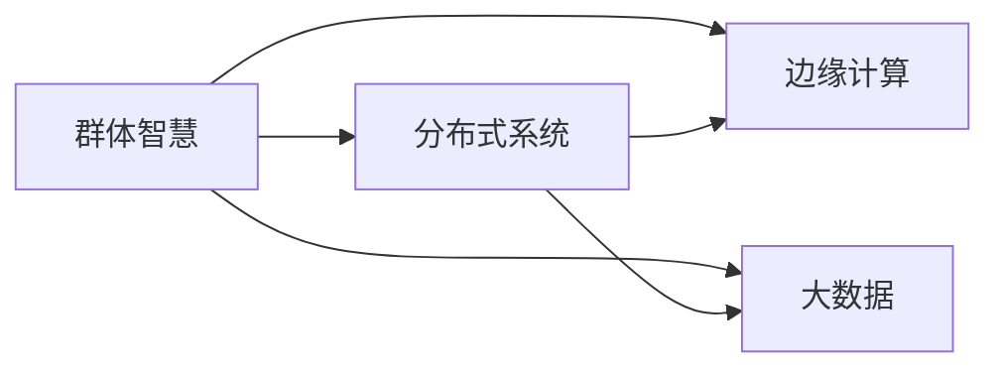

                 

# 群体智慧：人类计算的未来之路

> 关键词：群体智慧, 人类计算, 人工智能, 机器学习, 分布式系统, 边缘计算, 大数据

## 1. 背景介绍

### 1.1 问题由来

随着科技的不断进步，计算机的能力已经从简单的计算任务扩展到了复杂的数据处理和决策支持等领域。然而，计算机的智能水平仍然远低于人类的水平，特别是在涉及人类直觉、经验、情感等方面，计算机的“智能”显得相形见绌。为了解决这些问题，人类计算的概念应运而生。

人类计算（Human Computation）是指通过聚集人类智慧与计算能力相结合，解决传统计算机难以处理的问题。该概念最早由科学家B.J. Akers在2005年提出，意在利用人类在判断、决策、推理、情感等方面的优势，结合计算机的技术优势，实现超越传统计算模式的智能处理。群体智慧（Crowd Intelligence）则是人类计算的一种实现方式，通过众人的协作，实现更高效、更灵活的信息处理和决策。

近年来，随着大数据、云计算、物联网等技术的快速发展，群体智慧在金融、医疗、教育、灾害预测等领域得到了广泛应用，推动了人类计算的进一步发展。群体智慧的出现，不仅拓宽了人类计算的应用场景，也带来了新的技术和方法挑战，需要在计算能力、协作机制、数据处理等方面进行深入研究。

### 1.2 问题核心关键点

1. **计算与协作的融合**：群体智慧将计算技术与人类智慧进行有效融合，通过分布式协作，实现更高效的决策和信息处理。
2. **大规模数据处理**：利用人类计算，可以处理大规模数据，进行复杂的模式识别和数据分析，提升信息处理能力。
3. **协作机制设计**：设计有效的协作机制，激发人类协作潜力，实现信息的高效共享和利用。
4. **安全性和隐私保护**：在群体智慧应用中，需要保护参与者的隐私和安全，确保数据处理和协作过程的安全可靠。
5. **模型与算法**：设计和优化群体智慧的计算模型和算法，提高信息处理的准确性和效率。

### 1.3 问题研究意义

群体智慧的研究具有重要意义：

1. **提高决策质量**：通过结合人类智慧和计算能力，可以做出更准确、更全面的决策，提升问题解决的能力。
2. **降低成本**：相比于传统计算方法，群体智慧可以通过大规模协作，降低计算和数据处理的成本。
3. **提升创新能力**：群体智慧可以激发人类的创造力和创新能力，推动技术和知识的进步。
4. **应对复杂问题**：群体智慧能够处理传统计算难以解决的复杂问题，拓展了信息处理和决策的应用范围。
5. **促进社会和谐**：通过协作和信息共享，群体智慧可以增强社会信任和合作，促进社会的和谐发展。

## 2. 核心概念与联系

### 2.1 核心概念概述

为了更好地理解群体智慧的原理与方法，本节将介绍几个关键概念及其内在联系。

- **群体智慧（Crowd Intelligence, CI）**：通过大规模的人类协作，结合计算技术，实现高效的信息处理和决策。群体智慧强调人类智慧与计算机技术的结合。
- **人类计算（Human Computation, HC）**：利用人类的判断、决策、情感等优势，结合计算技术，解决传统计算机难以处理的问题。人类计算的实现方式多种多样，群体智慧是其中一种。
- **分布式系统（Distributed System）**：由多个计算节点组成，通过网络实现信息共享和协同计算的系统。分布式系统是群体智慧的基础架构。
- **边缘计算（Edge Computing）**：在数据产生地进行本地计算，减少数据传输和处理延迟。边缘计算是群体智慧在物联网、智能家居等场景中的应用形式。
- **大数据（Big Data）**：大规模、复杂、多样化的数据集合，需要分布式计算和存储技术进行有效处理。大数据为群体智慧提供了丰富的数据源。

这些概念之间的逻辑关系可以通过以下Mermaid流程图来展示：



这个流程图展示了几大概念之间的内在联系：群体智慧需要依托分布式系统和边缘计算进行大规模协作和本地计算；大数据为群体智慧提供了数据支撑；而计算能力和协作机制的融合，是群体智慧实现的关键。

## 3. 核心算法原理 & 具体操作步骤
### 3.1 算法原理概述

群体智慧的核心算法通常包括以下几个步骤：

1. **数据收集**：通过互联网、社交媒体、传感器等渠道，收集大规模的数据。
2. **数据预处理**：对数据进行清洗、归一化、特征提取等预处理，提高数据的可用性。
3. **分布式计算**：将数据分发到多个计算节点，通过分布式系统进行计算和分析。
4. **协作机制设计**：设计有效的协作机制，激发参与者的积极性，实现信息的高效共享。
5. **结果集成与优化**：对各个计算节点的结果进行集成和优化，提升信息处理的准确性和效率。
6. **反馈与改进**：对群体智慧的计算过程进行反馈，不断改进算法和协作机制。

### 3.2 算法步骤详解

以金融风险预测为例，介绍群体智慧的计算步骤。

1. **数据收集**：
    - 收集金融市场的股票价格、交易量、财务报表等数据。
    - 通过众包平台收集用户对市场情绪的反馈，如乐观、悲观、中性等。

2. **数据预处理**：
    - 对原始数据进行清洗，去除缺失值和异常值。
    - 对财务报表进行归一化处理，将不同单位的数值转化为标准单位。
    - 提取市场情绪的特征，如乐观度、悲观度等。

3. **分布式计算**：
    - 将处理后的数据分发到多个计算节点，如云计算平台。
    - 各个节点使用不同的计算模型进行风险预测，如时间序列分析、机器学习等。
    - 通过分布式系统实现节点间的信息共享和协同计算。

4. **协作机制设计**：
    - 设计奖励机制，激励参与者提供高质量的预测。
    - 建立验证机制，对参与者的预测结果进行验证和反馈。
    - 使用协作平台实现信息共享和交流，提高协作效率。

5. **结果集成与优化**：
    - 对各个节点的预测结果进行集成，如平均值、加权平均值等。
    - 使用机器学习模型对集成结果进行优化，提高预测准确性。
    - 对预测结果进行后处理，如风险评估、决策支持等。

6. **反馈与改进**：
    - 对预测结果进行实时监控，评估预测准确性。
    - 根据预测结果和市场变化，调整计算模型和协作机制。
    - 收集用户反馈，改进计算过程和协作机制。

### 3.3 算法优缺点

群体智慧算法具有以下优点：

1. **高效性**：利用大规模人类智慧和计算资源，可以处理大规模数据和复杂问题，提升信息处理效率。
2. **灵活性**：通过分布式计算和协作机制，可以灵活应对不同场景和问题。
3. **准确性**：通过集成和优化计算结果，可以提高预测和决策的准确性。
4. **成本低**：相比传统计算方法，群体智慧可以降低计算和数据处理的成本。
5. **多样性**：通过多种计算模型和协作机制的融合，实现信息处理的多种可能性。

同时，群体智慧算法也存在以下缺点：

1. **参与者质量**：群体智慧依赖于参与者的智慧和贡献，参与者的素质和动机直接影响结果的准确性。
2. **数据质量**：数据的质量和完整性对结果有重要影响，需要严格的数据预处理和验证。
3. **协作困难**：协作机制的设计和管理复杂，需要高效的协作平台和机制。
4. **安全性**：群体智慧应用中涉及大量敏感数据，需要确保数据安全性和隐私保护。
5. **技术要求高**：群体智慧需要复杂的计算和协作机制，对技术和系统架构要求较高。

### 3.4 算法应用领域

群体智慧在多个领域得到了广泛应用，主要包括以下几个方面：

1. **金融风险预测**：通过结合市场数据和用户情绪，进行风险预测和决策支持。
2. **医疗诊断**：利用众包平台收集医疗数据和专家意见，进行疾病诊断和治疗方案推荐。
3. **城市管理**：通过市民参与和传感器数据，进行交通流量预测和城市规划。
4. **灾害预测**：收集气象数据和专家意见，进行灾害预测和预警。
5. **市场调研**：通过用户调研和数据集成，进行市场分析和趋势预测。

这些应用场景展示了群体智慧的广泛适用性和强大的信息处理能力。

## 4. 数学模型和公式 & 详细讲解 & 举例说明

### 4.1 数学模型构建

群体智慧的计算过程可以通过数学模型进行抽象和分析。以下以金融风险预测为例，介绍群体智慧的数学模型构建。

设 $X$ 为金融市场的各种数据，包括股票价格、交易量、财务报表等，$Y$ 为市场情绪，$Z$ 为其他相关因素。则群体智慧的计算模型可以表示为：

$$
Y = f(X, Z) + \epsilon
$$

其中 $f$ 为计算模型，$\epsilon$ 为随机误差。通过群体智慧的计算过程，可以最大化 $Y$ 的准确性。

### 4.2 公式推导过程

以机器学习模型为例，进行风险预测。设 $X = (x_1, x_2, ..., x_n)$，$Y = y$，$Z = z$。则风险预测的数学模型为：

$$
Y = w^T X + b + \epsilon
$$

其中 $w$ 为模型参数，$b$ 为偏置，$\epsilon$ 为随机误差。通过最小化均方误差（MSE）或交叉熵（CE）损失函数，可以得到最优参数：

$$
\min_{w, b} \frac{1}{N} \sum_{i=1}^N (Y_i - w^T X_i - b)^2
$$

通过梯度下降等优化算法，求解上述问题，即可得到最优参数 $w$ 和 $b$，进行风险预测。

### 4.3 案例分析与讲解

以金融市场数据为例，进行群体智慧的风险预测。

假设有一个包含 $N$ 条股票数据的历史交易记录，每条记录包括股票代码、价格、交易量等信息。通过群体智慧的计算，可以得到市场情绪 $Y$ 和相关因素 $Z$。利用机器学习模型，对市场情绪进行预测，可以表达为：

$$
Y = w^T X + b + \epsilon
$$

其中 $X$ 为历史交易记录的特征向量，$w$ 和 $b$ 为模型参数，$\epsilon$ 为随机误差。通过最小化损失函数，可以得到最优参数，进行风险预测。

在实际应用中，可以通过以下步骤实现：

1. **数据收集**：
    - 收集历史交易记录和市场情绪数据。
    - 将数据进行预处理和特征提取。

2. **分布式计算**：
    - 将数据分发到多个计算节点。
    - 各个节点使用不同的机器学习模型进行预测。
    - 通过分布式系统实现信息共享和协同计算。

3. **协作机制设计**：
    - 设计奖励机制，激励参与者提供高质量的预测。
    - 建立验证机制，对参与者的预测结果进行验证和反馈。
    - 使用协作平台实现信息共享和交流。

4. **结果集成与优化**：
    - 对各个节点的预测结果进行集成，如平均值、加权平均值等。
    - 使用机器学习模型对集成结果进行优化，提高预测准确性。
    - 对预测结果进行后处理，如风险评估、决策支持等。

5. **反馈与改进**：
    - 对预测结果进行实时监控，评估预测准确性。
    - 根据预测结果和市场变化，调整计算模型和协作机制。
    - 收集用户反馈，改进计算过程和协作机制。

## 5. 项目实践：代码实例和详细解释说明

### 5.1 开发环境搭建

为了实现群体智慧的计算过程，需要搭建一个分布式计算环境。以下是搭建环境的步骤：

1. **安装分布式计算框架**：
    - 安装Apache Hadoop、Apache Spark等分布式计算框架。
    - 配置集群节点，确保网络互通和数据共享。

2. **安装数据处理工具**：
    - 安装Apache Hive、Apache Pig等数据处理工具，用于数据的预处理和集成。
    - 配置数据仓库，存储和管理系统数据。

3. **安装协作平台**：
    - 安装Web协作平台，如JIRA、Confluence等，用于任务分配和信息共享。
    - 配置平台接口，实现数据和计算节点之间的交互。

完成上述步骤后，即可在分布式环境中进行群体智慧的计算实践。

### 5.2 源代码详细实现

以下是一个简单的群体智慧计算代码实现示例：

```python
# 导入必要的库
import numpy as np
from sklearn.linear_model import LinearRegression
from sklearn.metrics import mean_squared_error

# 定义数据
X = np.random.rand(100, 4)  # 特征向量
Y = np.random.rand(100)    # 市场情绪
Z = np.random.rand(100)    # 其他相关因素

# 定义机器学习模型
model = LinearRegression()

# 训练模型
model.fit(X, Y)

# 预测新数据
X_test = np.random.rand(10, 4)
Y_pred = model.predict(X_test)

# 计算均方误差
mse = mean_squared_error(Y, Y_pred)
print("均方误差：", mse)
```

### 5.3 代码解读与分析

代码实现中，我们使用了Python语言和Scikit-learn库，进行线性回归模型的训练和预测。通过最小化均方误差，得到了最优模型参数。

1. **数据生成**：
    - 使用numpy生成100条样本数据，包含4个特征和1个市场情绪。
    - 随机生成100个市场情绪和相关因素数据。

2. **模型训练**：
    - 使用线性回归模型，对数据进行拟合。
    - 通过最小化均方误差，求解最优模型参数。

3. **预测和评估**：
    - 使用模型对新数据进行预测。
    - 计算预测结果的均方误差，评估模型性能。

## 6. 实际应用场景

### 6.1 智能金融风控

在智能金融风控领域，群体智慧可以通过多种方式实现：

1. **信用评分**：通过收集用户的历史行为数据和社交网络数据，进行信用评分。
2. **欺诈检测**：利用用户报告和机器学习模型，进行实时欺诈检测和预警。
3. **投资建议**：结合市场情绪和专家意见，进行投资建议和风险评估。

群体智慧的计算过程可以大大提升金融风控的准确性和效率，降低欺诈和风险。

### 6.2 医疗健康管理

在医疗健康管理领域，群体智慧可以通过多种方式实现：

1. **疾病预测**：通过收集患者历史数据和专家意见，进行疾病预测和早期预警。
2. **治疗方案推荐**：结合医生的专业知识和患者偏好，推荐治疗方案。
3. **健康管理**：通过用户反馈和数据分析，进行健康管理和个性化建议。

群体智慧的计算过程可以提升医疗服务的质量和效率，提供更加个性化和全面的医疗支持。

### 6.3 城市交通规划

在城市交通规划领域，群体智慧可以通过多种方式实现：

1. **交通流量预测**：通过收集交通数据和市民反馈，进行交通流量预测和实时监控。
2. **路网优化**：结合市民出行数据和专家建议，进行路网优化和调整。
3. **公共交通管理**：通过市民反馈和数据分析，优化公共交通管理和服务。

群体智慧的计算过程可以提升城市交通的效率和便捷性，改善市民出行体验。

### 6.4 未来应用展望

随着技术的不断进步，群体智慧的应用前景更加广阔。未来，群体智慧将可能应用到更多领域，包括：

1. **环境保护**：通过收集环保数据和专家意见，进行环境监测和预警。
2. **灾害预警**：利用气象数据和专家意见，进行灾害预测和预警。
3. **农业管理**：通过农民反馈和数据分析，进行农业管理和水资源优化。
4. **教育评估**：利用学生反馈和数据分析，进行教育评估和个性化教学。

## 7. 工具和资源推荐

### 7.1 学习资源推荐

为了帮助开发者系统掌握群体智慧的原理和实践，推荐以下学习资源：

1. **《群体智慧：人类计算的未来之路》**：介绍群体智慧的基本概念、计算模型和应用场景。
2. **《分布式系统设计与实现》**：深入介绍分布式系统的设计、实现和优化方法。
3. **《机器学习实战》**：通过实际案例，介绍机器学习的基本原理和实现方法。
4. **Coursera在线课程**：提供群体智慧、分布式计算和机器学习的在线课程，涵盖基础理论和实践技术。
5. **Kaggle竞赛**：通过参与实际竞赛，提升数据处理和计算能力，积累群体智慧的应用经验。

### 7.2 开发工具推荐

为了高效实现群体智慧的应用，推荐以下开发工具：

1. **Hadoop和Spark**：分布式计算框架，用于处理大规模数据和复杂计算。
2. **Apache Hive和Pig**：数据处理工具，用于数据的预处理和集成。
3. **Web协作平台**：如JIRA、Confluence等，用于任务分配和信息共享。
4. **机器学习库**：如Scikit-learn、TensorFlow等，用于实现机器学习模型。
5. **云计算平台**：如AWS、Google Cloud等，提供分布式计算和存储服务。

### 7.3 相关论文推荐

群体智慧的研究涉及多个学科，以下是几篇重要的相关论文，推荐阅读：

1. **《群体智慧：人类计算的未来之路》**：介绍群体智慧的基本概念和实现方法。
2. **《分布式系统设计与实现》**：深入介绍分布式系统的设计、实现和优化方法。
3. **《机器学习实战》**：通过实际案例，介绍机器学习的基本原理和实现方法。
4. **《分布式计算系统》**：介绍分布式计算系统的架构、协议和应用。
5. **《群体智慧应用研究》**：介绍群体智慧在实际应用中的各种案例和经验。

## 8. 总结：未来发展趋势与挑战

### 8.1 总结

本文对群体智慧的概念、计算模型和应用场景进行了全面介绍。通过群体智慧的计算过程，可以显著提升信息处理的效率和准确性，拓展应用场景。同时，群体智慧也面临着一些挑战，需要在计算能力、协作机制、数据处理等方面进行深入研究。

### 8.2 未来发展趋势

群体智慧的未来发展趋势包括以下几个方面：

1. **智能化的协作机制**：通过引入人工智能技术，设计更加智能化的协作机制，提高群体智慧的计算效率。
2. **跨领域的知识融合**：结合不同领域的知识，进行跨领域的知识融合和创新，提升群体智慧的智能水平。
3. **边缘计算的普及**：利用边缘计算技术，实现本地计算和数据处理，提升群体智慧的实时性和灵活性。
4. **数据治理与隐私保护**：建立完善的数据治理和隐私保护机制，保障数据安全和用户隐私。
5. **持续学习和适应性**：通过持续学习和适应性机制，提升群体智慧的动态调整和优化能力。

### 8.3 面临的挑战

尽管群体智慧有着广阔的应用前景，但也面临着诸多挑战：

1. **参与者的多样性和质量**：群体智慧依赖于参与者的智慧和贡献，参与者的多样性和质量直接影响结果的准确性。
2. **数据质量和完整性**：数据的质量和完整性对结果有重要影响，需要严格的数据预处理和验证。
3. **协作机制的设计和管理**：协作机制的设计和管理复杂，需要高效的协作平台和机制。
4. **安全性与隐私保护**：群体智慧应用中涉及大量敏感数据，需要确保数据安全性和隐私保护。
5. **技术要求高**：群体智慧需要复杂的计算和协作机制，对技术和系统架构要求较高。

### 8.4 研究展望

群体智慧的研究方向包括：

1. **智能化协作机制**：设计更加智能化的协作机制，提高群体智慧的计算效率。
2. **跨领域知识融合**：结合不同领域的知识，进行跨领域的知识融合和创新。
3. **边缘计算的普及**：利用边缘计算技术，实现本地计算和数据处理，提升群体智慧的实时性和灵活性。
4. **数据治理与隐私保护**：建立完善的数据治理和隐私保护机制，保障数据安全和用户隐私。
5. **持续学习和适应性**：通过持续学习和适应性机制，提升群体智慧的动态调整和优化能力。

通过持续的研究和创新，群体智慧将为人类计算带来更加广泛的应用和深刻的变革。

## 9. 附录：常见问题与解答

**Q1：群体智慧与分布式计算的区别是什么？**

A: 群体智慧强调利用人类的智慧和计算机技术相结合，解决复杂问题；而分布式计算强调利用多台计算机协同计算，处理大规模数据。群体智慧是分布式计算的一种应用形式，通过人的智慧提升计算效率。

**Q2：如何设计高效的协作机制？**

A: 设计高效的协作机制需要考虑以下几个方面：
1. **激励机制**：设计激励机制，激发参与者的积极性和贡献。
2. **验证机制**：建立验证机制，对参与者的结果进行验证和反馈。
3. **交流平台**：建立交流平台，实现信息的高效共享和协作。

**Q3：群体智慧在数据处理中面临哪些挑战？**

A: 群体智慧在数据处理中面临以下挑战：
1. **数据质量**：数据的质量和完整性直接影响结果的准确性，需要进行严格的数据预处理和验证。
2. **数据共享**：数据共享和协作过程中需要保障数据安全和隐私。
3. **计算资源**：群体智慧需要大量的计算资源和协同计算，需要高效的分布式计算框架。

**Q4：群体智慧在未来有哪些应用前景？**

A: 群体智慧在未来有以下应用前景：
1. **环境保护**：通过收集环保数据和专家意见，进行环境监测和预警。
2. **灾害预警**：利用气象数据和专家意见，进行灾害预测和预警。
3. **农业管理**：通过农民反馈和数据分析，进行农业管理和水资源优化。
4. **教育评估**：利用学生反馈和数据分析，进行教育评估和个性化教学。

**Q5：群体智慧的优势和劣势是什么？**

A: 群体智慧的优势包括：
1. **高效性**：利用大规模人类智慧和计算资源，处理大规模数据和复杂问题，提升信息处理效率。
2. **灵活性**：通过分布式计算和协作机制，灵活应对不同场景和问题。
3. **准确性**：通过集成和优化计算结果，提高预测和决策的准确性。
4. **成本低**：相比传统计算方法，群体智慧可以降低计算和数据处理的成本。

群体智慧的劣势包括：
1. **参与者质量**：群体智慧依赖于参与者的智慧和贡献，参与者的素质和动机直接影响结果的准确性。
2. **数据质量**：数据的质量和完整性对结果有重要影响，需要严格的数据预处理和验证。
3. **协作困难**：协作机制的设计和管理复杂，需要高效的协作平台和机制。
4. **安全性**：群体智慧应用中涉及大量敏感数据，需要确保数据安全性和隐私保护。
5. **技术要求高**：群体智慧需要复杂的计算和协作机制，对技术和系统架构要求较高。

---

作者：禅与计算机程序设计艺术 / Zen and the Art of Computer Programming

