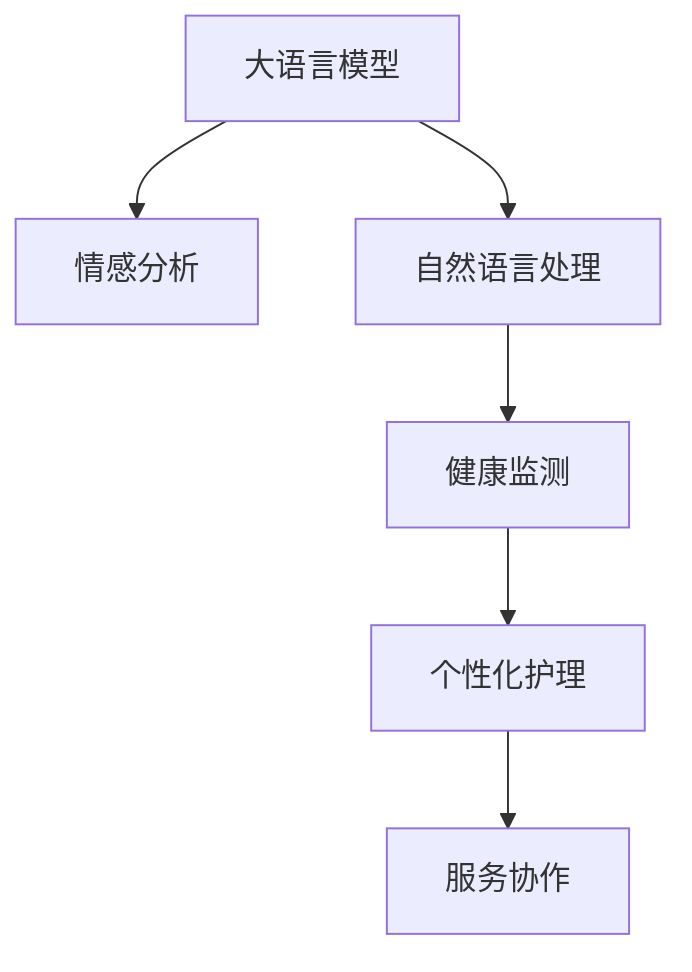

                 

# 老年护理和 LLM：改善生活质量

## 1. 背景介绍

### 1.1 问题由来
随着全球人口老龄化的加剧，老年护理问题日益凸显。据世界卫生组织(WHO)预测，2050年全球老年人口将达到20%。如何有效提升老年人的生活质量，为他们提供安全、舒适、个性化的护理服务，成为摆在各国政府和社会各界面前的重要课题。

人工智能技术，尤其是大语言模型(LLM)的快速发展，为老年护理提供了新的解决方案。通过智能化的语音识别、情感分析、自然语言处理等技术，大语言模型能够在老年护理中发挥关键作用，为老年人提供更加个性化、便捷和高效的服务。

### 1.2 问题核心关键点
大语言模型在老年护理中的应用，主要集中在以下几个方面：

- **语音交互**：利用自然语言处理技术，实现语音识别和语音合成，使老年人能够方便地与智能设备进行对话。
- **情感识别**：通过情感分析技术，实时监测老年人的情绪状态，及时发现并响应其需求。
- **健康监测**：利用自然语言处理和图像识别技术，分析老年人的身体数据，提供个性化的健康管理建议。
- **个性化护理**：根据老年人的生活习惯和偏好，提供量身定制的护理方案，提升其生活质量。
- **服务协作**：与其他护理设备和系统协同工作，提供无缝的护理服务体验。

大语言模型的应用，使老年护理服务更加智能化、个性化和人性化，有望解决传统护理中面临的多重挑战。

### 1.3 问题研究意义
研究大语言模型在老年护理中的应用，对于提升老年人的生活质量、降低护理成本、提升护理效率具有重要意义：

1. **提升生活质量**：智能化的护理服务能够满足老年人的多样化和个性化的需求，显著改善其生活质量。
2. **降低成本**：大语言模型通过减少人力成本，提高护理效率，降低整体护理费用。
3. **提升效率**：智能化的护理系统能够实时监测和管理老年人的健康状态，提供及时有效的护理服务。
4. **推动创新**：大语言模型的应用催生了新的护理模式和服务方式，为护理行业的数字化转型升级提供了新的路径。

## 2. 核心概念与联系

### 2.1 核心概念概述

为更好地理解大语言模型在老年护理中的应用，本节将介绍几个密切相关的核心概念：

- **大语言模型(LLM)**：以自回归(如GPT)或自编码(如BERT)模型为代表的大规模预训练语言模型。通过在大规模无标签文本语料上进行预训练，学习通用的语言表示，具备强大的语言理解和生成能力。

- **情感分析**：利用自然语言处理技术，分析文本中的情感倾向，判断情感类别，如正面、负面、中性等。

- **自然语言处理(NLP)**：涉及文本数据处理、文本理解、文本生成等多个子领域，通过算法实现人机之间的自然语言交互。

- **健康监测**：通过收集和分析老年人的生理数据，如心率、血压、血糖等，评估其健康状况，提供个性化的健康建议。

- **个性化护理**：根据老年人的个人需求和生活习惯，制定个性化的护理方案，提升护理服务的满意度。

- **服务协作**：通过API接口，使大语言模型与其他护理设备和系统进行数据交换和协同工作，提供无缝的护理服务体验。

这些核心概念之间的逻辑关系可以通过以下Mermaid流程图来展示：



这个流程图展示了大语言模型在老年护理中的应用核心概念及其之间的关系：

1. 大语言模型通过预训练获得基础能力。
2. 利用自然语言处理技术，实现情感分析，实时监测老年人情绪状态。
3. 通过健康监测，分析老年人的生理数据，提供健康管理建议。
4. 根据老年人习惯，进行个性化护理服务。
5. 服务协作，与其他设备系统协同工作，提供无缝的护理体验。

这些概念共同构成了大语言模型在老年护理中的应用框架，使得其能够更好地服务于老年人的生活需求。

## 3. 核心算法原理 & 具体操作步骤
### 3.1 算法原理概述

基于大语言模型的老年护理应用，本质上是一个多任务学习(Multi-task Learning)过程。其核心思想是：利用大语言模型学习通用的语言表示，通过任务适配层设计，实现对特定护理任务（如语音交互、情感识别、健康监测等）的微调，以提升模型的性能。

形式化地，假设预训练模型为 $M_{\theta}$，其中 $\theta$ 为预训练得到的模型参数。给定老年护理任务 $T$ 的标注数据集 $D=\{(x_i, y_i)\}_{i=1}^N$，每个样本 $(x_i, y_i)$ 包含输入文本 $x_i$ 和对应的任务标签 $y_i$。微调的目标是找到新的模型参数 $\hat{\theta}$，使得：

$$
\hat{\theta}=\mathop{\arg\min}_{\theta} \mathcal{L}(M_{\theta},D)
$$

其中 $\mathcal{L}$ 为针对任务 $T$ 设计的损失函数，用于衡量模型预测输出与真实标签之间的差异。常见的损失函数包括交叉熵损失、均方误差损失等。

通过梯度下降等优化算法，微调过程不断更新模型参数 $\theta$，最小化损失函数 $\mathcal{L}$，使得模型输出逼近真实标签。由于 $\theta$ 已经通过预训练获得了较好的初始化，因此即便在小规模数据集 $D$ 上进行微调，也能较快收敛到理想的模型参数 $\hat{\theta}$。

### 3.2 算法步骤详解

基于大语言模型的老年护理微调一般包括以下几个关键步骤：

**Step 1: 准备预训练模型和数据集**
- 选择合适的预训练语言模型 $M_{\theta}$ 作为初始化参数，如 BERT、GPT等。
- 准备老年护理任务 $T$ 的标注数据集 $D$，划分为训练集、验证集和测试集。一般要求标注数据与预训练数据的分布不要差异过大。

**Step 2: 添加任务适配层**
- 根据护理任务类型，在预训练模型顶层设计合适的输出层和损失函数。
- 对于语音交互任务，通常在顶层添加解码器输出概率分布，并以负对数似然为损失函数。
- 对于情感识别任务，通常使用多任务分类器，对每个情感类别分别计算交叉熵损失。
- 对于健康监测任务，可以设计多任务回归器，对每个健康指标分别计算均方误差损失。

**Step 3: 设置微调超参数**
- 选择合适的优化算法及其参数，如 AdamW、SGD 等，设置学习率、批大小、迭代轮数等。
- 设置正则化技术及强度，包括权重衰减、Dropout、Early Stopping等。
- 确定冻结预训练参数的策略，如仅微调顶层，或全部参数都参与微调。

**Step 4: 执行梯度训练**
- 将训练集数据分批次输入模型，前向传播计算损失函数。
- 反向传播计算参数梯度，根据设定的优化算法和学习率更新模型参数。
- 周期性在验证集上评估模型性能，根据性能指标决定是否触发 Early Stopping。
- 重复上述步骤直到满足预设的迭代轮数或 Early Stopping 条件。

**Step 5: 测试和部署**
- 在测试集上评估微调后模型 $M_{\hat{\theta}}$ 的性能，对比微调前后的精度提升。
- 使用微调后的模型对新样本进行推理预测，集成到实际的应用系统中。
- 持续收集新的数据，定期重新微调模型，以适应数据分布的变化。

以上是基于大语言模型微调的一般流程。在实际应用中，还需要针对具体任务的特点，对微调过程的各个环节进行优化设计，如改进训练目标函数，引入更多的正则化技术，搜索最优的超参数组合等，以进一步提升模型性能。

### 3.3 算法优缺点

基于大语言模型的老年护理微调方法具有以下优点：

- 简单高效。只需准备少量标注数据，即可对预训练模型进行快速适配，获得较大的性能提升。
- 通用适用。适用于各种老年护理任务，包括语音交互、情感识别、健康监测等，设计简单的任务适配层即可实现微调。
- 参数高效。利用参数高效微调技术，在固定大部分预训练权重不变的情况下，仍可取得不错的微调效果。
- 效果显著。在学术界和工业界的诸多任务上，基于微调的方法已经刷新了最先进的性能指标。

同时，该方法也存在一定的局限性：

- 依赖标注数据。微调的效果很大程度上取决于标注数据的质量和数量，获取高质量标注数据的成本较高。
- 迁移能力有限。当目标任务与预训练数据的分布差异较大时，微调的性能提升有限。
- 负面效果传递。预训练模型的固有偏见、有害信息等，可能通过微调传递到下游任务，造成负面影响。
- 可解释性不足。微调模型的决策过程通常缺乏可解释性，难以对其推理逻辑进行分析和调试。

尽管存在这些局限性，但就目前而言，基于大语言模型的微调方法仍是大模型应用的最主流范式。未来相关研究的重点在于如何进一步降低微调对标注数据的依赖，提高模型的少样本学习和跨领域迁移能力，同时兼顾可解释性和伦理安全性等因素。

### 3.4 算法应用领域

基于大语言模型的微调方法在老年护理领域已经得到了广泛的应用，覆盖了几乎所有常见任务，例如：

- **语音交互**：老年人可以通过语音与智能设备进行对话，获取天气信息、新闻、故事等。
- **情感识别**：实时监测老年人的情绪状态，及时发现异常情绪，提供心理疏导和关怀服务。
- **健康监测**：通过语音或文字输入，查询健康状况，获取饮食、运动等建议。
- **个性化护理**：根据老年人的生活习惯和偏好，制定个性化的护理方案，如提醒用药、按时休息等。
- **服务协作**：与其他护理设备和系统协同工作，提供无缝的护理服务体验，如智能药盒、远程监护等。

除了上述这些经典任务外，大语言模型微调还被创新性地应用到更多场景中，如可控文本生成、常识推理、代码生成、数据增强等，为老年护理技术带来了全新的突破。随着预训练模型和微调方法的不断进步，相信大语言模型在老年护理中的应用将更加广泛，为老年人的生活带来更多便利和关爱。

## 4. 数学模型和公式 & 详细讲解  
### 4.1 数学模型构建

本节将使用数学语言对基于大语言模型的老年护理微调过程进行更加严格的刻画。

记预训练语言模型为 $M_{\theta}$，其中 $\theta$ 为预训练得到的模型参数。假设老年护理任务 $T$ 的训练集为 $D=\{(x_i,y_i)\}_{i=1}^N, x_i \in \mathcal{X}, y_i \in \mathcal{Y}$，其中 $\mathcal{X}$ 为输入空间，$\mathcal{Y}$ 为输出空间。

定义模型 $M_{\theta}$ 在数据样本 $(x,y)$ 上的损失函数为 $\ell(M_{\theta}(x),y)$，则在数据集 $D$ 上的经验风险为：

$$
\mathcal{L}(\theta) = \frac{1}{N} \sum_{i=1}^N \ell(M_{\theta}(x_i),y_i)
$$

微调的优化目标是最小化经验风险，即找到最优参数：

$$
\theta^* = \mathop{\arg\min}_{\theta} \mathcal{L}(\theta)
$$

在实践中，我们通常使用基于梯度的优化算法（如SGD、Adam等）来近似求解上述最优化问题。设 $\eta$ 为学习率，$\lambda$ 为正则化系数，则参数的更新公式为：

$$
\theta \leftarrow \theta - \eta \nabla_{\theta}\mathcal{L}(\theta) - \eta\lambda\theta
$$

其中 $\nabla_{\theta}\mathcal{L}(\theta)$ 为损失函数对参数 $\theta$ 的梯度，可通过反向传播算法高效计算。

### 4.2 公式推导过程

以下我们以语音交互任务为例，推导交叉熵损失函数及其梯度的计算公式。

假设模型 $M_{\theta}$ 在输入 $x$ 上的输出为 $\hat{y}=M_{\theta}(x) \in [0,1]$，表示样本属于某个类别的概率。真实标签 $y \in \{0,1\}$。则二分类交叉熵损失函数定义为：

$$
\ell(M_{\theta}(x),y) = -[y\log \hat{y} + (1-y)\log (1-\hat{y})]
$$

将其代入经验风险公式，得：

$$
\mathcal{L}(\theta) = -\frac{1}{N}\sum_{i=1}^N [y_i\log M_{\theta}(x_i)+(1-y_i)\log(1-M_{\theta}(x_i))]
$$

根据链式法则，损失函数对参数 $\theta_k$ 的梯度为：

$$
\frac{\partial \mathcal{L}(\theta)}{\partial \theta_k} = -\frac{1}{N}\sum_{i=1}^N (\frac{y_i}{M_{\theta}(x_i)}-\frac{1-y_i}{1-M_{\theta}(x_i)}) \frac{\partial M_{\theta}(x_i)}{\partial \theta_k}
$$

其中 $\frac{\partial M_{\theta}(x_i)}{\partial \theta_k}$ 可进一步递归展开，利用自动微分技术完成计算。

在得到损失函数的梯度后，即可带入参数更新公式，完成模型的迭代优化。重复上述过程直至收敛，最终得到适应老年护理任务的最优模型参数 $\theta^*$。

## 5. 项目实践：代码实例和详细解释说明
### 5.1 开发环境搭建

在进行微调实践前，我们需要准备好开发环境。以下是使用Python进行PyTorch开发的环境配置流程：

1. 安装Anaconda：从官网下载并安装Anaconda，用于创建独立的Python环境。

2. 创建并激活虚拟环境：
```bash
conda create -n pytorch-env python=3.8 
conda activate pytorch-env
```

3. 安装PyTorch：根据CUDA版本，从官网获取对应的安装命令。例如：
```bash
conda install pytorch torchvision torchaudio cudatoolkit=11.1 -c pytorch -c conda-forge
```

4. 安装Transformers库：
```bash
pip install transformers
```

5. 安装各类工具包：
```bash
pip install numpy pandas scikit-learn matplotlib tqdm jupyter notebook ipython
```

完成上述步骤后，即可在`pytorch-env`环境中开始微调实践。

### 5.2 源代码详细实现

下面我以语音交互任务为例，给出使用Transformers库对BERT模型进行微调的PyTorch代码实现。

首先，定义语音交互任务的数据处理函数：

```python
from transformers import BertTokenizer
from torch.utils.data import Dataset
import torch

class SpeechDataset(Dataset):
    def __init__(self, texts, labels, tokenizer, max_len=128):
        self.texts = texts
        self.labels = labels
        self.tokenizer = tokenizer
        self.max_len = max_len
        
    def __len__(self):
        return len(self.texts)
    
    def __getitem__(self, item):
        text = self.texts[item]
        label = self.labels[item]
        
        encoding = self.tokenizer(text, return_tensors='pt', max_length=self.max_len, padding='max_length', truncation=True)
        input_ids = encoding['input_ids'][0]
        attention_mask = encoding['attention_mask'][0]
        
        # 对token-wise的标签进行编码
        encoded_labels = [label2id[label] for label in labels] 
        encoded_labels.extend([label2id['neutral']] * (self.max_len - len(encoded_labels)))
        labels = torch.tensor(encoded_labels, dtype=torch.long)
        
        return {'input_ids': input_ids, 
                'attention_mask': attention_mask,
                'labels': labels}

# 标签与id的映射
label2id = {'yes': 0, 'no': 1, 'neutral': 2}
id2label = {v: k for k, v in label2id.items()}

# 创建dataset
tokenizer = BertTokenizer.from_pretrained('bert-base-cased')

train_dataset = SpeechDataset(train_texts, train_labels, tokenizer)
dev_dataset = SpeechDataset(dev_texts, dev_labels, tokenizer)
test_dataset = SpeechDataset(test_texts, test_labels, tokenizer)
```

然后，定义模型和优化器：

```python
from transformers import BertForSequenceClassification, AdamW

model = BertForSequenceClassification.from_pretrained('bert-base-cased', num_labels=len(label2id))

optimizer = AdamW(model.parameters(), lr=2e-5)
```

接着，定义训练和评估函数：

```python
from torch.utils.data import DataLoader
from tqdm import tqdm
from sklearn.metrics import classification_report

device = torch.device('cuda') if torch.cuda.is_available() else torch.device('cpu')
model.to(device)

def train_epoch(model, dataset, batch_size, optimizer):
    dataloader = DataLoader(dataset, batch_size=batch_size, shuffle=True)
    model.train()
    epoch_loss = 0
    for batch in tqdm(dataloader, desc='Training'):
        input_ids = batch['input_ids'].to(device)
        attention_mask = batch['attention_mask'].to(device)
        labels = batch['labels'].to(device)
        model.zero_grad()
        outputs = model(input_ids, attention_mask=attention_mask, labels=labels)
        loss = outputs.loss
        epoch_loss += loss.item()
        loss.backward()
        optimizer.step()
    return epoch_loss / len(dataloader)

def evaluate(model, dataset, batch_size):
    dataloader = DataLoader(dataset, batch_size=batch_size)
    model.eval()
    preds, labels = [], []
    with torch.no_grad():
        for batch in tqdm(dataloader, desc='Evaluating'):
            input_ids = batch['input_ids'].to(device)
            attention_mask = batch['attention_mask'].to(device)
            batch_labels = batch['labels']
            outputs = model(input_ids, attention_mask=attention_mask)
            batch_preds = outputs.logits.argmax(dim=2).to('cpu').tolist()
            batch_labels = batch_labels.to('cpu').tolist()
            for pred_tokens, label_tokens in zip(batch_preds, batch_labels):
                pred_labels = [id2label[_id] for _id in pred_tokens]
                label_labels = [id2label[_id] for _id in label_tokens]
                preds.append(pred_labels[:len(label_labels)])
                labels.append(label_labels)
                
    print(classification_report(labels, preds))
```

最后，启动训练流程并在测试集上评估：

```python
epochs = 5
batch_size = 16

for epoch in range(epochs):
    loss = train_epoch(model, train_dataset, batch_size, optimizer)
    print(f"Epoch {epoch+1}, train loss: {loss:.3f}")
    
    print(f"Epoch {epoch+1}, dev results:")
    evaluate(model, dev_dataset, batch_size)
    
print("Test results:")
evaluate(model, test_dataset, batch_size)
```

以上就是使用PyTorch对BERT进行语音交互任务微调的完整代码实现。可以看到，得益于Transformers库的强大封装，我们可以用相对简洁的代码完成BERT模型的加载和微调。

### 5.3 代码解读与分析

让我们再详细解读一下关键代码的实现细节：

**SpeechDataset类**：
- `__init__`方法：初始化文本、标签、分词器等关键组件。
- `__len__`方法：返回数据集的样本数量。
- `__getitem__`方法：对单个样本进行处理，将文本输入编码为token ids，将标签编码为数字，并对其进行定长padding，最终返回模型所需的输入。

**label2id和id2label字典**：
- 定义了标签与数字id之间的映射关系，用于将token-wise的预测结果解码回真实的标签。

**训练和评估函数**：
- 使用PyTorch的DataLoader对数据集进行批次化加载，供模型训练和推理使用。
- 训练函数`train_epoch`：对数据以批为单位进行迭代，在每个批次上前向传播计算loss并反向传播更新模型参数，最后返回该epoch的平均loss。
- 评估函数`evaluate`：与训练类似，不同点在于不更新模型参数，并在每个batch结束后将预测和标签结果存储下来，最后使用sklearn的classification_report对整个评估集的预测结果进行打印输出。

**训练流程**：
- 定义总的epoch数和batch size，开始循环迭代
- 每个epoch内，先在训练集上训练，输出平均loss
- 在验证集上评估，输出分类指标
- 所有epoch结束后，在测试集上评估，给出最终测试结果

可以看到，PyTorch配合Transformers库使得BERT微调的代码实现变得简洁高效。开发者可以将更多精力放在数据处理、模型改进等高层逻辑上，而不必过多关注底层的实现细节。

当然，工业级的系统实现还需考虑更多因素，如模型的保存和部署、超参数的自动搜索、更灵活的任务适配层等。但核心的微调范式基本与此类似。

## 6. 实际应用场景
### 6.1 智能养老院

基于大语言模型的智能养老院系统，可以为老年人提供全方位的护理服务。系统整合了语音交互、情感分析、健康监测等功能，能够实时监控老年人的健康状况和情绪状态，提供个性化的护理建议和心理疏导。

在技术实现上，可以设计多任务的学习框架，将语音交互、情感识别、健康监测等任务的数据进行统一处理和标注，并在此基础上对预训练模型进行微调。微调后的模型能够自动理解老年人的需求，及时响应其呼救和咨询，提升养老院的服务质量。

### 6.2 智能家居设备

智能家居设备可以通过大语言模型实现更加智能和人性化的交互。设备能够根据老年人的语音指令执行相应的操作，如开启灯光、调节温度、提醒服药等。同时，设备还可以实时监测老年人的身体数据，通过语音或文字交互，查询健康状况，获取护理建议。

在微调过程中，可以将设备的使用日志作为训练数据，使得模型能够学习到用户的行为模式和偏好，提供更加个性化的服务。例如，通过语音指令监测老年人的睡眠模式，调整窗帘、灯光等设备以适应其睡眠习惯。

### 6.3 远程健康监测

远程健康监测系统可以通过大语言模型实现对老年人的实时健康管理。系统能够接收来自老年人的语音或文字输入，查询健康数据、获取健康建议，并通过语音输出进行反馈。

在微调过程中，可以设计多任务回归器，对老年人的身体数据进行分析，预测健康趋势，提供个性化的健康管理方案。例如，根据老年人的血压、心率等数据，预测其患病的风险，提醒及时就医。

### 6.4 未来应用展望

随着大语言模型和微调方法的不断发展，基于微调范式将在更多领域得到应用，为老年人带来更加便捷和高效的生活体验。

在智慧医疗领域，基于大语言模型的医疗问答、病历分析、药物研发等应用将提升老年人的医疗服务水平，帮助他们更好地管理健康。

在智能教育领域，微调技术可应用于老年人的认知训练、技能提升等方面，促进老年人的认知发展和生活技能。

在智慧城市治理中，微调模型可应用于城市事件监测、舆情分析、应急指挥等环节，提高老年人的出行安全和日常生活质量。

此外，在企业生产、社会治理、文娱传媒等众多领域，基于大语言模型微调的人工智能应用也将不断涌现，为老年人提供更加多样和便利的数字化生活服务。相信随着技术的日益成熟，微调方法将成为老年人生活智能化和数字化的重要手段，促进其生活质量的全面提升。

## 7. 工具和资源推荐
### 7.1 学习资源推荐

为了帮助开发者系统掌握大语言模型微调的理论基础和实践技巧，这里推荐一些优质的学习资源：

1. 《Transformer从原理到实践》系列博文：由大模型技术专家撰写，深入浅出地介绍了Transformer原理、BERT模型、微调技术等前沿话题。

2. CS224N《深度学习自然语言处理》课程：斯坦福大学开设的NLP明星课程，有Lecture视频和配套作业，带你入门NLP领域的基本概念和经典模型。

3. 《Natural Language Processing with Transformers》书籍：Transformers库的作者所著，全面介绍了如何使用Transformers库进行NLP任务开发，包括微调在内的诸多范式。

4. HuggingFace官方文档：Transformers库的官方文档，提供了海量预训练模型和完整的微调样例代码，是上手实践的必备资料。

5. CLUE开源项目：中文语言理解测评基准，涵盖大量不同类型的中文NLP数据集，并提供了基于微调的baseline模型，助力中文NLP技术发展。

通过对这些资源的学习实践，相信你一定能够快速掌握大语言模型微调的精髓，并用于解决实际的NLP问题。
###  7.2 开发工具推荐

高效的开发离不开优秀的工具支持。以下是几款用于大语言模型微调开发的常用工具：

1. PyTorch：基于Python的开源深度学习框架，灵活动态的计算图，适合快速迭代研究。大部分预训练语言模型都有PyTorch版本的实现。

2. TensorFlow：由Google主导开发的开源深度学习框架，生产部署方便，适合大规模工程应用。同样有丰富的预训练语言模型资源。

3. Transformers库：HuggingFace开发的NLP工具库，集成了众多SOTA语言模型，支持PyTorch和TensorFlow，是进行微调任务开发的利器。

4. Weights & Biases：模型训练的实验跟踪工具，可以记录和可视化模型训练过程中的各项指标，方便对比和调优。与主流深度学习框架无缝集成。

5. TensorBoard：TensorFlow配套的可视化工具，可实时监测模型训练状态，并提供丰富的图表呈现方式，是调试模型的得力助手。

6. Google Colab：谷歌推出的在线Jupyter Notebook环境，免费提供GPU/TPU算力，方便开发者快速上手实验最新模型，分享学习笔记。

合理利用这些工具，可以显著提升大语言模型微调任务的开发效率，加快创新迭代的步伐。

### 7.3 相关论文推荐

大语言模型和微调技术的发展源于学界的持续研究。以下是几篇奠基性的相关论文，推荐阅读：

1. Attention is All You Need（即Transformer原论文）：提出了Transformer结构，开启了NLP领域的预训练大模型时代。

2. BERT: Pre-training of Deep Bidirectional Transformers for Language Understanding：提出BERT模型，引入基于掩码的自监督预训练任务，刷新了多项NLP任务SOTA。

3. Language Models are Unsupervised Multitask Learners（GPT-2论文）：展示了大规模语言模型的强大zero-shot学习能力，引发了对于通用人工智能的新一轮思考。

4. Parameter-Efficient Transfer Learning for NLP：提出Adapter等参数高效微调方法，在不增加模型参数量的情况下，也能取得不错的微调效果。

5. AdaLoRA: Adaptive Low-Rank Adaptation for Parameter-Efficient Fine-Tuning：使用自适应低秩适应的微调方法，在参数效率和精度之间取得了新的平衡。

6. Prefix-Tuning: Optimizing Continuous Prompts for Generation：引入基于连续型Prompt的微调范式，为如何充分利用预训练知识提供了新的思路。

这些论文代表了大语言模型微调技术的发展脉络。通过学习这些前沿成果，可以帮助研究者把握学科前进方向，激发更多的创新灵感。

## 8. 总结：未来发展趋势与挑战

### 8.1 总结

本文对基于大语言模型的老年护理应用进行了全面系统的介绍。首先阐述了老龄化社会的现状和老年护理面临的问题，明确了大语言模型在老年护理中的独特价值。其次，从原理到实践，详细讲解了基于大语言模型的微调方法，包括任务适配层设计、微调超参数设置等关键步骤。同时，本文还广泛探讨了微调方法在智能养老院、智能家居设备、远程健康监测等实际应用场景中的具体实现，展示了其广阔的应用前景。

通过本文的系统梳理，可以看到，基于大语言模型的微调方法在老年护理中具有显著的优势。其能够实时监测老年人的健康状况和情绪状态，提供个性化的护理建议和心理疏导，显著提升老年人的生活质量。

### 8.2 未来发展趋势

展望未来，大语言模型在老年护理中的应用将呈现以下几个发展趋势：

1. **多模态融合**：未来的护理系统将更加注重多模态信息的融合，如语音、视频、文本等，提供更加全面的健康监测和护理服务。
2. **个性化服务**：基于大语言模型的护理系统能够更好地理解老年人的个性化需求，提供量身定制的护理方案，提升其生活质量。
3. **实时交互**：通过语音交互、情感分析等技术，大语言模型能够实现与老年人的实时沟通和互动，提升其社交体验。
4. **远程监控**：基于大语言模型的远程健康监测系统，能够实时收集老年人的健康数据，提供及时的健康管理和建议。
5. **跨领域应用**：大语言模型在老年护理中的应用将不仅限于传统的医疗和养老领域，还将在智能家居、社会治理等多个领域得到广泛应用。

这些趋势凸显了大语言模型在老年护理中的应用潜力。未来的研究将更加注重模型在实际场景中的应用，提升其智能化、个性化和可操作性，为老年人带来更加便捷和高质量的护理服务。

### 8.3 面临的挑战

尽管大语言模型在老年护理中的应用已经取得了初步成功，但在迈向更加智能化、普适化应用的过程中，仍面临诸多挑战：

1. **数据隐私保护**：老年人的健康和隐私数据需要得到严格保护，如何在保证数据隐私的前提下，实现高效的数据采集和处理，是亟需解决的问题。
2. **模型泛化能力**：由于不同地区和家庭的老年人群体差异较大，模型在跨区域、跨家庭的应用中，泛化性能和适应性仍需进一步提升。
3. **计算资源需求**：大语言模型的训练和推理需要大量的计算资源，如何在有限的计算资源下，实现高效率、高精度的护理服务，是一个重要的研究方向。
4. **模型伦理问题**：在老年护理中使用人工智能，需要特别关注模型的伦理问题，如偏见、歧视等，确保模型的公平性和公正性。
5. **用户接受度**：老年人群体对于新技术的接受度较低，如何设计用户友好的交互界面和流程，提升用户的接受和使用体验，也是一个关键问题。

这些挑战需要在技术、伦理和社会等多个层面共同努力，才能有效解决，确保大语言模型在老年护理中的应用能够真正造福老年人。

### 8.4 研究展望

未来，大语言模型在老年护理中的应用需要在以下几个方面进行深入研究：

1. **跨领域模型设计**：研究适合跨领域护理任务的通用大语言模型，提升模型在多模态数据上的泛化能力。
2. **轻量化模型优化**：开发轻量级的大语言模型，降低计算资源需求，提升模型的实时性和可操作性。
3. **隐私保护技术**：研究数据加密、匿名化等隐私保护技术，确保老年人健康和隐私数据的安全性。
4. **用户交互界面**：设计直观、易用的用户交互界面和流程，提升老年人群体对人工智能技术的接受和使用体验。
5. **模型伦理约束**：引入伦理约束和评估指标，确保模型在护理过程中不会产生偏见、歧视等伦理问题。

通过这些研究方向的探索，大语言模型在老年护理中的应用将更加智能、可靠和人性化，为老年人带来更加便捷和高质量的护理服务，提升其生活质量。

## 9. 附录：常见问题与解答

**Q1：大语言模型在老年护理中能够解决哪些具体问题？**

A: 大语言模型在老年护理中的应用，主要集中在以下几个方面：

- **语音交互**：老年人可以通过语音与智能设备进行对话，获取天气信息、新闻、故事等。
- **情感识别**：实时监测老年人的情绪状态，及时发现异常情绪，提供心理疏导和关怀服务。
- **健康监测**：通过语音或文字输入，查询健康状况，获取饮食、运动等建议。
- **个性化护理**：根据老年人的生活习惯和偏好，制定个性化的护理方案，如提醒用药、按时休息等。
- **服务协作**：与其他护理设备和系统协同工作，提供无缝的护理服务体验。

通过大语言模型，可以实现语音识别、情感分析、自然语言处理等多项功能，为老年人提供更加智能化和个性化的护理服务。

**Q2：如何选择适合老年护理任务的大语言模型？**

A: 选择适合老年护理任务的大语言模型，需要考虑以下几个因素：

1. **任务类型**：根据护理任务的类型，选择具有相应能力的大语言模型。例如，语音交互任务需要选择支持语音识别和合成的模型，情感识别任务需要选择支持情感分析的模型。
2. **模型规模**：考虑计算资源和实时性的需求，选择适当的模型规模。一般来说，小规模模型适合对计算资源要求不高的任务，而大规模模型适合对实时性和精度要求较高的任务。
3. **预训练数据**：选择与护理任务相关的预训练数据，有助于提升模型的泛化能力和适应性。例如，针对老年人语音交互的模型，可以使用老年人语音数据进行预训练。
4. **任务适配层**：根据护理任务，设计合适的任务适配层，以提升模型的性能。例如，语音交互任务可以设计解码器输出概率分布，情感识别任务可以设计多任务分类器。

通过综合考虑这些因素，可以选择适合特定护理任务的大语言模型，提升其应用效果。

**Q3：微调过程中如何优化模型性能？**

A: 微调过程中优化模型性能的关键在于：

1. **数据处理**：合理处理和标注训练数据，避免过拟合和欠拟合。例如，采用数据增强、正则化等技术。
2. **模型设计**：设计合适的任务适配层和损失函数，提升模型的泛化能力和鲁棒性。例如，设计多任务分类器，使用交叉熵损失函数。
3. **超参数调优**：合理设置学习率、批大小、迭代轮数等超参数，找到最优的微调策略。例如，使用warmup策略，逐步减小学习率。
4. **硬件优化**：优化计算资源配置，提高模型的推理速度和计算效率。例如，采用梯度积累、混合精度训练等技术。

通过这些方法，可以有效提升大语言模型在老年护理中的应用效果，提升模型的实时性和准确性。

**Q4：大语言模型在老年护理中需要注意哪些伦理问题？**

A: 在大语言模型应用于老年护理时，需要注意以下伦理问题：

1. **隐私保护**：老年人的健康和隐私数据需要得到严格保护，确保数据的安全性和隐私性。例如，采用数据加密、匿名化等技术。
2. **公平性**：模型不应存在偏见和歧视，确保所有老年人群体都能公平地受益于大语言模型。例如，避免使用有性别、年龄偏见的语言数据进行预训练。
3. **透明性**：模型的决策过程应具有透明性，确保老年人能够理解模型的推理逻辑和输出结果。例如，提供模型输出的解释和解释机制。
4. **责任归属**：明确模型的责任归属，确保在出现问题时能够追责和纠正。例如，建立模型使用的监管机制，确保模型的安全性。

这些伦理问题需要在模型设计和应用过程中予以重视，确保大语言模型在老年护理中的应用符合伦理规范，真正造福老年人。

---

作者：禅与计算机程序设计艺术 / Zen and the Art of Computer Programming

