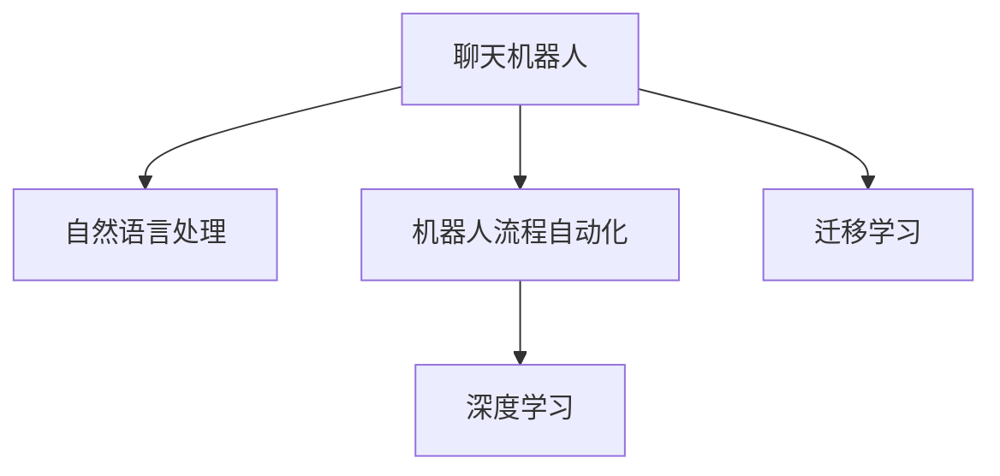

                 

# 聊天机器人制造业4.0：机器人流程自动化

## 1. 背景介绍

### 1.1 问题由来

随着人工智能技术的迅速发展，聊天机器人（Chatbots）已经成为各行各业数字化转型的重要工具。从客服行业到金融服务，从医疗咨询到教育培训，聊天机器人正在全方位地改变人们的生活方式和工作方式。然而，尽管聊天机器人已经取得了显著的进步，但它们在处理复杂任务、提供个性化服务和保持高效率方面仍然存在诸多挑战。

### 1.2 问题核心关键点

聊天机器人制造业4.0的核心理念是通过机器人流程自动化（RPA）技术，使聊天机器人能够更高效、更智能地处理各种任务。RPA技术通过自动化执行重复性高的任务，解放了人类的劳动力，使得聊天机器人可以更专注于复杂、高价值的任务，从而提升整体工作效率和服务质量。

### 1.3 问题研究意义

研究聊天机器人制造业4.0的技术，对于提升聊天机器人的智能化水平、降低开发和维护成本、提升用户体验等方面具有重要意义：

1. 智能化提升：通过RPA技术，聊天机器人可以更智能地处理任务，实现复杂的决策和推理，从而提供更高质量的客户服务。
2. 成本降低：RPA技术能够自动化执行重复性高的任务，减少了人工操作的环节，降低了开发和维护成本。
3. 用户体验优化：通过RPA技术，聊天机器人可以更快速、更准确地响应用户需求，提升用户体验和满意度。
4. 行业适应性增强：RPA技术使得聊天机器人能够适应不同的行业和领域，提升在各个垂直领域的应用效果。

## 2. 核心概念与联系

### 2.1 核心概念概述

为了更好地理解聊天机器人制造业4.0的技术，我们需要了解几个核心概念：

- **聊天机器人（Chatbot）**：基于人工智能技术的虚拟助手，通过自然语言处理技术理解用户输入，并根据用户需求提供相应的回复。
- **机器人流程自动化（RPA）**：通过软件机器人模拟人工操作，自动化执行重复性高的任务，提高工作效率。
- **自然语言处理（NLP）**：使计算机能够理解、解释和生成人类语言的技术，是聊天机器人的核心技术之一。
- **深度学习（Deep Learning）**：一种基于神经网络的机器学习技术，通过大量数据训练模型，实现高效的特征提取和模式识别。
- **迁移学习（Transfer Learning）**：将在一个领域上训练好的模型迁移到另一个领域，减少在新领域上的训练时间和数据需求。

这些核心概念之间的逻辑关系可以通过以下Mermaid流程图来展示：



这个流程图展示了聊天机器人、自然语言处理、机器人流程自动化、深度学习和迁移学习之间的联系和互动。聊天机器人通过自然语言处理技术理解用户输入，并使用机器人流程自动化技术自动化执行任务，同时借助深度学习提升模型性能，利用迁移学习实现模型迁移和优化。

## 3. 核心算法原理 & 具体操作步骤
### 3.1 算法原理概述

聊天机器人制造业4.0的核心算法原理主要基于深度学习和迁移学习技术。深度学习模型通过大量数据训练，学习到丰富的特征表示，从而可以高效地处理各种NLP任务。迁移学习则通过利用已有模型的知识和经验，在新任务上进行微调，从而提升模型的性能。

具体来说，聊天机器人制造业4.0的算法流程可以概括为以下几个步骤：

1. 收集和预处理数据集，包括用户输入和历史聊天记录。
2. 使用预训练模型（如BERT、GPT等）进行特征提取，学习通用的语言表示。
3. 根据具体任务需求，使用迁移学习技术对预训练模型进行微调，提升模型在该任务上的性能。
4. 应用机器人流程自动化技术，自动化执行重复性高的任务，如用户身份验证、常见问题解答等。
5. 通过不断收集用户反馈和行为数据，持续优化聊天机器人的模型和服务质量。

### 3.2 算法步骤详解

下面详细介绍聊天机器人制造业4.0的具体操作步骤：

**Step 1: 数据收集与预处理**

- **收集数据**：从各种渠道收集用户输入和历史聊天记录，包括FAQ、客服对话记录、用户反馈等。
- **数据清洗**：去除噪音数据、重复数据，确保数据质量和完整性。
- **数据标注**：对数据进行标注，标记用户输入对应的意图和实体，用于训练和评估模型。

**Step 2: 预训练模型选择**

- **模型选择**：选择预训练模型，如BERT、GPT等，作为特征提取器。
- **特征提取**：将用户输入转换为模型可接受的格式，如token ids，进行特征提取。

**Step 3: 迁移学习微调**

- **模型微调**：使用迁移学习技术，将预训练模型在新任务上进行微调。
- **任务适配层设计**：根据具体任务需求，设计相应的任务适配层，如分类层、生成层等。
- **损失函数设计**：设计适合该任务的损失函数，如交叉熵损失、均方误差损失等。
- **优化器选择**：选择适合的优化器（如AdamW、SGD等），设置学习率、批大小、迭代轮数等超参数。

**Step 4: 机器人流程自动化**

- **任务自动化**：将聊天机器人自动化执行重复性高的任务，如身份验证、常见问题解答等。
- **流程管理**：设计自动化流程，使用任务调度系统管理任务的执行顺序和状态。
- **交互监控**：实时监控聊天机器人与用户的交互过程，确保交互顺畅。

**Step 5: 持续优化**

- **用户反馈收集**：收集用户对聊天机器人的反馈，包括满意度、改进建议等。
- **模型优化**：根据用户反馈，持续优化模型，提升模型的准确性和适应性。
- **系统维护**：定期维护聊天机器人系统，修复bug，升级模型。

### 3.3 算法优缺点

聊天机器人制造业4.0的算法具有以下优点：

- **高效率**：通过机器人流程自动化技术，聊天机器人可以自动执行重复性高的任务，显著提升工作效率。
- **高智能化**：通过深度学习和迁移学习技术，聊天机器人可以高效处理复杂的NLP任务，提升智能化水平。
- **高可靠性**：通过不断优化和改进模型，聊天机器人可以保证高可靠性，提供稳定、高效的服务。

同时，该算法也存在一些局限性：

- **数据依赖**：聊天机器人依赖大量的标注数据进行训练和微调，获取高质量数据成本较高。
- **模型复杂性**：深度学习和迁移学习模型结构复杂，训练和微调过程需要较长的计算时间。
- **可解释性不足**：模型输出往往缺乏可解释性，难以理解其内部工作机制和推理逻辑。

尽管存在这些局限性，但就目前而言，聊天机器人制造业4.0的算法仍是最主流的方法，广泛用于各种NLP应用场景。

### 3.4 算法应用领域

聊天机器人制造业4.0的算法主要应用于以下领域：

- **客户服务**：通过自动化处理常见问题，提升客户服务效率和满意度。
- **医疗咨询**：提供健康咨询和预约服务，提升医疗服务质量。
- **教育培训**：提供在线课程咨询、作业批改等服务，提升教育培训效果。
- **金融服务**：提供理财咨询、账户管理等服务，提升金融服务体验。
- **人力资源**：提供招聘咨询、员工培训等服务，提升人力资源管理效率。
- **零售电商**：提供产品咨询、订单管理等服务，提升电商用户体验。

## 4. 数学模型和公式 & 详细讲解 & 举例说明

### 4.1 数学模型构建

聊天机器人制造业4.0的数学模型主要基于深度学习模型，如Transformer、BERT等。以BERT模型为例，其数学模型构建可以概括为以下几个步骤：

- **输入表示**：将用户输入转换为模型可接受的格式，如token ids，并进行嵌入。
- **特征提取**：使用预训练模型（如BERT）进行特征提取，学习通用的语言表示。
- **任务适配层设计**：根据具体任务需求，设计相应的任务适配层，如分类层、生成层等。
- **损失函数设计**：设计适合该任务的损失函数，如交叉熵损失、均方误差损失等。
- **优化器选择**：选择适合的优化器（如AdamW、SGD等），设置学习率、批大小、迭代轮数等超参数。

### 4.2 公式推导过程

以BERT模型为例，其数学模型公式可以表示为：

$$
H = Transformer(Embedding(x))
$$

其中，$H$ 为模型的输出表示，$x$ 为输入序列，$Embedding$ 为嵌入层，$Transformer$ 为深度学习模型。

在具体应用中，模型会根据不同的任务设计相应的损失函数，如分类任务使用交叉熵损失：

$$
L = -\sum_{i=1}^N y_i \log p(y_i | x)
$$

其中，$y_i$ 为真实标签，$p(y_i | x)$ 为模型预测概率，$N$ 为样本数。

### 4.3 案例分析与讲解

以下以一个简单的聊天机器人例子，详细讲解其数学模型和算法步骤。

**案例背景**：

- **任务**：聊天机器人回答用户的问题。
- **数据集**：包含FAQ、客服对话记录、用户反馈等。

**算法步骤**：

1. **数据收集与预处理**：
   - **收集数据**：从客服系统中收集FAQ、对话记录和用户反馈。
   - **数据清洗**：去除噪音数据、重复数据，确保数据质量和完整性。
   - **数据标注**：对数据进行标注，标记用户输入对应的意图和实体。

2. **预训练模型选择**：
   - **模型选择**：选择BERT模型作为特征提取器。
   - **特征提取**：将用户输入转换为BERT可接受的格式，如token ids，进行特征提取。

3. **迁移学习微调**：
   - **模型微调**：使用迁移学习技术，将BERT模型在新任务上进行微调。
   - **任务适配层设计**：设计分类层和生成层，用于回答用户问题和生成回复。
   - **损失函数设计**：使用交叉熵损失函数，衡量模型预测和真实标签之间的差异。
   - **优化器选择**：选择AdamW优化器，设置学习率为1e-5，批大小为32。

4. **机器人流程自动化**：
   - **任务自动化**：将聊天机器人自动化执行身份验证、常见问题解答等任务。
   - **流程管理**：设计自动化流程，使用任务调度系统管理任务的执行顺序和状态。
   - **交互监控**：实时监控聊天机器人与用户的交互过程，确保交互顺畅。

5. **持续优化**：
   - **用户反馈收集**：收集用户对聊天机器人的反馈，包括满意度、改进建议等。
   - **模型优化**：根据用户反馈，持续优化模型，提升模型的准确性和适应性。
   - **系统维护**：定期维护聊天机器人系统，修复bug，升级模型。

## 5. 项目实践：代码实例和详细解释说明
### 5.1 开发环境搭建

在进行聊天机器人制造业4.0的开发前，我们需要准备好开发环境。以下是使用Python进行PyTorch开发的环境配置流程：

1. 安装Anaconda：从官网下载并安装Anaconda，用于创建独立的Python环境。

2. 创建并激活虚拟环境：
```bash
conda create -n chatbot-env python=3.8 
conda activate chatbot-env
```

3. 安装PyTorch：根据CUDA版本，从官网获取对应的安装命令。例如：
```bash
conda install pytorch torchvision torchaudio cudatoolkit=11.1 -c pytorch -c conda-forge
```

4. 安装必要的库：
```bash
pip install transformers datasets
```

完成上述步骤后，即可在`chatbot-env`环境中开始聊天机器人制造业4.0的开发。

### 5.2 源代码详细实现

下面我们以一个简单的聊天机器人为例，给出使用Transformers库对BERT模型进行微调的PyTorch代码实现。

**Step 1: 数据处理**

```python
from transformers import BertTokenizer
from datasets import load_dataset
import torch

tokenizer = BertTokenizer.from_pretrained('bert-base-cased')
train_dataset = load_dataset('custom', data_files={'train': 'train.json', 'test': 'test.json'})['train']
test_dataset = load_dataset('custom', data_files={'train': 'train.json', 'test': 'test.json'})['test']

train_encodings = tokenizer(train_dataset['text'], truncation=True, padding='max_length', max_length=128)
test_encodings = tokenizer(test_dataset['text'], truncation=True, padding='max_length', max_length=128)

class CustomDataset(torch.utils.data.Dataset):
    def __init__(self, encodings, labels):
        self.encodings = encodings
        self.labels = labels
        
    def __getitem__(self, idx):
        return {key: torch.tensor(val[idx]) for key, val in self.encodings.items()}, torch.tensor(self.labels[idx])

    def __len__(self):
        return len(self.labels)
        
train_dataset = CustomDataset(train_encodings, train_dataset['label'])
test_dataset = CustomDataset(test_encodings, test_dataset['label'])
```

**Step 2: 模型微调**

```python
from transformers import BertForSequenceClassification

model = BertForSequenceClassification.from_pretrained('bert-base-cased', num_labels=2)
optimizer = AdamW(model.parameters(), lr=2e-5)

device = torch.device('cuda') if torch.cuda.is_available() else torch.device('cpu')
model.to(device)

def train_epoch(model, dataset, batch_size, optimizer):
    dataloader = torch.utils.data.DataLoader(dataset, batch_size=batch_size, shuffle=True)
    model.train()
    epoch_loss = 0
    for batch in dataloader:
        input_ids = batch['input_ids'].to(device)
        attention_mask = batch['attention_mask'].to(device)
        labels = batch['labels'].to(device)
        model.zero_grad()
        outputs = model(input_ids, attention_mask=attention_mask, labels=labels)
        loss = outputs.loss
        epoch_loss += loss.item()
        loss.backward()
        optimizer.step()
    return epoch_loss / len(dataloader)

def evaluate(model, dataset, batch_size):
    dataloader = torch.utils.data.DataLoader(dataset, batch_size=batch_size)
    model.eval()
    preds, labels = [], []
    with torch.no_grad():
        for batch in dataloader:
            input_ids = batch['input_ids'].to(device)
            attention_mask = batch['attention_mask'].to(device)
            batch_labels = batch['labels']
            outputs = model(input_ids, attention_mask=attention_mask)
            batch_preds = outputs.logits.argmax(dim=2).to('cpu').tolist()
            batch_labels = batch_labels.to('cpu').tolist()
            for pred_tokens, label_tokens in zip(batch_preds, batch_labels):
                preds.append(pred_tokens)
                labels.append(label_tokens)
                
    print(classification_report(labels, preds))
```

**Step 3: 机器人流程自动化**

```python
from transformers import AutoTokenizer, AutoModelForSequenceClassification

tokenizer = AutoTokenizer.from_pretrained('bert-base-cased')
model = AutoModelForSequenceClassification.from_pretrained('bert-base-cased', num_labels=2)

def chatbot_qa(input_text, model, tokenizer):
    inputs = tokenizer(input_text, return_tensors='pt', max_length=128, padding='max_length')
    with torch.no_grad():
        outputs = model(**inputs)
        logits = outputs.logits
        probabilities = torch.softmax(logits, dim=1).tolist()
    return probabilities
```

### 5.3 代码解读与分析

让我们再详细解读一下关键代码的实现细节：

**数据处理**：
- `BertTokenizer`用于将文本转换为token ids，并进行padding和truncation。
- `CustomDataset`类用于封装处理后的数据，方便模型训练和推理。
- `load_dataset`函数用于加载自定义数据集，支持不同格式的数据文件。

**模型微调**：
- `BertForSequenceClassification`用于定义序列分类模型，支持二分类任务。
- `AdamW`优化器用于模型参数的优化。
- `train_epoch`和`evaluate`函数用于训练和评估模型。

**机器人流程自动化**：
- `chatbot_qa`函数用于自动化执行常见的问答任务，输入为用户输入文本，输出为模型预测的概率分布。
- `AutoTokenizer`和`AutoModelForSequenceClassification`用于加载预训练模型，方便快捷。

## 6. 实际应用场景
### 6.1 智能客服系统

聊天机器人制造业4.0在智能客服系统中具有广泛的应用前景。传统的客服系统依赖大量人工，难以应对高峰期的服务压力，且服务质量不稳定。通过聊天机器人制造业4.0，可以构建7x24小时不间断的智能客服系统，自动化处理常见问题和复杂任务，提升客户服务效率和满意度。

具体而言，智能客服系统可以包括以下几个模块：

1. **问题预处理**：通过自然语言处理技术，自动理解用户输入的意图和实体。
2. **意图识别**：将用户输入映射到预定义的意图类别，如订单查询、账户管理、产品咨询等。
3. **任务执行**：根据意图类别，调用相应的业务逻辑处理用户请求。
4. **对话管理**：通过对话管理模块，保持与用户的持续对话，及时处理用户请求。

### 6.2 金融咨询服务

金融咨询是聊天机器人制造业4.0的另一个重要应用领域。通过自动化处理用户的投资咨询、账户管理等问题，聊天机器人可以显著提升金融服务的效率和质量。

具体而言，金融咨询服务可以包括以下几个模块：

1. **用户认证**：通过自动化身份验证，确保用户身份的真实性。
2. **投资咨询**：根据用户输入，自动提供投资建议和风险评估。
3. **账户管理**：自动处理用户的账户查询、转账、交易等操作。
4. **风险控制**：实时监控用户的交易行为，及时发现并预防潜在的风险。

### 6.3 在线教育平台

在线教育平台需要面对大量的学生咨询和作业批改任务，传统的客服和教师模式难以满足需求。通过聊天机器人制造业4.0，在线教育平台可以提供高效、个性化的教育服务，提升学生学习体验。

具体而言，在线教育平台可以包括以下几个模块：

1. **课程咨询**：自动回答学生关于课程选择、学习计划等问题。
2. **作业批改**：自动批改学生的作业，提供详细的反馈和建议。
3. **学习指导**：根据学生的学习行为，自动提供个性化的学习建议和资源。
4. **资源推荐**：自动推荐相关的学习资源和材料，提升学生的学习效率。

### 6.4 未来应用展望

随着聊天机器人制造业4.0技术的不断发展，未来的应用场景将会更加丰富和多样化。

1. **医疗健康领域**：通过聊天机器人制造业4.0，可以构建智能化的医疗咨询和健康管理平台，提供疾病诊断、健康咨询、用药指导等服务，提升医疗服务水平。
2. **零售电商领域**：通过聊天机器人制造业4.0，可以构建智能化的电商客服和推荐系统，提升用户的购物体验和满意度。
3. **政府服务领域**：通过聊天机器人制造业4.0，可以构建智能化的政府服务系统，提供高效的政务咨询、办事指南等服务，提升政府服务水平。
4. **娱乐领域**：通过聊天机器人制造业4.0，可以构建智能化的娱乐系统，提供个性化的游戏推荐、虚拟主播等服务，提升娱乐体验。

## 7. 工具和资源推荐
### 7.1 学习资源推荐

为了帮助开发者系统掌握聊天机器人制造业4.0的理论基础和实践技巧，这里推荐一些优质的学习资源：

1. **《机器人流程自动化实战》**：一本系统介绍RPA技术的书，涵盖RPA的基本概念、技术架构、实践案例等。
2. **《聊天机器人开发实战》**：一本详细介绍聊天机器人开发的书，涵盖自然语言处理、对话管理、多模态交互等技术。
3. **Transformers官方文档**：提供了丰富的预训练模型和微调样例代码，是学习聊天机器人制造业4.0不可或缺的资源。
4. **Chatbot Magazine**：一本专注于聊天机器人技术的研究和应用的杂志，定期发布最新的研究进展和应用案例。
5. **NLP-Chatbots GitHub Repo**：一个汇集了大量聊天机器人开源项目的GitHub仓库，包含各种NLP和RPA技术实现。

通过这些资源的学习实践，相信你一定能够快速掌握聊天机器人制造业4.0的精髓，并用于解决实际的NLP问题。

### 7.2 开发工具推荐

高效的开发离不开优秀的工具支持。以下是几款用于聊天机器人制造业4.0开发的常用工具：

1. **Jupyter Notebook**：一个交互式的开发环境，支持Python、R等多种语言，适合数据处理和模型训练。
2. **PyTorch**：基于Python的开源深度学习框架，灵活动态的计算图，适合快速迭代研究。
3. **Transformers库**：HuggingFace开发的NLP工具库，集成了多种预训练模型，支持微调和推理。
4. **RPA框架**：如UiPath、Blue Prism等，提供自动化流程设计和执行功能，支持多种应用场景。
5. **Visual Studio Code**：一个强大的开发IDE，支持Python、R等多种语言，集成了多种扩展和插件，方便开发和调试。

合理利用这些工具，可以显著提升聊天机器人制造业4.0的开发效率，加快创新迭代的步伐。

### 7.3 相关论文推荐

聊天机器人制造业4.0的研究始于学界的持续探索。以下是几篇奠基性的相关论文，推荐阅读：

1. **"Chatbot Architectures: A Survey of Tasks, Architectures, and Applications"**：综述了聊天机器人技术的多种架构和应用场景，有助于理解聊天机器人的发展脉络。
2. **"Robotic Process Automation: A Survey of Techniques, Challenges, and Future Directions"**：综述了RPA技术的发展历程、挑战和未来方向，有助于理解RPA技术的全面情况。
3. **"Transformers: State-of-the-Art Natural Language Processing"**：介绍了Transformer模型的原理和应用，有助于理解深度学习在NLP任务中的作用。
4. **"Attention Is All You Need"**：介绍了Transformer模型的原理和实现，是Transformer技术的重要基础。
5. **"Mind-Mapping with Conversational Agents"**：介绍了对话系统的架构和设计方法，有助于理解聊天机器人的设计思路。

这些论文代表了大语言模型微调技术的发展脉络。通过学习这些前沿成果，可以帮助研究者把握学科前进方向，激发更多的创新灵感。

## 8. 总结：未来发展趋势与挑战

### 8.1 总结

本文对聊天机器人制造业4.0的技术进行了全面系统的介绍。首先阐述了聊天机器人制造业4.0的背景和研究意义，明确了机器人流程自动化在提升聊天机器人智能化水平、降低开发和维护成本、提升用户体验等方面的独特价值。其次，从原理到实践，详细讲解了聊天机器人制造业4.0的数学模型和算法步骤，给出了微调任务开发的完整代码实例。同时，本文还广泛探讨了聊天机器人制造业4.0在智能客服、金融服务、在线教育等多个行业领域的应用前景，展示了该技术的巨大潜力。最后，本文精选了聊天机器人制造业4.0的各类学习资源，力求为读者提供全方位的技术指引。

通过本文的系统梳理，可以看到，聊天机器人制造业4.0技术正在成为NLP领域的重要范式，极大地拓展了聊天机器人的应用边界，催生了更多的落地场景。受益于大规模语料的预训练和机器人流程自动化技术的结合，聊天机器人制造业4.0必将在NLP技术中发挥越来越重要的作用，深刻影响人类的生产生活方式。

### 8.2 未来发展趋势

展望未来，聊天机器人制造业4.0技术将呈现以下几个发展趋势：

1. **智能化水平提升**：通过深度学习和迁移学习技术，聊天机器人将具备更强的语言理解和生成能力，能够处理更复杂、更个性化的任务。
2. **多模态融合**：将视觉、语音、文本等多种模态数据融合，提升聊天机器人的感知能力和交互效果。
3. **情感智能增强**：通过情感分析和情感生成技术，聊天机器人将具备更强的情感感知和表达能力，提升用户情感体验。
4. **多语言支持**：支持多种语言，能够自动切换语言模式，满足全球用户的需求。
5. **个性化定制**：根据用户行为和偏好，动态调整聊天机器人的行为和回复，提供个性化的服务体验。
6. **自动化水平提升**：通过自动化流程设计和执行，提升聊天机器人的自动化水平，实现更高效的任务处理。

以上趋势凸显了聊天机器人制造业4.0技术的广阔前景。这些方向的探索发展，必将进一步提升聊天机器人的智能化水平和应用范围，为人类生产生活方式带来新的变革。

### 8.3 面临的挑战

尽管聊天机器人制造业4.0技术已经取得了显著进展，但在迈向更加智能化、普适化应用的过程中，仍面临诸多挑战：

1. **数据依赖**：聊天机器人依赖大量的标注数据进行训练和微调，获取高质量数据成本较高。
2. **模型复杂性**：深度学习和迁移学习模型结构复杂，训练和微调过程需要较长的计算时间。
3. **可解释性不足**：模型输出往往缺乏可解释性，难以理解其内部工作机制和推理逻辑。
4. **鲁棒性不足**：聊天机器人面对不同领域、不同场景的任务时，泛化性能往往有限，鲁棒性有待提升。
5. **安全性问题**：聊天机器人可能被恶意攻击或误用，导致数据泄露或信息误导，安全性问题亟需解决。

尽管存在这些挑战，但通过不断的技术创新和应用优化，聊天机器人制造业4.0必将在未来取得更大的突破和应用，推动NLP技术的不断进步。

### 8.4 研究展望

面向未来，聊天机器人制造业4.0的研究需要在以下几个方面寻求新的突破：

1. **无监督和半监督学习**：探索不依赖大规模标注数据的学习方法，利用自监督学习、主动学习等技术，提高聊天机器人的泛化能力和鲁棒性。
2. **多模态融合**：将视觉、语音、文本等多种模态数据融合，提升聊天机器人的感知能力和交互效果，实现更全面的用户理解。
3. **情感智能增强**：研究情感分析、情感生成等技术，提升聊天机器人的情感感知和表达能力，提升用户情感体验。
4. **多语言支持**：开发支持多种语言的聊天机器人，实现语言切换和跨语言交互，满足全球用户的需求。
5. **自动化流程优化**：研究自动化流程设计、执行和管理技术，提升聊天机器人的自动化水平，实现更高效的任务处理。
6. **安全性保障**：研究聊天机器人的安全性问题，采取访问控制、数据加密等措施，保障系统的安全性和隐私性。

这些研究方向将推动聊天机器人制造业4.0技术的不断进步，为NLP技术的发展提供新的动力。

## 9. 附录：常见问题与解答

**Q1：聊天机器人制造业4.0的RPA技术如何实现自动化执行？**

A: 聊天机器人制造业4.0的RPA技术主要通过以下步骤实现自动化执行：

1. **任务识别**：通过自然语言处理技术，自动理解用户输入的意图和实体。
2. **任务分解**：将复杂的任务分解为多个子任务，每个子任务由一个独立的RPA机器人执行。
3. **流程自动化**：使用任务调度系统管理任务的执行顺序和状态，确保任务按序执行。
4. **交互监控**：实时监控聊天机器人与用户的交互过程，确保交互顺畅。
5. **结果反馈**：根据用户反馈，动态调整任务执行策略，优化任务执行效果。

通过以上步骤，聊天机器人制造业4.0能够高效、可靠地执行各种任务，提升工作效率和用户体验。

**Q2：聊天机器人制造业4.0的深度学习模型如何选择？**

A: 聊天机器人制造业4.0的深度学习模型选择主要基于以下几个考虑：

1. **模型效果**：选择效果最优的模型，如BERT、GPT等，确保模型在特定任务上的性能。
2. **计算资源**：根据计算资源的可用性，选择适合模型的计算平台和优化策略，如GPU、TPU、混合精度训练等。
3. **任务需求**：根据具体任务的需求，选择适合的模型结构和优化目标，如分类任务、生成任务、多模态任务等。
4. **可解释性**：选择具有良好可解释性的模型，便于理解和调试。

综合考虑以上因素，选择合适的深度学习模型，可以显著提升聊天机器人制造业4.0的性能和稳定性。

**Q3：聊天机器人制造业4.0的迁移学习如何实现模型迁移和优化？**

A: 聊天机器人制造业4.0的迁移学习主要通过以下步骤实现模型迁移和优化：

1. **预训练模型选择**：选择适合的预训练模型，如BERT、GPT等。
2. **任务适配层设计**：根据具体任务需求，设计相应的任务适配层，如分类层、生成层等。
3. **损失函数设计**：设计适合该任务的损失函数，如交叉熵损失、均方误差损失等。
4. **优化器选择**：选择适合的优化器（如AdamW、SGD等），设置学习率、批大小、迭代轮数等超参数。
5. **模型微调**：将预训练模型在新任务上进行微调，提升模型在该任务上的性能。

通过以上步骤，聊天机器人制造业4.0能够利用已有模型的知识和经验，在新任务上进行高效微调，提升模型的性能和泛化能力。

**Q4：聊天机器人制造业4.0的系统架构如何设计？**

A: 聊天机器人制造业4.0的系统架构主要包括以下几个部分：

1. **前端界面**：通过前端界面，用户可以与聊天机器人进行交互，输入和接收信息。
2. **后端服务**：后端服务包括自然语言处理、对话管理、任务执行等模块，处理用户输入和生成回复。
3. **数据存储**：通过数据存储模块，保存用户输入、历史聊天记录、任务执行记录等数据。
4. **任务调度**：通过任务调度系统，管理任务的执行顺序和状态，确保任务按序执行。
5. **安全控制**：通过安全控制模块，保护系统的安全性和隐私性，防止数据泄露和攻击。

通过以上系统架构的设计，聊天机器人制造业4.0能够高效、可靠地处理各种任务，提供稳定、高效的服务。

**Q5：聊天机器人制造业4.0的训练和微调流程如何实现？**

A: 聊天机器人制造业4.0的训练和微调流程主要包括以下几个步骤：

1. **数据收集与预处理**：从各种渠道收集用户输入和历史聊天记录，并进行清洗、标注等预处理。
2. **模型选择**：选择适合的深度学习模型，如BERT、GPT等。
3. **迁移学习微调**：使用迁移学习技术，将预训练模型在新任务上进行微调，提升模型在该任务上的性能。
4. **任务执行自动化**：通过RPA技术，自动化执行重复性高的任务，如身份验证、常见问题解答等。
5. **持续优化**：根据用户反馈和行为数据，持续优化模型和服务质量。

通过以上步骤，聊天机器人制造业4.0能够高效、可靠地处理各种任务，提升服务质量和用户体验。

---

作者：禅与计算机程序设计艺术 / Zen and the Art of Computer Programming

