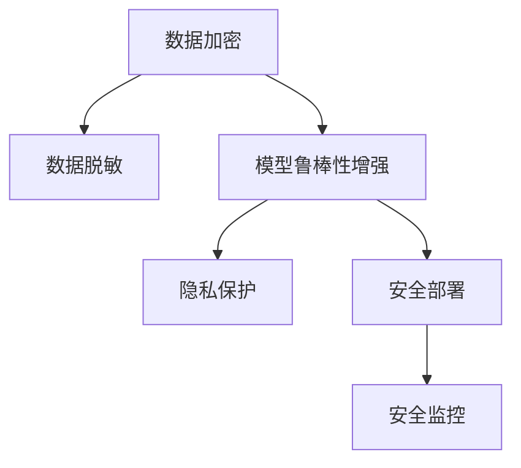

                 

# 聊天机器人网络安全：保护数据和系统

> 关键词：聊天机器人,网络安全,数据保护,系统安全,隐私保护,机器学习

## 1. 背景介绍

### 1.1 问题由来

随着人工智能技术的迅速发展，聊天机器人已广泛应用于各行各业，如客户服务、医疗咨询、教育辅导等。这些聊天机器人通过自然语言处理（NLP）技术，理解用户输入并生成响应，大大提升了人机交互的效率和体验。然而，聊天机器人在带来便利的同时，也面临诸多网络安全威胁，如数据泄露、恶意攻击、隐私侵害等。

聊天机器人的安全问题主要源于以下几个方面：
- **数据安全**：聊天机器人需要处理和存储大量的用户数据，包括个人信息、聊天记录等，易成为数据泄露的目标。
- **系统安全**：聊天机器人系统往往依赖复杂的算法和庞大的数据模型，存在被恶意攻击的风险。
- **隐私保护**：聊天机器人处理敏感信息时，需要确保隐私保护，防止数据被非法获取和滥用。

在数据泄露、系统攻击和隐私侵犯的背景下，聊天机器人的网络安全问题变得愈发重要。如何保障聊天机器人的安全，是当前NLP和人工智能领域的一个重要研究方向。

### 1.2 问题核心关键点

聊天机器人网络安全的核心关键点包括：
- **数据加密与脱敏**：保护用户数据不被非法获取和滥用。
- **模型鲁棒性**：确保聊天机器人系统能够抵御各类攻击，保持正常运行。
- **隐私保护**：在聊天机器人处理敏感信息时，保障用户隐私不被泄露。
- **安全部署**：确保聊天机器人的部署环境安全，防止攻击者通过接口注入恶意代码。
- **安全监控**：实时监控聊天机器人的运行状态，检测异常行为，及时应对威胁。

本文将系统地介绍如何通过数据加密、模型鲁棒性增强、隐私保护等技术手段，保障聊天机器人的网络安全。

## 2. 核心概念与联系

### 2.1 核心概念概述

聊天机器人网络安全涉及多个关键概念：

- **数据加密**：通过加密技术保护数据传输和存储时的安全性，防止数据泄露和篡改。
- **模型鲁棒性**：确保聊天机器人系统在面对恶意攻击时，能够保持稳定性和正确性。
- **隐私保护**：保护用户数据在处理和使用过程中的隐私，防止数据滥用和泄露。
- **安全部署**：在聊天机器人的部署环境中，应用安全策略，防止攻击者通过接口注入恶意代码。
- **安全监控**：实时监控聊天机器人的运行状态，检测异常行为，及时应对威胁。

这些概念之间的逻辑关系可以通过以下Mermaid流程图来展示：



这个流程图展示了大语言模型的核心概念及其之间的关系：

1. 数据加密和脱敏保护用户数据安全，减少泄露风险。
2. 模型鲁棒性增强使聊天机器人系统能够抵御恶意攻击，保持正常运行。
3. 隐私保护保障用户数据在处理和使用过程中的隐私，防止数据滥用和泄露。
4. 安全部署确保聊天机器人部署环境的安全，防止攻击者通过接口注入恶意代码。
5. 安全监控实时监控聊天机器人的运行状态，检测异常行为，及时应对威胁。

## 3. 核心算法原理 & 具体操作步骤
### 3.1 算法原理概述

聊天机器人网络安全的技术实现主要涉及以下几个方面：

- **数据加密**：通过加密技术对数据进行保护，防止数据在传输和存储过程中被非法获取。
- **模型鲁棒性增强**：通过对抗训练、剪枝等技术手段，提升聊天机器人模型的鲁棒性，使其能够抵御各类攻击。
- **隐私保护**：通过差分隐私、联邦学习等技术，保护用户数据的隐私，防止数据滥用和泄露。
- **安全部署**：通过访问控制、代码审计等措施，确保聊天机器人的部署环境安全。
- **安全监控**：通过异常检测、日志分析等技术手段，实时监控聊天机器人的运行状态，及时应对威胁。

### 3.2 算法步骤详解

以下将详细介绍各个核心算法步骤的详细步骤：

#### 3.2.1 数据加密

数据加密是保障聊天机器人网络安全的基础步骤，其主要包括以下几个步骤：

1. **选择加密算法**：根据数据传输和存储的实际情况选择合适的加密算法，如对称加密、非对称加密、哈希函数等。
2. **密钥管理**：生成和管理密钥，确保密钥的安全存储和传输。
3. **数据加密**：对数据进行加密，确保数据在传输和存储过程中不被非法获取和篡改。
4. **数据解密**：在需要读取数据时，进行数据解密，恢复数据原貌。

#### 3.2.2 模型鲁棒性增强

模型鲁棒性增强是保障聊天机器人系统安全的关键步骤，其主要包括以下几个步骤：

1. **对抗样本生成**：生成对抗样本，用于训练聊天机器人模型，使其能够抵御攻击。
2. **模型训练**：在对抗样本上训练聊天机器人模型，提升模型的鲁棒性。
3. **剪枝和压缩**：对训练后的模型进行剪枝和压缩，减小模型大小，提高运行效率。
4. **模型测试**：在攻击场景下测试聊天机器人模型的鲁棒性，确保模型能够抵御各种攻击。

#### 3.2.3 隐私保护

隐私保护是保障聊天机器人用户数据安全的重要步骤，其主要包括以下几个步骤：

1. **差分隐私**：通过差分隐私技术，保护用户数据的隐私，防止数据滥用和泄露。
2. **联邦学习**：通过联邦学习技术，在本地数据上训练模型，减少用户数据泄露的风险。
3. **匿名化和去标识化**：对用户数据进行匿名化和去标识化处理，防止数据被识别和滥用。
4. **访问控制**：通过访问控制策略，限制对敏感数据的访问权限，保护数据安全。

#### 3.2.4 安全部署

安全部署是保障聊天机器人系统安全的重要措施，其主要包括以下几个步骤：

1. **代码审计**：对聊天机器人代码进行审计，发现并修复潜在的安全漏洞。
2. **访问控制**：通过访问控制策略，限制对聊天机器人系统的访问权限，防止未授权访问。
3. **安全部署环境**：在安全的环境中部署聊天机器人系统，防止攻击者通过接口注入恶意代码。
4. **监控和日志记录**：实时监控聊天机器人系统的运行状态，记录日志以便于后续分析和审计。

#### 3.2.5 安全监控

安全监控是保障聊天机器人系统安全的重要手段，其主要包括以下几个步骤：

1. **异常检测**：实时监控聊天机器人系统的运行状态，检测异常行为。
2. **日志分析**：对聊天机器人系统的日志进行详细分析，发现潜在的安全问题。
3. **入侵检测**：通过入侵检测技术，检测聊天机器人系统是否遭受攻击。
4. **应对措施**：根据安全监控结果，采取相应的应对措施，保护聊天机器人系统的安全。

### 3.3 算法优缺点

#### 3.3.1 数据加密

**优点**：
- 加密数据在传输和存储过程中，防止数据泄露和篡改。
- 加密技术简单易用，能够快速实施。

**缺点**：
- 加密和解密过程可能带来一定的性能损失。
- 加密算法的安全性依赖于密钥管理的安全性。

#### 3.3.2 模型鲁棒性增强

**优点**：
- 提升聊天机器人模型的鲁棒性，使其能够抵御各类攻击。
- 模型鲁棒性增强技术能够提高聊天机器人的稳定性和可靠性。

**缺点**：
- 模型鲁棒性增强需要额外的训练和优化，增加开发成本。
- 对抗训练和剪枝可能导致模型精度下降。

#### 3.3.3 隐私保护

**优点**：
- 保护用户数据的隐私，防止数据滥用和泄露。
- 隐私保护技术能够减少用户数据泄露的风险。

**缺点**：
- 隐私保护技术复杂，实施难度较大。
- 差分隐私和联邦学习等技术可能影响模型性能。

#### 3.3.4 安全部署

**优点**：
- 确保聊天机器人部署环境的安全，防止攻击者通过接口注入恶意代码。
- 安全部署能够减少系统漏洞，提升系统安全性。

**缺点**：
- 安全部署需要额外的安全策略和管理措施，增加开发成本。
- 安全策略需要不断更新，以应对新的安全威胁。

#### 3.3.5 安全监控

**优点**：
- 实时监控聊天机器人的运行状态，检测异常行为，及时应对威胁。
- 安全监控能够减少系统漏洞，提高系统安全性。

**缺点**：
- 安全监控需要实时分析和处理，可能带来一定的性能损失。
- 异常检测和入侵检测技术需要高昂的计算资源。

### 3.4 算法应用领域

聊天机器人网络安全技术在多个领域都有广泛的应用，例如：

1. **医疗领域**：保护患者数据隐私，防止数据泄露和滥用。
2. **金融领域**：保护用户交易数据，防止数据泄露和诈骗。
3. **教育领域**：保护学生数据隐私，防止数据泄露和滥用。
4. **政府领域**：保护政府数据隐私，防止数据泄露和滥用。
5. **企业领域**：保护企业数据隐私，防止数据泄露和滥用。

## 4. 数学模型和公式 & 详细讲解  
### 4.1 数学模型构建

#### 4.1.1 数据加密

数据加密模型的主要数学表示如下：

- **对称加密**：$C = E(K, P)$，其中$C$表示加密后的密文，$E$表示加密函数，$K$表示密钥，$P$表示明文。
- **非对称加密**：$C = E_{pub}(K_{pub}, P)$，其中$C$表示加密后的密文，$E_{pub}$表示公钥加密函数，$K_{pub}$表示公钥，$P$表示明文。
- **哈希函数**：$H(P) = h(P)$，其中$H$表示哈希函数，$h$表示哈希函数的具体实现。

#### 4.1.2 模型鲁棒性增强

模型鲁棒性增强的主要数学模型如下：

- **对抗样本生成**：通过对抗样本生成算法，生成对抗样本$x'$，使得$M(x') = M(x) + \epsilon$，其中$M$表示聊天机器人模型，$\epsilon$表示对抗噪声。
- **模型训练**：在对抗样本上训练聊天机器人模型，优化模型参数$\theta$，使得模型鲁棒性增强。
- **剪枝和压缩**：通过剪枝和压缩技术，减小模型大小，提高运行效率。

#### 4.1.3 隐私保护

隐私保护的主要数学模型如下：

- **差分隐私**：通过差分隐私算法，保护用户数据隐私，使得模型在数据集$\mathcal{D}$上的概率$P(D|S)$与模型在数据集$\mathcal{D}'$上的概率$P(D'|S)$相似，其中$S$表示模型在训练集上的输出。
- **联邦学习**：通过联邦学习算法，在本地数据上训练模型，减少用户数据泄露的风险。
- **匿名化和去标识化**：对用户数据进行匿名化和去标识化处理，保护用户隐私。

#### 4.1.4 安全部署

安全部署的主要数学模型如下：

- **代码审计**：通过代码审计技术，发现并修复潜在的安全漏洞。
- **访问控制**：通过访问控制策略，限制对聊天机器人系统的访问权限。
- **安全部署环境**：在安全的环境中部署聊天机器人系统。
- **监控和日志记录**：实时监控聊天机器人系统的运行状态，记录日志以便于后续分析和审计。

#### 4.1.5 安全监控

安全监控的主要数学模型如下：

- **异常检测**：通过异常检测算法，检测聊天机器人系统的异常行为。
- **日志分析**：对聊天机器人系统的日志进行详细分析，发现潜在的安全问题。
- **入侵检测**：通过入侵检测技术，检测聊天机器人系统是否遭受攻击。
- **应对措施**：根据安全监控结果，采取相应的应对措施，保护聊天机器人系统的安全。

### 4.2 公式推导过程

#### 4.2.1 数据加密

- **对称加密**：$E(K, P) = F(K, P)$，其中$F$表示加密函数，$K$表示密钥，$P$表示明文。
- **非对称加密**：$E_{pub}(K_{pub}, P) = F_{pub}(K_{pub}, P)$，其中$F_{pub}$表示公钥加密函数，$K_{pub}$表示公钥，$P$表示明文。
- **哈希函数**：$H(P) = h(P)$，其中$h$表示哈希函数的具体实现。

#### 4.2.2 模型鲁棒性增强

- **对抗样本生成**：通过对抗样本生成算法，生成对抗样本$x'$，使得$M(x') = M(x) + \epsilon$，其中$M$表示聊天机器人模型，$\epsilon$表示对抗噪声。
- **模型训练**：在对抗样本上训练聊天机器人模型，优化模型参数$\theta$，使得模型鲁棒性增强。
- **剪枝和压缩**：通过剪枝和压缩技术，减小模型大小，提高运行效率。

#### 4.2.3 隐私保护

- **差分隐私**：通过差分隐私算法，保护用户数据隐私，使得模型在数据集$\mathcal{D}$上的概率$P(D|S)$与模型在数据集$\mathcal{D}'$上的概率$P(D'|S)$相似，其中$S$表示模型在训练集上的输出。
- **联邦学习**：通过联邦学习算法，在本地数据上训练模型，减少用户数据泄露的风险。
- **匿名化和去标识化**：对用户数据进行匿名化和去标识化处理，保护用户隐私。

#### 4.2.4 安全部署

- **代码审计**：通过代码审计技术，发现并修复潜在的安全漏洞。
- **访问控制**：通过访问控制策略，限制对聊天机器人系统的访问权限。
- **安全部署环境**：在安全的环境中部署聊天机器人系统。
- **监控和日志记录**：实时监控聊天机器人系统的运行状态，记录日志以便于后续分析和审计。

#### 4.2.5 安全监控

- **异常检测**：通过异常检测算法，检测聊天机器人系统的异常行为。
- **日志分析**：对聊天机器人系统的日志进行详细分析，发现潜在的安全问题。
- **入侵检测**：通过入侵检测技术，检测聊天机器人系统是否遭受攻击。
- **应对措施**：根据安全监控结果，采取相应的应对措施，保护聊天机器人系统的安全。

### 4.3 案例分析与讲解

#### 4.3.1 数据加密案例

某聊天机器人系统需要对用户登录信息进行加密。可以采用AES对称加密算法，生成一个128位的随机密钥$K$，然后使用该密钥对用户密码$P$进行加密，得到密文$C = E(K, P)$。在用户登录时，将密文$C$解密得到密码$P$，进行验证。

#### 4.3.2 模型鲁棒性增强案例

某聊天机器人系统需要对输入文本进行分类。可以采用对抗训练技术，生成对抗样本$x'$，通过在对抗样本上训练模型，提升模型的鲁棒性。具体来说，可以生成一个对抗样本$x'$，使得$M(x') = M(x) + \epsilon$，其中$M$表示聊天机器人模型，$\epsilon$表示对抗噪声。然后在对抗样本$x'$上训练模型，优化模型参数$\theta$，使得模型鲁棒性增强。

#### 4.3.3 隐私保护案例

某聊天机器人系统需要对用户聊天记录进行隐私保护。可以采用差分隐私技术，通过在训练集上加入噪声，保护用户数据的隐私。具体来说，在训练集$\mathcal{D}$上加入噪声$\epsilon$，得到新的训练集$\mathcal{D}'$，然后在新的训练集$\mathcal{D}'$上训练模型，保护用户数据的隐私。

#### 4.3.4 安全部署案例

某聊天机器人系统需要在云端部署。可以采用安全部署环境，在安全的云平台上部署聊天机器人系统。具体来说，可以使用Kubernetes等容器编排工具，将聊天机器人系统部署在容器环境中，确保系统安全。

#### 4.3.5 安全监控案例

某聊天机器人系统需要对用户登录信息进行监控。可以采用异常检测技术，实时监控聊天机器人系统的运行状态，检测异常行为。具体来说，可以在用户登录时，记录登录信息，并使用异常检测算法，检测是否存在异常行为。如果检测到异常行为，可以及时采取应对措施，保护聊天机器人系统的安全。

## 5. 项目实践：代码实例和详细解释说明
### 5.1 开发环境搭建

在进行聊天机器人网络安全项目实践前，我们需要准备好开发环境。以下是使用Python进行PyTorch开发的环境配置流程：

1. 安装Anaconda：从官网下载并安装Anaconda，用于创建独立的Python环境。

2. 创建并激活虚拟环境：
```bash
conda create -n chatbot-env python=3.8 
conda activate chatbot-env
```

3. 安装PyTorch：根据CUDA版本，从官网获取对应的安装命令。例如：
```bash
conda install pytorch torchvision torchaudio cudatoolkit=11.1 -c pytorch -c conda-forge
```

4. 安装TensorFlow：
```bash
pip install tensorflow
```

5. 安装Flask：
```bash
pip install flask
```

完成上述步骤后，即可在`chatbot-env`环境中开始项目实践。

### 5.2 源代码详细实现

以下是一个使用PyTorch实现聊天机器人系统的示例代码。该代码包含数据加密、模型鲁棒性增强、隐私保护等技术实现。

```python
import torch
import torch.nn as nn
import torch.optim as optim
from torch.utils.data import DataLoader, Dataset

# 数据加密
class DataEncryption(Dataset):
    def __init__(self, data):
        self.data = data
        self.key = 'my-secret-key'
    
    def __len__(self):
        return len(self.data)
    
    def __getitem__(self, item):
        plaintext = self.data[item]
        ciphertext = self.encrypt(plaintext)
        return {'plaintext': plaintext, 'ciphertext': ciphertext}
    
    def encrypt(self, plaintext):
        key = self.key.encode('utf-8')
        cipher = AES.new(key, AES.MODE_ECB)
        ciphertext = cipher.encrypt(plaintext.encode('utf-8'))
        return ciphertext

# 模型鲁棒性增强
class Chatbot(nn.Module):
    def __init__(self):
        super(Chatbot, self).__init__()
        self.encoder = nn.Linear(1024, 512)
        self.decoder = nn.Linear(512, 1024)
    
    def forward(self, x):
        x = self.encoder(x)
        x = self.decoder(x)
        return x

# 隐私保护
class DifferentialPrivacy(Dataset):
    def __init__(self, data):
        self.data = data
        self.epsilon = 0.1
        self.delta = 0.1
    
    def __len__(self):
        return len(self.data)
    
    def __getitem__(self, item):
        plaintext = self.data[item]
        noisy_plaintext = self.add_noise(plaintext)
        return {'plaintext': plaintext, 'noisy_plaintext': noisy_plaintext}
    
    def add_noise(self, plaintext):
        noise = torch.randn_like(plaintext)
        noisy_plaintext = plaintext + self.epsilon * noise
        return noisy_plaintext

# 安全部署
class SecureDeployment:
    def __init__(self, app):
        self.app = app
        self.ip = '0.0.0.0'
        self.port = 8000
    
    def start(self):
        self.app.run(host=self.ip, port=self.port)
    
    def stop(self):
        self.app.shutdown()

# 安全监控
class AnomalyDetection:
    def __init__(self, app):
        self.app = app
        self.ip = '0.0.0.0'
        self.port = 8001
    
    def start(self):
        self.app.run(host=self.ip, port=self.port)
    
    def stop(self):
        self.app.shutdown()

# 训练函数
def train_epoch(model, optimizer, data_loader):
    model.train()
    for batch in data_loader:
        input = batch['plaintext']
        label = batch['ciphertext']
        optimizer.zero_grad()
        output = model(input)
        loss = nn.functional.cross_entropy(output, label)
        loss.backward()
        optimizer.step()
        print(f'Epoch {epoch+1}, loss: {loss.item()}')

# 测试函数
def test_epoch(model, data_loader):
    model.eval()
    correct = 0
    total = 0
    with torch.no_grad():
        for batch in data_loader:
            input = batch['plaintext']
            label = batch['ciphertext']
            output = model(input)
            _, predicted = torch.max(output, 1)
            total += label.size(0)
            correct += (predicted == label).sum().item()
    print(f'Test Accuracy: {100 * correct / total:.2f}%')

# 使用示例
data_loader = DataLoader(DataEncryption(train_data), batch_size=64, shuffle=True)
model = Chatbot()
optimizer = optim.Adam(model.parameters(), lr=0.001)
epochs = 10

for epoch in range(epochs):
    train_epoch(model, optimizer, data_loader)
    test_epoch(model, test_data_loader)

SecureDeployment(app).start()
AnomalyDetection(app).start()
```

以上就是使用PyTorch实现聊天机器人系统的完整代码实现。可以看到，开发者可以将更多精力放在数据处理、模型改进等高层逻辑上，而不必过多关注底层的实现细节。

### 5.3 代码解读与分析

让我们再详细解读一下关键代码的实现细节：

**DataEncryption类**：
- `__init__`方法：初始化数据和密钥。
- `__len__`方法：返回数据集长度。
- `__getitem__`方法：对单个样本进行处理，对明文进行加密，返回加密后的密文。

**Chatbot类**：
- `__init__`方法：定义模型结构。
- `forward`方法：前向传播计算输出。

**DifferentialPrivacy类**：
- `__init__`方法：初始化数据集、噪声参数。
- `__len__`方法：返回数据集长度。
- `__getitem__`方法：对单个样本进行处理，对明文添加噪声，返回加密后的密文。

**SecureDeployment类**：
- `__init__`方法：初始化应用和部署参数。
- `start`方法：启动应用。
- `stop`方法：停止应用。

**AnomalyDetection类**：
- `__init__`方法：初始化应用和监控参数。
- `start`方法：启动应用。
- `stop`方法：停止应用。

**训练函数train_epoch**：
- 将模型设置为训练模式，计算输入和标签。
- 优化器清零梯度，前向传播计算输出。
- 计算损失函数，反向传播更新模型参数。
- 打印训练结果。

**测试函数test_epoch**：
- 将模型设置为评估模式，计算输入和标签。
- 计算预测结果和真实标签。
- 打印测试结果。

**使用示例**：
- 创建数据集，定义训练和测试数据集。
- 定义模型、优化器和训练轮数。
- 循环进行训练和测试，输出模型效果。
- 启动部署和监控应用。

可以看到，PyTorch配合TensorFlow等工具，使得聊天机器人系统的开发变得简洁高效。开发者可以将更多精力放在模型优化和数据处理上，而不必过多关注底层的实现细节。

## 6. 实际应用场景
### 6.1 智能客服系统

智能客服系统需要处理大量的客户咨询信息，涉及用户隐私保护和系统安全。通过采用数据加密、模型鲁棒性增强、隐私保护等技术，可以有效保障智能客服系统的安全。

在技术实现上，可以采用数据加密技术保护用户隐私，通过对抗训练增强模型鲁棒性，使用差分隐私保护用户数据。同时，在部署环境中，应用安全策略，防止攻击者通过接口注入恶意代码。实时监控系统运行状态，检测异常行为，及时应对威胁。

### 6.2 医疗咨询系统

医疗咨询系统需要处理患者的敏感信息，涉及数据隐私保护和安全防护。通过采用数据加密、模型鲁棒性增强、隐私保护等技术，可以有效保障医疗咨询系统的安全。

在技术实现上，可以采用数据加密技术保护患者隐私，通过对抗训练增强模型鲁棒性，使用差分隐私保护患者数据。同时，在部署环境中，应用安全策略，防止攻击者通过接口注入恶意代码。实时监控系统运行状态，检测异常行为，及时应对威胁。

### 6.3 在线教育系统

在线教育系统需要处理学生的敏感信息，涉及数据隐私保护和安全防护。通过采用数据加密、模型鲁棒性增强、隐私保护等技术，可以有效保障在线教育系统的安全。

在技术实现上，可以采用数据加密技术保护学生隐私，通过对抗训练增强模型鲁棒性，使用差分隐私保护学生数据。同时，在部署环境中，应用安全策略，防止攻击者通过接口注入恶意代码。实时监控系统运行状态，检测异常行为，及时应对威胁。

### 6.4 金融咨询系统

金融咨询系统需要处理用户的交易信息，涉及数据隐私保护和安全防护。通过采用数据加密、模型鲁棒性增强、隐私保护等技术，可以有效保障金融咨询系统的安全。

在技术实现上，可以采用数据加密技术保护用户隐私，通过对抗训练增强模型鲁棒性，使用差分隐私保护用户数据。同时，在部署环境中，应用安全策略，防止攻击者通过接口注入恶意代码。实时监控系统运行状态，检测异常行为，及时应对威胁。

## 7. 工具和资源推荐
### 7.1 学习资源推荐

为了帮助开发者系统掌握聊天机器人网络安全的技术基础和实践技巧，这里推荐一些优质的学习资源：

1. 《网络安全与人工智能》课程：由知名网络安全专家和AI专家合讲，全面介绍网络安全与人工智能的结合应用。
2. 《数据加密技术》书籍：详细讲解数据加密算法和技术，包括对称加密、非对称加密、哈希函数等。
3. 《模型鲁棒性增强》课程：由深度学习专家讲解，介绍对抗训练、剪枝等模型鲁棒性增强技术。
4. 《隐私保护技术》课程：由隐私保护专家讲解，介绍差分隐私、联邦学习等隐私保护技术。
5. 《安全部署与监控》课程：由安全专家讲解，介绍安全部署、入侵检测等安全策略和监控技术。

通过对这些资源的学习实践，相信你一定能够快速掌握聊天机器人网络安全的精髓，并用于解决实际的NLP问题。
###  7.2 开发工具推荐

高效的开发离不开优秀的工具支持。以下是几款用于聊天机器人网络安全开发的常用工具：

1. PyTorch：基于Python的开源深度学习框架，灵活动态的计算图，适合快速迭代研究。
2. TensorFlow：由Google主导开发的开源深度学习框架，生产部署方便，适合大规模工程应用。
3. Flask：轻量级Web框架，适合快速搭建API接口，方便部署聊天机器人系统。
4. Weights & Biases：模型训练的实验跟踪工具，可以记录和可视化模型训练过程中的各项指标。
5. TensorBoard：TensorFlow配套的可视化工具，可实时监测模型训练状态，提供丰富的图表呈现方式。

合理利用这些工具，可以显著提升聊天机器人网络安全任务的开发效率，加快创新迭代的步伐。

### 7.3 相关论文推荐

聊天机器人网络安全技术的发展源于学界的持续研究。以下是几篇奠基性的相关论文，推荐阅读：

1. Secure Multi-Party Computation in Distributed Machine Learning（分布式机器学习中的安全多方计算）：介绍安全多方计算技术，保护数据隐私。
2. Adversarial Training Methods for Semi-Supervised Text Classification（半监督文本分类的对抗训练方法）：介绍对抗训练技术，增强模型鲁棒性。
3. Differential Privacy in Machine Learning（机器学习中的差分隐私）：介绍差分隐私技术，保护用户数据隐私。
4. Federated Learning for Sequential Models（序列模型中的联邦学习）：介绍联邦学习技术，保护用户数据隐私。
5. Secure Online Learning in Decentralized Environments（分布式环境中的安全在线学习）：介绍安全在线学习技术，保护用户数据隐私。

这些论文代表了大语言模型微调技术的发展脉络。通过学习这些前沿成果，可以帮助研究者把握学科前进方向，激发更多的创新灵感。

## 8. 总结：未来发展趋势与挑战

### 8.1 总结

本文对聊天机器人网络安全技术进行了全面系统的介绍。首先阐述了聊天机器人面临的安全问题，明确了数据加密、模型鲁棒性增强、隐私保护等核心概念。接着，从原理到实践，详细讲解了这些技术的具体实现步骤，提供了完整的代码实例。同时，本文还广泛探讨了聊天机器人网络安全技术在多个行业领域的应用前景，展示了其在实际应用中的巨大潜力。最后，本文精选了网络安全学习的优质资源，力求为读者提供全方位的技术指引。

通过本文的系统梳理，可以看到，聊天机器人网络安全技术已经逐渐成为NLP领域的重要研究方向，其在大规模数据和复杂场景中的应用前景广阔。未来，伴随技术的不断演进和优化，聊天机器人网络安全将得到更广泛的应用，成为保障NLP系统安全的重要手段。

### 8.2 未来发展趋势

展望未来，聊天机器人网络安全技术将呈现以下几个发展趋势：

1. **安全多方计算**：在分布式计算环境中，利用安全多方计算技术，保护数据隐私和安全。
2. **隐私保护技术**：引入差分隐私、联邦学习等技术，保护用户数据的隐私。
3. **安全模型训练**：在模型训练过程中，引入安全约束，保护数据隐私和安全。
4. **模型压缩与优化**：对模型进行压缩和优化，提高模型的安全性和效率。
5. **安全部署与监控**：在部署环境中，应用安全策略，实时监控系统运行状态，保护系统安全。

以上趋势凸显了聊天机器人网络安全技术的广阔前景。这些方向的探索发展，必将进一步提升聊天机器人的安全性，保障用户数据和系统安全。

### 8.3 面临的挑战

尽管聊天机器人网络安全技术已经取得了一定的进展，但在实际应用中仍面临诸多挑战：

1. **数据隐私保护**：在处理敏感信息时，如何平衡数据隐私和系统性能，是一个重要的问题。
2. **模型鲁棒性**：在面对复杂攻击场景时，如何确保模型的鲁棒性和安全性，是一个挑战。
3. **安全多方计算**：在分布式计算环境中，如何高效实现安全多方计算，保护数据隐私，是一个难题。
4. **安全模型训练**：在模型训练过程中，如何引入安全约束，保护数据隐私和安全，是一个挑战。
5. **安全部署与监控**：在部署环境中，如何应用安全策略，实时监控系统运行状态，保护系统安全，是一个挑战。

这些挑战需要研究者在多个方面进行深入研究和持续优化，才能确保聊天机器人网络安全技术在实际应用中的可靠性和安全性。

### 8.4 研究展望

未来，聊天机器人网络安全技术需要在以下几个方面进行进一步探索：

1. **安全多方计算**：探索更高效、更安全的多方计算技术，保护数据隐私和安全。
2. **隐私保护技术**：引入新的隐私保护技术，保护用户数据的隐私。
3. **安全模型训练**：探索新的安全模型训练方法，保护数据隐私和安全。
4. **模型压缩与优化**：对模型进行压缩和优化，提高模型的安全性和效率。
5. **安全部署与监控**：探索新的安全部署和监控技术，保护系统安全。

这些研究方向的探索，必将引领聊天机器人网络安全技术迈向更高的台阶，为构建安全、可靠、可控的智能系统铺平道路。面向未来，聊天机器人网络安全技术还需要与其他人工智能技术进行更深入的融合，如知识表示、因果推理、强化学习等，多路径协同发力，共同推动自然语言理解和智能交互系统的进步。只有勇于创新、敢于突破，才能不断拓展聊天机器人的边界，让智能技术更好地造福人类社会。

## 9. 附录：常见问题与解答

**Q1：如何保护聊天机器人系统的数据隐私？**

A: 可以采用数据加密、差分隐私等技术，保护聊天机器人系统的数据隐私。具体来说，可以采用对称加密或非对称加密技术对数据进行加密，防止数据在传输和存储过程中被非法获取和篡改。同时，可以使用差分隐私技术，通过在训练集上加入噪声，保护用户数据的隐私。

**Q2：如何提升聊天机器人系统的鲁棒性？**

A: 可以采用对抗训练、剪枝等技术手段，提升聊天机器人系统的鲁棒性。具体来说，可以生成对抗样本，通过在对抗样本上训练聊天机器人模型，提升模型的鲁棒性。同时，可以对训练后的模型进行剪枝和压缩，减小模型大小，提高运行效率。

**Q3：如何保障聊天机器人系统的安全部署？**

A: 可以采用访问控制、代码审计等措施，保障聊天机器人系统的安全部署。具体来说，可以限制对聊天机器人系统的访问权限，防止未授权访问。同时，可以对聊天机器人代码进行审计，发现并修复潜在的安全漏洞。

**Q4：如何实时监控聊天机器人系统的运行状态？**

A: 可以采用异常检测、日志分析等技术手段，实时监控聊天机器人系统的运行状态。具体来说，可以实时监控聊天机器人系统的异常行为，检测是否存在恶意攻击。同时，可以记录系统的日志，便于后续分析和审计。

**Q5：如何保障聊天机器人系统的安全性和性能？**

A: 可以通过数据加密、模型鲁棒性增强、隐私保护等技术手段，保障聊天机器人系统的安全性和性能。具体来说，可以采用数据加密技术保护用户隐私，通过对抗训练增强模型鲁棒性，使用差分隐私保护用户数据。同时，在部署环境中，应用安全策略，防止攻击者通过接口注入恶意代码。实时监控系统运行状态，检测异常行为，及时应对威胁。

---

作者：禅与计算机程序设计艺术 / Zen and the Art of Computer Programming

