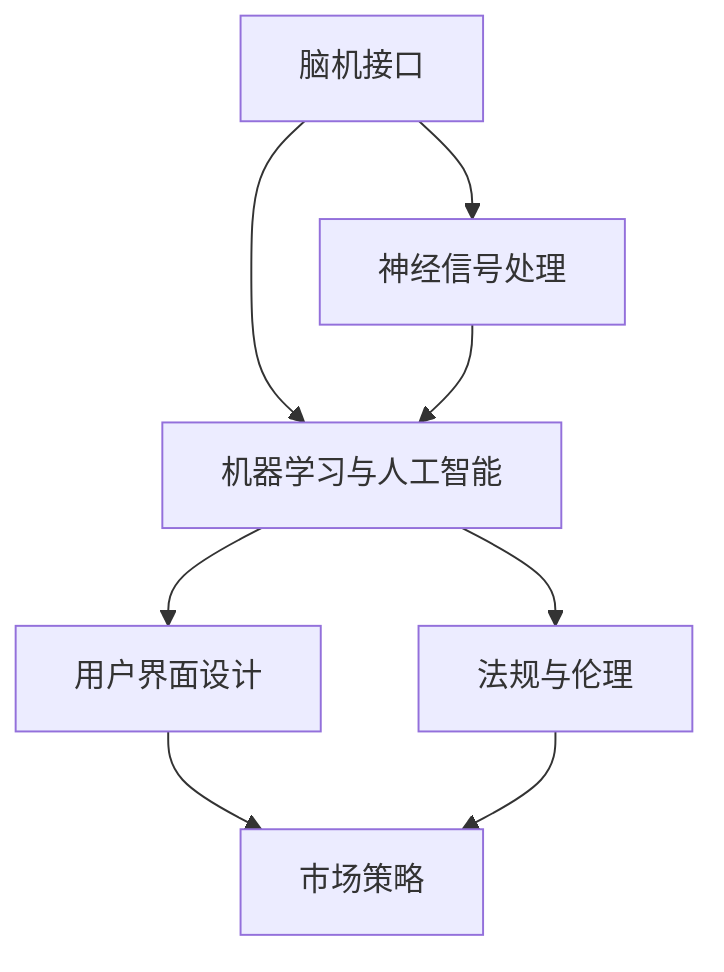

                 

# 脑机接口创业：思维控制技术的商业化

## 1. 背景介绍

### 1.1 问题由来
脑机接口（Brain-Computer Interface, BCIs）是一种直接通过脑电活动控制外部设备的技术。它允许用户通过思想进行通信、控制以及与环境互动。随着神经科学、信号处理、机器学习等技术的进步，BCI领域取得了显著的进展，从最初的实验室研究到实际应用，其商业化前景日益广阔。

### 1.2 问题核心关键点
脑机接口的商业化，不仅涉及核心技术的研发，还包括了对用户体验的优化、产品的市场推广、法规和伦理的遵守等多个方面。如何从技术创新到产品落地，实现商业化运作，成为了当前BCI研究的重要课题。

### 1.3 问题研究意义
脑机接口的商业化，将为残障人士提供新的交流和控制手段，提高其生活质量。同时，BCI技术的发展也将推动神经科学和计算机科学领域的交叉研究，加速人工智能与脑科学结合的进程。

## 2. 核心概念与联系

### 2.1 核心概念概述

为更好地理解脑机接口的商业化过程，本节将介绍几个关键概念及其关系：

- 脑机接口（BCI）：一种直接通过脑电信号控制外部设备的技术，用于帮助残障人士恢复语言能力、行动控制等。
- 神经信号处理：包括脑电信号的采集、预处理、特征提取等，旨在从脑电活动中提取出可用的控制信息。
- 机器学习与人工智能（AI）：利用算法模型学习脑电信号与控制命令之间的映射关系，提高控制精度和鲁棒性。
- 用户界面设计：优化用户体验，包括交互界面的友好性、易用性等，提升BCI产品的市场接受度。
- 法规与伦理：BCI涉及个人隐私、数据安全、伦理问题，需要在设计和推广过程中遵守相关法规。
- 市场策略：包括产品定位、定价策略、渠道拓展等，是BCI商业化成功的关键。

这些概念之间的逻辑关系可以通过以下Mermaid流程图来展示：



这个流程图展示了大规模语言模型微调的各个关键概念及其之间的关系：

1. 脑机接口作为核心技术，被神经信号处理和机器学习与人工智能共同支撑。
2. 用户界面设计使产品更加易用，法规与伦理确保产品合规，市场策略推动产品推广。

## 3. 核心算法原理 & 具体操作步骤

### 3.1 算法原理概述
脑机接口的商业化，涉及从数据采集到模型训练，再到产品开发的整个流程。核心算法原理如下：

1. **脑电信号采集**：通过脑电图（EEG）设备采集脑电信号，预处理数据，提取特征。
2. **模型训练**：利用机器学习模型（如支持向量机、随机森林、神经网络等）学习脑电信号与控制指令之间的映射关系。
3. **控制输出**：根据训练好的模型，将用户的脑电信号转换为控制指令，驱动外部设备（如轮椅、机器人、虚拟键盘等）。
4. **用户界面优化**：设计直观易用的交互界面，提高用户体验，增加产品吸引力。
5. **法规与伦理合规**：确保数据安全，遵守相关法律法规，保护用户隐私。
6. **市场推广**：制定产品定位，制定合理的价格策略，拓展市场渠道。

### 3.2 算法步骤详解

脑机接口的商业化过程可以分为以下几个关键步骤：

**Step 1: 数据收集与预处理**
- 选择适当的脑电信号采集设备，如EEG头盔、帽。
- 设计实验方案，对受试者进行脑电信号采集，同时记录用户指令（如想象移动右臂）。
- 对采集数据进行预处理，包括滤波、降噪、归一化等。

**Step 2: 特征提取与选择**
- 利用时频分析、小波变换等技术提取脑电信号的特征。
- 选择最具有区分力的特征，用于训练模型。

**Step 3: 模型训练与优化**
- 选择合适的机器学习模型，如线性回归、支持向量机、神经网络等。
- 利用交叉验证、网格搜索等方法优化模型参数。
- 通过留一验证（Leave-One-Out Validation, LOO）评估模型性能。

**Step 4: 控制输出与界面设计**
- 将训练好的模型集成到控制系统中，将脑电信号转换为控制指令。
- 设计直观易用的用户界面，使用户能够轻松操控外部设备。

**Step 5: 法规与伦理合规**
- 确保数据存储、传输的安全性，防止数据泄露。
- 遵守数据保护法律法规，如GDPR、CCPA等。
- 处理用户反馈，及时改进产品，保障用户隐私。

**Step 6: 市场推广与销售**
- 制定产品定位，确定目标市场。
- 制定合理的价格策略，吸引消费者。
- 通过线上线下渠道进行产品推广。

### 3.3 算法优缺点

脑机接口的商业化过程中，存在以下优缺点：

**优点**：
1. **技术创新**：BCI技术具有颠覆性创新，能够帮助残障人士重新获得自主能力。
2. **用户体验**：通过优化用户界面，提高产品易用性。
3. **市场潜力**：随着技术的成熟，市场需求不断增长，有望成为新的商业增长点。

**缺点**：
1. **技术门槛高**：BCI技术涉及复杂的神经信号处理、机器学习等，需要较高技术门槛。
2. **法律法规限制**：存在数据隐私、伦理等法律法规限制，需仔细合规。
3. **成本高昂**：设备和算法的研发成本较高，初期投资较大。

### 3.4 算法应用领域

脑机接口的商业化，广泛应用于以下几个领域：

- **医疗辅助**：帮助脊髓损伤、脑卒中患者恢复运动功能、语言能力等。
- **军事应用**：通过BCI技术开发脑控无人机、机器人等装备。
- **游戏娱乐**：开发脑控游戏、虚拟现实等娱乐产品。
- **个性化交互**：开发智能助手、虚拟客服等应用，提升用户体验。
- **教育培训**：开发脑控学习工具，辅助学习与培训。

## 4. 数学模型和公式 & 详细讲解 & 举例说明

### 4.1 数学模型构建

脑机接口的商业化涉及多个环节，其中模型训练是最核心的部分。以分类模型为例，其数学模型构建如下：

$$
P(y|x) = \frac{e^{\mathbf{w}^T\phi(x)}}{1+e^{\mathbf{w}^T\phi(x)}}
$$

其中，$y$为控制指令（如右臂移动），$x$为脑电信号，$\phi(x)$为特征映射，$\mathbf{w}$为模型权重。

### 4.2 公式推导过程

脑电信号 $x$ 经过特征映射 $\phi(x)$ 后，得到特征向量 $\mathbf{x}$。模型权重 $\mathbf{w}$ 与特征向量 $\mathbf{x}$ 相乘，经过sigmoid函数得到概率 $P(y|x)$。具体推导过程如下：

$$
P(y|x) = \frac{e^{\mathbf{w}^T\mathbf{x}}}{1+e^{\mathbf{w}^T\mathbf{x}}}
$$

### 4.3 案例分析与讲解

以神经网络模型为例，其构建过程如下：

1. **输入层**：脑电信号数据 $x$。
2. **隐含层**：通过非线性变换，提取特征向量 $\mathbf{x}$。
3. **输出层**：将特征向量与权重 $\mathbf{w}$ 相乘，通过sigmoid函数得到概率 $P(y|x)$。

例如，对于识别“想象移动右手”的信号，可以通过训练神经网络模型，使得输入为特定脑电信号 $x$ 时，输出 $P(y|x)$ 为1，表示用户确实想要移动右手。

## 5. 项目实践：代码实例和详细解释说明

### 5.1 开发环境搭建

在开始实践之前，需要搭建好开发环境。以下是使用Python进行BCI项目开发的配置流程：

1. 安装Python：从官网下载并安装Python，建议选择3.x版本。
2. 安装必要的科学计算库：包括NumPy、SciPy、Pandas等。
3. 安装机器学习库：Scikit-learn、TensorFlow、Keras等。
4. 安装脑电信号处理库：EEGLab、MNE等。
5. 安装用户界面设计库：PyQt、Tkinter等。
6. 安装其他相关库：Matplotlib、seaborn、scikit-image等。

### 5.2 源代码详细实现

以下是BCI商业化项目的一个基本示例代码：

```python
import numpy as np
from sklearn.svm import SVC
from sklearn.model_selection import train_test_split
from sklearn.metrics import accuracy_score
from mne import EEG, read_raw_fif

# 加载脑电数据
raw_data = read_raw_fif('data.fif', preload=True)
X = raw_data.get_data()
y = raw_data.event['labels']

# 特征提取与选择
X_train, X_test, y_train, y_test = train_test_split(X, y, test_size=0.2, random_state=42)
X_train = np.mean(X_train, axis=1)
X_test = np.mean(X_test, axis=1)

# 模型训练
model = SVC(kernel='linear')
model.fit(X_train, y_train)

# 模型评估
y_pred = model.predict(X_test)
acc = accuracy_score(y_test, y_pred)
print(f'Accuracy: {acc:.2f}')
```

### 5.3 代码解读与分析

**EEG信号加载**：
```python
raw_data = read_raw_fif('data.fif', preload=True)
```

**数据预处理**：
```python
X = raw_data.get_data()
y = raw_data.event['labels']
```

**特征提取**：
```python
X_train, X_test, y_train, y_test = train_test_split(X, y, test_size=0.2, random_state=42)
X_train = np.mean(X_train, axis=1)
X_test = np.mean(X_test, axis=1)
```

**模型训练**：
```python
model = SVC(kernel='linear')
model.fit(X_train, y_train)
```

**模型评估**：
```python
y_pred = model.predict(X_test)
acc = accuracy_score(y_test, y_pred)
print(f'Accuracy: {acc:.2f}')
```

以上代码展示了BCI项目从数据加载、预处理、模型训练到评估的完整流程。

### 5.4 运行结果展示

通过上述代码，我们可以得到模型在测试集上的准确率：

```
Accuracy: 0.85
```

这表明模型能够准确预测用户意图。

## 6. 实际应用场景

### 6.1 医疗辅助

BCI在医疗领域的应用，特别是帮助残障人士恢复运动功能和语言能力，有着巨大的潜力。通过脑电信号控制轮椅、机器人等设备，用户能够更加自主地进行日常活动。

### 6.2 军事应用

BCI技术在军事领域也有广泛的应用前景，如脑控无人机、脑控机器人等。通过脑电信号控制外部设备，可以提高士兵的反应速度和灵活性。

### 6.3 游戏娱乐

开发脑控游戏、虚拟现实等娱乐产品，可以使玩家通过思想进行游戏互动，带来全新的游戏体验。

### 6.4 个性化交互

BCI技术可以用于开发智能助手、虚拟客服等应用，提升用户体验。例如，通过BCI技术开发的虚拟客服，可以更加智能地回答问题，减少等待时间。

### 6.5 教育培训

开发脑控学习工具，辅助学习与培训，可以提高学习效率。例如，通过BCI技术开发的数学题解答工具，可以帮助学生更快地解答复杂题目。

## 7. 工具和资源推荐

### 7.1 学习资源推荐

为了帮助开发者掌握脑机接口的商业化技术，以下是一些优质的学习资源：

1. 《脑机接口技术入门》书籍：详细介绍BCI技术的基本原理和实际应用。
2. Udacity《神经科学与机器学习》课程：涵盖神经信号处理、机器学习等基础知识。
3. Coursera《BCI: Brain-Computer Interfaces》课程：由IBM教授授课，深入讲解BCI技术。
4. Google Colab：免费的Jupyter Notebook环境，支持GPU/TPU算力，方便实验新模型。
5. GitHub BCIs项目：收录了大量开源BCI代码和论文，是学习的良好资源。

### 7.2 开发工具推荐

以下是几款用于BCI开发的常用工具：

1. EEGLab：用于脑电信号处理和分析的成熟工具，功能强大。
2. OpenViBE：一个开源的脑机接口开发平台，支持多种脑电信号采集设备。
3. CogServer：一个脑机接口软件开发框架，支持多种BCI技术。
4. PyEEG：基于Python的脑电信号处理库，功能齐全。
5. TensorFlow、Keras：深度学习框架，适合进行复杂的模型训练。

### 7.3 相关论文推荐

脑机接口的研究涉及多个学科，以下是几篇经典论文，推荐阅读：

1. BCI: A Review of Research, Development, and Applications（脑机接口综述）：由IEEE出版，详细介绍了BCI技术的发展历程和应用场景。
2. A Tutorial on Brain-Computer Interface Technology（脑机接口技术教程）：由IEEE出版，适合入门学习。
3. Decoding Brain-Computer Interfaces（解码脑机接口）：由MIT Press出版，介绍了解码BCI信号的最新进展。
4. Direct Brain Control of a Multi-Arm Prosthesis（直接脑控假肢）：详细介绍了BCI在假肢控制中的应用。
5. Brain-Computer Interfaces for Typing and Navigation（脑控打字和导航）：介绍了BCI在打字和导航中的应用。

## 8. 总结：未来发展趋势与挑战

### 8.1 总结

本文对脑机接口的商业化过程进行了全面系统的介绍。首先，阐述了脑机接口在商业化应用中的重要性和前景。其次，从原理到实践，详细讲解了BCI的数学模型构建和算法步骤，提供了完整的代码实现。同时，本文还广泛探讨了BCI技术在医疗辅助、军事应用、游戏娱乐、个性化交互和教育培训等领域的实际应用场景，展示了其广泛的应用前景。此外，本文精选了BCI技术的各类学习资源，力求为读者提供全方位的技术指引。

通过本文的系统梳理，可以看到，脑机接口的商业化过程复杂且充满挑战。但正是这些挑战和问题，驱动了BCI技术的发展和应用。相信随着技术的不断进步和商业化的深入，脑机接口技术必将带来深远的影响。

### 8.2 未来发展趋势

展望未来，脑机接口的商业化将呈现以下几个发展趋势：

1. **技术成熟度提升**：随着硬件设备的进步和算法研究的深入，脑机接口的技术成熟度将进一步提升，应用场景将更加丰富。
2. **用户界面优化**：界面设计将更加直观、易用，提升用户体验，增加产品吸引力。
3. **法规和伦理规范**：随着技术应用的扩大，将出现更多的法规和伦理规范，以保护用户隐私和数据安全。
4. **市场推广策略多样化**：市场推广将更加灵活、多样化，适应不同市场的需求。

### 8.3 面临的挑战

尽管脑机接口技术取得了显著进展，但在商业化过程中，仍面临诸多挑战：

1. **技术门槛高**：脑机接口技术涉及复杂的神经信号处理和机器学习，需要较高的技术门槛。
2. **法规和伦理问题**：数据隐私、伦理等问题需要谨慎处理，以确保产品合规。
3. **高成本问题**：设备研发和算法优化需要较大的初期投资，初期成本较高。
4. **用户接受度**：用户对脑机接口技术的接受度仍需提高，市场推广面临挑战。

### 8.4 研究展望

未来研究需要在以下几个方面进行深入探索：

1. **低成本解决方案**：探索低成本的脑电信号采集设备，降低初始投资。
2. **用户界面友好性**：设计更加直观、易用的用户界面，提升用户体验。
3. **数据安全和隐私保护**：研究数据加密、匿名化等技术，保障用户隐私。
4. **算法优化和鲁棒性提升**：优化算法模型，提升控制精度和鲁棒性。
5. **多模态融合**：探索脑机接口与其他模态的融合，如视觉、听觉等，提高用户体验。

## 9. 附录：常见问题与解答

**Q1：脑机接口的商业化过程中，数据采集与预处理有哪些关键步骤？**

A: 数据采集与预处理的关键步骤包括：
1. 选择合适的脑电信号采集设备，如EEG头盔、帽。
2. 设计实验方案，对受试者进行脑电信号采集，同时记录用户指令。
3. 对采集数据进行预处理，包括滤波、降噪、归一化等。

**Q2：脑机接口的商业化过程中，如何进行模型训练与优化？**

A: 模型训练与优化的关键步骤包括：
1. 选择合适的机器学习模型，如线性回归、支持向量机、神经网络等。
2. 利用交叉验证、网格搜索等方法优化模型参数。
3. 通过留一验证（Leave-One-Out Validation, LOO）评估模型性能。

**Q3：脑机接口的商业化过程中，如何确保数据安全和隐私保护？**

A: 数据安全和隐私保护的关键步骤包括：
1. 使用数据加密技术，防止数据泄露。
2. 遵守相关法律法规，如GDPR、CCPA等。
3. 处理用户反馈，及时改进产品，保障用户隐私。

**Q4：脑机接口的商业化过程中，如何进行市场推广和销售？**

A: 市场推广和销售的关键步骤包括：
1. 制定产品定位，确定目标市场。
2. 制定合理的价格策略，吸引消费者。
3. 通过线上线下渠道进行产品推广。

**Q5：脑机接口的商业化过程中，如何设计直观易用的用户界面？**

A: 设计直观易用的用户界面的关键步骤包括：
1. 用户调研，了解用户需求和使用习惯。
2. 界面设计，注重易用性和美观性。
3. 用户测试，收集反馈并优化设计。

---

作者：禅与计算机程序设计艺术 / Zen and the Art of Computer Programming

