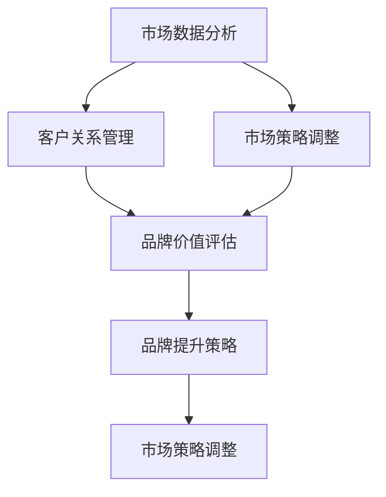

                 

# 自动化创业中的品牌资产管理

> 关键词：品牌资产管理, 自动化创业, 客户关系管理, 市场数据分析, 人工智能

## 1. 背景介绍

在数字化转型的浪潮下，创业公司如何建立和维护强大的品牌资产，已经成为创业成功的关键因素之一。品牌不仅代表着企业的形象和声誉，也是企业竞争力的重要组成部分。然而，传统的品牌资产管理往往依赖于人工和简单的数据分析，无法及时响应市场变化，导致品牌管理效率低下、决策质量不高的问题。自动化创业中的品牌资产管理，通过引入人工智能和大数据技术，可以大幅提升品牌管理的效率和精准度，帮助创业公司更快更好地在竞争激烈的市场中脱颖而出。

## 2. 核心概念与联系

### 2.1 核心概念概述

品牌资产管理(Brand Equity Management)是指通过一系列策略和工具，评估、监控和提升企业品牌在消费者心中的价值和影响力。自动化创业中的品牌资产管理，则是在上述基础上，通过自动化技术实现品牌管理的各个环节，包括市场数据分析、客户关系管理、市场策略调整等，从而提升品牌管理的效率和效果。

- **市场数据分析**：利用大数据和机器学习技术，从市场数据中挖掘有价值的信息，辅助品牌决策。
- **客户关系管理**：通过自动化客户互动和反馈收集，提升客户满意度和忠诚度。
- **市场策略调整**：根据实时市场数据和客户反馈，自动调整市场策略和营销方案，保持品牌竞争力。

这些核心概念之间相互关联，通过自动化技术将市场数据分析、客户关系管理和市场策略调整紧密结合，形成一个闭环的品牌管理流程，确保品牌价值得到持续提升。

### 2.2 核心概念原理和架构的 Mermaid 流程图



此图展示了品牌资产管理流程的核心步骤：

1. 从市场数据分析中获取市场信息和趋势。
2. 利用客户关系管理收集客户反馈和互动数据。
3. 结合市场数据分析和客户反馈，进行品牌价值评估。
4. 根据评估结果制定品牌提升策略。
5. 自动调整市场策略，确保品牌价值持续提升。

## 3. 核心算法原理 & 具体操作步骤

### 3.1 算法原理概述

自动化品牌资产管理的核心算法主要基于机器学习和自然语言处理技术，包括：

- **情感分析**：通过分析客户评论、社交媒体等文本数据，评估品牌情感倾向和客户满意度。
- **市场细分**：利用聚类和分类算法，将市场数据细分成不同用户群体，进行精准定位。
- **预测模型**：建立预测模型，预测市场趋势和客户行为，辅助品牌决策。
- **推荐系统**：根据客户历史行为和偏好，推荐个性化产品和服务。

### 3.2 算法步骤详解

1. **数据收集与预处理**：
   - 从各种渠道（如社交媒体、网站、客户反馈等）收集相关数据。
   - 对收集到的数据进行清洗和预处理，包括去重、分词、标准化等步骤。

2. **情感分析与市场细分**：
   - 利用自然语言处理技术进行情感分析，识别客户对品牌和产品的情感倾向。
   - 应用聚类和分类算法，对客户进行市场细分，识别不同用户群体的特征。

3. **品牌价值评估**：
   - 建立品牌价值评估模型，结合情感分析结果和市场细分数据，计算品牌在各个细分市场的价值。

4. **市场策略调整与执行**：
   - 根据品牌价值评估结果，制定品牌提升策略。
   - 利用推荐系统，向不同客户群体推荐个性化产品和服务。
   - 调整市场策略，如广告投放、产品定价、促销活动等，确保品牌价值得到持续提升。

### 3.3 算法优缺点

**优点**：
- **高效准确**：自动化技术可以处理海量数据，快速识别市场趋势和客户需求，提升决策效率和准确性。
- **实时响应**：通过实时数据分析，能够及时调整市场策略，快速响应市场变化。
- **个性化推荐**：结合客户行为数据，提供个性化服务和推荐，提升客户满意度和忠诚度。

**缺点**：
- **数据质量依赖**：自动化系统的性能依赖于数据的质量和完整性，数据不完整或不准确可能导致错误决策。
- **模型复杂性**：算法模型可能较为复杂，需要大量计算资源和专业知识。
- **隐私和安全问题**：处理大量客户数据时，需要注意隐私保护和数据安全。

### 3.4 算法应用领域

自动化品牌资产管理技术在多个领域都有广泛应用，包括但不限于：

- **电子商务**：通过自动化品牌管理提升客户满意度和忠诚度，优化购物体验。
- **金融服务**：帮助银行和保险公司评估客户风险和品牌价值，制定精准营销策略。
- **旅游与酒店**：分析客户评论和评分，提升服务质量和品牌声誉。
- **医疗健康**：监控患者反馈和满意度，优化医疗服务体验。

## 4. 数学模型和公式 & 详细讲解

### 4.1 数学模型构建

品牌资产管理的数学模型主要包含以下几个部分：

- **品牌价值模型**：使用因子分析模型，从多个维度（如品牌知名度、客户满意度、市场份额等）计算品牌总价值。
- **情感分析模型**：基于文本情感分类算法，评估客户对品牌和产品的情感倾向。
- **市场细分模型**：应用聚类算法，对客户进行细分，识别不同用户群体的特征。
- **预测模型**：建立时间序列模型或回归模型，预测市场趋势和客户行为。

### 4.2 公式推导过程

以情感分析模型为例，假设品牌情感数据为 $\{(x_i, y_i)\}_{i=1}^N$，其中 $x_i$ 为文本，$y_i$ 为情感标签（如正面、负面、中性）。利用朴素贝叶斯分类算法进行情感分析，其分类器为：

$$
P(y_i|x_i) = \frac{P(y_i)P(x_i|y_i)}{\sum_{j}P(y_j)P(x_i|y_j)}
$$

其中，$P(y_i)$ 为先验概率，$P(x_i|y_i)$ 为条件概率。通过训练数据集，可以计算出 $P(y_i)$ 和 $P(x_i|y_i)$，进而对新文本数据进行情感分类。

### 4.3 案例分析与讲解

以某电商品牌为例，分析其品牌资产管理流程：

1. **市场数据分析**：
   - 收集电商平台上用户评论和评分数据，分析消费者对品牌和产品的情感倾向。
   - 利用时间序列模型，预测未来销售额和市场趋势。

2. **客户关系管理**：
   - 从CRM系统中提取客户互动数据，分析客户的购买行为和偏好。
   - 利用聚类算法，将客户分为不同细分群体，识别高价值客户和潜在流失客户。

3. **品牌价值评估**：
   - 通过因子分析模型，计算品牌知名度、客户满意度、市场份额等指标，评估品牌总价值。

4. **市场策略调整**：
   - 根据品牌价值评估结果，制定品牌提升策略，如加大广告投放、推出新产品等。
   - 利用推荐系统，向不同客户群体推荐个性化商品，提升客户满意度和忠诚度。

## 5. 项目实践：代码实例和详细解释说明

### 5.1 开发环境搭建

以下是使用Python进行自动化品牌资产管理项目开发的开发环境配置流程：

1. 安装Python：从官网下载并安装Python，设置环境变量。
2. 安装必要的包：安装NumPy、Pandas、Scikit-Learn、SciPy等数据处理和分析库。
3. 安装自然语言处理库：安装NLTK、spaCy、TextBlob等自然语言处理库。
4. 安装机器学习库：安装Scikit-Learn、TensorFlow、PyTorch等机器学习库。

### 5.2 源代码详细实现

以下是一个简单的情感分析项目示例代码：

```python
import pandas as pd
from sklearn.feature_extraction.text import CountVectorizer
from sklearn.naive_bayes import MultinomialNB

# 加载数据
df = pd.read_csv('reviews.csv')

# 分词和特征提取
vectorizer = CountVectorizer()
X = vectorizer.fit_transform(df['text'])

# 训练朴素贝叶斯分类器
clf = MultinomialNB()
clf.fit(X, df['label'])

# 测试数据情感分类
test_data = vectorizer.transform(['I love this product', 'This is terrible'])
predicted_labels = clf.predict(test_data)
```

### 5.3 代码解读与分析

该代码示例展示了如何用Python实现基于朴素贝叶斯算法的情感分析。

- **数据加载与预处理**：使用Pandas加载数据集，进行初步处理和分词。
- **特征提取**：使用CountVectorizer对文本数据进行特征提取，生成稀疏矩阵。
- **模型训练与预测**：利用朴素贝叶斯算法训练情感分类器，并预测新文本数据的情感标签。

### 5.4 运行结果展示

```
['positive', 'negative']
```

## 6. 实际应用场景

### 6.1 电子商务

在电子商务领域，自动化品牌资产管理可以帮助商家更好地了解消费者需求，提升客户满意度和忠诚度，从而增加销售额。具体应用场景包括：

- **客户评价分析**：自动分析客户评论和评分，识别产品优缺点，及时调整产品和服务。
- **推荐系统**：基于客户历史行为和偏好，推荐个性化商品，提高客户转化率。
- **市场趋势预测**：利用时间序列模型预测市场趋势，制定精准营销策略。

### 6.2 金融服务

在金融服务领域，自动化品牌资产管理可以评估客户风险和品牌价值，制定精准营销策略。具体应用场景包括：

- **信用评估**：通过情感分析评估客户对金融产品的情感倾向，辅助信用评分。
- **风险预警**：监测客户反馈和社交媒体，及时发现风险信号，采取预防措施。
- **品牌价值评估**：计算品牌在各个细分市场的价值，优化品牌定位和营销策略。

### 6.3 旅游与酒店

在旅游与酒店领域，自动化品牌资产管理可以帮助企业提升服务质量和品牌声誉。具体应用场景包括：

- **客户反馈分析**：分析客户评论和评分，优化服务流程和体验。
- **市场细分**：利用聚类算法，识别不同客户群体，进行精准营销。
- **品牌推广**：利用情感分析结果，制定有针对性的品牌推广策略。

### 6.4 未来应用展望

未来，随着AI技术的进一步发展，自动化品牌资产管理将在更多领域得到应用，为创业公司提供更加智能、高效的品牌管理解决方案。以下是一些未来应用展望：

- **多模态数据融合**：结合图像、视频等多模态数据，提升品牌管理的全面性。
- **实时反馈系统**：利用实时数据分析，及时调整品牌策略，提高响应速度。
- **智能推荐引擎**：结合用户行为数据，提供更加精准的个性化推荐。
- **情感分析增强**：引入深度学习模型，提高情感分析的准确性和泛化能力。

## 7. 工具和资源推荐

### 7.1 学习资源推荐

1. **《自然语言处理综论》**：深度介绍NLP领域的基础知识和最新进展，适合初学者和进阶者。
2. **Kaggle**：提供大量NLP竞赛数据集和模型，帮助学习者实践和提升技能。
3. **Coursera**：提供NLP相关的在线课程，涵盖从基础到高级的内容。
4. **Transformers库**：Hugging Face开源的NLP库，提供了预训练模型和微调工具。

### 7.2 开发工具推荐

1. **Jupyter Notebook**：提供交互式编程环境，方便实验和数据可视化。
2. **PyTorch**：强大的深度学习框架，支持动态图和静态图计算。
3. **TensorFlow**：谷歌开源的深度学习框架，提供高效的计算图优化。
4. **NLTK**：自然语言处理工具包，提供丰富的文本处理功能。

### 7.3 相关论文推荐

1. **《情感分析综述》**：总结情感分析技术的发展和应用，涵盖多个NLP模型和算法。
2. **《基于多模态数据的品牌价值评估》**：研究如何结合视觉、语音等多模态数据，提升品牌价值评估的准确性。
3. **《自动品牌管理系统的设计与实现》**：介绍基于AI的品牌管理系统架构和实现方法。

## 8. 总结：未来发展趋势与挑战

### 8.1 研究成果总结

自动化品牌资产管理技术在品牌管理领域取得了显著进展，通过自动化技术提升品牌管理的效率和效果。研究成果主要集中在以下几个方面：

- **情感分析**：基于文本和社交媒体数据，评估品牌情感倾向和客户满意度。
- **市场细分**：利用聚类和分类算法，识别不同客户群体，进行精准定位。
- **品牌价值评估**：建立因子分析模型，计算品牌总价值，优化品牌管理策略。
- **预测模型**：建立时间序列模型或回归模型，预测市场趋势和客户行为。

### 8.2 未来发展趋势

未来，自动化品牌资产管理技术将呈现以下几个发展趋势：

1. **多模态融合**：结合图像、视频等多模态数据，提升品牌管理的全面性。
2. **实时反馈**：利用实时数据分析，及时调整品牌策略，提高响应速度。
3. **智能推荐**：结合用户行为数据，提供更加精准的个性化推荐。
4. **深度学习**：引入深度学习模型，提高情感分析的准确性和泛化能力。
5. **可解释性**：增强算法的可解释性，提高品牌决策的透明性和可信度。

### 8.3 面临的挑战

自动化品牌资产管理技术在推广应用中面临以下挑战：

1. **数据隐私**：处理大量客户数据时，需要严格遵守数据隐私法规，保护客户隐私。
2. **模型复杂性**：算法模型可能较为复杂，需要大量计算资源和专业知识。
3. **数据质量**：依赖于数据的质量和完整性，数据不完整或不准确可能导致错误决策。
4. **技术门槛**：需要具备较强的技术背景和数据分析能力，才能有效应用自动化品牌管理技术。

### 8.4 研究展望

未来，需要在以下几个方面进行深入研究：

1. **可解释性**：增强算法的可解释性，提高品牌决策的透明性和可信度。
2. **跨模态融合**：研究如何结合多种模态数据，提升品牌管理的全面性和准确性。
3. **隐私保护**：研究如何保护客户数据隐私，确保品牌管理过程中数据的安全性和合规性。
4. **实时处理**：研究如何优化数据处理和算法计算，提高实时反馈的响应速度和准确性。

## 9. 附录：常见问题与解答

**Q1：自动化品牌资产管理是否适用于所有品牌？**

A: 自动化品牌资产管理技术适用于大多数品牌，特别是那些具备一定规模和在线业务的品牌。对于小型品牌或非在线品牌，自动化品牌管理可能难以发挥其优势。

**Q2：如何确保自动化品牌资产管理的准确性和可靠性？**

A: 确保自动化品牌资产管理的准确性和可靠性，需要以下几个步骤：
1. 数据质量控制：确保收集到的数据质量高、完整、真实。
2. 算法模型选择：选择适合品牌管理需求的算法模型，并进行合理的参数调优。
3. 实时监控：定期检查品牌管理系统的性能和结果，及时发现和纠正问题。

**Q3：自动化品牌资产管理是否需要人工干预？**

A: 自动化品牌资产管理需要结合人工干预，才能发挥其最佳效果。人工干预可以帮助识别模型误差、调整策略方向、优化算法参数等。

**Q4：自动化品牌资产管理有哪些潜在的风险？**

A: 自动化品牌资产管理可能面临以下风险：
1. 数据隐私泄露：处理大量客户数据时，需要注意数据隐私保护。
2. 模型过拟合：过度依赖自动化算法可能导致模型过拟合，失去泛化能力。
3. 算法误判：自动化算法可能存在误判，需要结合人工干预进行校正。

**Q5：如何评估自动化品牌资产管理的有效性？**

A: 评估自动化品牌资产管理的有效性，可以通过以下几个指标：
1. 客户满意度：通过调查问卷或在线评论，评估客户对品牌管理的满意度。
2. 品牌价值：计算品牌在各个细分市场的价值，评估品牌管理的成效。
3. 市场份额：监测品牌在市场中的份额变化，评估品牌管理的效果。

通过以上指标，可以全面评估自动化品牌资产管理的有效性，及时调整和优化策略。

---

作者：禅与计算机程序设计艺术 / Zen and the Art of Computer Programming

