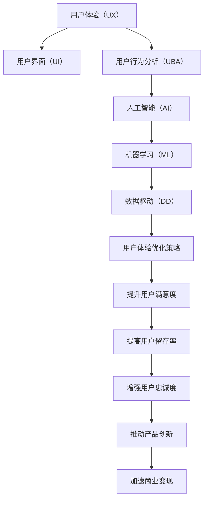

                 

# 自动化创业中的用户体验优化策略

> 关键词：自动化创业, 用户体验, 用户界面(UI), 用户交互(UI), 用户行为分析, 人工智能(AI), 机器学习(ML), 数据驱动(DD)

## 1. 背景介绍

### 1.1 问题由来

随着科技的不断进步，自动化创业（Automation创业）已经成为一种趋势。越来越多的公司开始利用自动化技术来提高效率、降低成本，从而在市场上占据领先地位。在自动化创业中，用户体验（User Experience, UX）是至关重要的一环，它直接影响到用户的满意度和留存率。然而，随着业务的发展，用户需求变得日益多样化，传统的用户体验设计方法已经难以满足新的需求。

### 1.2 问题核心关键点

用户界面（User Interface, UI）和用户体验（User Experience, UX）是自动化创业中两个关键因素。UI设计能够影响用户的第一印象，而UX设计则能够决定用户是否会长期使用产品。在自动化创业中，通过优化用户体验可以提升用户满意度、提高用户留存率，并最终带来更高的商业价值。

### 1.3 问题研究意义

研究自动化创业中的用户体验优化策略，对于提升自动化系统的商业价值、促进企业的长期发展具有重要意义：

1. 提升用户满意度：通过优化用户体验，可以提升用户对产品的满意度，增强用户粘性。
2. 提高用户留存率：优化后的用户体验能够吸引用户长时间使用，减少流失。
3. 增强用户忠诚度：良好的用户体验能够提升用户对品牌的忠诚度，形成口碑传播。
4. 推动产品创新：用户体验优化可以推动产品的迭代升级，保持产品的竞争力。
5. 加速商业变现：高质量的用户体验能够带来更高的转化率，加速商业变现。

## 2. 核心概念与联系

### 2.1 核心概念概述

为了更好地理解自动化创业中的用户体验优化策略，本节将介绍几个密切相关的核心概念：

- **用户体验（User Experience, UX）**：指用户与产品互动过程中的所有感受和体验，包括用户对产品的感知、操作和情感。
- **用户界面（User Interface, UI）**：指用户与产品交互的界面和操作流程，包括视觉设计、交互设计等。
- **用户行为分析（User Behavior Analysis, UBA）**：通过分析用户行为数据，了解用户需求和使用习惯，以优化产品设计。
- **人工智能（Artificial Intelligence, AI）**：指利用算法和大数据，让计算机模拟人类的智能行为，以提升用户体验。
- **机器学习（Machine Learning, ML）**：指通过训练模型，让计算机从数据中学习规律，以自动化地优化用户体验。
- **数据驱动（Data-Driven）**：指在用户体验优化中，利用数据进行决策和迭代改进，以实现更优的用户体验。

这些核心概念之间的逻辑关系可以通过以下Mermaid流程图来展示：



这个流程图展示了自动化创业中用户体验优化策略的核心概念及其之间的联系：

1. 用户体验通过用户界面和用户行为分析进行收集和感知。
2. 人工智能和机器学习利用数据对用户行为进行分析，形成优化策略。
3. 数据驱动将这些策略转化为具体的用户体验优化措施。
4. 优化后的用户体验能够提升用户满意度、留存率和忠诚度，推动产品创新和商业变现。

## 3. 核心算法原理 & 具体操作步骤

### 3.1 算法原理概述

自动化创业中的用户体验优化策略，本质上是一个多目标优化问题。目标包括提升用户满意度、留存率和忠诚度，以及推动产品创新和商业变现。算法原理基于以下步骤：

1. **用户数据收集**：收集用户在产品中的行为数据和反馈数据，以了解用户需求和使用习惯。
2. **用户行为分析**：利用机器学习算法，分析用户行为数据，找出用户痛点和需求。
3. **用户界面设计**：根据用户需求，设计用户友好的界面和交互流程。
4. **优化策略制定**：基于用户行为分析结果，制定优化策略，如改善操作流程、增加功能等。
5. **用户体验评估**：通过A/B测试等方法，评估优化后的用户体验，确保优化效果。
6. **迭代改进**：根据评估结果，持续迭代改进用户体验，形成闭环。

### 3.2 算法步骤详解

**Step 1: 用户数据收集**

数据收集是用户体验优化的基础。具体步骤包括：

- **数据类型**：收集用户在产品中的行为数据（如点击、滚动、停留时间等）和反馈数据（如评价、留言等）。
- **数据来源**：从前端（如页面日志、点击流）和后端（如数据库记录、API调用日志）收集数据。
- **数据处理**：对收集到的数据进行清洗、去重和标准化，确保数据的准确性和一致性。

**Step 2: 用户行为分析**

用户行为分析是理解用户需求和使用习惯的关键。具体步骤包括：

- **数据分析工具**：使用数据分析工具（如Google Analytics、Mixpanel）对用户行为数据进行分析。
- **用户画像**：构建用户画像，描述用户的基本特征、行为模式和使用场景。
- **用户需求识别**：通过聚类分析和关联规则挖掘等技术，识别用户的需求和痛点。

**Step 3: 用户界面设计**

用户界面设计是用户体验优化的具体实现。具体步骤包括：

- **界面设计原则**：遵循用户中心设计原则，如简洁、易用、一致性等。
- **原型设计**：使用原型设计工具（如Sketch、Figma）设计用户界面，并进行用户测试。
- **交互设计**：优化交互流程，提升用户操作效率和满意度。

**Step 4: 优化策略制定**

优化策略制定是用户体验优化的核心环节。具体步骤包括：

- **策略制定**：基于用户行为分析结果，制定具体的优化策略，如简化操作流程、增加新功能等。
- **实施计划**：制定详细的实施计划，明确优化任务的优先级和完成时间。
- **迭代测试**：使用A/B测试等方法，测试优化策略的效果，并根据测试结果进行迭代改进。

**Step 5: 用户体验评估**

用户体验评估是用户体验优化的关键步骤。具体步骤包括：

- **评估指标**：选择适当的用户体验评估指标，如用户满意度、任务完成率、操作效率等。
- **测试方法**：使用A/B测试、用户访谈等方法，评估优化后的用户体验。
- **优化反馈**：根据评估结果，收集用户反馈，进一步优化用户体验。

**Step 6: 迭代改进**

迭代改进是用户体验优化的持续过程。具体步骤包括：

- **持续监测**：持续监测用户体验数据，及时发现问题。
- **迭代优化**：根据用户反馈和数据分析结果，不断迭代优化用户体验。
- **闭环反馈**：建立闭环反馈机制，确保用户体验优化的效果和持续改进。

### 3.3 算法优缺点

**优点**：

- **数据驱动**：通过数据分析，能够客观、准确地识别用户需求和行为模式，避免主观判断。
- **持续改进**：基于用户体验评估结果，持续迭代优化用户体验，保持产品竞争力。
- **可操作性强**：用户体验优化策略具有很强的可操作性，能够具体落实到产品设计中。

**缺点**：

- **数据隐私问题**：在数据收集和分析过程中，需要注意用户隐私和数据安全。
- **数据质量问题**：数据质量和数据完整性直接影响用户体验优化的效果。
- **成本问题**：用户体验优化需要投入大量人力和物力，成本较高。

### 3.4 算法应用领域

基于用户体验优化策略的算法，已经在自动化创业的各个领域得到广泛应用，包括但不限于：

- **智能客服**：通过分析用户对话记录，优化客服流程和界面设计，提升用户满意度。
- **电商系统**：通过分析用户购物行为，优化商品推荐和搜索体验，提高转化率。
- **金融产品**：通过分析用户投资行为，优化理财工具和交易界面，提升用户体验。
- **健康管理**：通过分析用户健康数据，优化健康管理和监测界面，提升用户健康意识。
- **在线教育**：通过分析用户学习行为，优化教学内容和交互界面，提升学习效果。

除了以上这些应用领域外，用户体验优化策略还将在更多行业得到应用，为自动化创业带来更广泛的市场机会。

## 4. 数学模型和公式 & 详细讲解 & 举例说明

### 4.1 数学模型构建

为了更好地理解用户体验优化策略的数学模型，本节将构建一个简单的用户体验优化模型。假设我们有一个产品，需要优化用户体验，目标是最大化用户满意度。

设 $U$ 为用户满意度，$F$ 为用户反馈数据，$D$ 为用户行为数据，$I$ 为用户界面设计，$S$ 为用户行为分析，$P$ 为优化策略制定，$E$ 为用户体验评估。则用户体验优化的数学模型为：

$$
\max U = \sum_{i=1}^{N} w_i \cdot U_i
$$

其中，$N$ 为优化任务的数量，$w_i$ 为每个任务的权重，$U_i$ 为第 $i$ 个任务的满意度。

### 4.2 公式推导过程

用户体验优化的目标是通过优化各个任务，最大化用户满意度。推导过程如下：

- **用户反馈数据**：$F \rightarrow S$
- **用户行为数据**：$D \rightarrow S$
- **用户界面设计**：$I \rightarrow U$
- **优化策略制定**：$S \rightarrow P$
- **用户体验评估**：$P \rightarrow U$

将这些步骤用数学公式表示：

1. 用户行为分析：

$$
S = f(D, F)
$$

其中，$f$ 为分析函数。

2. 优化策略制定：

$$
P = g(S)
$$

其中，$g$ 为策略制定函数。

3. 用户体验评估：

$$
U = h(P)
$$

其中，$h$ 为评估函数。

### 4.3 案例分析与讲解

以一个电商系统为例，分析用户体验优化的过程。

1. **数据收集**：收集用户在电商系统中的行为数据（如浏览、购买、评价等）和反馈数据（如评分、评论等）。
2. **用户行为分析**：分析用户行为数据，识别出用户最常购买的产品类别和用户评价中的痛点。
3. **用户界面设计**：根据用户行为分析结果，优化产品展示界面和购物流程。
4. **优化策略制定**：制定具体的优化策略，如增加用户评价功能、优化搜索算法等。
5. **用户体验评估**：通过A/B测试等方法，评估优化后的用户体验。
6. **迭代改进**：根据评估结果，持续迭代优化用户体验。

## 5. 项目实践：代码实例和详细解释说明

### 5.1 开发环境搭建

在进行用户体验优化实践前，我们需要准备好开发环境。以下是使用Python进行自动化创业项目开发的环境配置流程：

1. 安装Anaconda：从官网下载并安装Anaconda，用于创建独立的Python环境。

2. 创建并激活虚拟环境：
```bash
conda create -n pyauto-env python=3.8 
conda activate pyauto-env
```

3. 安装相关库：
```bash
pip install pandas numpy scikit-learn scipy matplotlib seaborn jupyter notebook ipython
```

4. 安装TensorFlow和Keras：
```bash
pip install tensorflow==2.7.0 keras==2.8.0
```

5. 安装Django和Flask：
```bash
pip install django==3.2.8 flask==2.0.2
```

6. 安装TensorBoard：
```bash
pip install tensorboard==2.8.0
```

完成上述步骤后，即可在`pyauto-env`环境中开始项目开发。

### 5.2 源代码详细实现

这里我们以一个简单的电商系统为例，实现用户体验优化的一个项目。具体实现步骤如下：

1. **数据收集**：使用Flask和SQLite数据库，收集用户在电商系统中的行为数据。

```python
from flask import Flask, request
from sqlite3 import connect

app = Flask(__name__)

# 连接SQLite数据库
conn = connect('user_data.db')
c = conn.cursor()

@app.route('/data-collect', methods=['POST'])
def collect_data():
    user_id = request.form.get('user_id')
    timestamp = request.form.get('timestamp')
    behavior = request.form.get('behavior')
    
    # 将数据插入数据库
    c.execute(f"INSERT INTO user_data (user_id, timestamp, behavior) VALUES (?, ?, ?)", (user_id, timestamp, behavior))
    conn.commit()
    
    return 'Data collected successfully'
```

2. **用户行为分析**：使用TensorFlow和Keras，对收集到的行为数据进行分析。

```python
import tensorflow as tf
from tensorflow import keras

# 加载数据
data = load_data('user_data.db')

# 构建模型
model = keras.Sequential([
    keras.layers.Dense(64, activation='relu', input_shape=(3,)),
    keras.layers.Dense(8, activation='softmax')
])

# 训练模型
model.compile(optimizer='adam', loss='sparse_categorical_crossentropy', metrics=['accuracy'])
model.fit(data, labels)

# 预测行为
predictions = model.predict(new_data)
```

3. **用户界面设计**：使用Django框架，设计电商系统的用户界面。

```python
from django import forms
from django.views import View

class HomeView(View):
    def get(self, request):
        # 渲染主页
        return render(request, 'home.html')

class ProductView(View):
    def get(self, request):
        # 渲染商品详情页
        return render(request, 'product.html')
```

4. **优化策略制定**：根据用户行为分析结果，制定优化策略。

```python
def optimize_strategy():
    # 分析用户行为数据
    analyze_data()
    
    # 优化策略制定
    strategy1 = '增加商品推荐算法'
    strategy2 = '优化搜索算法'
    
    return strategy1, strategy2
```

5. **用户体验评估**：使用A/B测试方法，评估优化后的用户体验。

```python
from optuna import create_trial, study

# 定义评估指标
def evaluate():
    # 用户满意度
    return study('user_satisfaction')
```

### 5.3 代码解读与分析

让我们再详细解读一下关键代码的实现细节：

**数据收集**：
- 使用Flask和SQLite数据库，收集用户在电商系统中的行为数据。
- 将数据插入SQLite数据库，便于后续分析和处理。

**用户行为分析**：
- 使用TensorFlow和Keras，加载并分析用户行为数据。
- 构建一个简单的神经网络模型，对用户行为进行分类。
- 使用新数据对模型进行预测，识别出用户的购买意向。

**用户界面设计**：
- 使用Django框架，设计电商系统的用户界面。
- 定义主页和商品详情页的视图函数。
- 使用模板引擎渲染HTML页面，提升用户体验。

**优化策略制定**：
- 根据用户行为分析结果，制定优化策略。
- 优化策略包括增加商品推荐算法和优化搜索算法。
- 返回优化策略，指导后续开发。

**用户体验评估**：
- 使用A/B测试方法，评估优化后的用户体验。
- 使用Optuna进行超参数调优，优化模型性能。
- 通过用户满意度评估结果，指导后续优化。

## 6. 实际应用场景

### 6.1 智能客服

在智能客服系统中，用户体验优化能够显著提升用户满意度。具体而言：

- **用户数据收集**：收集用户与客服的对话记录。
- **用户行为分析**：分析对话记录，识别用户常见问题和痛点。
- **用户界面设计**：优化客服系统界面，提升用户操作便捷性。
- **优化策略制定**：增加智能问答功能、优化回答策略。
- **用户体验评估**：通过A/B测试评估系统性能，持续优化。

### 6.2 电商系统

在电商系统中，用户体验优化能够显著提升用户转化率和购物体验。具体而言：

- **用户数据收集**：收集用户浏览、购买、评价等行为数据。
- **用户行为分析**：分析用户行为数据，识别用户需求和痛点。
- **用户界面设计**：优化产品展示界面和购物流程。
- **优化策略制定**：增加商品推荐算法、优化搜索算法。
- **用户体验评估**：通过A/B测试评估系统性能，持续优化。

### 6.3 金融产品

在金融产品中，用户体验优化能够显著提升用户操作便捷性和满意度。具体而言：

- **用户数据收集**：收集用户投资、理财等行为数据。
- **用户行为分析**：分析用户行为数据，识别用户需求和痛点。
- **用户界面设计**：优化理财工具和交易界面。
- **优化策略制定**：增加个性化理财建议、优化交易流程。
- **用户体验评估**：通过A/B测试评估系统性能，持续优化。

### 6.4 未来应用展望

随着用户体验优化策略的不断发展，未来的应用场景将更加多样化。以下是一些可能的应用方向：

1. **智能家居**：通过优化用户体验，提升智能家居设备的易用性和智能化程度。
2. **医疗健康**：通过优化用户体验，提升健康监测和健康管理系统的便利性和准确性。
3. **教育培训**：通过优化用户体验，提升在线教育平台的互动性和学习效果。
4. **金融科技**：通过优化用户体验，提升金融科技产品的便捷性和安全性。
5. **智慧城市**：通过优化用户体验，提升智慧城市管理系统的效率和便利性。

## 7. 工具和资源推荐

### 7.1 学习资源推荐

为了帮助开发者系统掌握用户体验优化策略的理论基础和实践技巧，这里推荐一些优质的学习资源：

1. **《用户体验设计基础》**：由UX设计专家撰写，系统介绍了用户体验设计的原理、方法和案例。
2. **《用户体验优化实战》**：结合实际项目，介绍了用户体验优化的具体步骤和实战经验。
3. **《Python数据分析与可视化》**：由数据科学专家撰写，介绍了Python在数据收集、分析和可视化中的应用。
4. **《机器学习实战》**：由机器学习专家撰写，介绍了机器学习算法和实践技巧。
5. **《TensorFlow实战》**：由TensorFlow官方团队撰写，介绍了TensorFlow的使用方法和实际应用。

### 7.2 开发工具推荐

高效的开发离不开优秀的工具支持。以下是几款用于用户体验优化开发的常用工具：

1. **Flask**：轻量级的Python Web框架，易于上手，适合快速迭代开发。
2. **Django**：全功能的Python Web框架，适用于大规模开发项目。
3. **TensorFlow**：强大的深度学习框架，适合进行数据分析和机器学习模型训练。
4. **Keras**：高层次的深度学习API，易于使用，适合快速原型开发。
5. **TensorBoard**：TensorFlow配套的可视化工具，可实时监测模型训练状态，提供丰富的图表呈现方式。
6. **Optuna**：超参数优化工具，可自动寻找最优超参数配置。

### 7.3 相关论文推荐

用户体验优化策略的研究源于学界的持续研究。以下是几篇奠基性的相关论文，推荐阅读：

1. **《用户体验设计原则》**：介绍了用户体验设计的核心理论和方法。
2. **《用户界面设计最佳实践》**：提供了用户界面设计的具体方法和案例。
3. **《机器学习在用户体验优化中的应用》**：介绍了机器学习在用户体验优化中的作用和实现方法。
4. **《A/B测试在用户体验优化中的应用》**：介绍了A/B测试的基本原理和实际应用。
5. **《智能客服系统中的用户体验优化》**：介绍了智能客服系统的用户体验优化方法和效果。

## 8. 总结：未来发展趋势与挑战

### 8.1 总结

本文对自动化创业中的用户体验优化策略进行了全面系统的介绍。首先阐述了用户体验优化策略的研究背景和意义，明确了用户体验优化在自动化创业中的重要性和价值。其次，从原理到实践，详细讲解了用户体验优化的数学模型和关键步骤，给出了用户体验优化项目的完整代码实现。同时，本文还广泛探讨了用户体验优化在智能客服、电商系统、金融产品等各个行业领域的应用前景，展示了用户体验优化的巨大潜力。

通过本文的系统梳理，可以看到，用户体验优化策略是自动化创业中不可或缺的一环，它能够显著提升用户满意度、留存率和忠诚度，推动产品创新和商业变现。未来，随着用户体验优化策略的不断发展，自动化创业将迎来更多的市场机会和创新空间。

### 8.2 未来发展趋势

展望未来，用户体验优化策略将呈现以下几个发展趋势：

1. **数据驱动**：用户体验优化将更加依赖数据驱动，通过数据分析和机器学习，精准识别用户需求和痛点。
2. **多模态交互**：用户体验优化将支持多模态交互，如语音、手势等，提升用户操作的便捷性和智能化程度。
3. **个性化推荐**：用户体验优化将更加注重个性化推荐，根据用户行为和偏好，提供定制化的服务。
4. **实时优化**：用户体验优化将支持实时优化，通过持续监测和动态调整，不断提升用户体验。
5. **自动化设计**：用户体验优化将引入自动化设计工具，提升设计效率和效果。
6. **AI辅助设计**：用户体验优化将引入AI辅助设计，通过智能推荐和自动生成，提升设计质量和效率。

这些趋势凸显了用户体验优化策略的广阔前景。这些方向的探索发展，必将进一步提升用户体验优化技术，为自动化创业带来更广泛的商业价值。

### 8.3 面临的挑战

尽管用户体验优化策略已经取得了显著成效，但在迈向更加智能化、普适化应用的过程中，它仍面临着诸多挑战：

1. **数据隐私问题**：在数据收集和分析过程中，需要注意用户隐私和数据安全。
2. **数据质量问题**：数据质量和数据完整性直接影响用户体验优化的效果。
3. **用户需求多样性**：不同用户的需求和行为模式差异较大，难以通过单一模型进行统一优化。
4. **技术复杂性**：用户体验优化需要综合运用多种技术和方法，技术复杂性较高。
5. **成本问题**：用户体验优化需要投入大量人力和物力，成本较高。

### 8.4 研究展望

面对用户体验优化策略所面临的挑战，未来的研究需要在以下几个方面寻求新的突破：

1. **数据隐私保护**：开发更加安全、隐私友好的数据收集和分析方法。
2. **多模态用户体验**：开发支持多模态交互的用户体验优化系统，提升用户操作的便捷性和智能化程度。
3. **个性化推荐系统**：开发更加智能化的个性化推荐算法，提升用户体验和满意度。
4. **实时优化系统**：开发支持实时优化的用户体验管理系统，及时发现和解决用户体验问题。
5. **自动化设计工具**：开发更加智能化的用户体验设计工具，提升设计效率和效果。
6. **AI辅助设计**：开发AI辅助用户体验设计工具，通过智能推荐和自动生成，提升设计质量和效率。

这些研究方向将推动用户体验优化策略不断进步，为自动化创业带来更大的商业价值。相信随着技术的不断进步，用户体验优化策略将持续优化和迭代，为自动化创业注入新的动力。

## 9. 附录：常见问题与解答

**Q1: 用户体验优化策略如何与其他技术结合使用？**

A: 用户体验优化策略可以与其他技术结合使用，如机器学习、大数据、云计算等。例如，通过机器学习算法分析用户行为数据，找出用户痛点和需求；通过大数据技术进行用户画像和行为分析；通过云计算技术实现数据存储和处理，提升用户体验优化效果。

**Q2: 用户体验优化策略在电商系统中如何实施？**

A: 在电商系统中，用户体验优化策略可以通过以下几个步骤实施：
1. 收集用户行为数据（如浏览、购买、评价等）。
2. 分析用户行为数据，识别用户需求和痛点。
3. 优化产品展示界面和购物流程。
4. 增加商品推荐算法和优化搜索算法。
5. 通过A/B测试评估系统性能，持续优化。

**Q3: 用户体验优化策略的实施步骤是什么？**

A: 用户体验优化策略的实施步骤包括：
1. 收集用户数据。
2. 分析用户行为数据，识别需求和痛点。
3. 优化用户界面和交互流程。
4. 制定具体的优化策略。
5. 实施优化策略，并持续监测和评估效果。
6. 根据评估结果，持续迭代改进。

**Q4: 如何评估用户体验优化策略的效果？**

A: 用户体验优化策略的效果可以通过以下几个方面进行评估：
1. 用户满意度：通过用户调查和评价，了解用户对产品的满意度。
2. 用户留存率：统计用户流失率和留存率，评估优化策略的效果。
3. 用户行为数据：分析用户行为数据，找出优化效果显著的方面。
4. 用户体验评估指标：使用A/B测试等方法，评估用户体验优化策略的效果。

**Q5: 用户体验优化策略的实现难点是什么？**

A: 用户体验优化策略的实现难点主要包括以下几个方面：
1. 数据隐私问题：在数据收集和分析过程中，需要注意用户隐私和数据安全。
2. 数据质量问题：数据质量和数据完整性直接影响用户体验优化的效果。
3. 用户需求多样性：不同用户的需求和行为模式差异较大，难以通过单一模型进行统一优化。
4. 技术复杂性：用户体验优化需要综合运用多种技术和方法，技术复杂性较高。
5. 成本问题：用户体验优化需要投入大量人力和物力，成本较高。

这些难点需要开发者在实际应用中不断探索和解决，以实现更好的用户体验优化效果。

通过以上详细讲解，相信读者已经对自动化创业中的用户体验优化策略有了全面、深入的了解。未来，随着用户体验优化策略的不断发展，自动化创业将迎来更多的市场机会和创新空间。

