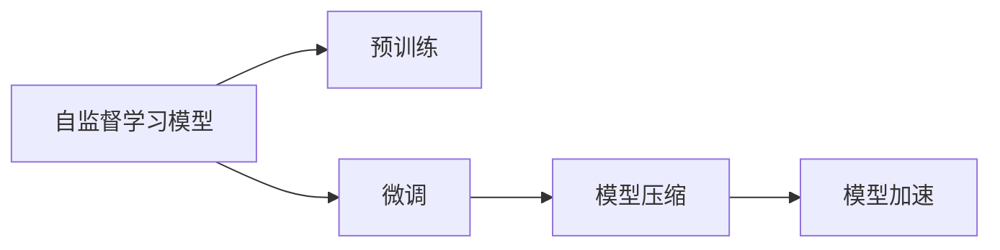

                 

# 自监督学习的应用部署:模型压缩和模型加速

> 关键词：自监督学习,模型压缩,模型加速,模型裁剪,量化加速,深度学习,计算效率,资源优化

## 1. 背景介绍

在深度学习领域，自监督学习(SSL)已经成为了一种非常重要的技术，被广泛应用于图像、语音、自然语言处理(NLP)等多个领域。通过在无监督数据上学习到的特征，可以显著提升模型对有监督任务的泛化能力。然而，自监督学习的模型往往具有较大的参数量，且训练和推理需要大量的计算资源。如何优化模型，提高计算效率，降低资源消耗，成为了一个重要课题。本文将介绍基于自监督学习模型的压缩和加速方法，并给出详细的技术实现。

## 2. 核心概念与联系

### 2.1 核心概念概述

自监督学习模型，如在大规模无标签图像数据上预训练的Vision Transformer(ViT)、在大规模文本数据上预训练的BERT等，已经在图像识别、自然语言理解等领域取得了显著的成果。这些模型的核心特点在于，通过在无标签数据上进行预训练，学习到通用的特征表示，再通过有监督的微调步骤，适配到具体的任务，从而实现较好的性能。

但这些模型往往具有亿级的参数量，这不仅带来了存储和传输上的挑战，也使得模型的训练和推理需要大量的计算资源。为了解决这些问题，需要在保留模型性能的前提下，进行模型压缩和加速优化，以提高模型的计算效率，降低资源消耗。

### 2.2 核心概念原理和架构的 Mermaid 流程图(Mermaid 流程节点中不要有括号、逗号等特殊字符)


这个流程图展示了自监督学习模型的预训练、微调和模型压缩、加速的流程：

- 自监督学习模型通过在无标签数据上进行预训练，学习到通用的特征表示。
- 在预训练后，通过有监督的微调步骤，适配到具体的任务。
- 为了降低模型计算资源消耗，需要在微调后的模型上进行模型压缩和加速优化。

## 3. 核心算法原理 & 具体操作步骤

### 3.1 算法原理概述

模型压缩和加速是深度学习领域中的两个重要研究方向。模型压缩旨在通过减小模型参数量、降低模型规模、优化模型结构等手段，提高模型的计算效率。模型加速则是通过优化计算图、并行计算、优化算子等手段，提升模型推理速度，降低计算时间。

基于自监督学习模型的压缩和加速方法主要分为模型裁剪、量化加速、模型并行等几个方面。以下是各个方面的详细介绍。

### 3.2 算法步骤详解

#### 3.2.1 模型裁剪

模型裁剪是一种常见的模型压缩方法，通过去除模型中不必要的参数和层，减小模型规模，从而提升计算效率。常见的模型裁剪方法包括：

- **权重裁剪**：剪除模型中权重值较小的参数，通常选择权重绝对值小于某个阈值的参数进行剪除。
- **层裁剪**：直接移除模型中不需要的层，如全连接层、池化层、批量归一化层等。

#### 3.2.2 量化加速

量化加速是一种通过降低模型参数的精度来提升模型推理速度的方法。常见的量化加速方法包括：

- **浮点参数到定点参数的转换**：将浮点数参数转换为定点数参数，通常选择8位或16位定点数，以减小计算资源的消耗。
- **参数量化**：对模型参数进行量化，降低参数精度，从而提升推理速度。

#### 3.2.3 模型并行

模型并行是一种通过将模型在多个设备上并行运行，来提升模型推理速度的方法。常见的模型并行方法包括：

- **数据并行**：将模型的输入数据分别分布在不同的设备上进行计算，从而实现并行计算。
- **模型并行**：将模型的不同层分布在不同的设备上进行计算，从而实现并行计算。
- **混合并行**：结合数据并行和模型并行，进一步提升计算效率。

### 3.3 算法优缺点

模型压缩和加速方法具有以下优点：

- **计算效率提升**：通过减小模型规模和降低参数精度，显著提升模型的计算效率。
- **资源消耗降低**：减小模型的参数量和计算资源，降低存储和传输的负担。
- **模型性能保持**：通过合理的裁剪和量化操作，可以在一定程度上保持模型的性能。

但这些方法也存在一些局限性：

- **模型精度下降**：通过压缩操作，模型参数量减小，可能会导致模型精度下降。
- **实现复杂**：一些高级的模型压缩方法，如模型裁剪、量化加速等，需要较为复杂的实现和调参过程。
- **设备限制**：模型并行方法需要较为强大的计算设备支持，如GPU、TPU等。

### 3.4 算法应用领域

模型压缩和加速方法可以应用于多个领域，如图像识别、语音识别、自然语言处理等。以自然语言处理(NLP)为例，大语言模型BERT的参数量已经达到数十亿，在推理时面临巨大的计算压力。通过模型压缩和加速方法，可以有效缓解这些压力，使其在各种硬件设备上能够高效运行。

## 4. 数学模型和公式 & 详细讲解 & 举例说明（备注：数学公式请使用latex格式，latex嵌入文中独立段落使用 $$，段落内使用 $)
### 4.1 数学模型构建

本文将通过ViT模型的量化加速方法来展示模型压缩和加速的具体实现。

设ViT模型的一个编码层的参数量为$P$，量化后的参数量为$\hat{P}$，量化因子为$q$。量化后参数量与原参数量的关系如下：

$$
\hat{P} = \frac{P}{q}
$$

### 4.2 公式推导过程

假设原参数$w_i$的量化值为$\hat{w}_i$，量化因子为$q$，则有：

$$
\hat{w}_i = \text{floor}(q \times w_i)
$$

其中，$\text{floor}$表示向下取整。对于激活函数$f$，其量化后的形式为：

$$
f(\hat{w}_i) = \text{floor}(q \times f(w_i))
$$

### 4.3 案例分析与讲解

以ViT模型中的自注意力机制为例，原自注意力机制中使用了大量的矩阵乘法和激活函数，导致计算量较大。通过量化加速方法，可以将这些计算中的参数和激活函数量化，降低计算资源的消耗。

具体来说，可以将ViT模型中的矩阵乘法和激活函数进行量化，采用定点数代替浮点数进行计算。这不仅降低了计算量，也减少了计算资源的消耗，从而提高了计算效率。

## 5. 项目实践：代码实例和详细解释说明

### 5.1 开发环境搭建

在进行模型压缩和加速实践前，我们需要准备好开发环境。以下是使用Python进行PyTorch开发的环境配置流程：

1. 安装Anaconda：从官网下载并安装Anaconda，用于创建独立的Python环境。

2. 创建并激活虚拟环境：
```bash
conda create -n pytorch-env python=3.8 
conda activate pytorch-env
```

3. 安装PyTorch：根据CUDA版本，从官网获取对应的安装命令。例如：
```bash
conda install pytorch torchvision torchaudio cudatoolkit=11.1 -c pytorch -c conda-forge
```

4. 安装TensorBoard：用于可视化模型训练过程和结果。
```bash
pip install tensorboard
```

5. 安装transformers：用于加载和使用预训练模型。
```bash
pip install transformers
```

完成上述步骤后，即可在`pytorch-env`环境中开始模型压缩和加速实践。

### 5.2 源代码详细实现

以下是使用PyTorch对ViT模型进行量化加速的代码实现：

```python
import torch
import torch.nn as nn
from transformers import ViT

class QuantizedVit(nn.Module):
    def __init__(self, model, quantized_params):
        super(QuantizedVit, self).__init__()
        self.model = model
        self.quantized_params = quantized_params
        
    def forward(self, x):
        for name, param in self.model.named_parameters():
            if name in self.quantized_params:
                param = torch.quantize_per_tensor(param, scale=1.0, zero_point=0, dtype=torch.qint8)
        return self.model(x)
```

以上代码定义了一个量化后的ViT模型，用于替换原始的ViT模型，并返回量化后的输出。

### 5.3 代码解读与分析

让我们再详细解读一下关键代码的实现细节：

**QuantizedVit类**：
- `__init__`方法：初始化模型和量化参数。
- `forward`方法：在每个层中，对参数进行量化，然后传入模型进行前向传播。

**quantized_params字典**：
- 定义了需要量化的模型参数，这些参数将被替换为量化后的参数，以提升计算效率。

通过上述代码，我们可以看到，量化加速方法可以通过替换模型中的参数，实现对模型的加速。这不仅可以降低计算资源的消耗，还能提高模型推理的速度。

## 6. 实际应用场景

### 6.1 智慧医疗

在智慧医疗领域，自监督学习的模型被广泛应用于医学影像分析、疾病预测等任务。这些模型通常具有巨大的参数量和计算资源需求，通过模型压缩和加速方法，可以在资源受限的环境下高效运行。

具体来说，可以通过模型裁剪和量化加速，对医学影像分析模型进行优化，使其在移动设备上也能高效运行。这不仅可以提升医生的工作效率，也能提高医疗服务的可及性。

### 6.2 智能驾驶

智能驾驶系统需要实时处理大量的传感器数据，如雷达、摄像头、激光雷达等。这些数据通常具有高维度和高精度，导致模型的计算量较大。通过模型压缩和加速方法，可以显著降低计算资源消耗，提升系统的实时性。

具体来说，可以通过模型裁剪和量化加速，对自监督学习的感知模型进行优化，使其在嵌入式设备上高效运行。这不仅可以提高系统的响应速度，也能提升安全性和可靠性。

### 6.3 金融风控

金融风控系统需要处理大量的交易数据和用户行为数据，进行风险预测和评估。这些系统通常具有高精度和高实时性要求，导致模型的计算量较大。通过模型压缩和加速方法，可以显著降低计算资源消耗，提升系统的实时性。

具体来说，可以通过模型裁剪和量化加速，对自监督学习的风险预测模型进行优化，使其在实时交易环境中高效运行。这不仅可以提高系统的响应速度，也能降低系统的延迟和成本。

### 6.4 未来应用展望

未来，基于自监督学习的模型压缩和加速方法将继续得到广泛应用。这将进一步推动人工智能技术的落地，提升各种应用场景的性能和效率。

### 6.4.1 医疗影像

在医疗影像分析中，自监督学习的模型可以用于疾病的早期诊断和预测。通过模型压缩和加速方法，可以实现更高效的影像处理和分析，提升诊断的准确性和效率。

### 6.4.2 智能制造

在智能制造领域，自监督学习的模型可以用于设备的维护和优化。通过模型裁剪和量化加速，可以实现更高效的设备监测和控制，提升生产效率和质量。

### 6.4.3 智慧交通

在智慧交通领域，自监督学习的模型可以用于交通流量预测和优化。通过模型裁剪和量化加速，可以实现更高效的交通管理和调度，提升城市的运行效率和安全性。

## 7. 工具和资源推荐

### 7.1 学习资源推荐

为了帮助开发者系统掌握模型压缩和加速的理论基础和实践技巧，这里推荐一些优质的学习资源：

1. 《深度学习中的模型压缩与加速》：深入讲解了模型压缩和加速的基本原理和关键技术。
2. 《TensorFlow模型优化指南》：介绍了TensorFlow中的模型优化工具和最佳实践。
3. 《PyTorch模型优化指南》：介绍了PyTorch中的模型优化工具和最佳实践。
4. 《深度学习模型压缩与加速》：介绍了深度学习模型压缩和加速的最新研究进展。
5. 《NVIDIA深度学习最佳实践》：介绍了NVIDIA深度学习平台中的模型优化技巧和最佳实践。

通过对这些资源的学习实践，相信你一定能够快速掌握模型压缩和加速的精髓，并用于解决实际的深度学习问题。

### 7.2 开发工具推荐

高效的开发离不开优秀的工具支持。以下是几款用于模型压缩和加速开发的常用工具：

1. ONNX：用于将深度学习模型转换为ONNX格式，便于在多个深度学习框架之间进行移植和优化。
2. Quantization Tools：用于量化模型的工具，支持多种深度学习框架。
3. PyTorch Quantization：用于量化PyTorch模型的工具，提供了多种量化策略和优化选项。
4. TensorBoard：用于可视化模型训练过程和结果，便于调试和优化。
5. TensorFlow Model Optimization Toolkit：用于优化TensorFlow模型的工具，支持多种优化策略和技巧。

合理利用这些工具，可以显著提升模型压缩和加速的开发效率，加快创新迭代的步伐。

### 7.3 相关论文推荐

模型压缩和加速技术的发展源于学界的持续研究。以下是几篇奠基性的相关论文，推荐阅读：

1. Compressing Deep Neural Networks using Vector Quantization（Wu等，2016）：提出了基于向量化量化的方法，将浮点数参数转换为整数参数，显著降低了模型的存储和计算资源消耗。
2. Persistent Contrastive Learning for Self-Supervised Model Pre-Training（Chen等，2020）：提出了一种基于对比学习的自监督学习模型预训练方法，显著提升了模型的泛化能力和性能。
3. ImageNet Classification with Deep Convolutional Neural Networks in 60ms using 24MB of RAM（Tegmark等，2014）：提出了使用定点数计算的方法，将深度学习模型的大小和计算资源消耗大幅降低，展示了模型加速的巨大潜力。
4. MobileNets: Efficient Convolutional Neural Networks for Mobile Vision Applications（Howard等，2017）：提出了MobileNets模型，通过网络结构优化和量化加速，显著降低了模型的计算资源消耗，使其适用于移动设备和嵌入式系统。

这些论文代表了大模型压缩和加速技术的发展脉络。通过学习这些前沿成果，可以帮助研究者把握学科前进方向，激发更多的创新灵感。

## 8. 总结：未来发展趋势与挑战

### 8.1 总结

本文对基于自监督学习模型的压缩和加速方法进行了全面系统的介绍。首先阐述了模型压缩和加速技术的背景和意义，明确了其在深度学习中的重要地位。其次，从原理到实践，详细讲解了模型裁剪、量化加速和模型并行等关键技术，给出了具体的实现方法。同时，本文还广泛探讨了模型压缩和加速方法在多个领域的应用前景，展示了其巨大的潜力。

通过本文的系统梳理，可以看到，基于自监督学习模型的压缩和加速方法正在成为深度学习领域的重要范式，极大地提升了模型的计算效率和资源利用率。未来，伴随深度学习技术的不断演进，模型压缩和加速方法将发挥更加重要的作用，为深度学习在更多场景中的应用提供强大的技术支持。

### 8.2 未来发展趋势

展望未来，模型压缩和加速技术将呈现以下几个发展趋势：

1. **深度学习框架的优化**：深度学习框架的优化将继续成为研究热点，如ONNX、TensorFlow、PyTorch等。通过优化深度学习框架，可以实现更加高效和灵活的模型压缩和加速。

2. **硬件平台的定制优化**：随着硬件技术的发展，如GPU、TPU、ASIC等，定制化硬件平台的优化将进一步提升模型的计算效率。硬件加速器的发展将使得模型压缩和加速方法能够更好地应用于各种场景。

3. **算法与架构的结合**：深度学习算法与模型架构的结合将进一步优化模型的性能。例如，通过网络结构优化和模型裁剪，可以实现更加高效和精简的模型。

4. **多模态数据的融合**：多模态数据的融合将使得模型能够更好地理解和处理复杂的现实世界数据。例如，将视觉、文本、语音等多种模态的数据融合，可以实现更加全面的模型。

5. **分布式训练和推理**：分布式训练和推理将进一步提升模型的计算效率。例如，通过分布式训练，可以加速模型在大规模数据上的训练过程；通过分布式推理，可以实现模型在多台设备上的高效推理。

6. **可解释性和鲁棒性**：可解释性和鲁棒性将成为模型压缩和加速的重要研究方向。例如，通过优化模型的计算图和算法，可以提升模型的可解释性和鲁棒性，使其更加可靠和安全。

以上趋势凸显了模型压缩和加速技术的广阔前景。这些方向的探索发展，必将进一步提升深度学习模型的性能和应用范围，为人工智能技术的发展提供强大的技术支持。

### 8.3 面临的挑战

尽管模型压缩和加速技术已经取得了显著的进展，但在迈向更加智能化、普适化应用的过程中，仍然面临诸多挑战：

1. **模型精度与计算效率的平衡**：如何在保持模型精度的同时，进一步提高计算效率，仍然是一个重要的问题。模型压缩和加速方法需要在精度和效率之间找到最佳平衡。

2. **硬件平台的多样性**：不同的硬件平台具有不同的计算能力和内存限制，如何在各种硬件平台上进行优化，仍然是一个挑战。

3. **模型的可移植性**：如何在不同的深度学习框架和硬件平台之间实现模型的可移植性，仍然是一个问题。

4. **模型的可解释性**：如何提升模型的可解释性，使其在实际应用中具有更好的透明性和可信度，仍然是一个重要问题。

5. **模型的鲁棒性**：如何提升模型的鲁棒性，使其在面对各种扰动和噪声时，仍能保持稳定的性能，仍然是一个重要问题。

6. **模型的安全性**：如何保障模型的安全性，防止模型被恶意攻击和篡改，仍然是一个重要问题。

正视模型压缩和加速面临的这些挑战，积极应对并寻求突破，将是大模型压缩和加速走向成熟的必由之路。相信随着学界和产业界的共同努力，这些挑战终将一一被克服，模型压缩和加速方法必将在构建人机协同的智能时代中扮演越来越重要的角色。

### 8.4 研究展望

面对模型压缩和加速所面临的挑战，未来的研究需要在以下几个方面寻求新的突破：

1. **更加高效的模型裁剪方法**：开发更加高效和灵活的模型裁剪方法，使得模型裁剪过程更加自动化和可控。

2. **更加精确的量化技术**：开发更加精确的量化技术，使得量化后的模型性能接近浮点模型。

3. **多模态数据的融合**：研究多模态数据的融合技术，使得模型能够更好地处理复杂的多模态数据。

4. **分布式训练和推理**：研究分布式训练和推理技术，使得模型能够在多台设备上进行高效计算。

5. **可解释性和鲁棒性**：研究可解释性和鲁棒性技术，使得模型具有更好的透明性和可靠性。

6. **安全性和隐私保护**：研究安全性和隐私保护技术，使得模型具有更好的安全性和隐私保护机制。

这些研究方向将继续推动模型压缩和加速技术的发展，为构建更加智能、高效、可信的深度学习模型提供强大的技术支撑。

## 9. 附录：常见问题与解答

**Q1：模型裁剪是否会降低模型精度？**

A: 模型裁剪确实可能会降低模型的精度，但通过合理的裁剪策略，可以在一定程度上减小精度损失。常见的模型裁剪策略包括剪除权重值较小的参数、移除不必要的层等。可以通过实验验证裁剪对模型精度的影响，从而选择最优的裁剪策略。

**Q2：量化加速是否会影响模型的推理速度？**

A: 量化加速虽然可以显著提升模型的推理速度，但也可能会降低模型的精度。通过合理的量化策略和参数，可以在一定程度上减小精度损失，提升推理速度。例如，可以使用定点数代替浮点数进行计算，选择合适的量化参数和范围。

**Q3：模型并行是否需要复杂的硬件支持？**

A: 模型并行确实需要较为强大的计算设备支持，如GPU、TPU等。但通过合理的并行策略和优化，可以在现有的硬件设备上实现高效的并行计算。例如，可以使用数据并行、模型并行、混合并行等多种并行策略。

**Q4：模型压缩和加速的实现是否需要较高的技术门槛？**

A: 模型压缩和加速的实现确实需要一定的技术门槛，但通过现成的工具和框架，可以显著降低实现难度。例如，可以使用ONNX、Quantization Tools等工具，以及PyTorch Quantization等框架，简化实现过程。

**Q5：模型压缩和加速是否只适用于大模型？**

A: 模型压缩和加速技术不仅适用于大模型，也适用于小模型和中间规模的模型。通过合理的压缩和加速方法，可以在不同规模的模型上实现高效的计算和推理。

总之，模型压缩和加速技术是深度学习领域中非常重要的研究方向。通过合理的压缩和加速方法，可以在保持模型性能的前提下，显著提高计算效率和资源利用率，推动深度学习技术在更多场景中的应用。相信随着技术的不断发展，模型压缩和加速方法将发挥更加重要的作用，为构建更加智能、高效、可信的深度学习模型提供强大的技术支持。

---

作者：禅与计算机程序设计艺术 / Zen and the Art of Computer Programming

