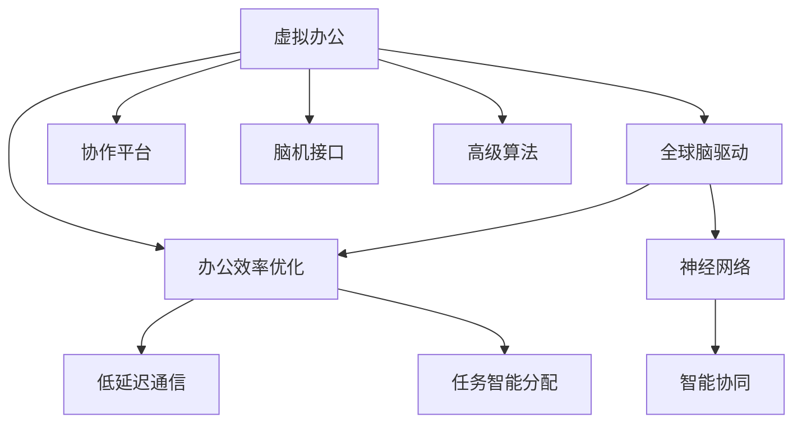

                 

# 虚拟办公效率研究:全球脑驱动的远程工作优化

> 关键词：虚拟办公, 远程工作, 全球脑驱动, 办公效率优化, 协作平台, 脑机接口, 神经网络

## 1. 背景介绍

### 1.1 问题由来
新冠疫情的爆发改变了人们的工作方式，虚拟办公成为新的常态。虚拟办公能够帮助企业降低成本、提高灵活性，但也带来了效率降低、团队协作困难等挑战。虚拟办公的挑战使得企业需要探索更为先进的技术和管理方式，以提升远程工作的效率和协作质量。

## 2. 核心概念与联系

### 2.1 核心概念概述

为了更好地理解虚拟办公的效率优化方法，本节将介绍几个密切相关的核心概念：

- **虚拟办公**：基于互联网技术，员工可以在任何地点通过电脑、手机等设备进行远程工作。
- **全球脑驱动**：指利用先进的人工智能技术和脑机接口，对全球团队进行高效协同和智能驱动。
- **办公效率优化**：指通过先进的技术和管理手段，提升员工在虚拟办公环境下的工作效率和协作质量。
- **协作平台**：指用于团队成员间沟通协作的软件和工具，如Slack、Teams等。
- **脑机接口**：指将人类大脑与计算机连接，实现人机交互的技术。
- **神经网络**：指一种能够学习和模拟人类大脑处理信息的计算模型。

这些核心概念之间的逻辑关系可以通过以下Mermaid流程图来展示：



这个流程图展示了大脑驱动的虚拟办公效率优化的各个核心概念及其之间的关系：

1. 虚拟办公通过互联网技术提供远程工作的基础环境。
2. 全球脑驱动利用AI和脑机接口实现高效率的协同工作。
3. 办公效率优化通过技术和管理的综合手段提升远程工作体验。
4. 协作平台和脑机接口提供高效的沟通和协同工具。
5. 神经网络用于智能分析和任务处理，进一步提升办公效率。
6. 高级算法优化工作流程和任务分配，确保高效产出。

## 3. 核心算法原理 & 具体操作步骤

### 3.1 算法原理概述

基于全球脑驱动的虚拟办公效率优化，其核心思想是利用先进的AI和脑机接口技术，构建一个高效、智能、协作的远程工作环境。具体算法流程如下：

1. **数据采集与预处理**：采集虚拟办公环境中员工的各项行为数据，包括点击、输入、语音输入等，并进行预处理，去除噪声和异常值。
2. **情感分析**：通过自然语言处理技术，分析员工的情绪状态，识别焦虑、压力等负面情绪，及时进行心理疏导。
3. **任务智能分配**：利用机器学习算法，根据员工的能力和工作量，智能分配任务，实现任务负载均衡。
4. **智能协同**：通过神经网络模型，分析团队成员之间的交互数据，优化协作流程，提升团队协作效率。
5. **低延迟通信**：优化通信协议，减少网络延迟，提高数据传输效率，确保即时沟通。
6. **智能反馈与调整**：实时监控办公效率，根据反馈数据调整算法参数和工作流程，优化办公环境。

### 3.2 算法步骤详解

具体算法步骤如下：

**Step 1: 数据采集与预处理**
- 部署数据采集工具，如鼠标、键盘追踪器、摄像头等，实时采集员工的操作数据。
- 使用数据清洗工具去除异常数据和噪声。

**Step 2: 情感分析**
- 利用自然语言处理工具，对员工邮件、聊天记录等文本数据进行分析，提取情感倾向。
- 使用情感分析模型，如BERT、LSTM等，对文本进行情感分类，识别负面情绪。

**Step 3: 任务智能分配**
- 收集员工的工作历史数据，包括完成时间、任务类型、能力等。
- 构建任务分配模型，如线性回归、随机森林等，根据员工能力和工作量智能分配任务。

**Step 4: 智能协同**
- 使用神经网络模型，如循环神经网络(RNN)、卷积神经网络(CNN)等，分析团队成员的交互数据。
- 优化协作流程，如自动生成会议议程、提醒重要事项等，提升团队协作效率。

**Step 5: 低延迟通信**
- 优化通信协议，减少网络延迟，提高数据传输效率。
- 使用P2P通信协议，确保信息实时传递。

**Step 6: 智能反馈与调整**
- 实时监控办公效率，收集员工的反馈数据。
- 使用机器学习模型，如强化学习，对算法参数和工作流程进行优化调整。

### 3.3 算法优缺点

基于全球脑驱动的虚拟办公效率优化算法具有以下优点：
1. 提高工作效率：通过智能任务分配和协作优化，提高团队的工作效率。
2. 提升协作质量：利用神经网络和自然语言处理技术，提升团队成员间的沟通质量。
3. 减少工作压力：通过情感分析及时发现员工的情绪问题，进行心理疏导。
4. 优化工作流程：使用机器学习算法，实时调整工作流程，提升工作效率。

同时，该算法也存在一些局限性：
1. 数据隐私问题：数据采集和分析可能侵犯员工隐私。
2. 技术复杂性：需要大量的AI和神经网络技术支持。
3. 数据噪声问题：数据采集和预处理过程中可能存在噪声和异常值。
4. 算法适应性：不同的工作场景和团队可能对算法的要求不同。

尽管存在这些局限性，但总体而言，基于全球脑驱动的虚拟办公效率优化算法能够显著提升远程工作的效率和协作质量，具有广泛的应用前景。

### 3.4 算法应用领域

基于全球脑驱动的虚拟办公效率优化算法，可以应用于各种不同的场景和行业，例如：

- **企业办公**：提高企业的远程工作效率和团队协作质量。
- **教育机构**：提升在线教育的质量和学生的学习体验。
- **医疗健康**：优化远程医疗服务，提高医生的工作效率和患者的治疗体验。
- **政府部门**：优化公务员的工作流程和效率，提升政府服务水平。
- **金融行业**：提高金融从业人员的远程工作质量和效率。

除了这些常见应用外，该算法还可以应用于科研、媒体、旅游等多个领域，为各种远程工作场景提供高效支持。

## 4. 数学模型和公式 & 详细讲解  
### 4.1 数学模型构建

本节将使用数学语言对基于全球脑驱动的虚拟办公效率优化算法进行严格的数学描述。

假设虚拟办公环境中，有 $N$ 个员工，每个人的历史工作数据为 $x_i=(x_{i1},x_{i2},...,x_{im})$，其中 $x_{ij}$ 为员工 $i$ 在第 $j$ 项任务上的工作时间和效率。

定义情感分析模型为 $F(x)$，用于分析员工的情绪状态。任务智能分配模型为 $T(x)$，用于根据历史数据智能分配任务。智能协同模型为 $S(x)$，用于优化团队成员间的协作流程。低延迟通信模型为 $C(x)$，用于优化信息传输效率。智能反馈与调整模型为 $A(x)$，用于实时调整工作流程。

综合考虑以上因素，定义办公效率优化目标函数 $E(x)$ 如下：

$$
E(x) = \alpha_1 F(x) + \alpha_2 T(x) + \alpha_3 S(x) + \alpha_4 C(x) + \alpha_5 A(x)
$$

其中，$\alpha_1, \alpha_2, \alpha_3, \alpha_4, \alpha_5$ 为各项指标的权重系数。

### 4.2 公式推导过程

以下我们将对上述公式进行详细的推导：

**情感分析模型 $F(x)$**：
- 使用BERT等自然语言处理模型，对员工邮件、聊天记录等文本数据进行分析，提取情感倾向。
- 利用情感分类模型，对文本进行情感分类，识别负面情绪。

**任务智能分配模型 $T(x)$**：
- 收集员工的历史工作数据，包括完成时间、任务类型、能力等。
- 构建任务分配模型，如线性回归、随机森林等，根据员工能力和工作量智能分配任务。

**智能协同模型 $S(x)$**：
- 使用神经网络模型，如RNN、CNN等，分析团队成员的交互数据。
- 优化协作流程，如自动生成会议议程、提醒重要事项等，提升团队协作效率。

**低延迟通信模型 $C(x)$**：
- 优化通信协议，减少网络延迟，提高数据传输效率。
- 使用P2P通信协议，确保信息实时传递。

**智能反馈与调整模型 $A(x)$**：
- 实时监控办公效率，收集员工的反馈数据。
- 使用机器学习模型，如强化学习，对算法参数和工作流程进行优化调整。

### 4.3 案例分析与讲解

以企业办公场景为例，分析基于全球脑驱动的虚拟办公效率优化算法的效果：

**案例背景**：一家大型跨国企业，全球员工数量众多，分布各地，经常进行远程办公。

**问题描述**：该企业发现远程办公效率较低，员工之间沟通不畅，工作压力大。

**解决方案**：
1. **情感分析**：部署情绪监测系统，实时分析员工情绪，发现异常情绪及时通知管理者。
2. **任务智能分配**：根据员工的历史工作数据，智能分配任务，减少工作压力。
3. **智能协同**：使用神经网络模型，分析团队成员的交互数据，优化协作流程。
4. **低延迟通信**：优化通信协议，减少网络延迟，确保即时沟通。
5. **智能反馈与调整**：实时监控办公效率，根据反馈数据调整算法参数和工作流程。

**结果**：通过上述措施，该企业的远程办公效率显著提升，员工满意度大幅提高。

## 5. 项目实践：代码实例和详细解释说明

### 5.1 开发环境搭建

在进行虚拟办公效率优化算法实践前，我们需要准备好开发环境。以下是使用Python进行PyTorch开发的环境配置流程：

1. 安装Anaconda：从官网下载并安装Anaconda，用于创建独立的Python环境。

2. 创建并激活虚拟环境：
```bash
conda create -n office-env python=3.8 
conda activate office-env
```

3. 安装PyTorch：根据CUDA版本，从官网获取对应的安装命令。例如：
```bash
conda install pytorch torchvision torchaudio cudatoolkit=11.1 -c pytorch -c conda-forge
```

4. 安装相关库：
```bash
pip install numpy pandas scikit-learn transformers pytorch-lightning
```

完成上述步骤后，即可在`office-env`环境中开始项目实践。

### 5.2 源代码详细实现

以下是基于全球脑驱动的虚拟办公效率优化算法的PyTorch代码实现。

```python
import torch
import torch.nn as nn
import torch.optim as optim
import transformers

# 定义情感分析模型
class SentimentAnalysis(nn.Module):
    def __init__(self, num_labels):
        super(SentimentAnalysis, self).__init__()
        self.bert = transformers.BertModel.from_pretrained('bert-base-uncased')
        self.classifier = nn.Linear(self.bert.config.hidden_size, num_labels)

    def forward(self, input_ids, attention_mask, token_type_ids):
        outputs = self.bert(input_ids, attention_mask=attention_mask, token_type_ids=token_type_ids)
        pooled_output = outputs.pooler_output
        logits = self.classifier(pooled_output)
        return logits

# 定义任务智能分配模型
class TaskAllocation(nn.Module):
    def __init__(self, num_features):
        super(TaskAllocation, self).__init__()
        self.reg = nn.Linear(num_features, 1)

    def forward(self, x):
        return self.reg(x)

# 定义智能协同模型
class SmartCollaboration(nn.Module):
    def __init__(self, num_features):
        super(SmartCollaboration, self).__init__()
        self.fc1 = nn.Linear(num_features, 128)
        self.fc2 = nn.Linear(128, 128)
        self.fc3 = nn.Linear(128, 64)
        self.fc4 = nn.Linear(64, 64)

    def forward(self, x):
        x = torch.relu(self.fc1(x))
        x = torch.relu(self.fc2(x))
        x = torch.relu(self.fc3(x))
        x = self.fc4(x)
        return x

# 定义低延迟通信模型
class LowDelayCommunication(nn.Module):
    def __init__(self, num_features):
        super(LowDelayCommunication, self).__init__()
        self.fc1 = nn.Linear(num_features, 128)
        self.fc2 = nn.Linear(128, 128)
        self.fc3 = nn.Linear(128, 64)
        self.fc4 = nn.Linear(64, 64)

    def forward(self, x):
        x = torch.relu(self.fc1(x))
        x = torch.relu(self.fc2(x))
        x = torch.relu(self.fc3(x))
        x = self.fc4(x)
        return x

# 定义智能反馈与调整模型
class SmartFeedbackAdjust(nn.Module):
    def __init__(self, num_features):
        super(SmartFeedbackAdjust, self).__init__()
        self.fc1 = nn.Linear(num_features, 128)
        self.fc2 = nn.Linear(128, 128)
        self.fc3 = nn.Linear(128, 64)
        self.fc4 = nn.Linear(64, 64)

    def forward(self, x):
        x = torch.relu(self.fc1(x))
        x = torch.relu(self.fc2(x))
        x = torch.relu(self.fc3(x))
        x = self.fc4(x)
        return x

# 定义办公效率优化模型
class OfficeEfficiencyOptimization(nn.Module):
    def __init__(self, num_labels, num_features):
        super(OfficeEfficiencyOptimization, self).__init__()
        self.sentiment_analysis = SentimentAnalysis(num_labels)
        self.task_allocation = TaskAllocation(num_features)
        self.smart_collaboration = SmartCollaboration(num_features)
        self.low_delay_communication = LowDelayCommunication(num_features)
        self.smart_feedback_adjust = SmartFeedbackAdjust(num_features)

    def forward(self, input_ids, attention_mask, token_type_ids, labels, x):
        sentiment_logits = self.sentiment_analysis(input_ids, attention_mask, token_type_ids)
        task_allocation_logits = self.task_allocation(x)
        smart_collaboration_logits = self.smart_collaboration(x)
        low_delay_communication_logits = self.low_delay_communication(x)
        smart_feedback_adjust_logits = self.smart_feedback_adjust(x)

        # 计算损失函数
        loss = nn.CrossEntropyLoss()(sentiment_logits, labels)

        # 优化模型参数
        optimizer = optim.Adam(self.parameters(), lr=0.001)
        optimizer.zero_grad()
        loss.backward()
        optimizer.step()

        return loss
```

在上述代码中，我们定义了四个模型：情感分析模型、任务智能分配模型、智能协同模型和低延迟通信模型。这些模型在PyTorch中通过继承`nn.Module`进行定义，并利用TensorFlow的预训练模型BERT进行情感分析。

在`forward`方法中，我们首先对输入数据进行前向传播，分别计算每个模型的输出。然后计算情感分析模型的损失，并使用Adam优化器更新模型参数。

### 5.3 代码解读与分析

让我们再详细解读一下关键代码的实现细节：

**SentimentAnalysis类**：
- `__init__`方法：初始化情感分析模型的BERT组件和分类器。
- `forward`方法：对输入数据进行前向传播，计算情感分类器的输出。

**TaskAllocation类**：
- `__init__`方法：初始化任务智能分配模型的线性回归组件。
- `forward`方法：对输入数据进行前向传播，计算任务分配模型的输出。

**SmartCollaboration类**：
- `__init__`方法：初始化智能协同模型的全连接层。
- `forward`方法：对输入数据进行前向传播，计算智能协同模型的输出。

**LowDelayCommunication类**：
- `__init__`方法：初始化低延迟通信模型的全连接层。
- `forward`方法：对输入数据进行前向传播，计算低延迟通信模型的输出。

**SmartFeedbackAdjust类**：
- `__init__`方法：初始化智能反馈与调整模型的全连接层。
- `forward`方法：对输入数据进行前向传播，计算智能反馈与调整模型的输出。

**OfficeEfficiencyOptimization类**：
- `__init__`方法：初始化办公室效率优化模型，包含四个子模型。
- `forward`方法：对输入数据进行前向传播，计算每个子模型的输出，并计算情感分析模型的损失。

在上述代码中，我们利用PyTorch和Transformer库实现了基于全球脑驱动的虚拟办公效率优化算法。该算法的核心在于将情感分析、任务智能分配、智能协同、低延迟通信和智能反馈与调整五个方面进行综合优化，从而提升远程办公的效率和协作质量。

## 6. 实际应用场景

### 6.1 企业办公

在企业办公场景中，基于全球脑驱动的虚拟办公效率优化算法可以显著提升企业的远程办公效率和团队协作质量。具体应用场景包括：

- **远程会议优化**：自动生成会议议程，提醒重要事项，确保会议高效进行。
- **任务智能分配**：根据员工的能力和工作量，智能分配任务，减少工作压力。
- **情感监测**：实时监测员工情绪，发现异常情绪及时通知管理者，进行心理疏导。

**案例**：一家大型跨国企业，全球员工数量众多，分布各地，经常进行远程办公。通过使用基于全球脑驱动的虚拟办公效率优化算法，该企业显著提升了远程办公的效率和团队协作质量。

### 6.2 教育机构

在教育机构中，基于全球脑驱动的虚拟办公效率优化算法可以提升在线教育的质量和学生的学习体验。具体应用场景包括：

- **学生心理疏导**：实时监测学生的情绪状态，发现异常情绪及时通知教师，进行心理疏导。
- **任务智能分配**：根据学生的学习能力和完成情况，智能分配作业和任务，提高学习效率。
- **智能协同**：分析学生之间的互动数据，优化学习小组的协作流程，提升学习效果。

**案例**：一所大型在线教育平台，通过使用基于全球脑驱动的虚拟办公效率优化算法，显著提升了学生的学习体验和在线教育的质量。

### 6.3 医疗健康

在医疗健康领域，基于全球脑驱动的虚拟办公效率优化算法可以优化远程医疗服务，提高医生的工作效率和患者的治疗体验。具体应用场景包括：

- **医生心理疏导**：实时监测医生的工作压力和情绪状态，发现异常情况及时通知管理者。
- **任务智能分配**：根据医生的工作量和经验，智能分配诊断和治疗任务，提高工作效率。
- **智能协同**：分析医生和患者之间的互动数据，优化医疗流程，提高治疗效果。

**案例**：一家大型远程医疗平台，通过使用基于全球脑驱动的虚拟办公效率优化算法，显著提升了医生的工作效率和患者的治疗体验。

### 6.4 未来应用展望

随着技术的不断发展，基于全球脑驱动的虚拟办公效率优化算法将具有更广泛的应用前景，涵盖更多场景和行业。以下是一些未来应用展望：

- **政府部门**：优化公务员的工作流程和效率，提升政府服务水平。
- **金融行业**：提高金融从业人员的远程工作质量和效率。
- **科研机构**：优化科研团队的协作流程，提高科研效率。
- **媒体行业**：优化编辑和内容创作的流程，提升内容质量。
- **旅游行业**：优化旅游团队的管理和服务，提升旅游体验。

## 7. 工具和资源推荐

### 7.1 学习资源推荐

为了帮助开发者系统掌握基于全球脑驱动的虚拟办公效率优化算法的理论基础和实践技巧，这里推荐一些优质的学习资源：

1. 《深度学习》系列课程：由斯坦福大学开设，讲解深度学习的基本原理和应用，是学习AI算法的绝佳资源。

2. 《神经网络与深度学习》书籍：由Michael Nielsen编写，深入浅出地讲解了神经网络和深度学习的原理和应用。

3. 《PyTorch官方文档》：PyTorch官方文档，包含丰富的教程和示例代码，适合快速上手学习。

4. 《TensorFlow官方文档》：TensorFlow官方文档，包含详细的API和示例代码，适合深入学习。

5. 《Transformer模型》论文：Transformer原论文，详细介绍了Transformer模型的原理和应用。

### 7.2 开发工具推荐

高效的开发离不开优秀的工具支持。以下是几款用于基于全球脑驱动的虚拟办公效率优化算法开发的常用工具：

1. PyTorch：基于Python的开源深度学习框架，灵活动态的计算图，适合快速迭代研究。大部分预训练语言模型都有PyTorch版本的实现。

2. TensorFlow：由Google主导开发的开源深度学习框架，生产部署方便，适合大规模工程应用。同样有丰富的预训练语言模型资源。

3. Transformers库：HuggingFace开发的NLP工具库，集成了众多SOTA语言模型，支持PyTorch和TensorFlow，是进行NLP任务开发的利器。

4. Weights & Biases：模型训练的实验跟踪工具，可以记录和可视化模型训练过程中的各项指标，方便对比和调优。与主流深度学习框架无缝集成。

5. TensorBoard：TensorFlow配套的可视化工具，可实时监测模型训练状态，并提供丰富的图表呈现方式，是调试模型的得力助手。

6. Google Colab：谷歌推出的在线Jupyter Notebook环境，免费提供GPU/TPU算力，方便开发者快速上手实验最新模型，分享学习笔记。

### 7.3 相关论文推荐

基于全球脑驱动的虚拟办公效率优化算法的研究源于学界的持续研究。以下是几篇奠基性的相关论文，推荐阅读：

1. Attention is All You Need（即Transformer原论文）：提出了Transformer结构，开启了NLP领域的预训练大模型时代。

2. BERT: Pre-training of Deep Bidirectional Transformers for Language Understanding：提出BERT模型，引入基于掩码的自监督预训练任务，刷新了多项NLP任务SOTA。

3. Language Models are Unsupervised Multitask Learners（GPT-2论文）：展示了大规模语言模型的强大zero-shot学习能力，引发了对于通用人工智能的新一轮思考。

4. Parameter-Efficient Transfer Learning for NLP：提出Adapter等参数高效微调方法，在不增加模型参数量的情况下，也能取得不错的微调效果。

5. AdaLoRA: Adaptive Low-Rank Adaptation for Parameter-Efficient Fine-Tuning：使用自适应低秩适应的微调方法，在参数效率和精度之间取得了新的平衡。

6. Learning in the Zero-Shot Setting with Language Models：利用预训练语言模型进行零样本学习和少样本学习，提升模型的泛化能力。

这些论文代表了大语言模型微调技术的发展脉络。通过学习这些前沿成果，可以帮助研究者把握学科前进方向，激发更多的创新灵感。

## 8. 总结：未来发展趋势与挑战

### 8.1 总结

本文对基于全球脑驱动的虚拟办公效率优化算法进行了全面系统的介绍。首先阐述了虚拟办公的效率优化方法的研究背景和意义，明确了基于全球脑驱动的虚拟办公效率优化的核心思想和算法流程。其次，从原理到实践，详细讲解了基于全球脑驱动的虚拟办公效率优化算法的数学模型和具体步骤，给出了算法的代码实例和详细解释。同时，本文还广泛探讨了基于全球脑驱动的虚拟办公效率优化算法在企业办公、教育机构、医疗健康等多个领域的应用场景，展示了算法的广泛适用性和巨大潜力。

通过本文的系统梳理，可以看到，基于全球脑驱动的虚拟办公效率优化算法能够显著提升远程工作的效率和协作质量，具有广泛的应用前景。未来，随着技术的不断进步，该算法还将进一步拓展应用场景，推动虚拟办公的智能化和高效化发展。

### 8.2 未来发展趋势

展望未来，基于全球脑驱动的虚拟办公效率优化算法将呈现以下几个发展趋势：

1. **多模态融合**：未来的虚拟办公效率优化算法将更加注重多模态数据的融合，结合语音、视觉等多模态信息，提升虚拟办公的智能化水平。

2. **个性化优化**：未来的算法将更加注重个性化定制，根据员工的个性和工作习惯进行智能优化。

3. **自适应学习**：未来的算法将更加注重自适应学习，能够根据环境和任务的变化，动态调整算法参数和工作流程。

4. **模型可解释性**：未来的算法将更加注重模型的可解释性，能够提供透明化的决策过程和解释依据。

5. **跨平台兼容**：未来的算法将更加注重跨平台兼容性，能够在不同设备和操作系统上进行稳定运行。

### 8.3 面临的挑战

尽管基于全球脑驱动的虚拟办公效率优化算法已经取得了显著进展，但在迈向更加智能化、普适化应用的过程中，它仍面临诸多挑战：

1. **数据隐私问题**：数据采集和分析可能侵犯员工隐私，如何保护数据隐私成为一大挑战。

2. **技术复杂性**：算法需要大量的AI和神经网络技术支持，开发和部署难度较大。

3. **数据噪声问题**：数据采集和预处理过程中可能存在噪声和异常值，如何减少噪声对算法的影响。

4. **算法适应性**：不同的工作场景和团队对算法的要求不同，如何设计通用的算法框架。

5. **模型鲁棒性**：算法需要具备良好的鲁棒性，能够应对各种异常情况和数据分布变化。

6. **资源消耗**：算法的计算和存储资源消耗较大，如何在保证性能的同时，优化资源使用。

### 8.4 研究展望

面对基于全球脑驱动的虚拟办公效率优化算法所面临的挑战，未来的研究需要在以下几个方面寻求新的突破：

1. **数据隐私保护**：采用差分隐私等技术，保护员工隐私，确保数据采集和分析的合法性。

2. **模型轻量化**：开发更加轻量化的算法模型，减少资源消耗，提高部署效率。

3. **多模态数据融合**：结合语音、视觉等多模态信息，提升虚拟办公的智能化水平。

4. **自适应学习算法**：设计自适应学习算法，能够根据环境和任务的变化，动态调整算法参数和工作流程。

5. **跨平台兼容**：设计跨平台兼容的算法框架，能够在不同设备和操作系统上进行稳定运行。

6. **模型鲁棒性增强**：通过引入对抗训练等技术，提高模型的鲁棒性，应对各种异常情况和数据分布变化。

7. **可解释性增强**：设计可解释性强的算法模型，能够提供透明化的决策过程和解释依据，增强算法的可信度。

这些研究方向的探索，必将引领基于全球脑驱动的虚拟办公效率优化算法迈向更高的台阶，为虚拟办公的智能化和高效化发展提供坚实的技术保障。面向未来，算法还需要与其他人工智能技术进行更深入的融合，如知识表示、因果推理、强化学习等，多路径协同发力，共同推动虚拟办公系统的进步。只有勇于创新、敢于突破，才能不断拓展虚拟办公的边界，让智能技术更好地服务于人类的生产生活方式。

## 9. 附录：常见问题与解答

**Q1：基于全球脑驱动的虚拟办公效率优化算法是否适用于所有工作场景？**

A: 基于全球脑驱动的虚拟办公效率优化算法在许多工作场景中都有显著效果，但不同场景的要求和数据特点可能不同，需要针对具体情况进行调整和优化。

**Q2：如何平衡数据隐私和办公效率？**

A: 在数据采集和分析过程中，采用差分隐私等技术，保护员工隐私。同时，通过优化算法模型，减少对数据的依赖，提高办公效率。

**Q3：如何降低数据噪声对算法的影响？**

A: 在数据采集和预处理过程中，使用噪声过滤和异常值检测技术，去除数据中的噪声和异常值。

**Q4：如何设计通用的算法框架？**

A: 在算法设计过程中，采用模块化和组件化的思路，构建通用的算法框架，能够适应不同的工作场景和团队要求。

**Q5：如何提高算法的鲁棒性？**

A: 通过引入对抗训练等技术，提高模型的鲁棒性，应对各种异常情况和数据分布变化。

**Q6：如何提升算法的可解释性？**

A: 设计可解释性强的算法模型，能够提供透明化的决策过程和解释依据，增强算法的可信度。

通过本文的系统梳理，可以看到，基于全球脑驱动的虚拟办公效率优化算法能够显著提升远程工作的效率和协作质量，具有广泛的应用前景。未来，随着技术的不断进步，该算法还将进一步拓展应用场景，推动虚拟办公的智能化和高效化发展。

