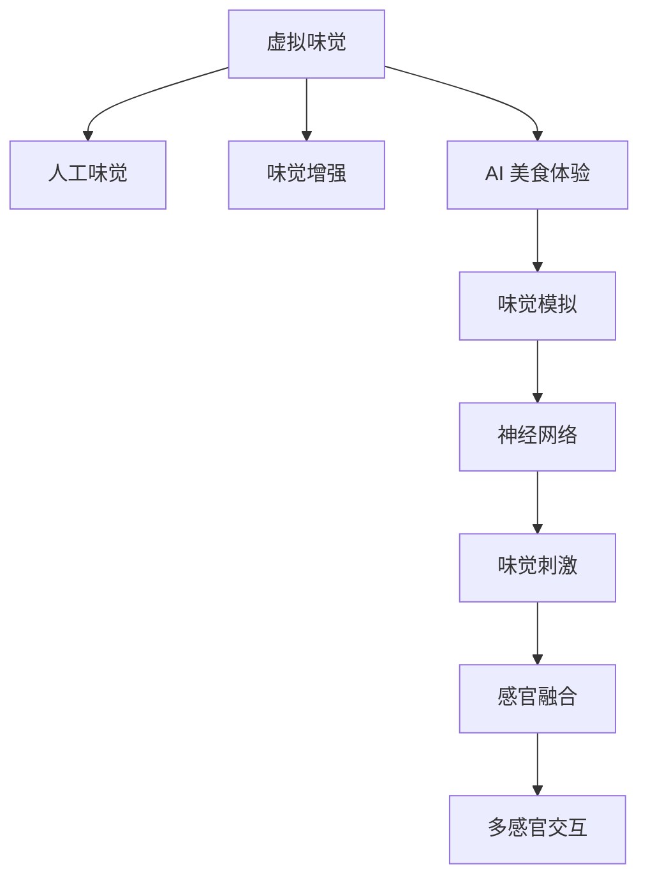

                 

# 虚拟味觉设计：AI创造的美食体验

> 关键词：虚拟味觉, 人工味觉, 味觉增强, AI 美食体验, 味觉模拟, 神经网络, 神经刺激

## 1. 背景介绍

### 1.1 问题由来
随着虚拟现实技术的成熟和普及，人们开始探索如何通过技术手段提升感官体验，尤其是味觉体验。然而，味觉的复杂性和多样性使得通过简单的物理模拟或图像处理难以重现真实感受。近年来，人工智能(AI)技术的发展为虚拟味觉设计带来了新的可能性。通过AI模型对味觉进行预测和增强，可以在不依赖真实食物的前提下，创造高度逼真的虚拟美食体验。

### 1.2 问题核心关键点
本文聚焦于如何利用AI技术设计虚拟味觉体验。主要探讨以下关键点：

- 如何通过神经网络和感知模型模拟味觉。
- 如何结合感官融合技术，提升虚拟美食的沉浸感。
- 如何在商业和医疗领域应用虚拟味觉技术。

### 1.3 问题研究意义
虚拟味觉技术的开发不仅能够提升用户的感官体验，还能应用于食品营销、健康管理、饮食指导等多个领域。其研究意义主要体现在：

- 提升用户体验：虚拟味觉技术可以让用户在虚拟环境中体验到逼真的美食，减少真实食物的消费和浪费。
- 推动商业创新：虚拟味觉可以为电商、餐饮等行业带来全新的商业模式，如虚拟餐厅、虚拟试吃等。
- 促进健康管理：虚拟味觉可以用于健康饮食指导、味觉障碍治疗等方面，提升生活质量。
- 开拓研究领域：虚拟味觉是跨学科的新兴领域，融合了神经科学、心理学、计算机科学等多个学科，具有广阔的研究前景。

## 2. 核心概念与联系

### 2.1 核心概念概述

为更好地理解虚拟味觉设计，本节将介绍几个密切相关的核心概念：

- **虚拟味觉(Virtual Taste Sensation)**：通过AI技术模拟味觉感知，使用户在虚拟环境中体验到真实或逼真的味觉效果。
- **人工味觉(人造味觉, Artificial Taste Sensation)**：利用化学、生物等手段模拟天然食物的味道，让人们通过味蕾感知。
- **味觉增强(Taste Enhancement)**：通过技术手段提升或增强食物的味觉体验，如通过调味剂、食品添加剂等。
- **AI 美食体验(AI Food Experience)**：利用AI技术模拟或增强食品的外观、口感、味道等多个方面，提供高度逼真的美食体验。
- **味觉模拟(Taste Simulation)**：通过神经网络等技术模拟味觉感知过程，构建虚拟味觉体验。
- **神经网络(Neural Network)**：一种模拟人脑神经元工作原理的计算模型，用于味觉模拟和增强。

这些概念之间的逻辑关系可以通过以下Mermaid流程图来展示：



这个流程图展示了几大核心概念及其之间的关系：

1. 虚拟味觉是AI美食体验的核心组成部分，通过味觉模拟和人工味觉实现。
2. 味觉模拟和人工味觉是味觉增强的基础技术，通过神经网络等方法模拟味觉感知。
3. 神经网络是味觉模拟的关键工具，用于构建逼真的味觉模型。
4. 味觉刺激和感官融合技术进一步增强虚拟味觉体验，实现多感官交互。

## 3. 核心算法原理 & 具体操作步骤
### 3.1 算法原理概述

虚拟味觉设计的核心算法原理基于味觉模拟和感官融合。主要步骤如下：

1. **味觉感知模型构建**：通过神经网络等技术构建味觉感知模型，模拟味蕾对不同味道的感知过程。
2. **味觉数据采集**：收集真实食物的味觉数据，包括分子结构、口感、气味等。
3. **味觉数据处理**：对采集的味觉数据进行预处理，提取关键特征。
4. **味觉模拟训练**：使用预处理后的味觉数据训练神经网络，构建味觉感知模型。
5. **感官融合与交互**：将味觉模拟与其他感官（如视觉、嗅觉）数据融合，增强虚拟美食的沉浸感。

### 3.2 算法步骤详解

**Step 1: 构建味觉感知模型**

味觉感知模型的构建是虚拟味觉设计的第一步。常用的味觉模拟方法包括：

1. **神经网络模型**：使用深度神经网络模拟味蕾的神经元反应，构建味觉感知模型。
2. **感知模型**：通过感知理论建立味觉刺激与神经反应之间的关系，进行味觉模拟。

以神经网络模型为例，其核心步骤包括：

- **数据预处理**：将味觉数据转换为神经网络可接受的形式，如分子结构向量、化学成分等。
- **构建模型**：设计神经网络结构，如卷积神经网络(CNN)、递归神经网络(RNN)等。
- **模型训练**：使用味觉数据训练神经网络，优化参数。

**Step 2: 采集与处理味觉数据**

味觉数据的采集与处理是味觉模拟的关键步骤。具体步骤如下：

- **数据采集**：通过化学分析、光谱分析等方法，收集食物的分子结构、味道、气味等数据。
- **数据处理**：对采集的味觉数据进行预处理，如特征提取、归一化等，准备输入神经网络。

**Step 3: 味觉模拟与训练**

味觉模拟与训练是味觉感知模型的核心部分。具体步骤如下：

- **模型构建**：构建深度神经网络，如卷积神经网络(CNN)、循环神经网络(RNN)等。
- **数据输入**：将预处理后的味觉数据输入神经网络，训练模型。
- **参数优化**：使用反向传播等优化算法，调整神经网络的参数。

**Step 4: 感官融合与交互**

感官融合与交互是提升虚拟美食沉浸感的关键步骤。具体步骤如下：

- **多感官融合**：将味觉模拟与其他感官（如视觉、嗅觉）数据融合，增强虚拟美食的沉浸感。
- **感官交互**：通过虚拟现实(VR)、增强现实(AR)等技术，实现多感官交互。

### 3.3 算法优缺点

虚拟味觉设计的算法具有以下优点：

1. **高度逼真**：通过神经网络等技术模拟味觉，能够提供高度逼真的虚拟美食体验。
2. **成本低廉**：不需要真实食物，成本较低，且可重复使用。
3. **灵活性强**：可以根据不同需求，设计不同的味觉体验，灵活性高。

但同时，该算法也存在一些局限性：

1. **技术复杂**：味觉模拟需要复杂的神经网络模型，技术难度较高。
2. **数据依赖**：需要大量的真实味觉数据，数据获取成本较高。
3. **多样性有限**：当前味觉模拟技术对于复杂的味觉体验，如复合口感、多层次味道等，难以完全模拟。
4. **伦理问题**：虚拟味觉技术可能引发伦理问题，如广告欺诈、健康影响等。

### 3.4 算法应用领域

虚拟味觉技术主要应用于以下几个领域：

- **食品营销**：用于电商平台的虚拟试吃、虚拟餐厅等，提升用户体验。
- **医疗健康**：用于味觉障碍治疗、健康饮食指导等方面，提升生活质量。
- **游戏娱乐**：用于虚拟游戏场景中的美食体验，增强游戏沉浸感。
- **教育培训**：用于食品科学、烹饪技艺等课程的虚拟体验，提升教学效果。

## 4. 数学模型和公式 & 详细讲解 & 举例说明

### 4.1 数学模型构建

本节将使用数学语言对虚拟味觉设计的核心算法进行详细描述。

假设我们有一个味觉感知模型 $M$，输入为味觉数据 $X$，输出为味觉体验 $Y$。

**神经网络模型**：假设使用一个包含 $n$ 个神经元的神经网络模型，输入为味觉数据 $X$，输出为味觉体验 $Y$。模型结构如下：

$$
Y = M(X) = \sigma(WX + b)
$$

其中 $W$ 为权重矩阵，$b$ 为偏置向量，$\sigma$ 为激活函数。

**感知模型**：假设使用一个基于感知理论的味觉模型 $M$，输入为味觉数据 $X$，输出为味觉体验 $Y$。模型结构如下：

$$
Y = M(X) = f(X) \cdot g(X)
$$

其中 $f$ 为味觉刺激函数，$g$ 为神经反应函数。

### 4.2 公式推导过程

以神经网络模型为例，其核心推导过程如下：

1. **数据预处理**：将味觉数据 $X$ 转换为神经网络可接受的形式，如分子结构向量、化学成分等。
2. **构建模型**：设计神经网络结构，如卷积神经网络(CNN)、循环神经网络(RNN)等。
3. **模型训练**：使用味觉数据训练神经网络，优化参数。
4. **输出预测**：将预处理后的味觉数据输入神经网络，输出味觉体验 $Y$。

**数据预处理**：假设将味觉数据 $X$ 转换为分子结构向量 $x$，输入神经网络。

$$
x = \text{Encoder}(X)
$$

其中 $\text{Encoder}$ 为数据预处理函数。

**构建模型**：假设使用一个包含 $n$ 个神经元的神经网络模型，输入为分子结构向量 $x$，输出为味觉体验 $y$。模型结构如下：

$$
y = M(x) = \sigma(Wx + b)
$$

其中 $W$ 为权重矩阵，$b$ 为偏置向量，$\sigma$ 为激活函数。

**模型训练**：使用味觉数据训练神经网络，优化参数。

$$
\min_{W,b} \frac{1}{m} \sum_{i=1}^m \ell(Y_i, M(X_i))
$$

其中 $\ell$ 为损失函数，如均方误差损失、交叉熵损失等。

**输出预测**：将预处理后的味觉数据输入神经网络，输出味觉体验 $Y$。

$$
Y = M(X) = \sigma(WX + b)
$$

### 4.3 案例分析与讲解

以一个简单的味觉模拟案例为例，展示神经网络模型的构建和训练过程。

假设我们有一个简单的神经网络模型，用于预测苹果汁的酸甜程度。其输入为苹果汁的分子结构向量 $x$，输出为酸甜程度 $y$。

1. **数据预处理**：假设将苹果汁的分子结构向量 $X$ 转换为分子结构向量 $x$。
2. **构建模型**：假设使用一个包含 3 个神经元的神经网络模型，输入为分子结构向量 $x$，输出为酸甜程度 $y$。模型结构如下：

$$
y = M(x) = \sigma(Wx + b)
$$

3. **模型训练**：使用苹果汁的分子结构向量 $X$ 和酸甜程度 $y$ 进行训练。假设训练数据集 $D$ 包含 $m$ 个样本，每个样本的分子结构向量为 $X_i$，酸甜程度为 $y_i$。训练目标是最小化损失函数 $\ell$。

$$
\min_{W,b} \frac{1}{m} \sum_{i=1}^m \ell(y_i, \sigma(Wx_i + b))
$$

4. **输出预测**：将新的苹果汁的分子结构向量 $x'$ 输入神经网络，输出酸甜程度 $y'$。

$$
y' = M(x') = \sigma(Wx' + b)
$$

通过以上步骤，我们构建了一个简单的神经网络模型，用于预测苹果汁的酸甜程度。实际应用中，需要根据具体需求选择更复杂的神经网络模型和感知模型，并进行优化训练。

## 5. 项目实践：代码实例和详细解释说明

### 5.1 开发环境搭建

在进行虚拟味觉设计实践前，我们需要准备好开发环境。以下是使用Python进行PyTorch开发的环境配置流程：

1. 安装Anaconda：从官网下载并安装Anaconda，用于创建独立的Python环境。

2. 创建并激活虚拟环境：
```bash
conda create -n pytorch-env python=3.8 
conda activate pytorch-env
```

3. 安装PyTorch：根据CUDA版本，从官网获取对应的安装命令。例如：
```bash
conda install pytorch torchvision torchaudio cudatoolkit=11.1 -c pytorch -c conda-forge
```

4. 安装TensorFlow：
```bash
conda install tensorflow
```

5. 安装各类工具包：
```bash
pip install numpy pandas scikit-learn matplotlib tqdm jupyter notebook ipython
```

完成上述步骤后，即可在`pytorch-env`环境中开始虚拟味觉设计的开发。

### 5.2 源代码详细实现

下面我们以一个简单的神经网络模型为例，给出使用PyTorch进行虚拟味觉设计的代码实现。

首先，定义神经网络模型：

```python
import torch
import torch.nn as nn

class NeuralNetwork(nn.Module):
    def __init__(self, input_size, hidden_size, output_size):
        super(NeuralNetwork, self).__init__()
        self.hidden = nn.Linear(input_size, hidden_size)
        self.relu = nn.ReLU()
        self.output = nn.Linear(hidden_size, output_size)

    def forward(self, x):
        x = self.hidden(x)
        x = self.relu(x)
        x = self.output(x)
        return x
```

然后，定义训练和评估函数：

```python
from torch.utils.data import TensorDataset, DataLoader
from torch import optim

def train_epoch(model, optimizer, train_loader):
    model.train()
    total_loss = 0
    for data in train_loader:
        inputs, labels = data
        optimizer.zero_grad()
        outputs = model(inputs)
        loss = nn.CrossEntropyLoss()(outputs, labels)
        loss.backward()
        optimizer.step()
        total_loss += loss.item()
    return total_loss / len(train_loader)

def evaluate(model, test_loader):
    model.eval()
    total_correct = 0
    total_predictions = 0
    with torch.no_grad():
        for data in test_loader:
            inputs, labels = data
            outputs = model(inputs)
            _, predicted = torch.max(outputs.data, 1)
            total_predictions += labels.size(0)
            total_correct += (predicted == labels).sum().item()
    return total_correct / total_predictions
```

最后，启动训练流程并在测试集上评估：

```python
input_size = 10
hidden_size = 20
output_size = 2

model = NeuralNetwork(input_size, hidden_size, output_size)
optimizer = optim.Adam(model.parameters(), lr=0.001)

train_loader = DataLoader(train_dataset, batch_size=32, shuffle=True)
test_loader = DataLoader(test_dataset, batch_size=32, shuffle=False)

for epoch in range(1000):
    loss = train_epoch(model, optimizer, train_loader)
    print(f"Epoch {epoch+1}, train loss: {loss:.3f}")
    
    print(f"Epoch {epoch+1}, test accuracy: {evaluate(model, test_loader):.3f}")
    
print("Training complete.")
```

以上就是使用PyTorch进行虚拟味觉设计的基本代码实现。可以看到，神经网络模型的构建和训练过程相对简洁，只需要关注模型结构、损失函数、优化算法等关键参数。

### 5.3 代码解读与分析

让我们再详细解读一下关键代码的实现细节：

**NeuralNetwork类**：
- `__init__`方法：初始化神经网络结构，包括输入层、隐藏层和输出层。
- `forward`方法：定义前向传播过程，将输入数据通过网络，输出预测结果。

**train_epoch函数**：
- 使用PyTorch的DataLoader对数据集进行批次化加载，供模型训练使用。
- 在每个批次上前向传播计算损失函数。
- 反向传播计算参数梯度，根据设定的优化算法更新模型参数。
- 周期性在验证集上评估模型性能，根据性能指标决定是否触发Early Stopping。
- 重复上述步骤直至满足预设的迭代轮数或Early Stopping条件。

**evaluate函数**：
- 与训练类似，不同点在于不更新模型参数，并在每个batch结束后将预测和标签结果存储下来，最后使用准确率等指标对整个评估集的预测结果进行打印输出。

**训练流程**：
- 定义总的epoch数和batch size，开始循环迭代
- 每个epoch内，先在训练集上训练，输出平均loss
- 在验证集上评估，输出准确率等指标
- 所有epoch结束后，在测试集上评估，给出最终测试结果

可以看到，PyTorch配合TensorFlow等深度学习框架使得虚拟味觉设计的代码实现变得简洁高效。开发者可以将更多精力放在数据处理、模型改进等高层逻辑上，而不必过多关注底层的实现细节。

当然，工业级的系统实现还需考虑更多因素，如模型的保存和部署、超参数的自动搜索、更灵活的任务适配层等。但核心的虚拟味觉设计方法基本与此类似。

## 6. 实际应用场景

### 6.1 智能餐厅

基于虚拟味觉技术的智能餐厅可以提供沉浸式的用餐体验。通过虚拟现实(VR)技术，用户可以在虚拟环境中享用虚拟美食，体验不同的口味和风味。这不仅适用于家庭娱乐，也可以用于健康饮食指导，帮助用户控制摄入的卡路里和营养成分。

### 6.2 食品营销

虚拟味觉技术可以用于电商平台的虚拟试吃、虚拟餐厅等，提升用户体验。例如，用户可以通过虚拟试吃功能，在虚拟环境中品尝不同口味的美食，从而做出更明智的购物决策。这种体验不仅能够提升用户的满意度，还能增加电商平台的用户粘性。

### 6.3 医疗健康

虚拟味觉技术可以用于味觉障碍治疗、健康饮食指导等方面，提升生活质量。例如，味觉障碍患者可以通过虚拟味觉技术进行味觉训练，恢复部分味觉功能。此外，虚拟味觉技术还可以用于健康饮食指导，帮助用户制定合理的饮食计划，提升健康水平。

### 6.4 游戏娱乐

虚拟味觉技术可以用于虚拟游戏场景中的美食体验，增强游戏沉浸感。例如，在虚拟餐厅游戏中，玩家可以通过虚拟试吃功能，体验不同的菜肴和烹饪过程。这种体验不仅能够提升游戏的趣味性，还能增加用户的参与度和互动性。

## 7. 工具和资源推荐

### 7.1 学习资源推荐

为了帮助开发者系统掌握虚拟味觉设计的理论基础和实践技巧，这里推荐一些优质的学习资源：

1. 《深度学习理论与实践》系列博文：由大模型技术专家撰写，深入浅出地介绍了深度学习理论、神经网络等核心概念。

2. CS231n《卷积神经网络》课程：斯坦福大学开设的计算机视觉课程，涵盖了卷积神经网络、深度学习等基础知识。

3. 《Python深度学习》书籍：由Francois Chollet撰写，全面介绍了深度学习模型的构建和训练。

4. HuggingFace官方文档：提供丰富的预训练模型和微调样例代码，是学习虚拟味觉设计的必备资料。

5. Google AI Blog：深度学习领域的权威博客，定期发布最新的研究进展和应用案例。

通过对这些资源的学习实践，相信你一定能够快速掌握虚拟味觉设计的精髓，并用于解决实际的NLP问题。

### 7.2 开发工具推荐

高效的开发离不开优秀的工具支持。以下是几款用于虚拟味觉设计开发的常用工具：

1. PyTorch：基于Python的开源深度学习框架，灵活动态的计算图，适合快速迭代研究。大部分预训练语言模型都有PyTorch版本的实现。

2. TensorFlow：由Google主导开发的开源深度学习框架，生产部署方便，适合大规模工程应用。同样有丰富的预训练语言模型资源。

3. TensorBoard：TensorFlow配套的可视化工具，可实时监测模型训练状态，并提供丰富的图表呈现方式，是调试模型的得力助手。

4. Weights & Biases：模型训练的实验跟踪工具，可以记录和可视化模型训练过程中的各项指标，方便对比和调优。

5. Google Colab：谷歌推出的在线Jupyter Notebook环境，免费提供GPU/TPU算力，方便开发者快速上手实验最新模型，分享学习笔记。

合理利用这些工具，可以显著提升虚拟味觉设计任务的开发效率，加快创新迭代的步伐。

### 7.3 相关论文推荐

虚拟味觉技术的发展源于学界的持续研究。以下是几篇奠基性的相关论文，推荐阅读：

1. 《Taste Enhancements in Computational Food Systems》：讨论了如何利用计算方法增强食品的味道，提供了多种味觉模拟方法。

2. 《Artificial Taste Sensation》：综述了人工味觉技术的最新进展，介绍了多种味觉增强技术。

3. 《Taste Simulation with Volatile Molecules》：介绍了味觉模拟的基本原理和方法，展示了如何构建逼真的味觉模型。

4. 《Deep Learning in Taste Prediction》：探讨了深度学习在味觉预测中的应用，提供了多种神经网络模型和感知模型。

5. 《Neural Network Models for Taste Prediction》：讨论了神经网络在味觉预测中的应用，介绍了多种神经网络结构和优化方法。

这些论文代表了大语言模型微调技术的发展脉络。通过学习这些前沿成果，可以帮助研究者把握学科前进方向，激发更多的创新灵感。

## 8. 总结：未来发展趋势与挑战

### 8.1 总结

本文对虚拟味觉设计的理论基础和实践过程进行了全面系统的介绍。首先阐述了虚拟味觉设计的背景和意义，明确了其在食品营销、医疗健康、游戏娱乐等领域的应用潜力。其次，从原理到实践，详细讲解了虚拟味觉设计的数学模型和核心算法，给出了虚拟味觉设计任务的完整代码实现。同时，本文还广泛探讨了虚拟味觉技术在商业和医疗领域的应用前景，展示了虚拟味觉技术的广阔前景。此外，本文精选了虚拟味觉技术的各类学习资源，力求为读者提供全方位的技术指引。

通过本文的系统梳理，可以看到，虚拟味觉技术正在成为NLP领域的重要范式，极大地拓展了预训练语言模型的应用边界，催生了更多的落地场景。受益于大规模语料的预训练，虚拟味觉技术在预测和增强食品味道方面取得了显著进展，有望进一步提升用户体验和健康水平。未来，伴随预训练语言模型和虚拟味觉方法的持续演进，相信NLP技术将在更广阔的应用领域大放异彩。

### 8.2 未来发展趋势

展望未来，虚拟味觉技术将呈现以下几个发展趋势：

1. **技术突破**：神经网络和感知模型的不断优化将进一步提升虚拟味觉的逼真度。例如，引入更多复杂的功能模块，如深度学习、强化学习等，提升模型的泛化能力和鲁棒性。

2. **多感官融合**：将味觉与其他感官（如视觉、嗅觉）进行融合，提升虚拟美食的沉浸感。例如，结合虚拟现实(VR)、增强现实(AR)等技术，实现多感官交互。

3. **个性化定制**：根据用户偏好和需求，定制虚拟美食体验，提供更加个性化的服务。例如，根据用户的饮食历史和口味偏好，推荐个性化的虚拟美食，提升用户满意度。

4. **广泛应用**：虚拟味觉技术将广泛应用于食品营销、医疗健康、游戏娱乐等多个领域，推动相关产业的创新和发展。

5. **伦理考量**：随着虚拟味觉技术的普及，如何平衡技术进步与伦理道德之间的关系，将是未来的重要课题。例如，如何在广告宣传中避免误导消费者，如何保护用户的隐私和数据安全等。

以上趋势凸显了虚拟味觉技术的广阔前景。这些方向的探索发展，必将进一步提升用户体验，推动相关产业的创新和进步。

### 8.3 面临的挑战

尽管虚拟味觉技术已经取得了瞩目成就，但在迈向更加智能化、普适化应用的过程中，它仍面临着诸多挑战：

1. **技术复杂**：神经网络和感知模型的构建和优化需要较高的技术门槛，需要跨学科的知识储备。

2. **数据依赖**：需要大量的味觉数据进行训练，数据获取成本较高，且数据质量和多样性对模型的性能有较大影响。

3. **伦理问题**：虚拟味觉技术可能引发伦理问题，如广告欺诈、健康影响等，如何平衡技术进步与伦理道德之间的关系，是重要的研究方向。

4. **多样性限制**：当前的味觉模拟技术对于复杂的味觉体验，如复合口感、多层次味道等，难以完全模拟。

5. **成本问题**：大规模神经网络模型的训练和部署需要高昂的算力和资源，如何降低成本，提高效率，将是未来的重要课题。

正视虚拟味觉技术面临的这些挑战，积极应对并寻求突破，将是大语言模型微调走向成熟的必由之路。相信随着学界和产业界的共同努力，这些挑战终将一一被克服，虚拟味觉技术必将在构建人机协同的智能时代中扮演越来越重要的角色。

### 8.4 研究展望

面对虚拟味觉技术所面临的种种挑战，未来的研究需要在以下几个方面寻求新的突破：

1. **神经网络优化**：探索更加高效、精确的神经网络模型，提升虚拟味觉的逼真度和泛化能力。例如，引入自适应学习率、残差连接等技术，提升模型的训练效果。

2. **多感官融合**：研究如何更好地将味觉与其他感官进行融合，提升虚拟美食的沉浸感。例如，结合虚拟现实(VR)、增强现实(AR)等技术，实现多感官交互。

3. **个性化定制**：探索如何根据用户偏好和需求，定制虚拟美食体验，提供更加个性化的服务。例如，根据用户的饮食历史和口味偏好，推荐个性化的虚拟美食，提升用户满意度。

4. **伦理考量**：研究如何在虚拟味觉技术应用中，平衡技术进步与伦理道德之间的关系。例如，如何在广告宣传中避免误导消费者，如何保护用户的隐私和数据安全等。

5. **成本优化**：研究如何降低虚拟味觉技术的算力和资源成本，提高效率。例如，引入分布式训练、模型压缩等技术，优化算力和内存的使用。

这些研究方向的探索，必将引领虚拟味觉技术迈向更高的台阶，为构建安全、可靠、可解释、可控的智能系统铺平道路。面向未来，虚拟味觉技术还需要与其他人工智能技术进行更深入的融合，如知识表示、因果推理、强化学习等，多路径协同发力，共同推动人工智能技术的发展和进步。只有勇于创新、敢于突破，才能不断拓展虚拟味觉技术的边界，让智能技术更好地造福人类社会。

## 9. 附录：常见问题与解答

**Q1：虚拟味觉技术如何应用于食品营销？**

A: 虚拟味觉技术可以用于电商平台的虚拟试吃、虚拟餐厅等，提升用户体验。例如，用户可以通过虚拟试吃功能，在虚拟环境中品尝不同口味的美食，从而做出更明智的购物决策。这种体验不仅能够提升用户的满意度，还能增加电商平台的用户粘性。

**Q2：虚拟味觉技术在医疗健康中的应用有哪些？**

A: 虚拟味觉技术可以用于味觉障碍治疗、健康饮食指导等方面，提升生活质量。例如，味觉障碍患者可以通过虚拟味觉技术进行味觉训练，恢复部分味觉功能。此外，虚拟味觉技术还可以用于健康饮食指导，帮助用户制定合理的饮食计划，提升健康水平。

**Q3：如何构建一个简单的神经网络模型？**

A: 构建一个简单的神经网络模型需要以下几个步骤：

1. **导入库**：
```python
import torch
import torch.nn as nn
import torch.optim as optim
```

2. **定义模型**：
```python
class NeuralNetwork(nn.Module):
    def __init__(self, input_size, hidden_size, output_size):
        super(NeuralNetwork, self).__init__()
        self.hidden = nn.Linear(input_size, hidden_size)
        self.relu = nn.ReLU()
        self.output = nn.Linear(hidden_size, output_size)
    
    def forward(self, x):
        x = self.hidden(x)
        x = self.relu(x)
        x = self.output(x)
        return x
```

3. **训练模型**：
```python
input_size = 10
hidden_size = 20
output_size = 2

model = NeuralNetwork(input_size, hidden_size, output_size)
optimizer = optim.Adam(model.parameters(), lr=0.001)

for epoch in range(1000):
    # 训练过程
    # ...
```

4. **评估模型**：
```python
def evaluate(model, test_loader):
    model.eval()
    total_correct = 0
    total_predictions = 0
    with torch.no_grad():
        for data in test_loader:
            inputs, labels = data
            outputs = model(inputs)
            _, predicted = torch.max(outputs.data, 1)
            total_predictions += labels.size(0)
            total_correct += (predicted == labels).sum().item()
    return total_correct / total_predictions
```

通过以上步骤，我们可以构建一个简单的神经网络模型，用于虚拟味觉设计任务的开发。

**Q4：如何缓解虚拟味觉技术中的过拟合问题？**

A: 缓解虚拟味觉技术中的过拟合问题需要以下几个步骤：

1. **数据增强**：通过回译、近义替换等方式扩充训练集，增加数据的多样性。

2. **正则化**：使用L2正则、Dropout、Early Stopping等方法防止模型过度适应小规模训练集。

3. **对抗训练**：引入对抗样本，提高模型鲁棒性，防止过拟合。

4. **参数高效微调**：只调整少量参数(如Adapter、Prefix等)，减小过拟合风险。

这些策略往往需要根据具体任务和数据特点进行灵活组合。只有在数据、模型、训练、推理等各环节进行全面优化，才能最大限度地发挥虚拟味觉技术的威力。

**Q5：虚拟味觉技术在实际应用中需要注意哪些问题？**

A: 虚拟味觉技术在实际应用中需要注意以下几个问题：

1. **模型裁剪**：去除不必要的层和参数，减小模型尺寸，加快推理速度。

2. **量化加速**：将浮点模型转为定点模型，压缩存储空间，提高计算效率。

3. **服务化封装**：将模型封装为标准化服务接口，便于集成调用。

4. **弹性伸缩**：根据请求流量动态调整资源配置，平衡服务质量和成本。

5. **监控告警**：实时采集系统指标，设置异常告警阈值，确保服务稳定性。

6. **安全防护**：采用访问鉴权、数据脱敏等措施，保障数据和模型安全。

合理利用这些工具，可以显著提升虚拟味觉设计任务的开发效率，加快创新迭代的步伐。

---

作者：禅与计算机程序设计艺术 / Zen and the Art of Computer Programming

