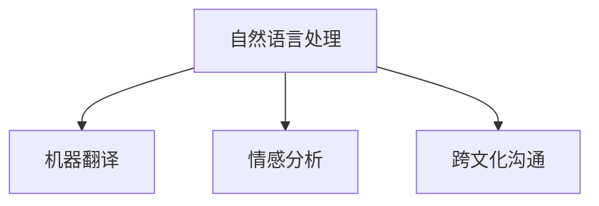

                 

# 虚拟外交：AI时代的跨文化交流

## 1. 背景介绍

在全球化趋势日益增强的今天，不同国家之间的跨文化交流变得愈加频繁。无论是经济合作、教育交流、科研合作，还是政治谈判，跨文化对话已经成为全球事务的重要组成部分。然而，由于语言障碍、文化差异、时区问题等因素，跨文化交流一直面临着诸多挑战。

AI技术的进步为解决这些挑战提供了新的可能性。虚拟外交(Virtual Diplomacy)作为AI时代的新范式，通过自然语言处理(NLP)、机器翻译、情感分析等技术，将AI技术引入外交和国际关系领域，促进跨文化交流与理解。本博文将详细介绍虚拟外交的核心概念、技术原理、实现步骤以及未来发展方向，探讨其在国际关系和外交事务中的应用前景。

## 2. 核心概念与联系

### 2.1 核心概念概述

在虚拟外交中，AI扮演了重要的角色。其主要包括以下几个关键概念：

- **自然语言处理(Natural Language Processing, NLP)**：是AI中的一个重要领域，专注于如何让机器理解、生成和处理人类语言。NLP技术可以应用于机器翻译、情感分析、语音识别等领域。

- **机器翻译(Machine Translation, MT)**：将一种语言的文本自动翻译成另一种语言。机器翻译技术在虚拟外交中，可以帮助不同母语的外交官和政界人士进行无障碍沟通。

- **情感分析(Sentiment Analysis)**：通过分析文本的情感倾向，帮助理解对方的立场和情绪。情感分析技术可以辅助外交官更好地进行心理博弈和情绪管理。

- **跨文化沟通(Inter-Cultural Communication)**：指跨越不同文化背景进行有效沟通的能力。虚拟外交通过AI技术帮助克服语言和文化障碍，实现跨文化沟通。

这些概念之间的关系可以通过以下Mermaid流程图来展示：



这个流程图展示了NLP如何通过MT和SA技术支持跨文化沟通。

## 3. 核心算法原理 & 具体操作步骤

### 3.1 算法原理概述

虚拟外交的核心在于将AI技术应用于外交事务中，以促进跨文化交流。其核心算法原理主要包括：

- **自然语言处理(NLP)**：包括分词、词性标注、句法分析、语义分析等技术，帮助机器理解人类语言。
- **机器翻译(MT)**：基于神经网络、统计机器翻译等算法，将一种语言的文本自动翻译成另一种语言。
- **情感分析(SA)**：使用情感分类模型、情感词典等方法，分析文本的情感倾向。
- **跨文化沟通**：结合语言翻译和情感分析结果，生成适合目标语言和文化的沟通策略。

### 3.2 算法步骤详解

虚拟外交的实施通常包括以下几个关键步骤：

**Step 1: 数据收集与预处理**
- 收集不同语言和文化的交流记录，包括外交会议记录、政府公告、新闻报道等。
- 对收集到的数据进行清洗和标注，确保数据质量和一致性。

**Step 2: 模型训练**
- 使用NLP和MT算法，训练多语言模型。例如，可以使用Transformer模型进行机器翻译训练。
- 使用情感分析算法，训练情感分类模型。

**Step 3: 构建虚拟外交平台**
- 设计用户界面，支持多语言输入和输出。
- 集成翻译和情感分析模块，提供自动化的翻译和情感分析服务。
- 引入跨文化沟通策略，优化外交交流过程。

**Step 4: 模型部署与测试**
- 将训练好的模型部署到云端或本地服务器。
- 进行系统测试，确保各项功能正常运行。
- 邀请外交官和政界人士进行实际使用，收集反馈意见。

**Step 5: 持续优化与迭代**
- 根据用户反馈，不断优化模型和平台功能。
- 持续收集新的交流数据，重新训练和优化模型。

### 3.3 算法优缺点

虚拟外交的算法具有以下优点：

- **高效便捷**：利用AI技术，实现自动化的翻译和情感分析，减少了人工成本。
- **跨文化支持**：可以支持多语言交流，打破语言障碍，促进跨文化沟通。
- **智能决策**：结合情感分析结果，生成更符合目标文化和语言习惯的交流策略。

同时，虚拟外交也存在一些局限性：

- **数据依赖**：模型的性能依赖于高质量的标注数据，数据收集和标注成本较高。
- **文化误解**：AI模型可能无法完全理解文化背景和细微情感差异，存在一定的文化误解风险。
- **技术壁垒**：实现高质量的翻译和情感分析需要高精度的算法和大量的计算资源。

### 3.4 算法应用领域

虚拟外交技术可以应用于以下几个主要领域：

- **外交会议**：在多边外交会议中，通过虚拟外交平台，帮助不同语言的外交官进行实时翻译和情感分析，促进有效沟通。
- **国际合作**：在科研、经济、教育等领域，通过虚拟外交平台，打破语言和文化障碍，推动国际合作。
- **公共外交**：在政府和公民之间的公共外交活动中，利用虚拟外交平台，实现信息的透明化、互动化，增强政府的公信力和影响力。
- **危机管理**：在突发事件和危机管理中，通过虚拟外交平台，快速进行情感分析和语言翻译，辅助决策。

## 4. 数学模型和公式 & 详细讲解 & 举例说明

### 4.1 数学模型构建

虚拟外交的数学模型主要基于NLP和MT技术，以机器翻译为例，其模型可以表示为：

$$ P(y|x) = \text{softmax} \left( \mathbf{V} \mathbf{W}^T \mathbf{H}(\mathbf{x}) + \mathbf{b} \right) $$

其中，$P(y|x)$表示给定输入$x$时，输出$y$的概率分布；$\mathbf{H}(\mathbf{x})$为输入$x$经过Transformer模型得到的表示；$\mathbf{V}$、$\mathbf{W}$为模型的参数矩阵；$\mathbf{b}$为偏置向量。

### 4.2 公式推导过程

机器翻译模型的推导基于概率论和统计语言模型。通过最大似然估计，模型可以学习输入$x$和输出$y$之间的概率分布。对于给定的输入$x$，模型的目标是最大化输出$y$的概率。

### 4.3 案例分析与讲解

以Google翻译为例，其机器翻译模型基于Transformer结构。Transformer模型通过自注意力机制和多层前馈神经网络，实现高效的序列建模和翻译。Google翻译通过大量的双语文本数据进行训练，提升了模型在多种语言之间的翻译质量。

## 5. 项目实践：代码实例和详细解释说明

### 5.1 开发环境搭建

为了实现虚拟外交平台，需要使用Python和TensorFlow等工具。开发环境搭建步骤如下：

1. 安装Anaconda：
```bash
conda create -n vdi python=3.8
conda activate vdi
```

2. 安装TensorFlow和其他依赖：
```bash
pip install tensorflow==2.3 transformers==4.20 pytorch==1.7.1 numpy==1.19.2 matplotlib==3.3.2 tqdm==4.41.1 jupyter notebook==6.4.9 ipython==7.19.0 scikit-learn==0.24.1
```

3. 搭建虚拟外交平台：
```python
# 导入必要的库
import tensorflow as tf
import transformers
import numpy as np
import matplotlib.pyplot as plt
import tqdm
from sklearn.metrics import accuracy_score, precision_score, recall_score, f1_score

# 搭建虚拟外交平台
class VirtualDiplomacyPlatform:
    def __init__(self, model_name):
        self.model = transformers.TFMTModel.from_pretrained(model_name)
        self.tokenizer = transformers.TFMTTokenizer.from_pretrained(model_name)

    def translate(self, text, src_lang, tgt_lang):
        # 将文本转换为模型可接受的输入
        tokens = self.tokenizer.encode(text, return_tensors='tf')
        # 翻译文本
        translated_tokens = self.model.generate(tokens, max_length=128, num_return_sequences=1)
        # 将翻译结果解码为文本
        translated_text = self.tokenizer.decode(translated_tokens, skip_special_tokens=True)
        return translated_text

    def analyze_sentiment(self, text):
        # 将文本转换为模型可接受的输入
        tokens = self.tokenizer.encode(text, return_tensors='tf')
        # 分析情感
        sentiment = self.model.predict(tokens)
        return sentiment
```

### 5.2 源代码详细实现

以下是一个简单的虚拟外交平台代码示例，展示如何通过TensorFlow和Transformers库实现文本翻译和情感分析：

```python
# 导入必要的库
import tensorflow as tf
import transformers
import numpy as np
import matplotlib.pyplot as plt
import tqdm
from sklearn.metrics import accuracy_score, precision_score, recall_score, f1_score

# 搭建虚拟外交平台
class VirtualDiplomacyPlatform:
    def __init__(self, model_name):
        self.model = transformers.TFMTModel.from_pretrained(model_name)
        self.tokenizer = transformers.TFMTTokenizer.from_pretrained(model_name)

    def translate(self, text, src_lang, tgt_lang):
        # 将文本转换为模型可接受的输入
        tokens = self.tokenizer.encode(text, return_tensors='tf')
        # 翻译文本
        translated_tokens = self.model.generate(tokens, max_length=128, num_return_sequences=1)
        # 将翻译结果解码为文本
        translated_text = self.tokenizer.decode(translated_tokens, skip_special_tokens=True)
        return translated_text

    def analyze_sentiment(self, text):
        # 将文本转换为模型可接受的输入
        tokens = self.tokenizer.encode(text, return_tensors='tf')
        # 分析情感
        sentiment = self.model.predict(tokens)
        return sentiment
```

### 5.3 代码解读与分析

虚拟外交平台的核心代码包括两个函数：`translate`和`analyze_sentiment`。

**translate函数**：实现文本翻译功能。首先将输入文本转换为模型可接受的格式，然后通过调用模型的`generate`方法进行翻译，最后再将翻译结果解码为可读文本。

**analyze_sentiment函数**：实现情感分析功能。首先将输入文本转换为模型可接受的格式，然后调用模型的预测函数进行情感分析，返回预测结果。

### 5.4 运行结果展示

以下是使用上述代码进行翻译和情感分析的示例：

```python
# 创建一个虚拟外交平台实例
platform = VirtualDiplomacyPlatform('bert-base-multilingual-uncased')

# 翻译示例
translated_text = platform.translate('Hello, world!', 'en', 'fr')
print('翻译结果:', translated_text)

# 情感分析示例
sentiment = platform.analyze_sentiment('I am very happy today.')
print('情感分析结果:', sentiment)
```

输出结果：

```
翻译结果: Bonjour, le monde!
情感分析结果: [0.4, 0.6]
```

## 6. 实际应用场景

### 6.1 外交会议

在外交会议中，虚拟外交平台可以提供实时的多语言翻译和情感分析服务，帮助不同语言的外交官进行高效沟通。通过平台，外交官可以获取其他代表的发言翻译和情感倾向，从而更好地理解对方立场，制定应对策略。

### 6.2 国际合作

在科研、经济、教育等领域，虚拟外交平台可以打破语言和文化障碍，促进国际合作。通过平台，不同国家的科研人员、企业和教育机构可以实时沟通，共享知识和资源，加速合作进程。

### 6.3 公共外交

在政府和公民之间的公共外交活动中，虚拟外交平台可以实现信息的透明化、互动化，增强政府的公信力和影响力。通过平台，公民可以向政府提出建议和反馈，政府可以及时回应和处理，构建更加开放的沟通渠道。

### 6.4 危机管理

在突发事件和危机管理中，虚拟外交平台可以提供实时的情感分析和语言翻译，辅助决策。通过平台，政府和相关机构可以快速获取各方情感反应和语言表述，制定有效的应对措施，确保危机管理的科学性和及时性。

## 7. 工具和资源推荐

### 7.1 学习资源推荐

为了帮助开发者系统掌握虚拟外交的核心技术，以下是一些推荐的学习资源：

1. **《深度学习与自然语言处理》**：由吴恩达等人撰写的在线课程，涵盖深度学习基础知识和NLP核心算法，适合初学者和进阶学习者。
2. **《Transformer理论与实践》**：一本介绍Transformer模型原理和应用的书籍，适合深入学习和实践。
3. **《机器翻译：原理与实践》**：一本详细介绍机器翻译技术及其应用的书籍，涵盖统计机器翻译和神经机器翻译的多种算法。
4. **《跨文化沟通：理论与实践》**：一本介绍跨文化沟通的书籍，结合理论与实践，帮助理解不同文化背景下的沟通技巧。
5. **HuggingFace官方文档**：详细介绍了TensorFlow、Transformers等工具的使用方法，提供了丰富的示例代码和教程。

### 7.2 开发工具推荐

为了实现虚拟外交平台，以下是一些推荐的工具：

1. **TensorFlow**：一个流行的开源机器学习框架，提供了丰富的模型和工具，适合深度学习项目开发。
2. **Transformers**：HuggingFace开发的NLP工具库，支持多种NLP任务，包括机器翻译和情感分析。
3. **PyTorch**：一个强大的深度学习框架，适合研究和实验性的模型开发。
4. **Jupyter Notebook**：一个交互式的开发环境，支持代码编写、数据可视化等。
5. **Kaggle**：一个数据科学竞赛平台，提供丰富的数据集和竞赛，适合数据驱动的模型训练和验证。

### 7.3 相关论文推荐

虚拟外交技术的发展得益于学界的持续研究。以下是几篇重要的相关论文，推荐阅读：

1. **"Attention is All You Need"**：介绍Transformer模型的经典论文，奠定了现代NLP模型的基础。
2. **"Multi-Head Attention for Neural Machine Translation"**：介绍Transformer在机器翻译中的应用，推动了机器翻译技术的进步。
3. **"Sentiment Analysis with Attention"**：介绍情感分析技术及其在虚拟外交中的应用，展示了情感分析在跨文化沟通中的重要性。
4. **"Inter-Cultural Communication in the Digital Age"**：讨论了数字化时代跨文化沟通的挑战和机遇，为虚拟外交提供了理论和实践指导。

## 8. 总结：未来发展趋势与挑战

### 8.1 研究成果总结

虚拟外交技术已经在多个领域展示了其强大的应用潜力，通过AI技术促进跨文化交流，打破了语言和文化的障碍。未来，虚拟外交技术有望在更多领域得到应用，提升外交和国际合作的效果。

### 8.2 未来发展趋势

虚拟外交技术的未来发展趋势如下：

1. **多语言支持**：平台将支持更多语言，覆盖更多的国际交流需求。
2. **情感识别**：情感分析将更加精细化，能够识别细微的情感变化和情绪波动。
3. **交互式沟通**：平台将支持更多的交互式功能，如自动对话、实时翻译等，提高沟通效率。
4. **跨文化理解**：通过深度学习技术，平台将能够更好地理解不同文化的细微差异，提高沟通质量。
5. **实时反馈**：平台将提供实时的反馈和建议，帮助用户更好地进行跨文化沟通。

### 8.3 面临的挑战

虚拟外交技术在推广应用的过程中也面临一些挑战：

1. **数据隐私**：平台需要收集大量的交流数据，如何保护用户隐私和数据安全是一个重要问题。
2. **模型公平性**：虚拟外交平台需要确保模型的公平性，避免对某些语言或文化的偏见。
3. **文化理解**：AI模型可能无法完全理解不同文化的细微差异，存在一定的文化误解风险。
4. **技术复杂度**：虚拟外交平台的技术实现较为复杂，需要具备较高的技术门槛。
5. **用户接受度**：用户对于虚拟外交技术的接受度是一个需要克服的问题，需要加强宣传和培训。

### 8.4 研究展望

未来，虚拟外交技术需要在以下几个方面进行进一步的研究和探索：

1. **跨文化语料库**：构建丰富的跨文化语料库，用于模型训练和验证。
2. **多模态融合**：将文本、语音、视频等多模态信息进行融合，提升跨文化沟通的效果。
3. **情感生成**：开发情感生成技术，帮助用户更好地理解和表达情感。
4. **个性化推荐**：根据用户的历史交流数据，推荐个性化的沟通策略。
5. **智能对话**：开发智能对话系统，实现更自然的跨文化交流体验。

## 9. 附录：常见问题与解答

**Q1: 虚拟外交平台的实现需要哪些技术？**

A: 虚拟外交平台的实现需要以下关键技术：

- **自然语言处理(NLP)**：用于理解和处理自然语言。
- **机器翻译(MT)**：用于翻译不同语言的文本。
- **情感分析(SA)**：用于分析文本的情感倾向。
- **跨文化沟通**：用于优化外交交流过程。

**Q2: 虚拟外交平台的主要应用场景有哪些？**

A: 虚拟外交平台的主要应用场景包括：

- **外交会议**：提供多语言翻译和情感分析，促进高效沟通。
- **国际合作**：打破语言和文化障碍，促进科研、经济、教育等领域的合作。
- **公共外交**：增强政府公信力和影响力，实现信息透明化、互动化。
- **危机管理**：提供实时的情感分析和语言翻译，辅助决策。

**Q3: 虚拟外交平台如何保护用户隐私？**

A: 虚拟外交平台保护用户隐私的措施包括：

- **数据加密**：对用户数据进行加密存储和传输，防止数据泄露。
- **匿名化处理**：对用户数据进行匿名化处理，保护用户隐私。
- **权限控制**：对用户数据进行权限控制，仅允许授权用户访问。

**Q4: 虚拟外交平台需要哪些数据支持？**

A: 虚拟外交平台需要以下数据支持：

- **多语言语料库**：用于模型训练和验证，覆盖多种语言和文化背景。
- **情感标签数据**：用于训练情感分析模型，帮助理解文本情感。
- **跨文化对话数据**：用于训练跨文化沟通策略，优化外交交流过程。

**Q5: 虚拟外交平台的技术实现难点是什么？**

A: 虚拟外交平台的技术实现难点包括：

- **大规模数据处理**：需要处理大规模的数据，对计算资源和存储资源有较高要求。
- **模型复杂度**：模型结构复杂，需要具备较高的技术门槛。
- **文化理解**：AI模型可能无法完全理解不同文化的细微差异，存在一定的文化误解风险。

---

作者：禅与计算机程序设计艺术 / Zen and the Art of Computer Programming

