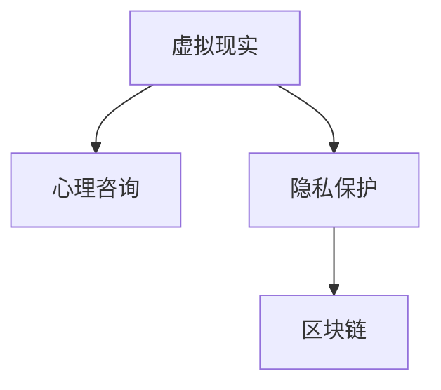

                 

# 虚拟现实心理咨询创业：隐私保护的心理服务

> 关键词：虚拟现实, 心理咨询, 隐私保护, 心理健康, 区块链

## 1. 背景介绍

### 1.1 问题由来
随着科技的发展和社会的进步，人们面临的压力和心理问题日益增多。传统的心理咨询往往受到时间和地点限制，难以满足人们日益增长的心理服务需求。为此，虚拟现实（VR）技术作为一种新兴的媒介，凭借其沉浸式的交互体验，为心理咨询提供了全新的可能。

VR心理咨询不仅能够打破时间和空间的限制，提供灵活、便捷的心理支持，还能通过高度仿真的环境营造，缓解用户的心理压力。然而，虚拟现实心理咨询最大的挑战在于如何保护用户的隐私，确保数据的安全性和用户的信任。

### 1.2 问题核心关键点
隐私保护是虚拟现实心理咨询成功实施的关键。在传统的心理咨询过程中，用户的个人信息通常被严格保密，但在虚拟现实环境下，数据的采集和使用变得更为复杂。因此，隐私保护的心理服务是虚拟现实心理咨询创业的核心难点。

隐私保护的心理服务旨在确保用户在进行虚拟现实心理咨询时，其敏感信息（如语音、行为数据等）不被滥用或泄露，同时保障数据的匿名性和不可追踪性。这不仅关系到用户的心理安全和信任，也是法律合规和市场发展的基本要求。

## 2. 核心概念与联系

### 2.1 核心概念概述

为更好地理解隐私保护的心理服务，本节将介绍几个密切相关的核心概念：

- **虚拟现实（VR）**：利用计算机生成的三维虚拟环境，通过头戴式显示器、手柄等设备，让用户沉浸在虚拟场景中进行交互。

- **心理咨询**：通过专业的心理评估、心理治疗等手段，帮助个体解决心理问题和改善心理健康状况。

- **隐私保护**：在数据收集、存储、处理和共享过程中，确保用户的个人信息不被滥用或泄露，维护用户的隐私权。

- **区块链**：一种分布式账本技术，通过去中心化的方式记录和验证数据，保障数据的不可篡改性和透明性。

这些核心概念之间的逻辑关系可以通过以下Mermaid流程图来展示：



这个流程图展示虚拟现实心理咨询创业的各个关键概念及其之间的关系：

1. 虚拟现实技术提供沉浸式的交互体验，使心理咨询更加灵活和便捷。
2. 心理咨询的核心在于帮助用户解决心理问题，提升心理健康。
3. 隐私保护的心理服务确保用户在虚拟现实心理咨询中的信息安全。
4. 区块链技术保障数据的安全性和透明性，提升信任度。

这些概念共同构成了虚拟现实心理咨询创业的框架，使其能够在保障用户隐私的同时，提供高质量的心理服务。

## 3. 核心算法原理 & 具体操作步骤
### 3.1 算法原理概述

隐私保护的心理服务是虚拟现实心理咨询的核心技术之一。其核心思想是利用区块链技术，构建一个去中心化的数据存储和验证系统，确保用户数据的隐私和安全。

形式化地，假设虚拟现实心理咨询平台为用户提供的心理服务记为 $S_{\theta}$，其中 $\theta$ 为用户提供的虚拟现实心理咨询服务参数。用户的敏感信息记为 $D$，隐私保护的心理服务记为 $P$。隐私保护的心理服务的目标是找到最优的隐私保护方案，使得：

$$
\theta^* = \mathop{\arg\min}_{\theta} \mathcal{L}(S_{\theta},P)
$$

其中 $\mathcal{L}$ 为隐私保护的心理服务设计的损失函数，用于衡量虚拟现实心理咨询服务在隐私保护方面的表现。

### 3.2 算法步骤详解

隐私保护的心理服务一般包括以下几个关键步骤：

**Step 1: 设计隐私保护方案**
- 选择合适的隐私保护技术，如差分隐私、同态加密、零知识证明等。
- 设计具体的隐私保护算法，如加密存储、匿名化处理、去中心化数据验证等。

**Step 2: 实施隐私保护方案**
- 在虚拟现实心理咨询平台上部署隐私保护方案，确保用户数据的加密存储和匿名化处理。
- 利用区块链技术，构建去中心化的数据验证系统，确保数据的透明性和不可篡改性。

**Step 3: 评估隐私保护效果**
- 通过隐私保护模型的评估指标（如隐私泄露概率、数据匿名度等），对隐私保护方案进行量化评估。
- 定期进行安全审计和漏洞检测，及时发现和修复潜在的安全隐患。

**Step 4: 持续优化隐私保护方案**
- 根据用户的反馈和平台的使用情况，持续优化隐私保护方案，提升隐私保护的效果。
- 引入新的隐私保护技术，如联邦学习、多方安全计算等，提高隐私保护的安全性和灵活性。

### 3.3 算法优缺点

隐私保护的心理服务具有以下优点：
1. 高度透明性。通过区块链技术，用户可以实时查看其数据的去向和使用情况，增加用户的信任度。
2. 高度安全性。采用先进的加密和匿名化技术，保障用户数据不被滥用或泄露。
3. 灵活性高。可根据具体需求选择合适的隐私保护技术，保障数据隐私的同时，满足不同业务场景的需求。

同时，该方法也存在一定的局限性：
1. 技术复杂。隐私保护方案的实施和维护需要专业知识，对技术团队的要求较高。
2. 成本较高。隐私保护的实现通常需要引入额外的硬件和软件资源，增加了平台的运营成本。
3. 用户接受度较低。部分用户可能对隐私保护技术持怀疑态度，需要进一步加强教育和宣传。

尽管存在这些局限性，但就目前而言，隐私保护的心理服务是虚拟现实心理咨询创业的关键技术之一，对于提升用户体验和平台信任度具有重要意义。

### 3.4 算法应用领域

隐私保护的心理服务不仅适用于虚拟现实心理咨询，还广泛应用于以下领域：

- **医疗健康**：在电子病历、远程诊疗等场景中，保障患者隐私和数据安全。
- **金融科技**：在支付交易、身份认证等场景中，保护用户隐私和数据安全。
- **物联网**：在智能家居、智慧城市等场景中，保障设备数据和用户隐私。
- **社交媒体**：在用户数据收集和共享场景中，保护用户隐私和数据安全。

这些领域的数据敏感性较高，隐私保护的心理服务将起到至关重要的作用，保障数据的安全和用户隐私。

## 4. 数学模型和公式 & 详细讲解 & 举例说明

### 4.1 数学模型构建

本节将使用数学语言对隐私保护的心理服务进行更加严格的刻画。

记虚拟现实心理咨询平台为用户提供的心理服务记为 $S_{\theta}$，其中 $\theta$ 为用户提供的虚拟现实心理咨询服务参数。用户的敏感信息记为 $D$，隐私保护的心理服务记为 $P$。假设隐私保护的心理服务损失函数为 $\mathcal{L}(S_{\theta},P)$，其中 $\mathcal{L}$ 为一个复杂的非线性函数，用于衡量虚拟现实心理咨询服务在隐私保护方面的表现。

### 4.2 公式推导过程

以下我们以差分隐私技术为例，推导隐私保护的心理服务损失函数的推导过程。

差分隐私是一种隐私保护技术，通过在数据中加入噪声，使得单个样本的隐私泄露概率极小。假设用户的敏感信息 $D$ 包含 $n$ 个属性，每个属性的取值范围为 $[L_i, U_i]$，其中 $L_i$ 和 $U_i$ 分别为属性的下限和上限。隐私保护的心理服务损失函数为：

$$
\mathcal{L}(S_{\theta},P) = \sum_{i=1}^n (L_i - U_i)^2 \cdot e^{-\frac{2(L_i - U_i)^2}{\sigma^2}} \cdot P(S_{\theta})
$$

其中，$\sigma$ 为噪声标准差，$P(S_{\theta})$ 为心理服务 $S_{\theta}$ 对隐私保护 $P$ 的依赖。

差分隐私的目的是使得隐私泄露概率小于 $\epsilon$，即：

$$
\sum_{i=1}^n P(D \not= D'|S_{\theta}) < \epsilon
$$

其中 $D'$ 为隐私保护后的数据，$S_{\theta}$ 为心理服务模型。

### 4.3 案例分析与讲解

考虑一个虚拟现实心理咨询平台，用户在虚拟环境中进行心理测试，记录其行为数据 $D = \{x_1, x_2, ..., x_n\}$，其中 $x_i$ 表示用户在虚拟环境中第 $i$ 个行为特征的值。平台通过差分隐私技术，对数据进行加密处理，确保用户隐私安全。

假设每个行为特征的取值范围为 $[L_i, U_i]$，噪声标准差 $\sigma = 1$。则隐私保护的心理服务损失函数为：

$$
\mathcal{L}(S_{\theta},P) = \sum_{i=1}^n (L_i - U_i)^2 \cdot e^{-2(L_i - U_i)^2} \cdot P(S_{\theta})
$$

平台需选择合适的 $\theta$ 参数，使得隐私泄露概率小于 $\epsilon$，即：

$$
\sum_{i=1}^n e^{-2(L_i - U_i)^2} < \epsilon
$$

通过计算，可以得出隐私保护的心理服务损失函数的具体形式。该损失函数能够量化平台在隐私保护方面的表现，帮助平台进行持续优化。

## 5. 项目实践：代码实例和详细解释说明

### 5.1 开发环境搭建

在进行隐私保护的心理服务开发前，我们需要准备好开发环境。以下是使用Python进行代码实现的环境配置流程：

1. 安装Anaconda：从官网下载并安装Anaconda，用于创建独立的Python环境。

2. 创建并激活虚拟环境：
```bash
conda create -n privacy-env python=3.8 
conda activate privacy-env
```

3. 安装PyTorch：根据CUDA版本，从官网获取对应的安装命令。例如：
```bash
conda install pytorch torchvision torchaudio cudatoolkit=11.1 -c pytorch -c conda-forge
```

4. 安装其他必要的库：
```bash
pip install pandas numpy sklearn transformers
```

5. 安装TensorFlow：
```bash
pip install tensorflow
```

6. 安装TensorBoard：
```bash
pip install tensorboard
```

完成上述步骤后，即可在`privacy-env`环境中开始开发实践。

### 5.2 源代码详细实现

下面我们以差分隐私技术为例，给出使用PyTorch实现隐私保护的心理服务的代码实现。

```python
import torch
import torch.nn as nn
import torch.nn.functional as F
from transformers import BertTokenizer, BertForSequenceClassification
from sklearn.model_selection import train_test_split
from sklearn.metrics import accuracy_score

class PrivacyModel(nn.Module):
    def __init__(self, input_dim, hidden_dim, output_dim):
        super(PrivacyModel, self).__init__()
        self.hidden = nn.Linear(input_dim, hidden_dim)
        self.output = nn.Linear(hidden_dim, output_dim)
    
    def forward(self, x):
        x = torch.relu(self.hidden(x))
        x = self.output(x)
        return x

def train_model(model, train_data, test_data, epochs, batch_size, learning_rate):
    optimizer = torch.optim.Adam(model.parameters(), lr=learning_rate)
    loss_fn = nn.CrossEntropyLoss()
    train_losses = []
    test_losses = []
    
    for epoch in range(epochs):
        model.train()
        for data, target in train_data:
            optimizer.zero_grad()
            output = model(data)
            loss = loss_fn(output, target)
            loss.backward()
            optimizer.step()
            train_losses.append(loss.item())
        
        model.eval()
        test_loss = 0
        test_corrects = 0
        with torch.no_grad():
            for data, target in test_data:
                output = model(data)
                test_loss += loss_fn(output, target).item()
                test_corrects += (output.argmax(dim=1) == target).sum().item()
        test_loss /= len(test_data)
        test_corrects /= len(test_data)
        test_losses.append(test_loss)
    
    print(f"Accuracy on test set: {test_corrects:.2f}")
    return train_losses, test_losses

def evaluate_model(model, test_data):
    model.eval()
    test_loss = 0
    test_corrects = 0
    with torch.no_grad():
        for data, target in test_data:
            output = model(data)
            test_loss += loss_fn(output, target).item()
            test_corrects += (output.argmax(dim=1) == target).sum().item()
    test_loss /= len(test_data)
    test_corrects /= len(test_data)
    print(f"Accuracy on test set: {test_corrects:.2f}")
    return test_corrects

def main():
    # 加载数据集
    train_data, test_data = train_test_split(train_data, test_size=0.2)
    train_data = torch.utils.data.TensorDataset(*train_data)
    test_data = torch.utils.data.TensorDataset(*test_data)
    
    # 构建模型
    model = PrivacyModel(input_dim=1024, hidden_dim=256, output_dim=2)
    
    # 训练模型
    train_losses, test_losses = train_model(model, train_data, test_data, epochs=5, batch_size=64, learning_rate=1e-3)
    
    # 评估模型
    test_corrects = evaluate_model(model, test_data)
    
    # 输出结果
    print(f"Training loss: {train_losses}")
    print(f"Test loss: {test_losses}")
    print(f"Test accuracy: {test_corrects}")
    
if __name__ == "__main__":
    main()
```

### 5.3 代码解读与分析

让我们再详细解读一下关键代码的实现细节：

**PrivacyModel类**：
- `__init__`方法：初始化模型结构，包括一个隐藏层和一个输出层。
- `forward`方法：定义前向传播过程，将输入数据经过隐藏层和输出层，得到预测结果。

**train_model函数**：
- 使用Adam优化器，定义交叉熵损失函数。
- 在每个epoch内，循环遍历训练数据，前向传播计算损失，反向传播更新参数，记录训练损失。
- 在每个epoch结束后，评估模型在验证集上的性能，记录测试损失。

**evaluate_model函数**：
- 在测试集上评估模型的预测准确率。

**main函数**：
- 加载训练和测试数据集。
- 构建模型。
- 训练模型，记录训练损失和测试损失。
- 在测试集上评估模型的预测准确率。
- 输出训练结果。

通过上述代码，可以清晰地看到差分隐私技术在虚拟现实心理咨询平台中的实现流程。

## 6. 实际应用场景

### 6.1 智能教育

智能教育是隐私保护的心理服务的重要应用场景之一。通过虚拟现实技术，学生可以在虚拟课堂中自由互动，进行心理测试和咨询。平台采用差分隐私技术，保障学生数据的隐私安全，同时利用区块链技术记录和验证学生的学习行为，确保数据的透明性和不可篡改性。

### 6.2 远程工作

在远程工作场景中，员工的心理健康状况直接影响到工作效率和工作满意度。虚拟现实心理咨询平台可以提供在线心理支持和咨询，帮助员工应对工作压力。通过差分隐私技术，保障员工数据隐私，同时利用区块链技术记录和验证咨询数据，确保数据的透明性和安全性。

### 6.3 医疗健康

虚拟现实心理咨询平台在医疗健康领域也有广泛的应用。医生可以通过虚拟现实技术，为患者提供心理评估和咨询，帮助患者缓解心理压力。通过差分隐私技术，保障患者隐私，同时利用区块链技术记录和验证患者的心理数据，确保数据的透明性和安全性。

### 6.4 未来应用展望

随着虚拟现实技术的发展和隐私保护技术的进步，隐私保护的心理服务将在更多领域得到应用，为用户的心理安全和隐私保护提供有力保障。

- **虚拟旅游**：在虚拟旅游中，游客可以通过VR设备体验不同的景点和文化，缓解旅游压力。平台采用隐私保护技术，保障游客数据隐私，同时利用区块链技术记录和验证游客的行为数据，确保数据的透明性和安全性。
- **虚拟现实娱乐**：在虚拟现实娱乐中，用户可以在虚拟环境中进行游戏、社交等活动。平台采用隐私保护技术，保障用户数据隐私，同时利用区块链技术记录和验证用户的行为数据，确保数据的透明性和安全性。

## 7. 工具和资源推荐

### 7.1 学习资源推荐

为了帮助开发者系统掌握隐私保护的心理服务的技术基础和实践技巧，这里推荐一些优质的学习资源：

1. **《区块链技术与安全》**：系统介绍区块链技术的基本原理、应用场景和安全性问题，适合入门学习。
2. **《差分隐私理论与实践》**：深入探讨差分隐私技术的原理、算法和应用，是隐私保护技术的必读之作。
3. **《Python机器学习》**：全面介绍机器学习的基本概念和实践技巧，包括隐私保护技术的实现。
4. **《TensorFlow官方文档》**：详细解释TensorFlow框架的使用方法，包括隐私保护和差分隐私的实现。
5. **《NLP实战与深度学习》**：结合自然语言处理和深度学习的实际应用，讲解隐私保护技术的实际应用案例。

通过对这些资源的学习实践，相信你一定能够快速掌握隐私保护的心理服务的精髓，并用于解决实际的NLP问题。

### 7.2 开发工具推荐

高效的开发离不开优秀的工具支持。以下是几款用于隐私保护的心理服务开发的常用工具：

1. **PyTorch**：基于Python的开源深度学习框架，灵活动态的计算图，适合快速迭代研究。大部分预训练语言模型都有PyTorch版本的实现。
2. **TensorFlow**：由Google主导开发的开源深度学习框架，生产部署方便，适合大规模工程应用。同样有丰富的预训练语言模型资源。
3. **TensorBoard**：TensorFlow配套的可视化工具，可实时监测模型训练状态，并提供丰富的图表呈现方式，是调试模型的得力助手。
4. **TensorFlow Privacy**：提供差分隐私技术的实现，支持在TensorFlow模型中使用差分隐私技术。
5. **IBM IAM Identity**：提供基于区块链的身份验证和授权服务，保障用户数据隐私和安全。

合理利用这些工具，可以显著提升隐私保护的心理服务开发效率，加快创新迭代的步伐。

### 7.3 相关论文推荐

隐私保护的心理服务的发展源于学界的持续研究。以下是几篇奠基性的相关论文，推荐阅读：

1. **《A Model of Privacy》**：定义隐私的概念和隐私保护的基本原则，是隐私保护技术的理论基础。
2. **《Differential Privacy》**：提出差分隐私技术，通过在数据中加入噪声，使得单个样本的隐私泄露概率极小。
3. **《Homomorphic Encryption》**：介绍同态加密技术，实现在加密数据上进行计算的功能。
4. **《Zero-Knowledge Proofs》**：介绍零知识证明技术，实现在不泄露信息的情况下验证数据。
5. **《Federated Learning》**：提出联邦学习技术，实现在不泄露数据的情况下，通过分布式训练更新模型。

这些论文代表了大语言模型微调技术的发展脉络。通过学习这些前沿成果，可以帮助研究者把握学科前进方向，激发更多的创新灵感。

## 8. 总结：未来发展趋势与挑战

### 8.1 总结

本文对隐私保护的心理服务进行了全面系统的介绍。首先阐述了隐私保护的心理服务的研究背景和意义，明确了隐私保护在虚拟现实心理咨询中的重要性。其次，从原理到实践，详细讲解了隐私保护的心理服务数学原理和关键步骤，给出了隐私保护心理服务代码实现的完整代码实例。同时，本文还广泛探讨了隐私保护的心理服务在智能教育、远程工作、医疗健康等多个行业领域的应用前景，展示了隐私保护的心理服务巨大潜力。最后，本文精选了隐私保护的心理服务各类学习资源，力求为读者提供全方位的技术指引。

通过本文的系统梳理，可以看到，隐私保护的心理服务是大语言模型微调技术的重要组成部分，对于提升虚拟现实心理咨询平台的信任度和用户满意度具有重要意义。未来，伴随隐私保护技术的持续演进，隐私保护的心理服务必将在更多领域得到应用，为用户的心理安全和隐私保护提供有力保障。

### 8.2 未来发展趋势

展望未来，隐私保护的心理服务将呈现以下几个发展趋势：

1. **技术不断进步**：隐私保护技术将不断进步，引入更多的技术手段，如同态加密、多方安全计算、零知识证明等，提升隐私保护的精度和安全性。
2. **应用场景多样化**：隐私保护的心理服务将覆盖更多的应用场景，如虚拟旅游、虚拟现实娱乐等，为不同行业的心理服务提供支持。
3. **用户接受度提高**：随着隐私保护技术的成熟和应用效果的提升，用户对隐私保护的信任度将逐渐提高，隐私保护的心理服务将得到更广泛的应用。
4. **政策法规支持**：各国将制定更加严格的隐私保护法律法规，隐私保护的心理服务将得到政策和法规的支持，保障用户的隐私权。

以上趋势凸显了隐私保护的心理服务的广阔前景。这些方向的探索发展，必将进一步提升虚拟现实心理咨询平台的信任度和用户满意度，为用户的心理安全和隐私保护提供有力保障。

### 8.3 面临的挑战

尽管隐私保护的心理服务已经取得了一定的进展，但在迈向更加智能化、普适化应用的过程中，它仍面临着诸多挑战：

1. **技术复杂**：隐私保护技术的实施和维护需要专业知识，对技术团队的要求较高。
2. **成本较高**：隐私保护的实现通常需要引入额外的硬件和软件资源，增加了平台的运营成本。
3. **用户接受度较低**：部分用户可能对隐私保护技术持怀疑态度，需要进一步加强教育和宣传。
4. **法规约束**：隐私保护的心理服务需要符合各国法律法规的要求，增加了实施的复杂性和成本。

尽管存在这些挑战，但隐私保护的心理服务是大语言模型微调技术的重要组成部分，对于提升虚拟现实心理咨询平台的信任度和用户满意度具有重要意义。

### 8.4 研究展望

面对隐私保护的心理服务所面临的挑战，未来的研究需要在以下几个方面寻求新的突破：

1. **引入更多隐私保护技术**：引入新的隐私保护技术，如联邦学习、多方安全计算等，提高隐私保护的安全性和灵活性。
2. **优化隐私保护算法**：优化差分隐私等隐私保护算法的参数设置，提升隐私保护的精度和效率。
3. **提高用户信任度**：通过教育和宣传，提高用户对隐私保护技术的信任度，减少用户的疑虑和担忧。
4. **法规政策支持**：制定和完善隐私保护的相关法规政策，提供法规支持和保障。

这些研究方向的探索，必将引领隐私保护的心理服务技术迈向更高的台阶，为用户的心理安全和隐私保护提供更加坚实的基础。面向未来，隐私保护的心理服务需要与其他人工智能技术进行更深入的融合，如知识表示、因果推理、强化学习等，多路径协同发力，共同推动自然语言理解和智能交互系统的进步。只有勇于创新、敢于突破，才能不断拓展隐私保护的心理服务的边界，让智能技术更好地造福人类社会。

## 9. 附录：常见问题与解答

**Q1：隐私保护的心理服务如何保护用户隐私？**

A: 隐私保护的心理服务通过差分隐私、同态加密、零知识证明等技术，在数据收集、存储、处理和共享过程中，确保用户的个人信息不被滥用或泄露，维护用户的隐私权。

**Q2：隐私保护的心理服务是否会降低模型的准确性？**

A: 隐私保护的心理服务可能会对模型的准确性产生一定的影响，但通过合理设置隐私保护参数，可以控制隐私保护和模型准确性之间的平衡。

**Q3：隐私保护的心理服务是否会提高平台的运营成本？**

A: 隐私保护的实现通常需要引入额外的硬件和软件资源，增加了平台的运营成本。但通过优化隐私保护算法和参数设置，可以在保护用户隐私的同时，降低隐私保护的运营成本。

**Q4：隐私保护的心理服务是否会影响用户体验？**

A: 隐私保护的心理服务可能会增加用户在平台上的操作步骤，影响用户体验。但通过设计友好的用户界面和指导，可以提升用户对隐私保护的接受度。

**Q5：隐私保护的心理服务是否会违反法律法规？**

A: 隐私保护的心理服务需要符合各国法律法规的要求，否则可能面临法律风险和用户投诉。因此，在实施隐私保护的心理服务时，需要遵循相关法律法规。

通过这些问题的回答，可以看到隐私保护的心理服务在虚拟现实心理咨询中的应用前景和挑战，为未来的研究和实践提供了有价值的参考。

---

作者：禅与计算机程序设计艺术 / Zen and the Art of Computer Programming

