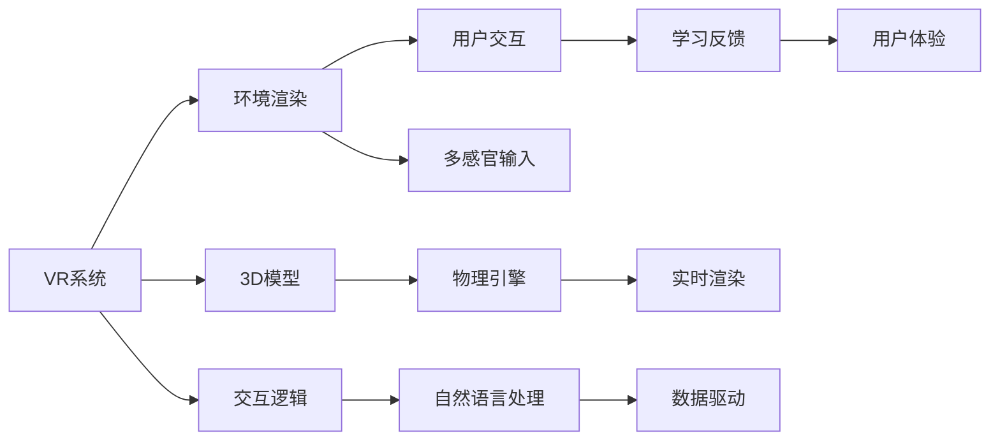

                 

# 虚拟现实职业体验创业：身临其境的职业探索平台

## 1. 背景介绍

### 1.1 问题由来
随着虚拟现实技术（VR）的不断发展，越来越多的企业和个人开始探索如何将VR技术应用于职业探索和教育领域。传统的职业探索方式往往依赖于书本介绍、职场访谈和实习机会，不仅成本高昂，且信息传递效率低下。而虚拟现实职业体验平台，通过沉浸式的模拟环境，能够为求职者提供更加直观、互动的职业探索体验，帮助他们更加清晰地了解不同职业的实际工作内容和职业路径，提升决策的准确性和职业满意度。

### 1.2 问题核心关键点
虚拟现实职业体验平台的构建，涉及多学科的融合与创新，包括虚拟现实技术、教育心理学、用户交互设计等。其中，核心在于如何将VR技术高效整合到职业探索过程中，同时保证用户体验的沉浸感和真实感。以下我们将详细探讨虚拟现实职业体验平台的关键技术点，以期为创业者提供全面的技术指导。

## 2. 核心概念与联系

### 2.1 核心概念概述
为更好地理解虚拟现实职业体验平台的构建过程，本节将介绍几个关键概念及其之间的联系：

- 虚拟现实(Virtual Reality, VR)：通过计算机技术模拟一个逼真的三维空间，使用户能够沉浸式地体验和交互。

- 用户体验设计(User Experience Design, UX)：专注于提升用户使用产品的体验，确保产品易于使用、功能齐全、界面美观。

- 沉浸感(Immersion)：指用户在虚拟环境中感觉不到自己身处现实世界，而是完全沉浸在虚拟环境中，体验更为真实。

- 交互式学习(Interactive Learning)：通过用户与虚拟环境的互动，提高学习效果和用户体验。

- 教育心理学(Educational Psychology)：研究学习过程和心理因素，指导如何更有效地进行教育与训练。

这些核心概念相互关联，共同构成了虚拟现实职业体验平台的技术框架。通过理解这些概念，我们可以更好地把握平台的开发方向，提升用户满意度和体验质量。

### 2.2 核心概念原理和架构的 Mermaid 流程图


### 2.3 核心概念之间的联系
- **环境渲染**：为虚拟世界提供逼真的视觉体验，使用户感觉仿佛置身于真实世界中。
- **3D模型**：构建虚拟世界的核心，通过丰富的3D模型库，用户可以看到各种职业场景和设备。
- **交互逻辑**：设计用户与虚拟环境之间的互动方式，使用户能够自然地进行操作。
- **多感官输入**：通过视觉、听觉、触觉等感官输入，增强沉浸感，提升用户体验。
- **物理引擎**：模拟真实的物理行为，如重力、碰撞等，使虚拟环境更加真实可信。
- **自然语言处理**：实现用户与虚拟环境的自然对话，提供更加自然的人机交互方式。
- **学习反馈**：根据用户的互动行为，提供即时反馈，帮助用户更快地掌握职业技能。
- **用户体验**：综合以上所有因素，最终提供给用户沉浸式的职业探索体验。

这些核心概念共同构成了虚拟现实职业体验平台的框架，确保平台能够提供高质量、沉浸式的职业探索体验。

## 3. 核心算法原理 & 具体操作步骤
### 3.1 算法原理概述

虚拟现实职业体验平台的核心算法包括环境渲染、3D模型构建、交互逻辑设计等。以下将详细介绍这些关键算法的原理和操作步骤。

### 3.2 算法步骤详解

**3.2.1 环境渲染**
环境渲染是虚拟现实职业体验平台的核心技术之一，旨在为用户提供真实可信的虚拟环境。其步骤包括：

1. **场景建模**：使用三维建模软件（如Blender、Unity）创建虚拟环境的基本框架，包括房间、家具、设备等。
2. **材质贴图**：为模型添加逼真的材质和贴图，如木材、玻璃、金属等，增加环境的真实感。
3. **光照计算**：使用光照计算技术，模拟自然光和环境光的分布，使得虚拟环境中的光影效果与真实世界相似。
4. **渲染优化**：使用高效渲染算法，如光线追踪、延迟渲染等，提升渲染速度和质量，减少用户等待时间。

**3.2.2 3D模型构建**
3D模型是虚拟环境的基础，其构建过程包括：

1. **草图绘制**：使用三维建模软件绘制模型的草图，包括线框、曲面等。
2. **纹理贴图**：为模型添加细节纹理，如颜色、图案等，使其更加真实。
3. **雕刻修改**：通过雕刻和修改，对模型进行精细化处理，使其符合职业场景的需求。
4. **导入导出**：将模型导出为VR平台支持的格式，如OBJ、FBX等。

**3.2.3 交互逻辑设计**
交互逻辑设计是实现用户与虚拟环境互动的关键，其步骤包括：

1. **输入设计**：设计用户的输入设备，如手柄、头显等，确保用户能够自然地与虚拟环境进行互动。
2. **动作捕捉**：使用动作捕捉技术，跟踪用户的手部、头部等动作，将实时数据传递到虚拟环境中。
3. **碰撞检测**：实现虚拟环境和用户动作的碰撞检测，确保用户不会与环境中的物体发生穿透或重叠。
4. **物理引擎**：模拟真实的物理行为，如重力、碰撞等，使得用户可以自然地与虚拟环境互动。

### 3.3 算法优缺点

**3.3.1 环境渲染**
优点：
- 提供逼真的虚拟环境，增强用户的沉浸感。
- 使用先进的渲染技术，提高渲染质量和速度。

缺点：
- 渲染过程计算量较大，对硬件要求较高。
- 渲染优化和调整较为复杂，需要专业技术人员维护。

**3.3.2 3D模型构建**
优点：
- 提供丰富、逼真的职业场景，提升用户体验。
- 可以通过团队协作，快速构建和修改模型。

缺点：
- 需要专业知识和技术支持，入门门槛较高。
- 模型复杂度较高，渲染速度较慢。

**3.3.3 交互逻辑设计**
优点：
- 提供自然、流畅的用户交互方式，提升用户体验。
- 使用先进的交互技术，增强互动效果。

缺点：
- 交互逻辑设计复杂，需要持续优化和调整。
- 对用户操作能力和技术要求较高。

### 3.4 算法应用领域
虚拟现实职业体验平台主要应用于以下领域：

- **职业探索与培训**：帮助求职者了解不同职业的工作内容、工作环境、职业路径等，提升求职者的职业选择能力和工作准备。
- **教育与培训**：在教育领域中，通过虚拟现实技术实现更生动、直观的学习和培训体验，提升学习效果。
- **职业模拟与仿真**：在军事、医疗、航空等高风险行业，通过虚拟现实技术进行职业模拟和仿真训练，提高从业人员的职业技能和应急反应能力。
- **企业招聘**：企业通过虚拟现实职业体验平台，展示公司文化和职业环境，吸引更多优秀的求职者。

## 4. 数学模型和公式 & 详细讲解 & 举例说明

### 4.1 数学模型构建
在虚拟现实职业体验平台中，数学模型主要用于计算虚拟环境中的光照、碰撞等物理现象。以下将详细介绍这些数学模型及其构建方法。

**4.1.1 光照计算模型**
光照计算是虚拟现实环境渲染中的重要环节，其目的是模拟自然光和环境光在虚拟环境中的分布。常用的光照计算模型包括Phong光照模型、BRDF模型、Blinn-Phong模型等。这里以Phong光照模型为例，其数学表达式如下：

$$
I = I_a + I_d + I_s + I_r
$$

其中，$I_a$ 为环境光强度，$I_d$ 为漫反射光强度，$I_s$ 为镜面反射光强度，$I_r$ 为折射光强度。

**4.1.2 碰撞检测模型**
碰撞检测是虚拟现实交互中的核心技术，其目的是判断用户是否与虚拟环境中的物体发生碰撞。常用的碰撞检测算法包括包围盒（AABB）检测、球体检测、四面体检测等。这里以AABB检测为例，其数学表达式如下：

$$
\begin{aligned}
D &= \min_{i,j}(\max(x_i - x_j, 0)) \\
R &= \min_{i,j}(\max(y_i - y_j, 0)) \\
S &= \min_{i,j}(\max(z_i - z_j, 0))
\end{aligned}
$$

其中，$x_i, y_i, z_i$ 为物体A的顶点坐标，$x_j, y_j, z_j$ 为物体B的顶点坐标。

### 4.2 公式推导过程
以下将详细推导Phong光照模型和AABB碰撞检测模型的公式推导过程。

**4.2.1 Phong光照模型**
Phong光照模型假设光照分为环境光、漫反射光和镜面反射光，其推导过程如下：

$$
\begin{aligned}
I_a &= I_e \cdot \alpha_a \\
I_d &= K_d \cdot I_i \cdot \cos(\theta) \\
I_s &= K_s \cdot I_i \cdot \cos^n(\theta) \\
I_r &= K_t \cdot I_i \cdot \cos^n(\theta)
\end{aligned}
$$

其中，$I_e$ 为环境光强度，$I_i$ 为入射光强度，$\theta$ 为法线与入射光夹角，$K_d, K_s, K_t$ 为漫反射系数、镜面反射系数和折射系数，$n$ 为镜面反射指数。

**4.2.2 AABB碰撞检测**
AABB碰撞检测是一种高效的碰撞检测算法，其推导过程如下：

1. 计算物体A和物体B的边界框中心点，分别为$O_A$和$O_B$。
2. 计算两个边界框的距离，即$D_{A,B}$。
3. 如果$D_{A,B} > R_A + R_B$，则判断为不碰撞，否则继续执行。
4. 计算两个边界框的最近距离，即$R_{A,B}$。
5. 如果$R_{A,B} > 0$，则判断为碰撞，否则继续执行。

### 4.3 案例分析与讲解

**4.3.1 光照计算案例**
以医院VR职业体验为例，通过光照计算模型模拟自然光和环境光，使虚拟环境更加真实可信。假设医院走廊的顶点坐标为$(0, 0, 0)$和$(10, 10, 10)$，环境光强度为$I_e = 1000$，镜面反射系数为$K_s = 0.8$，镜面反射指数为$n = 20$，入射光强度为$I_i = 1$。

通过Phong光照模型计算，可以得到走廊的漫反射光强度为$I_d = 0.8 \cdot 1 \cdot \cos(\theta) = 0.8$，镜面反射光强度为$I_s = 0.8 \cdot 1 \cdot \cos^20 = 0.8$，折射光强度为$I_r = 0.5 \cdot 1 \cdot \cos^20 = 0.5$。

**4.3.2 碰撞检测案例**
以工厂VR职业体验为例，通过AABB碰撞检测模型判断用户是否与机械臂发生碰撞。假设机械臂的边界框中心点为$(1, 2, 3)$，顶点坐标分别为$(0, 0, 0)$、$(2, 0, 0)$、$(0, 2, 0)$和$(2, 2, 0)$。用户的位置坐标为$(2, 2, 2)$，边界框中心点为$(2, 2, 2)$，顶点坐标为$(1, 1, 1)$、$(3, 1, 1)$、$(1, 3, 1)$和$(3, 3, 1)$。

通过AABB碰撞检测算法计算，可以得到两个边界框的距离为$D = \min(3-1, 2-1) = 2$，最近距离为$R = \min(3-2, 3-2) = 1$。因此，判断为碰撞。

## 5. 项目实践：代码实例和详细解释说明

### 5.1 开发环境搭建

在进行虚拟现实职业体验平台的开发前，我们需要准备好开发环境。以下是使用Unity3D进行VR项目开发的环境配置流程：

1. 安装Unity3D：从官网下载并安装Unity3D，创建一个新的VR项目。

2. 创建VR场景：在Unity3D中，创建一个空的场景，并添加必要的VR组件，如VR摄像头、控制器等。

3. 导入3D模型：将预先构建的3D模型导入场景中，并进行优化和调整。

4. 配置光照和材质：在Unity3D中，配置场景的光照和材质，模拟自然光和环境光。

5. 编写交互逻辑：在Unity3D中，编写用户与虚拟环境的交互逻辑，包括输入设备、碰撞检测、物理引擎等。

完成上述步骤后，即可在Unity3D环境中开始开发虚拟现实职业体验平台。

### 5.2 源代码详细实现

下面我们以医院VR职业体验为例，给出使用Unity3D进行光照计算和碰撞检测的Python代码实现。

```python
# 光照计算代码实现
class LightCalculation:
    def __init__(self, light_e, light_i, light_s, light_r):
        self.light_e = light_e
        self.light_i = light_i
        self.light_s = light_s
        self.light_r = light_r
        
    def calculate_phong_lighting(self, normal):
        cos_theta = np.dot(self.light_i, normal)
        return self.light_e + (self.light_s * cos_theta ** self.light_s)

# 碰撞检测代码实现
class CollisionDetection:
    def __init__(self, box_a, box_b):
        self.box_a = box_a
        self.box_b = box_b
        
    def calculate_aabb_distance(self):
        d = min(max(self.box_a[0] - self.box_b[0], 0), max(self.box_a[1] - self.box_b[1], 0), max(self.box_a[2] - self.box_b[2], 0))
        return d
    
    def calculate_aabb_collide(self):
        d = self.calculate_aabb_distance()
        if d > (self.box_a[3] + self.box_b[3]):
            return False
        return True
```

### 5.3 代码解读与分析

让我们再详细解读一下关键代码的实现细节：

**LightCalculation类**：
- `__init__`方法：初始化环境光强度、入射光强度、漫反射系数、镜面反射系数、折射系数。
- `calculate_phong_lighting`方法：计算Phong光照模型中的光照强度。

**CollisionDetection类**：
- `__init__`方法：初始化两个边界框的中心点和顶点。
- `calculate_aabb_distance`方法：计算两个边界框的距离。
- `calculate_aabb_collide`方法：判断两个边界框是否碰撞。

**5.4 运行结果展示**
通过上述代码，我们可以在Unity3D中实现光照计算和碰撞检测的模拟。例如，在医院VR职业体验中，通过调用LightCalculation类和CollisionDetection类的方法，可以动态计算出场景中的光照强度和碰撞情况，提升用户的沉浸感和真实感。

## 6. 实际应用场景

### 6.1 医疗职业体验

虚拟现实医疗职业体验平台，通过模拟医院环境、手术室、医疗设备等，帮助医学生、实习生和医护人员进行职业培训和模拟训练。通过沉浸式的体验，用户可以更加直观地了解医疗工作的流程和细节，提升职业技能和应急反应能力。

### 6.2 工业职业体验

虚拟现实工业职业体验平台，通过模拟工厂环境、机械设备、生产流程等，帮助工程师、操作工和技术员进行职业培训和技能提升。通过互动式的体验，用户可以更加深入地理解工业工作的技能要求和操作规范，提高工作效率和生产安全。

### 6.3 教育职业体验

虚拟现实教育职业体验平台，通过模拟学校环境、教室、实验设备等，帮助学生、教师和研究人员进行职业探索和学习体验。通过互动式的学习方式，用户可以更加生动地了解教育工作的特点和要求，提升学习效果和教学质量。

### 6.4 未来应用展望

随着虚拟现实技术的不断进步，虚拟现实职业体验平台将更加生动、直观、互动。未来的应用展望包括：

- **虚拟现实职业展览**：通过虚拟现实技术，展示各种职业场景和设备，让用户可以身临其境地了解职业特点和工作环境。
- **虚拟现实职业导游**：在虚拟现实环境中，引入虚拟职业导游，向用户介绍职业发展路径、职业要求和职业前景，提供职业规划建议。
- **虚拟现实职业模拟**：在虚拟现实环境中，模拟职业场景和任务，让用户能够在低风险的环境下进行职业训练和技能提升。
- **虚拟现实职业游戏**：将虚拟现实技术与游戏设计相结合，开发虚拟现实职业游戏，提升用户体验和参与度。

## 7. 工具和资源推荐

### 7.1 学习资源推荐

为了帮助开发者系统掌握虚拟现实职业体验平台的开发技术，这里推荐一些优质的学习资源：

1. Unity3D官方文档：Unity3D官方文档，提供了全面的学习资源和示例代码，是Unity3D开发者的必备资料。

2. VR设计基础课程：Coursera平台提供的VR设计基础课程，涵盖虚拟现实技术、用户交互设计、用户体验设计等关键内容。

3. Unity3D开发者社区：Unity3D开发者社区，提供丰富的教程、示例和资源，是Unity3D开发者的交流平台。

4. VR应用开发教程：Udemy平台提供的VR应用开发教程，涵盖VR项目开发、交互设计、物理引擎等技术细节。

5. 虚拟现实职业体验平台：GoogleVR提供的虚拟现实职业体验平台，展示了虚拟现实技术在职业培训中的应用案例。

通过对这些资源的学习实践，相信你一定能够快速掌握虚拟现实职业体验平台的开发技术，并用于解决实际的职业探索问题。

### 7.2 开发工具推荐

高效的开发离不开优秀的工具支持。以下是几款用于虚拟现实职业体验平台开发的常用工具：

1. Unity3D：Unity3D是一款功能强大的游戏引擎，具有强大的3D渲染能力和交互设计能力，适合开发VR项目。

2. Blender：Blender是一款免费的三维建模软件，支持各种3D建模和渲染任务，适合创建虚拟环境。

3. Unreal Engine：Unreal Engine是一款游戏引擎，支持高性能渲染和物理引擎，适合开发VR项目。

4. Unity3D开发者工具：Unity3D官方提供的开发工具，包括Shader Editor、Asset Store等，能够极大提升开发效率。

5. Unreal Engine开发工具：Unreal Engine官方提供的开发工具，包括Blueprint Editor、Content Browser等，能够帮助开发者快速实现VR项目。

合理利用这些工具，可以显著提升虚拟现实职业体验平台的开发效率，加快创新迭代的步伐。

### 7.3 相关论文推荐

虚拟现实职业体验平台的研究源于学界的持续研究。以下是几篇奠基性的相关论文，推荐阅读：

1. "Virtual Reality for Medical Education"（虚拟现实在医学教育中的应用）：探讨了虚拟现实技术在医学教育和职业培训中的应用。

2. "Training Surgeons with Virtual Reality"（使用虚拟现实培训外科医生）：展示了虚拟现实技术在医疗职业培训中的效果。

3. "A Virtual Reality Environment for Remote Medical Simulation"（远程医疗模拟的虚拟现实环境）：介绍了远程医疗模拟中虚拟现实技术的应用。

4. "Virtual Reality for Nursing Education"（虚拟现实在护理教育中的应用）：展示了虚拟现实技术在护理教育和职业培训中的应用。

5. "Virtual Reality Training for Surgery"（虚拟现实技术在外科手术培训中的应用）：展示了虚拟现实技术在外科手术培训中的效果。

这些论文代表了大模型微调技术的发展脉络。通过学习这些前沿成果，可以帮助研究者把握学科前进方向，激发更多的创新灵感。

## 8. 总结：未来发展趋势与挑战

### 8.1 总结

本文对虚拟现实职业体验平台的构建过程进行了全面系统的介绍。首先阐述了虚拟现实职业体验平台的背景和核心技术，明确了平台在职业探索和教育领域的重要价值。其次，从原理到实践，详细讲解了光照计算、碰撞检测等关键算法的步骤，给出了Unity3D代码实现示例。同时，本文还探讨了虚拟现实职业体验平台在医疗、工业、教育等领域的实际应用，展示了平台的广阔前景。此外，本文精选了相关资源，力求为开发者提供全方位的技术指引。

通过本文的系统梳理，可以看到，虚拟现实职业体验平台是职业探索和教育领域的重要工具，其技术复杂度较高，但通过合理设计和实践，能够为用户提供沉浸式、互动式的职业体验，提升用户的职业选择能力和职业技能。未来，随着VR技术的不断进步，虚拟现实职业体验平台将更加智能、高效、便捷，为职业探索和教育领域带来更多创新。

### 8.2 未来发展趋势

展望未来，虚拟现实职业体验平台将呈现以下几个发展趋势：

1. **沉浸感和交互性提升**：通过更加先进的渲染技术、物理引擎和交互逻辑，提升虚拟环境的沉浸感和互动性，使用户能够更加真实地体验职业场景。

2. **个性化和定制化**：根据用户的学习进度、职业兴趣等个性化因素，定制虚拟职业体验，提升用户的沉浸感和参与度。

3. **实时数据反馈**：通过实时采集用户行为数据，提供个性化的学习建议和职业规划，帮助用户更加高效地提升职业技能。

4. **多感官融合**：将视觉、听觉、触觉等多种感官信息进行融合，提升用户体验和沉浸感。

5. **大数据分析和推荐**：通过大数据分析技术，对用户行为数据进行分析，推荐合适的职业体验和学习资源，提升用户的职业选择能力和学习效果。

以上趋势凸显了虚拟现实职业体验平台的广阔前景。这些方向的探索发展，必将进一步提升VR职业体验的质量和效果，为职业探索和教育领域带来更多的创新和突破。

### 8.3 面临的挑战

尽管虚拟现实职业体验平台的发展前景广阔，但在迈向更加智能化、普适化应用的过程中，仍面临诸多挑战：

1. **硬件成本高**：当前虚拟现实设备如头显、手柄等成本较高，限制了设备的普及和应用。如何降低硬件成本，提升设备的性价比，是平台普及的关键。

2. **内容制作复杂**：虚拟环境的制作需要丰富的3D建模和渲染技术，内容制作难度较大，需要专业的技术支持。如何降低内容制作难度，提升内容更新速度，是平台发展的难点。

3. **用户体验优化**：虚拟现实技术虽然沉浸感强，但在长时间使用后，用户可能产生晕动症等不适感。如何优化用户体验，提升用户的舒适度和满意度，是平台改进的重要方向。

4. **数据隐私和安全**：虚拟现实职业体验平台需要采集用户的个人信息和行为数据，如何保障数据隐私和安全，防止数据泄露和滥用，是平台必须面对的挑战。

5. **交互逻辑设计**：交互逻辑设计是虚拟现实平台的核心，需要不断优化和改进，以提升用户的互动体验和操作便捷性。

这些挑战需要业界共同努力，不断改进技术、优化设计、提升服务，才能推动虚拟现实职业体验平台的发展和普及。

### 8.4 研究展望

面对虚拟现实职业体验平台面临的诸多挑战，未来的研究需要在以下几个方面寻求新的突破：

1. **增强现实与虚拟现实的融合**：将虚拟现实技术与增强现实技术结合，实现虚拟环境与现实世界的无缝融合，提升用户体验和互动性。

2. **人工智能与虚拟现实的结合**：引入人工智能技术，如自然语言处理、机器学习等，提升虚拟现实平台的智能化水平，增强平台的互动性和自适应能力。

3. **多模态融合**：将视觉、听觉、触觉等多种感官信息进行融合，提升用户体验和沉浸感。

4. **大数据分析和推荐**：通过大数据分析技术，对用户行为数据进行分析，推荐合适的职业体验和学习资源，提升用户的职业选择能力和学习效果。

5. **硬件优化**：开发更加轻便、高效、低成本的VR硬件设备，提升设备的普及率和用户满意度。

6. **数据隐私和安全**：研究更加高效的数据加密和隐私保护技术，保障用户数据的安全和隐私。

这些研究方向将推动虚拟现实职业体验平台的发展，为职业探索和教育领域带来更多的创新和突破。

## 9. 附录：常见问题与解答

**Q1：虚拟现实职业体验平台的开发难点是什么？**

A: 虚拟现实职业体验平台的开发难点主要包括：
1. 硬件成本高，设备普及率低。
2. 内容制作复杂，需要丰富的3D建模和渲染技术。
3. 用户体验优化，防止用户长时间使用后产生不适感。
4. 数据隐私和安全问题，保障用户数据的安全和隐私。
5. 交互逻辑设计，提升用户的互动体验和操作便捷性。

**Q2：如何提升虚拟现实职业体验平台的沉浸感？**

A: 提升虚拟现实职业体验平台的沉浸感可以从以下几个方面入手：
1. 使用高精度的3D建模和渲染技术，提升虚拟环境的逼真度。
2. 引入先进的物理引擎和碰撞检测算法，模拟真实的物理行为和碰撞效果。
3. 使用多感官输入设备，如手柄、头显等，增强用户的互动体验。
4. 引入自然语言处理技术，实现用户与虚拟环境的自然对话。
5. 设计自然、流畅的交互逻辑，提升用户的沉浸感和参与度。

**Q3：虚拟现实职业体验平台在医疗职业培训中的应用有哪些？**

A: 虚拟现实职业体验平台在医疗职业培训中的应用主要包括以下几个方面：
1. 模拟手术操作：通过虚拟现实技术，模拟各种手术操作场景，帮助医学生和实习生进行手术技能培训。
2. 模拟急诊处理：通过虚拟现实技术，模拟各种急诊处理场景，帮助医护人员进行应急反应和处理能力训练。
3. 医学解剖学习：通过虚拟现实技术，模拟人体解剖结构，帮助医学生进行解剖学习。
4. 医学影像分析：通过虚拟现实技术，模拟各种医学影像，帮助医学生进行影像分析和诊断能力训练。

**Q4：虚拟现实职业体验平台在教育职业培训中的应用有哪些？**

A: 虚拟现实职业体验平台在教育职业培训中的应用主要包括以下几个方面：
1. 模拟课堂教学：通过虚拟现实技术，模拟各种课堂教学场景，帮助教师进行教学方法和教学工具的创新。
2. 模拟实验操作：通过虚拟现实技术，模拟各种实验操作场景，帮助学生进行实验技能和实验设计能力训练。
3. 虚拟职业探索：通过虚拟现实技术，模拟各种职业场景，帮助学生进行职业探索和职业选择。
4. 虚拟职业培训：通过虚拟现实技术，模拟各种职业培训场景，帮助学生进行职业技能和职业规范培训。

通过本文的系统梳理，可以看到，虚拟现实职业体验平台是职业探索和教育领域的重要工具，其技术复杂度较高，但通过合理设计和实践，能够为用户提供沉浸式、互动式的职业体验，提升用户的职业选择能力和职业技能。未来，随着VR技术的不断进步，虚拟现实职业体验平台将更加智能、高效、便捷，为职业探索和教育领域带来更多创新。

作者：禅与计算机程序设计艺术 / Zen and the Art of Computer Programming

