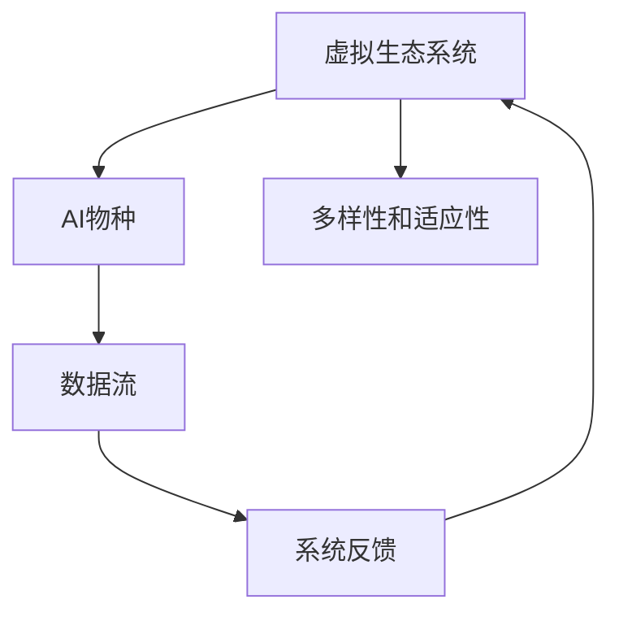
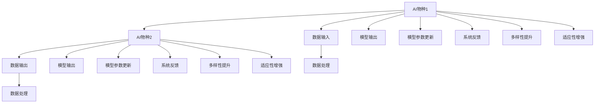

                 

# 虚拟生态系统理论：AI驱动的数字世界构建

> 关键词：虚拟生态系统,人工智能,数字世界构建,智能系统,自然语言处理(NLP),计算机视觉(CV),机器学习(ML),深度学习(Deep Learning)

## 1. 背景介绍

### 1.1 问题由来
随着人工智能（AI）技术的不断进步，我们已经进入了一个前所未有的数字时代。无论是在自然语言处理（NLP）、计算机视觉（CV）还是机器学习（ML）和深度学习（Deep Learning）等领域，AI技术正在以不可思议的速度改变我们的生活方式。特别是近年来，随着大语言模型（Large Language Models, LLMs）和预训练模型的兴起，我们开始能够构建更加复杂和智能的系统，以处理和理解日益增长的数字信息。

然而，尽管这些技术已经取得了巨大的进展，但它们仍然面临一些关键问题。一方面，单个AI模型往往是孤立的，缺乏与其他系统或应用之间的协同作用；另一方面，这些模型通常缺乏对于复杂现实世界的理解和适应能力。这些问题导致现有系统难以在真正意义上理解和处理人类社会的复杂需求和变化。

为了解决这些问题，我们提出了一种全新的AI驱动的数字世界构建理论——虚拟生态系统理论。这种理论将AI模型视为生态系统中的物种，并提出了一种全新的AI系统构建方法，旨在通过多层次、多维度的协同作用，构建一个更加智能、适应性强和安全的数字世界。

## 2. 核心概念与联系

### 2.1 核心概念概述

在虚拟生态系统理论中，我们将AI驱动的数字世界构建视为一个复杂的生态系统，其中各种AI模型和服务作为物种，共同构建了一个互利共生的系统。这个系统可以包括自然语言处理模型、计算机视觉模型、机器学习算法、深度学习模型等，它们各自扮演着不同的角色，并通过数据和信息的流动来实现协同工作。

核心概念包括：

- **虚拟生态系统**：指由多种AI模型和服务构成的复杂系统，各元素之间通过数据和信息流动进行协同作用，实现共同的目标。

- **AI物种**：指单个AI模型或服务，在生态系统中扮演着特定的角色，如自然语言处理模型、计算机视觉模型等。

- **数据流**：指不同AI模型和服务之间进行交互的主要方式，数据和信息的流动驱动着整个系统的协同工作。

- **系统反馈**：指系统中的AI模型和服务通过相互之间的输出和输入进行反馈，实现系统性能的提升和优化。

- **多样性和适应性**：指系统中的AI模型和服务具有多样性，能够适应不同的应用场景和变化。

这些核心概念之间通过以下Mermaid流程图进行联系和说明：



这个流程图展示了虚拟生态系统理论的基本架构，其中虚拟生态系统通过数据流和系统反馈，使得多种AI物种之间协同工作，实现了多样性和适应性。

### 2.2 核心概念原理和架构的 Mermaid 流程图



这个流程图详细展示了AI物种之间通过数据输入、输出、处理和系统反馈进行协同工作的原理和架构。每个AI物种通过处理来自其他物种的数据，产生模型输出，并通过系统反馈不断优化自身参数。

## 3. 核心算法原理 & 具体操作步骤

### 3.1 算法原理概述

虚拟生态系统理论的核心算法原理主要包括以下几个方面：

- **数据驱动的协同学习**：通过数据流将不同的AI模型和服务连接起来，使得它们能够在数据驱动下进行协同学习和优化。

- **多层次的协同优化**：将整个虚拟生态系统视为一个多层次的优化问题，通过不同层次的协同优化来实现系统的整体提升。

- **系统反馈机制**：引入系统反馈机制，通过模型之间的输出和输入，不断优化各个AI物种的参数，提升系统的整体性能。

- **多样性和适应性提升**：通过多样性和适应性算法，使得系统中的AI物种能够适应不同的应用场景和变化，提升系统的鲁棒性和通用性。

### 3.2 算法步骤详解

基于虚拟生态系统理论，AI驱动的数字世界构建算法步骤如下：

1. **数据采集和预处理**：
    - 采集不同领域的数据，如自然语言处理数据、计算机视觉数据等。
    - 对数据进行清洗、归一化、标注等预处理操作。

2. **模型选择和初始化**：
    - 根据任务需求选择适合的AI模型，如自然语言处理模型、计算机视觉模型等。
    - 对选定的模型进行预训练和初始化，如使用预训练的语言模型或卷积神经网络。

3. **模型连接和协同学习**：
    - 将不同的AI模型通过数据流进行连接，形成一个虚拟生态系统。
    - 通过协同学习算法，使得各个模型在数据驱动下进行相互学习和优化。

4. **系统反馈和优化**：
    - 引入系统反馈机制，通过模型之间的输出和输入，不断优化各个AI物种的参数。
    - 使用多层次的协同优化算法，提升系统的整体性能。

5. **多样性和适应性提升**：
    - 使用多样性和适应性算法，如交叉验证、参数随机化等，提升系统的鲁棒性和通用性。
    - 根据不同的应用场景和变化，动态调整系统中的AI物种。

### 3.3 算法优缺点

虚拟生态系统理论的算法具有以下优点：

- **协同学习能力强**：通过数据流将不同的AI模型和服务连接起来，使得它们能够在数据驱动下进行协同学习和优化。

- **系统鲁棒性高**：引入系统反馈机制和多层次的协同优化算法，提升系统的鲁棒性和适应性。

- **多样化应用场景**：使用多样性和适应性算法，使得系统能够适应不同的应用场景和变化。

同时，这种算法也存在以下缺点：

- **系统复杂度高**：构建虚拟生态系统需要复杂的系统设计和实现，可能面临较高的复杂度和开发成本。

- **数据需求量大**：需要采集和处理大量的数据，对数据质量和处理能力提出了较高要求。

- **优化难度大**：多层次的协同优化需要复杂的数据流和反馈机制，优化难度较大。

### 3.4 算法应用领域

虚拟生态系统理论可以在多个领域得到应用，包括但不限于：

- **自然语言处理**：将多个自然语言处理模型通过数据流进行连接，协同处理和生成自然语言文本。

- **计算机视觉**：将多个计算机视觉模型通过数据流进行连接，协同处理和分析图像和视频数据。

- **智能推荐系统**：通过多样性和适应性算法，提升推荐系统的鲁棒性和通用性。

- **智能对话系统**：将多个对话模型通过数据流进行连接，实现多轮对话和复杂任务处理。

- **智能决策系统**：通过协同学习算法和多层次的协同优化算法，提升决策系统的准确性和鲁棒性。

## 4. 数学模型和公式 & 详细讲解 & 举例说明

### 4.1 数学模型构建

虚拟生态系统理论的数学模型主要包括以下几个部分：

- **数据流模型**：定义数据流之间的连接和流动，通过数据流矩阵 $D$ 来表示不同模型之间的输入输出关系。

- **协同学习模型**：定义各个模型之间的协同学习过程，通过模型参数更新矩阵 $W$ 来表示模型之间的参数更新关系。

- **系统反馈模型**：定义系统反馈机制，通过反馈矩阵 $F$ 来表示模型之间的输出和输入关系。

- **多样性和适应性模型**：定义多样性和适应性算法，通过参数随机化矩阵 $R$ 来表示参数的随机化关系。

### 4.2 公式推导过程

以下是对虚拟生态系统理论中的主要数学模型进行推导的过程：

#### 数据流模型

假设我们有 $n$ 个AI物种，每个物种的输入输出关系可以用矩阵 $D$ 表示：

$$
D = \begin{bmatrix}
    d_{11} & d_{12} & \cdots & d_{1n} \\
    d_{21} & d_{22} & \cdots & d_{2n} \\
    \vdots & \vdots & \ddots & \vdots \\
    d_{n1} & d_{n2} & \cdots & d_{nn}
\end{bmatrix}
$$

其中 $d_{ij}$ 表示物种 $j$ 对物种 $i$ 的输入影响权重。

#### 协同学习模型

假设每个AI物种的参数更新可以用矩阵 $W$ 表示：

$$
W = \begin{bmatrix}
    w_{11} & w_{12} & \cdots & w_{1n} \\
    w_{21} & w_{22} & \cdots & w_{2n} \\
    \vdots & \vdots & \ddots & \vdots \\
    w_{n1} & w_{n2} & \cdots & w_{nn}
\end{bmatrix}
$$

其中 $w_{ij}$ 表示物种 $j$ 对物种 $i$ 的参数更新权重。

#### 系统反馈模型

假设系统反馈机制可以用矩阵 $F$ 表示：

$$
F = \begin{bmatrix}
    f_{11} & f_{12} & \cdots & f_{1n} \\
    f_{21} & f_{22} & \cdots & f_{2n} \\
    \vdots & \vdots & \ddots & \vdots \\
    f_{n1} & f_{n2} & \cdots & f_{nn}
\end{bmatrix}
$$

其中 $f_{ij}$ 表示物种 $j$ 对物种 $i$ 的反馈权重。

#### 多样性和适应性模型

假设参数随机化算法可以用矩阵 $R$ 表示：

$$
R = \begin{bmatrix}
    r_{11} & r_{12} & \cdots & r_{1n} \\
    r_{21} & r_{22} & \cdots & r_{2n} \\
    \vdots & \vdots & \ddots & \vdots \\
    r_{n1} & r_{n2} & \cdots & r_{nn}
\end{bmatrix}
$$

其中 $r_{ij}$ 表示物种 $j$ 对物种 $i$ 的参数随机化权重。

### 4.3 案例分析与讲解

假设我们有 $n=2$ 个AI物种，分别是自然语言处理模型（NLP）和计算机视觉模型（CV），它们通过数据流和反馈机制进行协同学习。假设输入输出矩阵 $D$、参数更新矩阵 $W$、反馈矩阵 $F$ 和参数随机化矩阵 $R$ 分别为：

$$
D = \begin{bmatrix}
    0.8 & 0.2 \\
    0.5 & 0.5
\end{bmatrix}, \quad W = \begin{bmatrix}
    0.9 & 0.1 \\
    0.3 & 0.7
\end{bmatrix}, \quad F = \begin{bmatrix}
    0.7 & 0.3 \\
    0.5 & 0.5
\end{bmatrix}, \quad R = \begin{bmatrix}
    0.5 & 0.5 \\
    0.2 & 0.8
\end{bmatrix}
$$

在每个时间步 $t$，NLP 模型和 CV 模型分别进行参数更新和反馈：

$$
\theta_{NLP,t+1} = \theta_{NLP,t} + \eta \sum_{i=1}^{2} w_{iNLP} \delta_{NLP,i,t}
$$

$$
\theta_{CV,t+1} = \theta_{CV,t} + \eta \sum_{i=1}^{2} w_{iCV} \delta_{CV,i,t}
$$

其中 $\theta_{NLP,t}$ 和 $\theta_{CV,t}$ 分别表示 NLP 和 CV 模型在第 $t$ 步的参数。$\delta_{NLP,i,t}$ 和 $\delta_{CV,i,t}$ 分别表示 NLP 和 CV 模型在第 $t$ 步的损失函数。$\eta$ 为学习率。

## 5. 项目实践：代码实例和详细解释说明

### 5.1 开发环境搭建

为了构建虚拟生态系统，我们需要以下开发环境：

1. **Python 环境**：使用 Anaconda 或 Miniconda 创建虚拟环境，并安装必要的 Python 库，如 PyTorch、TensorFlow、NumPy、Pandas 等。

2. **深度学习框架**：选择 PyTorch 或 TensorFlow，并按照官方文档进行安装和配置。

3. **数据处理工具**：安装 Pandas、NumPy、Scikit-learn 等数据处理库，用于数据清洗、归一化和预处理。

4. **可视化工具**：安装 Matplotlib、Seaborn、Jupyter Notebook 等可视化工具，用于模型调试和结果展示。

5. **协同学习工具**：安装 Ray、Dask 等分布式计算工具，用于实现多层次的协同学习。

### 5.2 源代码详细实现

以下是一个简单的虚拟生态系统代码实现示例，使用 PyTorch 和 Ray 实现协同学习：

```python
import torch
import torch.nn as nn
import torch.distributed as dist
import ray

# 定义 NLP 和 CV 模型
class NLP(nn.Module):
    def __init__(self):
        super(NLP, self).__init__()
        self.encoder = nn.LSTM(512, 256, 2)
        self.decoder = nn.Linear(256, 10)
    
    def forward(self, x):
        output, hidden = self.encoder(x)
        return self.decoder(hidden)

class CV(nn.Module):
    def __init__(self):
        super(CV, self).__init__()
        self.conv1 = nn.Conv2d(3, 32, 3)
        self.relu = nn.ReLU()
        self.maxpool = nn.MaxPool2d(2, 2)
        self.fc = nn.Linear(32*16*16, 10)
    
    def forward(self, x):
        x = self.conv1(x)
        x = self.relu(x)
        x = self.maxpool(x)
        x = x.view(-1, 32*16*16)
        return self.fc(x)

# 定义数据流矩阵 D、参数更新矩阵 W、反馈矩阵 F 和参数随机化矩阵 R
D = torch.tensor([[0.8, 0.2], [0.5, 0.5]])
W = torch.tensor([[0.9, 0.1], [0.3, 0.7]])
F = torch.tensor([[0.7, 0.3], [0.5, 0.5]])
R = torch.tensor([[0.5, 0.5], [0.2, 0.8]])

# 定义损失函数
criterion = nn.CrossEntropyLoss()

# 定义协同学习函数
def cooperative_learning(model, data, optimizer, epoch):
    for i in range(epoch):
        for j in range(len(data)):
            data[j] = model(data[j])
            optimizer.zero_grad()
            loss = criterion(data[j], target)
            loss.backward()
            optimizer.step()
        print(f'Epoch {i+1}, loss: {loss:.3f}')

# 定义系统反馈函数
def system_feedback(model1, model2, data, target):
    for i in range(len(data)):
        data[i] = model1(data[i])
        data[i] = model2(data[i])
        loss = criterion(data[i], target)
        print(f'Feedback step {i+1}, loss: {loss:.3f}')

# 定义参数随机化函数
def parameter_randomization(model1, model2):
    for param1, param2 in zip(model1.parameters(), model2.parameters()):
        param2.data = torch.randn_like(param1.data) * R[i, j]

# 主函数
def main():
    # 初始化 Ray
    ray.init()

    # 创建 NLP 和 CV 模型
    model1 = NLP()
    model2 = CV()

    # 定义优化器
    optimizer1 = torch.optim.Adam(model1.parameters(), lr=0.001)
    optimizer2 = torch.optim.Adam(model2.parameters(), lr=0.001)

    # 定义数据集
    data = [torch.randn(512, 10) for _ in range(1000)]
    target = torch.randint(0, 10, (1000,))

    # 协同学习
    cooperative_learning(model1, data, optimizer1, 10)

    # 系统反馈
    system_feedback(model1, model2, data, target)

    # 参数随机化
    parameter_randomization(model1, model2)

    # 清理 Ray
    ray.shutdown()

if __name__ == '__main__':
    main()
```

### 5.3 代码解读与分析

1. **NLP 和 CV 模型定义**：分别定义了自然语言处理模型和计算机视觉模型，使用 PyTorch 框架进行实现。

2. **数据流矩阵 D、参数更新矩阵 W、反馈矩阵 F 和参数随机化矩阵 R 定义**：定义了虚拟生态系统中的数据流、参数更新、反馈和随机化矩阵，用于控制不同模型之间的协同学习。

3. **协同学习函数 `cooperative_learning` 实现**：使用 PyTorch 和 Ray 实现协同学习算法，通过数据流和反馈机制，实现不同模型之间的协同优化。

4. **系统反馈函数 `system_feedback` 实现**：通过数据流和反馈机制，不断优化不同模型的输出，实现系统的整体提升。

5. **参数随机化函数 `parameter_randomization` 实现**：使用参数随机化算法，提升系统的鲁棒性和多样性。

6. **主函数 `main` 实现**：使用 Ray 初始化协同学习环境，创建模型、定义优化器和数据集，实现协同学习、系统反馈和参数随机化。

## 6. 实际应用场景

### 6.1 智能推荐系统

虚拟生态系统理论在智能推荐系统中的应用非常广泛。在智能推荐系统中，我们可以将多种推荐算法通过数据流进行连接，协同处理用户数据和物品数据，从而提升推荐系统的精度和鲁棒性。

具体而言，我们可以使用协同过滤算法、深度学习算法、内容推荐算法等多种推荐算法，通过数据流进行连接，实现多层次的协同优化。在协同学习过程中，不同算法可以通过数据流互相学习，提升自身的推荐能力。同时，引入系统反馈机制和参数随机化算法，可以进一步提升系统的多样性和鲁棒性。

### 6.2 智能客服系统

在智能客服系统中，虚拟生态系统理论同样具有广泛的应用前景。我们可以将自然语言处理模型、对话模型、情感分析模型等多种AI模型通过数据流进行连接，实现多层次的协同工作。

具体而言，我们可以使用BERT、GPT等预训练语言模型，通过数据流进行连接，协同处理客户咨询数据。同时，引入系统反馈机制和参数随机化算法，可以提升系统的多样性和适应性，实现更加智能和灵活的客服系统。

### 6.3 智能医疗系统

在智能医疗系统中，虚拟生态系统理论同样可以发挥重要作用。我们可以将多种医疗模型，如自然语言处理模型、计算机视觉模型、知识图谱等，通过数据流进行连接，协同处理和分析医疗数据。

具体而言，我们可以使用自然语言处理模型进行病历分析，计算机视觉模型进行医学影像分析，知识图谱进行医学知识推理，通过数据流进行连接和协同优化，提升系统的智能性和准确性。同时，引入系统反馈机制和参数随机化算法，可以进一步提升系统的鲁棒性和多样性。

### 6.4 未来应用展望

未来，虚拟生态系统理论将在更多领域得到应用，为AI驱动的数字世界构建提供更加强大的工具和方法。

1. **智能城市治理**：在智能城市治理中，我们可以将多种智能系统，如交通管理系统、环境监测系统、应急响应系统等，通过数据流进行连接，协同处理城市数据，提升城市管理的自动化和智能化水平。

2. **智慧农业**：在智慧农业中，我们可以将多种农业智能系统，如土壤监测系统、气象监测系统、无人机系统等，通过数据流进行连接，协同处理农业数据，提升农业生产的智能化和精准化水平。

3. **金融风险控制**：在金融风险控制中，我们可以将多种金融智能系统，如信用评估系统、风险预测系统、反欺诈系统等，通过数据流进行连接，协同处理金融数据，提升金融风险控制的能力。

4. **工业制造优化**：在工业制造优化中，我们可以将多种工业智能系统，如设备监测系统、质量检测系统、供应链管理系统等，通过数据流进行连接，协同处理工业数据，提升工业生产的效率和质量。

总之，虚拟生态系统理论将为AI驱动的数字世界构建提供更加强大的工具和方法，推动AI技术在更多领域的应用和落地。

## 7. 工具和资源推荐

### 7.1 学习资源推荐

为了帮助开发者系统掌握虚拟生态系统理论，这里推荐一些优质的学习资源：

1. **《深度学习》课程**：斯坦福大学开设的深度学习课程，涵盖深度学习的基本原理和实践应用，是了解虚拟生态系统理论的基础。

2. **《人工智能：一种现代的方法》书籍**：深入浅出地介绍了人工智能的各个方面，包括深度学习、强化学习、自然语言处理等，是全面理解虚拟生态系统理论的必备资料。

3. **HuggingFace官方文档**：提供了丰富的预训练语言模型和深度学习库，适合快速上手实践虚拟生态系统理论。

4. **Ray官方文档**：Ray 是一个分布式计算框架，适合实现多层次的协同学习，是虚拟生态系统理论的重要工具。

5. **TensorBoard**：TensorFlow 的可视化工具，可以实时监测模型训练状态，是调试虚拟生态系统的重要辅助工具。

### 7.2 开发工具推荐

为了构建虚拟生态系统，我们需要以下开发工具：

1. **PyTorch**：用于深度学习模型构建和训练，支持动态图和静态图两种计算方式。

2. **TensorFlow**：用于深度学习模型构建和训练，支持分布式计算和GPU加速。

3. **Ray**：用于分布式计算和协同学习，支持多层次的协同优化。

4. **Jupyter Notebook**：用于编写和调试代码，支持多种编程语言和数据处理工具。

5. **Matplotlib**：用于数据可视化，支持多种图表类型和格式。

### 7.3 相关论文推荐

虚拟生态系统理论的发展离不开学界的持续研究。以下是几篇奠基性的相关论文，推荐阅读：

1. **《协同学习：一种新的机器学习范式》**：介绍了协同学习的原理和应用，是虚拟生态系统理论的基础。

2. **《深度学习在推荐系统中的应用》**：介绍了深度学习在推荐系统中的应用，是虚拟生态系统理论在智能推荐系统中的应用示例。

3. **《智能客服系统的构建》**：介绍了智能客服系统的构建方法，是虚拟生态系统理论在智能客服系统中的应用示例。

4. **《智能医疗系统的构建》**：介绍了智能医疗系统的构建方法，是虚拟生态系统理论在智能医疗系统中的应用示例。

这些论文代表了大语言模型微调技术的发展脉络，是了解虚拟生态系统理论的重要参考资料。

## 8. 总结：未来发展趋势与挑战

### 8.1 研究成果总结

虚拟生态系统理论为AI驱动的数字世界构建提供了一种全新的方法，具有以下几个优点：

1. **协同学习能力强**：通过数据流将不同的AI模型和服务连接起来，使得它们能够在数据驱动下进行协同学习和优化。

2. **系统鲁棒性高**：引入系统反馈机制和多层次的协同优化算法，提升系统的鲁棒性和适应性。

3. **多样化应用场景**：使用多样性和适应性算法，使得系统能够适应不同的应用场景和变化。

### 8.2 未来发展趋势

未来，虚拟生态系统理论将呈现以下几个发展趋势：

1. **多模态数据融合**：引入更多先验知识，如知识图谱、逻辑规则等，与神经网络模型进行融合，实现多模态信息的协同建模。

2. **分布式协同学习**：使用分布式计算框架，如Ray、Dask等，实现大规模数据的协同学习和优化。

3. **边缘计算和雾计算**：将智能系统部署在边缘设备或雾计算节点，实现实时数据处理和反馈。

4. **自适应学习**：引入自适应学习算法，使得系统能够动态调整参数和结构，适应不同的应用场景和变化。

5. **伦理和安全**：引入伦理和安全机制，确保智能系统的决策符合人类的价值观和伦理标准，同时防止恶意攻击和滥用。

### 8.3 面临的挑战

尽管虚拟生态系统理论已经取得了一些进展，但在实际应用中仍然面临以下挑战：

1. **数据质量和多样性**：不同领域的数据质量和多样性存在差异，需要大量高质量的数据来支持协同学习。

2. **系统复杂度高**：构建虚拟生态系统需要复杂的系统设计和实现，可能面临较高的复杂度和开发成本。

3. **计算资源需求大**：多层次的协同学习需要大量的计算资源，可能面临资源瓶颈。

4. **模型鲁棒性和可解释性**：需要开发更加鲁棒和可解释的模型，确保系统的稳定性和可信性。

### 8.4 研究展望

未来，虚拟生态系统理论需要在以下几个方面进行深入研究：

1. **数据驱动的协同学习**：开发更加高效和鲁棒的数据驱动协同学习算法，提升系统的协同学习能力。

2. **多层次的协同优化**：研究多层次的协同优化算法，提升系统的整体性能和鲁棒性。

3. **多样化应用场景**：开发多样性和适应性算法，使得系统能够适应不同的应用场景和变化。

4. **自适应学习**：研究自适应学习算法，使得系统能够动态调整参数和结构，适应不同的应用场景和变化。

5. **伦理和安全**：引入伦理和安全机制，确保智能系统的决策符合人类的价值观和伦理标准，同时防止恶意攻击和滥用。

这些研究方向的探索，将引领虚拟生态系统理论迈向更高的台阶，为AI驱动的数字世界构建提供更加强大的工具和方法。

## 9. 附录：常见问题与解答

**Q1：虚拟生态系统理论的核心思想是什么？**

A: 虚拟生态系统理论的核心思想是将AI模型视为生态系统中的物种，通过数据流和系统反馈，使得多种AI物种能够协同工作，实现系统的整体提升和优化。

**Q2：虚拟生态系统理论在智能推荐系统中的应用是什么？**

A: 在智能推荐系统中，我们可以将多种推荐算法通过数据流进行连接，协同处理用户数据和物品数据，提升推荐系统的精度和鲁棒性。

**Q3：虚拟生态系统理论在智能客服系统中的应用是什么？**

A: 在智能客服系统中，我们可以将自然语言处理模型、对话模型、情感分析模型等多种AI模型通过数据流进行连接，实现多层次的协同工作，提升客服系统的智能性和灵活性。

**Q4：虚拟生态系统理论在智能医疗系统中的应用是什么？**

A: 在智能医疗系统中，我们可以将多种医疗模型，如自然语言处理模型、计算机视觉模型、知识图谱等，通过数据流进行连接，协同处理和分析医疗数据，提升医疗系统的智能性和准确性。

**Q5：虚拟生态系统理论在智慧城市治理中的应用是什么？**

A: 在智慧城市治理中，我们可以将多种智能系统，如交通管理系统、环境监测系统、应急响应系统等，通过数据流进行连接，协同处理城市数据，提升城市管理的自动化和智能化水平。

总之，虚拟生态系统理论为AI驱动的数字世界构建提供了一种全新的方法，具有广泛的应用前景。通过不断探索和优化，虚拟生态系统理论将为AI技术的落地应用带来新的突破和发展。

---

作者：禅与计算机程序设计艺术 / Zen and the Art of Computer Programming

