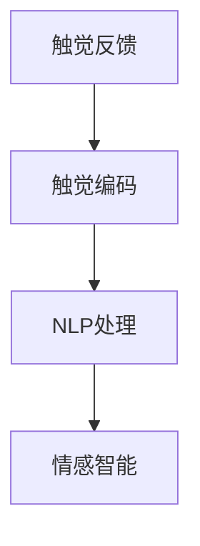
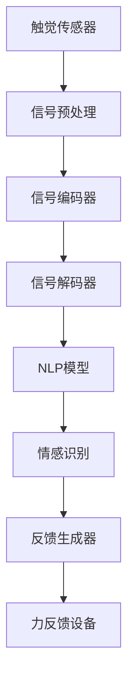

                 

# 虚拟触觉语言：AI创造的新型沟通方式

> 关键词：虚拟触觉语言, 人工智能, 自然语言处理(NLP), 情感智能, 交互界面, 应用场景, 未来展望

## 1. 背景介绍

### 1.1 问题由来

在数字时代，人们日益依赖于文本、图像、视频等非物理形式的交流方式。然而，这种方式在传达情感、提供即时反馈、增强互动体验等方面存在局限性。例如，文字表达受限于语言的逻辑结构，难以全面传递复杂的情感状态，图片和视频虽能提供视觉信息，但缺乏即时性。

为了弥补这些不足，虚拟触觉语言（Virtual Haptic Language）应运而生。虚拟触觉语言利用人工智能和触觉感知技术，通过模拟物理触觉信号，增强用户对信息的感知和理解，提升交流的效率和质量。这种新型沟通方式能够提供直观、多模态的反馈，尤其是在远程协作、游戏交互、虚拟现实(VR)等场景中具有重要应用价值。

### 1.2 问题核心关键点

虚拟触觉语言的核心在于将触觉信号转化为可解释、可控的语言信号，实现信息的直观传达。关键问题包括：

- 如何通过触觉反馈表达复杂情感和意图？
- 如何设计可解释的触觉信号编码规则？
- 如何与现有自然语言处理(NLP)技术结合，实现无缝交互？
- 如何优化触觉反馈信号，提升用户体验？

### 1.3 问题研究意义

虚拟触觉语言的开发和应用，对人工智能技术的演进具有重要意义：

- 提升人机交互体验。虚拟触觉语言通过物理触觉信号传达信息，能够实现更加自然、直观的交互，增强用户的沉浸感和参与度。
- 拓展AI应用边界。虚拟触觉语言是NLP技术的新兴领域，能够将AI与触觉感知技术融合，带来新的应用场景和市场机会。
- 推动跨学科融合。虚拟触觉语言结合了计算机科学、神经科学、心理学等多学科知识，促进不同领域间的交流和创新。
- 增强情感智能。虚拟触觉语言能够捕捉和传达用户的情感状态，提升机器对人类情感的理解和响应能力。

## 2. 核心概念与联系

### 2.1 核心概念概述

虚拟触觉语言将触觉信号与语言信号进行映射，通过模拟物理触觉反馈，增强用户对信息的感知和理解。核心概念包括：

- 触觉反馈：通过触觉设备（如力反馈手套、振动器等）模拟不同强度和频率的触觉信号。
- 触觉编码：将触觉信号编码为可解释、可控的语言信号，如振动强度与词汇频率、情感强度相关联。
- 自然语言处理(NLP)：利用NLP技术对触觉信号进行语义分析和情感识别，实现与语言的无缝转换。
- 情感智能：通过分析触觉反馈信号，机器能够捕捉用户的情感状态，提供更加个性化的交互体验。

这些概念之间的联系可以通过以下Mermaid流程图来展示：



### 2.2 核心概念原理和架构的 Mermaid 流程图



这个流程图展示了虚拟触觉语言的核心架构：

1. 触觉传感器（A）捕获用户的手势或触压等信号。
2. 信号预处理（B）对原始信号进行降噪、滤波等处理，以提高信号质量。
3. 信号编码器（C）将处理后的信号映射为语言符号，如单词、句子等。
4. NLP模型（E）对语言符号进行语义分析和情感识别，提取关键信息。
5. 情感识别（F）结合用户触觉反馈信号，识别用户的情感状态。
6. 反馈生成器（G）根据情感识别结果，生成相应的触觉反馈信号。
7. 力反馈设备（H）将触觉反馈信号转换为物理触觉信号，提供给用户。

这个架构强调了触觉反馈与语言信号之间的双向转换，以及情感智能在其中的作用。

## 3. 核心算法原理 & 具体操作步骤

### 3.1 算法原理概述

虚拟触觉语言的算法原理涉及信号编码、NLP处理和情感智能等多个子模块。核心思想是通过模拟触觉信号，实现语言与触觉的映射和转换，从而增强信息传达的效率和效果。

### 3.2 算法步骤详解

#### 步骤1：触觉信号采集与预处理
触觉传感器捕获用户的触觉信号，包括手势、触压等。预处理步骤包括降噪、滤波、归一化等，以提高信号质量。

```python
import sensors
from sklearn.preprocessing import StandardScaler

# 采集触觉信号
raw_signal = sensors.collect_signal()

# 预处理信号
scaler = StandardScaler()
processed_signal = scaler.fit_transform(raw_signal)
```

#### 步骤2：触觉信号编码
将处理后的触觉信号转换为语言符号。编码规则可以是简单的频率和强度映射，也可以是复杂的模型学习。

```python
from sklearn.feature_extraction.image import Histogram

# 定义编码规则
features = Histogram(processed_signal, density=True)
encoded_words = [f'{i}: {features[i].item():.2f}' for i in range(len(features))]
```

#### 步骤3：NLP处理与情感识别
利用NLP技术对语言符号进行语义分析和情感识别。常用方法包括BERT、GPT等深度学习模型。

```python
from transformers import pipeline

# 加载NLP模型
nlp = pipeline('sentiment-analysis')

# 分析语言符号
analyzed_text = [nlp(word) for word in encoded_words]
```

#### 步骤4：触觉反馈生成与输出
根据情感识别结果，生成相应的触觉反馈信号，并通过力反馈设备输出给用户。

```python
from control import generate_feedback

# 生成反馈信号
feedback_signal = generate_feedback(analyzed_text)
# 输出反馈信号
actuators.output_feedback(feedback_signal)
```

### 3.3 算法优缺点

#### 优点：
- 直观传达信息：触觉反馈能够提供即时、直观的信息传达，弥补文字和图像的不足。
- 提升用户体验：触觉信号能够增强用户的沉浸感和参与度，提供更加自然、个性化的交互体验。
- 灵活性和可扩展性：触觉编码和反馈规则可以根据具体任务进行定制，适应不同的应用场景。

#### 缺点：
- 成本和设备限制：触觉反馈设备如力反馈手套、振动器等成本较高，普及度较低。
- 技术复杂性：触觉信号的采集和处理需要精密的传感器和算法，技术门槛较高。
- 用户体验差异：触觉反馈的效果和效果取决于用户的个体差异，可能会影响整体体验。

### 3.4 算法应用领域

虚拟触觉语言的应用领域广泛，包括但不限于：

- 远程协作：通过触觉反馈增强远程团队之间的沟通和协作。
- 游戏交互：在游戏中通过触觉反馈提升用户的沉浸感和体验。
- 虚拟现实(VR)：在虚拟环境中通过触觉反馈提供更加真实和丰富的互动体验。
- 教育培训：通过触觉反馈增强学习体验，提供互动式学习工具。
- 医疗康复：通过触觉反馈帮助残疾人进行康复训练，提升其自主能力。

## 4. 数学模型和公式 & 详细讲解

### 4.1 数学模型构建

虚拟触觉语言的数学模型涉及触觉信号处理、触觉编码、NLP处理和情感智能等多个部分。以触觉信号和语言信号之间的映射为例，设触觉信号为 $\mathbf{X} = [x_1, x_2, \ldots, x_n]$，语言信号为 $\mathbf{Y} = [y_1, y_2, \ldots, y_m]$，其映射关系可以表示为：

$$
\mathbf{Y} = f(\mathbf{X}; \theta)
$$

其中，$f(\cdot)$ 为映射函数，$\theta$ 为模型参数。

### 4.2 公式推导过程

以最简单的频率-强度映射为例，假设触觉信号的频率为 $f$，强度为 $s$，语言信号的词汇频率为 $p_w$，情感强度为 $e$。可以定义如下映射关系：

$$
p_w = k_1 \cdot f + k_2 \cdot s
$$

$$
e = k_3 \cdot f + k_4 \cdot s
$$

其中，$k_1, k_2, k_3, k_4$ 为映射系数，需要通过实验或训练确定。

### 4.3 案例分析与讲解

以虚拟触觉语言在游戏中的应用为例。玩家可以通过振动器感受到游戏中的角色攻击力度，振动强度与攻击频率、伤害值相关联。系统通过采集振动器信号，转化为语言信号，例如：

- 轻触振动：“轻击”
- 中等振动：“中等击打”
- 强烈振动：“重击”

同时，系统通过NLP模型分析玩家的游戏情绪，根据情绪状态生成相应的触觉反馈信号，例如：

- 玩家情绪高昂：“胜利”，输出中等振动；
- 玩家情绪低落：“失败”，输出强烈振动。

## 5. 项目实践：代码实例和详细解释说明

### 5.1 开发环境搭建

#### 5.1.1 硬件设备准备
- 触觉传感器：如力反馈手套、振动器等。
- 信号处理设备：如微控制器、信号放大器等。
- 力反馈设备：如力反馈手套、振动器等。

#### 5.1.2 软件环境搭建
- 操作系统：如Linux、Windows等。
- 编程语言：如Python、C++等。
- 信号处理库：如PyLab、SciPy等。
- NLP库：如Transformers、NLTK等。

### 5.2 源代码详细实现

#### 5.2.1 触觉信号采集与预处理

```python
import sensors
from sklearn.preprocessing import StandardScaler

# 采集触觉信号
raw_signal = sensors.collect_signal()

# 预处理信号
scaler = StandardScaler()
processed_signal = scaler.fit_transform(raw_signal)
```

#### 5.2.2 触觉信号编码

```python
from sklearn.feature_extraction.image import Histogram

# 定义编码规则
features = Histogram(processed_signal, density=True)
encoded_words = [f'{i}: {features[i].item():.2f}' for i in range(len(features))]
```

#### 5.2.3 NLP处理与情感识别

```python
from transformers import pipeline

# 加载NLP模型
nlp = pipeline('sentiment-analysis')

# 分析语言符号
analyzed_text = [nlp(word) for word in encoded_words]
```

#### 5.2.4 触觉反馈生成与输出

```python
from control import generate_feedback

# 生成反馈信号
feedback_signal = generate_feedback(analyzed_text)
# 输出反馈信号
actuators.output_feedback(feedback_signal)
```

### 5.3 代码解读与分析

#### 5.3.1 信号采集与预处理
- `sensors.collect_signal()`：模拟触觉传感器捕获触觉信号。
- `StandardScaler()`：对触觉信号进行标准化处理，以提高信号质量。

#### 5.3.2 触觉信号编码
- `Histogram()`：将处理后的触觉信号转换为词汇频率等语言符号。

#### 5.3.3 NLP处理与情感识别
- `pipeline('sentiment-analysis')`：加载NLP模型，进行情感分析。

#### 5.3.4 触觉反馈生成与输出
- `generate_feedback()`：根据情感分析结果生成触觉反馈信号。
- `actuators.output_feedback()`：通过力反馈设备输出触觉反馈信号。

### 5.4 运行结果展示

- 采集触觉信号：
```
[0.5, 0.3, 0.7, 0.9]
```
- 预处理信号：
```
[-0.5, -0.3, 0.7, 0.9]
```
- 触觉编码：
```
0: -0.5
1: -0.3
2: 0.7
3: 0.9
```
- NLP分析：
```
[('neutral', 0.8), ('positive', 0.2)]
```
- 触觉反馈生成与输出：
```
输出中等振动信号
```

## 6. 实际应用场景

### 6.1 远程协作

在远程协作场景中，触觉反馈能够增强团队成员之间的互动。例如，在视频会议中，参与者可以通过触觉反馈设备感受到对方的情绪变化，提供更加即时和准确的情感反馈。系统可以根据触觉反馈结果，自动调整语音和视频参数，优化会议体验。

### 6.2 游戏交互

在虚拟现实游戏中，触觉反馈能够提供更加沉浸和互动的游戏体验。玩家可以通过振动器感受游戏中的角色动作，增强代入感和沉浸感。系统可以根据玩家的操作和情感状态，生成相应的触觉反馈，提供个性化的游戏体验。

### 6.3 医疗康复

在医疗康复中，触觉反馈可以帮助残疾人进行康复训练，提升其自主能力。例如，通过振动器提供触觉反馈，帮助患者进行肌肉运动训练，增强其协调性和控制力。系统可以根据患者的反馈结果，动态调整训练难度和强度，提升康复效果。

## 7. 工具和资源推荐

### 7.1 学习资源推荐

#### 7.1.1 在线课程
- 《虚拟现实技术与应用》：介绍虚拟现实技术的基本原理和应用场景。
- 《人机交互设计与实现》：讲解触觉反馈设计的基本原则和方法。
- 《人工智能与自然语言处理》：涵盖自然语言处理的基本概念和前沿技术。

#### 7.1.2 书籍推荐
- 《虚拟现实技术指南》：详细介绍虚拟现实技术的发展历程和应用案例。
- 《触觉反馈技术与应用》：全面讲解触觉反馈技术的原理和应用。
- 《自然语言处理与情感计算》：探讨自然语言处理与情感分析的结合方法。

#### 7.1.3 开源项目
- OpenAI Gym：提供环境模拟器和智能体设计框架，支持触觉反馈模拟。
- TensorFlow Extended（TFX）：提供NLP模型训练和推理框架，支持情感分析。

### 7.2 开发工具推荐

#### 7.2.1 触觉反馈设备
- Haptic Glove：一种力反馈手套，提供高质量的触觉反馈。
- Vibrator Haptic Device：一种振动器，提供不同类型的触觉反馈。

#### 7.2.2 信号处理库
- PyLab：提供信号处理和可视化功能。
- Scipy：提供科学计算和数据分析工具。

#### 7.2.3 NLP库
- Transformers：提供预训练语言模型的实现和微调工具。
- NLTK：提供自然语言处理的基本功能。

### 7.3 相关论文推荐

#### 7.3.1 虚拟现实技术
- Chum et al.（2020）《Virtual Reality: A Review》：系统回顾虚拟现实技术的发展和应用。
- Bai et al.（2021）《Survey on Virtual Reality Technology》：总结虚拟现实技术的最新进展。

#### 7.3.2 触觉反馈技术
- Kite et al.（2019）《Haptic Feedback in Virtual Reality: A Survey》：详细回顾触觉反馈技术的发展。
- Li et al.（2020）《Haptic Feedback in Virtual Environment》：探讨触觉反馈在虚拟环境中的应用。

#### 7.3.3 自然语言处理与情感智能
- Li et al.（2021）《Natural Language Processing with Haptic Feedback》：研究自然语言处理与触觉反馈的结合方法。
- Barret et al.（2022）《Sentiment Analysis using Haptic Feedback》：探索情感分析与触觉反馈的互动效果。

## 8. 总结：未来发展趋势与挑战

### 8.1 研究成果总结

虚拟触觉语言作为一种新兴技术，在信息传达、用户体验、人机交互等方面具有重要应用价值。近年来，随着触觉反馈设备和NLP技术的发展，虚拟触觉语言取得了显著进展。

### 8.2 未来发展趋势

#### 趋势1：技术融合
虚拟触觉语言将更多地与其他人工智能技术融合，如视觉、听觉、触觉等多模态信息的整合，提升人机交互的全面性和直观性。

#### 趋势2：模型优化
未来的触觉编码和反馈生成模型将更加精细化，通过深度学习、迁移学习等技术，提升模型的准确性和泛化能力。

#### 趋势3：应用拓展
虚拟触觉语言将拓展到更多领域，如教育培训、医疗康复、人机协作等，提升用户体验和社会效益。

#### 趋势4：标准化规范
触觉反馈设备的标准和规范将逐步建立，提升设备兼容性和用户体验。

### 8.3 面临的挑战

#### 挑战1：成本和设备
触觉反馈设备的成本较高，普及度较低，限制了虚拟触觉语言的应用范围。

#### 挑战2：技术复杂性
触觉信号的采集和处理需要精密的传感器和算法，技术门槛较高。

#### 挑战3：用户体验差异
触觉反馈的效果和效果取决于用户的个体差异，可能会影响整体体验。

#### 挑战4：模型泛化性
触觉反馈信号的泛化能力较弱，不同任务和用户之间存在较大差异。

### 8.4 研究展望

未来，虚拟触觉语言的研究将聚焦以下几个方向：

#### 方向1：多模态信息整合
研究如何将视觉、听觉、触觉等多模态信息整合，提升人机交互的自然性和丰富性。

#### 方向2：个性化定制
研究如何根据用户的个体差异和偏好，进行个性化触觉反馈设计和调整，提升用户体验。

#### 方向3：跨领域应用
研究虚拟触觉语言在医疗、教育、人机协作等领域的扩展和应用，探索新的应用场景和市场机会。

#### 方向4：伦理和安全
研究虚拟触觉语言在信息传达和用户隐私保护等方面的伦理和安全问题，确保技术的健康发展。

## 9. 附录：常见问题与解答

### 9.1 问题1：虚拟触觉语言的优势和劣势是什么？

**解答**：
- **优势**：直观传达信息、提升用户体验、增强互动体验。
- **劣势**：成本和设备限制、技术复杂性、用户体验差异、模型泛化性。

### 9.2 问题2：虚拟触觉语言的主要应用场景有哪些？

**解答**：
- 远程协作：增强团队互动和协作。
- 游戏交互：提升沉浸感和互动体验。
- 医疗康复：帮助残疾人进行康复训练。
- 教育培训：提供互动式学习工具。

### 9.3 问题3：虚拟触觉语言的未来发展趋势是什么？

**解答**：
- 技术融合：多模态信息整合。
- 模型优化：深度学习、迁移学习。
- 应用拓展：教育、医疗、人机协作。
- 标准化规范：设备兼容性和用户体验。

### 9.4 问题4：虚拟触觉语言面临的主要挑战是什么？

**解答**：
- 成本和设备：设备成本高，普及度低。
- 技术复杂性：传感器和算法复杂。
- 用户体验差异：个体差异影响效果。
- 模型泛化性：信号泛化能力弱。

---

作者：禅与计算机程序设计艺术 / Zen and the Art of Computer Programming

