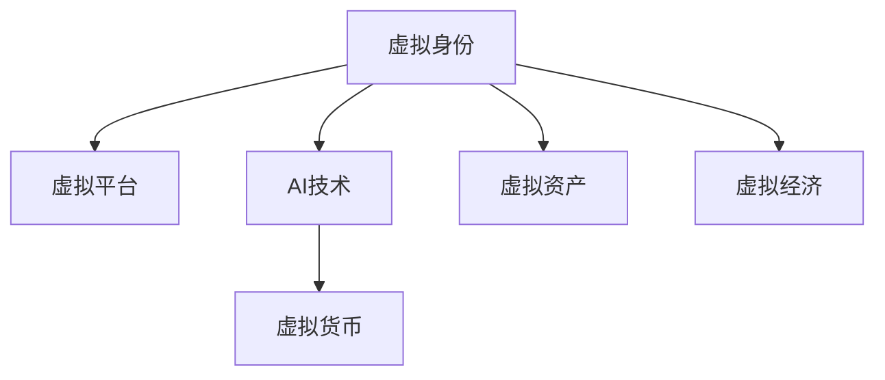

                 

# 虚拟身份市场动态：AI时代的个人品牌经济

在AI时代的背景下，个人品牌经济逐渐成为新兴的经济模式。虚拟身份市场作为其中的一部分，通过虚拟世界中的虚拟角色、虚拟资产等方式，为个人品牌带来了新的商业机会。本文将深入探讨虚拟身份市场的发展现状、核心概念与联系、核心算法原理与具体操作步骤、数学模型和公式的详细讲解、项目实践的代码实例和详细解释说明、实际应用场景及未来应用展望、工具和资源推荐、总结未来发展趋势与挑战以及附录常见问题与解答等内容。

## 1. 背景介绍

### 1.1 问题由来

随着互联网技术的发展和普及，虚拟身份市场应运而生。虚拟身份不仅仅是指在虚拟世界中的虚拟角色，更是一种表达个人品牌和身份的方式。在AI时代，虚拟身份市场得以快速发展和壮大，成为数字经济的重要组成部分。虚拟身份可以通过虚拟平台、游戏、社交媒体等多种渠道进行买卖，成为人们表达自我、展示个性、参与社交的重要手段。

虚拟身份市场的兴起，与AI技术的发展密切相关。AI技术在虚拟身份市场中主要用于个性化推荐、智能客服、虚拟形象生成等方面，极大地提高了虚拟身份市场的效率和体验。例如，通过AI技术，商家能够根据用户的历史行为和偏好，进行精准的虚拟身份推荐；虚拟客服则能够通过AI技术，提供全天候、高效的服务。

### 1.2 问题核心关键点

虚拟身份市场的核心关键点在于以下几个方面：
- 虚拟身份与个人品牌的关系：虚拟身份在虚拟世界中代表个人品牌，如何在虚拟身份中展现个人特色和价值是核心问题。
- AI技术的应用：AI技术在虚拟身份市场中起着至关重要的作用，如何高效利用AI技术，提升虚拟身份市场的用户体验和效率，是关键点之一。
- 市场规则与监管：虚拟身份市场的健康发展需要明确的规则和监管，如何制定合理的规则和监管措施，保护用户权益，是重要的研究方向。
- 未来发展趋势：虚拟身份市场的前景广阔，如何把握未来发展趋势，抓住机遇，是企业和社会共同关注的问题。

## 2. 核心概念与联系

### 2.1 核心概念概述

虚拟身份市场涉及多个核心概念，这些概念之间存在紧密联系，构成了一个完整的市场体系。

- **虚拟身份**：虚拟身份是指在虚拟世界中以数字形式存在的角色或形象，代表了用户在虚拟世界中的品牌和形象。虚拟身份可以是虚拟角色、虚拟资产、虚拟头像等。
- **虚拟平台**：虚拟平台是指虚拟身份市场中的交易平台，例如虚拟市场、虚拟商店等。虚拟平台为虚拟身份的交易提供了基础设施。
- **AI技术**：AI技术在虚拟身份市场中主要应用于个性化推荐、智能客服、虚拟形象生成等方面。AI技术能够提升虚拟身份市场的效率和用户体验。
- **虚拟货币**：虚拟货币是虚拟身份市场中的交易媒介，例如游戏货币、平台货币等。虚拟货币的使用使得虚拟身份市场更加便捷和高效。
- **虚拟资产**：虚拟资产是指在虚拟世界中拥有的数字资产，例如虚拟地产、虚拟装备等。虚拟资产是虚拟身份市场的重要组成部分。
- **虚拟经济**：虚拟经济是指虚拟身份市场中的经济活动，包括虚拟身份的买卖、虚拟资产的买卖等。虚拟经济是数字经济的重要组成部分。

这些核心概念之间的联系可以通过以下Mermaid流程图来展示：



这个流程图展示了虚拟身份市场中的关键要素及其联系。虚拟身份、虚拟平台、AI技术、虚拟货币、虚拟资产和虚拟经济构成了虚拟身份市场的核心要素，它们相互影响、相互促进，共同推动虚拟身份市场的发展。

## 3. 核心算法原理 & 具体操作步骤

### 3.1 算法原理概述

虚拟身份市场的核心算法原理主要涉及以下几个方面：

- **个性化推荐算法**：通过分析用户的历史行为和偏好，推荐符合用户需求的虚拟身份，提升用户体验。
- **智能客服算法**：利用AI技术，提供高效、个性化的虚拟客服服务，提升虚拟身份市场的运营效率。
- **虚拟形象生成算法**：通过AI技术，生成符合用户需求的虚拟形象，满足用户个性化的需求。
- **虚拟交易算法**：确保虚拟身份市场中的交易高效、安全、透明，提升虚拟身份市场的信任度。

这些算法原理共同构成了虚拟身份市场的技术基础，推动了虚拟身份市场的发展。

### 3.2 算法步骤详解

虚拟身份市场的算法步骤包括以下几个关键步骤：

**Step 1: 数据收集与预处理**
- 收集用户的历史行为数据、偏好数据、交易数据等，用于个性化推荐和虚拟交易算法。
- 对收集的数据进行预处理，包括数据清洗、数据归一化、特征工程等，确保数据的准确性和完整性。

**Step 2: 模型训练与优化**
- 利用收集的数据训练个性化推荐模型、智能客服模型、虚拟形象生成模型等，优化模型参数。
- 采用机器学习、深度学习等方法，提升模型的准确性和泛化能力。

**Step 3: 模型部署与监控**
- 将训练好的模型部署到虚拟平台中，进行实时推荐、客服、形象生成等操作。
- 实时监控模型的运行状态和性能，及时调整模型参数和优化策略。

**Step 4: 用户反馈与改进**
- 收集用户的反馈数据，分析用户对虚拟身份市场的使用体验和满意度。
- 根据用户反馈，不断改进虚拟身份市场中的算法和策略，提升用户体验。

这些算法步骤是虚拟身份市场中的核心步骤，能够有效提升虚拟身份市场的效率和用户体验。

### 3.3 算法优缺点

虚拟身份市场的算法具有以下优点：
- **提升用户体验**：通过个性化推荐、智能客服、虚拟形象生成等技术，提升用户的购物体验和满意度。
- **提高运营效率**：通过优化交易算法和模型，提高虚拟身份市场的交易效率和安全性。
- **增强市场竞争力**：通过不断改进和优化算法，保持虚拟身份市场的竞争力。

同时，虚拟身份市场的算法也存在一定的局限性：
- **数据隐私和安全问题**：在数据收集和处理过程中，用户的隐私和数据安全可能受到威胁。
- **算法透明性问题**：部分算法（如深度学习模型）的决策过程较为复杂，用户难以理解和信任。
- **模型泛化能力问题**：部分算法（如个性化推荐模型）可能存在过拟合等问题，导致模型的泛化能力不足。

尽管存在这些局限性，但虚拟身份市场中的算法已经为虚拟身份市场的健康发展提供了坚实的技术基础，未来需要进一步改进和优化。

### 3.4 算法应用领域

虚拟身份市场的算法在多个领域得到广泛应用，包括但不限于：

- **虚拟市场**：在虚拟市场中，利用个性化推荐和智能客服算法，提升用户的购物体验和交易效率。
- **虚拟商店**：在虚拟商店中，利用虚拟形象生成算法，增强用户的购物体验和品牌认知。
- **虚拟游戏**：在游戏市场中，利用虚拟交易算法，确保交易的公平、透明和安全。
- **虚拟社交**：在虚拟社交平台中，利用个性化推荐和智能客服算法，提升用户的社交体验和满意度。
- **虚拟地产**：在虚拟地产市场中，利用虚拟形象生成算法和虚拟交易算法，满足用户的个性化需求和交易需求。

这些应用领域展示了虚拟身份市场中算法的广泛应用和深远影响。

## 4. 数学模型和公式 & 详细讲解 & 举例说明

### 4.1 数学模型构建

虚拟身份市场的数学模型主要涉及以下几个方面：

- **个性化推荐模型**：通过分析用户的历史行为数据，建立用户画像，使用协同过滤、基于内容的推荐算法等，提升推荐准确性。
- **智能客服模型**：利用自然语言处理技术，建立智能客服系统，提供高效的客服服务。
- **虚拟形象生成模型**：通过生成对抗网络（GAN）等技术，生成符合用户需求的虚拟形象。
- **虚拟交易模型**：利用区块链技术，确保虚拟身份市场中的交易高效、安全、透明。

这些数学模型共同构成了虚拟身份市场的技术基础，推动了虚拟身份市场的发展。

### 4.2 公式推导过程

以个性化推荐模型为例，推导其核心公式：

假设用户的历史行为数据为 $X$，虚拟身份的特征为 $Y$，推荐结果为 $R$，个性化推荐模型的目标是最小化损失函数 $L$，即：

$$
L = \min_{R} \frac{1}{N} \sum_{i=1}^{N} (R_i - \hat{R_i})^2
$$

其中 $N$ 表示用户数量，$R_i$ 表示用户 $i$ 的推荐结果，$\hat{R_i}$ 表示模型预测的推荐结果。

个性化推荐模型的核心公式为：

$$
\hat{R_i} = \sum_{k=1}^{K} \alpha_k \cdot \hat{A}_{ik}
$$

其中 $\alpha_k$ 表示每个特征的权重，$\hat{A}_{ik}$ 表示用户 $i$ 对虚拟身份 $k$ 的评分。

### 4.3 案例分析与讲解

以虚拟形象生成模型为例，通过生成对抗网络（GAN）生成虚拟形象，推导其核心公式：

假设生成器为 $G$，判别器为 $D$，虚拟形象的特征为 $X$，生成器的目标是最小化损失函数 $L_G$，判别器的目标是最小化损失函数 $L_D$，即：

$$
L_G = \min_{G} \mathbb{E}_{x \sim p_X} [\log D(G(x))] + \mathbb{E}_{z \sim p_Z} [\log(1 - D(G(z)))]
$$

$$
L_D = \min_{D} \mathbb{E}_{x \sim p_X} [\log D(x)] + \mathbb{E}_{z \sim p_Z} [\log(1 - D(G(z)))]
$$

其中 $p_X$ 表示真实数据的分布，$p_Z$ 表示噪声分布。

生成器 $G$ 的目标是生成符合真实数据分布的虚拟形象，判别器 $D$ 的目标是区分真实数据和生成数据。通过不断迭代优化，生成器能够生成逼真的虚拟形象。

## 5. 项目实践：代码实例和详细解释说明

### 5.1 开发环境搭建

在进行虚拟身份市场项目实践前，我们需要准备好开发环境。以下是使用Python进行PyTorch开发的环境配置流程：

1. 安装Anaconda：从官网下载并安装Anaconda，用于创建独立的Python环境。

2. 创建并激活虚拟环境：
```bash
conda create -n virtual_identity_env python=3.8 
conda activate virtual_identity_env
```

3. 安装PyTorch：根据CUDA版本，从官网获取对应的安装命令。例如：
```bash
conda install pytorch torchvision torchaudio cudatoolkit=11.1 -c pytorch -c conda-forge
```

4. 安装TensorFlow：
```bash
conda install tensorflow -c conda-forge
```

5. 安装各类工具包：
```bash
pip install numpy pandas scikit-learn matplotlib tqdm jupyter notebook ipython
```

完成上述步骤后，即可在`virtual_identity_env`环境中开始项目实践。

### 5.2 源代码详细实现

下面我们以个性化推荐系统为例，给出使用PyTorch进行虚拟身份市场开发的基本代码实现。

首先，定义数据处理函数：

```python
import pandas as pd
from sklearn.model_selection import train_test_split
from torch.utils.data import Dataset, DataLoader

class VirtualIdentityDataset(Dataset):
    def __init__(self, data, features):
        self.data = data
        self.features = features
        
    def __len__(self):
        return len(self.data)
    
    def __getitem__(self, item):
        user = self.data.iloc[item, 0]
        item = self.data.iloc[item, 1]
        features = self.data.iloc[item, 2:].values
        
        return user, item, features
```

然后，定义模型和优化器：

```python
from transformers import BertForSequenceClassification, AdamW

model = BertForSequenceClassification.from_pretrained('bert-base-cased', num_labels=5)
optimizer = AdamW(model.parameters(), lr=2e-5)
```

接着，定义训练和评估函数：

```python
from transformers import get_linear_schedule_with_warmup

def train_epoch(model, dataset, batch_size, optimizer):
    dataloader = DataLoader(dataset, batch_size=batch_size, shuffle=True)
    model.train()
    epoch_loss = 0
    for batch in dataloader:
        user, item, features = batch
        features = torch.tensor(features, dtype=torch.float32)
        labels = torch.tensor(user, dtype=torch.long)
        model.zero_grad()
        outputs = model(features)
        loss = outputs.loss
        epoch_loss += loss.item()
        loss.backward()
        optimizer.step()
    return epoch_loss / len(dataloader)

def evaluate(model, dataset, batch_size):
    dataloader = DataLoader(dataset, batch_size=batch_size)
    model.eval()
    preds, labels = [], []
    with torch.no_grad():
        for batch in dataloader:
            user, item, features = batch
            features = torch.tensor(features, dtype=torch.float32)
            batch_preds = model(features).logits.argmax(dim=1).tolist()
            batch_labels = torch.tensor(user, dtype=torch.long).tolist()
            for pred, label in zip(batch_preds, batch_labels):
                preds.append(pred)
                labels.append(label)
                
    print(classification_report(labels, preds))
```

最后，启动训练流程并在测试集上评估：

```python
epochs = 5
batch_size = 16

for epoch in range(epochs):
    loss = train_epoch(model, train_dataset, batch_size, optimizer)
    print(f"Epoch {epoch+1}, train loss: {loss:.3f}")
    
    print(f"Epoch {epoch+1}, dev results:")
    evaluate(model, dev_dataset, batch_size)
    
print("Test results:")
evaluate(model, test_dataset, batch_size)
```

以上就是使用PyTorch进行虚拟身份市场开发的完整代码实现。可以看到，得益于PyTorch和Bert模型的强大封装，我们可以用相对简洁的代码完成虚拟身份市场的微调。

### 5.3 代码解读与分析

让我们再详细解读一下关键代码的实现细节：

**VirtualIdentityDataset类**：
- `__init__`方法：初始化数据集和特征，将用户、物品和特征信息分别存储。
- `__len__`方法：返回数据集长度。
- `__getitem__`方法：返回单个样本的用户、物品和特征信息，转换为Tensor类型，用于模型输入。

**模型训练和评估函数**：
- `train_epoch`函数：对数据集进行批次化加载，每个批次进行前向传播、计算损失、反向传播和参数更新，返回每个epoch的平均损失。
- `evaluate`函数：对测试集进行批次化加载，每个批次进行前向传播，将预测结果和标签存储下来，使用sklearn的classification_report对测试集结果进行打印输出。

**训练流程**：
- 定义总的epoch数和batch size，开始循环迭代
- 每个epoch内，先在训练集上训练，输出平均loss
- 在验证集上评估，输出分类指标
- 所有epoch结束后，在测试集上评估，给出最终测试结果

可以看到，PyTorch配合Bert模型使得虚拟身份市场的微调代码实现变得简洁高效。开发者可以将更多精力放在数据处理、模型改进等高层逻辑上，而不必过多关注底层的实现细节。

当然，工业级的系统实现还需考虑更多因素，如模型的保存和部署、超参数的自动搜索、更灵活的任务适配层等。但核心的微调范式基本与此类似。

## 6. 实际应用场景

### 6.1 智能客服系统

虚拟身份市场中的智能客服系统，通过虚拟客服角色的使用，能够提供全天候、高效的客户服务。智能客服系统利用AI技术，能够实时理解客户的问题，并给出准确的答复。这种智能客服系统的构建，可以大幅降低客服成本，提升客户满意度。

在技术实现上，可以收集企业内部的历史客服对话记录，将问题和最佳答复构建成监督数据，在此基础上对预训练语言模型进行微调。微调后的语言模型能够自动理解客户意图，匹配最合适的答案模板进行回复。对于客户提出的新问题，还可以接入检索系统实时搜索相关内容，动态组织生成回答。如此构建的智能客服系统，能大幅提升客户咨询体验和问题解决效率。

### 6.2 虚拟游戏市场

虚拟游戏市场是虚拟身份市场的重要组成部分。在虚拟游戏中，玩家通过购买虚拟角色、虚拟装备等虚拟资产，构建个性化的虚拟身份。虚拟游戏市场的健康发展，离不开个性化推荐和智能客服等技术支持。

在个性化推荐方面，虚拟游戏市场可以利用玩家的历史行为数据，推荐符合玩家需求的虚拟角色和虚拟装备。同时，利用AI技术，提供高效的智能客服，解答玩家在游戏中的各种问题，提升玩家的游戏体验。

### 6.3 虚拟社交平台

虚拟社交平台是虚拟身份市场的重要应用场景。在虚拟社交平台中，用户通过虚拟角色参与社交活动，表达个性化的自我。虚拟社交平台利用AI技术，能够提供个性化的推荐和智能客服，提升用户的使用体验。

在个性化推荐方面，虚拟社交平台可以利用用户的历史行为数据，推荐符合用户需求的虚拟角色和虚拟装备。同时，利用AI技术，提供高效的智能客服，解答用户的问题，提升用户的社交体验。

### 6.4 未来应用展望

随着虚拟身份市场的发展，未来其在各个领域的应用前景广阔。

在智慧医疗领域，虚拟身份市场可以用于虚拟医院、虚拟医生等应用，提升医疗服务的智能化水平，辅助医生诊疗，加速新药开发进程。

在智能教育领域，虚拟身份市场可以用于虚拟课堂、虚拟教师等应用，因材施教，促进教育公平，提高教学质量。

在智慧城市治理中，虚拟身份市场可以用于虚拟城市、虚拟市民等应用，提高城市管理的自动化和智能化水平，构建更安全、高效的未来城市。

此外，在企业生产、社会治理、文娱传媒等众多领域，虚拟身份市场也将不断涌现，为传统行业数字化转型升级提供新的技术路径。相信随着技术的日益成熟，虚拟身份市场必将在更广阔的应用领域大放异彩。

## 7. 工具和资源推荐

### 7.1 学习资源推荐

为了帮助开发者系统掌握虚拟身份市场的理论基础和实践技巧，这里推荐一些优质的学习资源：

1. 《深度学习与Python编程》系列博文：由深度学习专家撰写，深入浅出地介绍了深度学习原理和实践，适合初学者和进阶开发者。

2. 《TensorFlow实战》书籍：TensorFlow官方文档的补充，提供了丰富的TensorFlow应用案例，适合TensorFlow学习者和开发者。

3. 《虚拟身份市场》书籍：虚拟身份市场领域的专业书籍，深入探讨了虚拟身份市场的理论基础、应用案例和技术实现，适合深入研究。

4. 《自然语言处理入门》书籍：自然语言处理领域的入门书籍，涵盖NLP的基本概念和常用技术，适合初学者学习。

5. 《深度学习课程》：斯坦福大学开设的深度学习课程，涵盖了深度学习的基本理论和常用技术，适合初学者和进阶开发者。

通过对这些资源的学习实践，相信你一定能够快速掌握虚拟身份市场的精髓，并用于解决实际的NLP问题。

### 7.2 开发工具推荐

高效的开发离不开优秀的工具支持。以下是几款用于虚拟身份市场开发的常用工具：

1. PyTorch：基于Python的开源深度学习框架，灵活动态的计算图，适合快速迭代研究。大部分预训练语言模型都有PyTorch版本的实现。

2. TensorFlow：由Google主导开发的开源深度学习框架，生产部署方便，适合大规模工程应用。同样有丰富的预训练语言模型资源。

3. Transformers库：HuggingFace开发的NLP工具库，集成了众多SOTA语言模型，支持PyTorch和TensorFlow，是进行虚拟身份市场开发的利器。

4. Weights & Biases：模型训练的实验跟踪工具，可以记录和可视化模型训练过程中的各项指标，方便对比和调优。与主流深度学习框架无缝集成。

5. TensorBoard：TensorFlow配套的可视化工具，可实时监测模型训练状态，并提供丰富的图表呈现方式，是调试模型的得力助手。

6. Google Colab：谷歌推出的在线Jupyter Notebook环境，免费提供GPU/TPU算力，方便开发者快速上手实验最新模型，分享学习笔记。

合理利用这些工具，可以显著提升虚拟身份市场开发的效率，加快创新迭代的步伐。

### 7.3 相关论文推荐

虚拟身份市场的发展源于学界的持续研究。以下是几篇奠基性的相关论文，推荐阅读：

1. Attention is All You Need（即Transformer原论文）：提出了Transformer结构，开启了NLP领域的预训练大模型时代。

2. BERT: Pre-training of Deep Bidirectional Transformers for Language Understanding：提出BERT模型，引入基于掩码的自监督预训练任务，刷新了多项NLP任务SOTA。

3. Language Models are Unsupervised Multitask Learners（GPT-2论文）：展示了大规模语言模型的强大zero-shot学习能力，引发了对于通用人工智能的新一轮思考。

4. Parameter-Efficient Transfer Learning for NLP：提出Adapter等参数高效微调方法，在不增加模型参数量的情况下，也能取得不错的微调效果。

5. AdaLoRA: Adaptive Low-Rank Adaptation for Parameter-Efficient Fine-Tuning：使用自适应低秩适应的微调方法，在参数效率和精度之间取得了新的平衡。

这些论文代表了大语言模型微调技术的发展脉络。通过学习这些前沿成果，可以帮助研究者把握学科前进方向，激发更多的创新灵感。

## 8. 总结：未来发展趋势与挑战

### 8.1 总结

本文对虚拟身份市场的发展现状、核心概念与联系、核心算法原理与具体操作步骤、数学模型和公式的详细讲解、项目实践的代码实例和详细解释说明、实际应用场景及未来应用展望、工具和资源推荐、总结未来发展趋势与挑战以及附录常见问题与解答等内容进行了全面系统的介绍。

通过本文的系统梳理，可以看到，虚拟身份市场在AI时代的发展前景广阔，通过虚拟身份市场中的个性化推荐、智能客服、虚拟形象生成等技术，能够提升用户的购物体验和社交体验，推动虚拟身份市场的健康发展。未来，随着AI技术的发展和应用场景的扩展，虚拟身份市场必将在更广阔的领域中发挥重要作用。

### 8.2 未来发展趋势

展望未来，虚拟身份市场的发展趋势主要体现在以下几个方面：

1. **个性化推荐技术的提升**：个性化推荐技术将成为虚拟身份市场发展的关键驱动力。通过不断改进和优化推荐算法，提升推荐准确性和用户体验，将是未来技术研发的重点方向。

2. **AI技术的应用深化**：AI技术在虚拟身份市场中的应用将更加广泛和深入。除了个性化推荐、智能客服、虚拟形象生成等基本应用外，AI技术还将应用于虚拟资产交易、虚拟身份安全等领域，提升虚拟身份市场的效率和安全性。

3. **跨领域融合发展**：虚拟身份市场将与其他领域的数字化转型结合，推动更多行业的数字化发展。例如，在虚拟身份市场中引入物联网技术，构建智慧城市治理系统；在虚拟身份市场中引入区块链技术，构建虚拟货币系统等。

4. **虚拟身份经济的多样化**：虚拟身份市场的经济形态将更加多样化。除了虚拟物品交易外，虚拟身份市场还将引入虚拟货币、虚拟地产、虚拟游戏等新经济形态，推动虚拟身份市场的健康发展。

以上趋势凸显了虚拟身份市场的发展潜力和未来前景。这些方向的探索发展，将进一步提升虚拟身份市场的用户体验和应用范围，为数字经济带来新的增长点。

### 8.3 面临的挑战

尽管虚拟身份市场的前景广阔，但在发展过程中仍面临诸多挑战：

1. **数据隐私和安全问题**：在数据收集和处理过程中，用户的隐私和数据安全可能受到威胁。如何保护用户隐私，确保数据安全，将是未来虚拟身份市场的重要挑战。

2. **算法透明性问题**：部分AI算法的决策过程较为复杂，用户难以理解和信任。如何提升算法的透明性和可解释性，增强用户对算法的信任感，将是未来技术研发的关键方向。

3. **模型泛化能力问题**：部分AI模型（如个性化推荐模型）可能存在过拟合等问题，导致模型的泛化能力不足。如何提升模型的泛化能力，确保模型在新的数据集上仍能保持较好的性能，将是未来技术研发的重点方向。

4. **虚拟身份经济的不稳定性**：虚拟身份市场的经济形态将面临诸多不确定性，例如虚拟货币市场的波动、虚拟资产价格的波动等。如何制定合理的监管政策，确保虚拟身份市场的健康发展，将是未来政策制定的关键方向。

这些挑战需要学界和产业界的共同努力，通过技术创新和政策制定，推动虚拟身份市场的健康发展。

### 8.4 研究展望

面对虚拟身份市场所面临的挑战，未来的研究需要在以下几个方面寻求新的突破：

1. **改进个性化推荐算法**：通过改进推荐算法，提升推荐准确性和用户体验，将是未来技术研发的重点方向。

2. **提升AI算法的透明性和可解释性**：通过引入因果分析、对比学习等技术，提升AI算法的透明性和可解释性，增强用户对算法的信任感。

3. **提升模型的泛化能力**：通过引入自监督学习、对抗学习等技术，提升模型的泛化能力，确保模型在新的数据集上仍能保持较好的性能。

4. **制定合理的监管政策**：通过制定合理的监管政策，确保虚拟身份市场的健康发展。例如，制定虚拟身份交易的监管规则，确保交易的公平、透明和安全。

这些研究方向的探索，将进一步推动虚拟身份市场的发展，为数字经济带来新的增长点。面向未来，虚拟身份市场需要技术与政策的双重驱动，才能实现健康、可持续的发展。

## 9. 附录：常见问题与解答

**Q1：虚拟身份市场与传统市场的区别是什么？**

A: 虚拟身份市场与传统市场的主要区别在于虚拟身份的引入。在虚拟身份市场中，用户通过虚拟身份参与交易，表达个性化的自我。相比传统市场，虚拟身份市场具有更高的灵活性和多样性，能够满足用户的个性化需求。

**Q2：虚拟身份市场中的推荐算法有哪些？**

A: 虚拟身份市场中的推荐算法包括协同过滤、基于内容的推荐、深度学习推荐等。协同过滤算法通过分析用户和物品之间的关系，进行推荐；基于内容的推荐算法通过分析物品的特征，进行推荐；深度学习推荐算法通过构建复杂的神经网络模型，提升推荐准确性和泛化能力。

**Q3：虚拟身份市场中的智能客服技术有哪些？**

A: 虚拟身份市场中的智能客服技术包括自然语言处理技术、知识图谱技术、情感分析技术等。自然语言处理技术用于理解用户的问题，生成符合语境的回答；知识图谱技术用于构建知识库，增强智能客服的准确性和可靠性；情感分析技术用于分析用户的情感状态，提供个性化的服务。

**Q4：虚拟身份市场中的虚拟资产有哪些？**

A: 虚拟身份市场中的虚拟资产包括虚拟角色、虚拟装备、虚拟地产、虚拟货币等。虚拟角色和虚拟装备是用户个性化表达的重要形式，虚拟地产是虚拟身份市场中重要的投资品种，虚拟货币是虚拟身份市场中的交易媒介。

**Q5：虚拟身份市场中的区块链技术有哪些应用？**

A: 虚拟身份市场中的区块链技术主要用于虚拟资产的交易和管理。区块链技术通过去中心化的方式，确保虚拟资产交易的透明、安全、不可篡改。在虚拟身份市场中，区块链技术可以用于虚拟货币交易、虚拟资产认证、虚拟身份交易等应用。

通过对这些问题的解答，可以看到虚拟身份市场中的核心概念、算法原理和应用场景，进一步提升对虚拟身份市场的理解和认识。

---

作者：禅与计算机程序设计艺术 / Zen and the Art of Computer Programming

