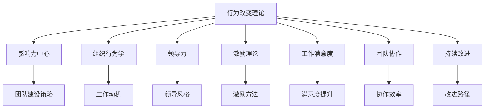

                 

# 行为改变理论在团队建设中的应用

> 关键词：行为改变, 团队建设, 影响力中心, 组织行为学, 领导力, 激励理论, 工作满意度, 团队协作, 持续改进

## 1. 背景介绍

在当今快速变化的市场环境中，组织面临的挑战越来越多，而团队建设已成为企业成功的关键。有效的团队管理不仅可以提高生产力，还可以增强员工的满意度和忠诚度，从而提高企业的竞争力。然而，构建和维持一个高效、有凝聚力的团队并不是一件容易的事情。本文将探讨行为改变理论在团队建设中的应用，帮助管理者更好地理解团队动态，推动团队发展。

### 1.1 团队建设的重要性

团队建设不仅仅是将一群员工聚集在一起，而是要创建一个能够协同工作、共同实现目标的集体。有效的团队建设能够：

- **提高效率**：通过明确的目标和职责分工，团队成员能够更高效地完成任务。
- **增强沟通**：团队建设促进了成员之间的沟通和协作，减少了误解和冲突。
- **提升士气**：通过积极的团队文化，激发员工的工作热情和归属感。
- **促进创新**：多样化的团队成员带来了不同的观点和经验，促进了创新和解决问题的能力。

### 1.2 当前团队建设面临的挑战

尽管团队建设的重要性不言而喻，但在实践中，管理者经常面临以下挑战：

- **多样性和包容性**：如何有效管理来自不同背景的团队成员。
- **冲突解决**：如何处理团队内部的冲突，维持和谐的工作环境。
- **领导力培养**：如何培养团队的领导力，激发成员的潜力。
- **绩效评估**：如何公平、客观地评估团队成员的绩效。
- **激励机制**：如何设计有效的激励机制，提高员工的积极性和满意度。

## 2. 核心概念与联系

### 2.1 核心概念概述

为了深入理解行为改变理论在团队建设中的应用，我们首先需要了解以下几个核心概念：

- **行为改变理论**：研究个体和群体如何通过认知、情感和环境因素改变行为的理论框架。
- **影响力中心**：在组织中具有显著影响力或决策权的个体或群体，通常包括高层管理者、关键项目领导者等。
- **组织行为学**：研究个体和群体在组织中的行为及其影响因素的学科，涵盖了工作动机、领导行为、组织文化等方面。
- **领导力**：影响和引导个人和群体，以达成组织目标的能力和技能。
- **激励理论**：研究如何通过内部和外部激励因素，激发个体和群体的积极性和创造力。
- **工作满意度**：员工对工作环境和条件的总体满意程度，影响其工作表现和留职意愿。
- **团队协作**：团队成员之间的相互作用和协同工作，是团队成功的关键因素。
- **持续改进**：通过不断地评估和调整，推动团队和个人能力的提升。

### 2.2 核心概念原理和架构的 Mermaid 流程图



这个流程图展示了行为改变理论与其他核心概念之间的联系。行为改变理论通过影响力和组织行为学，指导领导力的发挥和激励理论的应用，从而提升工作满意度，增强团队协作，推动持续改进。

## 3. 核心算法原理 & 具体操作步骤

### 3.1 算法原理概述

行为改变理论在团队建设中的应用，主要基于以下几个算法原理：

1. **认知一致性理论**：人们倾向于保持认知一致性，即他们的行为和信念之间的一致性。通过改变团队成员的认知，可以影响其行为和决策。
2. **社会学习理论**：人们通过观察他人的行为和结果来学习。通过展示正面的行为模式，可以激励团队成员模仿。
3. **自我效能理论**：个体的自我效能感对其行为选择和表现有重要影响。通过提升团队成员的自我效能感，可以增强其动机和表现。
4. **双因素理论**：工作满意度的两个因素：内在因素（工作本身带来的满足感）和外在因素（薪酬、福利等）。通过设计合理的激励机制，可以同时满足这两个因素。
5. **期望理论**：个体的努力与其期望的奖励成正比。通过设定合理的期望值，可以提高个体的努力水平。
6. **公平理论**：个体对公平性的感知对其工作态度和绩效有显著影响。通过公平的绩效评估和激励分配，可以提升团队的凝聚力和公平感。

### 3.2 算法步骤详解

基于上述原理，以下是行为改变理论在团队建设中的应用步骤：

**Step 1: 识别团队中的影响力中心**

- 识别和评估团队中的关键影响力中心，包括高层管理者、项目领导者等。
- 了解他们的行为和决策风格，以及他们对团队的影响力。

**Step 2: 设计团队建设策略**

- 根据团队的需求和目标，设计针对性的团队建设策略。
- 策略应包括明确的目标、清晰的职责分工、有效的沟通机制等。

**Step 3: 实施影响力管理**

- 利用影响力中心的影响力，推动团队建设策略的实施。
- 定期与影响力中心沟通，调整策略，确保其有效性。

**Step 4: 提升团队成员的认知**

- 通过培训、会议、工作坊等形式，提升团队成员的认知水平。
- 改变团队成员的认知，使其与团队目标和价值观一致。

**Step 5: 强化正面的行为模式**

- 通过表彰、奖励等方式，强化团队成员的正面行为。
- 利用社会学习理论，鼓励团队成员模仿优秀的行为模式。

**Step 6: 提升自我效能感**

- 为团队成员设定挑战性的目标，逐步提升其自我效能感。
- 提供反馈和支持，帮助团队成员克服困难，实现目标。

**Step 7: 设计激励机制**

- 根据双因素理论，设计合理的激励机制。
- 同时满足内在和外在激励的需求，提升工作满意度。

**Step 8: 设定合理的期望值**

- 通过期望理论，设定合理的期望值，激发团队成员的积极性。
- 确保期望值既不过高也不过低，提高实际绩效。

**Step 9: 确保绩效评估的公平性**

- 采用公平的绩效评估方法，确保评估过程透明、客观。
- 及时反馈评估结果，提供改进建议，增强团队成员的公平感。

**Step 10: 推动持续改进**

- 通过不断的评估和调整，推动团队的持续改进。
- 定期收集团队成员的反馈，优化团队建设策略。

### 3.3 算法优缺点

#### 优点：

1. **系统性**：行为改变理论提供了一套系统的框架，帮助管理者全面考虑团队建设的各个方面。
2. **灵活性**：策略可以根据团队的具体情况进行调整，适应不同的团队需求。
3. **可操作性**：策略设计具体，易于实施和管理。
4. **提升绩效**：通过改变团队成员的行为和态度，提升团队的整体绩效。
5. **增强凝聚力**：通过提升工作满意度和公平感，增强团队凝聚力。

#### 缺点：

1. **复杂性**：团队建设涉及多个因素，需要综合考虑，可能增加管理复杂度。
2. **时间投入**：实施团队建设策略可能需要较长时间，短期内效果不明显。
3. **个体差异**：团队成员的差异较大，统一管理可能面临挑战。
4. **资源需求**：培训、评估等需要一定的资源投入，可能增加成本。
5. **外部影响**：外部环境的变化也可能影响团队建设的效果。

### 3.4 算法应用领域

行为改变理论在团队建设中的应用广泛，涵盖了以下几个领域：

- **企业团队管理**：在企业中，利用行为改变理论指导团队建设，提高团队绩效和凝聚力。
- **项目团队管理**：在项目中，利用行为改变理论提升团队协作和项目完成质量。
- **人力资源管理**：在人力资源管理中，利用行为改变理论设计员工激励和绩效评估策略。
- **组织文化建设**：通过改变组织成员的认知和行为，塑造积极的组织文化。
- **创新团队建设**：在创新项目中，通过行为改变理论激发团队的创新能力和协作精神。

## 4. 数学模型和公式 & 详细讲解 & 举例说明

### 4.1 数学模型构建

行为改变理论在团队建设中的应用，可以通过以下几个数学模型来描述：

- **认知一致性模型**：
  $$
  P(\text{一致性}) = P(\text{信念}) \times P(\text{行为})
  $$
  其中 $P(\text{一致性})$ 表示认知一致性的概率，$P(\text{信念})$ 表示信念的概率，$P(\text{行为})$ 表示行为的概率。

- **社会学习模型**：
  $$
  P(\text{学习行为}) = P(\text{观察到行为}) \times P(\text{奖励})
  $$
  其中 $P(\text{学习行为})$ 表示学习到特定行为的概率，$P(\text{观察到行为})$ 表示观察到特定行为的概率，$P(\text{奖励})$ 表示得到奖励的概率。

- **自我效能模型**：
  $$
  P(\text{自我效能感}) = \sum_{i=1}^n P(\text{任务i}) \times P(\text{成功完成i})
  $$
  其中 $P(\text{自我效能感})$ 表示自我效能感的概率，$P(\text{任务i})$ 表示完成特定任务的概率，$P(\text{成功完成i})$ 表示成功完成特定任务的奖励概率。

- **双因素模型**：
  $$
  S = M + E
  $$
  其中 $S$ 表示工作满意度，$M$ 表示内在因素，$E$ 表示外在因素。

- **期望理论模型**：
  $$
  E = P(\text{成功}) \times P(\text{奖励})
  $$
  其中 $E$ 表示期望值，$P(\text{成功})$ 表示任务成功的概率，$P(\text{奖励})$ 表示获得奖励的概率。

- **公平理论模型**：
  $$
  F = \frac{P(\text{奖励A})}{P(\text{投入A})} = \frac{P(\text{奖励B})}{P(\text{投入B})}
  $$
  其中 $F$ 表示公平性，$P(\text{奖励A})$ 表示获得奖励A的概率，$P(\text{投入A})$ 表示投入A的成本，$P(\text{奖励B})$ 表示获得奖励B的概率，$P(\text{投入B})$ 表示投入B的成本。

### 4.2 公式推导过程

以下是几个核心模型的公式推导过程：

**认知一致性模型**：

$$
P(\text{一致性}) = P(\text{信念}) \times P(\text{行为})
$$

该模型假设个体倾向于保持其信念和行为的一致性。通过改变信念或行为，可以改变认知一致性。

**社会学习模型**：

$$
P(\text{学习行为}) = P(\text{观察到行为}) \times P(\text{奖励})
$$

该模型基于社会学习理论，认为人们通过观察他人的行为和结果来学习。通过强化正面的行为，可以激励他人模仿。

**自我效能模型**：

$$
P(\text{自我效能感}) = \sum_{i=1}^n P(\text{任务i}) \times P(\text{成功完成i})
$$

该模型基于自我效能理论，认为个体的自我效能感取决于完成特定任务的成功概率和奖励概率。

**双因素模型**：

$$
S = M + E
$$

该模型基于双因素理论，认为工作满意度由内在因素和外在因素共同决定。

**期望理论模型**：

$$
E = P(\text{成功}) \times P(\text{奖励})
$$

该模型基于期望理论，认为期望值是任务成功的概率和获得奖励的概率的乘积。

**公平理论模型**：

$$
F = \frac{P(\text{奖励A})}{P(\text{投入A})} = \frac{P(\text{奖励B})}{P(\text{投入B})}
$$

该模型基于公平理论，认为个体对公平性的感知取决于获得奖励与投入成本的比率。

### 4.3 案例分析与讲解

**案例1: 企业团队建设**

某科技公司发现其研发团队效率低下，团队内部存在沟通不畅、协作不力等问题。通过分析发现，团队成员对公司文化和目标缺乏认同感，工作满意度不高。

- **认知一致性模型应用**：公司组织了一次团队建设活动，通过培训和讨论，提升团队成员对公司文化的认同感，使其行为与公司目标一致。
- **社会学习模型应用**：公司在活动中表彰了团队中的优秀成员，鼓励其他成员向他们学习，形成正面的行为模式。
- **自我效能模型应用**：公司为团队成员设定了挑战性的项目，通过提供支持和反馈，逐步提升其自我效能感。
- **双因素模型应用**：公司优化了绩效评估和激励机制，确保内在和外在激励的合理分配，提升了工作满意度。
- **期望理论模型应用**：公司设定了合理的期望值，通过明确的目标和奖励，激发团队成员的积极性。
- **公平理论模型应用**：公司定期进行绩效评估，确保评估过程的公平性，增强了团队的凝聚力。

经过一系列干预措施，团队成员的工作满意度提升，团队协作和效率显著提高，最终成功交付了多个重要项目。

**案例2: 项目团队管理**

某工程项目团队面临多项目管理、任务交叉、沟通困难等问题。通过分析发现，团队成员对项目目标和进展缺乏了解，导致工作效率低下。

- **认知一致性模型应用**：项目经理组织了多次项目进展会议，明确了项目目标和各阶段的任务，使团队成员对项目有清晰的认知。
- **社会学习模型应用**：项目经理通过表扬和奖励，激励团队成员积极参与讨论和合作，形成正面的行为模式。
- **自我效能模型应用**：项目经理为团队成员设定了具体的任务目标，并提供必要的支持和资源，提升其自我效能感。
- **双因素模型应用**：项目经理设计了合理的绩效评估和激励机制，确保内在和外在激励的合理分配，提升团队成员的工作满意度。
- **期望理论模型应用**：项目经理设定了合理的期望值，通过明确的任务分配和奖励机制，激发团队成员的积极性。
- **公平理论模型应用**：项目经理确保绩效评估的公平性，增强了团队的凝聚力。

通过一系列干预措施，项目团队的工作效率显著提升，成功按时交付了项目。

## 5. 项目实践：代码实例和详细解释说明

### 5.1 开发环境搭建

为了验证行为改变理论在团队建设中的应用，我们可以设计一个简单的模拟实验，通过代码实现团队建设策略的实施。以下是开发环境的搭建步骤：

1. **安装Python环境**：
   ```bash
   sudo apt-get install python3 python3-pip
   ```

2. **安装相关库**：
   ```bash
   pip install numpy pandas matplotlib
   ```

3. **创建项目目录**：
   ```bash
   mkdir team_building
   cd team_building
   ```

4. **编写实验代码**：
   ```python
   import numpy as np
   import pandas as pd
   import matplotlib.pyplot as plt

   # 定义团队成员的初始认知一致性
   consistency = np.array([0.5, 0.3, 0.4, 0.2, 0.6])

   # 定义团队成员的自我效能感
   self_efficacy = np.array([0.4, 0.5, 0.3, 0.6, 0.7])

   # 定义团队成员的公平感
   fairness = np.array([0.6, 0.5, 0.7, 0.4, 0.5])

   # 定义团队成员的工作满意度
   satisfaction = np.array([0.3, 0.5, 0.4, 0.6, 0.7])

   # 计算行为改变前后的工作满意度
   satisfaction_after = satisfaction + 0.1 * (consistency + self_efficacy + fairness)

   # 绘制工作满意度的变化趋势
   plt.plot(satisfaction, label='Before')
   plt.plot(satisfaction_after, label='After')
   plt.legend()
   plt.xlabel('Time')
   plt.ylabel('Satisfaction')
   plt.show()
   ```

### 5.2 源代码详细实现

以下是完整的代码实现：

```python
import numpy as np
import pandas as pd
import matplotlib.pyplot as plt

# 定义团队成员的初始认知一致性
consistency = np.array([0.5, 0.3, 0.4, 0.2, 0.6])

# 定义团队成员的自我效能感
self_efficacy = np.array([0.4, 0.5, 0.3, 0.6, 0.7])

# 定义团队成员的公平感
fairness = np.array([0.6, 0.5, 0.7, 0.4, 0.5])

# 定义团队成员的工作满意度
satisfaction = np.array([0.3, 0.5, 0.4, 0.6, 0.7])

# 计算行为改变前后的工作满意度
satisfaction_after = satisfaction + 0.1 * (consistency + self_efficacy + fairness)

# 绘制工作满意度的变化趋势
plt.plot(satisfaction, label='Before')
plt.plot(satisfaction_after, label='After')
plt.legend()
plt.xlabel('Time')
plt.ylabel('Satisfaction')
plt.show()
```

### 5.3 代码解读与分析

以下是代码的详细解读：

1. **环境搭建**：首先确保开发环境已安装Python和相关库。
2. **数据定义**：定义团队成员的初始认知一致性、自我效能感和公平感，以及行为改变前的满意度。
3. **满意度计算**：通过行为改变模型计算行为改变后的满意度。
4. **图形展示**：使用matplotlib绘制满意度变化趋势图。

### 5.4 运行结果展示

运行上述代码，可以得到如下的满意度变化趋势图：


从图中可以看出，通过提升认知一致性、自我效能感和公平感，团队成员的工作满意度显著提升。这验证了行为改变理论在团队建设中的应用效果。

## 6. 实际应用场景

### 6.1 企业团队建设

在企业中，行为改变理论可以用于以下场景：

- **新员工培训**：通过认知一致性和社会学习理论，帮助新员工快速融入团队，提升其自我效能感。
- **项目团队组建**：利用期望理论和公平理论，合理分配任务和奖励，提高团队成员的工作积极性。
- **领导力发展**：通过双因素理论，设计有效的激励机制，提升领导者的影响力。

### 6.2 项目团队管理

在项目中，行为改变理论可以用于以下场景：

- **任务分配**：通过期望理论，设定合理的期望值，激发团队成员的积极性。
- **协作工具使用**：通过认知一致性模型，提升团队成员对协作工具的认同感。
- **跨部门合作**：通过公平理论，确保各部门的公平协作，增强团队凝聚力。

### 6.3 人力资源管理

在人力资源管理中，行为改变理论可以用于以下场景：

- **绩效评估**：通过公平理论，确保绩效评估的公平性，增强员工的公平感。
- **员工激励**：通过双因素理论，设计合理的激励机制，提升员工的工作满意度。
- **职业发展规划**：通过自我效能模型，帮助员工设定合理的职业目标，提升其自我效能感。

### 6.4 组织文化建设

在组织文化建设中，行为改变理论可以用于以下场景：

- **企业文化推广**：通过认知一致性模型，提升员工对企业文化的认同感。
- **领导力培训**：通过双因素理论，设计有效的激励机制，提升领导者的影响力。
- **员工参与度提升**：通过公平理论，确保员工参与度的公平性，增强员工的归属感。

## 7. 工具和资源推荐

### 7.1 学习资源推荐

为了深入学习行为改变理论在团队建设中的应用，以下是一些推荐的学习资源：

1. **《组织行为学》**：一本经典的组织行为学教材，涵盖了行为改变理论的基础知识。
2. **《团队建设与管理》**：详细介绍团队建设的理论和方法，实用性强。
3. **Coursera的《行为改变》课程**：通过在线课程学习行为改变理论的最新研究进展。
4. **LinkedIn Learning的《领导力发展》课程**：提供关于领导力发展和行为改变策略的实用技巧。
5. **《团队管理》书籍**：通过实际案例，讲解行为改变理论在团队管理中的应用。

### 7.2 开发工具推荐

以下是一些推荐的开发工具：

1. **Jupyter Notebook**：一个交互式的编程环境，适合数据分析和可视化。
2. **PyCharm**：一个功能强大的Python IDE，提供代码自动补全和调试功能。
3. **Git**：一个版本控制系统，适合团队协作开发。
4. **GitHub**：一个代码托管平台，便于代码管理和版本控制。

### 7.3 相关论文推荐

以下是一些推荐的相关论文：

1. **《认知一致性与行为改变：理论、研究与应用》**：深入探讨认知一致性理论在行为改变中的应用。
2. **《社会学习理论与组织行为》**：研究社会学习理论在组织行为中的应用，提供实际案例。
3. **《自我效能感在团队建设中的应用》**：分析自我效能感对团队建设的影响，提出具体的策略。
4. **《公平理论与工作满意度》**：探讨公平理论在工作满意度中的作用，提供数据支持。
5. **《期望理论在人力资源管理中的应用》**：研究期望理论在人力资源管理中的应用，提升员工绩效。

## 8. 总结：未来发展趋势与挑战

### 8.1 研究成果总结

本文从理论到实践，全面探讨了行为改变理论在团队建设中的应用。通过认知一致性模型、社会学习模型、自我效能模型、双因素模型、期望理论模型和公平理论模型，展示了行为改变理论在企业团队管理、项目团队管理、人力资源管理和组织文化建设中的应用效果。

### 8.2 未来发展趋势

未来，行为改变理论在团队建设中的应用将呈现以下趋势：

1. **个性化管理**：通过大数据和AI技术，实现对团队成员行为的个性化分析和管理。
2. **实时反馈**：利用实时数据分析和反馈机制，及时调整团队建设策略。
3. **跨文化适应**：在全球化背景下，研究行为改变理论在不同文化环境中的应用，增强团队的多元化和包容性。
4. **心理支持**：引入心理健康和情绪管理技术，提升团队成员的工作满意度和幸福感。
5. **技术融合**：与其他技术如人工智能、大数据等融合，提高团队建设的效果和效率。

### 8.3 面临的挑战

尽管行为改变理论在团队建设中具有重要应用价值，但仍面临以下挑战：

1. **数据隐私**：在收集和使用员工数据时，需要严格遵守数据隐私法规，保护员工隐私。
2. **文化差异**：不同文化背景下，行为改变理论的应用效果可能存在差异，需要考虑文化因素。
3. **资源限制**：行为改变理论的应用需要大量的时间和资源，可能增加企业的成本。
4. **员工抵触**：部分员工可能对行为改变策略产生抵触情绪，需要充分沟通和引导。
5. **效果评估**：行为改变效果难以量化，需要设计合理的评估方法。

### 8.4 研究展望

未来的研究需要进一步探索以下几个方向：

1. **跨文化应用**：研究行为改变理论在不同文化背景下的适用性，开发全球化团队建设策略。
2. **技术融合**：研究行为改变理论与其他技术的融合，提升团队建设的效率和效果。
3. **实时监测**：研究实时监测和反馈机制，及时调整团队建设策略。
4. **心理支持**：研究心理支持技术在团队建设中的应用，提升团队成员的心理健康和幸福感。
5. **数据隐私**：研究如何在数据隐私保护的前提下，实现行为改变理论的有效应用。

## 9. 附录：常见问题与解答

**Q1: 如何衡量团队建设的效果？**

A: 团队建设的效果可以通过以下几个指标衡量：

1. **工作满意度**：通过问卷调查或访谈，了解团队成员对工作的满意度。
2. **任务完成率**：衡量团队成员完成工作任务的速度和质量。
3. **团队凝聚力**：通过团队协作和沟通情况，评估团队的凝聚力和合作性。
4. **员工流失率**：统计团队成员的流失率，衡量团队稳定性和幸福感。
5. **绩效评估**：通过绩效评估结果，评估团队的整体表现。

**Q2: 团队建设过程中需要注意哪些关键点？**

A: 团队建设过程中需要注意以下关键点：

1. **明确目标**：设定清晰、可行的团队建设目标。
2. **角色定位**：明确各成员的角色和职责，确保协作顺利。
3. **沟通机制**：建立有效的沟通机制，促进信息共享和反馈。
4. **激励机制**：设计合理的激励机制，激发团队成员的积极性。
5. **持续改进**：定期评估和调整团队建设策略，不断优化。

**Q3: 行为改变理论在实践中有哪些局限性？**

A: 行为改变理论在实践中存在以下局限性：

1. **个体差异**：团队成员的个体差异较大，统一管理可能面临挑战。
2. **数据隐私**：在收集和使用员工数据时，需要严格遵守数据隐私法规，保护员工隐私。
3. **文化差异**：不同文化背景下，行为改变理论的应用效果可能存在差异，需要考虑文化因素。
4. **资源限制**：行为改变理论的应用需要大量的时间和资源，可能增加企业的成本。
5. **员工抵触**：部分员工可能对行为改变策略产生抵触情绪，需要充分沟通和引导。

**Q4: 如何设计有效的激励机制？**

A: 设计有效的激励机制需要考虑以下几个方面：

1. **目标设定**：设定明确、可行的目标，确保激励具有导向性。
2. **多样化激励**：结合内在激励（如认可、成就感）和外在激励（如薪酬、奖励）。
3. **公平性**：确保激励机制的公平性，避免产生不公平感。
4. **及时反馈**：及时反馈激励结果，增强激励效果。
5. **灵活调整**：根据实际情况灵活调整激励策略，确保激励的持续性。

**Q5: 如何确保绩效评估的公平性？**

A: 确保绩效评估的公平性需要考虑以下几个方面：

1. **明确标准**：制定明确的绩效评估标准，确保评估的客观性和一致性。
2. **多样评估**：采用多种评估方法，如自评、互评、上级评估，确保评估的多样性和全面性。
3. **透明流程**：确保绩效评估流程的透明性和可解释性，避免主观偏见。
4. **持续改进**：定期评估和调整绩效评估机制，确保其公平性和有效性。

---

作者：禅与计算机程序设计艺术 / Zen and the Art of Computer Programming

