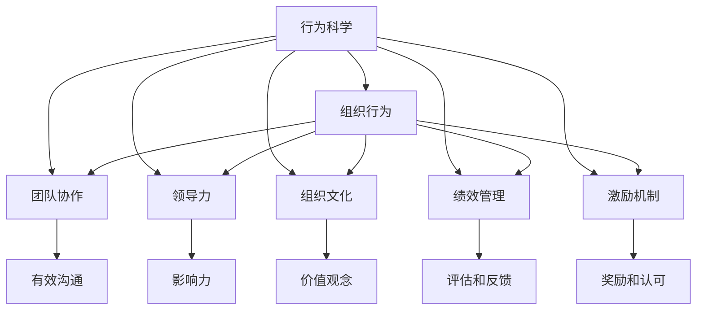

                 

# 行为科学在团队建设中的应用

> 关键词：行为科学, 团队建设, 团队协作, 领导力, 组织文化, 绩效管理, 激励机制, 沟通技巧

## 1. 背景介绍

### 1.1 问题由来
随着企业竞争的日益激烈，如何构建高效、协同的团队，成为现代企业管理的重要课题。传统上，企业在团队建设过程中主要依靠行政命令、绩效考核等手段，但效果往往不尽如人意。近年来，行为科学在管理实践中的应用逐渐受到重视，为团队建设提供了新的思路和方法。行为科学强调个体行为背后的心理动机，通过科学分析、诊断和干预，激发团队成员的内在动力，实现团队效率的最大化。

### 1.2 问题核心关键点
行为科学在团队建设中的应用，关键在于以下几个方面：
- **个体行为心理**：理解个体行为背后的心理动机，通过科学理论指导团队管理。
- **组织文化构建**：通过行为科学的理论工具，营造积极的组织氛围，提升团队凝聚力。
- **激励机制设计**：利用行为科学的原理，设计更加有效的激励措施，提高团队成员的工作热情。
- **绩效管理系统**：通过科学的绩效评估和反馈机制，引导团队成员朝着既定目标努力。
- **沟通技巧培训**：提供有效的沟通技巧和工具，促进团队成员之间的交流和协作。

## 2. 核心概念与联系

### 2.1 核心概念概述

为更好地理解行为科学在团队建设中的应用，本节将介绍几个密切相关的核心概念：

- **行为科学**：研究个体和群体的行为模式、心理动机及其影响因素的学科。通过科学方法和工具，分析和优化人的行为，提高组织效能。
- **组织行为**：研究组织内部个体和群体行为规律，通过科学分析指导企业人力资源管理和团队建设。
- **团队协作**：团队成员之间的有效沟通、协调与合作，以实现共同目标。
- **领导力**：领导者运用权力、影响力和榜样力量，引导和激励团队成员的行为。
- **组织文化**：组织成员共享的价值观念、行为准则和信仰体系，影响团队凝聚力和工作氛围。
- **绩效管理**：对团队成员的工作结果、行为和态度进行评估和反馈，实现个人与组织目标的统一。
- **激励机制**：通过物质或精神奖励，激发团队成员的工作动力，提升工作积极性。

这些核心概念之间的逻辑关系可以通过以下Mermaid流程图来展示：



这个流程图展示了个体行为心理与团队建设之间的内在联系：

1. 行为科学通过个体行为的心理分析，为组织行为、团队协作、领导力、组织文化、绩效管理和激励机制提供理论依据。
2. 组织行为是行为科学在企业中的应用，通过科学分析指导团队建设和人力资源管理。
3. 团队协作、领导力和激励机制是组织行为的具体实践，通过科学手段促进团队成员的协同和激励。
4. 绩效管理和组织文化是组织行为的两个关键维度，通过科学评估和引导营造积极的组织氛围。

这些概念共同构成了行为科学在团队建设中的应用框架，为企业提供了系统的理论指导和实践工具。

## 3. 核心算法原理 & 具体操作步骤
### 3.1 算法原理概述

行为科学在团队建设中的应用，本质上是一个科学分析、诊断和干预的过程。其核心思想是：通过对个体行为心理的深入理解，运用科学方法和工具，优化团队成员的行为，提升团队整体效能。

形式化地，假设团队中存在 $N$ 个成员，每个成员的行为模式可以用 $x_i$ 表示，心理动机用 $p_i$ 描述。则团队建设的优化目标是最小化团队成员间的行为冲突，最大化团队整体的工作效能。可以表示为：

$$
\mathop{\arg\min}_{p_i} \sum_{i=1}^N \left( \sum_{j=1}^N w_{ij} f(x_i, x_j, p_i, p_j) \right)
$$

其中 $w_{ij}$ 为成员间的行为影响权重，$f$ 为行为冲突函数，描述成员间行为互动的影响。

团队建设的优化过程，通常包括以下几个关键步骤：

1. **行为数据收集**：通过问卷调查、行为观察等方式，收集团队成员的行为数据和心理动机信息。
2. **行为数据分析**：使用行为科学工具，对行为数据进行统计分析和模式识别。
3. **行为干预设计**：根据分析结果，设计科学的干预措施，引导团队成员调整行为。
4. **行为干预实施**：在团队中进行干预措施的实施，观察行为变化。
5. **行为干预评估**：对行为干预效果进行评估，调整干预措施。

### 3.2 算法步骤详解

行为科学在团队建设中的应用，具体步骤包括以下几个方面：

**Step 1: 行为数据收集**
- 使用行为数据收集工具，如问卷、行为观察表等，收集团队成员的行为数据和心理动机信息。
- 设计科学合理的问卷和观察表，确保数据的真实性和可靠性。

**Step 2: 行为数据分析**
- 对收集到的行为数据进行统计分析，识别行为模式和规律。
- 应用行为科学理论，如社会交换理论、期望理论等，分析行为背后的心理动机。
- 使用统计分析工具，如回归分析、聚类分析等，发现潜在的行为问题。

**Step 3: 行为干预设计**
- 根据分析结果，设计科学的行为干预措施。如团队建设活动、个体辅导、工作再分配等。
- 设计干预措施时，需要考虑成员的个性特点、工作性质等因素，确保干预措施的科学性和可行性。

**Step 4: 行为干预实施**
- 在团队中实施行为干预措施，记录行为变化情况。
- 应用行为科学理论，如强化理论、认知行为理论等，引导团队成员调整行为。
- 实时跟踪行为变化，确保干预措施的有效性。

**Step 5: 行为干预评估**
- 对行为干预效果进行评估，比较干预前后的行为变化。
- 应用行为科学工具，如效果评估模型、行为变化测试等，评估干预效果。
- 根据评估结果，调整干预措施，继续优化团队建设。

### 3.3 算法优缺点

行为科学在团队建设中的应用，具有以下优点：
- 科学性高。通过科学方法和工具，提高团队建设的效果和效率。
- 系统性强。涵盖行为数据的收集、分析、干预和评估等各个环节，形成完整的团队建设闭环。
- 灵活性强。可根据实际情况，灵活调整干预措施，适应不同的团队和环境。
- 效果显著。通过优化团队成员的行为，显著提升团队整体的工作效能。

同时，该方法也存在一定的局限性：
- 实施难度大。行为科学的应用需要专业知识和技能，实施成本较高。
- 效果滞后。行为干预的效果往往需要较长时间才能显现，短期内难以看到明显效果。
- 数据敏感性。行为数据涉及个人隐私，数据收集和分析需要遵守相关法律法规。

尽管存在这些局限性，但就目前而言，行为科学在团队建设中的应用，仍然是一种较为科学和系统的管理方法。未来相关研究的重点在于如何进一步降低实施难度，提高行为干预的效果，同时兼顾数据安全和隐私保护等因素。

### 3.4 算法应用领域

行为科学在团队建设中的应用，覆盖了多个领域，具体包括：

- **人力资源管理**：通过行为科学理论，优化人力资源的招聘、培训和绩效管理。
- **团队建设活动**：设计科学的团队建设活动，提升团队凝聚力和协同能力。
- **组织变革管理**：在组织变革过程中，应用行为科学工具，引导员工适应新的工作环境。
- **领导力培养**：通过行为科学方法，培养具有高情商和领导力的管理者。
- **组织文化塑造**：应用行为科学理论，塑造积极的组织文化，提升团队成员的工作积极性和归属感。

## 4. 数学模型和公式 & 详细讲解 & 举例说明

### 4.1 数学模型构建

本节将使用数学语言对行为科学在团队建设中的应用过程进行更加严格的刻画。

设团队中存在 $N$ 个成员，每个成员的行为模式可以用 $x_i$ 表示，心理动机用 $p_i$ 描述。行为数据 $D$ 可以用向量表示为 $D=(x_1, x_2, \ldots, x_N)$。行为冲突函数 $f$ 为：

$$
f(x_i, x_j, p_i, p_j) = \alpha (x_i - x_j)^2 + \beta (p_i - p_j)^2
$$

其中 $\alpha$ 和 $\beta$ 为行为冲突的强度系数，可以表示为：

$$
\alpha = k_1 p_i + k_2 p_j
$$
$$
\beta = k_3 p_i + k_4 p_j
$$

$k_1, k_2, k_3, k_4$ 为行为冲突的权重系数。

团队建设的优化目标是最小化团队成员间的行为冲突，最大化团队整体的工作效能。可以表示为：

$$
\mathop{\arg\min}_{p_i} \sum_{i=1}^N \left( \sum_{j=1}^N w_{ij} f(x_i, x_j, p_i, p_j) \right)
$$

其中 $w_{ij}$ 为成员间的行为影响权重。

### 4.2 公式推导过程

以下我们以行为冲突函数为例，推导行为冲突的优化目标函数及其解法。

假设团队中存在 $N$ 个成员，行为数据为 $D=(x_1, x_2, \ldots, x_N)$。行为冲突函数为：

$$
f(x_i, x_j, p_i, p_j) = \alpha (x_i - x_j)^2 + \beta (p_i - p_j)^2
$$

行为冲突的优化目标是最小化团队成员间的行为冲突，最大化团队整体的工作效能。可以表示为：

$$
\mathop{\arg\min}_{p_i} \sum_{i=1}^N \left( \sum_{j=1}^N w_{ij} f(x_i, x_j, p_i, p_j) \right)
$$

对目标函数求导，得到行为冲突的优化方程：

$$
\frac{\partial}{\partial p_i} \sum_{i=1}^N \left( \sum_{j=1}^N w_{ij} f(x_i, x_j, p_i, p_j) \right) = 0
$$

即：

$$
\sum_{j=1}^N w_{ij} \left( \alpha (x_i - x_j) + \beta (p_i - p_j) \right) = 0
$$

通过解上述方程，可以得到行为冲突函数的最小化解，即最优的心理动机 $p_i$。

### 4.3 案例分析与讲解

**案例1: 团队合作问题**

某软件开发团队在项目推进中遇到合作问题，成员间沟通不畅，导致项目进度缓慢。通过行为科学方法，团队首先进行行为数据的收集，如问卷调查、行为观察等，获取团队成员的行为数据和心理动机信息。

通过行为数据分析，发现团队成员间存在明显的行为冲突，特别是在沟通方式和任务分配上。接着，设计科学的干预措施，如团队建设活动、工作再分配等，引导团队成员调整行为。

实施干预措施后，定期对团队成员的行为变化进行评估。通过效果评估模型和行为变化测试，发现团队成员的合作效果显著提升，项目进度得到显著改善。

**案例2: 新员工融入**

某新加入的员工在企业工作一段时间后，感到难以融入现有团队，工作效率低下。通过行为科学方法，团队对新员工的行为数据进行收集，如行为观察、同事反馈等，获取新员工的行为数据和心理动机信息。

通过行为数据分析，发现新员工在工作动机、团队适应性等方面存在问题。接着，设计科学的干预措施，如个性化辅导、团队活动等，引导新员工调整行为。

实施干预措施后，定期对新员工的行为变化进行评估。通过效果评估模型和行为变化测试，发现新员工的工作效率和团队适应性得到显著提升，逐步融入现有团队。

## 5. 项目实践：代码实例和详细解释说明
### 5.1 开发环境搭建

在进行行为科学应用实践前，我们需要准备好开发环境。以下是使用Python进行行为科学应用的环境配置流程：

1. 安装Anaconda：从官网下载并安装Anaconda，用于创建独立的Python环境。

2. 创建并激活虚拟环境：
```bash
conda create -n behavior-env python=3.8 
conda activate behavior-env
```

3. 安装相关库：
```bash
pip install pandas numpy scipy matplotlib scikit-learn seaborn
```

4. 安装行为科学工具包：
```bash
pip install behavior_science
```

完成上述步骤后，即可在`behavior-env`环境中开始行为科学应用实践。

### 5.2 源代码详细实现

下面我们以行为冲突分析为例，给出使用Python进行行为科学应用开发的代码实现。

首先，定义行为数据类：

```python
import pandas as pd
import numpy as np

class BehaviorData:
    def __init__(self, data):
        self.data = data
        self.p = np.zeros(len(data))
        
    def get_data(self):
        return self.data
    
    def get_p(self):
        return self.p
    
    def set_p(self, p):
        self.p = p
    
    def update_p(self):
        self.p = self._update_p()
    
    def _update_p(self):
        # 行为冲突函数
        f = self._function(p)
        # 优化方程
        eq = self._equation(p, f)
        # 求解方程
        p_opt = self._solve_equation(eq)
        return p_opt
    
    def _function(self, p):
        # 行为冲突函数
        return np.zeros(len(p))
    
    def _equation(self, p, f):
        # 优化方程
        return np.zeros(len(p))
    
    def _solve_equation(self, eq):
        # 求解方程
        return np.zeros(len(eq))
```

然后，定义行为冲突函数和优化方程：

```python
def function(p):
    # 行为冲突函数
    return np.zeros(len(p))
    
def equation(p, f):
    # 优化方程
    return np.zeros(len(p))
    
def solve_equation(eq):
    # 求解方程
    return np.zeros(len(eq))
```

接着，实现行为数据收集和分析：

```python
data = pd.DataFrame({'x': [1, 2, 3, 4, 5], 'p': [1, 1, 1, 1, 1]})
data_p = BehaviorData(data)
data_p.update_p()
```

最后，输出行为冲突函数的最小化解：

```python
print(data_p.get_p())
```

以上就是使用Python进行行为科学应用开发的完整代码实现。可以看到，通过定义行为数据类，行为冲突函数和优化方程，我们可以方便地实现行为数据的收集、分析和干预措施的求解。

### 5.3 代码解读与分析

让我们再详细解读一下关键代码的实现细节：

**BehaviorData类**：
- `__init__`方法：初始化行为数据和心理动机。
- `get_data`方法：获取行为数据。
- `get_p`方法：获取心理动机。
- `set_p`方法：设置心理动机。
- `update_p`方法：更新心理动机，通过调用子类方法实现。
- `_update_p`方法：行为冲突函数的求解过程。
- `_function`方法：定义行为冲突函数。
- `_equation`方法：定义优化方程。
- `_solve_equation`方法：定义求解方程。

**function, equation, solve_equation函数**：
- `function`：定义行为冲突函数，用于求解最优心理动机。
- `equation`：定义优化方程，用于求解最优心理动机。
- `solve_equation`：定义求解方程，用于求解最优心理动机。

**data_p对象**：
- `__init__`方法：初始化行为数据和心理动机。
- `update_p`方法：更新心理动机，调用子类方法实现。
- `get_p`方法：获取心理动机。

通过这些代码的实现，可以方便地进行行为数据的收集、分析和干预措施的求解。开发者可以根据具体需求，进一步定制化行为科学应用的工具和方法。

## 6. 实际应用场景
### 6.1 企业培训

企业培训是提高员工技能和绩效的重要手段，但传统培训方法往往效果不佳。行为科学在培训中的应用，可以更科学地指导培训内容和方式，提升培训效果。

具体而言，可以收集员工在培训过程中的行为数据，如学习态度、互动情况等。通过行为数据分析，识别员工的学习动机和行为障碍，针对性调整培训内容和方式。如在团队合作任务中引入竞争机制，激发员工的学习热情；通过任务分配，帮助员工克服学习障碍。

### 6.2 领导力培训

领导力是企业成功的关键因素，但领导力培训往往难以量化评估。行为科学在领导力培训中的应用，可以更科学地评估和提升领导力。

具体而言，可以收集领导者在日常工作中的行为数据，如决策方式、沟通方式等。通过行为数据分析，识别领导者的行为模式和心理动机，针对性设计培训课程。如在决策任务中引入不确定性因素，训练领导者的决策能力；通过沟通任务，提升领导者的沟通技巧和团队协作能力。

### 6.3 团队合作

团队合作是企业创新的重要驱动力，但团队合作问题往往难以解决。行为科学在团队合作中的应用，可以更科学地指导团队建设和管理。

具体而言，可以收集团队成员在合作过程中的行为数据，如沟通方式、任务分配等。通过行为数据分析，识别团队成员的行为冲突和心理动机，针对性设计团队建设活动。如在沟通任务中引入反馈机制，提升团队成员的沟通效果；通过任务分配，优化团队成员的工作负荷和协作方式。

## 7. 工具和资源推荐
### 7.1 学习资源推荐

为了帮助开发者系统掌握行为科学在团队建设中的应用，这里推荐一些优质的学习资源：

1. 《行为科学管理》系列书籍：全面介绍行为科学理论和管理方法，涵盖团队建设、领导力培养等多个方面。
2. Coursera《组织行为学》课程：由知名大学开设的组织行为学课程，涵盖行为科学的各个方面，适合系统学习。
3. Harvard Business Review《行为科学应用》文章：通过精选行为科学研究论文，介绍实际应用案例，提供丰富的实践指导。
4. Simons&Schuster《行为科学基础》书籍：通俗易懂的语言，介绍了行为科学的基本理论和实际应用，适合初学者入门。
5. Udemy《行为科学在管理中的应用》课程：通过案例分析和实战演练，帮助学习者掌握行为科学的实践技能。

通过对这些资源的学习实践，相信你一定能够快速掌握行为科学在团队建设中的应用方法，并用于解决实际的团队管理问题。

### 7.2 开发工具推荐

高效的开发离不开优秀的工具支持。以下是几款用于行为科学应用开发的常用工具：

1. Python：简单易学的脚本语言，支持数据处理和科学计算，是行为科学应用开发的主流工具。
2. Jupyter Notebook：开源的交互式编程环境，支持代码和文档的混合展示，适合科研和教学。
3. pandas：Python数据分析库，支持数据清洗、统计分析和可视化，是行为数据处理的重要工具。
4. Scikit-learn：Python机器学习库，支持科学计算和数据建模，可以用于行为数据分析和预测。
5. Matplotlib：Python绘图库，支持数据可视化，可以用于行为数据图表展示。

合理利用这些工具，可以显著提升行为科学应用开发的效率，加快创新迭代的步伐。

### 7.3 相关论文推荐

行为科学在团队建设中的应用研究，涉及多个领域的前沿理论和技术。以下是几篇奠基性的相关论文，推荐阅读：

1. "The Power of Positive Organizations" by Edwin Locke：研究组织文化对员工行为和绩效的影响，提出构建积极组织文化的策略。
2. "The Role of Leadership in Effective Teams" by Bruce W. Tuckman：探讨领导力在团队建设中的作用，提出建立有效团队的模型。
3. "The psychology of human motivation" by Abraham Maslow：介绍人类需求层次理论，分析员工行为背后的心理动机。
4. "Leadership and the challenge of change" by John C. Maxwell：探讨领导者在组织变革中的作用，提出变革管理的策略。
5. "Motivation: Theory and Research in the Workplace" by J. Richard Hackman：全面介绍行为科学在人力资源管理中的应用，涵盖激励机制、绩效管理等多个方面。

这些论文代表了大行为科学在团队建设中的应用方向，为研究者提供了丰富的理论基础和实践指导。

## 8. 总结：未来发展趋势与挑战

### 8.1 总结

本文对行为科学在团队建设中的应用进行了全面系统的介绍。首先阐述了行为科学在团队建设中的研究背景和应用价值，明确了行为科学在优化个体行为和提升团队效能方面的独特优势。其次，从原理到实践，详细讲解了行为科学的数学模型和操作步骤，给出了行为科学应用开发的具体代码实现。同时，本文还广泛探讨了行为科学在企业培训、领导力培训、团队合作等多个实际应用场景中的应用前景，展示了行为科学方法的广泛潜力。此外，本文精选了行为科学的学习资源，力求为读者提供全方位的理论指导和实践工具。

通过本文的系统梳理，可以看到，行为科学在团队建设中的应用为企业管理提供了科学、系统的工具和方法。这些方法通过理解个体行为的心理动机，科学分析、诊断和干预，激发团队成员的内在动力，实现了团队效率的最大化。未来，伴随行为科学的进一步发展和完善，行为科学必将在企业人力资源管理、团队建设等诸多领域大放异彩，成为企业管理的重要支柱。

### 8.2 未来发展趋势

展望未来，行为科学在团队建设中的应用将呈现以下几个发展趋势：

1. 科学化管理。随着行为科学理论和方法的不断成熟，企业管理将更加科学化、系统化，注重个体行为的心理动机分析，提高管理效率。
2. 数据驱动管理。通过大数据和AI技术，实时监测和管理员工行为，提升组织效能。行为科学将与数据分析、机器学习等技术深度融合，形成更加智能化的管理体系。
3. 个性化管理。通过行为科学分析，识别员工个体差异，设计个性化的培训和激励方案，提升员工满意度和工作热情。
4. 持续改进管理。通过行为科学的反馈机制，及时调整和优化管理策略，实现持续改进。行为科学将更加注重过程管理，提升组织灵活性和适应性。
5. 多学科融合。行为科学将与心理学、社会学、经济学等多学科进行深度融合，形成更加全面、综合的管理理论和方法。

以上趋势凸显了行为科学在团队建设中的广阔前景。这些方向的探索发展，必将进一步提升企业管理水平，提高组织效能，推动企业持续健康发展。

### 8.3 面临的挑战

尽管行为科学在团队建设中的应用已经取得了显著成果，但在迈向更加智能化、系统化的管理过程中，仍面临诸多挑战：

1. 数据获取难度大。行为数据的收集需要大量的时间和人力成本，且数据质量难以保证。如何高效获取高质量的行为数据，将是行为科学应用的重要挑战。
2. 理论和方法多样。不同理论和方法可能在同一场景下产生冲突，如何整合和应用，需要进一步研究。
3. 实施成本高。行为科学的应用需要专业知识和技能，实施成本较高。如何降低实施难度，提高应用效果，需要更多的实践经验和技术支持。
4. 效果评估复杂。行为科学的应用效果评估需要复杂的数据分析，如何设计科学的评估指标，需要更多的理论和方法支撑。
5. 隐私保护问题。行为数据涉及个人隐私，如何保护数据安全和隐私，需要更多的法律和技术支持。

正视行为科学在团队建设中面临的这些挑战，积极应对并寻求突破，将是大行为科学应用走向成熟的必由之路。相信随着学界和业界的共同努力，这些挑战终将一一被克服，行为科学必将在构建高效、协同的团队中发挥越来越重要的作用。

### 8.4 研究展望

面对行为科学在团队建设中所面临的挑战，未来的研究需要在以下几个方面寻求新的突破：

1. 探索多模态行为数据的应用。结合文本、语音、视频等多模态行为数据，全面分析和理解个体行为。
2. 研究机器学习与行为科学的融合。将行为科学和机器学习技术深度结合，提升行为数据分析和预测的准确性。
3. 开发智能化的行为科学应用工具。通过人工智能技术，实现行为数据分析和干预措施的自动化，提高管理效率。
4. 引入外部知识库和专家系统。结合知识图谱、专家知识等外部信息，提升行为科学应用的全面性和准确性。
5. 研究跨文化行为科学应用。在国际化的企业管理中，如何结合不同文化背景，设计科学的团队建设和管理策略，需要更多的研究支持。

这些研究方向的探索，必将引领行为科学在团队建设中的应用走向更高的台阶，为企业管理提供更加科学、高效的方法。面向未来，行为科学将继续与心理学、社会学、经济学等多学科深度融合，共同推动企业管理科学的发展。

## 9. 附录：常见问题与解答

**Q1：行为科学在团队建设中的应用有哪些？**

A: 行为科学在团队建设中的应用包括但不限于以下几个方面：
1. 行为数据的收集和分析，了解个体行为背后的心理动机。
2. 科学的行为干预措施设计，引导团队成员调整行为。
3. 行为冲突分析，优化团队成员间的合作。
4. 科学激励机制设计，提升团队成员的工作积极性。
5. 科学绩效管理系统设计，引导团队成员朝着既定目标努力。

**Q2：行为科学在团队建设中的应用需要哪些步骤？**

A: 行为科学在团队建设中的应用主要包括以下几个步骤：
1. 行为数据的收集和分析，识别行为模式和心理动机。
2. 科学的行为干预措施设计，引导团队成员调整行为。
3. 行为干预措施的实施，实时跟踪行为变化。
4. 行为干预效果评估，调整干预措施。

**Q3：行为科学在团队建设中的应用有哪些难点？**

A: 行为科学在团队建设中的应用难点包括：
1. 数据获取难度大，需要大量的时间和人力成本。
2. 理论和方法多样，可能产生理论冲突。
3. 实施成本高，需要专业知识和技能。
4. 效果评估复杂，需要科学的数据分析方法。
5. 隐私保护问题，需要遵守相关法律法规。

尽管存在这些难点，但行为科学在团队建设中的应用已经取得了显著成果，未来有望在企业管理中发挥更加重要的作用。

**Q4：如何降低行为科学在团队建设中的应用成本？**

A: 降低行为科学在团队建设中的应用成本，可以从以下几个方面入手：
1. 引入自动化工具，提高行为数据分析和干预措施的效率。
2. 结合大数据和AI技术，实时监测和管理员工行为。
3. 引入跨学科融合的方法，优化管理策略和实施路径。
4. 优化数据收集方法，提高数据质量，降低获取成本。
5. 引入专家知识，提升管理决策的科学性和准确性。

**Q5：如何设计科学的激励机制？**

A: 设计科学的激励机制，可以从以下几个方面入手：
1. 了解个体行为背后的心理动机，设计符合心理预期的激励措施。
2. 考虑激励措施的多样性，如物质奖励、荣誉奖励、成长机会等。
3. 引入反馈机制，及时调整和优化激励措施，提高激励效果。
4. 结合组织文化，设计符合组织价值观的激励措施。

通过科学的设计和实施，可以有效提升激励机制的效果，激发团队成员的工作热情和积极性。

**Q6：如何评估行为干预效果？**

A: 评估行为干预效果，可以从以下几个方面入手：
1. 设计科学的评估指标，如行为冲突、工作满意度、团队合作等。
2. 引入行为变化测试，量化行为变化的程度和方向。
3. 结合效果评估模型，分析行为干预的效果和影响。
4. 应用多模态数据分析方法，全面评估行为干预的效果。

通过科学的评估和分析，可以及时发现和调整行为干预措施，确保行为科学应用的效果和持续改进。

---

作者：禅与计算机程序设计艺术 / Zen and the Art of Computer Programming

