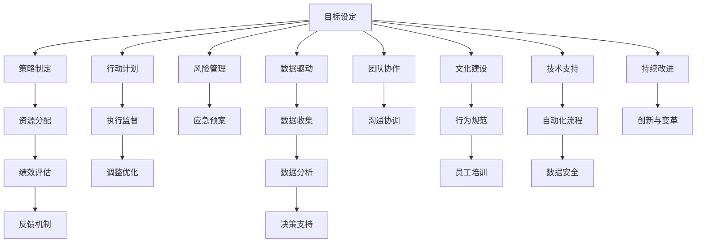

                 

# 行动体系与管理效率的关系

## 1. 背景介绍

在现代企业的运营过程中，管理效率的高低直接影响着企业的竞争力。而行动体系，作为企业管理的核心组成部分，其设计与实施对企业整体运行有着深远的影响。本文将深入探讨行动体系与企业管理效率之间的关系，帮助企业理解如何通过构建和优化行动体系，提高管理效率，提升企业竞争力。

## 2. 核心概念与联系

### 2.1 核心概念概述

#### 2.1.1 行动体系
行动体系指的是企业内部通过一系列规划、流程和机制来指导和协调员工的行为和决策的体系。它包括目标设定、策略制定、资源分配、绩效评估等多个方面，是企业实现其战略目标的基石。

#### 2.1.2 管理效率
管理效率是指企业内部管理活动的输出与投入的比率。它不仅包括资源的有效利用，还涵盖了组织决策、流程优化、人员配备、绩效考核等多个维度。高效的管理体系能够最大限度地发挥企业资源的价值，实现更快的决策速度和更精准的执行。

### 2.2 核心概念原理和架构的 Mermaid 流程图



### 2.3 核心概念联系

行动体系与管理效率之间的关系主要体现在以下几个方面：

- **指导与约束**：行动体系为员工提供了明确的行动指南，帮助他们更高效地完成任务，同时通过规则和流程的约束，防止资源浪费和决策失误。
- **协调与优化**：通过跨部门的协调和优化，确保信息流畅、决策一致，提升整体执行效率。
- **反馈与改进**：反馈机制和持续改进机制能够及时识别问题，调整策略，避免陷入僵化，提升动态适应能力。
- **数据与决策**：数据驱动的行动体系能够提供更准确的信息，支持科学的决策制定，避免主观臆断。

## 3. 核心算法原理 & 具体操作步骤

### 3.1 算法原理概述

行动体系的构建和管理效率的提升，实际上是一个动态调整和优化的过程。其核心在于通过一系列的算法和步骤，不断迭代优化，以达到目标。

#### 3.1.1 目标设定算法
目标设定是行动体系的首要步骤。目标设定算法（如SMART目标设定法）帮助企业明确其短期和长期目标，确保这些目标具有具体性（Specific）、可衡量性（Measurable）、可达成性（Achievable）、相关性（Relevant）、时限性（Time-bound）。

#### 3.1.2 策略制定算法
策略制定算法（如层次分析法、线性规划等）用于分析内部资源和外部环境，确定最优策略。它考虑资源的限制、风险因素和竞争态势，为企业的行动方向提供指导。

#### 3.1.3 资源分配算法
资源分配算法（如线性规划、整数规划等）用于优化资源（包括人力、财力、物力）的使用，确保资源配置的合理性和效率最大化。

#### 3.1.4 绩效评估算法
绩效评估算法（如平衡计分卡、KPI等）用于衡量企业的绩效，提供客观、量化的反馈，帮助管理层调整行动策略。

### 3.2 算法步骤详解

#### 3.2.1 目标设定步骤
1. **明确愿景与使命**：企业愿景和使命为战略目标的制定提供了方向和基础。
2. **SMART目标设定**：将愿景和使命转化为具体、可衡量、可达成的短期和长期目标。
3. **目标分解**：将宏观目标分解为具体的行动计划，明确时间节点和责任人。

#### 3.2.2 策略制定步骤
1. **内部资源分析**：评估企业内部的资源状况，包括人力、技术、资金等。
2. **外部环境分析**：分析市场环境、竞争对手和行业趋势。
3. **SWOT分析**：综合内部优势、劣势、外部机会和威胁，制定相应的策略。
4. **策略优化**：通过模拟和优化算法，调整策略以最大化目标达成。

#### 3.2.3 资源分配步骤
1. **资源盘点**：全面了解企业的资源现状。
2. **需求预测**：根据行动计划预测资源需求。
3. **优化分配**：通过算法优化资源分配，确保资源的高效利用。
4. **动态调整**：根据执行情况动态调整资源分配，确保灵活应对变化。

#### 3.2.4 绩效评估步骤
1. **关键绩效指标（KPI）设定**：确定影响企业目标达成的关键指标。
2. **数据收集与分析**：定期收集相关数据，进行量化分析。
3. **评估与反馈**：将评估结果反馈给相关部门，指导下一步行动。
4. **持续改进**：根据评估结果，优化行动计划和资源配置。

### 3.3 算法优缺点

#### 3.3.1 优点
1. **系统化管理**：通过算法将管理过程系统化，提高了管理的科学性和规范性。
2. **资源优化**：通过算法优化资源分配，提升了资源利用效率。
3. **决策支持**：算法提供的数据分析支持了科学决策。

#### 3.3.2 缺点
1. **算法复杂**：不同算法适用于不同的情境，需要根据具体情况选择合适的算法。
2. **数据质量**：算法的输出依赖于输入数据的质量，数据不完整或不准确会影响结果。
3. **执行难度**：算法需要一定的技术支撑和执行力度，可能存在执行难度大的问题。

### 3.4 算法应用领域

行动体系与管理效率的关系不仅限于某一特定领域，而是广泛应用于企业的各个方面。以下是几个典型的应用领域：

- **制造业**：通过流程优化和资源配置算法，提高生产效率和质量。
- **服务业**：通过服务流程分析和客户反馈机制，提升服务质量和客户满意度。
- **金融业**：通过风险管理和绩效评估算法，优化投资决策和风险控制。
- **零售业**：通过供应链管理和库存优化算法，提高运营效率和市场响应速度。

## 4. 数学模型和公式 & 详细讲解 & 举例说明

### 4.1 数学模型构建

本节将使用数学语言对行动体系与管理效率的关系进行更加严格的刻画。

假设企业有 $n$ 个项目，每个项目的目标成本为 $c_i$，收益为 $r_i$，时间周期为 $t_i$。记总成本为 $C$，总收益为 $R$，总时间为 $T$。目标是最大化总收益 $R$ 和最小化总成本 $C$。

定义目标函数和约束条件如下：

$$
R = \sum_{i=1}^{n} r_i
$$

$$
C = \sum_{i=1}^{n} c_i
$$

$$
T = \sum_{i=1}^{n} t_i
$$

目标函数为最大化总收益，约束条件包括总成本不超过预算 $C_{max}$ 和总时间不超过周期 $T_{max}$。

$$
\max R \\
\text{s.t. } C \leq C_{max} \\
T \leq T_{max}
$$

### 4.2 公式推导过程

以线性规划为例，通过Lagrange乘数法求解上述优化问题。

设Lagrange乘数为 $\lambda$，构造Lagrange函数：

$$
L = R - \lambda(C - C_{max}) - \mu(T - T_{max})
$$

对 $L$ 关于 $c_i$ 和 $t_i$ 求偏导数，并令其等于0：

$$
\frac{\partial L}{\partial c_i} = r_i - \lambda = 0 \Rightarrow \lambda = r_i
$$

$$
\frac{\partial L}{\partial t_i} = 0 \Rightarrow \mu = 0
$$

将 $\lambda = r_i$ 代入总成本约束和总时间约束，得：

$$
\sum_{i=1}^{n} r_i c_i \leq C_{max}
$$

$$
\sum_{i=1}^{n} t_i \leq T_{max}
$$

求解上述线性规划问题，得到最优的资源分配方案，从而实现管理效率的提升。

### 4.3 案例分析与讲解

以一家制造企业的生产流程优化为例，分析如何通过行动体系提高管理效率。

**案例背景**：一家汽车制造企业面临生产效率低下和成本高企的问题，需要通过行动体系进行优化。

**目标设定**：企业设定了提高生产效率20%的目标，并制定了详细的时间节点和责任人。

**策略制定**：企业通过市场分析和内部资源评估，确定了优化生产流程的策略。

**资源分配**：企业通过线性规划算法，优化了生产线的布局和设备的配置，提高了资源利用效率。

**绩效评估**：企业每月进行绩效评估，根据评估结果调整生产计划。

**改进措施**：根据评估结果，企业进一步优化了供应链管理和质量控制流程。

经过一系列的优化措施，该企业实现了生产效率提升20%，成本降低15%，并在市场中获得了更大的竞争力。

## 5. 项目实践：代码实例和详细解释说明

### 5.1 开发环境搭建

在进行行动体系优化实践前，我们需要准备好开发环境。以下是使用Python进行Scipy和Pandas开发的开发环境配置流程：

1. 安装Anaconda：从官网下载并安装Anaconda，用于创建独立的Python环境。

2. 创建并激活虚拟环境：
```bash
conda create -n action-env python=3.8 
conda activate action-env
```

3. 安装Scipy和Pandas：
```bash
conda install scipy pandas
```

4. 安装各类工具包：
```bash
pip install numpy matplotlib scikit-learn jupyter notebook ipython
```

完成上述步骤后，即可在`action-env`环境中开始行动体系优化实践。

### 5.2 源代码详细实现

我们以制造业生产流程优化为例，给出使用Scipy和Pandas进行线性规划优化的PyTorch代码实现。

首先，定义生产流程的数据结构：

```python
import pandas as pd
import numpy as np
from scipy.optimize import linprog

# 定义生产流程数据
production_data = pd.DataFrame({
    'cost': [10, 15, 20],
    'revenue': [25, 30, 35],
    'time': [1, 2, 3]
})
```

然后，定义目标函数和约束条件：

```python
# 定义目标函数和约束条件
c = np.array([25, 30, 35])
A = np.array([[1, 1, 1], [0, 0, 1], [0, 1, 0]])
b = np.array([100, 30, 20])
A_ub = np.array([[0, 0, 1]])
b_ub = np.array([50])
```

接着，使用线性规划算法进行优化：

```python
# 使用线性规划算法进行优化
res = linprog(c, A_ub=A, b_ub=b_ub, bounds=(0, None))
print(res)
```

最后，输出优化结果：

```python
# 输出优化结果
print("Optimal objective:", res.fun)
print("Optimal variables:", res.x)
```

### 5.3 代码解读与分析

让我们再详细解读一下关键代码的实现细节：

**生产流程数据结构**：
- 使用Pandas库定义了生产流程的数据结构，其中包含成本、收益和时间三个关键指标。

**目标函数和约束条件**：
- 定义了目标函数和约束条件的数组，通过Scipy库的linprog函数求解最优解。

**线性规划算法**：
- 使用linprog函数进行线性规划求解，输出最优解。

**优化结果解读**：
- 输出优化后的总收益和各生产线的最优投入比例，指导企业进行资源分配。

## 6. 实际应用场景

### 6.1 智能制造

在智能制造领域，行动体系的应用可以显著提升生产效率和产品质量。通过优化生产流程、设备配置和资源分配，智能制造企业能够实现高度的自动化和智能化，减少人为误差，提高生产效率。

### 6.2 供应链管理

供应链管理是企业管理的核心环节，涉及物料采购、库存管理、物流配送等多个方面。通过建立科学、高效的供应链行动体系，企业可以优化供应链流程，减少库存成本，提高物流效率。

### 6.3 项目管理

项目管理是企业运营中的重要环节，涉及项目规划、资源分配、进度控制等多个方面。通过建立科学、规范的项目管理行动体系，企业可以确保项目的顺利进行，提高项目成功率。

### 6.4 未来应用展望

随着行动体系的不断优化和扩展，其在企业管理中的应用前景将更加广阔。未来，行动体系将在以下几个方面发挥更大作用：

1. **跨部门协作**：通过建立统一行动体系，实现部门之间的无缝协作，提高整体运营效率。
2. **智能化决策**：通过引入大数据和人工智能技术，提高决策的科学性和准确性。
3. **全球化运营**：通过建立全球化的行动体系，支持企业的国际业务扩展。
4. **可持续发展**：通过引入环境和社会责任指标，支持企业的可持续发展。

## 7. 工具和资源推荐

### 7.1 学习资源推荐

为了帮助企业系统掌握行动体系的设计和优化，这里推荐一些优质的学习资源：

1. 《行动体系设计与优化》系列博文：由行动体系专家撰写，深入浅出地介绍了行动体系的设计原理、优化方法和实际案例。

2. 《项目管理基础》课程：由知名培训机构开设的项目管理课程，系统讲解项目管理的核心概念和最佳实践。

3. 《供应链管理与优化》书籍：介绍供应链管理的理论和实践，涵盖物流、库存、采购等多个方面。

4. 《智能制造与自动化》课程：介绍智能制造的原理和实践，涵盖生产流程优化、自动化设备配置等多个环节。

5. 《行动体系与战略管理》学术期刊：提供最新的行动体系研究成果，涵盖战略规划、执行和评估等多个方面。

通过对这些资源的学习实践，相信企业能够掌握行动体系的设计和优化方法，提升管理效率。

### 7.2 开发工具推荐

高效的开发离不开优秀的工具支持。以下是几款用于行动体系设计和管理效率优化的常用工具：

1. Python：作为编程语言中的佼佼者，Python拥有丰富的科学计算库和数据处理工具，适合进行行动体系的数据分析和算法实现。

2. Scipy：开源科学计算库，提供多种数学优化算法，适合进行行动体系中的线性规划、非线性规划等优化计算。

3. Pandas：开源数据处理库，支持高效的数据存储和分析，适合进行行动体系中的数据处理和报表生成。

4. Microsoft Power BI：数据可视化工具，支持企业数据报表和指标分析，帮助企业进行数据驱动的决策。

5. Tableau：数据可视化工具，支持企业数据的探索和洞察，帮助企业发现数据背后的规律和趋势。

合理利用这些工具，可以显著提升行动体系的设计和优化效率，加快企业创新迭代的步伐。

### 7.3 相关论文推荐

行动体系的设计和优化是管理学和工程学的前沿研究领域，以下是几篇奠基性的相关论文，推荐阅读：

1. "A Study on Action System Design in Manufacturing Enterprises"（《制造业企业行动体系设计研究》）
2. "The Impact of Project Management on Organization Performance"（《项目管理对组织绩效的影响》）
3. "Supply Chain Management and Optimization: A Review"（《供应链管理与优化综述》）
4. "Intelligent Manufacturing: Concepts, Challenges and Opportunities"（《智能制造概念、挑战与机遇》）
5. "Strategic Action System Design and Optimization"（《战略行动体系的设计与优化》）

这些论文代表了行动体系研究的最新进展，通过学习这些前沿成果，可以帮助企业理解和应用行动体系，提升管理效率。

## 8. 总结：未来发展趋势与挑战

### 8.1 研究成果总结

本文对行动体系与管理效率的关系进行了深入探讨，通过系统化的理论分析和实际案例，揭示了行动体系在企业管理中的重要作用。

### 8.2 未来发展趋势

展望未来，行动体系与管理效率的关系将呈现出以下几个趋势：

1. **数字化转型**：随着数字化转型的深入，行动体系将更加依赖于大数据和人工智能技术，实现智能化和自动化。
2. **全球化拓展**：企业在全球化的进程中，需要建立全球化的行动体系，支持跨国运营和供应链管理。
3. **可持续发展**：行动体系将更加注重环境和社会责任，支持企业的可持续发展。
4. **协同创新**：企业间的协同创新将推动行动体系的发展，形成产业生态链。

### 8.3 面临的挑战

尽管行动体系在企业管理中具有重要作用，但在应用过程中也面临一些挑战：

1. **数据质量**：数据的质量和完整性直接影响行动体系的效果，如何获取和处理高质量的数据是关键。
2. **组织变革**：行动体系的引入需要组织变革，如何协调和引导各部门参与，是成功实施的难点。
3. **技术门槛**：行动体系的设计和优化需要一定的技术支撑，如何降低技术门槛，使更多企业能够应用，是未来的方向。
4. **动态调整**：行动体系需要根据外部环境的变化进行动态调整，如何保持其灵活性和适应性，是重要的挑战。

### 8.4 研究展望

面向未来，行动体系的研究需要在以下几个方面寻求新的突破：

1. **跨领域融合**：将行动体系与业务、财务、技术等多个领域进行融合，形成综合管理体系。
2. **模型优化**：引入更多优化算法，提高行动体系的科学性和准确性。
3. **场景应用**：探索行动体系在更多场景中的应用，如智能制造、智慧城市、公共服务等。
4. **算法迭代**：引入更多算法迭代机制，实现行动体系的持续优化。

这些研究方向的探索，必将引领行动体系管理效率的提升，为企业的可持续发展提供坚实的保障。总之，行动体系的设计和优化需要企业从多个维度进行系统化思考和实践，方能取得理想的效果。

## 9. 附录：常见问题与解答

**Q1：行动体系设计与优化过程中需要注意哪些问题？**

A: 行动体系设计与优化过程中需要注意以下几个问题：
1. **目标明确**：确保目标设定SMART原则，明确行动方向。
2. **资源匹配**：合理评估企业资源状况，确保资源匹配。
3. **风险管理**：引入风险管理机制，规避风险。
4. **绩效评估**：建立科学的绩效评估体系，持续优化。

**Q2：如何选择合适的行动体系设计算法？**

A: 选择合适的行动体系设计算法需要考虑以下几个方面：
1. **问题类型**：根据问题的性质选择合适的算法，如线性规划、整数规划、动态规划等。
2. **数据质量**：评估数据的质量和完整性，选择适合的算法。
3. **复杂度**：考虑算法的复杂度和执行效率，选择合适的算法。

**Q3：行动体系实施过程中如何协调各部门？**

A: 行动体系实施过程中协调各部门需要注意以下几个方面：
1. **明确职责**：明确各部门在行动体系中的职责和任务。
2. **建立沟通机制**：建立高效的沟通机制，确保信息流畅。
3. **建立反馈机制**：建立反馈机制，及时发现和解决问题。

**Q4：如何提高行动体系的应用效果？**

A: 提高行动体系的应用效果需要注意以下几个方面：
1. **持续优化**：持续优化行动体系，根据实际情况进行调整。
2. **数据驱动**：引入数据驱动的管理理念，通过数据分析指导决策。
3. **全员参与**：加强全员参与，提升员工的积极性和执行力。

**Q5：行动体系在企业管理中的作用是什么？**

A: 行动体系在企业管理中的作用主要体现在以下几个方面：
1. **提高效率**：通过科学规划和流程优化，提高管理效率。
2. **降低成本**：通过资源优化和绩效评估，降低管理成本。
3. **提升质量**：通过严格的质量控制，提升产品和服务的质量。
4. **促进创新**：通过创新机制，激发员工的创造力。

---

作者：禅与计算机程序设计艺术 / Zen and the Art of Computer Programming

