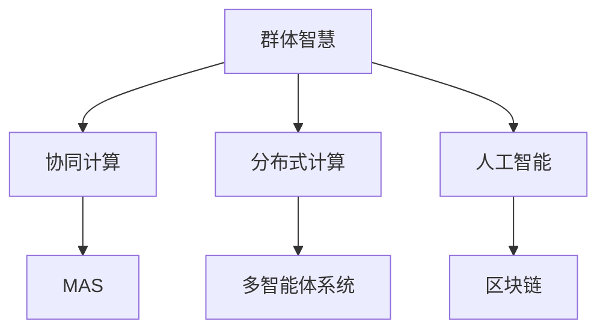

                 

## 1. 背景介绍

在当今数字化时代，计算机技术的快速发展已经深刻改变了人类的计算模式。从超级计算机到分布式云计算，从人工智能到量子计算，计算资源和技术的可获取性大大提升。然而，面对日益复杂多变的计算问题，单台计算机或单一技术手段已经难以胜任。如何利用群体智慧，协同解决计算难题，成为了当前研究的热点。

### 1.1 问题的由来

在人类历史的长河中，群体智慧一直扮演着重要角色。无论是古代的集体劳动、群策群力，还是现代社会的协同创新、众包项目，群体智慧都是人类解决问题的重要途径。在计算机科学中，随着分布式计算、网络协作、人工智能等技术的发展，群体智慧也越来越多地被应用于计算问题的解决中。

然而，如何高效、安全、可靠地利用群体智慧，仍是一大挑战。一方面，传统集群计算和分布式计算系统存在任务调度效率低、节点异构性难管理等问题。另一方面，人工智能技术虽然可以处理复杂的计算任务，但其黑盒特性也限制了其解释性和可控性。因此，如何结合群体智慧和人工智能技术，构建更加高效、透明的计算系统，是当前研究的核心方向之一。

### 1.2 问题核心关键点

在探索群体智慧的计算过程中，有几个关键点值得关注：

- **协同计算模型**：如何构建协同计算模型，使得计算任务能够在多个节点之间高效分配和协作，是群体智慧计算的基础。
- **任务调度算法**：如何设计高效的任务调度算法，使得计算任务能够在不同节点间平衡分配，充分利用资源。
- **数据一致性**：如何保证不同节点间的数据一致性，避免因数据更新或同步问题导致的计算错误。
- **人工智能与群体智慧的融合**：如何将人工智能技术融入群体智慧计算中，提升计算效率和准确性。
- **系统安全和可靠性**：如何构建安全和可靠的系统，避免因节点故障或恶意攻击导致的计算失效。

## 2. 核心概念与联系

### 2.1 核心概念概述

为更好地理解群体智慧的计算过程，本节将介绍几个密切相关的核心概念：

- **群体智慧**：指在群体中各成员通过协作、共享和交互，共同解决复杂问题的智慧。在计算中，群体智慧可以理解为多个计算节点协同工作，共同完成计算任务。
- **协同计算**：指多个计算节点之间协同工作，共享资源和信息，共同完成任务。协同计算需要有效的任务分配、数据同步和协调机制。
- **分布式计算**：指将计算任务分布到多个节点上，通过并行计算提高效率。分布式计算是协同计算的一种形式，但更强调任务并行和负载均衡。
- **人工智能**：指通过机器学习、深度学习等技术，使计算机能够模拟人类智能过程，自主学习和解决复杂问题。
- **多智能体系统(MAS)**：指由多个智能体构成的分布式系统，各智能体通过通信和协作解决复杂问题。MAS是群体智慧计算的一种形式，能够更好地利用各智能体的优势，实现整体最优。
- **区块链**：指一种去中心化的分布式数据库技术，通过共识机制保证数据的安全和一致性。区块链在分布式计算中也有广泛应用，如智能合约、去中心化应用等。

这些核心概念之间的逻辑关系可以通过以下Mermaid流程图来展示：



这个流程图展示了几大核心概念之间的关系：

1. 群体智慧通过协同计算和分布式计算实现资源共享和任务并行。
2. 人工智能可以提升协同计算的效率和准确性。
3. 多智能体系统是一种群体智慧的计算形式，可以更好地利用各智能体的优势。
4. 区块链技术保证了分布式计算中的数据安全和一致性。

这些概念共同构成了群体智慧计算的理论基础，使其能够高效、安全、可靠地解决复杂计算问题。

## 3. 核心算法原理 & 具体操作步骤

### 3.1 算法原理概述

群体智慧的计算过程通常可以分为以下几个步骤：

1. **任务分解**：将复杂的计算任务分解为多个子任务，分配给不同的计算节点。
2. **节点协同**：各计算节点之间通过网络通信和协作，共同完成子任务。
3. **结果合并**：将各节点的计算结果汇总，得到最终结果。

在算法实现上，常见的方法包括MapReduce、Spark、Flink等。这些算法通过将任务分解为多个Map和Reduce操作，实现高效的并行计算和数据处理。

### 3.2 算法步骤详解

以下是基于MapReduce的协同计算算法的详细步骤：

1. **任务划分**：将计算任务分为若干个小任务，每个小任务在单个节点上执行。
2. **节点执行**：各节点并行执行小任务，通过Map操作将输入数据转换为中间结果。
3. **数据交换**：节点间通过网络交换中间结果，进行数据通信和协调。
4. **最终合并**：各节点通过Reduce操作将中间结果汇总，得到最终结果。

具体来说，假设要计算一个数值积分任务，可以将其分解为若干个小区间上的积分计算，每个节点计算一个区间上的积分。节点之间通过网络交换区间的积分结果，并最终汇总得到总积分。

### 3.3 算法优缺点

基于MapReduce的协同计算算法具有以下优点：

- **高效并行**：能够利用多个节点的计算能力，提高计算效率。
- **任务灵活**：能够处理不同类型和规模的计算任务。
- **容错性强**：单个节点的故障不会影响整个计算过程。

同时，该算法也存在一定的局限性：

- **节点异构性**：不同节点的计算能力和网络带宽可能存在差异，影响计算效率。
- **通信开销**：节点间的通信开销较大，可能成为性能瓶颈。
- **任务协调**：需要设计有效的任务协调机制，避免任务冲突和数据不一致。

### 3.4 算法应用领域

基于MapReduce的协同计算算法在多个领域都有广泛应用，例如：

- **大数据处理**：如Hadoop、Spark等分布式计算框架。
- **科学计算**：如天气模拟、物理仿真等计算密集型任务。
- **人工智能**：如分布式深度学习训练、模型并行等。
- **云计算**：如弹性计算资源管理、负载均衡等。
- **物联网**：如数据采集、边缘计算等。

除了上述这些经典应用外，协同计算还被应用于更多新兴领域，如区块链、智慧城市、金融科技等，推动了这些行业的数字化转型。

## 4. 数学模型和公式 & 详细讲解  
### 4.1 数学模型构建

本节将使用数学语言对协同计算的模型构建进行更加严格的刻画。

假设有一个计算任务，输入数据为 $X$，需要计算输出数据 $Y$。该任务可以分解为多个子任务，每个子任务的输入为 $X_i$，输出为 $Y_i$。各子任务在节点 $N_1, N_2, ..., N_k$ 上并行执行，最终结果为 $Y$。

定义节点 $N_i$ 的计算函数为 $f_i$，则整体计算过程可以表示为：

$$
Y = \sum_{i=1}^k f_i(X_i)
$$

其中 $f_i$ 为节点 $N_i$ 的局部计算函数。

### 4.2 公式推导过程

在MapReduce框架下，计算过程可以进一步分解为Map和Reduce两个步骤。假设每个节点计算一个小子任务 $X_i$，Map函数 $m_i$ 将 $X_i$ 转换为中间结果 $Z_i$，Reduce函数 $r_i$ 将 $Z_i$ 合并为最终结果 $Y_i$。则整体计算过程可以表示为：

$$
Y = \sum_{i=1}^k r_i(Z_i)
$$

其中 $Z_i = m_i(X_i)$。

以数值积分任务为例，Map函数可以将一个区间的积分结果转换为部分积分结果，Reduce函数可以将所有部分积分结果求和，得到总积分结果。

### 4.3 案例分析与讲解

考虑一个简单的数值积分任务，计算函数为：

$$
f(x) = \int_{0}^1 x^2 dx
$$

将区间 $[0, 1]$ 划分为 $n$ 个子区间，每个子区间的宽度为 $\Delta x$，即：

$$
\Delta x = \frac{1}{n}
$$

则各子区间上的积分计算任务可以表示为：

$$
Y_i = \sum_{j=0}^{n-1} \Delta x_j f(x_j)
$$

其中 $x_j = j \Delta x$。

每个节点计算一个子区间上的积分，通过Map函数转换为部分积分结果 $Z_j$，Reduce函数将所有部分积分结果求和，得到总积分结果 $Y$。具体实现如下：

```python
import numpy as np

# 定义计算函数
def f(x):
    return x**2

# 定义Map函数
def map_func(x):
    return np.trapz(f(x), x)

# 定义Reduce函数
def reduce_func(z):
    return np.sum(z)

# 计算结果
n = 1000
x = np.linspace(0, 1, n)
y = reduce_func([map_func(x[j]) for j in range(n)])
print(y)
```

以上代码实现了数值积分的协同计算过程，可以看到，通过MapReduce框架，各节点可以并行计算子区间上的积分，提高了计算效率。

## 5. 项目实践：代码实例和详细解释说明

### 5.1 开发环境搭建

在进行协同计算实践前，我们需要准备好开发环境。以下是使用Python进行MapReduce开发的环境配置流程：

1. 安装Anaconda：从官网下载并安装Anaconda，用于创建独立的Python环境。

2. 创建并激活虚拟环境：
```bash
conda create -n mapreduce-env python=3.8 
conda activate mapreduce-env
```

3. 安装MapReduce相关库：
```bash
pip install dask distributed
```

4. 安装分布式计算框架：
```bash
pip install apache-spark
```

5. 安装PySpark：
```bash
pip install pyspark
```

6. 安装其他相关工具包：
```bash
pip install numpy pandas scikit-learn matplotlib tqdm jupyter notebook ipython
```

完成上述步骤后，即可在`mapreduce-env`环境中开始协同计算实践。

### 5.2 源代码详细实现

这里我们以数值积分任务为例，给出使用Apache Spark进行协同计算的PySpark代码实现。

首先，定义Map函数和Reduce函数：

```python
from pyspark import SparkContext, SparkConf
from pyspark.mllib.linalg import Vectors

# 定义Map函数
def map_func(x):
    return np.trapz(f(x), x)

# 定义Reduce函数
def reduce_func(z):
    return np.sum(z)

# 创建SparkContext
sc = SparkContext("local", "MapReduce Example")
```

接着，定义输入数据并执行MapReduce计算：

```python
# 定义输入数据
n = 1000
x = np.linspace(0, 1, n)
data = sc.parallelize([Vectors.dense(x[j]) for j in range(n)])

# 执行Map操作
map_result = data.map(map_func)

# 执行Reduce操作
reduce_result = map_result.reduce(reduce_func)

# 输出结果
print(reduce_result)
```

### 5.3 代码解读与分析

让我们再详细解读一下关键代码的实现细节：

**MapReduce框架**：
- `SparkContext`：创建Spark计算上下文，用于管理计算资源和任务调度。
- `parallelize`：将本地数据转换为Spark数据集，供并行计算使用。
- `map`：对数据集进行Map操作，将每个元素传递给Map函数处理。
- `reduce`：对Map操作的结果进行Reduce操作，将多个元素合并为最终结果。

**计算函数**：
- `f(x)`：定义计算函数，用于计算子区间上的积分。
- `np.trapz`：使用NumPy库中的trapz函数计算数值积分。

**数据转换**：
- `Vectors.dense`：将NumPy数组转换为Spark中的向量，供并行计算使用。

**输出结果**：
- `reduce_result`：将Reduce操作的结果转换为Scala向量，返回本地Python环境。

可以看到，通过Apache Spark，我们能够高效地实现数值积分的协同计算。开发者可以将更多精力放在数据处理、模型改进等高层逻辑上，而不必过多关注底层的实现细节。

当然，工业级的系统实现还需考虑更多因素，如任务调度和资源管理、容错机制、数据同步等。但核心的MapReduce范式基本与此类似。

## 6. 实际应用场景

### 6.1 智能电网

智能电网是当前电网技术的重要发展方向，通过数字化、智能化手段提升电力系统的效率和安全。协同计算在智能电网中有着广泛应用，如电网负载预测、能源调度优化、电力市场交易等。

具体而言，可以收集各节点的实时数据，如负荷、电压、温度等，通过协同计算进行综合分析，预测未来电力负荷，优化能源分配，平衡电网供需。同时，协同计算还可以用于电力市场交易，通过多节点竞价机制，实现电力资源的优化配置，降低电力成本，提高经济效益。

### 6.2 智慧城市

智慧城市是城市管理智能化、数字化转型的重要方向，通过数据收集、处理和分析，提升城市运行效率和管理水平。协同计算在智慧城市中也有广泛应用，如城市交通管理、环境保护、公共安全等。

具体而言，可以通过传感器、摄像头等设备收集城市运行数据，通过协同计算进行综合分析，优化交通流量，减少交通拥堵。同时，协同计算还可以用于环境监测、公共安全等领域，通过多节点协作，提升城市管理的精细化和智能化水平。

### 6.3 金融风险管理

金融风险管理是金融行业的重要环节，通过数据分析和预测，防范和控制金融风险。协同计算在金融风险管理中有着重要应用，如市场风险评估、信用评级、欺诈检测等。

具体而言，可以收集金融市场的各类数据，如股票价格、交易量、宏观经济指标等，通过协同计算进行综合分析，预测市场走势，评估金融风险。同时，协同计算还可以用于信用评级和欺诈检测，通过多节点协作，提升金融风险管理的准确性和效率。

### 6.4 未来应用展望

随着协同计算技术的不断发展，未来其在更多领域将得到广泛应用，推动社会的数字化、智能化转型。

在智慧医疗领域，协同计算可以用于医疗影像分析、个性化医疗推荐、医学研究等，提升医疗服务的智能化水平，加速医学研究的进程。

在智能教育领域，协同计算可以用于在线教育平台、智能作业批改、学习数据分析等，因材施教，提高教学质量。

在智慧城市治理中，协同计算可以用于城市事件监测、舆情分析、应急指挥等环节，提高城市管理的自动化和智能化水平，构建更安全、高效的未来城市。

此外，在企业生产、社会治理、文娱传媒等众多领域，协同计算也将不断涌现，为传统行业数字化转型升级提供新的技术路径。相信随着技术的日益成熟，协同计算必将在更广阔的应用领域大放异彩。

## 7. 工具和资源推荐
### 7.1 学习资源推荐

为了帮助开发者系统掌握协同计算的理论基础和实践技巧，这里推荐一些优质的学习资源：

1. 《分布式系统原理与实践》系列博文：由分布式计算专家撰写，深入浅出地介绍了分布式系统原理和实现方法，适合初学者入门。

2. CS404《分布式系统》课程：斯坦福大学开设的分布式计算明星课程，有Lecture视频和配套作业，带你深入了解分布式计算的基本概念和经典算法。

3. 《MapReduce: Simplified Data Processing on Large Clusters》书籍：Hadoop的创始人所写，全面介绍了MapReduce框架的原理和实现，是学习和实践MapReduce的重要资料。

4. Hadoop官方文档：Apache Hadoop的官方文档，提供了丰富的实践样例和API参考，是学习和使用Hadoop的必备资料。

5. Weights & Biases：模型训练的实验跟踪工具，可以记录和可视化模型训练过程中的各项指标，方便对比和调优。与主流深度学习框架无缝集成。

6. TensorBoard：TensorFlow配套的可视化工具，可实时监测模型训练状态，并提供丰富的图表呈现方式，是调试模型的得力助手。

通过对这些资源的学习实践，相信你一定能够快速掌握协同计算的核心思想和实现方法，并用于解决实际的计算问题。
###  7.2 开发工具推荐

高效的开发离不开优秀的工具支持。以下是几款用于协同计算开发的常用工具：

1. Hadoop：Apache Hadoop的分布式计算框架，支持大规模数据处理和存储，是分布式计算的行业标准。

2. Spark：Apache Spark的分布式计算框架，支持多种编程语言，提供了高效的内存计算和数据处理能力。

3. TensorFlow：由Google主导开发的开源深度学习框架，支持分布式计算和自动微分，适合大规模模型训练。

4. Weights & Biases：模型训练的实验跟踪工具，可以记录和可视化模型训练过程中的各项指标，方便对比和调优。

5. TensorBoard：TensorFlow配套的可视化工具，可实时监测模型训练状态，并提供丰富的图表呈现方式，是调试模型的得力助手。

6. Jupyter Notebook：Python交互式编程环境，支持多种编程语言，适合数据处理和模型开发。

合理利用这些工具，可以显著提升协同计算任务的开发效率，加快创新迭代的步伐。

### 7.3 相关论文推荐

协同计算技术的发展源于学界的持续研究。以下是几篇奠基性的相关论文，推荐阅读：

1. MapReduce: Simplified Data Processing on Large Clusters：介绍MapReduce框架的原理和实现，是MapReduce技术的重要基础。

2. Principles of Distributed Computing：介绍了分布式计算的基本原理和经典算法，是分布式计算领域的经典教材。

3. TensorFlow: A System for Large-Scale Machine Learning：介绍TensorFlow框架的原理和实现，是深度学习领域的经典论文。

4. DeepMind-based AI system：介绍基于深度学习的协同计算系统的设计和实现，展示了协同计算在人工智能中的应用。

这些论文代表了大规模协同计算技术的发展脉络。通过学习这些前沿成果，可以帮助研究者把握学科前进方向，激发更多的创新灵感。

## 8. 总结：未来发展趋势与挑战

### 8.1 总结

本文对基于协同计算的群体智慧研究进行了全面系统的介绍。首先阐述了协同计算的基本原理和实现方法，明确了协同计算在分布式系统、人工智能、多智能体系统等领域的重要作用。其次，从原理到实践，详细讲解了协同计算的数学模型和关键步骤，给出了协同计算任务开发的完整代码实例。同时，本文还广泛探讨了协同计算在智能电网、智慧城市、金融风险管理等多个行业领域的应用前景，展示了协同计算范式的巨大潜力。此外，本文精选了协同计算技术的各类学习资源，力求为读者提供全方位的技术指引。

通过本文的系统梳理，可以看到，协同计算技术在现代计算中扮演着越来越重要的角色，极大地提升了计算效率和系统的可扩展性。未来，伴随协同计算技术的不断演进，计算资源的利用效率将进一步提升，协同计算范式必将在更广阔的应用领域大放异彩。

### 8.2 未来发展趋势

展望未来，协同计算技术将呈现以下几个发展趋势：

1. **大规模集群计算**：随着云计算和大数据技术的不断成熟，集群规模将进一步扩大，计算能力将大幅提升。大规模集群计算将为协同计算提供更强大的计算资源，支持更复杂、更大规模的计算任务。

2. **边缘计算与云协同**：边缘计算和云计算的结合，将进一步提升计算资源的可访问性和灵活性。边缘计算可以就近处理数据，减少数据传输开销，提升计算效率。

3. **多智能体协同计算**：通过多智能体系统实现更高层次的协同计算，能够更好地利用各智能体的优势，实现整体最优。多智能体协同计算将广泛应用于物联网、智慧城市等领域，提升系统的智能性和自适应性。

4. **区块链与协同计算的结合**：区块链技术可以保证协同计算中的数据安全和一致性，提升系统的鲁棒性和可扩展性。区块链与协同计算的结合，将推动去中心化计算技术的发展。

5. **人工智能与协同计算的融合**：通过人工智能技术提升协同计算的效率和准确性，增强系统的智能化水平。人工智能与协同计算的融合，将带来计算范式的创新和变革。

以上趋势凸显了协同计算技术的广阔前景。这些方向的探索发展，必将进一步提升计算系统的性能和应用范围，为社会数字化、智能化转型提供新的动力。

### 8.3 面临的挑战

尽管协同计算技术已经取得了瞩目成就，但在迈向更加智能化、普适化应用的过程中，它仍面临诸多挑战：

1. **节点异构性管理**：不同节点的硬件和软件可能存在差异，如何有效管理这些异构资源，是一个重要挑战。

2. **数据一致性**：协同计算中，数据一致性是关键问题。如何保证各节点间的数据同步，避免因数据更新或同步问题导致的计算错误，是协同计算需要解决的重要问题。

3. **系统安全与可靠性**：协同计算系统的安全和可靠性直接影响其应用价值。如何构建安全和可靠的系统，避免因节点故障或恶意攻击导致的计算失效，是一个重要挑战。

4. **模型解释性和可控性**：人工智能技术虽然可以处理复杂的计算任务，但其黑盒特性也限制了其解释性和可控性。如何赋予协同计算系统更强的解释性和可控性，是协同计算需要解决的重要问题。

5. **资源优化与成本控制**：协同计算的资源优化和成本控制也是重要问题。如何在保证性能的同时，优化资源配置，控制计算成本，是协同计算需要解决的重要问题。

6. **跨领域应用融合**：协同计算需要与其他人工智能技术进行更深入的融合，如知识表示、因果推理、强化学习等，多路径协同发力，共同推动自然语言理解和智能交互系统的进步。

这些挑战凸显了协同计算技术的发展复杂性和多样性。只有不断探索和优化，才能实现协同计算技术的持续发展和应用落地。

### 8.4 研究展望

面对协同计算面临的这些挑战，未来的研究需要在以下几个方面寻求新的突破：

1. **异构资源管理**：开发更高效、更灵活的异构资源管理技术，支持大规模集群计算，提升资源利用效率。

2. **数据同步机制**：研究更高效、更安全的数据同步机制，保证各节点间的数据一致性，提升系统稳定性。

3. **系统安全与隐私保护**：开发更安全的系统架构和隐私保护技术，构建可信的协同计算环境。

4. **模型解释性和可控性**：研究更强的模型解释性和可控性技术，增强系统的透明性和可解释性，提升用户信任度。

5. **资源优化与成本控制**：研究更高效的资源优化和成本控制技术，提升系统的经济性和可扩展性。

6. **跨领域应用融合**：开发更广泛的跨领域应用融合技术，推动人工智能与协同计算的深度结合，实现更全面的计算模型。

这些研究方向的探索，必将引领协同计算技术迈向更高的台阶，为构建高效、安全、可靠的智能系统铺平道路。面向未来，协同计算技术还需要与其他人工智能技术进行更深入的融合，如知识表示、因果推理、强化学习等，多路径协同发力，共同推动自然语言理解和智能交互系统的进步。只有勇于创新、敢于突破，才能不断拓展计算资源的边界，让智能技术更好地造福人类社会。

## 9. 附录：常见问题与解答

**Q1：协同计算是否只适用于大规模集群环境？**

A: 协同计算最初是在大规模集群环境下提出的，但并不局限于集群环境。事实上，协同计算也可以在单机、多机等不同环境下进行。在单机环境下，可以通过并行计算实现简单的协同任务。在多机环境下，可以利用分布式计算框架，如MapReduce、Spark等，实现更复杂、更大规模的协同计算。

**Q2：协同计算是否只适用于数据密集型任务？**

A: 协同计算并不仅限于数据密集型任务。事实上，协同计算适用于各种类型的计算任务，包括数值计算、科学计算、机器学习等。数据密集型任务通常通过MapReduce框架实现，而其他类型任务可以通过其他协同计算框架或自定义实现。

**Q3：协同计算是否需要高精度计算？**

A: 协同计算并不需要高精度计算。事实上，协同计算的精度取决于各节点的计算精度和同步精度。如果各节点的计算精度较高，且数据同步精度较好，则协同计算的精度也会较高。因此，协同计算可以根据实际需求，选择适当的计算精度，不必一味追求高精度计算。

**Q4：协同计算是否需要大规模集群资源？**

A: 协同计算不一定需要大规模集群资源。事实上，协同计算可以根据任务需求，选择适当的集群规模。如果任务规模较小，则可以利用单机或小型集群进行协同计算；如果任务规模较大，则可以利用大规模集群进行协同计算。

**Q5：协同计算是否适用于所有计算任务？**

A: 协同计算适用于大多数计算任务，包括数值计算、科学计算、机器学习等。事实上，协同计算的适用范围非常广泛，可以应用于各个领域的计算任务。

通过本文的系统梳理，可以看到，协同计算技术在现代计算中扮演着越来越重要的角色，极大地提升了计算效率和系统的可扩展性。未来，伴随协同计算技术的不断演进，计算资源的利用效率将进一步提升，协同计算范式必将在更广阔的应用领域大放异彩。相信随着技术的日益成熟，协同计算必将在更广阔的应用领域大放异彩，深刻影响人类的生产生活方式。

---

作者：禅与计算机程序设计艺术 / Zen and the Art of Computer Programming

