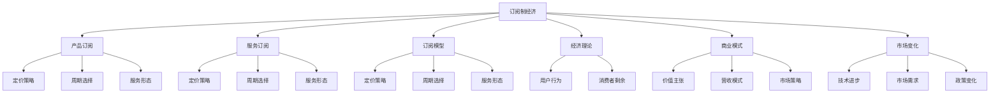

                 

# 订阅制经济的发展趋势:从产品订阅到服务订阅

> 关键词：订阅制经济,产品订阅,服务订阅,订阅模型,经济理论,商业模式,市场变化

## 1. 背景介绍

### 1.1 问题由来

随着全球经济进入深度数字化、互联网化阶段，消费模式发生了根本性的转变。传统的"一次付费，长期使用"的模式正在被"按需付费，持续使用"的订阅模式所取代。从Netflix、Spotify到Apple Music、Amazon Prime，越来越多的互联网巨头和传统企业纷纷拥抱订阅制，推动了订阅制经济时代的到来。

订阅制经济，是指用户为获取产品或服务，按照约定的周期付费，无需一次性购买，具有灵活性、可扩展性和定制化等优势。相比于传统的单次购买，订阅制模式更注重长期价值和用户粘性，能够实现用户与企业的深度绑定，并带来更高的用户生命价值。

### 1.2 问题核心关键点

订阅制经济的核心在于用户价值最大化。从产品订阅到服务订阅，需要从宏观经济、消费者行为、技术变革等多个维度进行全面解析。如何设计合理的订阅模型，最大化用户粘性，提升用户生命周期价值，是实现订阅制经济的关键。

本文将从订阅制经济的基本原理出发，剖析订阅模型的设计原理与流程，并结合真实案例分析，深入探讨订阅制经济发展的趋势与挑战。

## 2. 核心概念与联系

### 2.1 核心概念概述

为更好地理解订阅制经济，本节将介绍几个密切相关的核心概念：

- **订阅制经济(Subscription Economy)**：一种基于长期价值和用户粘性的消费模式，通过定期收取费用，提供持续的产品或服务，实现用户与企业的深度绑定。
- **产品订阅(Product Subscription)**：用户为获取特定产品或服务，按照约定的周期付费，包括软件、硬件、在线服务等。
- **服务订阅(Service Subscription)**：用户为获取持续的服务，如教育、健康、金融等，按照约定的周期付费，更注重服务的个性化和定制化。
- **订阅模型(Subscription Model)**：订阅制的核心，包括定价策略、周期选择、服务形态等关键要素，是实现用户价值最大化的重要工具。
- **经济理论(Economic Theory)**：微观经济、消费者行为等理论，为订阅模型设计提供理论基础。
- **商业模式(Business Model)**：订阅制企业基于用户需求，设计不同的价值主张、营收模式和市场策略。
- **市场变化(Market Trends)**：订阅制经济的发展，受技术变革、市场需求、政策环境等多方面因素影响，需动态调整。

这些核心概念之间的逻辑关系可以通过以下Mermaid流程图来展示：



这个流程图展示订阅制经济的核心概念及其之间的关系：

1. 订阅制经济涵盖产品订阅和服务订阅，设计不同的订阅模型。
2. 产品订阅主要关注定价策略、周期选择和服务形态。
3. 服务订阅更注重服务个性化和定制化，同样需要定价策略、周期选择和服务形态。
4. 订阅模型受到经济理论、商业模式和市场变化的影响。
5. 定价策略、周期选择和服务形态共同构成订阅模型的三大要素。

这些概念共同构成了订阅制经济的学习框架，帮助我们更好地把握订阅制经济的精髓。

## 3. 核心算法原理 & 具体操作步骤

### 3.1 算法原理概述

订阅制经济的算法原理，本质上是基于长期价值和用户粘性的需求匹配与资源分配问题。通过设计合理的定价策略、周期选择和服务形态，最大化用户生命周期价值，提升用户满意度。

### 3.2 算法步骤详解

订阅制经济的设计流程主要包括以下几个关键步骤：

**Step 1: 确定用户需求**

- 调研市场，了解用户对产品或服务的需求和痛点。
- 分析用户的行为数据，识别用户的关键需求和偏好。
- 设计问卷或用户访谈，获取用户反馈和意见。

**Step 2: 设计定价策略**

- 根据用户需求，设计不同的定价方案，包括月度、年度、按需等。
- 考虑市场竞争情况，选择合适的定价水平，如价值定价、成本加成定价等。
- 引入激励机制，如新用户优惠、连续订阅折扣等，提升用户粘性。

**Step 3: 选择服务周期**

- 根据用户需求和公司运营成本，设计合理的服务周期。
- 定期评估用户活跃度和服务满意度，动态调整周期长度。
- 设计灵活的订阅计划，满足不同用户的需求。

**Step 4: 确定服务形态**

- 根据用户需求，设计符合用户期望的服务形态，如在线视频、云服务、SaaS等。
- 提供个性化服务，如推荐系统、定制化服务包等，提升用户体验。
- 引入服务升级机制，定期更新服务内容，保持用户新鲜感。

**Step 5: 制定市场策略**

- 设计多渠道营销策略，吸引更多用户订阅。
- 采用A/B测试等方法，评估不同策略的效果，不断优化。
- 设计用户留存策略，如会员等级、积分兑换等，提升用户长期价值。

**Step 6: 实施与评估**

- 实施订阅模型，监测用户行为和满意度。
- 根据评估结果，调整定价策略、周期选择和服务形态。
- 定期分析订阅模型的财务指标，如用户生命周期价值、ARPU等，优化运营。

### 3.3 算法优缺点

订阅制经济具有以下优点：

1. **提高用户粘性**：通过持续收费，提升用户对产品或服务的依赖性。
2. **增加用户生命周期价值**：用户使用时间越长，贡献的收益越高。
3. **降低营销成本**：用户购买后自动续费，无需持续营销投入。
4. **提升市场竞争力**：用户定期续费，带来稳定的收入流，降低市场波动风险。

同时，订阅制经济也存在一些局限：

1. **用户流失风险**：用户如果对服务不满意，可能选择取消订阅，影响长期收益。
2. **定价敏感性**：用户对价格的敏感性较高，定价不当可能导致用户流失。
3. **服务升级难度**：服务升级成本较高，用户不愿频繁变更服务形态。
4. **市场竞争激烈**：市场竞争激烈，需要不断创新，才能保持市场领先地位。

### 3.4 算法应用领域

订阅制经济已经在多个行业得到了广泛应用，包括但不限于：

- **媒体娱乐**：Netflix、Disney+等流媒体平台，为用户提供丰富的视频内容。
- **软件服务**：Autodesk、Adobe等SaaS平台，提供企业级软件服务。
- **健康服务**：Apple Health、Fitbit等健康管理平台，提供个性化健康指导。
- **教育培训**：Khan Academy、Coursera等在线教育平台，提供高质量课程内容。
- **金融服务**：PayPal、Stripe等支付平台，提供便捷的支付和金融服务。

除了上述这些经典应用外，订阅制经济还在智能家居、车联网、智慧城市等更多领域得到创新应用，为各行各业带来新的增长动力。

## 4. 数学模型和公式 & 详细讲解  
### 4.1 数学模型构建

本节将使用数学语言对订阅制经济的基本原理进行更加严格的刻画。

记订阅制经济的目标函数为 $L$，其中 $L$ 为用户的生命周期价值(Lifetime Value)，即用户在整个订阅周期内为公司带来的总收益。假设用户数为 $U$，每次订阅周期为 $T$，每次订阅收入为 $R$，则目标函数为：

$$
L = U \times T \times R
$$

目标函数最大化即求解 $L$ 的最大值。在实际操作中，需要考虑用户流失率 $\alpha$、用户续订率 $\beta$ 等关键参数，以动态调整定价和周期策略，提升用户生命周期价值。

### 4.2 公式推导过程

以下我们以用户流失和续订的概率模型为例，推导目标函数的数学公式。

假设用户每年续订的概率为 $\beta$，流失的概率为 $\alpha$，则用户续订 $n$ 年的概率为：

$$
P(n) = \beta^n (1-\alpha)
$$

用户在整个订阅周期内为公司带来的总收益为：

$$
R_n = n \times R
$$

则用户生命周期价值为：

$$
L = U \times \sum_{n=1}^{\infty} P(n) \times R_n = U \times R \times \frac{1}{1-\alpha}
$$

该公式表明，用户生命周期价值与用户流失率成反比，即降低用户流失率能够显著提升用户生命周期价值。

在实际运营中，还需要考虑定价策略对用户流失率的影响。假设用户每年订阅费用为 $P$，则用户流失率可以表示为：

$$
\alpha = \frac{C}{P}
$$

其中 $C$ 为公司每月的固定成本。因此，用户流失率与定价策略密切相关，需要根据用户需求和成本承受能力，设计合理的定价方案。

### 4.3 案例分析与讲解

以Netflix为例，分析其订阅制经济的设计原理与效果。

Netflix通过调研用户需求，发现用户对视频内容的需求强烈，但对单价敏感。因此，Netflix采用了月度订阅策略，每月定价为 $9.99，并提供连续订阅折扣。同时，Netflix通过数据分析，发现用户对视频质量、内容丰富度等关键要素高度敏感，因此不断提升内容品质，引入个性化推荐系统，提高用户满意度。

通过上述策略，Netflix实现了用户生命周期价值的大幅提升。2015年至2019年，Netflix的付费用户从1亿增长至2.3亿，平均每月观看时长增长50%以上。2019年，Netflix的收入达230亿美元，同比增长33%，显示出订阅制经济的强大生命力。

## 5. 项目实践：代码实例和详细解释说明
### 5.1 开发环境搭建

在进行订阅制经济开发前，我们需要准备好开发环境。以下是使用Python进行Flask开发的Web环境配置流程：

1. 安装Anaconda：从官网下载并安装Anaconda，用于创建独立的Python环境。

2. 创建并激活虚拟环境：
```bash
conda create -n subscription-env python=3.8 
conda activate subscription-env
```

3. 安装Flask：
```bash
pip install flask
```

4. 安装各类工具包：
```bash
pip install numpy pandas scikit-learn matplotlib Flask
```

完成上述步骤后，即可在`subscription-env`环境中开始订阅制经济的实践。

### 5.2 源代码详细实现

下面我们以构建一个简单的订阅制经济模型为例，给出使用Flask实现订阅服务管理的PyTorch代码实现。

首先，定义用户订阅模型：

```python
class SubscriptionModel:
    def __init__(self, num_users, total_cost, monthly_cost, renewal_rate):
        self.num_users = num_users
        self.total_cost = total_cost
        self.monthly_cost = monthly_cost
        self.renewal_rate = renewal_rate
        self.users = []
        self.subscriptions = []
    
    def add_user(self, user_id):
        user = {'id': user_id, 'active': True}
        self.users.append(user)
    
    def renew_subscription(self, user_id):
        for user in self.users:
            if user['id'] == user_id:
                if user['active']:
                    self.subscriptions.append(user_id)
                else:
                    self.add_user(user_id)
                user['active'] = not user['active']
    
    def calculate_ltv(self):
        ltv = self.num_users * self.total_cost / (1 - self.renewal_rate)
        return ltv
```

然后，定义Flask应用的路由：

```python
from flask import Flask, request, jsonify

app = Flask(__name__)

@app.route('/subscribe', methods=['POST'])
def subscribe():
    data = request.get_json()
    user_id = data['user_id']
    subscription_cost = data['subscription_cost']
    subscription_duration = data['subscription_duration']
    subscription_period = data['subscription_period']
    subscription_model.add_user(user_id)
    subscription_cost = subscription_cost * subscription_duration
    subscription_model.add_subscription(user_id, subscription_cost)
    return jsonify({'success': True, 'message': 'Subscription successful'})

@app.route('/renew', methods=['POST'])
def renew():
    data = request.get_json()
    user_id = data['user_id']
    subscription_model.renew_subscription(user_id)
    return jsonify({'success': True, 'message': 'Renewal successful'})

@app.route('/ltv', methods=['GET'])
def ltv():
    ltv = subscription_model.calculate_ltv()
    return jsonify({'success': True, 'ltv': ltv})

if __name__ == '__main__':
    subscription_model = SubscriptionModel(num_users=10000, total_cost=12000, monthly_cost=10, renewal_rate=0.1)
    app.run(debug=True)
```

最后，启动Flask应用并测试：

```bash
python app.py
```

在浏览器中访问 http://localhost:5000/subscribe，测试订阅接口。
访问 http://localhost:5000/renew，测试续费接口。
访问 http://localhost:5000/ltv，测试用户生命周期价值。

以上就是使用Flask实现订阅制经济模型的完整代码实现。可以看到，Flask的简洁和Python的易用性，使得订阅制经济的应用开发变得异常高效。

### 5.3 代码解读与分析

让我们再详细解读一下关键代码的实现细节：

**SubscriptionModel类**：
- `__init__`方法：初始化订阅模型，包括用户总数、总成本、月度成本和续订率。
- `add_user`方法：新增用户，记录用户ID和是否激活。
- `renew_subscription`方法：用户续费，记录用户ID和是否激活。
- `calculate_ltv`方法：计算用户生命周期价值，返回总收益。

**Flask应用路由**：
- `/subscribe`路由：接收用户ID、订阅费用和周期，新增订阅记录，并返回成功消息。
- `/renew`路由：接收用户ID，用户续费，并返回成功消息。
- `/ltv`路由：计算用户生命周期价值，并返回总收益。

**测试接口**：
- 使用curl命令或Flask提供的Postman等工具，分别测试订阅和续费接口。
- 访问/ltv接口，输出用户生命周期价值。

可以看到，Flask使得订阅制经济的应用开发变得异常便捷，开发者只需关注核心业务逻辑，而无需过多关注底层实现。

当然，工业级的系统实现还需考虑更多因素，如用户管理、权限控制、交易处理等。但核心的订阅制经济框架基本与此类似。

## 6. 实际应用场景

### 6.1 智能家居订阅

随着智能家居设备的普及，越来越多的家庭开始选择订阅模式获取智能化服务。智能音箱、智能灯光、智能安防等设备，通过订阅模式，可以提供更优质、更稳定的服务，满足用户多样化的需求。

以Amazon Echo为例，用户可以通过订阅获取更丰富的语音助手服务，如音乐播放、天气查询、智能家居控制等。Amazon Echo的订阅模式通过按月收费，降低了用户的初次购买门槛，提升了用户粘性，带来了稳定的用户和收入增长。

### 6.2 车联网订阅

车联网领域的订阅模式，为用户提供了更灵活、个性化的车辆服务。通过订阅，用户可以获取最新的车辆信息、地图导航、智能驾驶等服务，享受更高效、便捷的出行体验。

以Tesla为例，Tesla的Autopilot订阅服务，通过按月收费，提供了最新的自动驾驶技术和实时路况信息，提升了用户的安全性和舒适性。Tesla通过订阅模式，获取了大量的用户数据，进一步优化了车辆性能和服务质量。

### 6.3 智慧城市订阅

智慧城市建设中，订阅模式成为城市服务的重要组成部分。通过订阅，城市居民可以获取更精准、高效的城市服务，如智慧交通、智慧医疗、智慧教育等。

以城市公交系统为例，通过订阅模式，用户可以获取实时公交信息和乘车优惠，提升出行体验。城市管理部门也可以通过订阅模式，获取用户的出行数据，优化公共交通资源配置，提升城市管理效率。

## 7. 工具和资源推荐

### 7.1 学习资源推荐

为了帮助开发者系统掌握订阅制经济的基本原理和实践技巧，这里推荐一些优质的学习资源：

1. **《订阅制经济：从产品到服务》**：系统介绍了订阅制经济的基本原理、设计方法和实践案例，适合深入学习和实战演练。
2. **Udacity《订阅制经济》课程**：斯坦福大学开设的在线课程，通过实际案例和项目，引导学员掌握订阅制经济的核心技能。
3. **Coursera《商业分析与策略》课程**：耶鲁大学开设的在线课程，介绍了订阅制经济的市场策略和用户行为分析方法。
4. **Flask官方文档**：Flask的官方文档，详细介绍了Flask的开发环境和API使用，适合Flask初学者。
5. **Python编程经典书籍《Python核心编程》**：深入浅出地介绍了Python的基本语法和编程技巧，适合Python开发初学者。

通过对这些资源的学习实践，相信你一定能够快速掌握订阅制经济的核心原理，并用于解决实际的商业问题。

### 7.2 开发工具推荐

高效的开发离不开优秀的工具支持。以下是几款用于订阅制经济开发的常用工具：

1. **Flask**：轻量级的Web框架，适合快速迭代和原型开发。
2. **Django**：全功能的Web框架，适合复杂业务逻辑和数据管理。
3. **Postman**：API测试工具，方便测试Web应用的各个接口。
4. **Jupyter Notebook**：数据科学和机器学习的开发环境，适合数据分析和算法实现。
5. **AWS Lambda**：无服务器计算服务，适合动态扩展和弹性计算。
6. **AWS S3**：云存储服务，适合数据备份和访问控制。

合理利用这些工具，可以显著提升订阅制经济的应用开发效率，加速创新迭代的步伐。

### 7.3 相关论文推荐

订阅制经济的发展得益于学界的持续研究。以下是几篇奠基性的相关论文，推荐阅读：

1. **《订阅制经济的经济效应》**：分析了订阅制经济对市场竞争、用户价值、企业绩效的影响，为订阅制模型设计提供理论基础。
2. **《订阅制经济的市场策略》**：研究了订阅制经济的多渠道营销策略和用户留存方法，提供了实用的市场策略建议。
3. **《订阅制经济的系统设计》**：介绍了订阅制经济的系统架构和关键技术，提供了全面的技术指引。
4. **《订阅制经济的案例分析》**：通过多个行业的成功案例，展示了订阅制经济的应用效果和创新点。
5. **《订阅制经济的用户行为分析》**：利用大数据和机器学习，研究了订阅制经济下的用户行为和需求变化，提供了有价值的洞察和预测。

这些论文代表了大规模订阅制经济的研究方向，通过学习这些前沿成果，可以帮助研究者把握学科前进方向，激发更多的创新灵感。

## 8. 总结：未来发展趋势与挑战

### 8.1 总结

本文对订阅制经济的基本原理进行了全面系统的介绍。首先阐述了订阅制经济的背景和核心概念，明确了订阅制经济的基本设计原理与步骤。其次，通过Netflix的实际案例，详细讲解了订阅制经济的实施流程和效果。最后，我们探讨了订阅制经济的应用前景，并推荐了相关的学习资源和开发工具。

通过本文的系统梳理，可以看到，订阅制经济作为一种高效的消费模式，正在深刻改变传统消费模式和企业运营方式。订阅制经济的核心在于用户价值最大化，通过持续收费，提升用户对产品或服务的依赖性，实现长期价值的最大化。

### 8.2 未来发展趋势

展望未来，订阅制经济将呈现以下几个发展趋势：

1. **多渠道融合**：订阅制经济将不仅仅局限于单一渠道，而是与社交媒体、电商平台、物流配送等多渠道融合，提供更全面、便捷的服务。
2. **个性化定制**：订阅制经济将更加注重用户的个性化需求，通过智能推荐和个性化定制，提升用户体验和满意度。
3. **数据驱动**：订阅制经济将更加依赖大数据和机器学习技术，通过用户行为数据，优化订阅策略和服务形态。
4. **实时响应**：订阅制经济将更加注重实时响应和即时反馈，通过实时推送和用户互动，提升用户粘性和满意度。
5. **跨行业应用**：订阅制经济将在更多领域得到创新应用，如医疗、金融、教育等，推动各行业的数字化转型升级。

以上趋势凸显了订阅制经济的发展潜力和应用前景，未来订阅制经济将持续引领消费模式和商业模式的变革。

### 8.3 面临的挑战

尽管订阅制经济已经取得了显著成效，但在迈向更加智能化、普适化应用的过程中，它仍面临着诸多挑战：

1. **用户流失风险**：订阅制经济面临用户流失的挑战，特别是在市场竞争激烈的情况下，如何降低用户流失率，提升用户粘性，是关键问题。
2. **定价策略复杂**：订阅制经济的设计需要考虑定价策略的复杂性，不同的用户群体和市场环境，需要设计不同的定价方案。
3. **技术支持难度**：订阅制经济需要依赖大数据、云计算等先进技术，技术支持难度较大，对企业的技术能力要求较高。
4. **市场竞争激烈**：订阅制经济的市场竞争激烈，需要不断创新，才能保持市场领先地位。
5. **用户隐私保护**：订阅制经济涉及大量用户数据，如何保护用户隐私，防止数据泄露和滥用，是必须解决的问题。

### 8.4 研究展望

面对订阅制经济所面临的种种挑战，未来的研究需要在以下几个方面寻求新的突破：

1. **用户行为分析**：通过大数据和机器学习，深入理解用户需求和行为，优化订阅策略和服务形态。
2. **定价策略优化**：设计合理的定价方案，考虑用户需求和市场竞争，提升用户粘性。
3. **技术平台优化**：优化订阅制经济的技术平台，提升实时响应和即时反馈能力，降低技术支持难度。
4. **市场策略创新**：通过多渠道融合和跨行业应用，提升订阅制经济的灵活性和普适性。
5. **隐私保护机制**：设计完善的隐私保护机制，确保用户数据的安全性和合法性。

这些研究方向的探索，必将引领订阅制经济向更高的台阶迈进，为构建安全、可靠、高效、智能的订阅制经济奠定基础。面向未来，订阅制经济必将带来更广泛的应用场景和更高的用户价值，成为推动全球经济数字化转型的重要力量。

## 9. 附录：常见问题与解答

**Q1：订阅制经济是否适用于所有行业？**

A: 订阅制经济虽然具有广泛的应用前景，但在某些特定行业，如奢侈品、高端服务，可能并不适合。订阅制经济的核心在于长期价值和用户粘性，对于一些高价值、低频次的商品或服务，一次购买可能更加合理。因此，企业需要根据自身业务特点和市场需求，合理选择订阅制模式。

**Q2：订阅制经济是否需要投入大量成本？**

A: 订阅制经济需要一定的初期投入，包括市场调研、产品设计、技术开发等。但相比于传统的单次购买模式，订阅制经济能够实现长期收益，提升用户粘性和生命周期价值。通过优化定价策略和服务形态，可以有效控制成本，实现经济规模的持续增长。

**Q3：订阅制经济是否容易被竞争对手模仿？**

A: 订阅制经济的成功与否，不仅仅取决于价格和优惠，更依赖于企业的产品和服务质量、用户粘性和品牌影响力。订阅制经济需要不断创新，提升用户体验和满意度，才能在市场竞争中保持领先地位。同时，企业还可以通过多渠道融合和跨行业应用，提升订阅制经济的灵活性和普适性，构建独特的竞争优势。

**Q4：订阅制经济是否容易被用户取消？**

A: 订阅制经济需要合理设计定价策略和用户留存策略，降低用户流失率，提升用户粘性。企业可以通过智能推荐、个性化定制、及时反馈等方式，满足用户需求，提升用户满意度。同时，通过数据分析和用户行为研究，及时发现用户流失原因，采取针对性的措施，防止用户流失。

**Q5：订阅制经济是否容易被市场环境影响？**

A: 订阅制经济虽然具有一定的抗风险能力，但市场环境的变化仍然会对订阅制模式产生影响。企业需要根据市场变化，及时调整订阅策略和定价方案，降低市场波动风险。同时，通过多渠道融合和跨行业应用，分散市场风险，提升企业抗风险能力。

总之，订阅制经济是一种具有广阔前景的消费模式，能够实现长期价值和用户粘性，提升企业竞争力和市场地位。但订阅制经济也需要企业在定价策略、技术平台、市场策略等方面不断创新和优化，才能在市场竞争中保持领先地位，实现持续增长。

