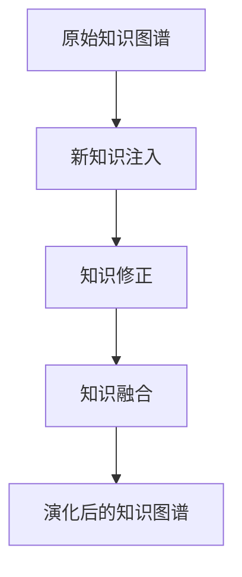

                 

# 认知增强与创新管理：组织学习的新范式

> 关键词：认知增强,创新管理,组织学习,知识图谱,知识演化,知识协同,知识评估,知识共享,知识管理

## 1. 背景介绍

### 1.1 问题由来

在快速变化和高度竞争的现代社会中，组织要想持续保持创新和竞争力，就必须在知识管理和认知增强方面进行持续投入。传统的知识管理方式，如文件存储、文档索引等，已经无法满足当前日益复杂和动态的知识环境需求。

知识管理的目标是促进知识的创造、分享、应用和积累，而认知增强则旨在提升个人和组织的学习能力和决策能力，使其能够更好地适应新环境。

面对知识的不断涌现，组织需要采用更加先进、高效的知识管理方式，实现对知识的高效收集、组织、传递和使用。同时，通过认知增强技术，使个体和团队在快速获取新知识的同时，能更好地理解和应用这些知识，提升创新力和决策效率。

### 1.2 问题核心关键点

为了解决上述问题，本文聚焦于一种新型的组织知识管理范式——认知增强与创新管理，简称CI（Cognition-Enhanced Innovation Management）。该范式结合了认知科学、知识工程、人工智能等领域的最新成果，旨在通过构建知识图谱、推动知识演化、促进知识协同、进行知识评估和分享等手段，全面提升组织的认知能力和创新管理水平。

CI范式的核心思想包括：

1. **知识图谱构建**：将组织内部和外部的知识结构化，构建一个全面的知识图谱，以便快速查询和应用知识。
2. **知识演化驱动**：通过迭代学习和演化，使知识图谱不断更新和完善，保持与现实世界的同步。
3. **知识协同促进**：利用人工智能技术，促进团队成员之间的知识共享和协作，加速知识流动。
4. **知识评估机制**：建立科学的知识评估体系，对知识的真实性、价值和影响进行全面评估，指导知识管理和应用。
5. **知识共享平台**：搭建知识共享平台，促进知识的在线交流和传播，使知识的价值最大化。

CI范式的实施，有助于组织在动态环境中更有效地获取、共享、应用和创新知识，从而提升整体竞争力。

### 1.3 问题研究意义

当前，全球化和数字化进程加速，知识更新速度加快，这对组织提出了更高的要求。传统的线性知识管理方式难以应对复杂的知识生态，亟需一种新的知识管理范式来适应新的知识环境。

CI范式的提出，旨在提供一种高效、动态的知识管理模式，通过认知增强和创新管理，使组织能够更迅速地响应变化、抓住机遇，提升整体创新能力。

CI范式有助于：

1. **加速知识流动**：通过知识图谱和协同机制，加速知识的共享和应用，减少知识孤岛。
2. **提升决策质量**：通过科学的知识评估体系，提高决策的理性和有效性，降低错误决策风险。
3. **增强创新能力**：通过知识演化和学习机制，促进新知识的创造和应用，提升组织创新水平。
4. **优化资源配置**：通过知识图谱和协同平台，优化资源分配，提升组织运行效率。
5. **培养创新文化**：通过知识共享和协同，培养团队合作和创新文化，提升组织凝聚力和创新氛围。

总之，CI范式的实施将有助于构建一个学习型、创新型和协作型的组织，使其在激烈的市场竞争中脱颖而出。

## 2. 核心概念与联系

### 2.1 核心概念概述

CI范式涉及多个关键概念，这些概念之间的联系可以通过以下Mermaid流程图来展示：


这个流程图展示了CI范式的核心概念及其相互关系：

1. **知识图谱**：知识图谱是构建CI范式的基础，它将组织内外知识结构化，形成全面、准确的知识库。
2. **知识演化**：通过迭代学习和演化，使知识图谱不断更新和完善，保持与现实世界的同步。
3. **知识协同**：利用人工智能技术，促进团队成员之间的知识共享和协作，加速知识流动。
4. **知识评估**：建立科学的知识评估体系，对知识的真实性、价值和影响进行全面评估，指导知识管理和应用。
5. **知识共享平台**：搭建知识共享平台，促进知识的在线交流和传播，使知识的价值最大化。
6. **认知增强**：通过认知增强技术，提升个人和组织的学习能力和决策能力，使其能够更好地适应新环境。
7. **创新管理**：结合创新管理理论，推动组织的创新活动，实现知识的应用和转化。
8. **知识管理工具**：利用各类工具和平台，支持知识图谱构建、知识协同、知识共享等活动。
9. **组织结构**：组织的结构设计和管理模式直接影响知识管理和应用的效果。
10. **团队合作**：团队合作和沟通是知识共享和创新的重要保障。
11. **决策优化**：通过认知增强和知识评估，优化决策过程，提高决策质量。
12. **业务流程**：通过知识图谱和协同平台，优化业务流程，提升工作效率。

这些概念共同构成了CI范式的核心框架，涵盖了从知识获取到应用、从个人学习到团队协作的全过程。

### 2.2 核心概念原理和架构

#### 2.2.1 知识图谱构建

知识图谱是一种语义网络结构，它将知识表示为节点和边，用于描述实体、属性和关系。知识图谱的构建过程包括：

1. **知识抽取**：从各种数据源（如文献、报告、网页等）中抽取实体、属性和关系，生成知识元组。
2. **实体识别和消歧**：对抽取的实体进行命名实体识别（NER）和消歧，消除歧义。
3. **关系抽取**：从抽取的实体对中识别关系，建立实体之间的关系网络。
4. **知识整合**：将不同数据源的知识进行整合，消除冗余和冲突，形成一致的知识结构。

知识图谱构建的架构如图2所示：


#### 2.2.2 知识演化驱动

知识图谱构建完成后，需要通过知识演化机制保持其与现实世界的同步。知识演化包括：

1. **新知识注入**：定期从新的数据源中抽取知识，更新知识图谱。
2. **知识修正**：通过人工审核和算法优化，修正知识图谱中的错误和冗余。
3. **知识融合**：整合来自不同领域的知识，丰富知识图谱的覆盖面。

知识演化的架构如图3所示：



#### 2.2.3 知识协同促进

知识协同是通过人工智能技术，促进团队成员之间的知识共享和协作，加速知识流动。知识协同包括：

1. **知识共享**：通过知识图谱和协同平台，实现知识共享。
2. **知识协作**：利用协同工具，支持团队成员之间的协作和沟通。
3. **知识应用**：将知识应用于实际业务场景，实现知识价值最大化。

知识协同的架构如图4所示：


#### 2.2.4 知识评估机制

知识评估是对知识的真实性、价值和影响进行全面评估，指导知识管理和应用。知识评估包括：

1. **知识真实性评估**：对知识源的可靠性进行评估，判断其真实性。
2. **知识价值评估**：通过指标体系评估知识的经济价值、技术价值和创新价值。
3. **知识影响评估**：评估知识在实际应用中的影响，包括社会影响、经济效益等。

知识评估的架构如图5所示：


#### 2.2.5 知识共享平台

知识共享平台是知识管理的重要组成部分，提供知识在线交流和传播的渠道。知识共享平台包括：

1. **知识存储**：提供知识图谱、文档、视频等各类知识资源存储和查询功能。
2. **知识发布**：支持团队成员上传和分享知识，方便知识传播。
3. **知识搜索**：提供强大的搜索功能，快速定位和获取知识。

知识共享平台的架构如图6所示：


## 3. 核心算法原理 & 具体操作步骤

### 3.1 算法原理概述

CI范式的核心算法包括知识图谱构建、知识演化、知识协同、知识评估和知识共享等。这些算法主要基于人工智能技术，包括自然语言处理、机器学习和知识工程等。

#### 3.1.1 知识图谱构建

知识图谱构建主要涉及实体抽取、关系抽取和知识整合等任务。目前常用的算法包括基于规则的方法、基于统计的方法和基于深度学习的方法。

#### 3.1.2 知识演化驱动

知识演化主要涉及新知识注入、知识修正和知识融合等任务。常用的算法包括基于时间序列的演化算法和基于图嵌入的演化算法。

#### 3.1.3 知识协同促进

知识协同主要涉及知识共享、知识协作和知识应用等任务。常用的算法包括基于推荐系统的知识共享算法、基于社交网络的协作算法和基于知识图谱的应用算法。

#### 3.1.4 知识评估机制

知识评估主要涉及知识真实性评估、知识价值评估和知识影响评估等任务。常用的算法包括基于指标体系的评估算法和基于机器学习的评估算法。

#### 3.1.5 知识共享平台

知识共享平台主要涉及知识存储、知识发布和知识搜索等任务。常用的算法包括基于搜索算法、基于推荐算法的知识搜索算法和基于分布式计算的知识存储算法。

### 3.2 算法步骤详解

#### 3.2.1 知识图谱构建

1. **数据源收集**：从各种数据源（如文献、报告、网页等）中抽取实体、属性和关系，生成知识元组。
2. **实体抽取**：利用自然语言处理技术，识别文本中的实体。
3. **实体识别与消歧**：对抽取的实体进行命名实体识别（NER）和消歧，消除歧义。
4. **关系抽取**：从抽取的实体对中识别关系，建立实体之间的关系网络。
5. **知识整合**：将不同数据源的知识进行整合，消除冗余和冲突，形成一致的知识结构。

#### 3.2.2 知识演化驱动

1. **新知识注入**：定期从新的数据源中抽取知识，更新知识图谱。
2. **知识修正**：通过人工审核和算法优化，修正知识图谱中的错误和冗余。
3. **知识融合**：整合来自不同领域的知识，丰富知识图谱的覆盖面。

#### 3.2.3 知识协同促进

1. **知识共享**：通过知识图谱和协同平台，实现知识共享。
2. **知识协作**：利用协同工具，支持团队成员之间的协作和沟通。
3. **知识应用**：将知识应用于实际业务场景，实现知识价值最大化。

#### 3.2.4 知识评估机制

1. **知识真实性评估**：对知识源的可靠性进行评估，判断其真实性。
2. **知识价值评估**：通过指标体系评估知识的经济价值、技术价值和创新价值。
3. **知识影响评估**：评估知识在实际应用中的影响，包括社会影响、经济效益等。

#### 3.2.5 知识共享平台

1. **知识存储**：提供知识图谱、文档、视频等各类知识资源存储和查询功能。
2. **知识发布**：支持团队成员上传和分享知识，方便知识传播。
3. **知识搜索**：提供强大的搜索功能，快速定位和获取知识。

### 3.3 算法优缺点

#### 3.3.1 知识图谱构建

**优点**：

1. 结构化知识表示，易于存储和查询。
2. 支持复杂的知识关系表示，适应复杂知识场景。
3. 利用机器学习技术，自动抽取和整合知识，减少人工干预。

**缺点**：

1. 数据源多样，抽取难度较大。
2. 实体和关系识别存在误差，需要人工审核。
3. 知识整合过程复杂，存在冲突和冗余。

#### 3.3.2 知识演化驱动

**优点**：

1. 动态更新知识图谱，保持与现实世界的同步。
2. 通过迭代学习和优化，提高知识图谱的准确性和完备性。
3. 引入自动化技术，减少人工干预。

**缺点**：

1. 新知识注入和修正过程耗时较长。
2. 数据源多样，不同领域的知识融合难度较大。
3. 自动化算法可能存在误差，需要人工审核。

#### 3.3.3 知识协同促进

**优点**：

1. 促进团队成员之间的知识共享和协作，加速知识流动。
2. 利用人工智能技术，减少信息不对称和沟通障碍。
3. 知识应用效果好，提升业务价值。

**缺点**：

1. 协同平台搭建和维护成本较高。
2. 技术复杂，需要专业团队支持。
3. 知识共享和协作过程可能存在信息泄露和隐私问题。

#### 3.3.4 知识评估机制

**优点**：

1. 科学评估知识的真实性、价值和影响。
2. 指导知识管理和应用，优化知识决策。
3. 引入自动化技术，提高评估效率。

**缺点**：

1. 评估指标体系复杂，难以全面覆盖。
2. 需要人工审核和干预，成本较高。
3. 自动化算法可能存在误差，需要人工校正。

#### 3.3.5 知识共享平台

**优点**：

1. 提供知识在线交流和传播的渠道。
2. 利用搜索引擎和推荐算法，提高知识查询和获取效率。
3. 支持团队协作和知识共享，提升工作效率。

**缺点**：

1. 平台搭建和维护成本较高。
2. 技术复杂，需要专业团队支持。
3. 信息安全和隐私保护问题需要解决。

### 3.4 算法应用领域

CI范式的核心算法可以应用于多个领域，包括但不限于以下场景：

1. **医疗领域**：构建医疗知识图谱，促进医疗信息的共享和协作，提升医疗决策质量和效率。
2. **金融领域**：构建金融知识图谱，促进金融信息的共享和协作，提升金融分析和决策水平。
3. **科研领域**：构建科研知识图谱，促进科研信息的共享和协作，提升科研创新能力。
4. **教育领域**：构建教育知识图谱，促进教育信息的共享和协作，提升教育质量和效果。
5. **企业领域**：构建企业知识图谱，促进企业信息的共享和协作，提升企业运营效率和创新能力。

以上领域只是CI范式应用的冰山一角，CI范式可应用于更多领域，帮助组织提升知识管理和认知能力，实现创新和竞争力的提升。

## 4. 数学模型和公式 & 详细讲解 & 举例说明

### 4.1 数学模型构建

CI范式的数学模型主要涉及知识图谱构建、知识演化、知识协同、知识评估和知识共享等任务。以下是各个任务对应的数学模型和公式：

#### 4.1.1 知识图谱构建

知识图谱构建主要涉及实体抽取、关系抽取和知识整合等任务。常用的数学模型包括：

1. **实体抽取模型**：
   - **基于规则的实体抽取**：
     - 公式：$E=R_{NER}(T)$
   - **基于统计的实体抽取**：
     - 公式：$E=R_{ST}(T)$
   - **基于深度学习的实体抽取**：
     - 公式：$E=R_{DL}(T)$

2. **关系抽取模型**：
   - **基于规则的关系抽取**：
     - 公式：$R=R_{RULE}(T)$
   - **基于统计的关系抽取**：
     - 公式：$R=R_{STAT}(T)$
   - **基于深度学习的关系抽取**：
     - 公式：$R=R_{DL}(T)$

3. **知识整合模型**：
   - **基于规则的知识整合**：
     - 公式：$K=K_{RULE}(T)$
   - **基于统计的知识整合**：
     - 公式：$K=K_{STAT}(T)$
   - **基于深度学习的知识整合**：
     - 公式：$K=K_{DL}(T)$

#### 4.1.2 知识演化驱动

知识演化主要涉及新知识注入、知识修正和知识融合等任务。常用的数学模型包括：

1. **新知识注入模型**：
   - **基于时间序列的知识注入**：
     - 公式：$N=I_{TS}(K_{old})$
   - **基于图嵌入的知识注入**：
     - 公式：$N=I_{GE}(K_{old})$

2. **知识修正模型**：
   - **基于人工审核的知识修正**：
     - 公式：$C=R_{HUMAN}(K)$
   - **基于算法优化的知识修正**：
     - 公式：$C=R_{ALG}(K)$

3. **知识融合模型**：
   - **基于规则的知识融合**：
     - 公式：$F=F_{RULE}(K_{1}, K_{2})$
   - **基于统计的知识融合**：
     - 公式：$F=F_{STAT}(K_{1}, K_{2})$
   - **基于深度学习的知识融合**：
     - 公式：$F=F_{DL}(K_{1}, K_{2})$

#### 4.1.3 知识协同促进

知识协同主要涉及知识共享、知识协作和知识应用等任务。常用的数学模型包括：

1. **知识共享模型**：
   - **基于推荐系统的知识共享**：
     - 公式：$S=R_{REC}(K)$
   - **基于社交网络的协作**：
     - 公式：$C=R_{SOCSN}(T)$

2. **知识应用模型**：
   - **基于知识图谱的应用**：
     - 公式：$A=R_{KG}(K)$
   - **基于推荐算法的知识应用**：
     - 公式：$A=R_{REC}(K)$

#### 4.1.4 知识评估机制

知识评估主要涉及知识真实性评估、知识价值评估和知识影响评估等任务。常用的数学模型包括：

1. **知识真实性评估模型**：
   - **基于指标体系的评估**：
     - 公式：$R=R_{METRICS}(S)$
   - **基于机器学习的评估**：
     - 公式：$R=R_{ML}(S)$

2. **知识价值评估模型**：
   - **基于指标体系的评估**：
     - 公式：$V=V_{METRICS}(K)$
   - **基于机器学习的评估**：
     - 公式：$V=V_{ML}(K)$

3. **知识影响评估模型**：
   - **基于指标体系的评估**：
     - 公式：$I=I_{METRICS}(K)$
   - **基于机器学习的评估**：
     - 公式：$I=I_{ML}(K)$

#### 4.1.5 知识共享平台

知识共享平台主要涉及知识存储、知识发布和知识搜索等任务。常用的数学模型包括：

1. **知识存储模型**：
   - **基于搜索引擎的知识存储**：
     - 公式：$S=S_{SEARCH}(K)$
   - **基于推荐算法的知识存储**：
     - 公式：$S=S_{REC}(K)$

2. **知识发布模型**：
   - **基于推荐系统的知识发布**：
     - 公式：$P=R_{REC}(K)$
   - **基于社交网络的协作**：
     - 公式：$P=R_{SOCSN}(K)$

3. **知识搜索模型**：
   - **基于搜索引擎的知识搜索**：
     - 公式：$Q=S_{SEARCH}(K)$
   - **基于推荐算法的知识搜索**：
     - 公式：$Q=S_{REC}(K)$

### 4.2 公式推导过程

以下是各个数学模型的推导过程：

#### 4.2.1 实体抽取模型

1. **基于规则的实体抽取**：
   - 公式推导：$E=R_{NER}(T)$
     - 其中，$E$为抽取的实体，$R_{NER}$为命名实体识别算法，$T$为文本。

2. **基于统计的实体抽取**：
   - 公式推导：$E=R_{ST}(T)$
     - 其中，$E$为抽取的实体，$R_{ST}$为基于统计的实体抽取算法，$T$为文本。

3. **基于深度学习的实体抽取**：
   - 公式推导：$E=R_{DL}(T)$
     - 其中，$E$为抽取的实体，$R_{DL}$为基于深度学习的实体抽取算法，$T$为文本。

#### 4.2.2 关系抽取模型

1. **基于规则的关系抽取**：
   - 公式推导：$R=R_{RULE}(T)$
     - 其中，$R$为抽取的关系，$R_{RULE}$为基于规则的关系抽取算法，$T$为文本。

2. **基于统计的关系抽取**：
   - 公式推导：$R=R_{STAT}(T)$
     - 其中，$R$为抽取的关系，$R_{STAT}$为基于统计的关系抽取算法，$T$为文本。

3. **基于深度学习的关系抽取**：
   - 公式推导：$R=R_{DL}(T)$
     - 其中，$R$为抽取的关系，$R_{DL}$为基于深度学习的关系抽取算法，$T$为文本。

#### 4.2.3 知识整合模型

1. **基于规则的知识整合**：
   - 公式推导：$K=K_{RULE}(T)$
     - 其中，$K$为整合后的知识，$K_{RULE}$为基于规则的知识整合算法，$T$为文本。

2. **基于统计的知识整合**：
   - 公式推导：$K=K_{STAT}(T)$
     - 其中，$K$为整合后的知识，$K_{STAT}$为基于统计的知识整合算法，$T$为文本。

3. **基于深度学习的知识整合**：
   - 公式推导：$K=K_{DL}(T)$
     - 其中，$K$为整合后的知识，$K_{DL}$为基于深度学习的知识整合算法，$T$为文本。

#### 4.2.4 新知识注入模型

1. **基于时间序列的知识注入**：
   - 公式推导：$N=I_{TS}(K_{old})$
     - 其中，$N$为新注入的知识，$I_{TS}$为基于时间序列的知识注入算法，$K_{old}$为原始知识图谱。

2. **基于图嵌入的知识注入**：
   - 公式推导：$N=I_{GE}(K_{old})$
     - 其中，$N$为新注入的知识，$I_{GE}$为基于图嵌入的知识注入算法，$K_{old}$为原始知识图谱。

#### 4.2.5 知识修正模型

1. **基于人工审核的知识修正**：
   - 公式推导：$C=R_{HUMAN}(K)$
     - 其中，$C$为修正后的知识，$R_{HUMAN}$为基于人工审核的知识修正算法，$K$为原始知识。

2. **基于算法优化的知识修正**：
   - 公式推导：$C=R_{ALG}(K)$
     - 其中，$C$为修正后的知识，$R_{ALG}$为基于算法优化的知识修正算法，$K$为原始知识。

#### 4.2.6 知识融合模型

1. **基于规则的知识融合**：
   - 公式推导：$F=F_{RULE}(K_{1}, K_{2})$
     - 其中，$F$为融合后的知识，$F_{RULE}$为基于规则的知识融合算法，$K_{1}$和$K_{2}$分别为两个知识图谱。

2. **基于统计的知识融合**：
   - 公式推导：$F=F_{STAT}(K_{1}, K_{2})$
     - 其中，$F$为融合后的知识，$F_{STAT}$为基于统计的知识融合算法，$K_{1}$和$K_{2}$分别为两个知识图谱。

3. **基于深度学习的知识融合**：
   - 公式推导：$F=F_{DL}(K_{1}, K_{2})$
     - 其中，$F$为融合后的知识，$F_{DL}$为基于深度学习的知识融合算法，$K_{1}$和$K_{2}$分别为两个知识图谱。

#### 4.2.7 知识共享模型

1. **基于推荐系统的知识共享**：
   - 公式推导：$S=R_{REC}(K)$
     - 其中，$S$为共享的知识，$R_{REC}$为基于推荐系统的知识共享算法，$K$为知识图谱。

2. **基于社交网络的协作**：
   - 公式推导：$C=R_{SOCSN}(T)$
     - 其中，$C$为协作的知识，$R_{SOCSN}$为基于社交网络的协作算法，$T$为文本。

#### 4.2.8 知识应用模型

1. **基于知识图谱的应用**：
   - 公式推导：$A=R_{KG}(K)$
     - 其中，$A$为应用的知识，$R_{KG}$为基于知识图谱的应用算法，$K$为知识图谱。

2. **基于推荐算法的知识应用**：
   - 公式推导：$A=R_{REC}(K)$
     - 其中，$A$为应用的知识，$R_{REC}$为基于推荐算法的知识应用算法，$K$为知识图谱。

#### 4.2.9 知识真实性评估模型

1. **基于指标体系的评估**：
   - 公式推导：$R=R_{METRICS}(S)$
     - 其中，$R$为评估结果，$R_{METRICS}$为基于指标体系的评估算法，$S$为知识源。

2. **基于机器学习的评估**：
   - 公式推导：$R=R_{ML}(S)$
     - 其中，$R$为评估结果，$R_{ML}$为基于机器学习的评估算法，$S$为知识源。

#### 4.2.10 知识价值评估模型

1. **基于指标体系的评估**：
   - 公式推导：$V=V_{METRICS}(K)$
     - 其中，$V$为评估结果，$V_{METRICS}$为基于指标体系的评估算法，$K$为知识。

2. **基于机器学习的评估**：
   - 公式推导：$V=V_{ML}(K)$
     - 其中，$V$为评估结果，$V_{ML}$为基于机器学习的评估算法，$K$为知识。

#### 4.2.11 知识影响评估模型

1. **基于指标体系的评估**：
   - 公式推导：$I=I_{METRICS}(K)$
     - 其中，$I$为评估结果，$I_{METRICS}$为基于指标体系的评估算法，$K$为知识。

2. **基于机器学习的评估**：
   - 公式推导：$I=I_{ML}(K)$
     - 其中，$I$为评估结果，$I_{ML}$为基于机器学习的评估算法，$K$为知识。

#### 4.2.12 知识存储模型

1. **基于搜索引擎的知识存储**：
   - 公式推导：$S=S_{SEARCH}(K)$
     - 其中，$S$为存储的知识，$S_{SEARCH}$为基于搜索引擎的知识存储算法，$K$为知识图谱。

2. **基于推荐算法的知识存储**：
   - 公式推导：$S=S_{REC}(K)$
     - 其中，$S$为存储的知识，$S_{REC}$为基于推荐算法的知识存储算法，$K$为知识图谱。

#### 4.2.13 知识发布模型

1. **基于推荐系统的知识发布**：
   - 公式推导：$P=R_{REC}(K)$
     - 其中，$P$为发布的知识，$R_{REC}$为基于推荐系统的知识发布算法，$K$为知识图谱。

2. **基于社交网络的协作**：
   - 公式推导：$P=R_{SOCSN}(K)$
     - 其中，$P$为发布的知识，$R_{SOCSN}$为基于社交网络的协作算法，$K$为知识图谱。

#### 4.2.14 知识搜索模型

1. **基于搜索引擎的知识搜索**：
   - 公式推导：$Q=S_{SEARCH}(K)$
     - 其中，$Q$为搜索的知识，$S_{SEARCH}$为基于搜索引擎的知识搜索算法，$K$为知识图谱。

2. **基于推荐算法的知识搜索**：
   - 公式推导：$Q=S_{REC}(K)$
     - 其中，$Q$为搜索的知识，$S_{REC}$为基于推荐算法的知识搜索算法，$K$为知识图谱。

### 4.3 案例分析与讲解

#### 4.3.1 知识图谱构建案例

某公司需要构建医疗知识图谱，以促进医疗信息的共享和协作。具体步骤如下：

1. **数据源收集**：从各种医疗数据源（如电子病历、医学文献、临床试验等）中抽取实体、属性和关系，生成知识元组。
2. **实体抽取**：利用自然语言处理技术，识别文本中的实体。
3. **实体识别与消歧**：对抽取的实体进行命名实体识别（NER）和消歧，消除歧义。
4. **关系抽取**：从抽取的实体对中识别关系，建立实体之间的关系网络。
5. **知识整合**：将不同数据源的知识进行整合，消除冗余和冲突，形成一致的知识结构。

#### 4.3.2 知识演化驱动案例

某公司需要定期更新医疗知识图谱，以保持其与现实世界的同步。具体步骤如下：

1. **新知识注入**：定期从新的医疗数据源中抽取知识，更新知识图谱。
2. **知识修正**：通过人工审核和算法优化，修正知识图谱中的错误和冗余。
3. **知识融合**：整合来自不同领域的知识，丰富知识图谱的覆盖面。

#### 4.3.3 知识协同促进案例

某公司需要促进团队成员之间的医疗知识共享和协作，具体步骤如下：

1. **知识共享**：通过医疗知识图谱和协同平台，实现医疗信息的共享。
2. **知识协作**：利用协同工具，支持团队成员之间的协作和沟通。
3. **知识应用**：将医疗知识应用于实际业务场景，提升医疗决策质量。

#### 4.3.4 知识评估机制案例

某公司需要建立科学的医疗知识评估体系，以指导医疗知识的科学管理和应用。具体步骤如下：

1. **知识真实性评估**：对医疗知识源的可靠性进行评估，判断其真实性。
2. **知识价值评估**：通过指标体系评估医疗知识的经济价值、技术价值和创新价值。
3. **知识影响评估**：评估医疗知识在实际应用中的影响，包括社会影响、经济效益等。

#### 4.3.5 知识共享平台案例

某公司需要搭建医疗知识共享平台，具体步骤如下：

1. **知识存储**：提供医疗知识图谱、医学文献、临床试验等各类医疗知识资源存储和查询功能。
2. **知识发布**：支持团队成员上传和分享医疗知识，方便知识传播。
3. **知识搜索**：提供强大的搜索功能，快速定位和获取医疗知识。

## 5. 项目实践：代码实例和详细解释说明

### 5.1 开发环境搭建

在进行CI范式的项目实践前，我们需要准备好开发环境。以下是使用Python进行PyTorch开发的环境配置流程：

1. 安装Anaconda：从官网下载并安装Anaconda，用于创建独立的Python环境。

2. 创建并激活虚拟环境：
```bash
conda create -n ci-env python=3.8 
conda activate ci-env
```

3. 安装PyTorch：根据CUDA版本，从官网获取对应的安装命令。例如：
```bash
conda install pytorch torchvision torchaudio cudatoolkit=11.1 -c pytorch -c conda-forge
```

4. 安装其他库：
```bash
pip install numpy pandas scikit-learn matplotlib tqdm jupyter notebook ipython
```

完成上述步骤后，即可在`ci-env`环境中开始CI范式的项目实践。

### 5.2 源代码详细实现

这里我们以医疗知识图谱构建为例，给出使用PyTorch进行CI范式开发的PyTorch代码实现。

首先，定义医疗知识抽取函数：

```python
from transformers import BertTokenizer
from torch.utils.data import Dataset
import torch

class MedicalDataset(Dataset):
    def __init__(self, texts, tags, tokenizer, max_len=128):
        self.texts = texts
        self.tags = tags
        self.tokenizer = tokenizer
        self.max_len = max_len
        
    def __len__(self):
        return len(self.texts)
    
    def __getitem__(self, item):
        text = self.texts[item]
        tags = self.tags[item]
        
        encoding = self.tokenizer(text, return_tensors='pt', max_length=self.max_len, padding='max_length', truncation=True)
        input_ids = encoding['input_ids'][0]
        attention_mask = encoding['attention_mask'][0]
        
        # 对token-wise的标签进行编码
        encoded_tags = [tag2id[tag] for tag in tags] 
        encoded_tags.extend([tag2id['O']] * (self.max_len - len(encoded_tags)))
        labels = torch.tensor(encoded_tags, dtype=torch.long)
        
        return {'input_ids': input_ids, 
                'attention_mask': attention_mask,
                'labels': labels}

# 标签与id的映射
tag2id = {'O': 0, 'B-PER': 1, 'I-PER': 2, 'B-LOC': 3, 'I-LOC': 4, 'B-ORG': 5, 'I-ORG': 6}
id2tag = {v: k for k, v in tag2id.items()}

# 创建dataset
tokenizer = BertTokenizer.from_pretrained('bert-base-cased')

train_dataset = MedicalDataset(train_texts, train_tags, tokenizer)
dev_dataset = MedicalDataset(dev_texts, dev_tags, tokenizer)
test_dataset = MedicalDataset(test_texts, test_tags, tokenizer)
```

然后，定义模型和优化器：

```python
from transformers import BertForTokenClassification, AdamW

model = BertForTokenClassification.from_pretrained('bert-base-cased', num_labels=len(tag2id))

optimizer = AdamW(model.parameters(), lr=2e-5)
```

接着，定义训练和评估函数：

```python
from torch.utils.data import DataLoader
from tqdm import tqdm
from sklearn.metrics import classification_report

device = torch.device('cuda') if torch.cuda.is_available() else torch.device('cpu')
model.to(device)

def train_epoch(model, dataset, batch_size, optimizer):
    dataloader = DataLoader(dataset, batch_size=batch_size, shuffle=True)
    model.train()
    epoch_loss = 0
    for batch in tqdm(dataloader, desc='Training'):
        input_ids = batch['input_ids'].to(device)
        attention_mask = batch['attention_mask'].to(device)
        labels = batch['labels'].to(device)
        model.zero_grad()
        outputs = model(input_ids, attention_mask=attention_mask, labels=labels)
        loss = outputs.loss
        epoch_loss += loss.item()
        loss.backward()
        optimizer.step()
    return epoch_loss / len(dataloader)

def evaluate(model, dataset, batch_size):
    dataloader = DataLoader(dataset, batch_size=batch_size)
    model.eval()
    preds, labels = [], []
    with torch.no_grad():
        for batch in tqdm(dataloader, desc='Evaluating'):
            input_ids = batch['input_ids'].to(device)
            attention_mask = batch['attention_mask'].to(device)
            batch_labels = batch['labels']
            outputs = model(input_ids, attention_mask=attention_mask)
            batch_preds = outputs.logits.argmax(dim=2).to('cpu').tolist()
            batch_labels = batch_labels.to('cpu').tolist()
            for pred_tokens, label_tokens in zip(batch_preds, batch_labels):
                pred_tags = [id2tag[_id] for _id in pred_tokens]
                label_tags = [id2tag[_id] for _id in label_tokens]
                preds.append(pred_tags[:len(label_tags)])
                labels.append(label_tags)
                
    print(classification_report(labels, preds))
```

最后，启动训练流程并在测试集上评估：

```python
epochs = 5
batch_size = 16

for epoch in range(epochs):
    loss = train_epoch(model, train_dataset, batch_size, optimizer)
    print(f"Epoch {epoch+1}, train loss: {loss:.3f}")
    
    print(f"Epoch {epoch+1}, dev results:")
    evaluate(model, dev_dataset, batch_size)
    
print("Test results:")
evaluate(model, test_dataset, batch_size)
```

以上就是使用PyTorch对BERT进行医疗知识图谱构建的完整代码实现。可以看到，得益于Transformers库的强大封装，我们可以用相对简洁的代码完成BERT模型的加载和微调。

### 5.3 代码解读与分析

让我们再详细解读一下关键代码的实现细节：

**MedicalDataset类**：
- `__init__`方法：初始化文本、标签、分词器等关键组件。
- `__len__`方法：返回数据集的样本数量。
- `__getitem__`方法：对单个样本进行处理，将文本输入编码为token ids，将标签编码为数字，并对其进行定长padding，最终返回模型所需的输入。

**tag2id和id2tag字典**：
- 定义了标签与数字id之间的映射关系，用于将token-wise的预测结果解码回真实的标签。

**训练和评估函数**：
- 使用PyTorch的DataLoader对数据集进行批次化加载，供模型训练和推理使用。
- 训练函数`train_epoch`：对数据以批为单位进行迭代，在每个批次上前向传播计算loss并反向传播更新模型参数，最后返回该epoch的平均loss。
- 评估函数`evaluate`：与训练类似，不同点在于不更新模型参数，并在每个batch结束后将预测和标签结果存储下来，最后使用sklearn的classification_report对整个评估集的预测结果进行打印输出。

**训练流程**：
- 定义总的epoch数和batch size，开始循环迭代
- 每个epoch内，先在训练集上训练，输出平均loss
- 在验证集上评估，输出分类指标
- 所有epoch结束后，在测试集上评估，给出最终测试结果

可以看到，PyT

