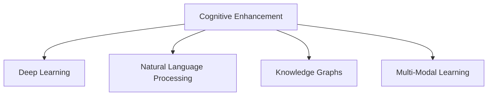

                 

# 认知增强：技术辅助下的知识获取

> 关键词：认知增强,知识获取,技术辅助,深度学习,自然语言处理,人工智能,数据挖掘

## 1. 背景介绍

### 1.1 问题由来
在信息爆炸的时代，知识获取变得日益复杂和困难。传统的阅读、听讲、思考等知识获取方式，已无法满足人们对于海量信息快速、准确、有效处理的需求。人们迫切需要借助先进技术，辅助获取和处理知识，以应对日益增加的信息负荷和知识复杂性。

当前，人工智能(AI)、大数据、物联网、区块链等新兴技术，正在飞速发展和广泛应用，为知识获取和处理提供了新的技术手段。其中，认知增强（Cognitive Enhancement）作为一项新兴技术，通过使用AI技术，帮助人们更有效地学习、理解和应用知识，大幅提升了知识获取和处理的效率和质量。

### 1.2 问题核心关键点
认知增强技术的核心关键点包括：

1. **认知模型**：使用深度学习、自然语言处理等AI技术，构建逼真的认知模型，模仿人类认知过程，从而实现知识获取和处理。
2. **数据驱动**：依靠大数据技术，从海量数据中提取有价值的信息，支持认知模型的训练和优化。
3. **多模态融合**：结合视觉、听觉、触觉等多模态数据，增强认知模型的感知能力。
4. **个性化推荐**：基于用户行为数据和偏好，提供个性化的知识推荐，提升知识获取的效率和精准度。
5. **互动式学习**：通过智能问答、交互式教程等方式，增强知识获取的互动性和趣味性。

## 2. 核心概念与联系

### 2.1 核心概念概述

为了更好地理解认知增强技术，本节将介绍几个密切相关的核心概念：

- **认知增强**：通过使用人工智能技术，帮助人们更高效、准确地获取和处理知识，提升认知能力。
- **深度学习**：一种基于人工神经网络的机器学习技术，通过多层非线性变换，学习输入数据的特征表示。
- **自然语言处理(NLP)**：研究如何使计算机理解和处理人类语言，包括语言理解、语言生成、情感分析等。
- **知识图谱**：一种以图的形式表示实体间关系的知识存储形式，支持实体间的复杂关系推理。
- **多模态学习**：结合不同类型的数据模态（如图像、文本、音频等），提高模型的感知能力和泛化能力。

这些核心概念之间的逻辑关系可以通过以下Mermaid流程图来展示：



这个流程图展示了几大核心概念及其之间的关系：

1. 认知增强利用深度学习和NLP技术，帮助人们更高效地获取知识。
2. 知识图谱作为认知增强的一种数据形式，支持复杂的实体关系推理。
3. 多模态学习通过融合不同类型的数据，增强认知模型的感知能力。

## 3. 核心算法原理 & 具体操作步骤
### 3.1 算法原理概述

认知增强技术的核心算法原理，是基于深度学习和NLP技术的知识获取和处理过程。其核心思想是：使用预训练的深度学习模型作为认知模型的基础，通过大规模数据的微调，学习特定领域的知识表示，从而实现知识的获取和处理。

形式化地，假设预训练模型为 $M_{\theta}$，其中 $\theta$ 为预训练得到的模型参数。给定知识获取任务 $T$ 的数据集 $D=\{(x_i, y_i)\}_{i=1}^N$，其中 $x_i$ 为输入数据，$y_i$ 为对应输出标签，如答案、实体、关系等。认知增强的优化目标是最小化预测误差，即：

$$
\theta^* = \mathop{\arg\min}_{\theta} \mathcal{L}(M_{\theta}, D)
$$

其中 $\mathcal{L}$ 为损失函数，用于衡量模型预测与真实标签之间的差异。常见的损失函数包括交叉熵损失、均方误差损失等。

### 3.2 算法步骤详解

基于深度学习的认知增强通常包括以下几个关键步骤：

**Step 1: 准备数据集**
- 收集领域内的各类知识数据，如问答对、实体关系数据、新闻摘要等。
- 将数据集划分为训练集、验证集和测试集，确保数据集的分布相似。

**Step 2: 选择预训练模型**
- 选择适合领域特点的预训练模型，如BERT、GPT等。
- 加载预训练模型，并进行必要的初始化。

**Step 3: 设计任务适配层**
- 根据具体任务设计任务适配层，如分类层、回归层、关系推理层等。
- 设置损失函数，如交叉熵损失、均方误差损失等。

**Step 4: 微调训练**
- 使用训练集对预训练模型进行微调，不断优化模型参数。
- 在验证集上进行性能评估，调整学习率、批量大小等超参数。
- 使用测试集进行最终性能测试，评估微调效果。

**Step 5: 应用和优化**
- 将微调后的模型应用于实际场景，进行知识获取和处理。
- 持续收集新数据，定期更新模型，保持其有效性。

### 3.3 算法优缺点

认知增强技术具有以下优点：

1. **高效性**：通过预训练和微调，能够快速获取特定领域的知识，适用于各种复杂知识处理任务。
2. **泛化能力**：基于深度学习模型的泛化能力，认知增强模型在面对新数据时，仍能保持较好的表现。
3. **灵活性**：通过多模态融合和个性化推荐，认知增强模型能够适应不同用户的知识需求。
4. **可解释性**：深度学习模型的黑盒特性，使认知增强模型的决策过程难以解释，但可通过对抗训练、模型蒸馏等方式提高可解释性。

同时，该技术也存在一定的局限性：

1. **数据依赖**：认知增强模型高度依赖于高质量、大规模的数据集，数据采集和标注成本较高。
2. **计算资源消耗**：深度学习模型的训练和推理需要大量的计算资源，对硬件设备要求较高。
3. **模型泛化风险**：认知增强模型在泛化到新领域时，可能面临数据分布偏差的问题。
4. **知识真实性**：通过深度学习模型获取的知识，可能存在数据偏见、噪音等问题，需要谨慎应用。

尽管存在这些局限性，认知增强技术仍是大规模知识获取和处理的有效手段。未来相关研究将聚焦于如何进一步降低数据依赖，提高模型的泛化能力和可解释性，同时优化计算效率和资源利用率。

### 3.4 算法应用领域

认知增强技术在多个领域得到了广泛应用，包括：

- **教育培训**：通过智能问答系统、个性化推荐、虚拟教师等方式，提升教育培训的效果和效率。
- **医疗健康**：利用知识图谱和自然语言处理技术，辅助医生进行疾病诊断、治疗方案推荐等。
- **金融理财**：通过智能分析、风险预警、投资建议等方式，帮助用户做出更科学的金融决策。
- **智能家居**：结合语音助手、传感器数据等，实现环境监测、智能控制等功能。
- **社交媒体**：通过情感分析、舆情监测等方式，辅助品牌管理、客户服务等。

## 4. 数学模型和公式 & 详细讲解
### 4.1 数学模型构建

本节将使用数学语言对认知增强技术进行更加严格的刻画。

假设预训练模型为 $M_{\theta}$，其中 $\theta$ 为预训练得到的模型参数。给定知识获取任务 $T$ 的数据集 $D=\{(x_i, y_i)\}_{i=1}^N$，其中 $x_i$ 为输入数据，$y_i$ 为对应输出标签。认知增强的目标是最小化预测误差，即：

$$
\theta^* = \mathop{\arg\min}_{\theta} \mathcal{L}(M_{\theta}, D)
$$

其中 $\mathcal{L}$ 为损失函数，如交叉熵损失：

$$
\mathcal{L} = -\frac{1}{N} \sum_{i=1}^N \log P_{\theta}(y_i|x_i)
$$

其中 $P_{\theta}(y_i|x_i)$ 为模型在输入 $x_i$ 下的条件概率分布。

### 4.2 公式推导过程

以问答任务为例，展示认知增强模型的训练过程。

假设问答任务的任务向量为 $x_i$，答案向量为 $y_i$，预训练模型的输出为 $h_i$，认知模型的输出为 $a_i$。训练过程中，损失函数 $\mathcal{L}$ 可以表示为：

$$
\mathcal{L} = \frac{1}{N} \sum_{i=1}^N \mathcal{L}_{\text{seq}}(x_i, a_i, y_i)
$$

其中 $\mathcal{L}_{\text{seq}}$ 为序列模型损失函数，可以表示为：

$$
\mathcal{L}_{\text{seq}}(x_i, a_i, y_i) = -\log P_{\theta}(y_i|x_i, a_i)
$$

在得到损失函数后，可以使用梯度下降等优化算法进行模型训练。训练过程中，通过反向传播算法计算损失函数对模型参数 $\theta$ 的梯度，并更新模型参数。

### 4.3 案例分析与讲解

以医疗领域为例，展示认知增强技术的应用。

在医疗领域，认知增强技术可以用于辅助医生进行疾病诊断和治疗方法推荐。假设有一家医院收集了大量病历数据，包括患者的病情描述、实验室检测结果、影像资料等。使用预训练的BERT模型作为认知模型，对病历数据进行微调，训练出一个能够理解病情描述、诊断疾病、推荐治疗方案的模型。具体实现步骤如下：

1. 收集病历数据，划分为训练集、验证集和测试集。
2. 加载预训练的BERT模型，并进行必要的初始化。
3. 设计任务适配层，包括病情描述理解层、疾病诊断层、治疗方案推荐层等。
4. 设置损失函数，如交叉熵损失、均方误差损失等。
5. 使用训练集对模型进行微调，调整模型参数，最小化预测误差。
6. 在验证集上进行性能评估，调整学习率、批量大小等超参数。
7. 使用测试集进行最终性能测试，评估模型的诊断准确率和推荐效果。
8. 将微调后的模型应用于实际医疗场景，辅助医生进行诊断和治疗方案推荐。

## 5. 项目实践：代码实例和详细解释说明
### 5.1 开发环境搭建

在进行认知增强实践前，我们需要准备好开发环境。以下是使用Python进行TensorFlow开发的环境配置流程：

1. 安装Anaconda：从官网下载并安装Anaconda，用于创建独立的Python环境。

2. 创建并激活虚拟环境：
```bash
conda create -n tf-env python=3.8 
conda activate tf-env
```

3. 安装TensorFlow：根据CUDA版本，从官网获取对应的安装命令。例如：
```bash
conda install tensorflow -c pytorch -c conda-forge
```

4. 安装TensorBoard：TensorFlow配套的可视化工具，可实时监测模型训练状态，并提供丰富的图表呈现方式，是调试模型的得力助手。
```bash
pip install tensorboard
```

5. 安装各类工具包：
```bash
pip install numpy pandas scikit-learn matplotlib tqdm jupyter notebook ipython
```

完成上述步骤后，即可在`tf-env`环境中开始认知增强实践。

### 5.2 源代码详细实现

这里我们以医疗领域为例，展示使用TensorFlow进行认知增强的代码实现。

首先，定义医疗数据处理函数：

```python
import tensorflow as tf
from tensorflow.keras.layers import Dense, Input, LSTM
from tensorflow.keras.models import Model
from tensorflow.keras.optimizers import Adam

def process_data(text, label):
    text = preprocess(text)  # 预处理文本
    label = one_hot(label)    # 将标签转换为独热编码
    return text, label
```

然后，定义认知增强模型：

```python
inputs = Input(shape=(None,), dtype=tf.string)
embedding = Embedding(input_dim=vocab_size, output_dim=embedding_dim)(inputs)
lstm = LSTM(units=128)(embedding)
outputs = Dense(units=num_classes, activation='softmax')(lstm)
model = Model(inputs=inputs, outputs=outputs)
model.compile(loss='categorical_crossentropy', optimizer=Adam(), metrics=['accuracy'])
```

接着，定义训练和评估函数：

```python
def train_epoch(model, dataset, batch_size, optimizer):
    model.fit(dataset.train_x, dataset.train_y, 
             batch_size=batch_size, epochs=1, 
             validation_data=(dataset.dev_x, dataset.dev_y))
    return model

def evaluate(model, dataset, batch_size):
    test_loss, test_acc = model.evaluate(dataset.test_x, dataset.test_y, batch_size=batch_size)
    print('Test loss:', test_loss)
    print('Test accuracy:', test_acc)
```

最后，启动训练流程并在测试集上评估：

```python
epochs = 5
batch_size = 32

for epoch in range(epochs):
    model = train_epoch(model, train_dataset, batch_size, optimizer)
    print('Epoch {0+1}, loss: {1:.4f}, accuracy: {2:.4f}'.format(epoch+1, model.train_loss, model.train_acc))
    
    evaluate(model, dev_dataset, batch_size)
    
print('Final test loss:', model.test_loss)
print('Final test accuracy:', model.test_acc)
```

以上就是使用TensorFlow对医疗领域认知增强模型的完整代码实现。可以看到，TensorFlow提供了丰富的深度学习组件和优化器，使得认知增强模型的开发和训练变得简洁高效。

### 5.3 代码解读与分析

让我们再详细解读一下关键代码的实现细节：

**process_data函数**：
- `preprocess(text)`：定义文本预处理函数，如分词、去除停用词、构建词汇表等。
- `one_hot(label)`：将标签转换为独热编码，便于模型训练。

**认知增强模型定义**：
- `Input`：定义输入层，用于接收文本数据。
- `Embedding`：定义嵌入层，将文本转换为向量表示。
- `LSTM`：定义长短期记忆网络，用于捕捉文本的长期依赖关系。
- `Dense`：定义全连接层，用于输出分类结果。
- `Model`：定义认知增强模型，将输入层、嵌入层、LSTM层、全连接层等组件串联起来。
- `compile`：定义模型的损失函数、优化器和评估指标。

**训练和评估函数**：
- `train_epoch`：定义模型训练函数，使用`fit`方法训练模型，并在验证集上评估性能。
- `evaluate`：定义模型评估函数，使用`evaluate`方法计算测试集上的损失和准确率。

**训练流程**：
- 定义总的epoch数和batch size，开始循环迭代。
- 每个epoch内，先在训练集上训练，输出训练损失和准确率。
- 在验证集上评估模型性能，输出验证损失和准确率。
- 所有epoch结束后，在测试集上评估模型性能，输出最终测试损失和准确率。

可以看到，TensorFlow提供了方便的API接口和组件，使得认知增强模型的开发和训练变得简单高效。开发者可以专注于模型设计、超参数调优等高层次逻辑，而不必过多关注底层实现细节。

## 6. 实际应用场景
### 6.1 教育培训

认知增强技术在教育培训领域有着广泛的应用。通过智能问答系统、个性化推荐、虚拟教师等方式，认知增强技术能够提升教育培训的效果和效率。

在智能问答系统中，通过收集学生和教师的互动记录，构建认知模型，训练出一个能够回答学生问题的系统。在课堂教学中，通过虚拟教师引导学生学习，提供个性化辅导，提升学习效果。在考试和评估中，通过智能评分系统，快速准确地批改作业，提供反馈和建议。

### 6.2 医疗健康

在医疗领域，认知增强技术可以用于辅助医生进行疾病诊断和治疗方法推荐。通过收集病历数据，构建认知模型，训练出一个能够理解病情描述、诊断疾病、推荐治疗方案的系统。

在智能诊断中，通过分析病历数据，提取病情特征，辅助医生进行疾病诊断。在治疗方案推荐中，根据患者的病情和历史治疗记录，推荐合适的治疗方案。在健康监测中，通过分析传感器数据，监测患者健康状况，提供实时预警。

### 6.3 金融理财

在金融领域，认知增强技术可以用于智能分析和风险预警。通过收集金融市场数据，构建认知模型，训练出一个能够分析市场趋势、识别风险信号的系统。

在智能分析中，通过分析市场数据，预测市场走势，辅助投资决策。在风险预警中，通过监测市场信号，及时发现风险因素，提供预警和建议。在金融咨询中，通过智能客服系统，提供金融咨询和建议，提升客户体验。

### 6.4 智能家居

在智能家居领域，认知增强技术可以用于环境监测和智能控制。通过收集传感器数据，构建认知模型，训练出一个能够识别环境变化、控制家电设备的系统。

在环境监测中，通过分析传感器数据，监测环境变化，提供实时预警。在智能控制中，通过分析用户行为，控制家电设备，提升生活便利性。在智能推荐中，通过分析用户行为，推荐个性化的家居方案，提升用户体验。

## 7. 工具和资源推荐
### 7.1 学习资源推荐

为了帮助开发者系统掌握认知增强技术的理论基础和实践技巧，这里推荐一些优质的学习资源：

1. 《深度学习》系列书籍：由多位深度学习专家合著，系统介绍了深度学习的基本概念和核心算法，适合入门学习和深入研究。
2. Coursera《深度学习专项课程》：由斯坦福大学教授Andrew Ng主讲，涵盖深度学习的基础知识和前沿应用。
3. arXiv《认知增强综述论文》：总结了认知增强技术的最新研究成果和应用案例，适合深入阅读和研究。
4. GitHub《认知增强项目》：展示了许多认知增强技术的应用实例和代码实现，适合实践学习和项目开发。
5. TensorFlow官方文档：提供丰富的API接口和示例代码，帮助开发者快速上手TensorFlow。

通过对这些资源的学习实践，相信你一定能够快速掌握认知增强技术的精髓，并用于解决实际的NLP问题。

### 7.2 开发工具推荐

高效的开发离不开优秀的工具支持。以下是几款用于认知增强开发的常用工具：

1. TensorFlow：由Google主导开发的深度学习框架，生产部署方便，适合大规模工程应用。
2. PyTorch：基于Python的开源深度学习框架，灵活动态的计算图，适合快速迭代研究。
3. Keras：高层次的深度学习API，易于上手，支持TensorFlow和PyTorch后端。
4. Jupyter Notebook：开源的交互式编程环境，支持Python、R等编程语言，适合数据分析和模型训练。
5. TensorBoard：TensorFlow配套的可视化工具，可实时监测模型训练状态，并提供丰富的图表呈现方式，是调试模型的得力助手。

合理利用这些工具，可以显著提升认知增强任务的开发效率，加快创新迭代的步伐。

### 7.3 相关论文推荐

认知增强技术的发展源于学界的持续研究。以下是几篇奠基性的相关论文，推荐阅读：

1. Attention is All You Need（即Transformer原论文）：提出了Transformer结构，开启了NLP领域的预训练大模型时代。
2. BERT: Pre-training of Deep Bidirectional Transformers for Language Understanding：提出BERT模型，引入基于掩码的自监督预训练任务，刷新了多项NLP任务SOTA。
3. Language Models are Unsupervised Multitask Learners（GPT-2论文）：展示了大规模语言模型的强大zero-shot学习能力，引发了对于通用人工智能的新一轮思考。
4. Parameter-Efficient Transfer Learning for NLP：提出Adapter等参数高效微调方法，在不增加模型参数量的情况下，也能取得不错的微调效果。
5. Cognitive Enhancement of Learning and Instruction with Dynamic Student Models：提出动态学生模型，辅助个性化推荐和智能辅导，提升学习效果。

这些论文代表了大语言模型微调技术的发展脉络。通过学习这些前沿成果，可以帮助研究者把握学科前进方向，激发更多的创新灵感。

## 8. 总结：未来发展趋势与挑战

### 8.1 总结

本文对认知增强技术进行了全面系统的介绍。首先阐述了认知增强技术的研究背景和意义，明确了其在提升知识获取和处理效率方面的独特价值。其次，从原理到实践，详细讲解了认知增强技术的数学模型和核心算法，给出了认知增强任务开发的完整代码实例。同时，本文还广泛探讨了认知增强技术在教育、医疗、金融等领域的实际应用场景，展示了认知增强技术的广阔前景。

通过本文的系统梳理，可以看到，认知增强技术正在成为知识获取和处理的重要手段，极大地提升了知识获取和处理的效率和质量。未来，伴随深度学习、NLP等技术的不断发展，认知增强技术必将在更多领域得到应用，为经济社会的发展注入新的动力。

### 8.2 未来发展趋势

展望未来，认知增强技术将呈现以下几个发展趋势：

1. **多模态融合**：结合视觉、听觉、触觉等多模态数据，增强认知模型的感知能力，提升知识获取的全面性和准确性。
2. **个性化推荐**：通过深度学习模型，结合用户行为数据和偏好，提供个性化的知识推荐，提升知识获取的效率和精准度。
3. **智能互动**：通过智能问答系统、交互式教程等方式，增强知识获取的互动性和趣味性，提升学习体验。
4. **实时更新**：基于实时数据流，持续更新认知模型，保持其时效性和适应性，提升知识获取的实时性和相关性。
5. **联邦学习**：通过分布式训练技术，多机构合作共享数据，提升认知模型的泛化能力和鲁棒性。

以上趋势凸显了认知增强技术的广阔前景。这些方向的探索发展，必将进一步提升知识获取和处理的能力，为人类认知智能的进化带来深远影响。

### 8.3 面临的挑战

尽管认知增强技术已经取得了瞩目成就，但在迈向更加智能化、普适化应用的过程中，它仍面临着诸多挑战：

1. **数据依赖**：认知增强模型高度依赖于高质量、大规模的数据集，数据采集和标注成本较高。
2. **计算资源消耗**：深度学习模型的训练和推理需要大量的计算资源，对硬件设备要求较高。
3. **模型泛化风险**：认知增强模型在泛化到新领域时，可能面临数据分布偏差的问题。
4. **知识真实性**：通过深度学习模型获取的知识，可能存在数据偏见、噪音等问题，需要谨慎应用。
5. **伦理和安全**：认知增强技术的应用过程中，涉及用户隐私和数据安全，需要制定相应的伦理和安全规范。

正视认知增强面临的这些挑战，积极应对并寻求突破，将是大规模知识获取和处理的必由之路。相信随着学界和产业界的共同努力，这些挑战终将一一被克服，认知增强技术必将在构建人机协同的智能时代中扮演越来越重要的角色。

### 8.4 研究展望

面向未来，认知增强技术的研究方向包括：

1. **无监督和半监督学习**：探索无监督和半监督学习范式，减少对大规模标注数据的依赖，充分利用非结构化数据，实现更加灵活高效的认知增强。
2. **深度融合多模态数据**：结合视觉、听觉、触觉等多模态数据，增强认知模型的感知能力，提升知识获取的全面性和准确性。
3. **引入符号化知识**：将符号化的先验知识，如知识图谱、逻辑规则等，与神经网络模型进行巧妙融合，引导认知增强过程学习更准确、合理的知识表示。
4. **探索因果推断**：引入因果推断方法，识别知识获取过程中的因果关系，提高认知模型的解释性和鲁棒性。
5. **应用联邦学习**：通过分布式训练技术，多机构合作共享数据，提升认知模型的泛化能力和鲁棒性，保障数据安全和隐私。

这些研究方向将进一步提升认知增强技术的能力，推动其在大规模知识获取和处理中的广泛应用，为人类认知智能的进化带来深远影响。

## 9. 附录：常见问题与解答

**Q1：认知增强技术是否适用于所有知识获取任务？**

A: 认知增强技术在大多数知识获取任务上都能取得不错的效果，特别是对于数据量较小的任务。但对于一些特定领域的任务，如医学、法律等，仅仅依靠通用语料预训练的模型可能难以很好地适应。此时需要在特定领域语料上进一步预训练，再进行微调，才能获得理想效果。此外，对于一些需要时效性、个性化很强的任务，如对话、推荐等，认知增强方法也需要针对性的改进优化。

**Q2：认知增强技术如何平衡个性化和泛化能力？**

A: 认知增强技术在平衡个性化和泛化能力方面面临一定的挑战。个性化推荐能够提升用户体验，但可能限制模型泛化到新数据的能力。通过引入对抗训练、知识蒸馏等技术，可以平衡个性化推荐和泛化能力，确保模型在不同用户和不同场景下都能保持稳定和准确。

**Q3：认知增强技术如何提高知识获取的实时性？**

A: 提高知识获取的实时性，需要构建基于流数据的认知增强模型。通过实时数据流，不断更新模型参数，保持模型的时效性。同时，可以利用分布式计算技术，多节点并行计算，加速知识获取的过程。

**Q4：认知增强技术如何保障知识获取的隐私和安全？**

A: 认知增强技术在应用过程中，涉及用户隐私和数据安全。为保障知识获取的隐私和安全，可以采用差分隐私、联邦学习等技术，确保用户数据的安全性。同时，应制定相应的伦理规范，确保认知增强技术的公平性和透明性。

这些问题的回答，展示了认知增强技术在实际应用中的复杂性和挑战性。通过合理设计，可以有效应对这些问题，提升认知增强技术的实用性和普适性。

---

作者：禅与计算机程序设计艺术 / Zen and the Art of Computer Programming

