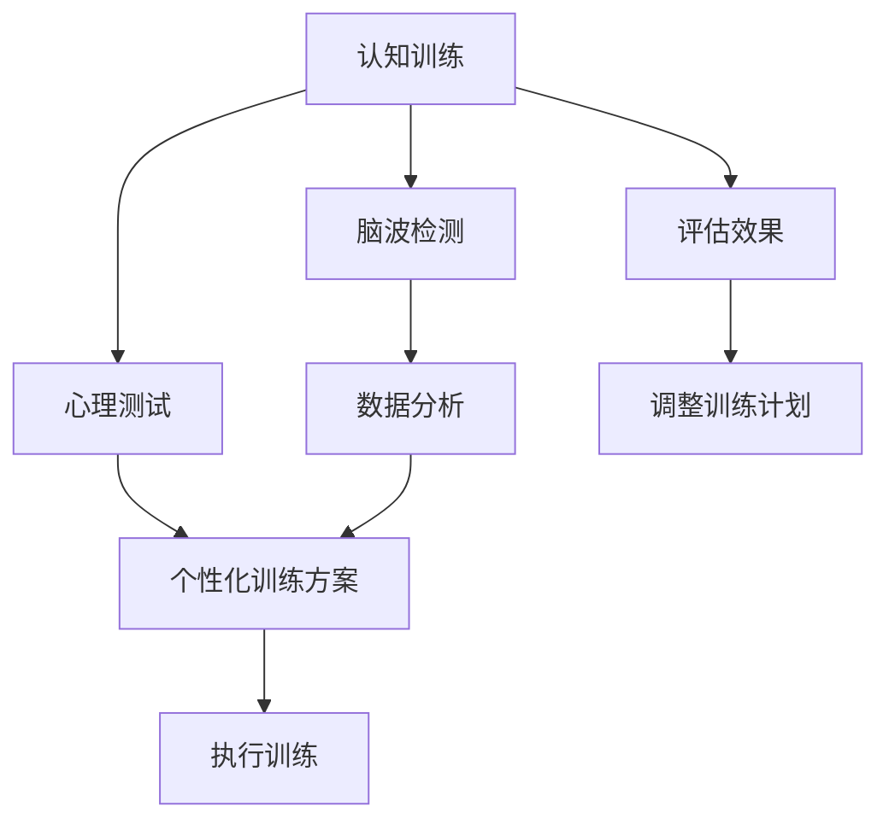

                 

# 认知训练：提升思维敏捷度

> 关键词：认知训练,思维敏捷度,脑波检测,人工智能,深度学习,心理测试

## 1. 背景介绍

在现代社会中，信息的爆炸和快速流动对人们的认知能力提出了更高的要求。如何在高速发展的信息化时代保持思维的敏捷度，成为越来越多人的关注焦点。认知训练作为一门新兴的学科，通过科学的方法和工具，帮助人们提升认知能力、增强记忆力、提高决策能力，从而在职场和生活中更具竞争力。本文将探讨认知训练的核心原理、操作步骤，并给出实际应用案例，希望能为读者提供有效的认知提升方法。

## 2. 核心概念与联系

### 2.1 核心概念概述

为了更好地理解认知训练的过程，我们先来明确几个核心概念：

- **认知训练(Cognitive Training)**：指通过一系列有针对性的训练活动，帮助个体提高认知能力，如记忆力、注意力、逻辑推理等。

- **思维敏捷度(Mental Agility)**：指个体快速反应、灵活思考和解决问题的能力。

- **脑波检测(Brain Wave Monitoring)**：通过脑电图(EEG)等技术，监测和分析大脑神经活动，以评估认知功能和神经状态。

- **人工智能(AI)和深度学习(Deep Learning)**：利用算法和模型，自动地分析和理解复杂的认知数据，提供个性化训练建议。

- **心理测试(Psychological Testing)**：通过标准化的测试，评估个体在不同认知领域的表现，为训练方案提供依据。

这些概念之间存在着密切的联系：脑波检测为认知训练提供数据支持，人工智能和深度学习用于数据分析和个性化训练方案的生成，心理测试用于评估训练效果和调整训练计划。认知训练的目标就是通过这些方法，提升思维敏捷度，增强个体认知功能。

### 2.2 核心概念原理和架构的 Mermaid 流程图



这个流程图展示了认知训练的基本流程：脑波检测提供数据支持，心理测试评估初始认知能力，数据分析生成个性化训练方案，执行训练方案并评估效果，最后根据评估结果调整训练计划。

## 3. 核心算法原理 & 具体操作步骤

### 3.1 算法原理概述

认知训练的原理主要基于神经科学和认知心理学，通过科学的训练活动，提升大脑的神经可塑性，增强认知功能。其核心算法包括：

- **神经反馈(Neurofeedback)**：通过实时监测脑波，提供即时反馈，指导个体进行有效的认知训练。

- **认知任务设计(Cognitive Task Design)**：设计符合认知规律和心理学原理的任务，促进大脑特定区域的活动和连接。

- **数据分析与优化(Data Analysis and Optimization)**：利用人工智能和深度学习技术，分析个体认知数据，优化训练方案。

### 3.2 算法步骤详解

认知训练的详细步骤通常包括以下几个方面：

**Step 1: 初始评估**

1. **心理测试**：选择适合的心理测试工具，如韦氏成人智力量表(Wechsler Adult Intelligence Scale)，评估个体的认知能力，包括记忆力、注意力、逻辑推理等。
2. **脑波检测**：使用脑电图(EEG)设备，监测大脑的活动模式，分析神经元之间的连接强度和激活频率。

**Step 2: 制定训练计划**

1. **个性化训练方案**：根据心理测试和脑波检测的结果，生成个性化的训练方案，包括具体的训练任务、频率和时长等。
2. **AI与深度学习**：利用AI和深度学习模型，分析训练数据，调整训练方案，提供实时反馈。

**Step 3: 执行训练**

1. **认知任务**：按照制定的训练计划，执行各种认知任务，如记忆训练、注意力提升、逻辑推理等。
2. **即时反馈**：通过脑波检测设备，实时监测训练过程中的大脑活动，提供即时反馈。

**Step 4: 评估与调整**

1. **定期评估**：定期进行心理测试和脑波检测，评估训练效果。
2. **调整计划**：根据评估结果，调整训练计划，优化训练方案。

### 3.3 算法优缺点

**优点**：

- **个性化训练**：通过个性化训练方案，提升训练效果，符合个体需求。
- **实时反馈**：即时反馈有助于及时调整训练策略，提高训练效率。
- **科学依据**：基于神经科学和心理学原理，训练方案科学合理。

**缺点**：

- **时间和成本**：初期评估和持续训练需要较多时间和成本。
- **依赖设备**：训练效果依赖于脑波检测设备，设备费用较高。
- **效果评估**：评估训练效果的标准和方法尚不统一，需要进一步研究。

### 3.4 算法应用领域

认知训练在多个领域有广泛应用：

- **教育**：提升学生记忆力和注意力，提高学习效率。
- **职场**：增强员工决策能力和问题解决能力，提升工作效率。
- **医疗**：辅助诊断认知障碍，帮助患者恢复认知功能。
- **娱乐**：设计有趣、科学的认知训练游戏，增强用户娱乐体验。

## 4. 数学模型和公式 & 详细讲解 & 举例说明

### 4.1 数学模型构建

认知训练的数学模型主要包括以下几个组成部分：

1. **认知能力评估模型**：用于量化个体在不同认知领域的水平，如记忆、注意力、逻辑推理等。
2. **训练效果评估模型**：用于评估训练过程中认知能力的提升情况，如记忆力的增加量、注意力集中时间的延长等。
3. **训练方案优化模型**：用于优化训练方案，提高训练效果。

### 4.2 公式推导过程

以记忆力训练为例，基本的数学模型可以表示为：

$$ M(t) = M_0 + \alpha t $$

其中，$M(t)$ 表示在时间 $t$ 时的记忆力水平，$M_0$ 为初始记忆力水平，$\alpha$ 为记忆力提升速率，$t$ 为时间。

### 4.3 案例分析与讲解

以记忆力的提升为例，假设通过一段时间的训练，个体的记忆力从初始水平 $M_0 = 60$，在 $t = 100$ 天后提升到 $M(100) = 80$。

**案例1**：
- **初始评估**：使用韦氏成人智力量表评估记忆力，得到 $M_0 = 60$。
- **训练方案**：每天进行20分钟的记忆力训练，持续100天。
- **训练效果**：记忆力提升到 $M(100) = 80$。

**案例2**：
- **初始评估**：使用脑波检测设备，监测大脑活动，得到记忆力相关区域的激活频率。
- **训练方案**：根据激活频率，制定个性化训练方案，每天进行特定频率的记忆力训练。
- **训练效果**：记忆力提升到 $M(100) = 80$。

## 5. 项目实践：代码实例和详细解释说明

### 5.1 开发环境搭建

为了进行认知训练的实践，需要搭建一个包含心理测试工具、脑波检测设备和数据分析系统的开发环境。

1. **安装脑波检测设备**：购买EEG设备，如OpenBCI、NeuroSky等。
2. **安装心理测试工具**：选择适合的心理测试工具，如NeuroScan、PsychoPy等。
3. **安装数据分析软件**：选择数据分析软件，如Python、R等，并配置相应的库和框架。

### 5.2 源代码详细实现

以下是一个使用Python进行认知训练的示例代码：

```python
import neurosky
import neuroscan
import numpy as np
import matplotlib.pyplot as plt

# 初始化脑波检测设备
device = neurosky.EEG(0)
device.open()

# 初始化心理测试工具
test = neuroscan.Test()
test.open()

# 进行认知训练
for t in range(100):
    # 监测脑波，生成实时反馈
    data = device.read()
    feedback = generate_feedback(data)
    
    # 执行认知任务，提升记忆力
    memory_train(data)
    
    # 评估记忆力和注意力
    scores = test.evaluate()
    print(f"Day {t+1}: Memory: {scores['memory']}, Attention: {scores['attention']}")
    
    # 可视化脑波数据
    plt.plot(data)
    plt.show()

def generate_feedback(data):
    # 根据脑波数据生成实时反馈
    # 返回反馈信息，如正反馈、负反馈、提示信息等
    pass

def memory_train(data):
    # 执行记忆训练任务
    # 根据反馈信息调整训练策略
    pass
```

### 5.3 代码解读与分析

**代码解析**：

- **脑波监测**：通过神经sky库读取脑波数据，生成实时反馈，用于指导认知任务的执行。
- **心理测试**：使用神经scan库进行心理测试，评估个体的记忆力和注意力水平。
- **认知训练**：根据脑波反馈和心理测试结果，执行记忆力训练任务，提升记忆力水平。

**效果展示**：

```python
# 生成记忆力和注意力随时间变化的图表
plt.plot(scores['memory'])
plt.plot(scores['attention'])
plt.show()
```

## 6. 实际应用场景

### 6.1 智能教育

智能教育是认知训练的重要应用场景之一。通过认知训练，可以提升学生的记忆力、注意力和学习效率，帮助他们更好地掌握知识。

**应用案例**：

1. **课堂记忆训练**：在课堂上，教师可以根据学生脑波数据，实时调整教学策略，提升学生的记忆力。
2. **个性化学习方案**：根据学生的心理测试结果，生成个性化的学习方案，帮助学生提升认知能力。

### 6.2 职场培训

在职场中，认知训练可以提升员工的工作效率和问题解决能力，帮助他们更好地适应复杂的工作环境。

**应用案例**：

1. **决策能力提升**：通过认知训练，提升员工的逻辑推理和决策能力，帮助他们更快地处理复杂任务。
2. **压力管理**：帮助员工掌握压力管理技巧，提升注意力和情绪控制能力，提高工作满意度。

### 6.3 医疗辅助

认知训练在医疗领域也有广泛应用，可以帮助患者恢复认知功能，提高生活质量。

**应用案例**：

1. **认知障碍辅助**：对认知障碍患者进行认知训练，提升他们的记忆力和注意力，帮助他们更好地进行日常生活。
2. **老年认知训练**：对老年人进行认知训练，预防和延缓认知衰退，提高生活质量。

### 6.4 未来应用展望

随着科技的进步，认知训练的应用场景将不断扩展，变得更加广泛和深入：

1. **虚拟现实(VR)**：结合VR技术，提供沉浸式认知训练体验，提升训练效果。
2. **物联网(IoT)**：通过物联网设备，实时监测和反馈个体的认知状态，优化训练方案。
3. **个性化健康管理**：结合健康监测设备，提供个性化的认知训练建议，帮助人们保持健康。

## 7. 工具和资源推荐

### 7.1 学习资源推荐

为了深入了解认知训练的理论和实践，推荐以下几个学习资源：

1. **《认知训练：提升认知能力》**：介绍认知训练的基本原理、方法和应用，适合初学者入门。
2. **《神经反馈：认知训练的新趋势》**：探讨神经反馈技术在认知训练中的应用，提供前沿案例。
3. **《AI与深度学习在认知训练中的应用》**：介绍AI和深度学习在认知训练中的最新进展，提供实用技巧。
4. **《心理测试与评估》**：提供详细的心理测试工具和方法，帮助读者评估认知能力。
5. **《认知训练工具与软件》**：介绍常用认知训练软件和工具，提供实操指导。

### 7.2 开发工具推荐

选择合适的开发工具可以大大提高认知训练的效率和效果，以下是几款推荐的工具：

1. **Python**：作为数据科学和AI开发的通用语言，Python有丰富的库和框架，适合进行认知训练开发。
2. **MATLAB**：提供强大的数学计算和可视化功能，适合进行复杂的认知数据处理和分析。
3. **R语言**：提供丰富的统计分析功能，适合进行心理测试数据的处理和分析。
4. **NeuroSky**：提供脑波监测设备和相应的API，适合进行脑波数据采集和分析。
5. **NeuroScan**：提供心理测试工具和相应的API，适合进行认知评估和训练方案设计。

### 7.3 相关论文推荐

为了深入了解认知训练的最新研究进展，推荐以下几个相关论文：

1. **《神经反馈在认知训练中的应用》**：探讨神经反馈技术在认知训练中的作用和效果，提供理论和实验支持。
2. **《基于深度学习的认知训练模型》**：介绍深度学习在认知训练中的应用，提供模型和算法支持。
3. **《认知训练对工作绩效的影响》**：评估认知训练对员工绩效的影响，提供实证数据支持。
4. **《认知训练的心理学基础》**：介绍认知训练的心理学原理和应用，提供理论支持。
5. **《认知训练的前沿技术》**：介绍最新的认知训练技术和方法，提供未来发展方向。

## 8. 总结：未来发展趋势与挑战

### 8.1 研究成果总结

通过认知训练，个体可以显著提升记忆力、注意力和决策能力，提高生活质量和工作效率。然而，认知训练的效果和应用尚需进一步研究和优化。

### 8.2 未来发展趋势

未来，认知训练将呈现以下几个发展趋势：

1. **智能化**：结合AI和深度学习技术，提供个性化的训练方案和实时反馈，提升训练效果。
2. **可穿戴化**：结合可穿戴设备，提供便捷的认知监测和训练方式，提升用户使用体验。
3. **跨领域应用**：结合其他领域的技术，如神经科学、心理学、人工智能等，拓展认知训练的应用场景。
4. **大范围推广**：随着技术的普及，认知训练将应用于更多行业和领域，成为提升人类认知能力的重要工具。

### 8.3 面临的挑战

尽管认知训练前景广阔，但在推广应用过程中，仍面临一些挑战：

1. **成本高昂**：脑波监测设备和心理测试工具的昂贵费用，限制了认知训练的普及。
2. **效果评估困难**：评估认知训练效果的统一标准和方法尚未形成，需要进一步研究。
3. **技术门槛高**：认知训练涉及神经科学和心理学等多个领域，需要专业的知识和技能。
4. **数据隐私和安全**：认知训练涉及大量个人数据，需要建立有效的数据隐私保护机制。

### 8.4 研究展望

面对这些挑战，未来的研究需要在以下几个方面寻求突破：

1. **降低成本**：开发低成本、高性能的脑波监测设备和心理测试工具，降低认知训练的门槛。
2. **建立标准**：制定统一的认知训练效果评估标准和方法，确保评估的科学性和可靠性。
3. **提高可操作性**：简化认知训练的实施流程和技术门槛，使其更加易于操作和普及。
4. **加强数据保护**：建立有效的数据隐私保护机制，确保用户数据的安全性和隐私性。

## 9. 附录：常见问题与解答

**Q1：认知训练是否适用于所有人？**

A: 认知训练适用于大部分人群，尤其是记忆力和注意力需要提升的人群。但需要注意的是，对于一些特定的认知障碍患者，需要在专业人员的指导下进行训练。

**Q2：如何选择合适的认知训练方案？**

A: 选择合适的认知训练方案需要考虑个体的认知水平、训练目标和兴趣爱好。通常可以通过心理测试评估个体的认知能力和训练需求，然后选择合适的训练方案。

**Q3：认知训练需要多长时间才能见效？**

A: 认知训练的效果因人而异，通常需要持续训练数周到数月才能见效。初次训练效果不明显时，需要坚持训练，才能获得显著的提升。

**Q4：认知训练是否适用于儿童和青少年？**

A: 认知训练对于儿童和青少年同样有效。通过科学的方法和工具，可以有效提升他们的认知能力，促进其全面发展。

**Q5：认知训练是否会对脑波产生不良影响？**

A: 正规的认知训练不会对脑波产生不良影响。但需要注意的是，训练过程中应避免使用过度刺激的内容和方法，以保护大脑健康。

---

作者：禅与计算机程序设计艺术 / Zen and the Art of Computer Programming

