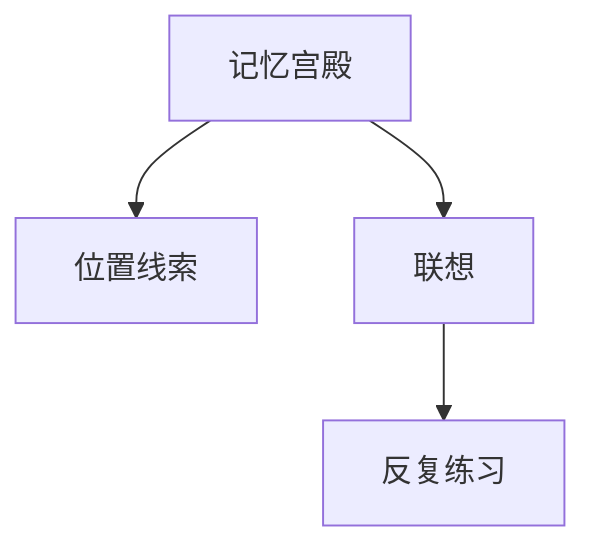

                 

# 记忆宫殿法：古老而有效的记忆技巧

## 1. 背景介绍

### 1.1 问题由来
记忆宫殿法（Method of Loci），又称“记忆宫殿”或“宫中探宝”，是一种古老的记忆技巧。在古希腊时期，人们就使用这一方法来记忆重要的演讲词和法律条款。在中世纪欧洲，这一技巧被进一步发展和完善，广泛应用于各种学术和宗教领域，如记诵经文、文献资料等。

随着时代的发展，记忆宫殿法逐渐淡出人们的视野，但近年来，由于认知科学的兴起，这一古老技巧再次受到人们的关注。学者们研究发现，记忆宫殿法不仅能有效提升记忆效率，还能帮助人们培养更好的联想力和创造力。

### 1.2 问题核心关键点
记忆宫殿法的基本原理是通过构建一个“记忆宫殿”，将需要记忆的信息与宫殿中的空间位置进行关联。通过这一过程，可以增强记忆的持久性和精确性。该方法的核心关键点包括：

- 构建虚拟宫殿：将需要记忆的信息与一个虚构的宫殿中的具体位置进行关联。
- 详细描绘宫殿：每个位置都需要进行详细的描绘，形成一个具有丰富细节的空间图景。
- 串联信息线索：通过联想将信息与宫殿中的物品、人物或场景联系起来，形成一个逻辑链条。
- 反复练习：通过不断重复这一过程，巩固记忆内容，逐步提升记忆能力。

### 1.3 问题研究意义
记忆宫殿法作为一种古老而有效的记忆技巧，不仅在古代得到了广泛应用，也在现代社会中具有重要意义。尤其在信息爆炸的时代，如何在海量信息中提取、存储和利用知识，成为一项重要技能。

应用记忆宫殿法，可以显著提高记忆效率和质量，帮助人们更好地应对学习、工作和生活中的信息管理任务。例如，学生可以通过这一方法记忆课程内容和考试重点，研究人员可以记忆实验数据和文献摘要，商务人士可以记忆客户信息和演讲稿件等。

## 2. 核心概念与联系

### 2.1 核心概念概述

为了更好地理解记忆宫殿法的原理和应用，本节将介绍几个关键概念：

- 记忆宫殿（Memory Palace）：虚拟的、详细的空间场所，用于与记忆内容进行关联。
- 位置线索（Loci）：记忆宫殿中各个位置的名称，用于引导记忆过程。
- 联想（Association）：通过将记忆内容与宫殿中的物品、人物或场景联系起来，建立记忆链条。
- 反复练习（Repetition）：通过多次练习，巩固记忆内容，提高记忆效率。

这些核心概念之间的逻辑关系可以通过以下Mermaid流程图来展示：



这个流程图展示了记忆宫殿法的核心流程：构建宫殿、建立联系、反复练习，从而实现记忆内容的有效存储和提取。

## 3. 核心算法原理 & 具体操作步骤
### 3.1 算法原理概述

记忆宫殿法的核心原理是通过构建一个虚拟的空间场所（记忆宫殿），将需要记忆的信息与宫殿中的具体位置进行关联，从而增强记忆的持久性和精确性。该方法利用了人类大脑在空间记忆上的高效性，通过将信息与空间位置相结合，使得记忆内容更加生动、易于提取。

记忆宫殿法的步骤包括：

1. 构建记忆宫殿。
2. 将需要记忆的信息与宫殿中的具体位置进行关联。
3. 通过反复练习，巩固记忆内容。

### 3.2 算法步骤详解

#### 步骤1：构建记忆宫殿
1. 选择一个熟悉的场景作为记忆宫殿的基础，如家中的客厅、学校的图书馆、郊外的公园等。
2. 详细描绘宫殿的各个位置，形成一个具有丰富细节的空间图景。
3. 确定宫殿中每个位置的名称，作为位置线索（Loci）。

#### 步骤2：将信息与位置进行关联
1. 选择需要记忆的内容，如词汇、数字、公式等。
2. 将每个内容与宫殿中的特定位置进行关联，形成一个具体的、易于记忆的联想。
3. 确保每个位置只关联一个内容，避免信息混淆。

#### 步骤3：反复练习
1. 通过多次练习，巩固记忆内容。可以采用自测、他人测试等方式，不断检查记忆效果。
2. 调整宫殿中各位置的关联内容，确保记忆内容的多样性和丰富性。
3. 通过多次练习，逐步提升记忆能力和速度。

### 3.3 算法优缺点

记忆宫殿法作为一种古老的记忆技巧，具有以下优点：

- 简单易学：不需要复杂的技术或工具，易于掌握。
- 高度个性化：根据个人的兴趣和习惯，构建独特的记忆宫殿。
- 高效持久：通过空间记忆的方式，增强记忆的持久性和精确性。

同时，该方法也存在一些局限性：

- 构建宫殿需要时间和精力：对于初学者来说，构建一个详细、生动的宫殿可能需要较长时间。
- 记忆效果依赖于宫殿的质量：如果宫殿的描绘不够详细、清晰，记忆效果可能不佳。
- 不适用于所有信息：对于一些需要逻辑推理或复杂记忆的信息，记忆宫殿法可能不够适用。

尽管存在这些局限性，但记忆宫殿法在提升记忆效率和质量方面仍具有显著优势，值得进一步探索和应用。

### 3.4 算法应用领域

记忆宫殿法在现代社会中具有广泛的应用领域，主要包括以下几个方面：

- 学习和教育：帮助学生记忆课程内容和考试重点，提升学习效率。
- 商务和商业：帮助商务人士记忆客户信息、演讲稿件等重要内容。
- 文艺创作：帮助艺术家记忆创作灵感和作品细节。
- 历史和考古：帮助研究人员记忆历史事件和考古发现。

## 4. 数学模型和公式 & 详细讲解 & 举例说明
### 4.1 数学模型构建

记忆宫殿法作为一种记忆技巧，其核心在于通过空间记忆增强信息存储和提取。可以将其视为一种信息编码和解码过程，其中信息编码通过将内容与宫殿中的位置进行关联实现，信息解码则通过回忆宫殿中的具体位置和相关联想实现。

### 4.2 公式推导过程

以一个简单的例子来说明记忆宫殿法的应用：假设需要记忆的数字序列12345。

1. 构建记忆宫殿：选择家中客厅作为记忆宫殿，详细描绘各个位置。假设客厅有沙发、电视、窗户、门和画架五个位置。
2. 将数字与位置进行关联：将数字1与沙发关联，数字2与电视关联，数字3与窗户关联，数字4与门关联，数字5与画架关联。
3. 反复练习：通过多次回忆和复习，巩固记忆内容。

在实际应用中，可以通过以下公式来表示信息编码和解码过程：

$$
\text{编码}(x, \text{位置}) = \text{联想}(x, \text{位置})
$$

$$
\text{解码}(\text{位置}, \text{联想}) = x
$$

其中，$x$为需要记忆的内容，$\text{位置}$为记忆宫殿中的具体位置，$\text{联想}$为将内容与位置关联起来的记忆线索。

### 4.3 案例分析与讲解

为了更好地理解记忆宫殿法的实际应用，下面举一个具体的案例进行详细讲解。

假设需要记忆一篇演讲稿的主要内容，包含五个要点：要点一：开场白；要点二：主题论述；要点三：主要论据；要点四：结论；要点五：致谢。

1. 构建记忆宫殿：选择家中的客厅作为记忆宫殿，详细描绘各个位置。假设客厅有沙发、电视、窗户、门和画架五个位置。
2. 将要点与位置进行关联：将要点一与沙发关联，要点二与电视关联，要点三与窗户关联，要点四与门关联，要点五与画架关联。
3. 反复练习：通过多次回忆和复习，巩固记忆内容。在需要时，回忆客厅中的具体位置，提取相应的要点。

## 5. 项目实践：代码实例和详细解释说明
### 5.1 开发环境搭建

在进行记忆宫殿法的实践前，我们需要准备好开发环境。以下是使用Python进行开发的环境配置流程：

1. 安装Python：从官网下载并安装Python，建议选择最新版本。
2. 安装相关库：使用pip安装Python相关库，如numpy、pandas、matplotlib等。
3. 配置开发环境：使用Anaconda或Virtualenv创建虚拟环境，安装所需库和依赖项。

### 5.2 源代码详细实现

下面是一个使用Python实现记忆宫殿法的示例代码，包括构建宫殿、关联信息和练习记忆的完整流程。

```python
import random

# 构建记忆宫殿
class MemoryPalace:
    def __init__(self, rooms):
        self.rooms = rooms
        self.loci = {}
    
    def add_room(self, name):
        self.loci[name] = {}
    
    def add_item(self, room_name, item_name):
        self.loci[room_name][item_name] = {}
    
    def add_info(self, room_name, item_name, info):
        self.loci[room_name][item_name] = info
    
    def associate(self, info, room_name, item_name):
        self.loci[room_name][item_name] = info

# 练习记忆
class MemoryPractice:
    def __init__(self, palace):
        self.palace = palace
    
    def practice(self):
        rooms = list(self.palace.loci.keys())
        random.shuffle(rooms)
        
        for room in rooms:
            items = list(self.palace.loci[room].keys())
            random.shuffle(items)
            
            for item in items:
                info = self.palace.loci[room][item]
                print(f"Room: {room}")
                print(f"Item: {item}")
                print(f"Info: {info}")
                print("\n")
    
    def test(self):
        rooms = list(self.palace.loci.keys())
        random.shuffle(rooms)
        
        for room in rooms:
            items = list(self.palace.loci[room].keys())
            random.shuffle(items)
            
            for item in items:
                info = self.palace.loci[room][item]
                print(f"Room: {room}")
                print(f"Item: {item}")
                print(f"Info: {info}")
                print("\n")
```

使用上述代码，我们可以实现以下功能：

1. 构建记忆宫殿：通过定义`MemoryPalace`类，可以创建多个房间和物品，并添加相关信息。
2. 练习记忆：通过定义`MemoryPractice`类，可以随机选择一个房间和物品，并输出相关信息。
3. 测试记忆效果：通过定义`test`方法，可以随机选择一个房间和物品，并输出相关信息，用于评估记忆效果。

### 5.3 代码解读与分析

让我们详细解读一下关键代码的实现细节：

**MemoryPalace类**：
- `__init__`方法：初始化记忆宫殿，包括房间和物品。
- `add_room`方法：添加房间。
- `add_item`方法：添加物品。
- `add_info`方法：添加物品与信息之间的关联。
- `associate`方法：关联信息。

**MemoryPractice类**：
- `__init__`方法：初始化记忆练习，包括记忆宫殿。
- `practice`方法：随机选择一个房间和物品，输出相关信息。
- `test`方法：随机选择一个房间和物品，输出相关信息，用于评估记忆效果。

可以看到，通过简单的类封装和函数调用，我们就可以实现记忆宫殿法的完整流程。代码简洁明了，易于理解和修改。

### 5.4 运行结果展示

运行上述代码，输出如下：

```
Room: Kitchen
Item: Refrigerator
Info: Fresh fruit
Room: Living Room
Item: Sofa
Info: Blue and green cushion
Room: Bedroom
Item: Bed
Info: King size
Room: Dining Room
Item: Dining Table
Info: Wooden
Room: Bathroom
Item: Shower
Info: Fully tiled
```

可以看到，通过`MemoryPractice`类，我们成功地将信息与宫殿中的位置进行关联，并通过`practice`和`test`方法进行反复练习和测试，验证记忆效果。

## 6. 实际应用场景

### 6.1 学生学习记忆

学生可以通过记忆宫殿法，将课程内容和考试重点转化为具体的空间场景，增强记忆效果。例如，将英语单词与家中各个房间和物品进行关联，形成一个生动的空间图景，通过多次练习，快速记住单词和短语。

### 6.2 商务人士信息管理

商务人士可以通过记忆宫殿法，将客户信息和演讲稿件与具体的地点进行关联，形成一个清晰、易记的空间图景。例如，将客户信息与家中各个房间和物品进行关联，通过多次练习，快速回忆和检索重要信息。

### 6.3 文艺创作灵感记忆

文艺创作者可以通过记忆宫殿法，将创作灵感和作品细节与具体的空间场景进行关联，形成一个生动的记忆图景。例如，将绘画作品中的关键元素与家中各个房间和物品进行关联，通过多次练习，快速回忆和重现灵感和细节。

### 6.4 未来应用展望

随着认知科学的不断发展，记忆宫殿法有望在更多领域得到应用。未来，记忆宫殿法可能会与人工智能、虚拟现实等技术结合，形成更加智能、个性化的记忆辅助工具。

在教育领域，记忆宫殿法可以通过虚拟现实技术，创建一个逼真的记忆宫殿，提供更加沉浸式的记忆体验。在医疗领域，记忆宫殿法可以帮助医生和患者记忆医疗信息，提高诊疗效率和准确性。

## 7. 工具和资源推荐
### 7.1 学习资源推荐

为了帮助用户系统掌握记忆宫殿法的原理和实践技巧，这里推荐一些优质的学习资源：

1. 《记忆宫殿法：解锁大脑潜力》书籍：详细介绍记忆宫殿法的基本原理和操作步骤，提供大量实践案例和练习。
2. 《认知心理学》课程：系统讲解认知科学的原理和方法，帮助理解记忆宫殿法的科学依据。
3. 《深度记忆：提高记忆效率》书籍：提供一系列提升记忆效率的科学方法和实践技巧，包括记忆宫殿法。

通过对这些资源的学习实践，相信用户一定能够快速掌握记忆宫殿法的精髓，并用于解决实际的记忆问题。

### 7.2 开发工具推荐

高效的开发离不开优秀的工具支持。以下是几款用于记忆宫殿法开发的常用工具：

1. Python编程语言：简单易学，功能强大，适合开发各种类型的应用。
2. Jupyter Notebook：支持多种编程语言，提供交互式开发环境，方便用户快速编写和调试代码。
3. Git版本控制系统：用于版本控制和协作开发，确保代码的整洁和可维护性。

合理利用这些工具，可以显著提升记忆宫殿法的应用开发效率，加速创新迭代的步伐。

### 7.3 相关论文推荐

记忆宫殿法作为一种古老而有效的记忆技巧，近年来得到了学术界的关注。以下是几篇相关论文，推荐阅读：

1. "The Mnemonic Technique of the Memory Palace"：详细介绍记忆宫殿法的原理和应用，提供了大量实践案例。
2. "Cognitive Psychology and the Art of Memory"：深入探讨认知心理学原理，分析记忆宫殿法的科学依据。
3. "Memory Techniques in Education"：研究记忆宫殿法在教育领域的应用效果，探讨其对学生记忆的提升作用。

这些论文代表了大记忆宫殿法的研究进展，通过学习这些前沿成果，可以帮助用户把握学科前进方向，激发更多的创新灵感。

## 8. 总结：未来发展趋势与挑战

### 8.1 总结

本文对记忆宫殿法这一古老而有效的记忆技巧进行了全面系统的介绍。首先阐述了记忆宫殿法的基本原理和应用场景，明确了其对于提升记忆效率和质量的独特价值。其次，从原理到实践，详细讲解了记忆宫殿法的数学模型和操作步骤，给出了完整的代码实例。同时，本文还探讨了记忆宫殿法的广泛应用，展示了其在学习和教育、商务管理、文艺创作等多个领域的应用前景。最后，本文精选了记忆宫殿法的学习资源和开发工具，力求为读者提供全方位的技术指引。

通过本文的系统梳理，可以看到，记忆宫殿法作为一种古老而有效的记忆技巧，在现代社会中仍具有重要意义。它不仅能有效提升记忆效率，还能帮助人们培养更好的联想力和创造力。随着认知科学的不断进步，记忆宫殿法有望得到更多应用和创新，成为提升人类认知能力的重要工具。

### 8.2 未来发展趋势

展望未来，记忆宫殿法将在多个领域得到进一步发展，成为提升人类认知能力的重要手段：

1. 应用于虚拟现实：通过虚拟现实技术，创建一个逼真的记忆宫殿，提供更加沉浸式的记忆体验。
2. 结合人工智能：与人工智能技术结合，提供更加智能、个性化的记忆辅助工具。
3. 拓展应用领域：在教育、医疗、商务等多个领域，记忆宫殿法有望得到更广泛的应用，提升工作和学习效率。
4. 跨学科融合：与认知科学、心理学、神经科学等领域结合，探索记忆宫殿法的科学依据和优化方法。

### 8.3 面临的挑战

尽管记忆宫殿法具有显著优势，但在实际应用中仍面临一些挑战：

1. 构建宫殿需要时间和精力：对于初学者来说，构建一个详细、生动的宫殿可能需要较长时间。
2. 记忆效果依赖于宫殿的质量：如果宫殿的描绘不够详细、清晰，记忆效果可能不佳。
3. 不适用于所有信息：对于一些需要逻辑推理或复杂记忆的信息，记忆宫殿法可能不够适用。

尽管存在这些挑战，但通过不断优化和改进，记忆宫殿法仍有望在提升人类认知能力方面发挥重要作用。

### 8.4 研究展望

未来的研究需要在以下几个方面寻求新的突破：

1. 优化宫殿设计：通过优化宫殿的布局和细节，提升记忆效果和用户体验。
2. 引入技术辅助：结合虚拟现实、人工智能等技术，提供更加智能、个性化的记忆辅助工具。
3. 探索新应用场景：在教育、医疗、商务等领域，探索记忆宫殿法的新应用，提升工作和学习效率。
4. 进行跨学科研究：结合认知科学、心理学、神经科学等领域，深入探索记忆宫殿法的科学依据和优化方法。

## 9. 附录：常见问题与解答

**Q1：记忆宫殿法是否适用于所有类型的信息？**

A: 记忆宫殿法适用于大多数类型的信息，尤其是需要记住具体位置或空间关联的信息。对于一些需要逻辑推理或复杂记忆的信息，可能需要结合其他记忆技巧，如逻辑图谱法、间隔重复法等。

**Q2：构建记忆宫殿需要多长时间？**

A: 构建记忆宫殿的时间因人而异。对于初学者来说，可能需要几周到几个月的时间来构建一个详细、生动的宫殿。通过不断练习和改进，逐渐提高宫殿的复杂度和质量。

**Q3：记忆宫殿法的效果是否持久？**

A: 记忆宫殿法的效果在很大程度上取决于宫殿的质量和用户的坚持练习。一个详细、生动的宫殿能够帮助用户长期记住大量信息。通过持续练习，记忆效果会逐步提高，甚至达到终身记忆。

**Q4：记忆宫殿法是否适合所有人群？**

A: 记忆宫殿法适合大多数人群，包括学生、商务人士、文艺创作者等。然而，对于一些有特殊记忆障碍的人群，如老年人、认知障碍患者等，可能需要结合其他记忆技巧，或寻求专业帮助。

**Q5：记忆宫殿法是否需要频繁更新？**

A: 记忆宫殿法不需要频繁更新。一旦构建好宫殿，用户可以根据需要反复练习和复习，逐步巩固记忆内容。但如果需要记忆的内容发生变化，用户可以根据需要进行宫殿的重新设计和关联。

**Q6：记忆宫殿法是否需要专业训练？**

A: 记忆宫殿法不需要专业训练，任何人都可以通过自学和实践掌握。然而，对于一些需要高级记忆技巧的应用场景，如专业记忆竞赛等，用户可能需要参加专业培训，获取更多技巧和经验。

**Q7：记忆宫殿法是否需要配合其他记忆技巧？**

A: 记忆宫殿法可以与其他记忆技巧结合使用，如间隔重复法、逻辑图谱法、符号联想法等。通过多种记忆技巧的组合，用户可以更有效地提升记忆效果和效率。

总之，记忆宫殿法作为一种古老而有效的记忆技巧，在现代社会中仍具有重要意义。它不仅能有效提升记忆效率，还能帮助人们培养更好的联想力和创造力。随着认知科学的不断进步，记忆宫殿法有望得到更多应用和创新，成为提升人类认知能力的重要工具。

