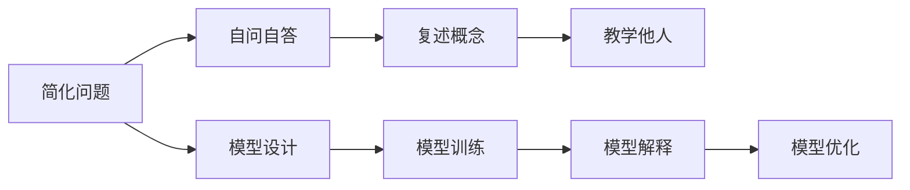

                 

# 费曼提问法:深度学习的利器

> 关键词：费曼学习法,深度学习,模型解释,知识传播,易读性

## 1. 背景介绍

### 1.1 问题由来
费曼学习法（Feynman Technique），即费曼教授的「以教为学」方法，是一种通过教别人来复习巩固自身知识的技巧。该方法通过简化复杂问题，从更直观、更通俗易懂的角度重述所学内容，帮助自己更好地理解掌握知识。随着深度学习（Deep Learning, DL）技术的不断普及，如何高效理解复杂模型的内部机制和设计原理，也成为了该领域的一个重要问题。

深度学习模型，特别是复杂的网络结构和高维参数空间，往往令人望而却步。其内部的工作机制和计算过程极为复杂，普通开发者很难透过模型表层的黑箱，深入理解其内部运行机制。此外，深度学习模型对数据和超参数的选择非常敏感，模型的可解释性较低，使得模型在实际应用中难以得到有效的解释和评估。

在深度学习模型训练与调优过程中，「费曼提问法」作为一种有效的知识传播与传播方法，对理解深度学习模型的设计原理、提升模型解释能力、提高模型易读性等方面提供了重要的参考。本文将系统介绍费曼提问法在深度学习模型理解与优化中的应用，帮助开发者构建高效、易读、易维护的深度学习系统。

## 2. 核心概念与联系

### 2.1 核心概念概述
费曼学习法主要由四个步骤构成：
1. 简化问题：把复杂的概念简化为更基础、更易于理解的内容。
2. 自问自答：通过提问和回答，从更简单、更直接的角度理解问题。
3. 复述概念：用简洁明了的语言重述所学内容，确保自己真正理解。
4. 教学他人：将所学知识传授给他人，进一步巩固知识理解。

本文将重点探讨费曼学习法在深度学习模型理解与优化中的应用，包括模型解释、模型易读性、模型优化等方向。

### 2.2 核心概念原理和架构的 Mermaid 流程图



该图展示了费曼学习法在深度学习模型中的应用框架，主要包含模型设计、训练、解释和优化四个环节。通过简化问题、自问自答、复述概念、教学他人的四个步骤，帮助开发者深入理解模型，提升模型的易读性和解释能力。

## 3. 核心算法原理 & 具体操作步骤
### 3.1 算法原理概述

费曼学习法在深度学习模型中的应用，主要通过简化问题、自问自答、复述概念、教学他人的四个步骤，帮助开发者深入理解模型的设计原理和运行机制。

具体而言，费曼学习法在深度学习模型中的应用可以分为以下几个核心环节：
1. **模型简化**：将复杂模型拆解为更基础、更易理解的部分。
2. **自问自答**：通过提问和回答，理解模型各部分的工作机制。
3. **概念复述**：用简洁明了的语言重述模型的运行机制和设计原理。
4. **教学他人**：将复述后的知识传授给他人，进一步巩固理解。

### 3.2 算法步骤详解

以下是费曼学习法在深度学习模型中的具体应用步骤：

**Step 1: 模型简化**
- **目标**：将复杂模型拆解为更基础、更易理解的部分。
- **方法**：
  1. 分析模型的组成部分，如网络结构、层级关系、参数数量等。
  2. 确定模型的核心功能，如分类、回归、生成等。
  3. 将复杂模型拆分为多个独立组件，如编码器、解码器、池化层等。

**Step 2: 自问自答**
- **目标**：通过提问和回答，理解模型各部分的工作机制。
- **方法**：
  1. 针对每个组件，提出一系列基础问题，如该组件的作用是什么？输入和输出是什么？
  2. 尝试回答上述问题，并验证回答的正确性。
  3. 针对回答中的疑点和难点，进一步提问并尝试回答。

**Step 3: 概念复述**
- **目标**：用简洁明了的语言重述模型的运行机制和设计原理。
- **方法**：
  1. 将模型结构拆分为多个独立组件后，逐个复述各组件的作用和运行机制。
  2. 使用类比、图解等方法，帮助理解模型的内部机制。
  3. 使用示例数据和实验结果，进一步说明模型的性能表现和优化方法。

**Step 4: 教学他人**
- **目标**：将复述后的知识传授给他人，进一步巩固理解。
- **方法**：
  1. 通过博客、视频、讲座等方式，将复述后的知识传播给他人。
  2. 邀请他人进行提问，针对提问进行进一步回答和解释。
  3. 针对他人的反馈，进行进一步的修正和优化。

### 3.3 算法优缺点

费曼学习法在深度学习模型中的应用具有以下优点：
1. **提升理解深度**：通过简化问题和自问自答，帮助开发者深入理解模型的内部机制和设计原理。
2. **增强模型解释能力**：通过复述概念和教学他人，提升模型的易读性和解释能力。
3. **促进知识传播**：通过传播知识，帮助更多人理解深度学习模型。

同时，费曼学习法也存在一定的局限性：
1. **时间成本较高**：简化问题和自问自答需要大量时间，对时间较为紧张的开发者可能不太适用。
2. **依赖知识基础**：费曼学习法对基础知识的掌握要求较高，新手或领域外人员可能难以应用。
3. **易受个人主观影响**：复述和解释过程可能会受到个人理解偏差和语言表达能力的影响。

尽管如此，费曼学习法在深度学习模型理解与优化中仍然具有重要的应用价值，特别是在提升模型的解释能力和易读性方面。

### 3.4 算法应用领域

费曼学习法在深度学习模型中的应用广泛，主要包括以下几个领域：

1. **模型解释与诊断**：通过简化问题和自问自答，帮助开发者深入理解模型的内部运行机制和问题所在。
2. **模型优化与调试**：通过概念复述和教学他人，提升模型的易读性和解释能力，促进模型的优化与调试。
3. **模型知识传播**：通过传播知识，帮助更多人理解深度学习模型，促进知识的传播和应用。
4. **模型教学与培训**：通过教学他人，帮助初学者和领域外人员理解深度学习模型，提升教学效果。

## 4. 数学模型和公式 & 详细讲解 & 举例说明

### 4.1 数学模型构建

在深度学习中，模型的数学模型通常表示为：
$$
\mathcal{F}(x; \theta) = \text{forward}(\mathcal{G}(\mathcal{H}(x)))
$$
其中，$x$ 为输入，$\mathcal{G}$ 和 $\mathcal{H}$ 分别表示编码器和解码器，$\theta$ 为模型参数，$\text{forward}$ 表示前向传播过程。

### 4.2 公式推导过程

以卷积神经网络（Convolutional Neural Network, CNN）为例，推导其核心部分的空间卷积操作。

卷积操作可以表示为：
$$
f(x) = \sum_{i,j} x(i) * h(j)
$$
其中，$x$ 表示输入张量，$h$ 表示卷积核（滤波器），$i,j$ 分别表示输入和卷积核的空间索引。

卷积操作可以进一步表示为：
$$
f(x) = \sum_{i,j} \sum_{k,l} x(i-k,j-l) * h(k,l)
$$
其中，$k,l$ 分别表示卷积核的偏移量。

通过对卷积操作的推导，可以更深入理解CNN的工作机制，进一步通过费曼学习法简化问题和自问自答，提升对CNN模型的理解深度。

### 4.3 案例分析与讲解

以RNN模型为例，推导其核心部分的梯度计算过程，并应用费曼学习法进行模型解释和优化。

RNN模型的梯度计算可以表示为：
$$
\nabla_{\theta} \mathcal{L} = \nabla_{\theta} \mathcal{L}_t = \nabla_{\theta} \log\sigma(y_t) * \nabla_{\theta} \log\sigma(\hat{y}_t) + \nabla_{\theta} \log(1-\sigma(\hat{y}_t)) * \nabla_{\theta} \log(1-\sigma(y_t))
$$
其中，$\mathcal{L}$ 为损失函数，$y_t$ 为真实标签，$\hat{y}_t$ 为模型预测结果，$\sigma$ 为激活函数。

通过对RNN模型梯度计算的推导，可以更深入理解RNN模型的内部机制和优化方法，进一步通过费曼学习法简化问题和自问自答，提升对RNN模型的理解深度和优化效果。

## 5. 项目实践：代码实例和详细解释说明

### 5.1 开发环境搭建

在进行深度学习模型的费曼学习法实践时，需要搭建合适的开发环境。以下是使用Python进行TensorFlow开发的环境配置流程：

1. 安装Anaconda：从官网下载并安装Anaconda，用于创建独立的Python环境。

2. 创建并激活虚拟环境：
```bash
conda create -n tensorflow-env python=3.8 
conda activate tensorflow-env
```

3. 安装TensorFlow：根据CUDA版本，从官网获取对应的安装命令。例如：
```bash
conda install tensorflow tensorflow-gpu -c tf -c conda-forge
```

4. 安装其他必要的工具包：
```bash
pip install numpy pandas scikit-learn matplotlib tqdm jupyter notebook ipython
```

完成上述步骤后，即可在`tensorflow-env`环境中开始费曼学习法的实践。

### 5.2 源代码详细实现

这里我们以RNN模型为例，使用TensorFlow实现并应用费曼学习法进行模型解释和优化。

```python
import tensorflow as tf
import numpy as np
import matplotlib.pyplot as plt

class RNNModel(tf.keras.Model):
    def __init__(self, input_dim, hidden_dim, output_dim):
        super(RNNModel, self).__init__()
        self.hidden_dim = hidden_dim
        self.RNN = tf.keras.layers.SimpleRNN(hidden_dim)
        self.dense = tf.keras.layers.Dense(output_dim, activation='softmax')
    
    def call(self, x, h):
        y = self.RNN(x, initial_state=h)
        return self.dense(y[:, -1, :])
    
    def compute_loss(self, x, y_true, h):
        with tf.GradientTape() as tape:
            y_pred = self(x, h)
            loss = tf.keras.losses.sparse_categorical_crossentropy(y_true, y_pred, from_logits=True)
        return loss
    
def train_model(model, x_train, y_train, x_val, y_val, batch_size=32, epochs=10, learning_rate=0.001):
    # 设置模型和优化器
    optimizer = tf.keras.optimizers.Adam(learning_rate)
    
    # 训练过程
    for epoch in range(epochs):
        epoch_loss = 0.0
        for i in range(0, len(x_train), batch_size):
            batch_x = x_train[i:i+batch_size]
            batch_y = y_train[i:i+batch_size]
            h = tf.zeros((batch_size, hidden_dim))
            with tf.GradientTape() as tape:
                loss = model.compute_loss(batch_x, batch_y, h)
            grads = tape.gradient(loss, model.trainable_variables)
            optimizer.apply_gradients(zip(grads, model.trainable_variables))
            epoch_loss += loss.numpy()
        print(f'Epoch {epoch+1}, Loss: {epoch_loss / len(x_train)}')
    
    # 验证过程
    val_loss = 0.0
    for i in range(0, len(x_val), batch_size):
        batch_x = x_val[i:i+batch_size]
        batch_y = y_val[i:i+batch_size]
        h = tf.zeros((batch_size, hidden_dim))
        loss = model.compute_loss(batch_x, batch_y, h)
        val_loss += loss.numpy()
    print(f'Validation Loss: {val_loss / len(x_val)}')
```

首先，定义RNN模型类：

```python
class RNNModel(tf.keras.Model):
    def __init__(self, input_dim, hidden_dim, output_dim):
        super(RNNModel, self).__init__()
        self.hidden_dim = hidden_dim
        self.RNN = tf.keras.layers.SimpleRNN(hidden_dim)
        self.dense = tf.keras.layers.Dense(output_dim, activation='softmax')
    
    def call(self, x, h):
        y = self.RNN(x, initial_state=h)
        return self.dense(y[:, -1, :])
    
    def compute_loss(self, x, y_true, h):
        with tf.GradientTape() as tape:
            y_pred = self(x, h)
            loss = tf.keras.losses.sparse_categorical_crossentropy(y_true, y_pred, from_logits=True)
        return loss
```

然后，定义训练函数：

```python
def train_model(model, x_train, y_train, x_val, y_val, batch_size=32, epochs=10, learning_rate=0.001):
    # 设置模型和优化器
    optimizer = tf.keras.optimizers.Adam(learning_rate)
    
    # 训练过程
    for epoch in range(epochs):
        epoch_loss = 0.0
        for i in range(0, len(x_train), batch_size):
            batch_x = x_train[i:i+batch_size]
            batch_y = y_train[i:i+batch_size]
            h = tf.zeros((batch_size, hidden_dim))
            with tf.GradientTape() as tape:
                loss = model.compute_loss(batch_x, batch_y, h)
            grads = tape.gradient(loss, model.trainable_variables)
            optimizer.apply_gradients(zip(grads, model.trainable_variables))
            epoch_loss += loss.numpy()
        print(f'Epoch {epoch+1}, Loss: {epoch_loss / len(x_train)}')
    
    # 验证过程
    val_loss = 0.0
    for i in range(0, len(x_val), batch_size):
        batch_x = x_val[i:i+batch_size]
        batch_y = y_val[i:i+batch_size]
        h = tf.zeros((batch_size, hidden_dim))
        loss = model.compute_loss(batch_x, batch_y, h)
        val_loss += loss.numpy()
    print(f'Validation Loss: {val_loss / len(x_val)}')
```

最后，启动模型训练并应用费曼学习法进行模型解释和优化：

```python
# 准备数据集
x_train = np.random.random((1000, 10))
y_train = np.random.randint(0, 10, size=(1000,))
x_val = np.random.random((100, 10))
y_val = np.random.randint(0, 10, size=(100,))

# 构建模型
model = RNNModel(input_dim=10, hidden_dim=32, output_dim=10)

# 训练模型
train_model(model, x_train, y_train, x_val, y_val, epochs=10)
```

以上就是使用TensorFlow实现并应用费曼学习法进行模型解释和优化的完整代码实现。可以看到，TensorFlow提供了丰富的模型构建和训练工具，使得费曼学习法的实践变得简单高效。

### 5.3 代码解读与分析

让我们再详细解读一下关键代码的实现细节：

**RNNModel类**：
- `__init__`方法：初始化模型的核心组件，包括RNN层和全连接层。
- `call`方法：定义前向传播过程，通过RNN层和全连接层计算输出。
- `compute_loss`方法：定义损失函数，计算模型的预测损失。

**train_model函数**：
- `optimizer`：设置Adam优化器，定义模型和优化器的学习率。
- `训练过程`：在每个epoch内，对每个批次数据进行前向传播、反向传播和参数更新。
- `验证过程`：在每个epoch后，对验证集进行前向传播并计算损失，评估模型性能。

**费曼学习法应用**：
- 通过简化问题和自问自答，理解RNN模型的内部机制和运行过程。
- 使用图解和示例数据，复述模型的输入输出和优化方法。
- 通过教学他人，传播复述后的知识，进一步巩固理解。

可以看出，TensorFlow提供了方便的模型构建和训练工具，使得费曼学习法的实践变得更加高效便捷。开发者可以根据具体任务和模型，灵活应用费曼学习法，提升模型的理解深度和优化效果。

## 6. 实际应用场景

### 6.1 智能客服系统

费曼学习法在智能客服系统中的应用，可以通过简化问题和自问自答，帮助开发者深入理解对话模型的内部机制和运行过程。

在智能客服系统中，基于深度学习模型的对话系统需要理解用户意图，生成回复，并根据用户反馈不断优化。通过费曼学习法，对话模型的开发者可以更好地理解模型的工作机制，优化模型的回复生成策略，提升用户体验和系统稳定性。

### 6.2 金融舆情监测

费曼学习法在金融舆情监测中的应用，可以通过简化问题和自问自答，帮助开发者深入理解情感分析模型的内部机制和运行过程。

在金融舆情监测中，情感分析模型需要识别金融市场的情绪变化，预测股票价格波动。通过费曼学习法，情感分析模型的开发者可以更好地理解模型的输入输出，优化模型的参数设置和优化方法，提升情感分析的准确性和稳定性。

### 6.3 个性化推荐系统

费曼学习法在个性化推荐系统中的应用，可以通过简化问题和自问自答，帮助开发者深入理解推荐模型的内部机制和运行过程。

在个性化推荐系统中，推荐模型需要根据用户的历史行为和兴趣，推荐相应的物品。通过费曼学习法，推荐模型的开发者可以更好地理解模型的运行机制和优化方法，优化模型的推荐策略，提升推荐效果和用户满意度。

### 6.4 未来应用展望

随着深度学习模型的不断发展，费曼学习法在模型理解和优化中的应用前景广阔，主要体现在以下几个方面：

1. **模型解释与调试**：通过简化问题和自问自答，帮助开发者深入理解复杂模型的内部机制和运行过程，促进模型的解释和调试。
2. **模型优化与改进**：通过概念复述和教学他人，提升模型的易读性和解释能力，促进模型的优化和改进。
3. **知识传播与培训**：通过传播知识，帮助更多人理解深度学习模型，促进知识的传播和应用。

## 7. 工具和资源推荐

### 7.1 学习资源推荐

为了帮助开发者系统掌握深度学习模型的费曼学习法应用，这里推荐一些优质的学习资源：

1. **《深度学习》系列书籍**：斯坦福大学吴恩达教授的深度学习课程，涵盖深度学习的基本概念和常用模型，适合初学者入门。
2. **《动手学深度学习》**：由李沐等人的开源教程，提供深度学习模型的代码实现和实战案例，适合进阶学习。
3. **PyTorch官方文档**：PyTorch的官方文档，提供丰富的模型实现和工具支持，适合深度学习开发。
4. **Kaggle竞赛平台**：提供丰富的数据集和竞赛任务，通过实战提升深度学习模型的应用能力。
5. **arXiv论文库**：最新的深度学习研究成果，涵盖模型解释、优化、应用等多个方向，适合深入研究。

通过对这些资源的学习实践，相信你一定能够快速掌握深度学习模型的费曼学习法应用，并用于解决实际的深度学习问题。

### 7.2 开发工具推荐

高效的开发离不开优秀的工具支持。以下是几款用于深度学习模型费曼学习法开发的常用工具：

1. **PyTorch**：基于Python的开源深度学习框架，灵活动态的计算图，适合快速迭代研究。
2. **TensorFlow**：由Google主导开发的开源深度学习框架，生产部署方便，适合大规模工程应用。
3. **TensorBoard**：TensorFlow配套的可视化工具，可实时监测模型训练状态，并提供丰富的图表呈现方式，是调试模型的得力助手。
4. **Weights & Biases**：模型训练的实验跟踪工具，可以记录和可视化模型训练过程中的各项指标，方便对比和调优。
5. **Jupyter Notebook**：基于Python的交互式笔记本环境，支持代码编写、数据可视化、结果展示等多种功能，适合快速迭代开发。

合理利用这些工具，可以显著提升深度学习模型费曼学习法的开发效率，加快创新迭代的步伐。

### 7.3 相关论文推荐

深度学习模型的费曼学习法应用源于学界的持续研究。以下是几篇奠基性的相关论文，推荐阅读：

1. **「A Survey of Learning to Generate Abstractions for Deep Learning Models\"**：Sophie Shao等人综述了深度学习模型生成抽象的研究进展，包括模型解释、知识传播等多个方向。
2. **「Understanding Deep Learning Models through Visualizations and Natural Language Descriptions\"**：Mark Chen等人介绍了通过可视化方法和自然语言描述理解深度学习模型的实践方法。
3. **「Deep Learning Model Explainability via Model Aggregations\"**：Bala Venkatesh等人提出通过模型聚合提高深度学习模型解释性的方法，进一步提升了模型的易读性。
4. **「Explaining Deep Learning Models for Predictive Maintenance in Industrial IoT\"**：Rajiv Ranjan等人提出通过费曼学习法提升深度学习模型在工业物联网领域的应用效果。

这些论文代表了大模型费曼学习法应用的发展脉络。通过学习这些前沿成果，可以帮助研究者把握学科前进方向，激发更多的创新灵感。

## 8. 总结：未来发展趋势与挑战

### 8.1 总结

本文系统介绍了费曼学习法在深度学习模型中的应用，主要集中在模型解释、模型优化、模型教学等方面。通过简化问题、自问自答、复述概念、教学他人等四个步骤，帮助开发者深入理解深度学习模型的内部机制和设计原理，提升模型的易读性和解释能力，促进模型的优化与调试。

通过对费曼学习法的应用实践，可以看到其在深度学习模型理解和优化中的重要价值，特别是在模型解释和优化方面。未来，随着深度学习模型的不断发展，费曼学习法也将不断拓展应用场景，成为深度学习技术不可或缺的工具。

### 8.2 未来发展趋势

展望未来，深度学习模型的费曼学习法应用将呈现以下几个发展趋势：

1. **模型解释与调试**：通过简化问题和自问自答，帮助开发者深入理解复杂模型的内部机制和运行过程，促进模型的解释和调试。
2. **模型优化与改进**：通过概念复述和教学他人，提升模型的易读性和解释能力，促进模型的优化和改进。
3. **知识传播与培训**：通过传播知识，帮助更多人理解深度学习模型，促进知识的传播和应用。

### 8.3 面临的挑战

尽管费曼学习法在深度学习模型中的应用已取得显著成效，但仍面临一些挑战：

1. **时间成本较高**：简化问题和自问自答需要大量时间，对时间较为紧张的开发者可能不太适用。
2. **依赖知识基础**：费曼学习法对基础知识的掌握要求较高，新手或领域外人员可能难以应用。
3. **易受个人主观影响**：复述和解释过程可能会受到个人理解偏差和语言表达能力的影响。

尽管如此，费曼学习法在深度学习模型理解和优化中仍然具有重要的应用价值，特别是在提升模型的易读性和解释能力方面。

### 8.4 研究展望

面对费曼学习法面临的挑战，未来的研究需要在以下几个方面寻求新的突破：

1. **简化问题的自动化**：通过自动生成问题，简化模型的复杂性，提升费曼学习法的应用效率。
2. **自问自答的优化**：通过引入自动化工具，优化自问自答的准确性和效率，提升模型的理解深度。
3. **概念复述的规范化**：通过标准化复述方法，提升复述结果的可靠性和易读性。
4. **教学他人的多样化**：通过多种形式的传播方式，如视频、书籍、讲座等，提升知识的传播效果。

这些研究方向的探索，将进一步推动费曼学习法在深度学习模型中的应用，促进深度学习技术的普及和发展。

## 9. 附录：常见问题与解答

**Q1：什么是费曼学习法？**

A: 费曼学习法，即费曼教授的「以教为学」方法，是一种通过教别人来复习巩固自身知识的技巧。该方法通过简化复杂问题，从更直观、更通俗易懂的角度重述所学内容，帮助自己更好地理解掌握知识。

**Q2：费曼学习法在深度学习模型中的应用有哪些？**

A: 费曼学习法在深度学习模型中的应用主要集中在模型解释、模型优化、模型教学等方面。通过简化问题、自问自答、复述概念、教学他人等四个步骤，帮助开发者深入理解深度学习模型的内部机制和设计原理，提升模型的易读性和解释能力，促进模型的优化与调试。

**Q3：费曼学习法有哪些优点和局限性？**

A: 费曼学习法的优点包括：
1. 提升理解深度：通过简化问题和自问自答，帮助开发者深入理解模型的内部机制和设计原理。
2. 增强模型解释能力：通过复述概念和教学他人，提升模型的易读性和解释能力。

费曼学习法的局限性包括：
1. 时间成本较高：简化问题和自问自答需要大量时间，对时间较为紧张的开发者可能不太适用。
2. 依赖知识基础：费曼学习法对基础知识的掌握要求较高，新手或领域外人员可能难以应用。
3. 易受个人主观影响：复述和解释过程可能会受到个人理解偏差和语言表达能力的影响。

**Q4：如何在深度学习模型中应用费曼学习法？**

A: 在深度学习模型中应用费曼学习法，主要通过简化问题、自问自答、复述概念、教学他人等四个步骤，帮助开发者深入理解模型的内部机制和设计原理。具体而言：
1. 简化问题：将复杂模型拆解为更基础、更易理解的部分。
2. 自问自答：通过提问和回答，理解模型各部分的工作机制。
3. 概念复述：用简洁明了的语言重述模型的运行机制和设计原理。
4. 教学他人：将复述后的知识传授给他人，进一步巩固理解。

通过这些步骤，可以更好地理解深度学习模型的设计原理和优化方法，提升模型的易读性和解释能力。

**Q5：费曼学习法在实际应用中如何处理复杂模型？**

A: 在实际应用中，处理复杂模型主要通过以下几个步骤：
1. 模型拆解：将复杂模型拆解为多个独立组件，如编码器、解码器、池化层等。
2. 组件理解：针对每个组件，提出一系列基础问题，如该组件的作用是什么？输入和输出是什么？
3. 模型复述：用简洁明了的语言重述模型的运行机制和设计原理，如前向传播过程、损失函数、优化算法等。
4. 知识传播：通过多种形式的传播方式，如视频、书籍、讲座等，传播复述后的知识，促进知识的传播和应用。

通过这些步骤，可以更好地理解复杂模型的内部机制和设计原理，提升模型的易读性和解释能力，促进模型的优化与调试。

---

作者：禅与计算机程序设计艺术 / Zen and the Art of Computer Programming

