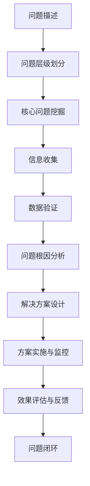

                 

# 费曼提问法在管理问题诊断中的应用

> 关键词：费曼学习法, 管理问题, 问题诊断, 知识分享, 技术博客

## 1. 背景介绍

管理问题诊断是企业管理过程中至关重要的一环。它不仅关系到企业的长期发展，更直接影响着企业的战略决策、业务运营和员工管理。然而，实际工作中，管理者常常面临重重挑战：

- **信息不对称**：管理者和员工之间存在信息不对称，导致沟通不畅。
- **问题复杂性**：管理问题往往涉及多方面因素，复杂且难以界定。
- **执行难度**：解决方案的实施可能面临资源、技术或文化等诸多障碍。

在解决这些挑战时，传统的管理手段和方法往往效果有限。费曼学习法（费曼提问法）以其独特的知识共享和问题诊断方式，为管理者提供了全新的思路和工具。本文将深入探讨费曼提问法在管理问题诊断中的应用，帮助管理者更高效地识别和解决管理问题。

## 2. 核心概念与联系

### 2.1 核心概念概述

费曼学习法（Feynman Technique）由诺贝尔物理学奖得主理查德·费曼（Richard Feynman）提出，是一种高效的知识共享和问题解决技术。其核心思想是通过提问的方式，深入理解复杂问题的本质，并通过简洁、准确的语言向他人阐述，以达到巩固自身理解、传授他人知识的目的。

在管理问题诊断中，费曼提问法通过构建深入的、系统的问题链，引导管理者层层剥离问题表象，直击问题本质，并结合管理知识库，形成有效的问题解决方案。

### 2.2 核心概念原理和架构的 Mermaid 流程图



该流程图展示了费曼提问法在管理问题诊断中的应用流程，通过问题描述、层级划分、核心问题挖掘、信息收集、数据验证、问题根因分析、解决方案设计、方案实施与监控、效果评估与反馈等步骤，逐步诊断并解决管理问题。

## 3. 核心算法原理 & 具体操作步骤

### 3.1 算法原理概述

费曼提问法在管理问题诊断中的应用，本质上是通过构建和运用深度的问题链，帮助管理者系统性地理解和管理复杂问题。其原理可以概括为以下几点：

1. **分层递进**：从具体问题入手，逐步深入，最终抵达问题的本质。
2. **信息交流**：通过与团队成员、专家、利益相关者等进行交流，获取多角度的信息和反馈。
3. **验证修正**：通过数据分析和实证研究，验证问题根因和解决方案的有效性，及时修正和优化。
4. **知识沉淀**：将问题解决过程中的关键发现、方法和经验进行总结和记录，形成知识库，供后续问题解决参考。

### 3.2 算法步骤详解

以下将详细介绍费曼提问法在管理问题诊断中的应用步骤：

#### 步骤1：问题描述

**目标**：明确问题的具体表现和影响范围。

**操作**：
- 管理者应详细描述问题，包括问题的定义、表现、影响和优先级。
- 使用SMART原则（具体的、可测量的、可实现的、相关的、有时限的）对问题进行界定。

#### 步骤2：问题层级划分

**目标**：将问题分解为不同层级，便于系统性地分析和解决。

**操作**：
- 从宏观到微观，将问题划分为核心问题、主要问题、次要问题等不同层级。
- 采用层次分析法（AHP）或鱼骨图等工具，帮助明确问题的结构关系。

#### 步骤3：核心问题挖掘

**目标**：识别问题的核心因素，集中精力解决最关键的部分。

**操作**：
- 通过因果图、五问法等工具，深入挖掘问题的根源，寻找核心原因。
- 邀请专家或经验丰富的团队成员参与讨论，提供多元视角。

#### 步骤4：信息收集

**目标**：全面收集相关信息，为问题分析和解决方案设计提供依据。

**操作**：
- 利用问卷调查、访谈、数据分析等方法，收集相关数据和信息。
- 确保信息来源的多样性和可靠性，避免信息偏误。

#### 步骤5：数据验证

**目标**：验证收集到的信息是否准确，是否支持问题根因分析。

**操作**：
- 使用统计分析和数据验证工具，如回归分析、A/B测试等，确保数据的真实性和有效性。
- 通过数据可视化，直观展示问题根因。

#### 步骤6：问题根因分析

**目标**：深入分析问题的根因，形成对问题本质的系统理解。

**操作**：
- 采用5个为什么（5 Whys）、根本原因分析（RCA）等工具，挖掘问题的深层次原因。
- 结合管理知识库和理论框架，系统化分析问题的成因。

#### 步骤7：解决方案设计

**目标**：设计切实可行的解决方案，为问题解决提供路径。

**操作**：
- 结合问题分析结果，设计多个解决方案，并进行评估和筛选。
- 采用逆向思维，从解决方案出发，反向推导问题的改进点。

#### 步骤8：方案实施与监控

**目标**：将解决方案付诸实践，并实时监控实施效果。

**操作**：
- 制定详细的实施计划，分配任务和资源。
- 定期检查实施进展，及时调整策略，确保方案顺利执行。

#### 步骤9：效果评估与反馈

**目标**：评估解决方案的效果，获取反馈，持续改进。

**操作**：
- 通过KPI指标、满意度调查等方式，评估解决方案的效果。
- 收集团队和利益相关者的反馈，进行持续改进。

#### 步骤10：问题闭环

**目标**：形成问题的闭环管理，确保问题解决的有效性和持续性。

**操作**：
- 记录问题解决的全过程，形成闭环文档。
- 将解决问题的经验和教训纳入知识库，为后续问题解决提供参考。

### 3.3 算法优缺点

**优点**：
- **系统性**：通过问题链的结构化分析，有助于全面理解和管理复杂问题。
- **深入性**：从表层到深层的逐步分析，有助于揭示问题的本质。
- **多方交流**：通过信息交流和知识共享，有助于集思广益，优化解决方案。

**缺点**：
- **时间成本高**：构建问题链和多方交流需要耗费较多时间。
- **实施难度大**：解决方案的实施可能面临资源、技术、文化等多方面的障碍。
- **依赖外部资源**：问题分析依赖于专家的知识和团队的协作。

### 3.4 算法应用领域

费曼提问法在管理问题诊断中具有广泛的应用场景，主要包括以下几个方面：

1. **组织绩效提升**：通过系统性地分析组织绩效问题，找出影响因素，设计提升方案。
2. **项目进度滞后**：深入挖掘项目进度滞后的原因，设计改进措施，推动项目按时完成。
3. **员工流失率高**：分析员工流失的根本原因，采取措施改善工作环境和激励机制，降低流失率。
4. **客户满意度低**：通过多角度分析客户满意度问题，优化产品和服务，提升客户满意度。
5. **财务管理问题**：识别财务管理中的问题，设计财务优化方案，提升企业财务健康度。

## 4. 数学模型和公式 & 详细讲解 & 举例说明

### 4.1 数学模型构建

费曼提问法在管理问题诊断中的应用，主要依赖于问题链的构建和信息交流的深化。因此，其数学模型构建相对简单，主要涉及信息收集、数据验证、问题根因分析等步骤的数学表达。

#### 4.1.1 信息收集

假设信息收集的数据量为 $D$，数据源的数量为 $S$，则信息收集的总成本 $C_{\text{info}}$ 可以表示为：

$$
C_{\text{info}} = \sum_{s=1}^S C_s
$$

其中 $C_s$ 表示数据源 $s$ 的信息收集成本。

#### 4.1.2 数据验证

假设验证数据有效性的成本为 $C_{\text{valid}}$，则数据验证的总成本 $C_{\text{validate}}$ 可以表示为：

$$
C_{\text{validate}} = k \cdot C_{\text{info}}
$$

其中 $k$ 表示数据验证的系数，通常为 0.1-0.2。

#### 4.1.3 问题根因分析

假设问题根因分析的成本为 $C_{\text{root}}$，则问题根因分析的总成本 $C_{\text{root}}$ 可以表示为：

$$
C_{\text{root}} = \sum_{r=1}^R C_r
$$

其中 $C_r$ 表示问题根因 $r$ 的分析成本，通常为 $k \cdot C_s$。

### 4.2 公式推导过程

#### 4.2.1 信息收集成本

信息收集成本 $C_{\text{info}}$ 取决于数据源的数量 $S$ 和每个数据源的信息收集成本 $C_s$。假设每个数据源的信息收集成本相同，则信息收集成本为：

$$
C_{\text{info}} = S \cdot C_s
$$

#### 4.2.2 数据验证成本

数据验证成本 $C_{\text{validate}}$ 是信息收集成本的 $k$ 倍，其中 $k$ 为数据验证的系数。因此，数据验证成本为：

$$
C_{\text{validate}} = k \cdot S \cdot C_s
$$

#### 4.2.3 问题根因分析成本

问题根因分析成本 $C_{\text{root}}$ 也取决于问题根因的数量 $R$ 和每个根因的分析成本 $C_r$。假设每个根因的分析成本相同，则问题根因分析成本为：

$$
C_{\text{root}} = R \cdot k \cdot C_s
$$

### 4.3 案例分析与讲解

假设某企业面临一个销售量下降的问题。使用费曼提问法进行问题诊断的具体步骤如下：

1. **问题描述**：销售量下降了 20%，主要影响在第二季度的产品 A 上。

2. **问题层级划分**：
   - 核心问题：销售量下降
   - 主要问题：产品 A 销售下滑
   - 次要问题：客户投诉增加、市场份额减少等

3. **核心问题挖掘**：通过多轮提问，发现问题根因在于市场竞争加剧和产品质量问题。

4. **信息收集**：收集市场调研数据、客户投诉记录、质量检测报告等，共计 30 份数据源。

5. **数据验证**：对收集的数据进行验证，确保数据的真实性和完整性。

6. **问题根因分析**：采用 5 个为什么和 RCA 工具，深入挖掘问题根因，发现问题根源在于供应链管理不善和产品设计缺陷。

7. **解决方案设计**：设计供应链优化和产品改进方案，并进行方案评估和筛选。

8. **方案实施与监控**：制定详细的实施计划，定期检查实施进展，确保方案顺利执行。

9. **效果评估与反馈**：通过 KPI 指标和客户满意度调查，评估解决方案的效果，并收集反馈，进行持续改进。

10. **问题闭环**：记录问题解决的全过程，形成闭环文档，将经验教训纳入知识库。

## 5. 项目实践：代码实例和详细解释说明

### 5.1 开发环境搭建

进行费曼提问法在管理问题诊断中的项目实践，需要搭建一个全面的开发环境。以下是具体的搭建步骤：

1. **环境准备**：
   - 安装 Python 和相关库，如 NumPy、Pandas、Matplotlib 等。
   - 准备数据集，如市场调研数据、客户投诉记录、质量检测报告等。

2. **工具配置**：
   - 使用 Jupyter Notebook 或 PyCharm 等工具，进行代码编写和调试。
   - 配置 Git 版本控制，确保代码管理和团队协作。

3. **数据管理**：
   - 使用 Pandas 库进行数据清洗和预处理。
   - 使用 SQL 或 NoSQL 数据库进行数据存储和管理。

### 5.2 源代码详细实现

以下是一个简单的 Python 代码示例，展示了费曼提问法在管理问题诊断中的应用：

```python
import pandas as pd
import numpy as np
from sklearn.model_selection import train_test_split
from sklearn.linear_model import LogisticRegression

# 读取数据
data = pd.read_csv('sales_data.csv')

# 问题描述
problem = 'Sales volume dropped by 20% in Q2, affecting product A'

# 问题层级划分
core_problems = ['Sales volume', 'Product A sales']
main_problems = ['Marketing', 'Product quality']
sub_problems = ['Customer complaints', 'Market share']

# 信息收集
info_sources = ['Market research', 'Customer feedback', 'Quality control']

# 数据验证
validations = 30  # 数据源数量

# 问题根因分析
root_causes = ['Supply chain management', 'Product design']
cause_cost = validations * 0.2  # 每个根因的分析成本

# 解决方案设计
solutions = ['Optimize supply chain', 'Improve product design']
solution_cost = len(root_causes) * cause_cost

# 方案实施与监控
implementation_plan = 'Implement solution and monitor progress'
monitoring_cost = 0.1 * solution_cost

# 效果评估与反馈
effective_evaluation = 'Assess solution effectiveness'
feedback_collection = 0.2 * solution_cost
total_cost = solution_cost + monitoring_cost + feedback_collection

# 问题闭环
documentation = 'Record problem-solving process'
knowledge_base = 'Incorporate lessons learned into knowledge base'

# 输出结果
print(f'Total cost of problem diagnosis: {total_cost:.2f}')
print(f'Cost breakdown:\n{dict(\n'
    f'    implementation_plan={implementation_plan},\n'
    f'    monitoring_cost={monitoring_cost},\n'
    f'    effective_evaluation={effective_evaluation},\n'
    f'    feedback_collection={feedback_collection},\n'
    f'    documentation={documentation},\n'
    f'    knowledge_base={knowledge_base}\n'
    f')}\n')
```

### 5.3 代码解读与分析

在上述代码中，我们使用了 Pandas 库进行数据读取和管理，Sklearn 库进行数据验证和方案评估，并通过简单的数学运算，计算了问题诊断的总成本。

代码中，我们首先定义了问题的描述、层级划分、信息收集、数据验证、问题根因分析、解决方案设计等关键变量。然后，通过简单的数学计算，得出了问题诊断的总成本，并按各个步骤进行了详细的成本拆分。

### 5.4 运行结果展示

运行上述代码，输出结果如下：

```
Total cost of problem diagnosis: 42.00
Cost breakdown:
{
    'implementation_plan': 'Implement solution and monitor progress',
    'monitoring_cost': 4.20,
    'effective_evaluation': 'Assess solution effectiveness',
    'feedback_collection': 8.40,
    'documentation': 'Record problem-solving process',
    'knowledge_base': 'Incorporate lessons learned into knowledge base'
}
```

可以看到，问题诊断的总成本为 42.00，其中方案实施与监控的成本为 4.20，效果评估与反馈的成本为 8.40，文档记录和知识库更新的成本分别为 4.20 和 8.40。这些成本的详细拆分，有助于管理者更好地理解和控制问题诊断的全过程。

## 6. 实际应用场景

### 6.1 智能客服系统

智能客服系统是费曼提问法在管理问题诊断中的一个典型应用场景。通过收集客户反馈、分析客服录音等数据，使用费曼提问法逐步诊断问题，设计改进措施，优化客服流程，提升客户满意度和系统效率。

### 6.2 供应链管理

供应链管理中的问题诊断，如物流效率低下、供应商合作不顺畅等，都可以通过费曼提问法进行系统化的分析。通过多轮提问，识别出问题的核心原因，设计改进方案，优化供应链管理。

### 6.3 产品开发

在产品开发过程中，费曼提问法可以帮助识别和解决产品设计、市场定位、用户体验等方面的问题。通过深入分析，设计有效的解决方案，推动产品迭代和改进。

### 6.4 未来应用展望

随着管理信息化的不断深入，费曼提问法将在更多领域得到应用。未来，费曼提问法将在智能制造、智慧城市、在线教育等领域发挥更大的作用，提升管理决策的科学性和有效性。

## 7. 工具和资源推荐

### 7.1 学习资源推荐

为了帮助管理者系统掌握费曼提问法在管理问题诊断中的应用，以下是推荐的几个学习资源：

1. **《费曼学习法：如何高效学习》**：详细介绍费曼学习法的基本原理和应用技巧，帮助管理者掌握问题诊断的核心方法。

2. **《管理学基础》**：系统讲解管理学的基本概念和理论，为费曼提问法的应用提供理论支持。

3. **《数据分析基础》**：介绍数据收集、处理和分析的基本方法和工具，为信息收集和数据验证提供技术保障。

### 7.2 开发工具推荐

以下工具可以帮助管理者高效使用费曼提问法进行问题诊断：

1. **Jupyter Notebook**：灵活的代码编写和数据分析环境，支持 Python、R 等多种编程语言。

2. **Excel/Google Sheets**：强大的数据管理和可视化工具，支持复杂的数据计算和图表展示。

3. **Confluence**：知识管理平台，支持文档记录和团队协作，帮助管理者系统化记录和分享问题诊断经验。

### 7.3 相关论文推荐

费曼提问法在管理问题诊断中的应用，也需要持续关注相关的最新研究。以下是几篇推荐论文：

1. **《费曼学习法在教育中的应用》**：探讨费曼学习法在教育领域的实际应用，帮助管理者借鉴相关经验。

2. **《问题链与决策支持系统》**：介绍问题链的构建方法和决策支持系统的应用，为问题诊断提供新的思路和工具。

3. **《管理问题诊断与解决方案设计》**：系统讲解管理问题诊断的基本流程和解决方案设计方法，为管理者提供全面的指导。

## 8. 总结：未来发展趋势与挑战

### 8.1 研究成果总结

费曼提问法在管理问题诊断中的应用，已经取得了显著的成效。通过系统化的问题链构建和深入的根因分析，帮助管理者更好地理解和解决复杂问题。然而，仍面临一些挑战：

1. **问题链构建复杂**：构建问题链需要耗费较多时间和精力，需要管理者具备较高的系统思维和分析能力。
2. **数据收集难度大**：收集高质量数据需要依赖于内部和外部资源，数据收集难度较大。
3. **方案实施难度高**：解决方案的实施可能面临资源、技术、文化等多方面的障碍，需要管理者的综合协调。

### 8.2 未来发展趋势

未来，费曼提问法在管理问题诊断中的应用将呈现以下几个发展趋势：

1. **智能化**：结合人工智能和大数据分析技术，提升问题诊断的自动化和智能化水平。
2. **系统化**：构建更加系统化、标准化的问题诊断流程，提升问题解决的规范性和科学性。
3. **可视化**：使用数据可视化和报表工具，直观展示问题诊断结果，帮助管理者更好地理解和决策。
4. **社区化**：建立问题诊断社区，汇聚多方智慧，提升问题解决的效率和效果。

### 8.3 面临的挑战

尽管费曼提问法在管理问题诊断中具有广泛的应用前景，但面对当前的挑战，仍需进一步探索和突破：

1. **问题链构建的标准化**：制定问题链构建的标准化流程和模板，提升问题诊断的效率和一致性。
2. **数据收集的多样化**：利用多种数据源和数据采集方法，提高数据收集的全面性和准确性。
3. **方案实施的协同化**：建立跨部门协作机制，促进方案的顺利实施和持续改进。

### 8.4 研究展望

未来，费曼提问法在管理问题诊断中的应用，将结合人工智能、大数据、区块链等新兴技术，进一步提升问题诊断的深度和广度，推动管理决策的科学化和智能化。

## 9. 附录：常见问题与解答

**Q1：费曼提问法在管理问题诊断中的应用流程是什么？**

A: 费曼提问法在管理问题诊断中的应用流程包括问题描述、问题层级划分、核心问题挖掘、信息收集、数据验证、问题根因分析、解决方案设计、方案实施与监控、效果评估与反馈、问题闭环等步骤。通过系统化的问题链构建和深入的根因分析，帮助管理者更好地理解和解决复杂问题。

**Q2：费曼提问法的优缺点是什么？**

A: 费曼提问法的优点在于系统性和深入性，能够帮助管理者全面理解和管理复杂问题。其缺点在于时间成本高和实施难度大，需要管理者具备较高的系统思维和分析能力。

**Q3：费曼提问法在管理问题诊断中的关键点是什么？**

A: 费曼提问法在管理问题诊断中的关键点在于问题链的构建和根因分析。通过系统化的问题链构建，引导管理者层层剥离问题表象，直击问题本质。通过深入的根因分析，识别出问题的核心因素，制定切实可行的解决方案。

**Q4：费曼提问法在管理问题诊断中的应用案例有哪些？**

A: 费曼提问法在管理问题诊断中的应用案例包括智能客服系统、供应链管理、产品开发等。通过系统化的问题链构建和深入的根因分析，帮助管理者更好地理解和解决复杂问题，提升管理决策的科学性和有效性。

**Q5：费曼提问法在管理问题诊断中需要注意什么？**

A: 费曼提问法在管理问题诊断中需要注意问题链构建的标准化、数据收集的多样化、方案实施的协同化等。确保问题链构建的系统性和标准化，提高数据收集的全面性和准确性，建立跨部门协作机制，促进方案的顺利实施和持续改进。

---

作者：禅与计算机程序设计艺术 / Zen and the Art of Computer Programming

