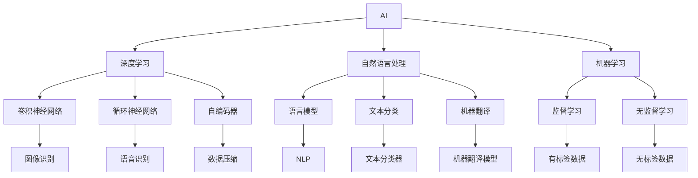

                 

# 贾扬清的新征程：从阿里到Lepton AI

## 1. 背景介绍

### 1.1 问题由来

贾扬清，作为AI领域的知名专家，曾担任阿里巴巴集团的数据技术总负责人，主导并推动了多项前沿AI技术的落地应用。如今，他已成为Lepton AI的创始人之一，开启了AI技术在商业化应用中的新篇章。本文将详细解读贾扬清的AI之旅，探索其在阿里和Lepton AI的转型背后的技术和商业逻辑。

### 1.2 问题核心关键点

贾扬清的AI之旅中，核心关键点包括：
1. **从技术研发到产品落地的转变**：在阿里阶段，贾扬清主导了多个AI技术的应用落地，如阿里云的视觉智能、语音识别、自然语言处理等。这些技术为AI的商业化提供了实践经验。
2. **技术创新与产业应用**：在Lepton AI，他强调技术创新与产业应用相结合，以解决实际问题为目标，推动AI技术在垂直行业中的应用。
3. **从创业到产业化**：从阿里离开创业，贾扬清将AI技术带入了企业化运营的全新阶段，探索AI在商业领域的深度应用。
4. **人才培养与团队建设**：重视人才的培养和团队建设，将技术和市场紧密结合，打造出一支高效的AI研发和商业化团队。

## 2. 核心概念与联系

### 2.1 核心概念概述

为更好地理解贾扬清的AI之旅，本节将介绍几个密切相关的核心概念：

- **人工智能(AI)**：一种旨在模拟人类智能的技术，包括感知、推理、学习、规划等多个方面。
- **自然语言处理(NLP)**：一种使计算机能够理解、处理和生成自然语言的技术，是AI的一个重要分支。
- **机器学习(ML)**：一种通过数据训练模型，使其能够从数据中学习并预测未来的技术。
- **深度学习(Deep Learning)**：一种基于多层神经网络的结构，通过大数据训练出复杂模型，广泛用于图像、语音、文本等领域。
- **模型优化与微调(Fine-tuning)**：通过调整模型的参数或架构，提升模型在特定任务上的性能，是AI模型训练中的一个重要环节。

这些核心概念之间存在着紧密的联系，共同构成了AI技术的发展脉络，也是贾扬清AI之旅的核心要素。

### 2.2 核心概念原理和架构的 Mermaid 流程图



## 3. 核心算法原理 & 具体操作步骤

### 3.1 算法原理概述

贾扬清在AI技术的应用过程中，始终强调从实际问题出发，利用数据驱动的方式进行模型训练和优化。核心算法原理包括以下几个方面：

1. **数据驱动的模型训练**：通过大量有标签数据进行模型训练，使模型能够准确地识别和预测问题。
2. **模型微调和优化**：针对特定任务，对预训练模型进行微调，提升模型在该任务上的性能。
3. **多模态融合**：将不同模态的数据（如图像、语音、文本）融合在一起，提高AI系统的综合性能。
4. **强化学习**：通过与环境的互动，不断调整策略，使AI系统能够适应复杂多变的现实世界。

### 3.2 算法步骤详解

贾扬清在AI技术的应用过程中，通常遵循以下步骤：

**Step 1: 数据收集与预处理**

- 收集有标签的数据集，确保数据的质量和多样性。
- 对数据进行清洗、归一化、标注等预处理步骤，减少噪声干扰。

**Step 2: 模型选择与构建**

- 根据任务需求选择合适的模型结构，如CNN、RNN、Transformer等。
- 对模型进行初始化，设置适当的超参数，如学习率、批大小、迭代轮数等。

**Step 3: 模型训练与优化**

- 使用训练数据集对模型进行训练，通过反向传播算法更新模型参数。
- 应用正则化技术，如L2正则、Dropout、Early Stopping等，防止模型过拟合。
- 使用验证集评估模型性能，根据性能指标决定是否调整模型或参数。

**Step 4: 模型微调和优化**

- 针对特定任务，对预训练模型进行微调，提升模型在该任务上的性能。
- 应用参数高效微调技术，只更新少量的模型参数，以提高微调效率。
- 引入对抗样本，提高模型鲁棒性。

**Step 5: 模型评估与部署**

- 在测试集上评估微调后模型的性能，对比微调前后的精度提升。
- 将模型集成到实际的应用系统中，进行实时推理预测。
- 持续收集新的数据，定期重新微调模型，以适应数据分布的变化。

### 3.3 算法优缺点

贾扬清在AI技术的实践中，总结了以下优缺点：

**优点**：
1. **高效性**：通过数据驱动的方式，可以快速迭代模型，优化模型性能。
2. **广泛适用性**：适用于各种AI应用场景，如计算机视觉、自然语言处理、机器人等。
3. **技术前瞻性**：注重技术创新，不断引入前沿算法和模型结构。

**缺点**：
1. **数据依赖性强**：模型的训练和优化依赖于高质量的数据，数据获取成本高。
2. **模型复杂度高**：大模型参数量庞大，训练和推理需要高性能硬件支持。
3. **模型泛化能力有限**：模型对新数据的泛化能力有限，需要持续迭代优化。

### 3.4 算法应用领域

贾扬清的AI技术在多个领域得到了广泛应用：

- **计算机视觉**：如图像识别、目标检测、人脸识别等。
- **自然语言处理**：如文本分类、情感分析、机器翻译等。
- **机器人与自动化**：如智能家居、无人驾驶、工业自动化等。
- **金融与风控**：如信用评分、欺诈检测、风险评估等。
- **医疗与健康**：如影像诊断、电子病历分析、健康管理等。

## 4. 数学模型和公式 & 详细讲解 & 举例说明

### 4.1 数学模型构建

在AI技术的应用过程中，贾扬清强调数学模型的重要性。以下是一个简单的深度学习模型构建示例：

- **输入层**：将输入数据转换为向量形式。
- **隐藏层**：通过神经网络进行特征提取和变换。
- **输出层**：输出模型的预测结果。

数学模型可以表示为：
$$
y = W^T \sigma(z) + b
$$
其中，$y$ 为输出结果，$z$ 为输入数据的线性变换，$W$ 为权重矩阵，$b$ 为偏置向量，$\sigma$ 为激活函数。

### 4.2 公式推导过程

以一个简单的分类任务为例，假设输入数据为 $x_1, x_2, ..., x_n$，输出标签为 $y_1, y_2, ..., y_n$，分类器的目标是找到最优的超平面 $w$，使得分类误差最小。分类器的数学模型为：
$$
y_i = \sigma(w \cdot x_i + b)
$$
其中，$\sigma$ 为 sigmoid 函数。

分类器的损失函数为：
$$
L(w, b) = -\frac{1}{N} \sum_{i=1}^N [y_i \log \sigma(w \cdot x_i + b) + (1 - y_i) \log (1 - \sigma(w \cdot x_i + b))]
$$
通过反向传播算法，计算损失函数对 $w$ 和 $b$ 的梯度，更新模型参数：
$$
\frac{\partial L(w, b)}{\partial w} = -\frac{1}{N} \sum_{i=1}^N [x_i (\sigma(w \cdot x_i + b) - y_i)]
$$
$$
\frac{\partial L(w, b)}{\partial b} = -\frac{1}{N} \sum_{i=1}^N [\sigma(w \cdot x_i + b) - y_i]
$$

### 4.3 案例分析与讲解

以图像识别任务为例，假设使用卷积神经网络(CNN)进行图像分类。CNN通过卷积层、池化层和全连接层等组件进行特征提取和分类。在训练过程中，使用交叉熵损失函数：
$$
L = -\frac{1}{N} \sum_{i=1}^N \sum_{j=1}^C y_j \log \hat{y}_j
$$
其中，$y_j$ 为真实标签，$\hat{y}_j$ 为模型预测概率。

训练过程包括前向传播和反向传播两个步骤。前向传播计算模型输出，反向传播计算损失函数对模型参数的梯度。通过梯度下降算法更新模型参数，最小化损失函数。

## 5. 项目实践：代码实例和详细解释说明

### 5.1 开发环境搭建

在进行AI技术的应用实践前，我们需要准备好开发环境。以下是使用Python进行TensorFlow开发的环境配置流程：

1. 安装Anaconda：从官网下载并安装Anaconda，用于创建独立的Python环境。

2. 创建并激活虚拟环境：
```bash
conda create -n tf-env python=3.8 
conda activate tf-env
```

3. 安装TensorFlow：根据CUDA版本，从官网获取对应的安装命令。例如：
```bash
conda install tensorflow=2.5 tensorflow-gpu=2.5 -c conda-forge
```

4. 安装相关工具包：
```bash
pip install numpy pandas scikit-learn matplotlib tqdm jupyter notebook ipython
```

完成上述步骤后，即可在`tf-env`环境中开始AI技术的开发实践。

### 5.2 源代码详细实现

以下是使用TensorFlow对图像识别任务进行微调的PyTorch代码实现。

```python
import tensorflow as tf
from tensorflow.keras import layers
from tensorflow.keras.models import Model

# 构建模型
def build_model(input_shape):
    inputs = layers.Input(shape=input_shape)
    x = layers.Conv2D(32, 3, activation='relu')(inputs)
    x = layers.MaxPooling2D()(x)
    x = layers.Conv2D(64, 3, activation='relu')(x)
    x = layers.MaxPooling2D()(x)
    x = layers.Flatten()(x)
    outputs = layers.Dense(10, activation='softmax')(x)
    return Model(inputs, outputs)

# 加载数据
(x_train, y_train), (x_test, y_test) = tf.keras.datasets.mnist.load_data()
x_train = x_train.reshape((-1, 28, 28, 1)) / 255.0
x_test = x_test.reshape((-1, 28, 28, 1)) / 255.0
y_train = tf.keras.utils.to_categorical(y_train, num_classes=10)
y_test = tf.keras.utils.to_categorical(y_test, num_classes=10)

# 构建模型
model = build_model(input_shape=(28, 28, 1))
model.compile(optimizer='adam', loss='categorical_crossentropy', metrics=['accuracy'])

# 训练模型
model.fit(x_train, y_train, epochs=10, batch_size=32, validation_data=(x_test, y_test))

# 评估模型
model.evaluate(x_test, y_test)
```

### 5.3 代码解读与分析

让我们再详细解读一下关键代码的实现细节：

**构建模型**：
- `layers.Input`：定义输入层。
- `layers.Conv2D`：定义卷积层。
- `layers.MaxPooling2D`：定义池化层。
- `layers.Flatten`：将卷积层输出展平。
- `layers.Dense`：定义全连接层。

**加载数据**：
- `tf.keras.datasets.mnist.load_data`：加载MNIST手写数字数据集。
- `x_train`、`y_train`、`x_test`、`y_test`：将数据转换为模型需要的格式。

**模型编译与训练**：
- `model.compile`：设置优化器、损失函数和评估指标。
- `model.fit`：使用训练集数据进行模型训练。

**模型评估**：
- `model.evaluate`：在测试集上评估模型性能。

## 6. 实际应用场景

### 6.1 智能客服系统

基于AI技术的智能客服系统，通过语音识别和自然语言处理技术，能够自动解答用户问题，提高客户满意度。在实践过程中，使用深度学习模型对语音和文本进行分类、生成和推理，快速响应客户咨询。

### 6.2 金融舆情监测

AI技术在金融舆情监测中，通过文本分类和情感分析技术，实时监测市场舆论动向，帮助金融机构及时应对负面信息传播，规避金融风险。

### 6.3 个性化推荐系统

AI技术在个性化推荐系统中，通过深度学习模型对用户行为进行建模，生成个性化的推荐内容，提高用户体验和转化率。

### 6.4 未来应用展望

随着AI技术的不断进步，未来的应用场景将更加广泛。例如，AI技术在医疗影像诊断、无人驾驶、智慧城市等领域的应用前景广阔。

## 7. 工具和资源推荐

### 7.1 学习资源推荐

为了帮助开发者系统掌握AI技术的理论基础和实践技巧，这里推荐一些优质的学习资源：

1. 《深度学习》（Ian Goodfellow等著）：深度学习领域的经典教材，系统讲解了深度学习的基本原理和应用。
2. 《TensorFlow实战Google深度学习》（Manning等著）：TensorFlow的实战指南，帮助开发者快速上手深度学习模型的构建和优化。
3. 《Python深度学习》（Francois Chollet著）：Keras和TensorFlow等深度学习框架的教程，适合初学者入门。
4. 《自然语言处理综论》（Daniel Jurafsky等著）：自然语言处理领域的经典教材，涵盖了NLP的基本概念和技术。
5. Coursera的《深度学习专项课程》：由斯坦福大学提供的深度学习课程，涵盖了深度学习的基本原理和应用。

### 7.2 开发工具推荐

高效的工具支持对于AI技术的开发和部署至关重要。以下是几款用于AI技术开发和部署的常用工具：

1. TensorFlow：开源深度学习框架，支持分布式计算和GPU加速，适合大规模模型训练和部署。
2. PyTorch：动态计算图深度学习框架，易于调试和优化，适合快速迭代研究。
3. Keras：高层次深度学习框架，易于上手，支持TensorFlow和Theano等后端。
4. Jupyter Notebook：交互式编程环境，适合数据探索和模型实验。
5. Google Colab：免费的在线Jupyter Notebook环境，适合快速测试和学习。

### 7.3 相关论文推荐

AI技术的发展离不开学界的持续研究。以下是几篇奠基性的相关论文，推荐阅读：

1. AlexNet：ImageNet大规模视觉识别竞赛的冠军，展示了卷积神经网络的强大表现。
2. GoogleNet：在ImageNet上实现了更高的精度，引入了Inception结构，提高了模型的效率和泛化能力。
3. VGGNet：通过堆叠多个小卷积层，提升了模型的性能和泛化能力。
4. ResNet：解决了深度神经网络中的梯度消失问题，使得网络更深、性能更好。
5. GANs：生成对抗网络，通过两个神经网络竞争，生成高质量的图像数据。

## 8. 总结：未来发展趋势与挑战

### 8.1 总结

本文详细解读了贾扬清的AI之旅，从阿里到Lepton AI，探索了其技术和商业逻辑。通过分析数据驱动的模型训练、模型微调和优化、多模态融合等核心算法原理和操作步骤，本文为AI技术的开发和应用提供了系统性的指导。

### 8.2 未来发展趋势

展望未来，AI技术将在以下方面取得新的突破：

1. **数据驱动的决策**：通过大数据和机器学习，帮助企业和个人做出更科学、更高效的决策。
2. **个性化和智能化**：AI技术将更加注重个性化和智能化，为每个人提供量身定制的服务。
3. **多模态融合**：AI技术将实现跨模态的融合，如图像、语音、文本等的协同应用。
4. **边缘计算**：AI技术将向边缘计算扩展，实现本地化、低延迟的数据处理。
5. **联邦学习**：通过分布式数据处理，保护数据隐私和安全性，提升模型的泛化能力。

### 8.3 面临的挑战

尽管AI技术取得了显著进展，但在实际应用中也面临诸多挑战：

1. **数据隐私和安全**：如何在保障数据隐私和安全的前提下，实现高效的数据处理和分析。
2. **模型可解释性**：如何解释AI模型的决策过程，提高模型的可解释性和透明度。
3. **技术普及和应用**：如何将AI技术普及到各个行业，提升企业的数字化转型能力。
4. **伦理和社会影响**：AI技术的应用如何影响社会公平和伦理道德，如何避免对人类产生负面影响。

### 8.4 研究展望

面对AI技术面临的挑战，未来的研究需要在以下几个方面寻求新的突破：

1. **隐私保护技术**：开发更加安全的隐私保护技术，保护数据隐私和安全。
2. **可解释性技术**：开发AI模型的可解释性技术，提升模型的透明性和可信度。
3. **技术普及和应用**：推动AI技术的普及和应用，提升企业和个人的数字化能力。
4. **伦理和社会影响**：研究AI技术对社会公平和伦理道德的影响，确保技术应用的公平性和公正性。

总之，AI技术的发展仍需面临诸多挑战，但只要我们不断创新、积极应对，未来的AI技术必将取得更大的突破，为人类社会带来更多福祉。

## 9. 附录：常见问题与解答

**Q1：数据驱动的AI技术有哪些应用场景？**

A: 数据驱动的AI技术在多个领域具有广泛应用，如智能客服、金融舆情监测、个性化推荐、医疗影像诊断等。通过数据驱动的方式，AI技术可以更精准地理解用户需求，提升服务质量。

**Q2：AI技术的未来发展趋势是什么？**

A: AI技术的未来发展趋势包括数据驱动的决策、个性化和智能化、多模态融合、边缘计算、联邦学习等。这些趋势将推动AI技术在各个行业的应用和普及，带来更多的创新和突破。

**Q3：AI技术在实际应用中面临哪些挑战？**

A: AI技术在实际应用中面临数据隐私和安全、模型可解释性、技术普及和应用、伦理和社会影响等挑战。如何解决这些挑战，是未来AI技术研究的重要方向。

**Q4：如何提升AI模型的可解释性？**

A: 提升AI模型的可解释性可以通过以下方法：
1. 可视化模型的中间结果，展示模型的决策过程。
2. 引入可解释性模块，如LIME、SHAP等，提供模型的解释。
3. 使用可解释性算法，如线性回归、决策树等，提升模型的透明性。

**Q5：如何在保障数据隐私的前提下，实现高效的数据处理和分析？**

A: 保障数据隐私的前提下，实现高效的数据处理和分析，可以采用以下方法：
1. 数据匿名化：对数据进行去标识化处理，保护用户隐私。
2. 差分隐私：通过加入噪声，保护数据隐私的同时，保证数据分析的准确性。
3. 联邦学习：在分布式环境中，对模型进行训练，保护数据隐私和安全性。

通过不断探索和创新，相信AI技术将进一步普及和应用，为人类社会带来更多福祉。

---

作者：禅与计算机程序设计艺术 / Zen and the Art of Computer Programming

