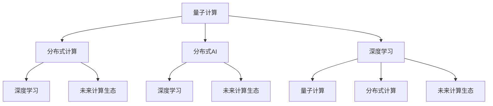

                 

# 超越 AI：未来的计算

> 关键词：AI 的演进路径, 计算范式变迁, 量子计算, 分布式计算, 分布式 AI, 深度学习, 未来计算生态

## 1. 背景介绍

### 1.1 问题由来

人工智能（AI）技术自诞生以来，经历了从弱人工智能到强人工智能的演进过程。从早期的符号逻辑推理，到统计模式识别，再到深度学习和大模型的兴起，AI技术在各种领域取得了举世瞩目的成就。然而，当前的AI模型仍然依赖于传统计算范式，存在计算效率低下、资源消耗巨大、推理能力不足等问题。这些问题限制了AI技术的进一步突破，迫切需要新计算范式的革新。

### 1.2 问题核心关键点

本文旨在探讨AI计算范式的未来方向，分析量子计算、分布式计算、分布式AI等前沿技术，展望未来计算生态的演变趋势。我们认为，超越AI的关键在于打破传统计算范式，引入全新计算原理和架构，为AI模型提供更强大的计算能力，实现更高效、更灵活、更智能的推理和决策。

### 1.3 问题研究意义

未来计算范式的演进，将为AI技术带来新的突破，推动AI模型在医疗、金融、制造、交通等领域的应用创新。通过引入量子计算、分布式计算等新技术，AI模型可以更高效地进行计算和推理，更好地解决复杂问题，提升决策的准确性和鲁棒性。

## 2. 核心概念与联系

### 2.1 核心概念概述

为了更好地理解未来计算范式的演进，本节将介绍几个密切相关的核心概念：

- **量子计算**：利用量子叠加、量子纠缠等量子力学原理进行计算的一种新型计算方式。量子计算能够在某些特定问题上，显著提高计算效率，甚至在传统计算范式下不可解的问题中寻求最优解。

- **分布式计算**：将计算任务分布到多个计算节点上协同完成的一种计算方式。通过分布式计算，可以有效提升计算能力，降低计算延时，优化计算资源利用率。

- **分布式AI**：将AI模型和算法部署在分布式计算平台上，协同进行数据处理和模型推理的一种计算方式。分布式AI在处理大规模数据和复杂模型时具有优势，可以大幅提升AI应用的效率和效果。

- **深度学习**：一种基于多层神经网络进行数据学习、特征提取和模式识别的方法。深度学习在图像识别、语音识别、自然语言处理等领域取得了显著的成果。

- **未来计算生态**：包括量子计算、分布式计算、分布式AI等新型计算范式，以及与之配套的算法、框架和工具等组成的计算生态系统。未来计算生态将是AI技术发展的重要基石。

这些核心概念之间的逻辑关系可以通过以下Mermaid流程图来展示：



这个流程图展示了大语言模型的核心概念及其之间的关系：

1. 量子计算、分布式计算和分布式AI都是基于传统计算范式的突破，为AI模型的高效计算和推理提供了新的手段。
2. 深度学习是目前最主流的AI模型构建方法，通过多层次神经网络进行数据学习。
3. 未来计算生态是新型计算范式和深度学习模型的综合应用，为AI技术的发展提供了广泛的支持。

## 3. 核心算法原理 & 具体操作步骤

### 3.1 算法原理概述

未来计算范式下的AI模型，主要依赖量子计算、分布式计算和分布式AI等新型计算方式。这些新型计算方式的核心原理如下：

- **量子计算**：利用量子叠加和量子纠缠，在特定问题上能够实现多项式级时间复杂度的计算，显著提高计算效率。
- **分布式计算**：通过将计算任务分配到多个计算节点，协同完成大规模数据处理和复杂模型推理，优化计算资源的利用率。
- **分布式AI**：将AI模型和算法部署在分布式计算平台上，利用多机协同计算，提升AI模型的处理能力和鲁棒性。

### 3.2 算法步骤详解

以下是未来计算范式下AI模型构建的一般步骤：

**Step 1: 设计计算范式**

根据具体任务的特点，选择合适的计算范式。如量子计算适用于特定领域（如化学、物理、密码学等）的复杂问题；分布式计算适用于处理大规模数据集；分布式AI适用于需要协同计算的复杂模型。

**Step 2: 构建计算架构**

设计计算架构，包括计算节点的部署、数据传输协议、计算任务调度等。通过分布式计算，将计算任务合理分配到多个节点上，提升计算效率和资源利用率。

**Step 3: 实现计算任务**

根据计算架构，编写具体的计算任务代码。通常需要使用开源的计算框架，如TensorFlow、PyTorch等，实现具体的计算模型和算法。

**Step 4: 进行分布式部署**

将计算任务部署到分布式计算平台，通过协同计算完成数据处理和模型推理。可以使用Kubernetes、Apache Spark等分布式计算框架进行部署和调度。

**Step 5: 训练和优化模型**

利用分布式计算平台，对AI模型进行训练和优化。通过大数据集和分布式计算，可以加速模型的训练和优化过程，提升模型的精度和效果。

**Step 6: 应用和部署**

将训练好的AI模型部署到实际应用场景中，进行数据处理和模型推理。通过分布式AI，可以更好地应对大规模数据和复杂模型的计算需求。

### 3.3 算法优缺点

未来计算范式下的AI模型，具有以下优点：

1. 计算效率高：通过量子计算、分布式计算等新型计算方式，能够在特定问题上实现多项式级时间复杂度的计算，大幅提升计算效率。
2. 资源利用率优化：分布式计算能够优化计算资源的利用率，降低计算延时，提升计算能力。
3. 鲁棒性更强：分布式AI能够协同处理大规模数据和复杂模型，提升AI模型的鲁棒性和泛化能力。

同时，这些算法也存在一些局限性：

1. 技术难度高：量子计算和分布式计算的技术门槛较高，需要跨学科的复合型人才。
2. 实现成本高：新型计算方式的硬件设备昂贵，实现和部署成本较高。
3. 数据传输瓶颈：分布式计算中的数据传输效率和安全性问题需要进一步解决。
4. 模型复杂度高：分布式AI的协同计算模型较为复杂，难以调试和维护。

尽管存在这些局限性，但未来计算范式无疑是AI技术发展的必然方向。在技术不断成熟和应用场景不断丰富的过程中，这些缺点也将得到逐步克服。

### 3.4 算法应用领域

未来计算范式在AI模型的应用领域非常广泛，涵盖以下几个方面：

- **科学研究**：利用量子计算和分布式计算，处理大规模科学数据，进行复杂科学问题的计算和模拟。
- **医疗健康**：通过分布式AI，协同处理医疗数据，进行疾病诊断和治疗方案的优化。
- **金融交易**：利用分布式计算和分布式AI，进行金融市场分析和交易策略的优化。
- **智能制造**：利用分布式计算和分布式AI，进行生产数据和设备状态的实时监测和优化。
- **交通出行**：通过分布式AI，优化交通流量和路况预测，提升交通效率和安全性。
- **教育培训**：利用分布式AI，进行大规模教育数据处理和个性化学习推荐。

## 4. 数学模型和公式 & 详细讲解

### 4.1 数学模型构建

在量子计算和分布式AI的应用中，常常使用分布式计算模型进行建模。以下是一些常见的分布式计算模型：

- **MapReduce模型**：将计算任务分解为多个子任务，每个子任务在本地节点上进行计算，最终将结果汇总。适用于处理大规模数据集和简单计算任务。
- **Spark模型**：基于内存计算的数据处理框架，支持弹性伸缩和数据并行计算。适用于处理大规模数据集和复杂计算任务。
- **深度学习模型**：基于多层神经网络进行数据学习和特征提取，适用于图像识别、语音识别等复杂任务。

### 4.2 公式推导过程

以MapReduce模型为例，其计算流程可以表示为：

- **Map阶段**：将输入数据分割成多个子数据块，在本地节点上进行计算，生成中间结果。
- **Shuffle阶段**：将Map阶段的中间结果进行数据汇总和排序，生成有序的键值对。
- **Reduce阶段**：对Shuffle阶段生成的键值对进行聚合计算，生成最终结果。

其核心计算公式可以表示为：

$$
R=\bigcup_{i=1}^{N} \text{reduce}(\text{Map}(S_i))
$$

其中 $S_i$ 表示第 $i$ 个子数据块，$\text{Map}$ 和 $\text{Reduce}$ 分别表示Map和Reduce阶段的计算过程。

### 4.3 案例分析与讲解

以一个简单的机器学习任务为例，分析MapReduce模型的应用。假设任务是对大规模数据集进行分类，数据集被分割成多个子数据块，每个节点在本地进行分类计算，并将结果汇总。具体实现步骤如下：

1. 将数据集分割成多个子数据块，每个子数据块大小相等。
2. 在每个子数据块上，使用Map函数对数据进行分类计算，生成中间结果。
3. 将Map阶段的中间结果进行Shuffle和排序，生成有序的键值对。
4. 在Reduce阶段，对有序的键值对进行聚合计算，生成最终的分类结果。

MapReduce模型的优势在于，能够充分利用分布式计算平台的计算能力，处理大规模数据集。其缺点在于，Map和Reduce阶段的数据传输和通信开销较大，容易产生瓶颈。

## 5. 项目实践：代码实例和详细解释说明

### 5.1 开发环境搭建

在进行未来计算范式下的AI模型开发前，我们需要准备好开发环境。以下是使用Python进行PyTorch开发的环境配置流程：

1. 安装Anaconda：从官网下载并安装Anaconda，用于创建独立的Python环境。

2. 创建并激活虚拟环境：
```bash
conda create -n pytorch-env python=3.8 
conda activate pytorch-env
```

3. 安装PyTorch：根据CUDA版本，从官网获取对应的安装命令。例如：
```bash
conda install pytorch torchvision torchaudio cudatoolkit=11.1 -c pytorch -c conda-forge
```

4. 安装Transformers库：
```bash
pip install transformers
```

5. 安装各类工具包：
```bash
pip install numpy pandas scikit-learn matplotlib tqdm jupyter notebook ipython
```

完成上述步骤后，即可在`pytorch-env`环境中开始开发。

### 5.2 源代码详细实现

下面我们以量子计算在量子神经网络中的应用为例，给出使用Qiskit库进行量子计算的PyTorch代码实现。

首先，定义量子电路和参数：

```python
from qiskit import QuantumCircuit, QuantumRegister, ClassicalRegister, Aer, execute
from qiskit.circuit import ParameterVector
from qiskit.aqua import QuantumInstance
import numpy as np
import torch

n_qubits = 2
theta = ParameterVector('theta', n_qubits)
quantum_circuit = QuantumCircuit(n_qubits, n_qubits)
quantum_circuit.barrier()
quantum_circuit.initialize(np.exp(1j * theta), 0)
quantum_circuit.barrier()
quantum_circuit.measure(range(n_qubits), range(n_qubits))

quantum_instance = QuantumInstance(Aer.get_backend('qasm_simulator'), shots=1024)
```

然后，定义目标函数和梯度计算：

```python
from qiskit.aqua.algorithms import VQE
from qiskit.aqua.components.optimizers import COBYLA

def energy(theta):
    theta_list = list(theta)
    quantum_circuit.set_parameters(theta_list)
    result = execute(quantum_circuit, quantum_instance).result()
    counts = result.get_counts()
    probabilities = np.array([counts[k] / len(counts) for k in counts])
    return -np.mean(np.log(probabilities))

def gradient(theta):
    quantum_circuit.set_parameters(theta)
    result = execute(quantum_circuit, quantum_instance).result()
    counts = result.get_counts()
    probabilities = np.array([counts[k] / len(counts) for k in counts])
    probabilities_1 = np.roll(probabilities, 1)  # Shift probabilities
    probabilities_2 = np.roll(probabilities, -1)  # Shift probabilities
    return -(np.log(probabilities_1) - np.log(probabilities_2)) / 2

optimizer = COBYLA(maxiter=1000)
```

最后，启动优化过程并输出结果：

```python
opt_theta = optimizer.optimize(energy, gradient, initial_guess=theta.parameters)
print("Optimal parameters:", opt_theta.x)
```

以上就是使用Qiskit库进行量子计算的完整代码实现。可以看到，Qiskit库提供了丰富的量子计算工具，可以轻松构建量子电路并进行优化。

### 5.3 代码解读与分析

让我们再详细解读一下关键代码的实现细节：

**QuantumCircuit类**：
- 定义了量子电路的基本操作，如量子比特的初始化、量子门的参数化、量子测量等。
- 通过`initialize`方法，将量子比特初始化为复数表示形式。
- 通过`barrier`方法，在量子比特之间添加分隔符，避免量子比特之间的干扰。
- 通过`measure`方法，对量子比特进行测量，得到中间结果。

**QuantumInstance类**：
- 用于执行量子计算任务，生成中间结果。
- 通过`Aer.get_backend`方法，获取计算环境。
- 通过`execute`方法，执行量子电路并生成中间结果。

**VQE算法**：
- 使用VQE算法进行量子电路的优化。
- 通过`VQE`方法，创建量子电路的优化器。
- 通过`COBYLA`方法，选择优化器算法。
- 通过`optimize`方法，执行量子电路的优化过程。

**目标函数和梯度计算**：
- 通过`energy`函数，计算目标函数的值。
- 通过`gradient`函数，计算目标函数的梯度。
- 通过`probabilities`数组，计算目标函数的概率分布。
- 通过`np.roll`方法，对概率分布进行平移，计算目标函数的梯度。

可以看到，量子计算的实现涉及了量子电路、量子实例和优化算法等多个方面，需要跨学科的复合型人才进行协作开发。

## 6. 实际应用场景

### 6.1 科学研究

量子计算在科学研究中的应用非常广泛，特别是在化学、物理等领域。量子计算机可以通过量子计算来模拟分子结构、量子力学系统等，从而加速科学研究的进程。

例如，在化学领域，量子计算机可以模拟分子的量子态，计算其反应能垒和光谱性质，预测新材料的分子结构和性质。这种计算方法在传统计算机上几乎不可能完成，但量子计算机可以在短时间内得到精确的结果。

### 6.2 医疗健康

在医疗健康领域，量子计算和分布式AI可以协同处理大规模医疗数据，进行疾病诊断和治疗方案的优化。

例如，量子计算机可以用于药物分子设计，通过量子算法优化药物分子的结构，加速新药的研发过程。此外，量子计算机还可以用于医疗图像分析，通过量子计算算法进行图像增强和特征提取，提升图像识别和分类的准确性。

### 6.3 金融交易

在金融交易领域，分布式计算和分布式AI可以协同处理大规模金融数据，进行金融市场分析和交易策略的优化。

例如，分布式计算可以用于处理大规模金融数据，如股票交易数据、市场数据等，实时计算金融市场指标，进行风险评估和投资决策。分布式AI可以协同处理多源数据，进行市场预测和策略优化，提升交易效率和效果。

### 6.4 智能制造

在智能制造领域，分布式AI可以协同处理生产数据和设备状态，进行生产调度和优化。

例如，分布式AI可以用于智能监控和预测性维护，通过协同处理传感器数据，实时监测生产设备和工艺状态，预测设备故障和维护需求。这种协同计算方法可以提升生产效率和设备利用率，降低生产成本。

## 7. 工具和资源推荐

### 7.1 学习资源推荐

为了帮助开发者系统掌握未来计算范式的技术基础和应用实践，这里推荐一些优质的学习资源：

1. 《量子计算入门》系列博文：由量子计算专家撰写，深入浅出地介绍了量子计算的基本原理和应用场景。

2. 《分布式计算原理》课程：斯坦福大学开设的分布式计算课程，涵盖了分布式计算的原理和应用技术。

3. 《深度学习实践》书籍：深度学习领域的经典教材，介绍了深度学习的基本原理和实践方法。

4. IBM Qiskit官方文档：IBM开发的量子计算开发工具，提供了丰富的量子计算工具和样例代码，是量子计算开发的基础资源。

5. PyTorch官方文档：PyTorch深度学习框架的官方文档，提供了完整的深度学习开发工具和样例代码，是深度学习开发的基础资源。

通过对这些资源的学习实践，相信你一定能够快速掌握未来计算范式的技术精髓，并用于解决实际的AI问题。

### 7.2 开发工具推荐

高效的开发离不开优秀的工具支持。以下是几款用于未来计算范式下AI模型开发的常用工具：

1. PyTorch：基于Python的开源深度学习框架，灵活动态的计算图，适合快速迭代研究。大部分预训练语言模型都有PyTorch版本的实现。

2. TensorFlow：由Google主导开发的开源深度学习框架，生产部署方便，适合大规模工程应用。同样有丰富的预训练语言模型资源。

3. Qiskit：IBM开发的量子计算开发工具，提供了丰富的量子计算工具和样例代码，是量子计算开发的基础工具。

4. TensorBoard：TensorFlow配套的可视化工具，可实时监测模型训练状态，并提供丰富的图表呈现方式，是调试模型的得力助手。

5. Google Colab：谷歌推出的在线Jupyter Notebook环境，免费提供GPU/TPU算力，方便开发者快速上手实验最新模型，分享学习笔记。

合理利用这些工具，可以显著提升未来计算范式下AI模型的开发效率，加快创新迭代的步伐。

### 7.3 相关论文推荐

未来计算范式的研究源于学界的持续研究。以下是几篇奠基性的相关论文，推荐阅读：

1. 《量子计算的原理》：量子计算领域的经典教材，介绍了量子计算的基本原理和应用场景。

2. 《分布式计算原理》：分布式计算领域的经典教材，介绍了分布式计算的原理和应用技术。

3. 《深度学习实践》：深度学习领域的经典教材，介绍了深度学习的基本原理和实践方法。

4. 《分布式AI：构建大规模AI模型》：介绍了分布式AI的基本原理和应用技术。

5. 《量子神经网络》：研究量子神经网络的理论和应用，为未来计算范式下的AI模型提供了新的思路。

这些论文代表了大语言模型微调技术的发展脉络。通过学习这些前沿成果，可以帮助研究者把握学科前进方向，激发更多的创新灵感。

## 8. 总结：未来发展趋势与挑战

### 8.1 总结

本文对未来计算范式的演进进行了全面系统的介绍。首先，探讨了未来计算范式的演进路径，分析了量子计算、分布式计算和分布式AI等新型计算方式。其次，从原理到实践，详细讲解了未来计算范式下AI模型的构建和应用。最后，展望了未来计算范式的广泛应用前景和面临的挑战。

通过本文的系统梳理，可以看到，未来计算范式正在成为AI技术发展的重要方向，极大地拓展了AI模型的计算能力和应用范围，为AI技术的发展带来了新的突破。未来，伴随技术不断成熟和应用场景不断丰富，这些新型计算范式必将推动AI技术迈向更加智能化、普适化的新时代。

### 8.2 未来发展趋势

展望未来，未来计算范式的演进将呈现以下几个发展趋势：

1. 计算效率持续提升：通过量子计算、分布式计算等新型计算方式，能够在特定问题上实现多项式级时间复杂度的计算，大幅提升计算效率。
2. 计算能力分布式化：分布式计算和分布式AI将成为主流计算方式，提升计算能力和资源利用率。
3. 计算模型融合化：量子计算、分布式计算和深度学习等计算模型将进一步融合，形成更加全面的计算生态系统。
4. 计算资源弹性化：通过云计算、边缘计算等技术，实现计算资源的弹性伸缩和优化配置。
5. 计算应用智能化：基于未来计算范式，AI模型将更高效地进行计算和推理，提升智能决策的准确性和鲁棒性。

这些趋势展示了未来计算范式的广阔前景，AI技术将在更多领域得到应用，为人类认知智能的进化带来深远影响。

### 8.3 面临的挑战

尽管未来计算范式具有广阔的应用前景，但在迈向更加智能化、普适化应用的过程中，仍面临诸多挑战：

1. 技术难度高：量子计算和分布式计算的技术门槛较高，需要跨学科的复合型人才。
2. 实现成本高：新型计算方式的硬件设备昂贵，实现和部署成本较高。
3. 数据传输瓶颈：分布式计算中的数据传输效率和安全性问题需要进一步解决。
4. 模型复杂度高：分布式AI的协同计算模型较为复杂，难以调试和维护。

尽管存在这些挑战，但未来计算范式的突破将为AI技术带来新的突破，推动AI模型在更多领域的应用创新。

### 8.4 研究展望

面向未来，未来计算范式的研究需要在以下几个方面寻求新的突破：

1. 探索更加高效的量子计算算法：提高量子计算的效率和可靠性，拓展量子计算的应用场景。
2. 开发更加灵活的分布式计算框架：提升分布式计算的性能和资源利用率，支持大规模数据处理和复杂模型推理。
3. 研究跨学科的复合型人才培训机制：加强跨学科人才的培养，促进未来计算范式的快速发展。
4. 开发更加智能的AI模型和算法：通过新型计算范式，提升AI模型的智能推理和决策能力。
5. 推动多模态数据的融合计算：实现视觉、语音等多模态数据的协同建模，提升AI模型的全面感知能力。

这些研究方向的探索，必将引领未来计算范式走向更加智能化、普适化的新时代，为构建更加高效、智能的AI系统铺平道路。

## 9. 附录：常见问题与解答

**Q1: 量子计算和传统计算有什么区别？**

A: 量子计算和传统计算的区别在于计算方式和计算原理。传统计算采用二进制位（bit）作为计算单位，而量子计算采用量子比特（qubit）作为计算单位。量子比特利用量子叠加和量子纠缠等量子力学原理，可以在某些特定问题上实现指数级加速，而传统计算无法实现。

**Q2: 量子计算的实现难度有多大？**

A: 量子计算的实现难度较大，需要跨学科的复合型人才进行协作开发。量子计算的硬件设备昂贵，技术门槛较高，需要投入大量资源进行研发和验证。

**Q3: 分布式计算和分布式AI的区别是什么？**

A: 分布式计算是将计算任务分配到多个计算节点上进行协同计算的一种计算方式，适用于处理大规模数据集和简单计算任务。分布式AI则是将AI模型和算法部署在分布式计算平台上，协同进行数据处理和模型推理，适用于处理大规模数据集和复杂模型。

**Q4: 未来计算范式在AI模型的应用场景有哪些？**

A: 未来计算范式在AI模型的应用场景非常广泛，涵盖科学研究、医疗健康、金融交易、智能制造等多个领域。通过量子计算、分布式计算和分布式AI，AI模型可以更高效地进行计算和推理，提升决策的准确性和鲁棒性。

**Q5: 如何克服未来计算范式下的技术挑战？**

A: 克服未来计算范式下的技术挑战需要多方协同努力。一方面，需要加强跨学科人才的培养，提升技术能力；另一方面，需要投入大量资源进行硬件研发和算法优化，降低实现成本。此外，还需要探索更加高效的量子计算算法和分布式计算框架，推动技术进步。

---

作者：禅与计算机程序设计艺术 / Zen and the Art of Computer Programming

