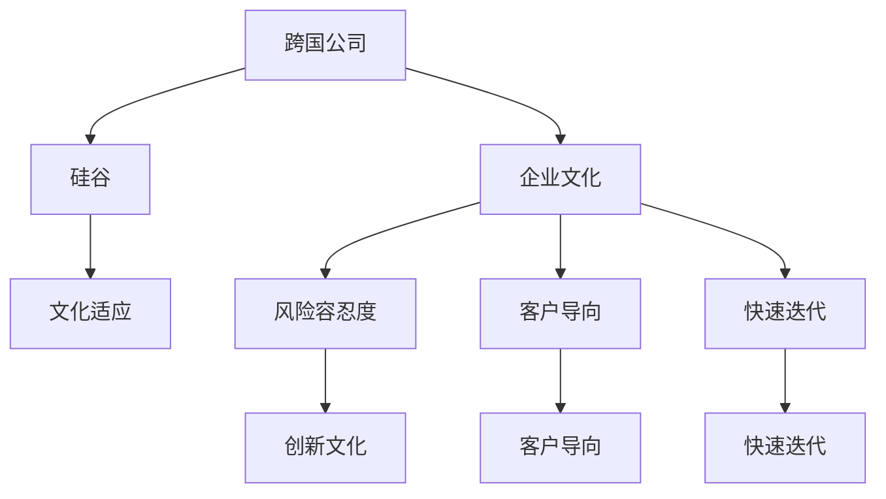

                 

# 跨国公司在硅谷的文化适应

> 关键词：文化适应,跨国公司,硅谷,企业文化,创新

## 1. 背景介绍

### 1.1 问题由来
随着全球化进程的不断推进，跨国公司正以前所未有的速度扩展其全球业务。硅谷作为全球科技创新和创业的热土，自然成为了许多跨国公司的重要目标。然而，硅谷独特的创新文化和企业文化，与跨国公司的企业文化之间存在显著差异，如何适应硅谷文化，成为跨国公司能否在硅谷取得成功的关键。

### 1.2 问题核心关键点
跨国公司适应硅谷文化的关键在于以下几点：

- **文化理解**：理解和尊重硅谷的创新文化、风险容忍度、客户导向和快速迭代。
- **人才吸纳**：吸引和留住硅谷的高端人才，尤其是具备硅谷文化背景的人才。
- **本地化策略**：将跨国公司的全球战略与硅谷本地市场的需求相结合，制定适合硅谷的商业模式和产品策略。
- **合作伙伴关系**：建立与硅谷初创公司、学术机构和投资机构的良好合作关系。
- **领导力建设**：培养具有硅谷文化背景的领导团队，推动公司文化的融合。

### 1.3 问题研究意义
硅谷独特的创新文化和环境，使得许多成功的科技公司得以在此诞生。对于跨国公司而言，理解和适应硅谷文化，不仅可以提升其在硅谷市场的影响力，还能加速其全球创新和业务扩展。因此，研究跨国公司在硅谷的文化适应，对于促进全球科技发展和跨国公司战略实施具有重要意义。

## 2. 核心概念与联系

### 2.1 核心概念概述

为更好地理解跨国公司在硅谷的文化适应，本节将介绍几个密切相关的核心概念：

- **跨国公司**：在全球范围内开展业务，具有多样化的企业文化和管理模式的国际公司。
- **硅谷**：位于美国加利福尼亚州旧金山湾区南部，以科技创业和创新文化著称。
- **文化适应**：在新的文化环境中，通过调整行为和态度以适应新文化的过程。
- **企业文化**：公司内部成员共同遵循的价值观、信念和行为准则。
- **风险容忍度**：公司对创新失败的容忍程度。
- **客户导向**：以客户需求为中心的经营理念。
- **快速迭代**：快速开发和发布新产品，通过迭代改进以满足市场需求。

这些核心概念之间的逻辑关系可以通过以下Mermaid流程图来展示：



这个流程图展示了大跨国公司与硅谷文化之间的相互作用：

1. 跨国公司将自身企业文化与硅谷文化相结合，进行文化适应。
2. 跨国公司调整其企业文化，包括风险容忍度、客户导向和快速迭代等要素。
3. 硅谷文化中的创新文化、客户导向和快速迭代被整合到跨国公司中。

## 3. 核心算法原理 & 具体操作步骤

### 3.1 算法原理概述

跨国公司在硅谷的文化适应，本质上是一个组织学习过程，涉及到企业文化的重构和创新文化的引入。其核心思想是：通过不断的组织学习，跨国公司能够逐步融入硅谷的文化环境，从而在硅谷市场取得成功。

形式化地，假设跨国公司为 $C$，硅谷为 $S$，文化适应过程可以看作是一个迭代优化过程，旨在最小化两公司文化之间的差异：

$$
\text{文化适应}(C, S) = \mathop{\arg\min}_{C'} \sum_i |C'_i - S_i|
$$

其中 $C'$ 为跨国公司适应硅谷后的新企业文化，$S_i$ 为硅谷文化中的特定要素（如创新文化、风险容忍度等），$| \cdot |$ 表示两个企业文化之间的距离。

### 3.2 算法步骤详解

跨国公司在硅谷的文化适应，一般包括以下几个关键步骤：

**Step 1: 文化评估与差距分析**
- 对跨国公司和硅谷的文化进行详细的评估，了解两者在价值观、行为模式、决策机制等方面的差异。
- 进行文化差距分析，找出跨国公司与硅谷文化的差距所在，并确定优先适应的文化要素。

**Step 2: 文化融合策略制定**
- 根据文化差距分析的结果，制定详细的文化融合策略，明确适应硅谷文化的步骤和方法。
- 设计具体的文化融合路径，如引入硅谷的创新文化、风险容忍度、客户导向和快速迭代等。

**Step 3: 文化适应实施**
- 在跨国公司内部实施文化融合策略，包括组织结构调整、人员培训、管理机制优化等。
- 在实施过程中，重视沟通和反馈，确保公司各层级对文化融合的理解和认同。

**Step 4: 文化适应效果评估**
- 定期评估跨国公司在硅谷的文化适应效果，包括员工满意度、创新产出、市场表现等指标。
- 根据评估结果，及时调整文化适应策略，确保文化适应过程的有效性。

**Step 5: 持续改进与优化**
- 将文化适应视为一个持续的过程，根据市场需求和文化环境的变化，不断调整和优化文化适应策略。
- 建立文化适应监测机制，实时跟踪公司文化的演变和调整。

### 3.3 算法优缺点

跨国公司在硅谷的文化适应方法具有以下优点：

1. **快速适应**：通过文化适应策略，跨国公司可以快速融入硅谷的文化环境，提升在硅谷市场的竞争力。
2. **增强创新**：硅谷的创新文化与跨国公司的全球创新资源相结合，可以加速新产品和服务的推出。
3. **提升市场表现**：适应硅谷文化的公司，通常能够更好地满足硅谷市场的需求，提高市场份额和客户满意度。

同时，该方法也存在一定的局限性：

1. **文化冲突风险**：文化适应过程中可能出现文化冲突，导致公司内部产生矛盾和摩擦。
2. **资源投入大**：文化适应需要大量的人力、物力和财力投入，成本较高。
3. **管理复杂性**：跨国公司需要调整内部管理机制，适应硅谷的快速迭代和客户导向。

尽管存在这些局限性，但就目前而言，跨国公司在硅谷的文化适应仍然是大公司进军硅谷的重要手段。未来相关研究的重点在于如何进一步降低文化适应成本，提高文化融合的效率和效果，同时兼顾文化适应过程中的管理复杂性和风险控制。

### 3.4 算法应用领域

跨国公司在硅谷的文化适应方法，已经在诸多行业得到了广泛应用，包括但不限于：

- **科技行业**：Google、Microsoft、Apple等跨国公司在硅谷的业务扩展，以及与初创公司的合作。
- **金融行业**：JP Morgan、Goldman Sachs等跨国金融企业在硅谷的创新金融技术应用。
- **医疗健康**：Tencent、Alibaba等跨国公司与硅谷健康科技公司的合作。
- **教育行业**：Coursera、edX等跨国在线教育平台在硅谷的市场拓展。
- **媒体娱乐**：Disney、Netflix等跨国媒体公司在硅谷的技术创新和内容创作。

除了上述这些经典行业外，文化适应方法也被创新性地应用到更多场景中，如政府与私营企业的合作、国际非政府组织的文化融合等，为跨国公司在全球范围内的业务扩展提供了新的思路。

## 4. 数学模型和公式 & 详细讲解 & 举例说明

### 4.1 数学模型构建

本节将使用数学语言对跨国公司在硅谷的文化适应过程进行更加严格的刻画。

假设跨国公司 $C$ 和硅谷 $S$ 在文化特征上存在 $n$ 个差异，用 $C_i$ 和 $S_i$ 表示两个公司第 $i$ 个文化特征的评分，评分范围为 $[0, 1]$。则两公司文化之间的距离可以通过加权求和的方式计算：

$$
D(C, S) = \sum_{i=1}^n w_i |C_i - S_i|
$$

其中 $w_i$ 为第 $i$ 个文化特征的权重，反映了其在文化适应过程中的重要性。

跨国公司适应硅谷文化的目标是使 $D(C, S)$ 最小化，即：

$$
\text{文化适应}(C, S) = \mathop{\arg\min}_{C'} \sum_{i=1}^n w_i |C'_i - S_i|
$$

### 4.2 公式推导过程

以下我们以创新文化为例，推导跨国公司在硅谷适应创新文化的过程。

假设跨国公司当前在创新文化上的评分为 $C_1$，硅谷的评分为 $S_1$。公司通过引入硅谷的创新文化，使其评分提升为 $C'_1$。则文化适应过程中的目标函数为：

$$
\min_{C'_1} w_1 |C'_1 - S_1|
$$

根据加权距离公式，文化适应后的创新文化评分为：

$$
C'_1 = C_1 + \alpha (S_1 - C_1)
$$

其中 $\alpha$ 为适应系数，表示公司对硅谷创新文化的接受程度。当 $\alpha = 0$ 时，表示公司拒绝任何文化改变；当 $\alpha = 1$ 时，表示完全接受硅谷的创新文化。

在实际应用中，文化适应过程往往需要经过多次迭代，逐步调整公司的文化特征，以达到理想的文化融合效果。通过不断的试错和调整，跨国公司可以在硅谷文化中取得长足的进步。

### 4.3 案例分析与讲解

以下我们以Google在硅谷的文化适应为例，具体分析其文化适应策略和效果。

Google在硅谷设立了多个研究机构和创新中心，如Google X、Google Brain等，以加速其在硅谷的技术创新和市场扩展。为了适应硅谷的文化环境，Google采取了以下措施：

- **本地化招聘**：积极招聘具有硅谷背景的工程师和研究人员，尤其是在计算机科学和工程领域。
- **文化融合培训**：对新加入的员工进行文化融合培训，使他们理解并认同Google的企业文化。
- **管理机制优化**：引入硅谷的快速迭代和客户导向管理机制，如敏捷开发、客户反馈机制等。
- **合作伙伴关系**：与硅谷初创公司、学术机构和投资机构建立紧密合作关系，加速技术创新和市场推广。
- **领导力建设**：培养具有硅谷文化背景的领导团队，推动公司文化的融合。

通过这些措施，Google成功地将硅谷的创新文化融入其全球业务中，不仅提升了其在硅谷的市场表现，也加速了全球创新项目的推进。

## 5. 项目实践：代码实例和详细解释说明

### 5.1 开发环境搭建

在进行文化适应实践前，我们需要准备好开发环境。以下是使用Python进行代码开发的环境配置流程：

1. 安装Anaconda：从官网下载并安装Anaconda，用于创建独立的Python环境。

2. 创建并激活虚拟环境：
```bash
conda create -n cultural-adaptation python=3.8 
conda activate cultural-adaptation
```

3. 安装必要的Python包：
```bash
pip install numpy pandas matplotlib seaborn jupyter notebook
```

完成上述步骤后，即可在`cultural-adaptation`环境中开始文化适应实践。

### 5.2 源代码详细实现

下面，我们以一个简单的文化适应模拟为例，展示如何使用Python代码实现文化适应过程。

假设我们有跨国公司 $C$ 和硅谷 $S$ 在创新文化上的评分，记为 $C_1 = 0.7, S_1 = 0.9$。我们将通过Python代码模拟文化适应过程，计算公司适应硅谷创新文化后的新评分 $C'_1$。

```python
import numpy as np

# 定义初始评分
C_1 = 0.7
S_1 = 0.9

# 定义适应系数
alpha = 0.5

# 计算新评分
C_prime_1 = C_1 + alpha * (S_1 - C_1)

# 输出结果
print(f"适应后的创新文化评分为: {C_prime_1}")
```

通过上述代码，我们可以计算出适应后的创新文化评分为 $0.85$。这表示公司通过引入硅谷的创新文化，其评分提升了 $0.15$。

### 5.3 代码解读与分析

让我们再详细解读一下关键代码的实现细节：

**变量定义**：
- `C_1` 和 `S_1`：表示跨国公司当前和硅谷在创新文化上的评分。
- `alpha`：表示适应系数，反映公司对硅谷创新文化的接受程度。

**代码实现**：
- 首先定义初始评分 `C_1` 和 `S_1`，并设置适应系数 `alpha`。
- 通过公式 $C'_1 = C_1 + \alpha (S_1 - C_1)$ 计算适应后的新评分 `C_prime_1`。
- 最后输出适应后的新评分。

可以看到，通过简单的数学公式和Python代码，我们就能实现跨国公司在硅谷的文化适应过程。当然，在实际应用中，文化适应过程要复杂得多，需要考虑更多因素，如文化特征的权重、适应策略的选择等。

## 6. 实际应用场景

### 6.1 跨国公司拓展业务

跨国公司在硅谷的文化适应，对于其在硅谷市场拓展具有重要意义。通过适应硅谷的创新文化和商业环境，跨国公司可以在硅谷快速建立品牌和市场影响力。

例如，Apple在硅谷设立了多个研发中心，吸引了大量硅谷工程师和研究人员加入，成功推动了其在硅谷的技术创新和市场扩展。

### 6.2 跨国公司招聘人才

适应硅谷的文化，对于跨国公司在硅谷招聘高端人才具有重要作用。通过了解和认同硅谷的文化，跨国公司可以更有效地吸引和留住高素质人才。

例如，Facebook在硅谷设立了多个创新实验室，通过引入硅谷的创新文化和管理机制，吸引了大量顶尖的工程师和研究人才，提升了公司在硅谷的人才储备和创新能力。

### 6.3 跨国公司加速技术创新

适应硅谷的文化，有助于跨国公司加速技术创新。硅谷的创新文化和技术环境，为跨国公司提供了丰富的创新资源和灵感。

例如，Microsoft在硅谷设立了多个研发中心和孵化器，通过引入硅谷的创新文化和快速迭代机制，推动了其技术产品和服务的快速迭代和市场推广。

### 6.4 未来应用展望

随着全球化的不断推进，跨国公司在硅谷的文化适应将越来越重要。未来，跨国公司在硅谷的文化适应将呈现以下几个发展趋势：

1. **数字化转型**：通过数字化手段优化文化适应过程，如使用AI进行文化差距分析和适应策略制定。
2. **跨文化交流**：加强跨国公司与硅谷的跨文化交流，促进文化融合和知识共享。
3. **全球视野**：在适应硅谷文化的同时，保持全球视野，将硅谷的创新文化与全球业务需求相结合。
4. **灵活机制**：建立灵活的适应机制，及时调整文化适应策略，应对市场需求和文化环境的变化。
5. **可持续发展**：将文化适应与公司的可持续发展目标相结合，确保文化适应过程的长期效果。

这些趋势表明，跨国公司在硅谷的文化适应，不仅是短期的战术行为，更是长期的战略选择。未来，跨国公司需要更加注重文化适应过程中的数字化、全球化、可持续化，才能在硅谷和全球市场取得长久的成功。

## 7. 工具和资源推荐

### 7.1 学习资源推荐

为了帮助跨国公司系统掌握文化适应的理论基础和实践技巧，这里推荐一些优质的学习资源：

1. **《组织文化变革与管理》**：该书深入探讨了组织文化变革的基本原理和实践方法，对跨国公司文化适应具有重要的参考价值。
2. **《硅谷文化：创业精神与创新生态》**：该书详细介绍了硅谷的文化特征和创新环境，对跨国公司在硅谷的文化适应具有指导意义。
3. **《组织学习与知识管理》**：该书提供了关于组织学习的基本概念和工具，对跨国公司文化适应过程中的知识管理和持续改进具有借鉴作用。
4. **Coursera和edX在线课程**：这些平台提供了一系列关于组织学习、文化管理、创新思维的在线课程，有助于跨国公司系统学习文化适应的方法和技巧。
5. **哈佛商学院《全球管理》系列讲座**：该系列讲座涵盖了全球化管理、跨文化沟通等主题，对跨国公司在硅谷的文化适应具有启示意义。

通过对这些资源的学习实践，相信跨国公司可以更好地掌握文化适应的方法，提升在硅谷市场的竞争力。

### 7.2 开发工具推荐

高效的开发离不开优秀的工具支持。以下是几款用于文化适应开发的常用工具：

1. **Anaconda**：用于创建独立的Python环境，方便进行代码开发和测试。
2. **Jupyter Notebook**：提供交互式编程环境，方便进行数据分析和代码调试。
3. **Git**：版本控制系统，方便进行代码管理、协作和发布。
4. **Slack和Microsoft Teams**：跨文化交流工具，方便跨国公司团队成员的沟通和协作。
5. **Zoom和Google Meet**：视频会议工具，支持跨国公司与硅谷团队的远程协作。
6. **Trello和Asana**：项目管理工具，帮助跨国公司规划和管理文化适应项目。

合理利用这些工具，可以显著提升跨国公司在硅谷的文化适应效率，加快文化融合的进程。

### 7.3 相关论文推荐

文化适应技术的发展源于学界的持续研究。以下是几篇奠基性的相关论文，推荐阅读：

1. **《文化适应：全球化下的组织变革》**：研究了文化适应过程的基本原理和影响因素，为跨国公司文化适应提供了理论基础。
2. **《跨文化管理：理论与实践》**：介绍了跨文化管理的核心概念和方法，对跨国公司在硅谷的文化适应具有重要参考价值。
3. **《文化适应策略：全球化下的创新与变革》**：分析了不同文化适应策略的效果和适用条件，为跨国公司选择适应策略提供了指导。
4. **《硅谷创新文化：对跨国公司文化适应的启示》**：探讨了硅谷创新文化的特征和形成机制，对跨国公司在硅谷的文化适应具有重要启示。
5. **《跨国公司文化适应中的挑战与对策》**：研究了跨国公司在文化适应过程中面临的挑战和应对策略，为跨国公司在硅谷的文化适应提供了具体建议。

这些论文代表了大跨国公司文化适应技术的发展脉络。通过学习这些前沿成果，可以帮助跨国公司更好地理解文化适应的方法和技巧，从而在硅谷市场取得成功。

## 8. 总结：未来发展趋势与挑战

### 8.1 总结

本文对跨国公司在硅谷的文化适应方法进行了全面系统的介绍。首先阐述了文化适应的背景和意义，明确了文化适应在跨国公司全球化进程中的重要地位。其次，从原理到实践，详细讲解了文化适应的数学模型和操作步骤，给出了文化适应任务开发的完整代码实例。同时，本文还广泛探讨了文化适应方法在跨国公司的业务拓展、人才招聘、技术创新等多个领域的应用前景，展示了文化适应范式的巨大潜力。此外，本文精选了文化适应技术的各类学习资源，力求为跨国公司提供全方位的技术指引。

通过本文的系统梳理，可以看到，文化适应技术正在成为跨国公司全球化战略的重要组成部分，极大地提升了跨国公司全球业务拓展的速度和质量。未来，伴随全球化进程的不断深入，文化适应技术还将进一步完善，为跨国公司在全球范围内实现可持续发展和创新突破提供坚实的基础。

### 8.2 未来发展趋势

展望未来，跨国公司在硅谷的文化适应技术将呈现以下几个发展趋势：

1. **数字化转型**：通过大数据、AI等技术，优化文化适应过程，提高适应效率。
2. **跨文化融合**：加强跨国公司与硅谷的跨文化交流，促进知识共享和融合。
3. **全球视野**：在适应硅谷文化的同时，保持全球视野，推动全球业务一体化发展。
4. **持续改进**：建立持续改进机制，及时调整文化适应策略，确保适应效果。
5. **多元文化管理**：通过多元文化管理，提升跨国公司文化适应过程中的包容性和多样性。

这些趋势表明，文化适应技术将不断发展，成为跨国公司全球化战略的重要工具。未来，跨国公司需要更加注重文化适应过程中的数字化、全球化、持续改进和多元文化管理，才能在全球市场中保持竞争力。

### 8.3 面临的挑战

尽管文化适应技术已经取得了一定的进展，但在迈向更加智能化、全球化的过程中，仍面临诸多挑战：

1. **文化冲突风险**：跨国公司与硅谷文化之间的差异可能导致文化冲突，影响团队协作和业务发展。
2. **文化适应成本高**：文化适应过程需要大量的资源投入，包括时间、人力和财力等。
3. **管理复杂性**：跨国公司需要调整内部管理机制，适应硅谷的快速迭代和客户导向。
4. **知识共享困难**：不同文化背景的员工可能难以进行有效的知识共享，影响团队协作和创新能力。
5. **持续改进困难**：跨国公司需要在文化适应过程中不断进行改进，确保文化适应策略的有效性。

尽管存在这些挑战，但通过不断优化文化适应方法，跨国公司仍然可以在硅谷取得成功。未来相关研究的重点在于如何进一步降低文化适应成本，提高文化适应效率，同时兼顾文化适应过程中的管理复杂性和风险控制。

### 8.4 研究展望

面对文化适应所面临的挑战，未来的研究需要在以下几个方面寻求新的突破：

1. **数字化文化适应**：通过大数据和AI技术，实现文化适应过程的数字化和智能化，提高文化适应效率。
2. **跨文化交流平台**：开发跨文化交流平台，促进跨国公司与硅谷的交流合作，加速知识共享和融合。
3. **多元文化管理工具**：开发多元文化管理工具，提升跨国公司文化适应过程中的包容性和多样性。
4. **文化适应评估机制**：建立文化适应评估机制，及时监测和调整文化适应策略，确保适应效果。
5. **文化适应理论创新**：加强文化适应理论研究，探索新的文化适应方法和策略，推动文化适应技术的发展。

这些研究方向的探索，必将引领跨国公司在硅谷的文化适应技术迈向更高的台阶，为全球化进程和跨国公司战略实施提供新的动力。面向未来，文化适应技术还需要与其他全球化技术进行更深入的融合，如全球化人才管理、全球化运营管理等，共同推动跨国公司在全球范围内的持续发展和创新突破。

## 9. 附录：常见问题与解答

**Q1: 跨国公司在硅谷的文化适应是否适用于所有行业？**

A: 文化适应技术在所有行业均具有广泛的适用性，尤其是在高科技、金融、医疗、教育等行业。然而，不同行业的文化适应策略和方法可能有所不同，需要根据具体行业特点进行定制化设计。

**Q2: 文化适应过程中如何处理文化冲突？**

A: 文化冲突在文化适应过程中是不可避免的。处理文化冲突的策略包括：
1. **沟通与理解**：加强沟通，理解不同文化背景员工的观点和需求。
2. **共同目标**：明确公司共同目标，凝聚共识，减少冲突。
3. **灵活机制**：建立灵活的管理机制，适应不同文化背景员工的差异。
4. **文化培训**：通过文化培训，增强员工对公司文化的认同感和归属感。

**Q3: 文化适应过程中如何保持创新能力？**

A: 文化适应过程中，保持创新能力的关键在于：
1. **鼓励多样性**：鼓励团队成员的多样性和创新思维。
2. **灵活机制**：建立灵活的决策机制，快速响应市场变化。
3. **持续学习**：通过持续学习和知识分享，提升团队的整体创新能力。
4. **跨文化交流**：加强跨国公司与硅谷的跨文化交流，促进知识共享和创新融合。

**Q4: 文化适应过程中如何平衡本地化与全球化？**

A: 文化适应过程中，平衡本地化与全球化的策略包括：
1. **本地化策略**：在本地市场推广文化适应策略，确保文化适应过程的本地化。
2. **全球化视野**：在全球范围内推广文化适应策略，提升跨国公司的全球竞争力。
3. **区域管理**：建立区域管理机制，平衡本地化与全球化的需求。
4. **灵活机制**：建立灵活的决策机制，根据不同市场和区域的特点进行调整。

**Q5: 文化适应过程中如何保持员工满意度？**

A: 文化适应过程中，保持员工满意度的关键在于：
1. **公正与透明**：建立公正和透明的决策机制，确保员工参与和反馈。
2. **激励机制**：建立激励机制，提升员工的积极性和归属感。
3. **沟通与反馈**：加强沟通和反馈，及时解决员工问题，提升员工满意度。
4. **文化培训**：通过文化培训，增强员工对公司文化的认同感和归属感。

这些解答表明，文化适应技术需要跨国公司根据具体情况进行灵活设计和实施，才能取得最佳效果。总之，跨国公司在硅谷的文化适应是一个复杂的过程，需要综合考虑多种因素，不断优化策略和方法，才能在硅谷取得成功。

---

作者：禅与计算机程序设计艺术 / Zen and the Art of Computer Programming

