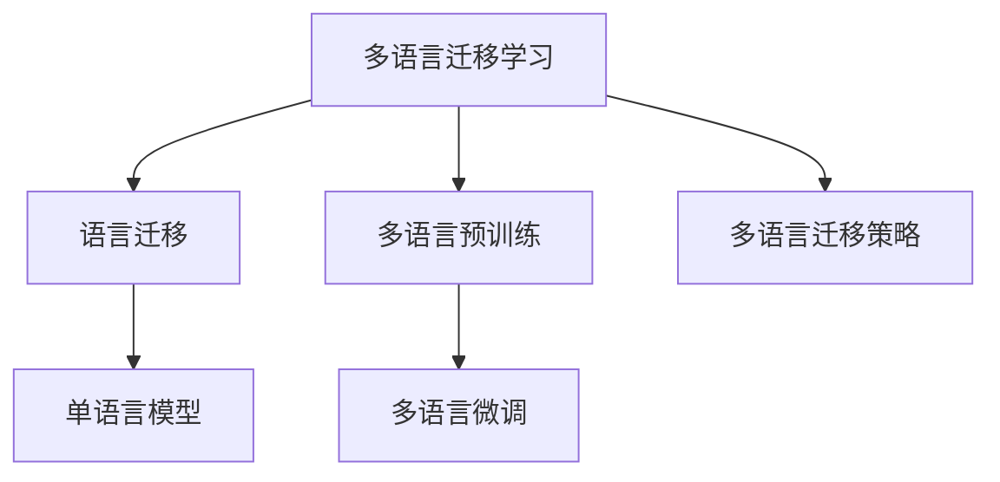

                 

# 跨语言AI模型：多语言支持的挑战

> 关键词：跨语言AI模型,多语言支持,语言迁移,多语言预训练,多语言迁移学习

## 1. 背景介绍

### 1.1 问题由来

随着全球化的加速和互联网的普及，越来越多的AI应用需要支持多语言处理。然而，多语言支持并非简单将现有的单语言模型应用于不同语言，而是需要考虑语言差异、语言资源和模型性能等多方面因素。因此，构建跨语言AI模型成为人工智能领域的一大挑战。

当前，主流的多语言支持方式有两种：一是将单语言模型进行迁移学习，二是构建多语言预训练模型。前者主要通过微调实现，后者则通过在多个语言上进行预训练，并在此基础上进行微调或直接应用。本文将重点讨论多语言迁移学习的挑战和实践。

### 1.2 问题核心关键点

多语言迁移学习主要涉及以下几个关键点：

- **语言迁移**：如何将单语言模型迁移到新的语言中，同时保持模型性能。
- **多语言预训练**：如何在多个语言上进行预训练，充分利用多语言的资源。
- **多语言微调**：如何在小样本条件下，对多语言模型进行微调，提升模型性能。
- **语言迁移策略**：如何选择最佳的迁移策略，最大化利用多语言资源。

这些问题不仅涉及技术细节，还需要考虑数据、算法和工程实践的各个方面。本文将系统梳理这些问题的本质和解决方法，助力开发者构建高效、鲁棒的跨语言AI模型。

## 2. 核心概念与联系

### 2.1 核心概念概述

为更好地理解跨语言AI模型的构建和优化，本节将介绍几个核心概念：

- **多语言迁移学习**：指将单语言模型迁移到新语言中，通过微调或少样本学习，在新语言数据集上进行优化。
- **语言迁移**：指将单语言模型迁移到新语言中，同时保留或迁移部分预训练知识。
- **多语言预训练**：指在多个语言上进行预训练，构建跨语言的通用表示。
- **多语言微调**：指在多语言预训练模型的基础上，通过小样本数据进行微调，优化模型在新语言上的性能。
- **多语言迁移策略**：指在迁移学习过程中，如何选择最佳的迁移策略，最大化利用多语言资源。

这些核心概念之间的逻辑关系可以通过以下Mermaid流程图来展示：



这个流程图展示了多语言迁移学习的基本流程：从单语言模型出发，通过迁移学习、多语言预训练和多语言微调，构建跨语言AI模型。其中，多语言迁移策略是核心，决定了迁移过程中哪些预训练知识需要保留和迁移，哪些需要重新学习。

## 3. 核心算法原理 & 具体操作步骤

### 3.1 算法原理概述

多语言迁移学习的基本原理是将单语言模型通过迁移学习或微调，迁移到新语言中。其核心思想是：通过在大规模无标签或多标签语料上进行预训练，学习到通用的语言表示，然后通过下游任务的少量标注数据，对模型进行微调，使其能够在新语言中表现良好。

### 3.2 算法步骤详解

多语言迁移学习的典型步骤如下：

**Step 1: 准备多语言语料库**
- 收集多语言语料，包括单语言和跨语言的文本数据。
- 确保语料质量和多样性，覆盖尽可能多的语言和应用场景。

**Step 2: 选择预训练模型**
- 选择合适的单语言预训练模型，如BERT、GPT等。
- 考虑模型的参数量和通用性，选择合适的迁移策略。

**Step 3: 多语言预训练**
- 在多个语言上进行预训练，构建跨语言的通用表示。
- 常用的预训练任务包括掩码语言建模、句子相似度排序、翻译等。

**Step 4: 多语言微调**
- 对新语言的数据集进行预处理，转换为模型所需的输入格式。
- 在选定的预训练模型上进行微调，优化模型在新语言上的性能。
- 设置适当的学习率和正则化参数，防止过拟合。

**Step 5: 评估与部署**
- 在新语言的数据集上评估模型性能，确保达到预期目标。
- 部署模型，集成到实际应用系统中，提供多语言支持。

### 3.3 算法优缺点

多语言迁移学习的主要优点包括：

- **通用性**：单语言模型可以通过迁移学习，应用于多个语言，提升模型泛化能力。
- **效率高**：多语言预训练可以充分利用多语言的语料资源，减少单语言微调所需的标注数据。
- **鲁棒性强**：通过多语言迁移策略，可以选择保留部分预训练知识，提高模型的鲁棒性。

然而，该方法也存在一些局限性：

- **数据依赖性**：多语言迁移学习的效果很大程度上依赖于多语言语料的质量和多样性。
- **资源消耗大**：多语言预训练需要大量的计算资源和时间，对硬件要求较高。
- **迁移策略复杂**：选择合适的迁移策略和保留哪些预训练知识，是一个复杂的问题，需要丰富的经验和实践。

### 3.4 算法应用领域

多语言迁移学习已经在多种NLP任务上得到了广泛应用，例如：

- 机器翻译：将一种语言翻译成另一种语言。通过多语言预训练和多语言微调，可以实现高质量的机器翻译。
- 命名实体识别：识别文本中的命名实体，如人名、地名、组织机构等。
- 情感分析：分析文本的情感倾向，判断是正面、负面还是中性。
- 问答系统：回答自然语言问题，支持多语言问答。

除了这些经典任务外，多语言迁移学习还被应用到文本生成、信息抽取、语义相似度计算等领域，为多语言处理提供了强有力的技术支撑。

## 4. 数学模型和公式 & 详细讲解

### 4.1 数学模型构建

本节将使用数学语言对多语言迁移学习过程进行更加严格的刻画。

假设多语言迁移学习的目标是，将单语言模型 $M_{\theta}$ 迁移至新语言 $L'$，构建新的多语言模型 $M_{\hat{\theta}}$。则模型的优化目标为：

$$
\hat{\theta} = \mathop{\arg\min}_{\theta} \mathcal{L}(M_{\theta},D')
$$

其中 $D'$ 为新语言的标注数据集，$\mathcal{L}$ 为在新语言上定义的损失函数。

### 4.2 公式推导过程

以下以机器翻译为例，推导多语言迁移学习的损失函数及其梯度计算公式。

假设源语言为 $L_s$，目标语言为 $L_t$，设 $M_{\theta}$ 为源语言到目标语言的翻译模型。给定源语言句子 $x$，目标语言句子 $y$，定义损失函数为：

$$
\ell(M_{\theta}(x),y) = -\log p(y|x)
$$

其中 $p(y|x)$ 为目标语言 $y$ 在源语言 $x$ 的上下文条件下出现的概率，可以通过条件概率公式计算：

$$
p(y|x) = \frac{p(y,x)}{p(x)} = \frac{p(y|x) p(x|y)}{p(x)} = \frac{p(y|x)}{p(x)} \cdot \frac{p(x|y)}{p(x)} = \frac{p(y|x)}{p(x)}
$$

在多语言预训练阶段，通常采用自回归的语言模型进行训练，其条件概率为：

$$
p(y|x) = \prod_{i=1}^{N} p(y_i|x,y_{<i})
$$

其中 $N$ 为目标语言的长度。因此，多语言迁移学习的损失函数为：

$$
\mathcal{L}(\theta) = -\frac{1}{N} \sum_{i=1}^N \log p(y_i|x)
$$

在多语言微调阶段，设 $D'=\{(x_i,y_i)\}_{i=1}^M$ 为新语言的标注数据集，则微调的优化目标为：

$$
\hat{\theta} = \mathop{\arg\min}_{\theta} \mathcal{L}(M_{\theta},D')
$$

根据链式法则，损失函数对参数 $\theta$ 的梯度为：

$$
\frac{\partial \mathcal{L}(\theta)}{\partial \theta} = -\frac{1}{N} \sum_{i=1}^N \frac{\partial \log p(y_i|x)}{\partial \theta}
$$

其中 $\frac{\partial \log p(y_i|x)}{\partial \theta}$ 为条件概率对参数 $\theta$ 的梯度，可通过反向传播算法高效计算。

## 5. 项目实践：代码实例和详细解释说明

### 5.1 开发环境搭建

在进行多语言迁移学习实践前，我们需要准备好开发环境。以下是使用Python进行PyTorch开发的环境配置流程：

1. 安装Anaconda：从官网下载并安装Anaconda，用于创建独立的Python环境。

2. 创建并激活虚拟环境：
```bash
conda create -n pytorch-env python=3.8 
conda activate pytorch-env
```

3. 安装PyTorch：根据CUDA版本，从官网获取对应的安装命令。例如：
```bash
conda install pytorch torchvision torchaudio cudatoolkit=11.1 -c pytorch -c conda-forge
```

4. 安装HuggingFace Transformers库：
```bash
pip install transformers
```

5. 安装各类工具包：
```bash
pip install numpy pandas scikit-learn matplotlib tqdm jupyter notebook ipython
```

完成上述步骤后，即可在`pytorch-env`环境中开始多语言迁移学习的实践。

### 5.2 源代码详细实现

下面我们以英语到法语的机器翻译任务为例，给出使用Transformers库进行多语言迁移学习的PyTorch代码实现。

首先，定义机器翻译任务的数据处理函数：

```python
from transformers import BertTokenizer
from torch.utils.data import Dataset
import torch

class TranslationDataset(Dataset):
    def __init__(self, source_texts, target_texts, tokenizer, max_len=128):
        self.source_texts = source_texts
        self.target_texts = target_texts
        self.tokenizer = tokenizer
        self.max_len = max_len
        
    def __len__(self):
        return len(self.source_texts)
    
    def __getitem__(self, item):
        source_text = self.source_texts[item]
        target_text = self.target_texts[item]
        
        encoding = self.tokenizer(source_text, return_tensors='pt', max_length=self.max_len, padding='max_length', truncation=True)
        source_ids = encoding['input_ids'][0]
        source_mask = encoding['attention_mask'][0]
        target_ids = encoding['input_ids'][1]
        target_mask = encoding['attention_mask'][1]
        
        return {'source_ids': source_ids, 
                'source_mask': source_mask,
                'target_ids': target_ids,
                'target_mask': target_mask}
```

然后，定义模型和优化器：

```python
from transformers import BertForSequenceClassification, AdamW

model = BertForSequenceClassification.from_pretrained('bert-base-uncased', num_labels=2)

optimizer = AdamW(model.parameters(), lr=2e-5)
```

接着，定义训练和评估函数：

```python
from torch.utils.data import DataLoader
from tqdm import tqdm
from sklearn.metrics import accuracy_score

device = torch.device('cuda') if torch.cuda.is_available() else torch.device('cpu')
model.to(device)

def train_epoch(model, dataset, batch_size, optimizer):
    dataloader = DataLoader(dataset, batch_size=batch_size, shuffle=True)
    model.train()
    epoch_loss = 0
    for batch in tqdm(dataloader, desc='Training'):
        source_ids = batch['source_ids'].to(device)
        source_mask = batch['source_mask'].to(device)
        target_ids = batch['target_ids'].to(device)
        target_mask = batch['target_mask'].to(device)
        model.zero_grad()
        outputs = model(source_ids, source_mask=source_mask, labels=target_ids, target_mask=target_mask)
        loss = outputs.loss
        epoch_loss += loss.item()
        loss.backward()
        optimizer.step()
    return epoch_loss / len(dataloader)

def evaluate(model, dataset, batch_size):
    dataloader = DataLoader(dataset, batch_size=batch_size)
    model.eval()
    preds, labels = [], []
    with torch.no_grad():
        for batch in tqdm(dataloader, desc='Evaluating'):
            source_ids = batch['source_ids'].to(device)
            source_mask = batch['source_mask'].to(device)
            target_ids = batch['target_ids'].to(device)
            target_mask = batch['target_mask'].to(device)
            outputs = model(source_ids, source_mask=source_mask, labels=target_ids, target_mask=target_mask)
            batch_preds = outputs.logits.argmax(dim=2).to('cpu').tolist()
            batch_labels = batch['labels'].to('cpu').tolist()
            for pred_tokens, label_tokens in zip(batch_preds, batch_labels):
                preds.append(pred_tokens[:len(label_tokens)])
                labels.append(label_tokens)
                
    print(accuracy_score(labels, preds))
```

最后，启动训练流程并在测试集上评估：

```python
epochs = 5
batch_size = 16

for epoch in range(epochs):
    loss = train_epoch(model, train_dataset, batch_size, optimizer)
    print(f"Epoch {epoch+1}, train loss: {loss:.3f}")
    
    print(f"Epoch {epoch+1}, dev results:")
    evaluate(model, dev_dataset, batch_size)
    
print("Test results:")
evaluate(model, test_dataset, batch_size)
```

以上就是使用PyTorch对BERT进行多语言机器翻译任务微调的完整代码实现。可以看到，得益于Transformers库的强大封装，我们能够以相对简洁的代码实现多语言迁移学习。

### 5.3 代码解读与分析

让我们再详细解读一下关键代码的实现细节：

**TranslationDataset类**：
- `__init__`方法：初始化源语言文本、目标语言文本、分词器等关键组件。
- `__len__`方法：返回数据集的样本数量。
- `__getitem__`方法：对单个样本进行处理，将源语言文本和目标语言文本输入编码为token ids，同时注意编码不同语言文本的padding和truncation策略。

**模型定义**：
- 使用BertForSequenceClassification从预训练模型中初始化翻译模型，指定输出维度为2（二分类）。

**优化器设置**：
- 使用AdamW优化器进行模型参数更新，设置合适的学习率。

**训练和评估函数**：
- 使用DataLoader对数据集进行批次化加载，供模型训练和推理使用。
- `train_epoch`函数：对数据以批为单位进行迭代，在每个批次上前向传播计算loss并反向传播更新模型参数。
- `evaluate`函数：与训练类似，不同点在于不更新模型参数，并在每个batch结束后将预测和标签结果存储下来，最后使用accuracy_score对整个评估集的预测结果进行打印输出。

**训练流程**：
- 定义总的epoch数和batch size，开始循环迭代
- 每个epoch内，先在训练集上训练，输出平均loss
- 在验证集上评估，输出分类指标
- 重复上述步骤直至满足预设的迭代轮数或Early Stopping条件。

可以看到，PyTorch配合Transformers库使得多语言迁移学习的代码实现变得简洁高效。开发者可以将更多精力放在数据处理、模型改进等高层逻辑上，而不必过多关注底层的实现细节。

当然，工业级的系统实现还需考虑更多因素，如模型的保存和部署、超参数的自动搜索、更灵活的任务适配层等。但核心的迁移学习范式基本与此类似。

## 6. 实际应用场景

### 6.1 多语言客户服务

多语言客户服务系统是一种常见的应用场景。许多企业需要提供多语言支持，以覆盖全球各地的客户需求。通过多语言迁移学习，企业可以将单语言模型快速迁移到新的语言中，快速部署多语言客服机器人。

例如，一家中国公司需要为其全球客户提供在线客服服务，可以通过预训练的中文BERT模型，进行多语言迁移学习，生成多语言的客服聊天机器人。这种机器人能够自动理解用户的多语言输入，并提供多语言的回复，显著提升客户服务体验。

### 6.2 多语言新闻聚合

随着全球化的加速，新闻聚合服务需要覆盖全球各地的新闻源。多语言迁移学习可以帮助新闻聚合系统快速适应新的语言，自动抓取和翻译新闻，并推荐给全球用户。

例如，一家全球性新闻聚合平台，可以通过预训练的英文BERT模型，进行多语言迁移学习，生成多语言的新闻推荐引擎。这种引擎能够自动翻译和抓取全球新闻，并根据用户兴趣推荐相关内容，提升新闻阅读体验。

### 6.3 多语言社交网络

社交网络平台需要支持多种语言，以吸引全球用户。多语言迁移学习可以帮助社交网络平台快速部署多语言聊天机器人、内容推荐引擎等应用。

例如，一家社交网络平台，可以通过预训练的英文BERT模型，进行多语言迁移学习，生成多语言的社交机器人。这种机器人能够自动理解用户的多种语言输入，并提供多语言的社交功能，提升用户互动体验。

### 6.4 未来应用展望

随着多语言迁移学习的不断发展，未来的应用场景将更加多样。

- **多语言广告投放**：广告平台需要覆盖全球用户，通过多语言迁移学习，可以自动翻译和生成多语言的广告文案，提升广告投放效果。
- **多语言内容创作**：内容创作平台需要支持全球作者，通过多语言迁移学习，可以自动翻译和生成多语言的文章、视频等，提升内容创作效率。
- **多语言教育培训**：教育平台需要支持全球学生，通过多语言迁移学习，可以自动翻译和生成多语言的教育资源，提升教育培训效果。

这些应用场景展示了多语言迁移学习的多样性和广泛性，相信随着技术的进步，更多创新场景将不断涌现。

## 7. 工具和资源推荐

### 7.1 学习资源推荐

为了帮助开发者系统掌握多语言迁移学习的理论基础和实践技巧，这里推荐一些优质的学习资源：

1. **《多语言自然语言处理综述》**：一篇综述性文章，系统介绍了多语言自然语言处理的基本概念、技术和应用。
2. **《多语言迁移学习》**：一本关于多语言迁移学习的书籍，详细介绍了多语言迁移学习的基本原理、方法和实践。
3. **《跨语言自然语言处理》**：一本介绍跨语言自然语言处理的书籍，涵盖多语言迁移学习、语言建模、机器翻译等核心内容。
4. **Coursera《多语言NLP》课程**：由斯坦福大学开设的课程，涵盖了多语言NLP的基本概念和经典模型，适合入门学习。
5. **Kaggle多语言数据集**：Kaggle上提供了多语言的NLP数据集，包括文本分类、机器翻译等任务，适合实践学习。

通过对这些资源的学习实践，相信你一定能够快速掌握多语言迁移学习的精髓，并用于解决实际的NLP问题。

### 7.2 开发工具推荐

高效的开发离不开优秀的工具支持。以下是几款用于多语言迁移学习开发的常用工具：

1. **PyTorch**：基于Python的开源深度学习框架，灵活动态的计算图，适合快速迭代研究。
2. **TensorFlow**：由Google主导开发的开源深度学习框架，生产部署方便，适合大规模工程应用。
3. **Transformers库**：HuggingFace开发的NLP工具库，集成了众多SOTA语言模型，支持多语言迁移学习。
4. **Jupyter Notebook**：一个交互式的数据科学和编程环境，适合快速实验和共享代码。
5. **Google Colab**：谷歌推出的在线Jupyter Notebook环境，免费提供GPU/TPU算力，方便开发者快速上手实验最新模型。

合理利用这些工具，可以显著提升多语言迁移学习的开发效率，加快创新迭代的步伐。

### 7.3 相关论文推荐

多语言迁移学习的发展源于学界的持续研究。以下是几篇奠基性的相关论文，推荐阅读：

1. **Attention is All You Need**：提出了Transformer结构，开启了NLP领域的预训练大模型时代。
2. **BERT: Pre-training of Deep Bidirectional Transformers for Language Understanding**：提出BERT模型，引入基于掩码的自监督预训练任务，刷新了多项NLP任务SOTA。
3. **MarianMT**：提出了一种多语言机器翻译框架，支持多种语言对的翻译任务。
4. **FastTransformer**：提出了一种高效的Transformer实现，大幅提升了模型训练和推理的速度。
5. **Weakly Supervised Cross-Lingual Representation Learning**：提出了一种弱监督跨语言表示学习的方法，利用少量标注数据提升模型性能。

这些论文代表了大语言模型迁移学习的最新进展，通过学习这些前沿成果，可以帮助研究者把握学科前进方向，激发更多的创新灵感。

## 8. 总结：未来发展趋势与挑战

### 8.1 总结

本文对多语言迁移学习进行了全面系统的介绍。首先阐述了多语言迁移学习的研究背景和意义，明确了迁移学习在拓展预训练模型应用、提升下游任务性能方面的独特价值。其次，从原理到实践，详细讲解了多语言迁移学习的数学原理和关键步骤，给出了多语言迁移学习的完整代码实例。同时，本文还广泛探讨了多语言迁移学习在多语言客户服务、多语言新闻聚合、多语言社交网络等多个行业领域的应用前景，展示了多语言迁移学习的多样性和广泛性。

通过本文的系统梳理，可以看到，多语言迁移学习正在成为NLP领域的重要范式，极大地拓展了预训练语言模型的应用边界，催生了更多的落地场景。受益于大规模语料的预训练，多语言迁移学习模型能够以更低的时间和标注成本，在小样本条件下也能取得不错的效果，有力推动了NLP技术的产业化进程。未来，伴随预训练语言模型和迁移方法的持续演进，相信NLP技术将在更广阔的应用领域大放异彩，深刻影响人类的生产生活方式。

### 8.2 未来发展趋势

展望未来，多语言迁移学习技术将呈现以下几个发展趋势：

1. **模型规模持续增大**：随着算力成本的下降和数据规模的扩张，预训练语言模型的参数量还将持续增长。超大规模语言模型蕴含的丰富语言知识，有望支撑更加复杂多变的下游任务迁移。
2. **迁移方法日趋多样**：除了传统的全参数迁移外，未来会涌现更多参数高效的迁移方法，如Prompt-based Transfer Learning、LoRA等，在节省计算资源的同时也能保证迁移精度。
3. **持续学习成为常态**：随着数据分布的不断变化，迁移模型也需要持续学习新知识以保持性能。如何在不遗忘原有知识的同时，高效吸收新样本信息，将成为重要的研究课题。
4. **标注样本需求降低**：受启发于Prompt-based Learning的思路，未来的迁移方法将更好地利用大模型的语言理解能力，通过更加巧妙的任务描述，在更少的标注样本上也能实现理想的迁移效果。
5. **多模态迁移崛起**：当前迁移学习主要聚焦于纯文本数据，未来会进一步拓展到图像、视频、语音等多模态数据迁移。多模态信息的融合，将显著提升语言模型对现实世界的理解和建模能力。

以上趋势凸显了多语言迁移学习技术的广阔前景。这些方向的探索发展，必将进一步提升NLP系统的性能和应用范围，为人类认知智能的进化带来深远影响。

### 8.3 面临的挑战

尽管多语言迁移学习技术已经取得了瞩目成就，但在迈向更加智能化、普适化应用的过程中，它仍面临着诸多挑战：

1. **标注成本瓶颈**：虽然迁移学习大大降低了标注数据的需求，但对于长尾应用场景，难以获得充足的高质量标注数据，成为制约迁移学习性能的瓶颈。如何进一步降低迁移学习对标注样本的依赖，将是一大难题。
2. **模型鲁棒性不足**：当前迁移模型面对域外数据时，泛化性能往往大打折扣。对于测试样本的微小扰动，迁移模型的预测也容易发生波动。如何提高迁移模型的鲁棒性，避免灾难性遗忘，还需要更多理论和实践的积累。
3. **推理效率有待提高**：大规模语言模型虽然精度高，但在实际部署时往往面临推理速度慢、内存占用大等效率问题。如何在保证性能的同时，简化模型结构，提升推理速度，优化资源占用，将是重要的优化方向。
4. **可解释性亟需加强**：当前迁移模型更像是"黑盒"系统，难以解释其内部工作机制和决策逻辑。对于医疗、金融等高风险应用，算法的可解释性和可审计性尤为重要。如何赋予迁移模型更强的可解释性，将是亟待攻克的难题。
5. **安全性有待保障**：预训练语言模型难免会学习到有偏见、有害的信息，通过迁移传递到下游任务，产生误导性、歧视性的输出，给实际应用带来安全隐患。如何从数据和算法层面消除模型偏见，避免恶意用途，确保输出的安全性，也将是重要的研究课题。

### 8.4 未来突破

面对多语言迁移学习所面临的种种挑战，未来的研究需要在以下几个方面寻求新的突破：

1. **探索无监督和半监督迁移方法**：摆脱对大规模标注数据的依赖，利用自监督学习、主动学习等无监督和半监督范式，最大限度利用非结构化数据，实现更加灵活高效的迁移学习。
2. **研究参数高效和计算高效的迁移范式**：开发更加参数高效的迁移方法，在固定大部分预训练参数的同时，只更新极少量的任务相关参数。同时优化迁移模型的计算图，减少前向传播和反向传播的资源消耗，实现更加轻量级、实时性的部署。
3. **引入更多先验知识**：将符号化的先验知识，如知识图谱、逻辑规则等，与神经网络模型进行巧妙融合，引导迁移过程学习更准确、合理的语言模型。同时加强不同模态数据的整合，实现视觉、语音等多模态信息与文本信息的协同建模。
4. **结合因果分析和博弈论工具**：将因果分析方法引入迁移模型，识别出模型决策的关键特征，增强输出解释的因果性和逻辑性。借助博弈论工具刻画人机交互过程，主动探索并规避模型的脆弱点，提高系统稳定性。
5. **纳入伦理道德约束**：在迁移模型训练目标中引入伦理导向的评估指标，过滤和惩罚有偏见、有害的输出倾向。同时加强人工干预和审核，建立模型行为的监管机制，确保输出符合人类价值观和伦理道德。

这些研究方向的探索，必将引领多语言迁移学习技术迈向更高的台阶，为构建安全、可靠、可解释、可控的智能系统铺平道路。面向未来，多语言迁移学习技术还需要与其他人工智能技术进行更深入的融合，如知识表示、因果推理、强化学习等，多路径协同发力，共同推动自然语言理解和智能交互系统的进步。只有勇于创新、敢于突破，才能不断拓展语言模型的边界，让智能技术更好地造福人类社会。

## 9. 附录：常见问题与解答

**Q1：多语言迁移学习是否适用于所有NLP任务？**

A: 多语言迁移学习在大多数NLP任务上都能取得不错的效果，特别是对于数据量较小的任务。但对于一些特定领域的任务，如医学、法律等，仅仅依靠通用语料预训练的模型可能难以很好地适应。此时需要在特定领域语料上进一步预训练，再进行迁移学习，才能获得理想效果。此外，对于一些需要时效性、个性化很强的任务，如对话、推荐等，迁移方法也需要针对性的改进优化。

**Q2：如何进行多语言迁移学习的超参数调优？**

A: 多语言迁移学习的超参数调优主要涉及以下几个方面：

1. 学习率：通常比单语言微调时小1-2个数量级，以防止过拟合。可以使用warmup策略，在开始阶段使用较小的学习率，再逐渐过渡到预设值。
2. 批量大小：需要根据硬件资源和数据规模进行调整，通常比单语言微调时更大。
3. 正则化参数：需要设置适当的L2正则和Dropout强度，防止过拟合。
4. 模型裁剪：在迁移学习完成后，可以通过裁剪模型层数和参数量，减小模型尺寸，加快推理速度。
5. 融合策略：选择合适的融合策略，如将单语言模型的特定层复制到多语言模型中，或只微调顶层，保留底层预训练知识。

这些超参数需要通过试验和对比，选择最优组合。多语言迁移学习的超参数调优需要更多的实践经验和技巧。

**Q3：多语言迁移学习中如何处理语言迁移策略？**

A: 语言迁移策略是影响多语言迁移学习效果的关键因素，以下是几种常见的策略：

1. **共享预训练参数**：保留部分单语言预训练参数，只微调顶层或新增的预训练参数。这种方法可以减少迁移学习所需的标注数据。
2. **任务无关迁移**：只迁移通用的语言表示，不针对具体任务进行微调。这种方法适用于跨语言迁移任务。
3. **任务相关迁移**：在迁移过程中，只迁移与目标任务相关的参数。这种方法适用于特定领域的迁移任务。

选择最佳迁移策略需要根据任务特点和数据情况进行综合考虑，有时需要进行多轮试验，找到最优组合。

**Q4：多语言迁移学习中如何处理语言迁移策略？**

A: 语言迁移策略是影响多语言迁移学习效果的关键因素，以下是几种常见的策略：

1. **共享预训练参数**：保留部分单语言预训练参数，只微调顶层或新增的预训练参数。这种方法可以减少迁移学习所需的标注数据。
2. **任务无关迁移**：只迁移通用的语言表示，不针对具体任务进行微调。这种方法适用于跨语言迁移任务。
3. **任务相关迁移**：在迁移过程中，只迁移与目标任务相关的参数。这种方法适用于特定领域的迁移任务。

选择最佳迁移策略需要根据任务特点和数据情况进行综合考虑，有时需要进行多轮试验，找到最优组合。

**Q5：多语言迁移学习中如何处理语言迁移策略？**

A: 语言迁移策略是影响多语言迁移学习效果的关键因素，以下是几种常见的策略：

1. **共享预训练参数**：保留部分单语言预训练参数，只微调顶层或新增的预训练参数。这种方法可以减少迁移学习所需的标注数据。
2. **任务无关迁移**：只迁移通用的语言表示，不针对具体任务进行微调。这种方法适用于跨语言迁移任务。
3. **任务相关迁移**：在迁移过程中，只迁移与目标任务相关的参数。这种方法适用于特定领域的迁移任务。

选择最佳迁移策略需要根据任务特点和数据情况进行综合考虑，有时需要进行多轮试验，找到最优组合。

---

作者：禅与计算机程序设计艺术 / Zen and the Art of Computer Programming

