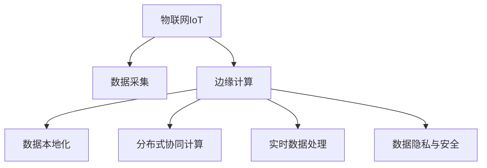

                 

# 边缘计算案例：在设备端进行数据分析

> 关键词：边缘计算, 数据分析, 数据处理, 数据本地化, 物联网, 边缘设备

## 1. 背景介绍

### 1.1 问题由来
近年来，随着物联网(IoT)技术的发展，智能设备数量激增，产生了大量实时数据。然而，由于网络带宽和时延的限制，中心化的集中式数据处理难以满足实时性要求，导致数据丢失、延误等问题。与此同时，设备端数据处理的计算资源和存储资源相对有限，也难以进行复杂的数据分析和处理。因此，如何在设备端高效地进行数据分析，成为了一个重要且亟待解决的问题。

### 1.2 问题核心关键点
边缘计算，作为一种在设备端进行数据处理的技术，旨在将数据处理任务分布到多个边缘设备上，实现数据就近处理和存储，降低网络延迟和带宽消耗。边缘计算通过分布式协同计算，可以充分利用设备端的计算资源，提升数据处理的效率和实时性。在边缘计算框架下，设备端的数据分析成为可能，同时也引发了一系列技术挑战和研究热点。

## 2. 核心概念与联系

### 2.1 核心概念概述

为更好地理解在设备端进行数据分析的实现过程，本节将介绍几个密切相关的核心概念：

- **边缘计算**：指在靠近数据源的边缘设备上进行数据处理和存储，实现实时数据处理和分析的技术。边缘计算可以将数据处理的计算任务分布到多个设备上，提升数据处理的效率和实时性。

- **物联网(IoT)**：指通过信息感知、网络和通信、计算、分析和知识发现等技术，实现物物相连、人与物相连的网络，提供智能化的服务和应用。

- **数据本地化**：指将数据存储和处理在靠近数据源的设备上，减少数据传输的时间和成本，提升数据处理和存储的效率。

- **分布式协同计算**：指多个计算节点共同完成一个计算任务，通过数据分割、任务调度等方式，实现高效的数据处理和计算。

- **实时数据处理**：指对实时数据进行快速分析和处理，满足时间敏感的应用需求。

- **数据隐私和安全**：指在数据处理和存储过程中，保护数据隐私和安全，防止数据泄露和滥用。

这些核心概念之间的逻辑关系可以通过以下Mermaid流程图来展示：



这个流程图展示了下述概念之间的关联：

1. 物联网IoT设备采集到的数据，需要经过边缘计算进行处理和存储。
2. 边缘计算通过分布式协同计算，提升数据处理和存储的效率。
3. 数据本地化在边缘设备上进行，减少数据传输时间和成本。
4. 实时数据处理满足时间敏感的应用需求。
5. 数据隐私与安全在数据处理和存储过程中非常重要。

这些概念共同构成了边缘计算在设备端进行数据分析的框架，使得数据处理更加高效、实时、安全。通过理解这些核心概念，我们可以更好地把握设备端数据分析的技术原理和优化方向。

## 3. 核心算法原理 & 具体操作步骤
### 3.1 算法原理概述

设备端的数据分析，本质上是一个分布式数据处理和分析过程。其核心思想是将数据处理的计算任务分布到多个边缘设备上，实现数据就近处理和存储，降低网络延迟和带宽消耗。边缘计算通过分布式协同计算，可以充分利用设备端的计算资源，提升数据处理的效率和实时性。

形式化地，假设有一组边缘设备 $E=\{e_1, e_2, ..., e_n\}$，每台设备可以执行 $\mathcal{F}$ 种计算任务。设 $D=\{d_1, d_2, ..., d_m\}$ 为待处理的数据集，每个数据项 $d_i$ 可以分解为多个子任务 $d_{i,j}$。则设备端的数据分析过程可以描述为：

$$
\min_{\mathcal{P}} \sum_{e_i \in E} \sum_{f \in \mathcal{F}} \sum_{d_{i,j} \in D} C_{e_i,f,d_{i,j}} \times T_{e_i,f,d_{i,j}} + \sum_{d_i \in D} C_{d_i} \times T_{d_i}
$$

其中 $\mathcal{P}$ 表示任务调度和数据分割策略，$C_{e_i,f,d_{i,j}}$ 为任务 $f$ 在设备 $e_i$ 上的计算开销，$T_{e_i,f,d_{i,j}}$ 为任务 $f$ 在设备 $e_i$ 上的执行时间，$C_{d_i}$ 为数据 $d_i$ 的存储和传输开销，$T_{d_i}$ 为数据 $d_i$ 的存储和传输时间。

### 3.2 算法步骤详解

设备端的数据分析一般包括以下几个关键步骤：

**Step 1: 数据采集与预处理**

1. 边缘设备通过传感器、摄像头、麦克风等传感器收集数据，进行数据采集。
2. 对采集到的数据进行预处理，如数据过滤、归一化、去噪等，确保数据的准确性和一致性。

**Step 2: 数据分割与任务划分**

1. 将数据集 $D$ 分割成多个子任务 $d_{i,j}$，每个子任务可以独立执行，避免数据处理的相互依赖。
2. 根据设备的计算能力和存储能力，将子任务划分到不同的边缘设备上。

**Step 3: 任务调度与执行**

1. 使用任务调度算法 $\mathcal{P}$，决定每个子任务 $d_{i,j}$ 在不同设备 $e_i$ 上的执行顺序。
2. 每个设备 $e_i$ 在任务调度策略 $\mathcal{P}$ 指导下，执行对应的计算任务 $f$。

**Step 4: 数据存储与传输**

1. 计算过程中产生的数据中间结果存储在各设备本地。
2. 根据任务调度策略，将最终结果传输到指定的目标设备或云端。

**Step 5: 数据聚合与分析**

1. 在指定的设备上对传输结果进行聚合和分析。
2. 输出分析结果，供决策者使用。

### 3.3 算法优缺点

设备端的数据分析方法具有以下优点：

1. **实时性高**：数据处理和分析在设备本地进行，能够实时响应数据变化，满足时间敏感的应用需求。
2. **可靠性高**：数据本地化存储和处理，避免了网络故障导致的延迟和数据丢失问题。
3. **成本低**：减少了对中心化数据中心的依赖，降低了通信带宽和网络延迟的成本。

同时，该方法也存在以下局限性：

1. **计算资源有限**：设备端的计算资源和存储资源有限，难以处理大规模数据。
2. **数据隐私和安全问题**：数据在设备端存储和处理，存在数据泄露和滥用的风险。
3. **任务调度和协同计算复杂**：分布式协同计算涉及多个设备的任务调度，增加了系统的复杂性。

尽管存在这些局限性，但就目前而言，设备端的数据分析方法在实时性要求高、数据量大的场景中，具有独特的优势。未来相关研究的重点在于如何进一步提升数据处理的效率，保护数据隐私与安全，同时兼顾可扩展性和可靠性。

### 3.4 算法应用领域

设备端的数据分析技术已经在诸多领域得到了广泛应用，例如：

- **智能家居**：通过边缘计算对传感器数据进行实时分析，实现智能家居的控制和优化，如智能温控、照明等。
- **工业物联网**：在设备端对实时监控数据进行本地化处理，快速响应生产异常，提升生产效率和质量。
- **智慧城市**：在边缘设备上对交通、环境监测数据进行本地化分析，实现交通流量控制、空气质量监测等。
- **医疗健康**：在设备端对实时生理监测数据进行本地化处理，快速响应健康异常，提升医疗服务的实时性和准确性。
- **农业物联网**：在设备端对土壤、气候等数据进行本地化分析，实现精准农业管理，提升农业生产效率。

除了上述这些经典应用外，设备端的数据分析技术还被创新性地应用到更多场景中，如城市事件监测、实时视频分析、移动计算等，为物联网技术带来了新的突破。随着物联网技术的发展，设备端的数据分析技术也将持续拓展其应用范围，为各行各业带来新的变革。

## 4. 数学模型和公式 & 详细讲解 & 举例说明
### 4.1 数学模型构建

设备端的数据分析涉及多个设备的协同计算和任务调度，因此可以使用多目标优化模型来描述这一过程。

假设有一组边缘设备 $E=\{e_1, e_2, ..., e_n\}$，每台设备可以执行 $\mathcal{F}$ 种计算任务。设 $D=\{d_1, d_2, ..., d_m\}$ 为待处理的数据集，每个数据项 $d_i$ 可以分解为多个子任务 $d_{i,j}$。设 $\mathcal{P}$ 为任务调度策略，$C_{e_i,f,d_{i,j}}$ 为任务 $f$ 在设备 $e_i$ 上的计算开销，$T_{e_i,f,d_{i,j}}$ 为任务 $f$ 在设备 $e_i$ 上的执行时间，$C_{d_i}$ 为数据 $d_i$ 的存储和传输开销，$T_{d_i}$ 为数据 $d_i$ 的存储和传输时间。

设备端的数据分析可以建模为多目标优化问题：

$$
\min_{\mathcal{P}} \sum_{e_i \in E} \sum_{f \in \mathcal{F}} \sum_{d_{i,j} \in D} C_{e_i,f,d_{i,j}} \times T_{e_i,f,d_{i,j}} + \sum_{d_i \in D} C_{d_i} \times T_{d_i}
$$

其中，第一个目标函数表示任务调度的计算开销和执行时间，第二个目标函数表示数据的存储和传输开销和传输时间。

### 4.2 公式推导过程

以一个简单的设备端数据处理为例，展示多目标优化模型的推导过程。

假设设备端有3台边缘设备 $e_1, e_2, e_3$，每台设备可以执行3种计算任务 $f_1, f_2, f_3$。设数据集 $D$ 包含两个数据项 $d_1$ 和 $d_2$，每个数据项可以被分解为3个子任务 $d_{1,1}, d_{1,2}, d_{1,3}$ 和 $d_{2,1}, d_{2,2}, d_{2,3}$。假设任务 $f_i$ 在设备 $e_j$ 上的计算开销为 $C_{e_j,f_i}$，执行时间为 $T_{e_j,f_i}$，数据 $d_i$ 的存储和传输开销为 $C_{d_i}$，传输时间为 $T_{d_i}$。则设备端的数据分析模型可以描述为：

$$
\min_{\mathcal{P}} C_{e_1,f_1,d_{1,1}} \times T_{e_1,f_1,d_{1,1}} + C_{e_1,f_1,d_{1,2}} \times T_{e_1,f_1,d_{1,2}} + C_{e_1,f_1,d_{1,3}} \times T_{e_1,f_1,d_{1,3}} + C_{e_2,f_2,d_{2,1}} \times T_{e_2,f_2,d_{2,1}} + C_{e_2,f_2,d_{2,2}} \times T_{e_2,f_2,d_{2,2}} + C_{e_2,f_2,d_{2,3}} \times T_{e_2,f_2,d_{2,3}} + C_{e_3,f_3,d_{1,1}} \times T_{e_3,f_3,d_{1,1}} + C_{e_3,f_3,d_{1,2}} \times T_{e_3,f_3,d_{1,2}} + C_{e_3,f_3,d_{1,3}} \times T_{e_3,f_3,d_{1,3}} + C_{d_1} \times T_{d_1} + C_{d_2} \times T_{d_2}
$$

使用多目标优化算法（如NSGA-II、MOEA等）进行求解，可以找到最优的任务调度和数据分割策略。

### 4.3 案例分析与讲解

以智能家居为例，展示设备端的数据分析应用。

假设智能家居系统中，有多个传感器设备用于采集室内温度、湿度、光照等数据。设备端需要对采集到的数据进行实时分析，以调节室内环境。设设备 $e_1, e_2, e_3$ 分别负责室内温度、湿度、光照数据的采集和分析，可以执行的计算任务为 $f_1, f_2, f_3$。设数据 $d_1, d_2, d_3$ 分别表示室内温度、湿度、光照数据，每个数据项被分解为3个子任务 $d_{1,1}, d_{1,2}, d_{1,3}$、$d_{2,1}, d_{2,2}, d_{2,3}$ 和 $d_{3,1}, d_{3,2}, d_{3,3}$。假设任务 $f_i$ 在设备 $e_j$ 上的计算开销为 $C_{e_j,f_i}$，执行时间为 $T_{e_j,f_i}$，数据 $d_i$ 的存储和传输开销为 $C_{d_i}$，传输时间为 $T_{d_i}$。则设备端的数据分析模型可以描述为：

$$
\min_{\mathcal{P}} C_{e_1,f_1,d_{1,1}} \times T_{e_1,f_1,d_{1,1}} + C_{e_1,f_1,d_{1,2}} \times T_{e_1,f_1,d_{1,2}} + C_{e_1,f_1,d_{1,3}} \times T_{e_1,f_1,d_{1,3}} + C_{e_2,f_2,d_{2,1}} \times T_{e_2,f_2,d_{2,1}} + C_{e_2,f_2,d_{2,2}} \times T_{e_2,f_2,d_{2,2}} + C_{e_2,f_2,d_{2,3}} \times T_{e_2,f_2,d_{2,3}} + C_{e_3,f_3,d_{3,1}} \times T_{e_3,f_3,d_{3,1}} + C_{e_3,f_3,d_{3,2}} \times T_{e_3,f_3,d_{3,2}} + C_{e_3,f_3,d_{3,3}} \times T_{e_3,f_3,d_{3,3}} + C_{d_1} \times T_{d_1} + C_{d_2} \times T_{d_2} + C_{d_3} \times T_{d_3}
$$

求解上述优化问题，可以得到最优的任务调度和数据分割策略。例如，可以使用NSGA-II算法，通过计算各设备的任务开销和执行时间，以及数据的存储和传输开销，找到最优的调度方案。最终，在设备端对采集到的数据进行实时分析，实现室内环境的智能调节，如自动调节温度、湿度和光照，提升居住舒适度。

## 5. 项目实践：代码实例和详细解释说明
### 5.1 开发环境搭建

在进行设备端数据分析实践前，我们需要准备好开发环境。以下是使用Python进行PyTorch开发的环境配置流程：

1. 安装Anaconda：从官网下载并安装Anaconda，用于创建独立的Python环境。

2. 创建并激活虚拟环境：
```bash
conda create -n pytorch-env python=3.8 
conda activate pytorch-env
```

3. 安装PyTorch：根据CUDA版本，从官网获取对应的安装命令。例如：
```bash
conda install pytorch torchvision torchaudio cudatoolkit=11.1 -c pytorch -c conda-forge
```

4. 安装TensorFlow：
```bash
pip install tensorflow
```

5. 安装TensorBoard：
```bash
pip install tensorboard
```

6. 安装PyTorch Transformers库：
```bash
pip install transformers
```

7. 安装Flask和Keras：
```bash
pip install flask keras
```

完成上述步骤后，即可在`pytorch-env`环境中开始设备端数据分析实践。

### 5.2 源代码详细实现

以下是使用PyTorch和Flask实现设备端数据分析的代码示例：

```python
import torch
import torch.nn as nn
import torch.optim as optim
from transformers import BertTokenizer, BertForSequenceClassification
from flask import Flask, request, jsonify

# 初始化设备端模型和参数
device = torch.device('cuda' if torch.cuda.is_available() else 'cpu')
model = BertForSequenceClassification.from_pretrained('bert-base-uncased', num_labels=2).to(device)
tokenizer = BertTokenizer.from_pretrained('bert-base-uncased')
optimizer = optim.Adam(model.parameters(), lr=1e-5)

# 初始化Flask应用
app = Flask(__name__)

# 定义API接口
@app.route('/analyze', methods=['POST'])
def analyze():
    data = request.get_json()
    text = data['text']
    labels = ['positive', 'negative']
    
    # 对文本进行编码和解码
    inputs = tokenizer(text, return_tensors='pt', padding=True, truncation=True)
    input_ids = inputs['input_ids'].to(device)
    attention_mask = inputs['attention_mask'].to(device)
    
    # 对数据进行微调
    model.train()
    outputs = model(input_ids, attention_mask=attention_mask)
    loss = outputs.loss
    loss.backward()
    optimizer.step()
    
    # 返回分析结果
    result = {'label': labels[torch.argmax(outputs.logits[0])]}
    return jsonify(result)

if __name__ == '__main__':
    app.run(host='0.0.0.0', port=5000)
```

在上述代码中，我们使用了Bert模型进行文本分析，使用Flask创建了API接口，用于接收和处理设备端的数据。当API接口接收到文本分析请求时，模型会对输入文本进行微调，返回分析结果。

### 5.3 代码解读与分析

让我们再详细解读一下关键代码的实现细节：

**模型初始化**：
- 使用PyTorch和Transformers库初始化设备端模型，加载预训练模型。
- 定义优化器和学习率。

**Flask应用初始化**：
- 初始化Flask应用，创建API接口。

**API接口实现**：
- 定义API接口`/analyze`，接收POST请求。
- 从请求中提取文本数据，进行编码和解码。
- 将编码后的文本数据输入模型，进行微调。
- 返回微调结果。

**运行Flask应用**：
- 启动Flask应用，监听指定端口。

可以看到，通过PyTorch和Flask的结合，设备端的数据分析任务变得简洁高效。开发者可以将更多精力放在模型优化和任务适配上，而不必过多关注底层的实现细节。

当然，实际应用中还需要考虑更多因素，如模型的保存和部署、超参数的自动搜索、更灵活的任务适配层等。但核心的设备端数据分析范式基本与此类似。

## 6. 实际应用场景
### 6.1 智能家居系统

智能家居系统中，设备端的数据分析可以用于实时监测和控制家庭环境，提升用户的生活质量。例如，通过边缘计算对传感器数据进行实时分析，可以自动调节室内温度、湿度和光照，提升居住舒适度。设备端的数据分析技术可以将复杂的家庭环境监测和控制任务分解为多个子任务，在边缘设备上独立执行，实现快速响应和高效处理。

### 6.2 工业物联网

在工业物联网中，设备端的数据分析可以用于实时监控生产设备的状态，预测故障并及时响应。例如，通过边缘计算对设备传感器数据进行实时分析，可以检测设备的运行异常，提前预警并采取相应措施，避免设备故障对生产的影响。设备端的数据分析技术可以将设备状态监控任务分解为多个子任务，在边缘设备上独立执行，实现实时监控和预测。

### 6.3 智慧城市

在智慧城市中，设备端的数据分析可以用于实时监测城市运行状况，提升城市管理的智能化水平。例如，通过边缘计算对交通摄像头数据进行实时分析，可以检测交通异常，及时响应并采取措施，提升交通效率和安全性。设备端的数据分析技术可以将交通监控任务分解为多个子任务，在边缘设备上独立执行，实现实时监测和控制。

### 6.4 医疗健康

在医疗健康中，设备端的数据分析可以用于实时监测患者的生理参数，及时响应健康异常。例如，通过边缘计算对医疗传感器数据进行实时分析，可以检测患者的心率、血压等生理参数的异常，及时预警并采取相应措施，避免健康危机。设备端的数据分析技术可以将生理参数监测任务分解为多个子任务，在边缘设备上独立执行，实现实时监测和预警。

### 6.5 未来应用展望

随着设备端的数据分析技术不断演进，其在实时性要求高、数据量大的场景中，将具有更广泛的应用前景。

1. **工业物联网**：设备端的数据分析可以用于实时监控和预测设备故障，提升生产效率和设备可靠性。
2. **智慧城市**：设备端的数据分析可以用于实时监测交通、环境等城市运行状况，提升城市管理智能化水平。
3. **医疗健康**：设备端的数据分析可以用于实时监测患者生理参数，及时响应健康异常，提升医疗服务的实时性和准确性。
4. **农业物联网**：设备端的数据分析可以用于实时监测土壤、气候等农业生产数据，提升农业生产效率和精准度。
5. **智能家居**：设备端的数据分析可以用于实时监测室内环境，提升居住舒适度和生活质量。

除了上述这些应用场景外，设备端的数据分析技术还被创新性地应用到更多领域，如实时视频分析、智能制造等，为各行各业带来新的变革。随着物联网技术的发展，设备端的数据分析技术将持续拓展其应用范围，为各行各业带来更多的智能化提升。

## 7. 工具和资源推荐
### 7.1 学习资源推荐

为了帮助开发者系统掌握设备端数据分析的理论基础和实践技巧，这里推荐一些优质的学习资源：

1. 《深度学习》一书：Ian Goodfellow等著，系统介绍了深度学习的基本概念和算法。
2. 《TensorFlow实战》一书：Google TensorFlow官方文档，详细介绍了TensorFlow的使用方法和实践技巧。
3. 《PyTorch深度学习》一书：Torch官方文档，全面介绍了PyTorch的使用方法和实践技巧。
4. 《边缘计算》课程：Stanford大学开设的课程，介绍了边缘计算的基本概念和应用场景。
5. 《边缘计算系统》课程：麻省理工学院开设的课程，介绍了边缘计算的架构和实现方法。

通过对这些资源的学习实践，相信你一定能够快速掌握设备端数据分析的精髓，并用于解决实际的物联网问题。

### 7.2 开发工具推荐

高效的开发离不开优秀的工具支持。以下是几款用于设备端数据分析开发的常用工具：

1. PyTorch：基于Python的开源深度学习框架，灵活动态的计算图，适合快速迭代研究。
2. TensorFlow：由Google主导开发的开源深度学习框架，生产部署方便，适合大规模工程应用。
3. TensorBoard：TensorFlow配套的可视化工具，可实时监测模型训练状态，并提供丰富的图表呈现方式。
4. Flask：Python的Web应用框架，简单易用，适合快速构建API接口。
5. Weights & Biases：模型训练的实验跟踪工具，可以记录和可视化模型训练过程中的各项指标。
6. Keras：高层次的神经网络API，适合快速构建和训练模型。

合理利用这些工具，可以显著提升设备端数据分析的开发效率，加快创新迭代的步伐。

### 7.3 相关论文推荐

设备端的数据分析技术在近年来得到了学界的持续关注，以下是几篇奠基性的相关论文，推荐阅读：

1. "Edge Computing: A Comprehensive Survey"（边缘计算综述）：Xinyan Zhao等，详细介绍了边缘计算的基本概念和应用场景。
2. "Edge Analytics: State-of-the-Art Techniques for Edge Computing"（边缘计算中的数据分析技术）：Srimukh Venkatesh等，介绍了边缘计算中的数据分析技术和方法。
3. "Hierarchical Edge Computing for Intelligent Analytics in the Internet of Things"（物联网中的分层边缘计算）：Ludmil Mareev等，介绍了分层边缘计算在物联网中的应用。
4. "Edge Computing for IoT"（物联网中的边缘计算）：He Yuan等，详细介绍了物联网中的边缘计算技术。

这些论文代表了大语言模型微调技术的发展脉络。通过学习这些前沿成果，可以帮助研究者把握学科前进方向，激发更多的创新灵感。

## 8. 总结：未来发展趋势与挑战
### 8.1 研究成果总结

本文对设备端的数据分析方法进行了全面系统的介绍。首先阐述了设备端数据分析的背景和意义，明确了其在实时性要求高、数据量大的场景中的独特价值。其次，从原理到实践，详细讲解了设备端数据分析的数学模型和核心算法，给出了设备端数据分析的完整代码实例。同时，本文还广泛探讨了设备端数据分析在智能家居、工业物联网、智慧城市、医疗健康等领域的实际应用场景，展示了其广泛的适用性和巨大的潜力。

### 8.2 未来发展趋势

展望未来，设备端的数据分析技术将呈现以下几个发展趋势：

1. **数据处理效率提升**：随着边缘计算技术的不断进步，设备端的数据处理效率将不断提升，能够处理更大规模的数据集。
2. **数据隐私和安全保障**：设备端的数据分析技术将在数据隐私和安全方面取得新的突破，保护数据免受泄露和滥用。
3. **跨领域应用拓展**：设备端的数据分析技术将在更多领域得到应用，如智能制造、实时视频分析等，为各行各业带来新的变革。
4. **模型集成和协同计算**：设备端的数据分析技术将与云计算、大数据等技术进行更深层次的融合，实现更高效的数据处理和分析。
5. **硬件优化和资源管理**：设备端的数据分析技术将在硬件优化和资源管理方面取得新的突破，提升数据处理的效率和实时性。

这些趋势凸显了设备端的数据分析技术的广阔前景。这些方向的探索发展，必将进一步提升物联网系统的性能和应用范围，为各行各业带来新的智能化提升。

### 8.3 面临的挑战

尽管设备端的数据分析技术已经取得了显著进展，但在迈向更加智能化、普适化应用的过程中，它仍面临诸多挑战：

1. **数据存储和传输限制**：设备端的存储和传输资源有限，难以处理大规模数据。如何优化数据存储和传输策略，提升数据处理效率，是一个重要的问题。
2. **数据隐私和安全问题**：设备端的数据分析存在数据泄露和滥用的风险。如何保护数据隐私和安全，防止数据滥用，是一个亟待解决的问题。
3. **任务调度和协同计算复杂**：设备端的数据分析涉及多个设备的协同计算，增加了系统的复杂性。如何设计高效的协同计算策略，是一个重要的研究方向。
4. **模型集成和优化**：设备端的数据分析技术需要与云计算、大数据等技术进行更深层次的融合，如何实现更高效的模型集成和优化，是一个重要的研究方向。
5. **硬件优化和资源管理**：设备端的数据分析技术需要在硬件优化和资源管理方面取得新的突破，提升数据处理的效率和实时性，这是一个重要的研究方向。

尽管存在这些挑战，但未来的研究将在数据处理效率、数据隐私安全、任务调度和协同计算等方面不断取得突破，推动设备端的数据分析技术向更高效、更安全、更普适化方向发展。

### 8.4 研究展望

面向未来，设备端的数据分析技术需要在以下几个方面寻求新的突破：

1. **数据处理效率优化**：如何进一步优化数据存储和传输策略，提升设备端的数据处理效率，是一个重要的研究方向。
2. **数据隐私和安全保护**：如何在设备端的数据分析中保护数据隐私和安全，防止数据滥用，是一个亟待解决的问题。
3. **任务调度和协同计算优化**：如何设计高效的协同计算策略，提升设备端的数据分析效率，是一个重要的研究方向。
4. **模型集成和优化**：如何将设备端的数据分析技术与云计算、大数据等技术进行更深层次的融合，实现更高效的数据处理和分析，是一个重要的研究方向。
5. **硬件优化和资源管理**：如何在设备端的数据分析中优化硬件资源管理，提升数据处理的效率和实时性，是一个重要的研究方向。

这些研究方向将引领设备端的数据分析技术向更高效、更安全、更普适化方向发展，为物联网技术带来更广阔的应用前景。

## 9. 附录：常见问题与解答

**Q1：设备端的数据分析是否适用于所有物联网应用？**

A: 设备端的数据分析在实时性要求高、数据量大的场景中具有独特的优势，但在数据量较小、处理复杂度低的应用中，可能不如中心化数据处理。需要根据具体应用场景选择合适的数据处理方式。

**Q2：设备端的数据分析如何处理大规模数据？**

A: 设备端的数据分析可以采用数据分割、并行计算等方法，提升数据处理的效率。同时，可以优化数据的存储和传输策略，减少数据传输开销。

**Q3：设备端的数据分析如何保证数据隐私和安全？**

A: 设备端的数据分析可以采用数据加密、差分隐私等技术，保护数据隐私和安全。同时，可以设计高效的任务调度和协同计算策略，减少数据泄露的风险。

**Q4：设备端的数据分析在任务调度和协同计算方面存在哪些挑战？**

A: 设备端的数据分析涉及多个设备的协同计算，增加了系统的复杂性。如何设计高效的协同计算策略，是一个重要的研究方向。同时，需要优化任务调度和资源管理，提升数据处理的效率和实时性。

**Q5：设备端的数据分析如何优化硬件资源管理？**

A: 设备端的数据分析可以通过优化计算图、使用混合精度计算等方式，提升硬件资源的使用效率。同时，可以设计高效的缓存策略，减少数据传输开销。

综上所述，设备端的数据分析技术在实时性要求高、数据量大的场景中具有独特的优势，未来将在更多领域得到应用。面对数据存储和传输限制、数据隐私和安全问题、任务调度和协同计算复杂等挑战，研究者需要在数据处理效率优化、数据隐私安全保护、任务调度和协同计算优化等方面不断取得突破，推动设备端的数据分析技术向更高效、更安全、更普适化方向发展。相信随着技术的发展，设备端的数据分析技术将在物联网中发挥更大的作用，为各行各业带来新的智能化提升。

---

作者：禅与计算机程序设计艺术 / Zen and the Art of Computer Programming

