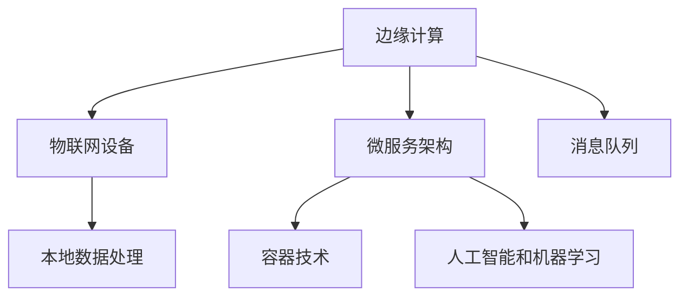

                 

# 边缘计算：IoT设备的本地数据处理技术

## 1. 背景介绍

### 1.1 问题由来

随着物联网(IoT)技术的快速发展，越来越多的设备开始实现联网，并产生大量的实时数据。传统云计算中心集中式存储和处理的方式，由于带宽、延迟、成本等问题，已难以满足实时数据处理的需要。因此，边缘计算作为新一代计算范式，逐渐成为物联网数据处理的重要方向。

### 1.2 问题核心关键点

边缘计算的核心理念是将数据处理和计算能力从集中式的数据中心下放到靠近数据源的设备端，减少数据传输和存储的开销，提升数据处理的时效性和可用性。物联网设备的本地数据处理正是边缘计算的一个重要应用场景，通过在设备上部署计算资源，实时处理数据，从而提高系统的响应速度和可靠性。

## 2. 核心概念与联系

### 2.1 核心概念概述

为更好地理解边缘计算在物联网设备上的应用，本节将介绍几个关键概念：

- 边缘计算(Edge Computing)：通过在靠近数据源的设备上部署计算资源，实现数据的本地化处理和存储，减少数据传输开销，提升系统响应速度和可靠性。
- 物联网设备(IoT Devices)：能够实时监测、感知、控制、通讯的网络终端，如智能家居设备、工业控制设备、智能穿戴设备等。
- 本地数据处理(Local Data Processing)：在设备端直接对数据进行处理，减少数据传输，提升处理速度和效率。
- 微服务架构(Microservices Architecture)：将大系统拆分为多个小服务，通过容器化部署、自动化编排等方式，提高系统的可扩展性、可靠性和维护性。
- 消息队列(Message Queue)：一种基于队列的消息传递机制，用于在不同服务之间解耦，实现异步通信和数据缓冲。
- 容器技术(Container Technology)：如Docker、Kubernetes等，提供轻量级的应用部署和运行环境，提高系统的部署效率和资源利用率。
- 人工智能和机器学习(AI/ML)：通过在边缘设备上部署AI模型，实现数据的实时分析和预测，提升系统的智能化水平。

这些概念之间的逻辑关系可以通过以下Mermaid流程图来展示：



这个流程图展示了几组关键概念及其之间的关系：

1. 边缘计算和物联网设备通过本地数据处理紧密关联，在设备上直接处理数据。
2. 边缘计算和微服务架构互相补充，提升系统的灵活性和扩展性。
3. 消息队列作为异步通信机制，在边缘计算架构中起到桥梁作用。
4. 容器技术为边缘计算提供了轻量级、可移植的应用部署环境。
5. 人工智能和机器学习通过模型部署在边缘设备上，提升数据处理的智能化水平。

这些核心概念共同构成了边缘计算在物联网设备上的应用框架，使其能够实现高效、可靠、智能的数据处理。

## 3. 核心算法原理 & 具体操作步骤

### 3.1 算法原理概述

物联网设备的本地数据处理，本质上是将传统集中式的计算任务分散到各个边缘设备上。其核心算法原理可以概括为以下几点：

- 数据边缘化：将数据处理任务从云中心下发到设备端，利用设备本地计算资源。
- 任务分布化：将大任务拆分为多个子任务，并行处理，提升计算效率。
- 计算资源本地化：在设备上部署计算资源，如CPU、GPU、FPGA等，实现本地数据处理。
- 消息异步化：通过消息队列实现服务间的异步通信和数据缓冲。
- 应用容器化：将应用和其依赖打包为容器，实现快速部署和资源隔离。
- 模型轻量化：针对计算资源受限的设备，通过模型压缩和剪枝等技术，降低模型复杂度。

### 3.2 算法步骤详解

基于边缘计算的物联网设备本地数据处理，一般包括以下几个关键步骤：

**Step 1: 设备数据采集**

- 使用传感器、摄像头、麦克风等设备，采集实时数据。
- 将数据进行预处理和编码，生成标准化的数据格式。

**Step 2: 任务分解与调度**

- 将大数据处理任务分解为多个小任务，并根据设备性能进行任务调度。
- 利用消息队列异步传递任务信息，避免阻塞。

**Step 3: 本地数据处理**

- 在设备上部署计算资源，直接处理本地数据。
- 利用容器的轻量级特性，快速部署应用，并隔离资源。

**Step 4: 结果汇总与传输**

- 对各个设备的计算结果进行汇总，生成最终输出。
- 通过本地网络将结果传输至云端或其他设备，进行进一步分析或存储。

**Step 5: 结果应用与反馈**

- 将处理结果应用于设备控制、数据分析等场景。
- 根据结果反馈调整任务分解和调度策略，优化系统性能。

### 3.3 算法优缺点

基于边缘计算的物联网设备本地数据处理具有以下优点：

1. 降低延迟：数据处理在设备端完成，减少数据传输和存储开销，提升系统响应速度。
2. 增强可靠性：分散计算负载，提升系统容错能力和鲁棒性。
3. 节约带宽：减少数据传输，降低网络带宽需求。
4. 保护隐私：数据存储在设备本地，减少数据泄露风险。
5. 提升性能：利用本地计算资源，提高数据处理效率。

但同时也存在一些缺点：

1. 设备资源有限：物联网设备资源受限，无法处理过于复杂的数据处理任务。
2. 设备互联性差：设备之间互联复杂，需要建立可靠的网络连接。
3. 部署和维护成本高：设备分散，部署和维护成本较高。
4. 数据分散存储：数据存储分散，管理复杂。
5. 系统复杂度高：涉及任务分解、调度、容错等复杂过程。

尽管存在这些局限性，但边缘计算在物联网设备本地数据处理的应用前景广阔，能够显著提升系统的响应速度和可用性，降低带宽成本，保护数据隐私，成为未来物联网数据处理的重要方向。

### 3.4 算法应用领域

基于边缘计算的物联网设备本地数据处理，已经在多个领域得到了广泛应用，例如：

- 智能家居：通过本地数据处理，实现智能设备间的协同控制，提升用户生活体验。
- 智能工厂：在生产设备上部署本地处理能力，实时监控生产过程，优化生产效率。
- 智慧农业：利用本地处理能力，实时监测农作物生长状况，提高农业管理水平。
- 智能交通：在车辆上部署本地处理能力，实时分析交通数据，提升交通管理水平。
- 医疗健康：在可穿戴设备上部署本地处理能力，实时监测健康数据，提高医疗服务水平。
- 智能安防：在安防设备上部署本地处理能力，实时监控异常情况，提升安全管理水平。

除了上述这些经典应用外，边缘计算还被创新性地应用于更多场景中，如工业物联网、智能城市、智慧环保等，为物联网技术的智能化、高效化提供了新的可能性。

## 4. 数学模型和公式 & 详细讲解

### 4.1 数学模型构建

为了更好地理解边缘计算在物联网设备上的应用，本节将使用数学语言对相关模型进行描述。

记物联网设备的数据处理任务为 $T$，设备端计算资源为 $R$，云端的计算资源为 $C$。设数据处理任务 $T$ 在设备端 $R$ 上处理时间为 $t_R$，在云端 $C$ 上处理时间为 $t_C$。假设任务处理时间与设备性能成正比，即 $t_R \propto R$，$t_C \propto C$。

设备端和云端的数据传输时间分别为 $d_{in}$ 和 $d_{out}$，带宽分别为 $b_{in}$ 和 $b_{out}$。假设数据传输时间与带宽成反比，即 $d_{in} \propto 1/b_{in}$，$d_{out} \propto 1/b_{out}$。

边缘计算的总体处理时间为 $t_{total}$，包括设备端处理时间 $t_R$、数据传输时间 $d_{in}$ 和 $d_{out}$，以及云端处理时间 $t_C$，计算公式为：

$$
t_{total} = t_R + d_{in} + d_{out} + t_C
$$

### 4.2 公式推导过程

根据上述模型，我们可以对边缘计算的总体处理时间 $t_{total}$ 进行推导：

1. 设备端处理时间 $t_R$ 为：

$$
t_R = \frac{T}{R}
$$

2. 云端处理时间 $t_C$ 为：

$$
t_C = \frac{T}{C}
$$

3. 数据传输时间 $d_{in}$ 为：

$$
d_{in} = \frac{T}{b_{in}}
$$

4. 数据传输时间 $d_{out}$ 为：

$$
d_{out} = \frac{T}{b_{out}}
$$

将以上公式代入总体处理时间公式，得：

$$
t_{total} = \frac{T}{R} + \frac{T}{b_{in}} + \frac{T}{b_{out}} + \frac{T}{C}
$$

### 4.3 案例分析与讲解

假设物联网设备采集的数据量为 $T = 1$ GB，设备端带宽为 $b_{in} = 100$ Mbps，云端带宽为 $b_{out} = 1$ Gbps，云端计算资源为 $C = 1000$ 个设备端计算资源的性能。不同处理方案下的总体处理时间对比如下：

1. 完全依赖云端处理：

$$
t_{total} = \frac{1}{1000} + \frac{1}{100} + 1 + \frac{1}{1}
$$

2. 完全依赖设备端处理：

$$
t_{total} = \frac{1}{1} + \frac{1}{100} + \frac{1}{100} + \frac{1}{1000}
$$

3. 分布式处理：设备端处理 $R_1$ 和 $R_2$，云端处理 $C_1$ 和 $C_2$，总带宽 $b_{in_1} = 50$ Mbps，$b_{in_2} = 50$ Mbps，$b_{out_1} = 200$ Mbps，$b_{out_2} = 200$ Mbps，计算资源 $C_1 = C_2 = 500$：

$$
t_{total} = \frac{1}{R_1} + \frac{1}{R_2} + \frac{1}{b_{in_1}} + \frac{1}{b_{in_2}} + \frac{1}{b_{out_1}} + \frac{1}{b_{out_2}} + \frac{1}{C_1} + \frac{1}{C_2}
$$

通过对比不同方案的处理时间，可以看出分布式处理的优势，即能够在减少数据传输和云端计算资源的同时，提高数据处理的效率和系统的可靠性。

## 5. 项目实践：代码实例和详细解释说明

### 5.1 开发环境搭建

在进行边缘计算实践前，我们需要准备好开发环境。以下是使用Python进行Docker容器开发的环境配置流程：

1. 安装Docker：从官网下载并安装Docker，用于创建和管理容器。

2. 安装Docker Compose：从官网下载并安装Docker Compose，用于定义和管理多容器应用。

3. 安装Kubernetes：从官网下载并安装Kubernetes，用于容器编排和资源管理。

4. 安装Fluentd：从官网下载并安装Fluentd，用于日志收集和传输。

5. 安装InfluxDB：从官网下载并安装InfluxDB，用于时序数据存储和查询。

完成上述步骤后，即可在本地搭建边缘计算环境。

### 5.2 源代码详细实现

下面以智能家居场景为例，给出使用Docker容器进行边缘计算的Python代码实现。

首先，定义智能家居设备的数据处理函数：

```python
import docker
from flask import Flask, request, jsonify

app = Flask(__name__)

@app.route('/data', methods=['POST'])
def handle_data():
    data = request.json['data']
    # 对数据进行处理
    processed_data = process_data(data)
    # 发送数据到云端
    send_data_to_cloud(processed_data)
    return jsonify({'message': 'Data processed successfully'})

def process_data(data):
    # 对数据进行本地处理
    # 返回处理结果
    return processed_data

def send_data_to_cloud(data):
    # 创建Docker容器
    client = docker.from_env()
    container = client.containers.run('your_cloud_container_image', 
                                    data, 
                                    detach=True,
                                    network_mode='bridge',
                                    volumes=['/path/to/local/data:/path/to/container/data'])
    # 等待容器处理完成
    container.wait()
    # 读取处理结果
    result = container.logs()
    print(result)

if __name__ == '__main__':
    app.run(host='0.0.0.0', port=5000)
```

然后，定义云端的处理函数：

```python
import docker
import time

def handle_data(data):
    # 对数据进行处理
    processed_data = process_data(data)
    # 将处理结果返回
    return processed_data

def process_data(data):
    # 对数据进行云端处理
    # 返回处理结果
    return processed_data

if __name__ == '__main__':
    # 启动服务器
    while True:
        data = request.json['data']
        processed_data = handle_data(data)
        # 将结果存储到InfluxDB
        store_data_influxdb(processed_data)
        print('Data processed and stored successfully')

def store_data_influxdb(data):
    # 将数据存储到InfluxDB
    # 返回存储结果
    return storage_result
```

最后，定义云端的存储函数：

```python
import docker
import time

def store_data_influxdb(data):
    # 将数据存储到InfluxDB
    # 返回存储结果
    return storage_result

if __name__ == '__main__':
    while True:
        data = request.json['data']
        processed_data = handle_data(data)
        # 将结果存储到InfluxDB
        store_data_influxdb(processed_data)
        print('Data processed and stored successfully')
```

### 5.3 代码解读与分析

让我们再详细解读一下关键代码的实现细节：

**智能家居设备数据处理函数**：
- `handle_data`方法：接收数据，进行本地处理，并将结果发送到云端。
- `process_data`方法：对数据进行本地处理，返回处理结果。
- `send_data_to_cloud`方法：创建Docker容器，将数据发送到云端，并读取处理结果。

**云端数据处理函数**：
- `handle_data`方法：接收数据，进行云端处理，并将结果存储到InfluxDB。
- `process_data`方法：对数据进行云端处理，返回处理结果。
- `store_data_influxdb`方法：将数据存储到InfluxDB，返回存储结果。

**云端的存储函数**：
- `store_data_influxdb`方法：将数据存储到InfluxDB，返回存储结果。

可以看到，通过Python和Docker容器的结合，可以简单高效地实现物联网设备的本地数据处理功能。

## 6. 实际应用场景

### 6.1 智能家居

基于边缘计算的物联网设备本地数据处理，可以广泛应用于智能家居系统的构建。传统家居系统往往需要集中式处理数据，导致响应延迟和资源浪费。而使用本地数据处理，可以直接在设备上处理数据，实时响应用户需求，提升家居系统的智能水平。

在技术实现上，可以在设备上部署计算资源，实时处理传感器、摄像头、麦克风等设备采集的数据，如温度、湿度、声音等，进行家庭自动化控制、安全监控、健康监测等功能。同时，将处理结果发送到云端进行存储和分析，提升家居系统的稳定性和可靠性。

### 6.2 智能工厂

在智能工厂中，基于边缘计算的物联网设备本地数据处理，可以实现实时监测和控制生产过程，提升生产效率和产品质量。传统工厂采用集中式数据处理，存在延迟大、故障率高、维护成本高等问题。而使用边缘计算，可以将数据处理任务分散到各个设备上，提高生产过程的自动化和智能化水平。

在技术实现上，可以在生产设备上部署本地处理能力，实时采集设备状态和生产数据，如温度、压力、振动等，进行生产过程优化、故障预测、能效管理等功能。同时，将处理结果发送到云端进行存储和分析，提升生产系统的智能化水平。

### 6.3 智慧农业

在智慧农业中，基于边缘计算的物联网设备本地数据处理，可以实现实时监测和控制农业生产过程，提升农业管理水平。传统农业数据采集和处理依赖于集中式计算中心，存在数据传输延迟和处理成本高等问题。而使用边缘计算，可以将数据处理任务分散到各个设备上，提高农业生产过程的自动化和智能化水平。

在技术实现上，可以在农业设备上部署本地处理能力，实时采集土壤湿度、温度、光照等数据，进行农业生产过程优化、病虫害预测、水肥管理等功能。同时，将处理结果发送到云端进行存储和分析，提升农业管理系统的智能化水平。

### 6.4 未来应用展望

随着边缘计算技术的发展，基于边缘计算的物联网设备本地数据处理将带来更广泛的应用场景。

1. 工业物联网：在工业设备上部署本地处理能力，实时监测生产过程，提升工业生产效率和质量。

2. 智能交通：在车辆上部署本地处理能力，实时分析交通数据，提升交通管理水平。

3. 智慧城市：在城市基础设施上部署本地处理能力，实时监测和管理城市运行状态，提升城市管理水平。

4. 智慧环保：在环境监测设备上部署本地处理能力，实时监测和分析环境数据，提升环境保护水平。

5. 智慧医疗：在医疗设备上部署本地处理能力，实时监测和管理患者数据，提升医疗服务水平。

6. 智慧零售：在零售设备上部署本地处理能力，实时分析消费者行为数据，提升零售运营效率。

这些应用场景展示了边缘计算在物联网设备本地数据处理中的广泛前景，未来随着技术的发展，将有更多领域受益于边缘计算，实现智能化和高效化的数据处理。

## 7. 工具和资源推荐

### 7.1 学习资源推荐

为了帮助开发者系统掌握边缘计算的理论基础和实践技巧，这里推荐一些优质的学习资源：

1. 《边缘计算: 物联网与下一代网络》系列博文：由边缘计算技术专家撰写，深入浅出地介绍了边缘计算的基本概念和应用场景。

2. 《物联网应用开发》课程：斯坦福大学开设的IoT应用开发课程，涵盖物联网的硬件、软件、协议等核心知识，适合初学者学习。

3. 《边缘计算》书籍：边缘计算领域的经典书籍，详细介绍了边缘计算的理论基础和工程实践。

4. Kubernetes官方文档：Kubernetes容器编排平台的官方文档，提供了详细的部署和配置指南，适合实战开发。

5. InfluxDB官方文档：InfluxDB时序数据库的官方文档，提供了详细的安装和使用教程，适合数据存储和查询。

通过对这些资源的学习实践，相信你一定能够快速掌握边缘计算的技术精髓，并用于解决实际的IoT问题。

### 7.2 开发工具推荐

高效的开发离不开优秀的工具支持。以下是几款用于边缘计算开发的常用工具：

1. Docker：提供轻量级的应用部署和运行环境，方便快速构建和管理容器。

2. Kubernetes：提供容器编排和管理功能，支持大规模分布式部署和资源管理。

3. Ansible：提供自动化运维工具，方便快速部署和管理边缘计算系统。

4. Grafana：提供可视化仪表盘，方便实时监控和管理边缘计算系统。

5. Prometheus：提供高可用性监控解决方案，支持多维度数据分析和告警。

6. Fluentd：提供日志收集和传输功能，方便实时监控和管理边缘计算系统。

合理利用这些工具，可以显著提升边缘计算的开发效率，加快创新迭代的步伐。

### 7.3 相关论文推荐

边缘计算技术的发展源于学界的持续研究。以下是几篇奠基性的相关论文，推荐阅读：

1. Edge Computing: A Computational Paradigm for IoT Edge Devices：提出边缘计算的概念，探讨其在物联网设备上的应用。

2. A Survey on Edge Computing in IoT and Cyber-Physical Systems: Challenges, Opportunities and Future Directions：综述了边缘计算在物联网和智能系统中的应用，探讨了其技术挑战和发展方向。

3. Edge Computing: A Survey of Key Technologies and Future Directions：综述了边缘计算的核心技术和未来发展方向，探讨了其在多个领域的应用前景。

4. Edge Computing for Industrial IoT: Data and Application Analytics in Cloud and Edge Endpoints：探讨了边缘计算在工业物联网中的应用，介绍了相关技术和工程实践。

5. A Survey of Edge Computing for IoT Applications：综述了边缘计算在IoT应用中的研究和实践，介绍了相关技术和应用场景。

这些论文代表了大边缘计算技术的发展脉络。通过学习这些前沿成果，可以帮助研究者把握学科前进方向，激发更多的创新灵感。

## 8. 总结：未来发展趋势与挑战

### 8.1 总结

本文对基于边缘计算的物联网设备本地数据处理方法进行了全面系统的介绍。首先阐述了边缘计算和物联网设备本地数据处理的研究背景和意义，明确了其在提升系统响应速度和可靠性的独特价值。其次，从原理到实践，详细讲解了边缘计算的理论基础和关键技术，给出了边缘计算任务开发的完整代码实例。同时，本文还广泛探讨了边缘计算在智能家居、智能工厂、智慧农业等多个领域的应用前景，展示了边缘计算的广阔前景。此外，本文精选了边缘计算技术的学习资源，力求为读者提供全方位的技术指引。

通过本文的系统梳理，可以看到，基于边缘计算的物联网设备本地数据处理技术正在成为IoT领域的重要范式，极大地提升了数据处理的实时性和可靠性，降低了带宽成本，保护了数据隐私，成为未来IoT数据处理的重要方向。未来，伴随边缘计算技术的发展，边缘计算必将在更广泛的领域得到应用，为IoT技术的智能化、高效化提供新的动力。

### 8.2 未来发展趋势

展望未来，边缘计算技术将呈现以下几个发展趋势：

1. 计算资源分散化：随着边缘计算设备性能的提升，未来可以在更多的设备上部署计算资源，实现更为分散的计算能力。

2. 网络技术进步：5G、Wi-Fi 6等新型网络技术的普及，将进一步降低边缘计算的网络延迟和带宽需求。

3. 容器技术优化：未来的容器技术将更加轻量级和高效，进一步提升边缘计算系统的部署和运行效率。

4. 微服务架构流行：微服务架构将进一步推广，支持更多的应用场景和更高的系统扩展性。

5. 云计算和边缘计算融合：云计算和边缘计算将更加紧密结合，形成云边一体化的计算体系，提升系统性能和可靠性。

6. 边缘计算标准化：边缘计算标准将逐步完善，统一各设备的计算资源和通信协议，提升系统互操作性。

以上趋势凸显了边缘计算技术的广阔前景。这些方向的探索发展，必将进一步提升IoT系统的响应速度和可用性，降低带宽成本，保护数据隐私，成为未来IoT数据处理的重要方向。

### 8.3 面临的挑战

尽管边缘计算在物联网设备本地数据处理的应用前景广阔，但在迈向更加智能化、普适化应用的过程中，它仍面临着诸多挑战：

1. 设备资源有限：物联网设备资源受限，无法处理过于复杂的数据处理任务。

2. 设备互联性差：设备之间互联复杂，需要建立可靠的网络连接。

3. 部署和维护成本高：设备分散，部署和维护成本较高。

4. 数据分散存储：数据存储分散，管理复杂。

5. 系统复杂度高：涉及任务分解、调度、容错等复杂过程。

尽管存在这些局限性，但边缘计算在物联网设备本地数据处理的应用前景广阔，能够显著提升系统的响应速度和可用性，降低带宽成本，保护数据隐私，成为未来物联网数据处理的重要方向。

### 8.4 研究展望

面对边缘计算面临的种种挑战，未来的研究需要在以下几个方面寻求新的突破：

1. 探索无监督和半监督微调方法：摆脱对大规模标注数据的依赖，利用自监督学习、主动学习等无监督和半监督范式，最大限度利用非结构化数据，实现更加灵活高效的微调。

2. 研究参数高效和计算高效的微调范式：开发更加参数高效的微调方法，在固定大部分预训练参数的同时，只更新极少量的任务相关参数。同时优化微调模型的计算图，减少前向传播和反向传播的资源消耗，实现更加轻量级、实时性的部署。

3. 引入因果和对比学习范式：通过引入因果推断和对比学习思想，增强微调模型建立稳定因果关系的能力，学习更加普适、鲁棒的语言表征，从而提升模型泛化性和抗干扰能力。

4. 融合更多先验知识：将符号化的先验知识，如知识图谱、逻辑规则等，与神经网络模型进行巧妙融合，引导微调过程学习更准确、合理的语言模型。同时加强不同模态数据的整合，实现视觉、语音等多模态信息与文本信息的协同建模。

5. 结合因果分析和博弈论工具：将因果分析方法引入微调模型，识别出模型决策的关键特征，增强输出解释的因果性和逻辑性。借助博弈论工具刻画人机交互过程，主动探索并规避模型的脆弱点，提高系统稳定性。

这些研究方向的探索，必将引领边缘计算技术迈向更高的台阶，为构建安全、可靠、可解释、可控的智能系统铺平道路。面向未来，边缘计算技术还需要与其他人工智能技术进行更深入的融合，如知识表示、因果推理、强化学习等，多路径协同发力，共同推动人工智能技术的发展。

## 9. 附录：常见问题与解答

**Q1：边缘计算是否只适用于数据量较小的场景？**

A: 边缘计算不仅仅适用于数据量较小的场景，它适用于所有需要实时处理数据的物联网应用。通过将数据处理任务分散到靠近数据源的设备上，边缘计算可以显著提升系统的响应速度和可靠性，降低带宽成本，保护数据隐私。

**Q2：如何选择合适的边缘计算设备？**

A: 选择合适的边缘计算设备需要考虑多个因素，如设备性能、网络带宽、存储容量、计算资源等。建议根据实际需求选择合适的设备，并在设备上部署适当的计算资源，以确保数据的实时处理和存储。

**Q3：边缘计算是否需要建立复杂的网络架构？**

A: 边缘计算需要建立可靠的网络连接，但并不需要建立复杂的网络架构。利用现代化的网络技术，如5G、Wi-Fi 6等，可以显著降低网络延迟和带宽需求，实现高效的数据传输和处理。

**Q4：边缘计算如何保证数据的安全性和隐私性？**

A: 边缘计算通过在设备上本地处理数据，减少了数据传输和存储的开销，从而保护了数据的安全性和隐私性。但也需要采取一些措施，如数据加密、访问控制等，以进一步保障数据的安全性和隐私性。

**Q5：边缘计算是否可以与云计算结合使用？**

A: 边缘计算可以与云计算结合使用，形成云边一体的计算体系。云计算提供强大的计算资源，边缘计算提供实时的数据处理能力，两者相互补充，提升系统的性能和可靠性。

通过本文的系统梳理，可以看到，基于边缘计算的物联网设备本地数据处理技术正在成为IoT领域的重要范式，极大地提升了数据处理的实时性和可靠性，降低了带宽成本，保护了数据隐私，成为未来IoT数据处理的重要方向。未来，伴随边缘计算技术的发展，边缘计算必将在更广泛的领域得到应用，为IoT技术的智能化、高效化提供新的动力。

