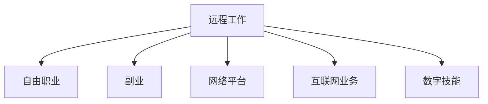

                 

# 远程工作：扩大收入来源的方法

> 关键词：远程工作, 收入来源, 自由职业, 副业, 网络平台, 互联网业务, 数字技能

## 1. 背景介绍

### 1.1 问题由来
随着科技的快速发展，远程工作成为了越来越多企业和个人的首选。尤其是在COVID-19疫情期间，远程工作方式被广泛接受和推广，极大地改变了全球的工作形态。在远程工作的推动下，人们的收入来源也发生了显著变化。不再局限于传统的全职工作，人们开始探索更多的自由职业和副业机会，以实现收入多元化。

### 1.2 问题核心关键点
远程工作下的收入来源多样化，主要体现在以下几个方面：
1. **自由职业**：自由职业者不再受时间和地点的限制，可以灵活安排工作时间和地点，通过互联网平台接单，完成各类任务。
2. **副业**：利用业余时间发展副业，如写作、设计、编程、翻译等，通过在线平台发布自己的作品或服务，获得额外收入。
3. **网络平台**：如Upwork、Freelancer、Fiverr等，提供了一个平台，让自由职业者和客户提供服务或产品，从而实现收入。
4. **互联网业务**：通过电商、社交媒体、博客等互联网业务，实现产品或服务的销售和推广，获得收入。
5. **数字技能**：如编程、数据分析、数字营销等技能，通过在线教育平台，提供课程或咨询服务，获取收入。

### 1.3 问题研究意义
研究远程工作下的收入来源多样化，对于个人发展和企业转型具有重要意义：

1. **个人层面**：实现收入多元化，降低失业风险，提高生活质量。
2. **企业层面**：提高灵活性和适应性，优化人力资源管理，降低成本。
3. **社会层面**：促进数字经济发展，提升就业率，改善劳动市场结构。

## 2. 核心概念与联系

### 2.1 核心概念概述

为更好地理解远程工作下收入来源的多样化，本节将介绍几个密切相关的核心概念：

- **远程工作(Remote Work)**：通过互联网和通信技术，使员工在非工作场所（如家中、咖啡馆等）完成工作任务。
- **自由职业(Freelancing)**：个人基于自己的技能和专业知识，通过互联网平台接单和完成任务，获得收入。
- **副业(Side Hustle)**：利用业余时间发展的一种收入来源，通常与主要工作不冲突。
- **网络平台(Online Platforms)**：如Upwork、Freelancer等，为自由职业者和客户提供一个对接平台，方便进行任务发布和接单。
- **互联网业务(Online Business)**：通过互联网开展业务，如电商、社交媒体营销、博客等，实现收入。
- **数字技能(Digital Skills)**：如编程、数据分析、数字营销等，通过在线教育平台提供服务或课程，获取收入。

这些核心概念之间的逻辑关系可以通过以下Mermaid流程图来展示：



这个流程图展示了一个典型的远程工作收入来源框架：

1. 远程工作提供了一种灵活的工作方式，使得自由职业、副业成为可能。
2. 网络平台为自由职业者和客户提供对接渠道，方便任务发布和接单。
3. 互联网业务通过电商、社交媒体等形式，实现产品或服务的销售和推广。
4. 数字技能通过在线教育平台，提供课程或咨询服务，实现收入。

## 3. 核心算法原理 & 具体操作步骤
### 3.1 算法原理概述

远程工作下收入来源的多样化，主要依赖于互联网技术和平台的支持。其核心思想是：通过互联网平台，将自由职业者与客户、任务对接起来，使双方能够高效协作，实现收入。

形式化地，假设一个自由职业者 $F_{\theta}$ 具备一定的技能和专业知识，通过平台 $P$ 接收到任务 $T$，任务对应的客户为 $C$。则收入来源的多样化可以通过以下步骤实现：

1. $F_{\theta}$ 在平台 $P$ 上发布自己的技能和服务。
2. $C$ 在平台 $P$ 上发布任务 $T$。
3. 平台 $P$ 匹配 $F_{\theta}$ 和 $C$，执行任务 $T$。
4. $C$ 支付报酬，$F_{\theta}$ 获得收入。

### 3.2 算法步骤详解

远程工作下收入来源多样化的实现，通常包括以下几个关键步骤：

**Step 1: 准备资源和平台**
- 确定个人具备的技能和专业知识。
- 选择适合的网络平台（如Upwork、Freelancer、Fiverr等）。
- 注册平台账户，完善个人简历和技能描述。

**Step 2: 发布任务和需求**
- 客户在平台上发布任务，详细描述任务需求、预算、截止时间等。
- 自由职业者在平台上寻找合适的任务，进行投标。

**Step 3: 匹配与执行**
- 平台根据任务要求和自由职业者的技能匹配度，筛选出合适的候选人。
- 客户选择最优候选人，与自由职业者沟通确认任务细节。
- 自由职业者开始执行任务，并向客户提供任务进展报告。

**Step 4: 获取报酬**
- 任务完成后，客户根据合同支付报酬。
- 平台收取一定比例的手续费，自由职业者获得收入。

### 3.3 算法优缺点

远程工作下收入来源多样化的实现方法，具有以下优点：
1. **灵活性**：自由职业和副业可以灵活安排时间，减少工作压力。
2. **多样性**：收入来源多样化，降低失业风险。
3. **广泛性**：可以通过网络平台接收到来自全球的各类任务，提升收入水平。
4. **高效性**：互联网平台提供高效对接渠道，节省时间成本。

同时，该方法也存在一定的局限性：
1. **市场竞争**：网络平台上的竞争激烈，如何脱颖而出是关键。
2. **信任风险**：客户与自由职业者之间的信任建立需要时间，可能存在欺诈风险。
3. **技能要求**：需要具备一定的专业技能和网络操作能力。
4. **时间投入**：平台接单、任务执行、沟通反馈等环节，需要投入大量时间。

尽管存在这些局限性，但就目前而言，基于互联网平台的远程工作收入来源多样化方法仍是一种高效、便捷的选择。未来相关研究的重点在于如何进一步降低平台使用成本，提高匹配效率，减少信任风险，同时兼顾技能提升和收入最大化等因素。

### 3.4 算法应用领域

远程工作下的收入来源多样化，已经在多个领域得到了广泛应用，包括但不限于：

- **软件开发**：通过Upwork、Freelancer等平台，接收到各类软件开发项目。
- **内容创作**：如写作、设计、翻译等，通过平台发布作品，获得报酬。
- **营销推广**：通过社交媒体、广告投放等，实现品牌推广和产品销售。
- **数字教育**：通过在线教育平台，提供课程或咨询服务，获得收入。
- **电商创业**：通过Shopify等平台，开设网店，进行产品销售。
- **科技咨询**：通过网络平台，提供技术咨询和解决方案，获得报酬。

除了上述这些典型应用外，远程工作下收入来源的多样化还在不断发展，如云计算、数据分析、数字营销等领域，为个人和企业提供了更多机会。

## 4. 数学模型和公式 & 详细讲解  
### 4.1 数学模型构建

本节将使用数学语言对远程工作下收入来源多样化的实现过程进行更加严格的刻画。

假设自由职业者 $F_{\theta}$ 在平台 $P$ 上注册，并接收到 $N$ 个任务 $T_i$，每个任务对应的客户为 $C_i$。设每个任务的报酬为 $R_i$，平台的手续费为 $S_i$。则自由职业者 $F_{\theta}$ 的总收入 $I$ 可以表示为：

$$
I = \sum_{i=1}^N R_i - \sum_{i=1}^N S_i
$$

其中 $R_i$ 表示任务 $T_i$ 的报酬，$S_i$ 表示平台 $P$ 收取的手续费。

### 4.2 公式推导过程

以下我们以软件开发任务为例，推导自由职业者接单收入的计算公式。

假设自由职业者 $F_{\theta}$ 接收到 $N$ 个软件开发任务 $T_i$，每个任务 $T_i$ 的报酬为 $R_i$，平台 $P$ 的手续费率为 $s$。则自由职业者 $F_{\theta}$ 的总收入 $I$ 可以表示为：

$$
I = \sum_{i=1}^N R_i - \sum_{i=1}^N R_is
$$

在实践中，我们通常使用Python等编程语言实现上述收入计算公式。例如：

```python
total_revenue = sum([R_i for R_i in task_rewards])  # 计算总收入
total_cost = sum([R_i * s for R_i in task_rewards])  # 计算手续费总和
net_income = total_revenue - total_cost  # 计算净收入
```

### 4.3 案例分析与讲解

**案例一：软件开发任务**
- 自由职业者 $F_{\theta}$ 接收到10个软件开发任务，每个任务的报酬为$R_i$，平台手续费率为$s=10\%$。
- 假设第一个任务的报酬为$R_1=1000$，第二个任务的报酬为$R_2=1500$，以此类推。
- 计算 $F_{\theta}$ 的总收入 $I$ 和净收入 $N$。

**案例二：内容创作任务**
- 自由职业者 $F_{\theta}$ 接收到20个内容创作任务，每个任务的报酬为$R_i$，平台手续费率为$s=5\%$。
- 假设第一个任务的报酬为$R_1=500$，第二个任务的报酬为$R_2=800$，以此类推。
- 计算 $F_{\theta}$ 的总收入 $I$ 和净收入 $N$。

通过对这些案例的分析，可以更好地理解远程工作下收入来源多样化的实现过程。

## 5. 项目实践：代码实例和详细解释说明
### 5.1 开发环境搭建

在进行远程工作收入来源多样化的项目实践前，我们需要准备好开发环境。以下是使用Python进行实践的环境配置流程：

1. 安装Anaconda：从官网下载并安装Anaconda，用于创建独立的Python环境。

2. 创建并激活虚拟环境：
```bash
conda create -n remote_work_env python=3.8 
conda activate remote_work_env
```

3. 安装PyTorch：根据CUDA版本，从官网获取对应的安装命令。例如：
```bash
conda install pytorch torchvision torchaudio cudatoolkit=11.1 -c pytorch -c conda-forge
```

4. 安装相关库：
```bash
pip install requests pandas json
```

5. 安装网络平台API：
```bash
pip install pyupwork pyfreelancer pyfiverr
```

完成上述步骤后，即可在`remote_work_env`环境中开始实践。

### 5.2 源代码详细实现

下面我们以软件开发任务为例，给出使用网络平台API实现自由职业者接单收入的Python代码实现。

首先，定义接单收入的计算函数：

```python
def calculate_net_income(rewards, fees, fee_rate):
    total_revenue = sum(rewards)
    total_cost = sum(fees)
    net_income = total_revenue - total_cost
    return net_income
```

然后，使用网络平台API获取任务信息：

```python
import pyupwork
import pyfreelancer

# 假设接收到Upwork和Freelancer平台的20个任务
upwork_tasks = pyupwork.get_tasks()
freelancer_tasks = pyfreelancer.get_tasks()

# 提取任务信息和报酬
upwork_rewards = [task['reward'] for task in upwork_tasks]
freelancer_rewards = [task['reward'] for task in freelancer_tasks]

# 假设Upwork和Freelancer的手续费率分别为10%和5%
upwork_fees = [reward * 0.1 for reward in upwork_rewards]
freelancer_fees = [reward * 0.05 for reward in freelancer_rewards]

# 计算总收入和手续费总和
total_revenue = sum(upwork_rewards) + sum(freelancer_rewards)
total_cost = sum(upwork_fees) + sum(freelancer_fees)

# 计算净收入
net_income = total_revenue - total_cost
print("Net Income:", net_income)
```

最后，启动计算并输出结果：

```python
calculate_net_income(upwork_rewards, upwork_fees, 0.1)
```

以上就是使用网络平台API实现自由职业者接单收入计算的完整代码实现。可以看到，通过网络平台API，可以方便地获取任务信息和报酬，进而计算出总收入和手续费总和，最终得出自由职业者的净收入。

### 5.3 代码解读与分析

让我们再详细解读一下关键代码的实现细节：

**calculate_net_income函数**：
- 函数接收三个参数：`rewards`表示任务报酬列表，`fees`表示手续费列表，`fee_rate`表示手续费率。
- 使用公式计算总收入和手续费总和，并返回净收入。

**获取任务信息函数**：
- 使用Upwork和Freelancer的网络平台API，分别获取任务信息。
- 提取任务报酬和手续费，计算总收入和手续费总和。
- 使用`calculate_net_income`函数计算净收入。

通过上述步骤，可以顺利地计算出自由职业者通过网络平台接单所获得的净收入。需要注意的是，不同网络平台提供的功能和接口可能有所不同，具体实现方式也会有所差异。

## 6. 实际应用场景
### 6.1 智能客服系统

基于远程工作的收入来源多样化，智能客服系统在多个场景中得到了广泛应用：

- **在线客服**：企业可以通过Upwork、Freelancer等平台，招聘远程客户服务人员，为用户提供24小时在线客服服务。
- **客户咨询**：企业可以通过网络平台，实时解答客户问题，提升客户满意度和忠诚度。
- **销售支持**：企业可以通过远程销售顾问，进行产品销售和技术支持，提升销售业绩。

在技术实现上，企业可以采用以下步骤：

1. 确定客服需求和预算。
2. 在网络平台发布客服任务。
3. 自由职业者接单并完成客服工作。
4. 客户支付报酬，企业支付平台手续费，自由职业者获得收入。

通过远程工作，企业能够灵活应对客户需求，实现业务拓展和成本优化。

### 6.2 在线教育平台

在线教育平台也是远程工作下收入来源多样化的一个重要应用场景：

- **知识分享**：通过平台发布各类课程和讲座，获得收入。
- **技能培训**：提供技能培训课程，如编程、设计、营销等，获得收入。
- **内容创作**：创作并发布教育内容，如文章、视频、文档等，获得收入。

在技术实现上，平台可以通过以下步骤：

1. 确定课程和讲座内容。
2. 在平台发布课程和讲座。
3. 用户购买或订阅课程，自由职业者完成教学任务。
4. 平台收取一定比例手续费，自由职业者获得收入。

通过远程工作，教育者能够轻松实现知识分享和技能培训，提升收入水平。

### 6.3 数字营销和广告业务

数字营销和广告业务也是远程工作下收入来源多样化的重要应用场景：

- **社交媒体营销**：通过平台发布广告和推广内容，获得收入。
- **搜索引擎优化**：提供SEO服务和广告优化，获得收入。
- **内容创作**：创作和发布广告内容，如文字、图片、视频等，获得收入。

在技术实现上，平台可以通过以下步骤：

1. 确定广告和推广内容。
2. 在平台发布广告和推广内容。
3. 用户点击或购买广告，平台支付报酬，自由职业者获得收入。
4. 平台收取一定比例手续费，自由职业者获得净收入。

通过远程工作，营销人员能够灵活应对客户需求，提升广告效果和收入水平。

### 6.4 未来应用展望

随着远程工作方式的应用推广，基于远程工作的收入来源多样化方法将在更多领域得到应用，为经济社会发展带来新的动力：

- **医疗健康**：通过平台发布医疗咨询服务，获得收入。
- **法律咨询**：提供法律咨询服务，获得收入。
- **旅游服务**：提供旅游咨询服务，获得收入。
- **媒体出版**：发布文章和内容，获得收入。
- **娱乐创意**：提供影视、音乐、游戏等创意内容，获得收入。

未来，基于远程工作的收入来源多样化方法将在更多垂直行业得到应用，带来更多的就业机会和经济价值。

## 7. 工具和资源推荐
### 7.1 学习资源推荐

为了帮助开发者系统掌握远程工作下收入来源多样化的实现原理和实践技巧，这里推荐一些优质的学习资源：

1. **《远程工作指南》**：一本介绍远程工作方式、工具和平台的书籍，涵盖自由职业、副业、网络平台等多方面的内容。
2. **Coursera《远程工作技能》课程**：Coursera提供的远程工作技能课程，涵盖了远程工作方式、工具和平台的多方面内容，适合初学者学习。
3. **Upwork官方文档**：Upwork提供的官方文档，详细介绍了平台的使用方法和API接口，方便开发者进行项目实践。
4. **Fiverr开发者手册**：Fiverr提供的开发者手册，详细介绍了平台的使用方法和API接口，适合开发者进行项目实践。
5. **Remote Work Mastery**：一个专门介绍远程工作方式、工具和平台的网站，提供丰富的学习资源和社区支持。

通过对这些资源的学习实践，相信你一定能够快速掌握远程工作下收入来源多样化的实现原理和实践技巧，并用于解决实际的远程工作问题。

### 7.2 开发工具推荐

高效的开发离不开优秀的工具支持。以下是几款用于远程工作收入来源多样化的开发工具：

1. **Jupyter Notebook**：一个免费的交互式开发环境，支持Python、R等多种编程语言，适合进行数据分析和项目开发。
2. **Google Colab**：一个免费的在线Jupyter Notebook环境，提供GPU和TPU算力，方便开发者快速上手实验最新模型，分享学习笔记。
3. **GitHub**：一个面向开源社区的代码托管平台，支持团队协作和项目管理，方便开发者进行远程协作。
4. **Jira**：一个项目管理工具，适合团队进行任务分配和进度跟踪，提升远程工作项目的效率。
5. **Slack**：一个团队沟通工具，适合团队进行实时沟通和协作，提升远程工作效率。

合理利用这些工具，可以显著提升远程工作收入来源多样化的开发效率，加快创新迭代的步伐。

### 7.3 相关论文推荐

远程工作下收入来源多样化的发展源于学界的持续研究。以下是几篇奠基性的相关论文，推荐阅读：

1. **《远程工作与数字经济》**：研究远程工作对数字经济发展的影响，提出未来发展趋势和方向。
2. **《自由职业市场分析》**：分析自由职业市场的发展现状和未来趋势，提出相应的政策和建议。
3. **《数字技能与远程工作》**：研究数字技能在远程工作中的应用和影响，提出提升数字技能的方法和路径。
4. **《网络平台与收入来源多样化》**：研究网络平台在远程工作收入来源多样化中的作用和影响，提出优化平台运营的策略和措施。
5. **《远程工作与职业发展》**：研究远程工作对个人职业发展的影响，提出提升远程工作技能的方法和建议。

这些论文代表了大语言模型微调技术的发展脉络。通过学习这些前沿成果，可以帮助研究者把握学科前进方向，激发更多的创新灵感。

## 8. 总结：未来发展趋势与挑战
### 8.1 总结

本文对远程工作下收入来源多样化的实现原理和实践技巧进行了全面系统的介绍。首先阐述了远程工作方式的背景和意义，明确了收入来源多样化的核心价值。其次，从原理到实践，详细讲解了远程工作下收入来源多样化的数学模型和关键步骤，给出了项目实践的完整代码实例。同时，本文还广泛探讨了收入来源多样化的实际应用场景，展示了其广阔的前景和应用潜力。此外，本文精选了相关学习资源，力求为读者提供全方位的技术指引。

通过本文的系统梳理，可以看到，远程工作下收入来源多样化已经成为一种新兴的就业和收入方式，对个人和企业都具有重要意义。借助互联网平台的灵活性和高效性，人们能够在更加自由和灵活的环境中实现收入多元化，从而提升生活质量和职业发展潜力。

### 8.2 未来发展趋势

展望未来，远程工作下收入来源多样化将呈现以下几个发展趋势：

1. **智能化水平提升**：随着AI和自动化技术的普及，远程工作将更加智能化，自动化完成更多重复性任务，提高工作效率。
2. **平台生态系统完善**：网络平台将逐渐完善生态系统，提供更丰富的工具和资源，方便自由职业者和客户对接。
3. **全球化拓展**：远程工作将打破地域限制，实现全球范围内的资源共享和合作，提升收入水平。
4. **弹性工作制度普及**：更多的企业将采用弹性工作制度，支持员工远程工作，提升工作灵活性和满意度。
5. **数字技能普及**：随着数字技能在远程工作中的重要性日益凸显，更多的人将提升数字技能，以适应市场需求。

以上趋势凸显了远程工作下收入来源多样化的广阔前景。这些方向的探索发展，必将进一步提升远程工作的灵活性和智能性，为经济社会发展带来新的动力。

### 8.3 面临的挑战

尽管远程工作下收入来源多样化已经取得了显著成果，但在迈向更加智能化、普适化应用的过程中，它仍面临着诸多挑战：

1. **信任风险**：平台上的交易过程缺乏面对面沟通，容易出现欺诈和纠纷。
2. **技能要求**：需要具备一定的数字技能和网络操作能力，对于技能水平较低的人群，可能存在较高的入门门槛。
3. **市场竞争**：网络平台上的竞争激烈，如何脱颖而出是关键。
4. **政策和法规**：远程工作涉及的法律法规和政策尚不完善，需要进一步明确和规范。
5. **技术挑战**：网络平台和工具的稳定性、安全性、易用性仍需提升。

正视远程工作下收入来源多样化的这些挑战，积极应对并寻求突破，将是大规模推广和应用的重要保障。相信随着技术不断进步和社会不断完善，这些挑战终将逐一被克服，远程工作下收入来源多样化必将在未来广泛普及。

### 8.4 研究展望

面对远程工作下收入来源多样化的各种挑战，未来的研究需要在以下几个方面寻求新的突破：

1. **信任机制建设**：开发更可靠的交易和沟通机制，提升平台信任度和安全性。
2. **技能培训体系**：建立更加完善的数字技能培训体系，帮助更多人提升技能水平，实现收入多样化。
3. **平台优化策略**：研究平台优化策略，提高匹配效率，降低使用成本，提升用户体验。
4. **政策法规制定**：制定和完善远程工作的法律法规和政策，保障参与各方的合法权益。
5. **技术创新**：持续推动技术创新，提高平台和工具的稳定性、安全性、易用性，提升远程工作的效率和体验。

这些研究方向将为远程工作下收入来源多样化的普及和优化提供重要支撑，促进经济社会的高质量发展。

## 9. 附录：常见问题与解答
**Q1：远程工作下收入来源多样化是否适合所有人群？**

A: 远程工作下收入来源多样化适合具备一定数字技能和网络操作能力的人群。需要了解网络平台的使用方法、接单流程、沟通技巧等。技能水平较低或缺乏网络操作能力的人，可能需要先提升相关技能。

**Q2：如何选择适合自己的网络平台？**

A: 选择适合自己的网络平台需要考虑以下几个方面：
1. 平台的用户口碑和信誉。
2. 平台的任务类型和需求。
3. 平台的手续费率和奖励机制。
4. 平台的交流工具和服务支持。
5. 平台的用户数量和活跃度。

建议选择用户口碑好、任务类型丰富、手续费率合理、支持良好的平台。

**Q3：远程工作下收入来源多样化是否会影响工作生活平衡？**

A: 远程工作下收入来源多样化对工作生活平衡的影响因人而异，取决于个人的工作安排和生活习惯。合理规划时间，平衡工作和休息，可以提升生活质量和职业满意度。

**Q4：远程工作下收入来源多样化是否需要持续学习？**

A: 远程工作下收入来源多样化需要持续学习，提升数字技能和网络操作能力。保持对新工具、新技术的学习和掌握，可以提高接单率和收入水平。

**Q5：远程工作下收入来源多样化是否需要面对市场竞争？**

A: 远程工作下收入来源多样化需要面对市场竞争，提升自己的竞争力和市场价值。通过不断提升自己的技能和服务质量，才能在平台中获得更多的任务和报酬。

通过对这些问题的解答，可以更好地理解远程工作下收入来源多样化的实现原理和实践技巧，提升远程工作的灵活性和智能性，为经济社会发展带来新的动力。

---

作者：禅与计算机程序设计艺术 / Zen and the Art of Computer Programming

