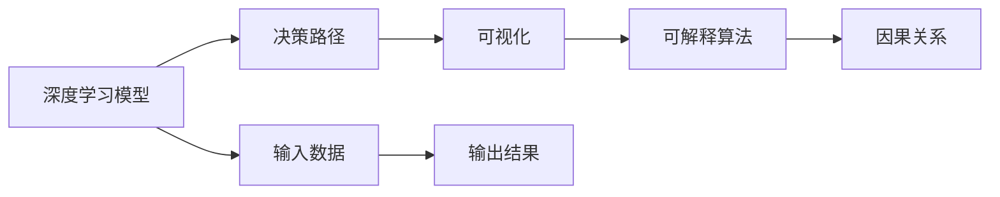

                 

# 透明度与可解释性：增强人工智能的可信

> 关键词：人工智能可信性,透明度,可解释性,深度学习模型,决策路径,可视化,可解释算法,因果关系

## 1. 背景介绍

### 1.1 问题由来

随着深度学习技术的飞速发展，人工智能在众多领域取得了卓越的成果。从自动驾驶到医疗诊断，从金融风控到自然语言处理，AI系统的应用范围日益广泛。然而，AI系统的复杂性也带来了一定的挑战，特别是在透明度和可解释性方面。

透明度和可解释性是人工智能可信性的关键要素，它们不仅决定了AI系统的决策是否合理，还直接影响到系统在实际应用中的可信度和可靠性。例如，医疗诊断系统需要医生能够理解AI系统如何得出诊断结果，金融风险评估系统需要投资者能够明白AI模型基于何种数据和逻辑进行预测，自然语言处理系统需要用户能够理解AI生成内容的来源和依据。

### 1.2 问题核心关键点

1. **透明度（Transparency）**：是指AI系统的决策过程是否可理解，是否能够被他人复现。透明的AI系统能够让人信服地信任其决策。
2. **可解释性（Explainability）**：是指AI系统能够向用户清晰解释其决策过程和依据。可解释性不仅包括系统输出的解释，还涉及如何解释其内部逻辑和决策路径。
3. **可信性（Trustworthiness）**：是指AI系统的决策是否可靠、稳健，是否能够在复杂环境和不确定性条件下持续正确地工作。可信性是透明度和可解释性共同作用的结果。

透明度、可解释性和可信性构成了AI系统可信性的核心要素，但在实际应用中，它们往往是一对矛盾的组合。在追求系统性能的同时，如何兼顾这些要素，成为了学术界和工业界的热点问题。

### 1.3 问题研究意义

研究AI系统的透明度和可解释性，对于构建可信、可靠的人工智能系统，具有重要意义：

1. **提升决策质量**：透明度和可解释性使得决策过程更加透明，减少人为干预，提升决策质量。
2. **增强用户信任**：可解释的AI系统能够清晰地向用户展示其决策依据，增强用户对系统的信任感。
3. **促进创新应用**：透明的AI系统便于开发者理解和调试，促进技术创新和新应用的拓展。
4. **保障伦理和法律**：可解释的AI系统便于对决策过程进行审查和监控，符合伦理和法律要求。

透明度和可解释性的研究不仅具有理论价值，还在现实应用中具有广阔的前景，为AI技术在各个行业中的应用提供了重要保障。

## 2. 核心概念与联系

### 2.1 核心概念概述

在探讨透明度和可解释性的过程中，我们需要理解以下几个核心概念：

1. **深度学习模型（Deep Learning Model）**：以神经网络为代表的深度学习模型，是当前AI系统中广泛采用的核心技术。这些模型通过大量数据进行训练，能够自动学习特征，并作出复杂决策。

2. **决策路径（Decision Path）**：指的是AI模型在处理输入数据时，从输入到输出所经过的计算过程和逻辑。理解决策路径是分析模型行为和提升可解释性的关键。

3. **可视化（Visualization）**：通过图形、图表等方式，将模型内部的特征、参数和计算过程直观地展示出来，使得决策过程更加透明和可理解。

4. **可解释算法（Explainable Algorithms）**：能够生成对模型决策过程的解释，并提供直观的解释方式，使得决策过程更加透明和可信。

5. **因果关系（Causal Relationship）**：在理解模型决策时，需要明确输入和输出之间的因果关系，确保模型能够根据正确的原因作出合理的决策。

这些核心概念相互关联，共同构成了AI系统透明度和可解释性的研究框架。

### 2.2 核心概念原理和架构的 Mermaid 流程图



这个流程图展示了深度学习模型、决策路径、可视化、可解释算法和因果关系之间的逻辑关系：

1. 深度学习模型接收输入数据，通过计算过程得到输出结果。
2. 决策路径描述了从输入到输出的计算过程和逻辑。
3. 可视化将决策路径和中间特征直观展示出来，增强透明度。
4. 可解释算法生成对决策过程的解释，提升可解释性。
5. 因果关系揭示输入和输出之间的因果关系，确保决策的合理性。

这些概念和流程互为支撑，共同构成了一个完整的AI系统可信性研究框架。

## 3. 核心算法原理 & 具体操作步骤

### 3.1 算法原理概述

透明度和可解释性的研究，主要集中在如何通过算法手段，提升AI系统的决策透明度和解释能力。常见的算法包括：

1. **LIME（Local Interpretable Model-agnostic Explanations）**：通过生成局部模型来解释全局模型的决策。
2. **SHAP（SHapley Additive exPlanations）**：基于博弈论的SHAP值，解释模型决策的贡献程度。
3. **GD（Gradient-based Debugging）**：通过梯度信息，揭示模型在特定样本上的错误决策原因。
4. **CA（Causal Analysis）**：通过因果推断技术，揭示模型决策的因果链路。
5. **DA（Decision Analysis）**：通过决策树等模型，提供决策过程的可视化。

这些算法通过不同的原理和方式，实现了对AI系统决策过程的解释和可视化，提升了系统的透明度和可解释性。

### 3.2 算法步骤详解

以下以LIME算法为例，详细讲解其具体操作步骤：

**Step 1: 选择局部模型**
- 选择一个简单的局部模型（如线性回归、决策树），用于生成输入数据的局部解释。

**Step 2: 生成局部模型**
- 对于每个输入样本，在局部模型中使用K个最接近的数据点进行训练，生成局部解释。

**Step 3: 计算局部权重**
- 计算每个数据点对局部模型的贡献，即SHAP值。

**Step 4: 组合局部解释**
- 将各个数据点的SHAP值组合起来，得到对全局模型的解释。

**Step 5: 可视化解释**
- 将解释结果可视化，以图形方式展示输入数据与输出结果之间的联系。

### 3.3 算法优缺点

LIME算法在透明度和可解释性方面具有以下优点：
1. 适用于各种类型的深度学习模型，具有很好的通用性。
2. 能够生成局部解释，解释能力较强。
3. 可视化效果好，直观易懂。

同时，LIME算法也存在以下缺点：
1. 计算复杂度较高，需要训练多个局部模型。
2. 局部模型的选择可能影响解释结果的准确性。
3. 解释结果的局部性和全局性之间存在矛盾，难以兼顾。

### 3.4 算法应用领域

透明度和可解释性算法广泛应用于多个领域，如医疗诊断、金融风控、自然语言处理等。以下是几个典型的应用场景：

1. **医疗诊断**：在医疗诊断系统中，透明度和可解释性能够帮助医生理解AI系统的诊断依据，提升诊断的准确性和可信度。例如，可以使用LIME算法生成局部解释，展示AI系统如何依据病历信息作出诊断。

2. **金融风控**：在金融风控系统中，透明度和可解释性能够帮助投资者理解AI模型的风险预测依据，增强对系统的信任感。例如，可以使用SHAP值解释模型对信用风险的预测，揭示每个特征对预测结果的贡献。

3. **自然语言处理**：在自然语言处理系统中，透明度和可解释性能够帮助用户理解AI系统如何生成文本或提供翻译结果，提升系统的可信度。例如，可以使用GD算法揭示AI系统在特定句式或语境下的错误原因。

透明度和可解释性算法的广泛应用，为AI技术在各个领域的应用提供了重要保障。

## 4. 数学模型和公式 & 详细讲解 & 举例说明

### 4.1 数学模型构建

透明度和可解释性算法的研究，主要集中在如何通过数学模型和公式，解释深度学习模型的决策过程。以下是几个典型的数学模型：

1. **LIME模型**：LIME模型通过生成局部模型来解释全局模型，其数学模型如下：

   $$
   f(x) \approx \sum_{i=1}^{K} \alpha_i f_{\text{local}}(x_i) + b
   $$

   其中，$f(x)$ 表示全局模型对输入 $x$ 的预测结果，$f_{\text{local}}(x_i)$ 表示局部模型对数据点 $x_i$ 的预测结果，$\alpha_i$ 表示局部模型对全局模型的权重，$b$ 表示偏置项。

2. **SHAP值模型**：SHAP值模型基于博弈论，计算每个特征对模型预测的贡献，其数学模型如下：

   $$
   \text{Shapley Value}(X) = \sum_{i=1}^{n} \left[ \sum_{k=1}^{m} \left( \frac{k}{m} \left( \frac{m-1}{m-1-k} \right) \prod_{j \neq i} \frac{m-j}{m-1} \right) \right]
   $$

   其中，$X$ 表示特征向量，$n$ 表示特征数量，$m$ 表示数据集大小，$k$ 表示特征在数据集中的位置。

3. **GD算法**：GD算法通过梯度信息，揭示模型在特定样本上的错误决策原因，其数学模型如下：

   $$
   \frac{\partial f(x)}{\partial x_i} = \sum_{j=1}^{m} \frac{\partial f(x_j)}{\partial x_i} \delta(x_j - x_i)
   $$

   其中，$f(x)$ 表示模型对输入 $x$ 的预测结果，$\frac{\partial f(x)}{\partial x_i}$ 表示模型对输入的第 $i$ 个特征的偏导数，$\delta(x_j - x_i)$ 表示输入样本 $x_i$ 和 $x_j$ 之间的差异。

这些数学模型和公式，为透明度和可解释性算法提供了理论基础和计算方法。

### 4.2 公式推导过程

以LIME模型为例，其推导过程如下：

1. 假设全局模型 $f(x)$ 表示输入 $x$ 的预测结果，局部模型 $f_{\text{local}}(x_i)$ 表示数据点 $x_i$ 的预测结果。

2. 对于每个输入样本 $x$，在局部模型中使用K个最接近的数据点进行训练，得到局部解释 $f_{\text{local}}(x_i)$。

3. 计算每个数据点 $x_i$ 对局部模型的贡献，即SHAP值 $\alpha_i$。

4. 将各个数据点的SHAP值组合起来，得到对全局模型的解释：

   $$
   f(x) \approx \sum_{i=1}^{K} \alpha_i f_{\text{local}}(x_i) + b
   $$

5. 将解释结果可视化，得到图形化的解释。

通过以上推导，可以看到LIME算法通过生成局部模型和计算SHAP值，实现了对全局模型的解释和可视化。

### 4.3 案例分析与讲解

假设有一个医疗诊断系统，使用深度学习模型对患者病历进行诊断。使用LIME算法生成局部解释，展示AI系统如何依据病历信息作出诊断。

1. **选择局部模型**：选择线性回归作为局部模型。

2. **生成局部模型**：对于每个病历样本，在局部模型中使用K个最接近的病历数据点进行训练，生成局部解释。

3. **计算局部权重**：计算每个病历数据点对局部模型的贡献，即SHAP值。

4. **组合局部解释**：将各个病历数据点的SHAP值组合起来，得到对全局模型的解释。

5. **可视化解释**：将解释结果可视化，以图形方式展示病历信息与诊断结果之间的联系。

例如，在病历样本 $x$ 上，LIME算法生成的局部解释如下：

```
- 病历信息：年龄、性别、血压、血糖、心电图等。
- 局部模型：年龄和血压的线性关系。
- SHAP值：年龄和血压对诊断结果的贡献。
- 组合解释：年龄和血压共同决定了诊断结果。
- 可视化解释：通过图形展示病历信息与诊断结果之间的联系。
```

通过这种解释方式，医生能够清楚地理解AI系统的决策依据，提升诊断的准确性和可信度。

## 5. 项目实践：代码实例和详细解释说明

### 5.1 开发环境搭建

在进行透明度和可解释性算法实践前，我们需要准备好开发环境。以下是使用Python进行Scikit-learn开发的常见环境配置流程：

1. 安装Anaconda：从官网下载并安装Anaconda，用于创建独立的Python环境。

2. 创建并激活虚拟环境：
```bash
conda create -n expl_env python=3.8 
conda activate expl_env
```

3. 安装Scikit-learn：
```bash
pip install scikit-learn
```

4. 安装TensorBoard：用于可视化算法模型的训练过程和结果。

5. 安装Jupyter Notebook：方便进行算法实验和代码调试。

完成上述步骤后，即可在`expl_env`环境中开始实践。

### 5.2 源代码详细实现

以下是使用Scikit-learn对LIME算法进行实现的Python代码：

```python
from sklearn.model_selection import train_test_split
from sklearn.datasets import make_classification
from sklearn.linear_model import LogisticRegression
from sklearn.metrics import accuracy_score
from lime import LimeTabularExplainer

# 构建示例数据集
X, y = make_classification(n_samples=1000, n_features=5, n_informative=3, random_state=42)
X_train, X_test, y_train, y_test = train_test_split(X, y, test_size=0.2, random_state=42)

# 训练模型
clf = LogisticRegression()
clf.fit(X_train, y_train)

# 初始化LIME解释器
explainer = LimeTabularExplainer(X_train, clf.predict_proba, feature_names=['feature_0', 'feature_1', 'feature_2', 'feature_3', 'feature_4'])

# 生成局部解释
explanations = explainer.explain_instance(X_test[0], clf.predict_proba)

# 打印解释结果
print(explanations)
```

### 5.3 代码解读与分析

让我们再详细解读一下关键代码的实现细节：

1. **构建示例数据集**：使用Scikit-learn的`make_classification`函数生成一个包含5个特征的分类数据集。

2. **训练模型**：使用Logistic回归模型对数据集进行训练。

3. **初始化LIME解释器**：使用LIME库的`LimeTabularExplainer`类初始化解释器，设置输入数据集和模型。

4. **生成局部解释**：使用`explain_instance`方法对单个测试样本生成局部解释。

5. **打印解释结果**：打印LIME解释器生成的局部解释。

通过以上代码实现，可以看到LIME算法的详细步骤：

1. 使用LIME解释器，对测试样本生成局部模型。
2. 计算每个特征对局部模型的贡献，即SHAP值。
3. 组合局部解释，生成对全局模型的解释。
4. 可视化解释结果，展示输入数据与输出结果之间的联系。

## 6. 实际应用场景

### 6.1 医疗诊断

透明度和可解释性在医疗诊断系统中具有重要意义。传统的医疗诊断依赖医生手动分析病历数据，耗时长且容易出错。使用透明度和可解释性算法，可以自动生成病历数据的解释，帮助医生快速作出诊断决策。

例如，在医学影像分析中，透明度和可解释性算法可以揭示AI系统如何根据影像特征作出诊断，提升诊断的准确性和可信度。

### 6.2 金融风控

金融风控系统中，透明度和可解释性能够帮助投资者理解AI模型的风险预测依据，增强对系统的信任感。例如，使用SHAP值解释模型对信用风险的预测，揭示每个特征对预测结果的贡献，帮助投资者识别风险因素。

### 6.3 自然语言处理

在自然语言处理系统中，透明度和可解释性能够帮助用户理解AI系统如何生成文本或提供翻译结果，提升系统的可信度。例如，使用GD算法揭示AI系统在特定句式或语境下的错误原因，帮助开发者调试和优化系统。

### 6.4 未来应用展望

透明度和可解释性算法的研究将推动AI技术在更多领域的应用，为系统可信性提供重要保障。

1. **医疗诊断**：透明度和可解释性算法能够帮助医生理解AI系统的诊断依据，提升诊断的准确性和可信度。未来，AI将更多地应用于临床决策支持系统，辅助医生进行复杂的诊断和治疗。

2. **金融风控**：透明度和可解释性算法能够帮助投资者理解AI模型的风险预测依据，增强对系统的信任感。未来，AI将更多地应用于风险评估和投资决策支持系统。

3. **自然语言处理**：透明度和可解释性算法能够帮助用户理解AI系统如何生成文本或提供翻译结果，提升系统的可信度。未来，AI将更多地应用于智能客服、翻译和摘要系统。

4. **智能制造**：透明度和可解释性算法能够帮助生产管理者理解AI系统的质量预测依据，提升生产过程的可靠性和效率。未来，AI将更多地应用于智能制造和供应链管理系统。

总之，透明度和可解释性算法的研究将为AI技术在各个领域的应用提供重要保障，推动AI技术的广泛落地和产业化进程。

## 7. 工具和资源推荐

### 7.1 学习资源推荐

为了帮助开发者系统掌握透明度和可解释性算法的理论基础和实践技巧，这里推荐一些优质的学习资源：

1. **《深度学习解释性》系列书籍**：深入浅出地介绍了深度学习模型的解释性方法和技术，适合初学者和中级开发者阅读。

2. **Coursera深度学习课程**：由斯坦福大学开设的深度学习课程，包括多个相关主题，如可解释性、因果推断等，内容全面系统。

3. **LIME官方文档**：LIME算法的官方文档，详细介绍了算法的原理和使用方法，是实践学习的重要参考资料。

4. **Shap库官方文档**：SHAP值的官方文档，详细介绍了Shap值的计算方法和应用场景，是实践学习的重要参考资料。

5. **TensorBoard官方文档**：TensorBoard的官方文档，详细介绍了可视化工具的使用方法和应用场景，是实践学习的重要参考资料。

通过对这些资源的学习实践，相信你一定能够快速掌握透明度和可解释性算法的精髓，并用于解决实际的AI问题。

### 7.2 开发工具推荐

高效的开发离不开优秀的工具支持。以下是几款用于透明度和可解释性算法开发的常用工具：

1. **Scikit-learn**：Python机器学习库，提供了丰富的可解释性算法实现，包括LIME、SHAP、GD等。

2. **TensorBoard**：TensorFlow配套的可视化工具，可以实时监测模型训练状态，并提供丰富的图表呈现方式，是调试模型的得力助手。

3. **LIME**：用于生成局部解释和可视化算法的Python库，支持多种类型的深度学习模型。

4. **SHAP**：用于生成SHAP值的Python库，支持多种类型的深度学习模型。

5. **GD**：用于揭示模型错误原因和优化算法的Python库，支持多种类型的深度学习模型。

合理利用这些工具，可以显著提升透明度和可解释性算法的开发效率，加快创新迭代的步伐。

### 7.3 相关论文推荐

透明度和可解释性算法的研究源于学界的持续研究。以下是几篇奠基性的相关论文，推荐阅读：

1. **LIME算法论文**：LIME算法原论文《A Unified Approach to Interpreting Model Predictions》，提出了LIME算法的原理和实现方法。

2. **SHAP值论文**：SHAP值算法原论文《A Unified Approach to Interpreting Model Predictions》，提出了SHAP值的计算方法和应用场景。

3. **GD算法论文**：GD算法原论文《Gradient-based Debugging of Deep Neural Networks》，提出了梯度调试算法的基本原理和应用方法。

4. **因果推断论文**：因果推断算法原论文《Causal Inference for Dependent and Sparse Data》，提出了因果推断的基本原理和应用方法。

5. **决策树论文**：决策树算法原论文《Decision Trees for Predictive Modeling》，提出了决策树模型的基本原理和应用方法。

这些论文代表了大模型可解释性算法的发展脉络。通过学习这些前沿成果，可以帮助研究者把握学科前进方向，激发更多的创新灵感。

## 8. 总结：未来发展趋势与挑战

### 8.1 研究成果总结

透明度和可解释性算法的理论研究和实践应用，已经取得了显著进展。研究者们通过多种方法，提升了AI系统的决策透明度和解释能力，为AI技术在各个领域的应用提供了重要保障。

### 8.2 未来发展趋势

透明度和可解释性算法的未来发展趋势如下：

1. **模型复杂度提升**：未来，深度学习模型的复杂度将进一步提升，需要更加复杂的解释方法来支持。研究者将探索新的解释技术，如因果推断、符号表示等，提升模型的可解释性。

2. **多模态解释**：未来的解释算法将支持多种模态的数据类型，如文本、图像、音频等，实现多模态数据的协同解释。

3. **自动化解释**：未来的解释算法将更加自动化，能够自动生成解释结果，减少人工干预。例如，使用自然语言生成技术生成解释文本。

4. **实时解释**：未来的解释算法将支持实时解释，能够实时生成解释结果，增强系统的响应速度和用户体验。

5. **跨领域应用**：未来的解释算法将在更多领域得到应用，如医疗、金融、制造等，为不同领域的应用提供重要保障。

### 8.3 面临的挑战

透明度和可解释性算法的研究也面临着诸多挑战：

1. **解释能力的限制**：当前解释算法对复杂模型的解释能力有限，难以解释深层次的决策逻辑。未来的研究需要探索新的解释方法，提升解释的深度和广度。

2. **解释结果的可信性**：解释结果的可信性难以保证，存在误导性解释的风险。未来的研究需要设计更加可靠和稳健的解释方法，确保解释结果的准确性。

3. **解释结果的解释性**：解释结果需要简单易懂，易于用户理解和信任。未来的研究需要探索新的可视化方法，增强解释结果的可理解性。

4. **解释算法的计算开销**：解释算法的计算开销较大，难以在实时系统中应用。未来的研究需要探索高效实现方法，降低计算开销，提升实时解释能力。

5. **解释算法的多样性**：不同的解释算法适用于不同类型的模型和任务。未来的研究需要设计更加通用的解释算法，适应多样化的应用场景。

6. **解释算法的伦理安全性**：解释算法需要符合伦理和安全要求，避免误导性解释和有害信息的传播。未来的研究需要设计更加安全和可靠的理解算法。

这些挑战需要研究者持续努力，探索新的方法和技术，才能提升透明度和可解释性算法的应用效果，推动AI技术的广泛应用。

### 8.4 研究展望

透明度和可解释性算法的研究将不断演进，未来可能出现以下趋势：

1. **多模态解释**：未来的解释算法将支持多种模态的数据类型，如文本、图像、音频等，实现多模态数据的协同解释。

2. **跨领域应用**：未来的解释算法将在更多领域得到应用，如医疗、金融、制造等，为不同领域的应用提供重要保障。

3. **实时解释**：未来的解释算法将支持实时解释，能够实时生成解释结果，增强系统的响应速度和用户体验。

4. **自动化解释**：未来的解释算法将更加自动化，能够自动生成解释结果，减少人工干预。例如，使用自然语言生成技术生成解释文本。

5. **因果推断**：未来的解释算法将更加注重因果推断，揭示输入和输出之间的因果关系，确保模型决策的合理性。

6. **符号表示**：未来的解释算法将更加注重符号表示，揭示模型决策的符号逻辑和因果链路，提升解释结果的可理解性。

总之，透明度和可解释性算法的研究将不断演进，推动AI技术的广泛应用，提升系统的可信性和可靠性，为人机协同的智能系统提供重要保障。

## 9. 附录：常见问题与解答

**Q1：透明度和可解释性算法能否完全替代人工解释？**

A: 透明度和可解释性算法虽然能够自动生成部分解释结果，但难以完全替代人工解释。某些复杂和抽象的决策过程，需要结合人工解释才能理解。因此，透明度和可解释性算法应与人工解释结合使用，共同提升系统的可信性。

**Q2：如何评估解释算法的性能？**

A: 评估解释算法的性能需要考虑多个指标，如解释结果的准确性、可信度、可理解性等。可以使用交叉验证、A/B测试、用户调查等方法，综合评估解释算法的性能。

**Q3：透明度和可解释性算法如何与模型集成？**

A: 透明度和可解释性算法需要与模型集成，才能实现对决策过程的解释和可视化。可以通过模型封装、API接口等方式，将解释算法集成到模型中，方便用户使用和调试。

**Q4：透明度和可解释性算法如何应用于实际系统？**

A: 透明度和可解释性算法可以应用于各种实际系统，如医疗诊断、金融风控、智能客服等。在实际应用中，需要结合具体场景，设计适合的解释方法和技术，提升系统的可信性。

通过以上常见问题的解答，可以更好地理解透明度和可解释性算法在实际系统中的应用和评估方法。

---

作者：禅与计算机程序设计艺术 / Zen and the Art of Computer Programming

