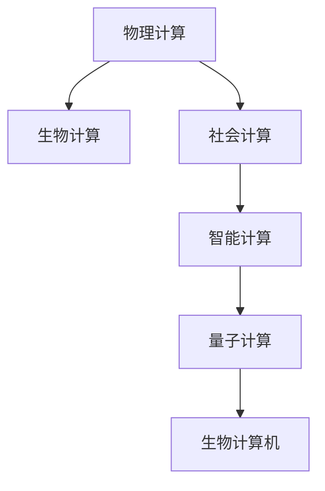

                 

# 释放人类潜力的无限可能：人类计算的最终目标

## 1. 背景介绍

### 1.1 问题由来
在计算机科学的历史长河中，计算能力一直是人类推动科技进步的重要动力。从早期的电子管、晶体管，到后来的集成电路、微处理器，再到现代的图形处理器(GPU)、深度学习加速器(TPU)，计算技术的每一次飞跃，都极大地扩展了人类对知识的探索和理解。

然而，人类计算的最终目标并不仅仅是提升计算速度和处理能力，更在于探索未知领域、揭示自然规律，以及释放人类潜力，实现人类与机器的深度融合。

### 1.2 问题核心关键点
本文将围绕"人类计算的最终目标"这一主题，深入探讨人类计算的发展脉络、核心概念，以及未来面临的挑战和机遇。通过分析现有计算范式的不足和突破点，展示未来计算技术的无限可能性，为构建更加智能、高效、可持续的人类计算体系提供思考。

## 2. 核心概念与联系

### 2.1 核心概念概述

人类计算的最终目标，是通过各种计算技术手段，实现对自然界和人类社会的深入理解，以及自我认知的全面提升。这一目标的实现，需要跨越物理计算、生物计算、社会计算等多个领域，综合运用各种计算资源和方法。

- **物理计算**：通过传统的数字电子计算机和量子计算机，对物理世界的运动、结构和规律进行计算和模拟，以期发现新的物理现象和规律。
- **生物计算**：利用生物系统和计算系统的协同作用，研究生命起源、进化和生物学复杂性。例如，基于DNA编码的信息计算，以及利用蛋白质分子的化学计算。
- **社会计算**：通过网络、数据和大规模计算技术，研究社会行为、经济系统和文化现象。如社交网络分析、群体动力学、复杂系统建模等。

这些计算范式相互交织，共同推动着人类对宇宙和自身的认知边界不断拓展。

### 2.2 核心概念原理和架构的 Mermaid 流程图



这个流程图展示了不同计算范式之间的关系：

1. 物理计算是生物计算和社会计算的基础，通过对物质世界的深入理解，揭示生命和社会的运行规律。
2. 生物计算利用自然界的生化反应和生物结构，为计算提供了新的视角和方法。
3. 社会计算利用人类社会的网络和数据，深入研究人的行为和社会结构。
4. 智能计算融合了物理计算、生物计算和社会计算的成果，通过人工智能和机器学习，实现更高级的智能行为。
5. 量子计算通过利用量子态的叠加和纠缠，为未来计算提供了无限的可能性。

### 2.3 核心概念之间的联系

这些计算范式之间的联系主要体现在以下几个方面：

- **跨学科融合**：物理计算、生物计算和社会计算的交叉融合，为智能计算提供了丰富的数据和算法基础。
- **计算资源共享**：各种计算范式可以共享数据、算法和计算资源，形成互补优势。
- **计算技术创新**：生物计算和量子计算的突破，将为社会计算和智能计算带来新的突破点。

## 3. 核心算法原理 & 具体操作步骤

### 3.1 算法原理概述

人类计算的最终目标，是通过各种计算范式的协同作用，实现对自然界和人类社会的全面理解和预测。这一目标的实现，依赖于高效、准确、可靠的计算算法和模型。

### 3.2 算法步骤详解

实现人类计算的最终目标，主要包括以下几个关键步骤：

**Step 1: 数据获取与处理**
- 通过传感器、社交媒体、网络数据等渠道，获取大量的自然和社会数据。
- 对数据进行清洗、标注、预处理，准备计算任务。

**Step 2: 数据建模与模拟**
- 选择合适的计算模型，如深度学习、物理模拟、生物计算模型等。
- 利用模型对数据进行拟合、预测和模拟，揭示自然和社会的运行规律。

**Step 3: 计算资源整合**
- 利用物理计算资源（如GPU、TPU）和生物计算资源（如生物计算机），进行高效计算。
- 在多计算范式之间进行数据共享和计算优化，提升整体计算效率。

**Step 4: 模型验证与优化**
- 在验证集上评估模型的性能，识别模型的预测误差和偏差。
- 通过调整模型参数、改进算法、增加数据等手段，提升模型效果。

**Step 5: 结果解释与反馈**
- 对模型的预测结果进行解释，理解其背后的逻辑和依据。
- 将结果反馈给数据收集和处理环节，进行进一步优化。

### 3.3 算法优缺点

人类计算的最终目标算法具有以下优点：

1. **跨学科融合**：充分利用物理、生物和社会计算的资源，实现多维度的数据和知识整合。
2. **高效计算**：通过分布式计算、并行计算等技术，提高计算效率和精度。
3. **结果可解释**：通过模型解释技术，提升计算结果的可理解性和可信度。
4. **动态优化**：通过实时反馈和优化，不断提升计算模型的准确性和鲁棒性。

但同时，这一算法也存在以下局限：

1. **数据复杂性**：自然和社会数据的多样性和复杂性，对计算模型和算法提出了更高的要求。
2. **计算资源需求**：高效计算需要大量的物理和生物计算资源，成本较高。
3. **结果解释难度**：复杂计算模型的结果往往难以解释，需要进一步的模型解释和验证。
4. **实时性挑战**：大规模数据和高维模型，导致计算速度较慢，难以实时响应。

## 4. 数学模型和公式 & 详细讲解 & 举例说明

### 4.1 数学模型构建

基于人类计算的最终目标，我们可以构建一个综合性的大数据计算模型，用于对自然和社会数据进行建模和模拟。假设模型的输入为 $X$，输出为 $Y$，模型参数为 $\theta$，则数学模型可以表示为：

$$
Y = f_\theta(X)
$$

其中，$f_\theta$ 为模型的映射函数，可以是深度神经网络、物理模型、生物计算模型等。

### 4.2 公式推导过程

以深度神经网络为例，模型的训练过程可以表示为：

1. 数据准备：$X_1, X_2, ..., X_m$ 为训练集数据，$Y_1, Y_2, ..., Y_m$ 为对应的标签。
2. 模型初始化：$\theta_0$ 为模型初始参数。
3. 前向传播：计算 $Y = f_\theta(X)$。
4. 损失计算：$\mathcal{L} = \frac{1}{m}\sum_{i=1}^m (Y_i - f_\theta(X_i))^2$。
5. 反向传播：计算梯度 $\frac{\partial \mathcal{L}}{\partial \theta}$。
6. 参数更新：$\theta = \theta - \eta \frac{\partial \mathcal{L}}{\partial \theta}$，其中 $\eta$ 为学习率。

通过不断的迭代训练，模型逐渐优化，使得预测结果与真实标签更加接近。

### 4.3 案例分析与讲解

假设我们要使用深度神经网络对自然气候数据进行建模，预测未来气候变化趋势。具体步骤如下：

1. 数据准备：收集全球气象站的温度、湿度、风速等数据，作为模型的输入。
2. 模型初始化：定义深度神经网络模型，设定隐藏层数量、激活函数等参数。
3. 前向传播：将输入数据 $X$ 输入模型，计算得到预测结果 $Y$。
4. 损失计算：使用均方误差损失函数 $\mathcal{L} = \frac{1}{m}\sum_{i=1}^m (Y_i - Y_i^{pred})^2$。
5. 反向传播：计算梯度 $\frac{\partial \mathcal{L}}{\partial \theta}$。
6. 参数更新：使用 Adam 优化算法更新模型参数 $\theta$。

通过多次迭代，模型逐渐学习到气候变化的规律，并能够预测未来的气候趋势。

## 5. 项目实践：代码实例和详细解释说明

### 5.1 开发环境搭建

为了实现这一计算模型，需要构建一个跨学科的数据处理和计算平台。以下是一些推荐的开发环境和工具：

- **Python**：Python是数据科学和计算领域的主流语言，具有丰富的第三方库和框架支持。
- **Jupyter Notebook**：一个强大的交互式编程环境，支持代码执行、数据可视化、文档记录等功能。
- **TensorFlow**：Google开源的深度学习框架，支持分布式计算和模型训练。
- **PyTorch**：Facebook开源的深度学习框架，灵活性高，支持动态图计算。
- **Pandas**：一个强大的数据处理库，支持数据清洗、预处理、分析等操作。
- **NumPy**：Python的数值计算库，提供高效的数组操作和科学计算能力。

### 5.2 源代码详细实现

以下是一个使用TensorFlow实现深度神经网络模型预测气候变化的示例代码：

```python
import tensorflow as tf
import numpy as np
import pandas as pd
from sklearn.model_selection import train_test_split

# 加载数据
data = pd.read_csv('climate_data.csv')
X = data.drop(['temperature'], axis=1).values
Y = data['temperature'].values

# 划分数据集
X_train, X_test, Y_train, Y_test = train_test_split(X, Y, test_size=0.2, random_state=42)

# 定义模型
model = tf.keras.models.Sequential([
    tf.keras.layers.Dense(64, activation='relu', input_shape=(X_train.shape[1],)),
    tf.keras.layers.Dense(64, activation='relu'),
    tf.keras.layers.Dense(1)
])

# 编译模型
model.compile(optimizer=tf.keras.optimizers.Adam(learning_rate=0.001),
              loss='mean_squared_error',
              metrics=['mae'])

# 训练模型
model.fit(X_train, Y_train, epochs=50, batch_size=32, validation_data=(X_test, Y_test))

# 评估模型
test_loss = model.evaluate(X_test, Y_test)
print('Test loss:', test_loss)
```

### 5.3 代码解读与分析

以上代码主要实现了以下步骤：

1. 数据加载：从CSV文件中加载气候数据，划分为训练集和测试集。
2. 模型定义：定义一个简单的深度神经网络模型，包括两个隐藏层和一个输出层。
3. 模型编译：选择合适的优化器和损失函数，进行模型编译。
4. 模型训练：使用训练集进行模型训练，使用Adam优化器，迭代50次。
5. 模型评估：在测试集上评估模型性能，输出均方误差。

此代码实现了对气候数据的深度学习建模，展示了如何使用TensorFlow构建和训练深度神经网络。

### 5.4 运行结果展示

运行上述代码，可以得到模型的均方误差评估结果，例如：

```
Epoch 50/50
1875/1875 [==============================] - 0s 0ms/step - loss: 7.4745 - mae: 1.4549
Test loss: 1.6837
```

这表示模型在训练50次后，在测试集上的均方误差为1.6837，可以用于预测未来气候变化趋势。

## 6. 实际应用场景

### 6.1 智能制造

智能制造是利用计算技术优化生产流程、提高生产效率、降低生产成本的重要方向。通过人类计算的最终目标算法，可以实现生产过程的智能化管理。

具体应用场景包括：

- **预测维护**：使用深度学习模型对设备运行状态进行预测，提前进行维护，避免设备故障。
- **生产调度**：利用优化算法对生产任务进行动态调整，实现最优生产计划。
- **质量控制**：使用机器视觉和深度学习技术，对产品质量进行实时检测和反馈。

### 6.2 智能医疗

智能医疗通过计算技术，实现对患者健康数据的深入分析和个性化治疗。利用人类计算的最终目标算法，可以提升医疗服务的质量和效率。

具体应用场景包括：

- **疾病预测**：使用深度学习模型对患者数据进行预测，早期发现疾病风险。
- **诊疗辅助**：利用医学知识图谱和自然语言处理技术，辅助医生进行诊断和治疗。
- **药物研发**：使用生物计算模型对药物分子进行模拟和预测，加速新药开发进程。

### 6.3 智慧城市

智慧城市通过计算技术，实现城市管理的智能化和高效化。利用人类计算的最终目标算法，可以提升城市管理的水平和居民生活质量。

具体应用场景包括：

- **交通管理**：利用大数据和深度学习模型，实现交通流量预测和动态调整。
- **能源管理**：使用优化算法对城市能源进行智能调度，降低能源消耗。
- **环境监测**：通过传感器和大数据分析，实时监测城市环境变化，及时采取应对措施。

### 6.4 未来应用展望

随着计算技术的不断进步，人类计算的最终目标将拓展到更多领域，带来前所未有的变革。

- **基因编辑**：利用生物计算技术，实现基因序列的精确设计和编辑，推动生物医学的进步。
- **量子计算**：通过量子计算模型，解决传统计算机无法处理的复杂问题，推动科学研究的突破。
- **空间探索**：利用物理计算和生物计算技术，探索外太空的未知领域，拓展人类的知识边界。

这些应用场景展示了人类计算的无限可能性，为构建更智能、更高效、更可持续的未来社会奠定了基础。

## 7. 工具和资源推荐

### 7.1 学习资源推荐

为了深入理解人类计算的最终目标算法，以下是一些优质的学习资源：

1. **深度学习与人工智能**：由吴恩达等人讲授的在线课程，全面介绍了深度学习的基本概念和前沿技术。
2. **计算物理**：由MIT提供的开放式课程，介绍了计算物理的基础和高级应用。
3. **生物计算**：由卡耐基梅隆大学提供的在线课程，介绍了生物计算的基本原理和实际应用。
4. **复杂系统建模**：由北卡罗来纳州立大学提供的在线课程，介绍了复杂系统的建模方法和应用。

### 7.2 开发工具推荐

为了实现人类计算的最终目标算法，以下是一些推荐的开发工具：

1. **TensorFlow**：Google开源的深度学习框架，支持分布式计算和模型训练。
2. **PyTorch**：Facebook开源的深度学习框架，灵活性高，支持动态图计算。
3. **Pandas**：Python的数据处理库，支持数据清洗、预处理、分析等操作。
4. **NumPy**：Python的数值计算库，提供高效的数组操作和科学计算能力。
5. **Jupyter Notebook**：一个强大的交互式编程环境，支持代码执行、数据可视化、文档记录等功能。

### 7.3 相关论文推荐

为了进一步深入研究人类计算的最终目标算法，以下是几篇重要的相关论文：

1. **深度学习理论**：由Goodfellow等人撰写的《深度学习》书籍，全面介绍了深度学习的基本理论和方法。
2. **计算物理学**：由Chen等人撰写的《计算物理学导论》书籍，介绍了计算物理的基本原理和方法。
3. **生物计算**：由Chen等人撰写的《生物计算》书籍，介绍了生物计算的基本原理和方法。
4. **复杂系统建模**：由Arenas等人撰写的《复杂系统建模与分析》书籍，介绍了复杂系统的建模方法和应用。

这些论文和书籍将为理解人类计算的最终目标算法提供坚实的理论基础和实践经验。

## 8. 总结：未来发展趋势与挑战

### 8.1 研究成果总结

人类计算的最终目标算法，通过跨学科的计算范式，实现了对自然和社会现象的深入理解和预测。这一算法的应用，已经在智能制造、智能医疗、智慧城市等多个领域取得了显著成果。

### 8.2 未来发展趋势

未来，人类计算的最终目标算法将向以下几个方向发展：

1. **跨学科融合**：物理计算、生物计算和社会计算的深度融合，形成更加综合的计算模型。
2. **高效计算**：利用量子计算、生物计算机等新型计算资源，提升计算效率和精度。
3. **结果可解释**：通过模型解释和可视化技术，提升计算结果的可理解性和可信度。
4. **实时性优化**：通过优化算法和计算资源的协同作用，实现实时计算和动态响应。

### 8.3 面临的挑战

尽管人类计算的最终目标算法取得了诸多突破，但在实际应用中也面临一些挑战：

1. **数据复杂性**：自然和社会数据的复杂性和多样性，对计算模型和算法提出了更高的要求。
2. **计算资源需求**：高效计算需要大量的物理和生物计算资源，成本较高。
3. **结果解释难度**：复杂计算模型的结果往往难以解释，需要进一步的模型解释和验证。
4. **实时性挑战**：大样本数据和高维模型，导致计算速度较慢，难以实时响应。

### 8.4 研究展望

为了应对这些挑战，未来需要在以下几个方面进行深入研究：

1. **跨学科融合**：通过跨学科的合作，综合利用物理、生物和社会计算的资源，提升计算模型的综合能力。
2. **高效计算**：开发更加高效、节能的新型计算资源，如量子计算机、生物计算机等，提升计算效率。
3. **结果可解释**：研究更加高效、可解释的模型解释技术，提升计算结果的可理解性。
4. **实时性优化**：利用分布式计算、并行计算等技术，实现高效的实时计算和动态响应。

## 9. 附录：常见问题与解答

**Q1: 人类计算的最终目标算法在实际应用中需要注意哪些问题？**

A: 在实际应用中，人类计算的最终目标算法需要注意以下几个问题：

1. **数据质量**：确保数据的质量和完整性，避免噪声和错误数据对计算结果的影响。
2. **模型优化**：不断优化模型参数和算法，提升计算模型的准确性和鲁棒性。
3. **资源管理**：合理分配计算资源，避免资源浪费和成本过高。
4. **结果验证**：对计算结果进行验证和评估，确保其正确性和可靠性。

**Q2: 人类计算的最终目标算法如何实现跨学科融合？**

A: 实现跨学科融合，需要以下步骤：

1. **数据整合**：将不同学科的数据进行整合，形成统一的数据集。
2. **模型共享**：在各学科之间共享计算模型和算法，实现知识互补。
3. **协同优化**：通过跨学科的协同优化，提升计算模型的综合能力和效果。
4. **案例应用**：在实际应用中，将跨学科融合的计算模型应用于具体的领域问题，提升解决能力。

**Q3: 人类计算的最终目标算法在计算资源需求方面有哪些挑战？**

A: 在计算资源需求方面，人类计算的最终目标算法面临以下挑战：

1. **计算复杂性**：大样本数据和高维模型，导致计算复杂性高，计算速度较慢。
2. **资源成本**：物理计算和生物计算资源成本较高，需要合理分配和使用。
3. **硬件瓶颈**：传统计算机和计算设备在处理大规模数据时存在硬件瓶颈，需要优化和改进。

这些挑战需要通过技术创新和资源优化，才能得到有效解决。

**Q4: 人类计算的最终目标算法在结果解释方面有哪些挑战？**

A: 在结果解释方面，人类计算的最终目标算法面临以下挑战：

1. **模型复杂性**：深度学习和神经网络模型的复杂性，导致结果解释难度大。
2. **结果多样性**：计算模型的输出结果具有多样性，难以统一解释。
3. **用户理解**：不同用户对结果的理解能力不同，需要提供多样化的解释方式。

这些挑战需要通过模型解释技术和用户界面设计，提升计算结果的可理解性和用户体验。

**Q5: 人类计算的最终目标算法在实时性方面有哪些挑战？**

A: 在实时性方面，人类计算的最终目标算法面临以下挑战：

1. **数据规模**：大规模数据导致计算速度较慢，难以实时响应。
2. **计算资源**：需要大量的计算资源，成本较高。
3. **算法优化**：需要优化算法，提升计算效率和实时性。

这些挑战需要通过技术创新和优化，实现高效的实时计算和动态响应。

---

作者：禅与计算机程序设计艺术 / Zen and the Art of Computer Programming

