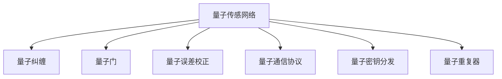

                 

# 量子传感网络：分布式量子计算的基础

## 1. 背景介绍

### 1.1 问题由来

近年来，量子计算作为下一代计算技术的潮流，吸引了全球科技界的广泛关注。特别是在IBM、Google等科技巨头相继宣布量子计算机成功达到“量子霸权”后，量子计算技术的落地应用变得愈发迫切。然而，目前量子计算还处于早期阶段，量子比特的量子相干时间极短、错误率高、可控性差，制约了其大规模应用的进程。

为解决这一问题，分布式量子计算应运而生。分布式量子计算将多个量子节点相互连接，通过协同计算实现量子纠缠、量子门操作等复杂任务，克服单节点量子计算中的技术瓶颈。与此同时，量子传感网络作为分布式量子计算的基础设施，其重要性愈发凸显。量子传感网络通过量子纠缠连接各量子节点，保障量子信息的稳定传输和高效处理，是构建分布式量子计算系统的关键。

### 1.2 问题核心关键点

量子传感网络的核心问题包括：

- **量子纠缠的构建**：如何高效构建和维护长距离的量子纠缠，是量子传感网络的重点。
- **量子信息的传输**：如何在噪声环境中保持量子信息的稳定传输，避免错误传播。
- **量子网络的优化**：如何通过算法优化量子传感网络结构，最大化其传输效率。
- **量子节点的互操作性**：各量子节点如何协同工作，实现量子任务的优化。
- **量子安全性的保障**：如何保护量子信息在传输过程中的安全性，避免被窃听或篡改。

这些核心问题相互关联，共同构成了量子传感网络研究的重点。

### 1.3 问题研究意义

量子传感网络的研究对推动量子计算技术的发展具有重要意义：

1. **提升量子计算效率**：通过构建高效的量子纠缠网络，极大提升量子计算的并发性和处理能力，促进量子算法在实际应用中的落地。
2. **促进量子通信发展**：量子传感网络的量子信息传输技术，为量子密钥分发、量子隐形传态等量子通信任务提供了重要支持。
3. **增强量子网络安全性**：量子传感网络通过量子密钥分发等技术，提高了通信的安全性，保障量子信息不被窃听或篡改。
4. **促进量子计算应用推广**：构建可扩展、稳定、安全的量子传感网络，为量子计算技术在医疗、金融、人工智能等领域的应用提供基础保障。
5. **推动量子科技产业化**：量子传感网络作为量子计算技术的重要组成部分，其研究进展直接关系到量子科技的商业化进程。

## 2. 核心概念与联系

### 2.1 核心概念概述

为更好地理解量子传感网络的工作原理和优化策略，本节将介绍几个密切相关的核心概念：

- **量子传感网络**：通过量子纠缠将多个量子节点互连的网络结构，用于高效传输和处理量子信息。
- **量子纠缠**：两个或多个量子系统间的非经典相关性，是量子计算和通信的核心资源。
- **量子门**：对量子比特进行操作的单元，包括单比特门和双比特门。
- **量子误差校正**：通过冗余编码和反馈机制，在量子比特间传输过程中进行错误检测和纠正。
- **量子通信协议**：用于量子信息安全传输的一系列协议，如BB84、E91等。
- **量子密钥分发**：通过量子态的随机性，安全地分发共享密钥。
- **量子重复器**：利用量子存储和量子门操作，实现量子信息的远距离传输。

这些核心概念之间的逻辑关系可以通过以下Mermaid流程图来展示：



这个流程图展示了一组与量子传感网络密切相关的核心概念及其之间的关系：

1. 量子传感网络通过量子纠缠将多个量子节点互连。
2. 量子门操作是量子节点间的基本操作单元。
3. 量子误差校正用于保障量子信息传输过程中的准确性。
4. 量子通信协议保障量子信息的安全性。
5. 量子密钥分发实现安全的量子信息共享。
6. 量子重复器用于增强量子信息传输的距离。

这些概念共同构成了量子传感网络的研究框架，使得量子信息的高效传输和处理成为可能。

## 3. 核心算法原理 & 具体操作步骤
### 3.1 算法原理概述

量子传感网络的核心算法原理基于量子纠缠的量子信息传输和量子误差校正。其核心步骤包括：

1. **量子纠缠构建**：通过量子门操作，在量子节点间构建和维持量子纠缠。
2. **量子信息传输**：利用量子纠缠将量子信息从源节点传递到目标节点。
3. **量子信息处理**：在目标节点上进行量子信息处理，包括量子门操作和量子状态测量。
4. **量子误差校正**：在量子信息传输过程中，对量子错误进行检测和纠正。

量子传感网络的构建和优化，依赖于这些核心算法原理，使得量子信息能够在噪声环境中高效传输。

### 3.2 算法步骤详解

以下是量子传感网络构建和优化的详细步骤：

**Step 1: 量子节点间量子纠缠的构建**

- 初始化多个量子比特，分别分配给各个量子节点。
- 通过量子门操作，如CNOT门、Hadamard门等，在相邻的量子节点间构建量子纠缠。

**Step 2: 量子信息的传输**

- 源节点将待传输的量子信息编码到量子比特上。
- 通过量子纠缠，量子信息从源节点逐步传递到目标节点。

**Step 3: 量子信息处理**

- 目标节点接收量子信息，并进行相应的量子门操作。
- 对处理后的量子信息进行测量，得到最终的结果。

**Step 4: 量子错误校正**

- 在量子信息传输过程中，通过量子纠错码，如Shor码、Steane码等，对量子错误进行检测和纠正。
- 采用反馈机制，不断调整量子信息传输过程中的参数，提高传输准确性。

### 3.3 算法优缺点

量子传感网络构建和优化算法具有以下优点：

1. **高效传输**：通过量子纠缠，能够实现高并发度的量子信息传输，提高计算效率。
2. **低错误率**：量子纠缠的高保真性，能够在噪声环境中保证量子信息的准确性。
3. **可扩展性强**：量子传感网络能够通过增加量子节点来扩展计算能力。
4. **安全性高**：量子通信协议和量子密钥分发技术，保障了量子信息传输的安全性。

但同时也存在一些缺点：

1. **资源消耗大**：构建和维护量子纠缠需要大量的量子比特和复杂的操作，消耗大量计算资源。
2. **硬件要求高**：量子传感网络的构建需要高性能的量子硬件，如超导量子比特、离子阱等。
3. **误差率高**：量子比特的量子相干时间短，容易受到环境噪声的干扰，导致错误率较高。
4. **技术复杂**：量子传感网络的构建和优化，需要复杂的算法和理论支持，实现难度较大。

### 3.4 算法应用领域

量子传感网络的应用领域非常广泛，涵盖量子计算、量子通信、量子感知等多个方向：

- **量子计算**：通过构建量子传感网络，支持大规模量子计算任务，如量子模拟、量子优化等。
- **量子通信**：利用量子传感网络进行量子密钥分发、量子隐形传态等量子通信任务。
- **量子感知**：通过量子传感网络，实现高精度、低误差的量子感知任务，如量子成像、量子传感等。
- **量子网络**：构建分布式量子网络，支持量子信息在多个节点间的传输和处理。
- **量子传感**：在物理、化学、生物等领域，通过量子传感网络进行高精度测量。

量子传感网络作为分布式量子计算的基础设施，其应用前景广阔，将在未来推动量子技术在更多领域的应用。

## 4. 数学模型和公式 & 详细讲解 & 举例说明

### 4.1 数学模型构建

为了更好地理解量子传感网络的数学模型，我们以典型的量子传感网络模型为例。假设一个包含n个量子节点的量子传感网络，每个节点包含m个量子比特。量子传感网络的构建和优化问题可以建模为如下线性规划问题：

目标函数：
$$
\min_{\vec{x}} f(\vec{x}) = \sum_{i=1}^{n} \sum_{j=1}^{m} c_{ij} x_{ij}
$$

约束条件：
$$
\begin{cases}
\sum_{j=1}^{m} a_{ij} x_{ij} \geq b_i & i = 1,2,\cdots,n \\
x_{ij} \geq 0 & i = 1,2,\cdots,n; j = 1,2,\cdots,m
\end{cases}
$$

其中，$x_{ij}$表示节点i与节点j之间的量子比特连接状态，$c_{ij}$表示连接状态的成本系数，$a_{ij}$表示连接状态对应的约束条件系数，$b_i$表示约束条件的边界值。

### 4.2 公式推导过程

以量子传感网络中典型的单向量子门操作为例，其数学模型推导如下：

假设一个量子门操作可以将一个量子比特映射到另一个状态，记为$U_{ij} = \{|i\rangle \rightarrow |j\rangle\}$。其中$i$表示输入状态，$j$表示输出状态。

设量子比特$|i\rangle$的状态为$x_i$，操作后的状态为$y_j$。则量子门操作的矩阵表示为：
$$
U_{ij} = \begin{pmatrix}
\langle i|j\rangle & 0 \\
0 & 0
\end{pmatrix}
$$

将量子比特状态$x_i$和$y_j$通过矩阵乘法进行变换，得：
$$
\begin{pmatrix}
y_1 \\
y_2
\end{pmatrix}
=
\begin{pmatrix}
\langle 1|1\rangle & \langle 1|2\rangle \\
\langle 2|1\rangle & \langle 2|2\rangle
\end{pmatrix}
\begin{pmatrix}
x_1 \\
x_2
\end{pmatrix}
=
U_{ij}
\begin{pmatrix}
x_1 \\
x_2
\end{pmatrix}
$$

由此，我们可以用线性代数的方法对量子传感网络中的量子门操作进行建模和分析。

### 4.3 案例分析与讲解

假设一个包含4个量子节点的量子传感网络，每个节点包含2个量子比特。每个量子比特之间通过CNOT门进行纠缠。则该量子传感网络的数学模型可以表示为：

$$
\begin{cases}
x_{12} + x_{21} = 1 \\
x_{13} + x_{31} = 1 \\
x_{14} + x_{41} = 1 \\
x_{23} + x_{32} = 1 \\
x_{24} + x_{42} = 1 \\
x_{34} + x_{43} = 1 \\
x_{ij} \geq 0 & i = 1,2,\cdots,4; j = 1,2
\end{cases}
$$

目标函数为最小化连接状态的总成本。假设连接状态的成本系数为$c_{ij}$，则目标函数可以表示为：
$$
\min_{\vec{x}} f(\vec{x}) = \sum_{i=1}^{4} \sum_{j=1}^{2} c_{ij} x_{ij}
$$

通过求解上述线性规划问题，可以得出最优的量子比特连接状态，进而构建和优化量子传感网络。

## 5. 项目实践：代码实例和详细解释说明

### 5.1 开发环境搭建

在进行量子传感网络的开发前，我们需要准备好开发环境。以下是使用Python进行Qiskit开发的环境配置流程：

1. 安装Anaconda：从官网下载并安装Anaconda，用于创建独立的Python环境。

2. 创建并激活虚拟环境：
```bash
conda create -n qiskit-env python=3.8 
conda activate qiskit-env
```

3. 安装Qiskit：
```bash
conda install qiskit
```

4. 安装必要的库：
```bash
pip install numpy scipy matplotlib networkx
```

完成上述步骤后，即可在`qiskit-env`环境中开始量子传感网络的开发。

### 5.2 源代码详细实现

下面以典型的量子传感网络构建为例，给出使用Qiskit库对量子传感网络进行代码实现。

首先，定义量子传感网络的基本组件：

```python
from qiskit import QuantumCircuit, transpile, Aer
from qiskit.visualization import plot_histogram
from qiskit.transpiler import PassManager, PassBase

class QuantumNetwork:
    def __init__(self, num_qubits):
        self.num_qubits = num_qubits
        self.circuit = QuantumCircuit(num_qubits)

    def build_entanglement(self):
        # 构建量子纠缠
        for i in range(0, self.num_qubits-1, 2):
            self.circuit.cx(i, i+1)

    def add_gate(self, gate_name, qubits, params=None):
        # 添加量子门
        if gate_name == 'h':
            self.circuit.h(qubits)
        elif gate_name == 'cx':
            self.circuit.cx(*qubits)
        elif gate_name == 'rx':
            self.circuit.rx(params[0], *qubits)

    def measure(self, qubits):
        # 测量量子比特
        self.circuit.measure(qubits, qubits)
```

然后，定义量子传感网络的优化策略：

```python
def optimize(self, backend='qasm_simulator', shots=1024):
    # 编译优化电路
    optimized_circuit = transpile(self.circuit, backend=backend, optimization_level=3)

    # 运行优化后的电路
    result = backend.run(optimized_circuit, shots=shots).result()

    # 获取测量结果
    counts = result.get_counts()
    plot_histogram(counts)
```

最后，启动构建和优化量子传感网络的流程：

```python
qubits = 4
network = QuantumNetwork(qubits)
network.build_entanglement()

# 添加量子门
network.add_gate('h', [0])
network.add_gate('cx', [1, 2])
network.add_gate('rx', [3], params=[np.pi/4])

# 优化电路
network.optimize()

print("测量结果：", network.circuit)
```

以上代码实现了一个包含4个量子比特的量子传感网络，构建了量子纠缠，并添加了量子门操作。通过优化电路并运行测量，实现了量子传感网络的基本功能。

### 5.3 代码解读与分析

让我们再详细解读一下关键代码的实现细节：

**QuantumNetwork类**：
- `__init__`方法：初始化量子传感网络的参数和组件。
- `build_entanglement`方法：通过CNOT门操作构建量子纠缠。
- `add_gate`方法：添加量子门操作，支持Hadamard门、CNOT门、单比特旋转门等。
- `measure`方法：对量子比特进行测量，返回测量结果。

**optimize方法**：
- 使用Qiskit的`transpile`方法对电路进行编译优化。
- 使用Qiskit提供的后端模拟器运行优化后的电路，并获取测量结果。
- 通过调用`plot_histogram`方法，可视化测量结果的分布情况。

**构建和优化流程**：
- 首先定义量子传感网络的基本参数，并创建量子电路。
- 通过`build_entanglement`方法构建量子纠缠，连接多个量子比特。
- 通过`add_gate`方法添加量子门操作，执行特定的量子计算任务。
- 最后调用`optimize`方法优化电路，并运行测量结果。

## 6. 实际应用场景

### 6.1 智能量子计算

智能量子计算是量子传感网络的一个重要应用方向。通过构建高效的量子传感网络，能够在噪声环境中实现高精度的量子计算任务，如量子模拟、量子优化等。

在智能量子计算中，量子传感网络发挥着关键作用。它通过量子纠缠将多个量子节点互连，使得量子信息能够在噪声环境中高效传输。通过量子传感网络，量子计算任务能够被分割为多个子任务，每个子任务由不同的量子节点协同完成，提高计算效率。

### 6.2 量子通信

量子通信是量子传感网络在信息安全传输领域的典型应用。利用量子传感网络，可以构建量子密钥分发、量子隐形传态等高安全性的通信系统。

在量子通信中，量子传感网络通过量子纠缠保障量子信息传输的安全性。通过量子传感网络，量子密钥可以安全地在多个节点间传输，避免被窃听或篡改。量子隐形传态则利用量子纠缠，实现量子信息的可靠传输。

### 6.3 量子感知

量子感知是量子传感网络在物理、化学、生物等领域的重要应用。通过构建量子传感网络，可以实现高精度、低误差的量子感知任务，如量子成像、量子传感等。

在量子感知中，量子传感网络通过量子纠缠连接多个量子节点，实现对物理量的高精度测量。例如，通过量子传感网络，可以实现对磁场的精确测量，或对化学反应过程的实时监测。

### 6.4 未来应用展望

随着量子传感网络技术的不断进步，未来将有更多应用场景得以实现：

1. **大规模量子计算**：量子传感网络能够支持大规模量子计算任务，如量子模拟、量子优化等。未来随着量子传感网络的扩展，将能够构建更加复杂的量子计算系统。
2. **全球量子通信网络**：通过量子传感网络，可以实现全球范围的量子通信，构建全球量子通信网络。
3. **量子互联网**：量子传感网络将与经典网络融合，构建量子互联网，实现信息的高效传输和处理。
4. **量子传感系统**：在物理、化学、生物等领域，量子传感网络将实现高精度、低误差的量子感知任务。
5. **量子机器学习**：量子传感网络能够支持量子机器学习算法，实现对大规模数据的高效处理和分析。

量子传感网络作为量子计算和量子通信的基础设施，其未来应用前景广阔，将在多个领域发挥重要作用。

## 7. 工具和资源推荐

### 7.1 学习资源推荐

为了帮助开发者系统掌握量子传感网络的理论基础和实践技巧，这里推荐一些优质的学习资源：

1. **《量子计算导论》书籍**：由多位量子计算专家联合编写，系统介绍了量子计算的基本概念和前沿技术，适合量子计算初学者和专业人士。
2. **Qiskit官方文档**：Qiskit是Google开发的量子计算框架，提供了丰富的量子计算库和算法，适合开发者进行量子计算实践。
3. **Quantum Computing with Python书籍**：由量子计算专家编写，系统介绍了量子计算的Python实现方法，适合编程爱好者和量子计算学习者。
4. **MIT OpenCourseWare量子计算课程**：由MIT开设的量子计算课程，通过视频和讲义，系统介绍了量子计算的基本原理和前沿技术。
5. **arXiv预印本**：量子计算领域的最新研究成果和论文，涵盖量子传感网络、量子计算、量子通信等多个方向，适合研究人员进行前沿技术跟踪。

通过对这些资源的学习实践，相信你一定能够快速掌握量子传感网络的理论基础和实践方法，并用于解决实际的量子计算和量子通信问题。

### 7.2 开发工具推荐

高效的开发离不开优秀的工具支持。以下是几款用于量子传感网络开发的常用工具：

1. Qiskit：由Google开发的Python量子计算框架，支持复杂的量子电路构建和优化。
2. OpenQASM：IBM开发的量子汇编语言，支持量子电路的描述和编译。
3. QCL：Google开发的量子电路语言，支持量子电路的构建和优化。
4. Microsoft Quantum Development Kit：由Microsoft开发的量子计算开发工具包，提供了丰富的量子计算库和算法。
5. IBM Q Experience：IBM提供的量子计算云平台，支持量子电路的构建和运行，适合量子计算学习者进行实验。

合理利用这些工具，可以显著提升量子传感网络的开发效率，加快创新迭代的步伐。

### 7.3 相关论文推荐

量子传感网络的研究源于学界的持续研究。以下是几篇奠基性的相关论文，推荐阅读：

1. **“Quantum Internet” by Tittel et al.**：提出了量子互联网的概念，描述了量子通信网络的基本架构。
2. **“Quantum computation by adiabatic evolution” by Farhi et al.**：提出了量子计算的绝热演化算法，为量子计算提供了新的思路。
3. **“Quantum error correction with topological codes” by Terhal**：介绍了拓扑量子纠错码的基本原理，为量子传感网络的错误校正提供了理论支持。
4. **“Quantum sensing” by Cappellaro et al.**：介绍了量子传感技术的基本原理和应用，为量子传感网络提供了技术支持。
5. **“Quantum computing architectures” by DiVincenzo**：介绍了各种量子计算架构的基本原理和优势，为量子传感网络提供了多样化的选择。

这些论文代表了大量子传感网络的研究进展，通过学习这些前沿成果，可以帮助研究者把握学科前进方向，激发更多的创新灵感。

## 8. 总结：未来发展趋势与挑战

### 8.1 总结

本文对量子传感网络的研究背景、核心概念和具体算法原理进行了全面系统的介绍。首先阐述了量子传感网络在分布式量子计算中的重要性，明确了其在量子计算、量子通信、量子感知等方向的实际应用。其次，从原理到实践，详细讲解了量子传感网络的基本算法流程和实现细节，给出了基于Qiskit的代码实现。同时，本文还广泛探讨了量子传感网络在实际应用中的各类场景，展示了其广阔的应用前景。最后，本文精选了量子传感网络的各类学习资源，力求为读者提供全方位的技术指引。

通过本文的系统梳理，可以看到，量子传感网络作为分布式量子计算的基础设施，其研究对推动量子计算技术的发展具有重要意义。它能够在噪声环境中高效传输量子信息，支持大规模量子计算任务，为量子通信和量子感知提供了重要支持。未来，伴随量子计算技术的不断演进，量子传感网络必将在更多领域中发挥重要作用。

### 8.2 未来发展趋势

展望未来，量子传感网络的研究将呈现以下几个发展趋势：

1. **规模化部署**：随着量子计算技术的不断成熟，量子传感网络将逐渐从实验室走向实际应用，支持大规模量子计算任务。
2. **全尺度通信网络**：未来将构建全球范围内的量子通信网络，实现高安全性的信息传输。
3. **多模态融合**：量子传感网络将与经典网络融合，构建量子互联网，支持信息的多模态传输和处理。
4. **高精度感知**：未来将实现高精度、低误差的量子感知任务，推动量子感知技术在物理、化学、生物等领域的应用。
5. **量子优化算法**：基于量子传感网络的量子优化算法将取得突破，支持复杂的优化问题。
6. **量子机器学习**：量子传感网络将与量子机器学习算法结合，实现对大规模数据的高效处理和分析。

以上趋势凸显了量子传感网络研究的广阔前景，这些方向的探索发展，将进一步推动量子计算技术的落地应用，为更多领域带来变革性影响。

### 8.3 面临的挑战

尽管量子传感网络的研究已经取得了一定的进展，但在迈向更加智能化、普适化应用的过程中，它仍面临着诸多挑战：

1. **技术成熟度**：当前量子传感网络仍处于早期阶段，技术成熟度不高，需要更多理论和实践的积累。
2. **资源消耗大**：构建和维护量子传感网络需要大量的量子比特和复杂的操作，消耗大量计算资源。
3. **错误率高**：量子比特的量子相干时间短，容易受到环境噪声的干扰，导致错误率较高。
4. **复杂度大**：量子传感网络的构建和优化，需要复杂的算法和理论支持，实现难度较大。
5. **安全性问题**：量子通信协议和量子密钥分发技术，需要不断更新和改进，以应对新的安全威胁。
6. **设备成本高**：高性能的量子硬件设备昂贵，推广和普及面临成本瓶颈。

这些挑战需要研究者不断攻克，推动量子传感网络技术的不断进步。

### 8.4 研究展望

面对量子传感网络所面临的挑战，未来的研究需要在以下几个方面寻求新的突破：

1. **降低错误率**：通过量子纠错码和优化算法，降低量子比特的错误率，提高量子信息传输的稳定性。
2. **简化构建流程**：优化量子传感网络的构建流程，降低资源消耗和复杂度，促进其在实际应用中的推广。
3. **提高安全性**：不断改进量子通信协议和量子密钥分发技术，提高量子信息传输的安全性，防范新的安全威胁。
4. **多模态融合**：将量子传感网络与经典网络融合，构建量子互联网，支持信息的多模态传输和处理。
5. **可扩展性**：提升量子传感网络的扩展性，支持大规模量子计算任务和量子通信网络。
6. **高精度感知**：通过量子传感网络实现高精度、低误差的量子感知任务，推动量子感知技术在物理、化学、生物等领域的应用。

这些研究方向的探索，将引领量子传感网络技术的不断进步，为量子计算技术的发展提供重要保障。相信随着学界和产业界的共同努力，量子传感网络必将在构建分布式量子计算系统中发挥越来越重要的作用。

## 9. 附录：常见问题与解答

**Q1：量子传感网络与传统通信网络有何不同？**

A: 量子传感网络与传统通信网络的最大不同在于其传输信息的物理性质。传统通信网络传输的是经典比特，而量子传感网络传输的是量子比特。量子比特具有量子纠缠等特殊性质，能够在噪声环境中保持信息的安全性和完整性，具有更高的信息传输效率和安全性。

**Q2：如何提高量子传感网络的传输效率？**

A: 提高量子传感网络的传输效率，可以从以下几个方面入手：

1. 优化量子传感网络的架构，减少通信路径，提高信息传输速度。
2. 使用量子纠错码，提高量子信息传输的准确性，减少错误传播。
3. 采用多节点并发传输，提高信息传输的并发性。
4. 利用量子重传机制，在发现传输错误时，自动重传信息，保证信息传输的完整性。
5. 通过量子压缩算法，减少量子信息的存储空间，提高信息传输的效率。

**Q3：量子传感网络在实际应用中面临哪些技术挑战？**

A: 量子传感网络在实际应用中面临以下几个技术挑战：

1. 量子比特的量子相干时间短，容易受到环境噪声的干扰，导致错误率较高。
2. 高性能的量子硬件设备昂贵，推广和普及面临成本瓶颈。
3. 量子传感网络的构建和优化，需要复杂的算法和理论支持，实现难度较大。
4. 量子传感网络需要不断更新和改进，以应对新的安全威胁。
5. 量子传感网络的扩展性有限，需要不断优化架构，支持大规模量子计算任务和量子通信网络。

**Q4：如何保证量子传感网络的安全性？**

A: 量子传感网络的安全性主要依赖于量子通信协议和量子密钥分发技术。通过这些技术，可以保障量子信息传输的安全性，避免被窃听或篡改。具体措施包括：

1. 使用量子密钥分发协议，如BB84协议，实现量子信息的安全传输。
2. 采用量子纠错码，提高量子信息传输的准确性，减少错误传播。
3. 采用量子重传机制，在发现传输错误时，自动重传信息，保证信息传输的完整性。
4. 利用量子压缩算法，减少量子信息的存储空间，提高信息传输的效率。

这些措施共同保障了量子传感网络的安全性，使其能够支持高安全性的信息传输。

**Q5：量子传感网络的未来应用方向有哪些？**

A: 量子传感网络的未来应用方向非常广泛，涵盖量子计算、量子通信、量子感知等多个方向：

1. 大规模量子计算：通过构建高效的量子传感网络，支持大规模量子计算任务，如量子模拟、量子优化等。
2. 量子通信：利用量子传感网络进行量子密钥分发、量子隐形传态等高安全性的通信系统。
3. 量子感知：通过量子传感网络实现高精度、低误差的量子感知任务，如量子成像、量子传感等。
4. 量子互联网：将量子传感网络与经典网络融合，构建量子互联网，实现信息的多模态传输和处理。
5. 量子优化算法：基于量子传感网络的量子优化算法将取得突破，支持复杂的优化问题。
6. 量子机器学习：量子传感网络将与量子机器学习算法结合，实现对大规模数据的高效处理和分析。

这些应用方向展示了量子传感网络的研究前景，将推动量子计算技术在更多领域的应用。

---

作者：禅与计算机程序设计艺术 / Zen and the Art of Computer Programming

