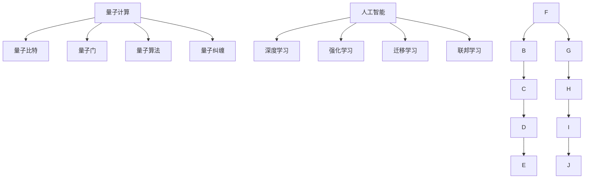

                 

## 1. 背景介绍

### 1.1 问题由来
量子计算（Quantum Computing）和人工智能（Artificial Intelligence, AI）作为当前最前沿的技术领域，都承载着人类对未来智能化社会的美好愿景。然而，量子计算和AI在技术实现上存在截然不同的路径和机制，它们能够相互促进，共同开拓新的科技应用领域。在量子计算和AI融合的浪潮中，如何高效结合两者优势，打破边界，实现跨学科的创新，成为了一个具有重要现实意义的研究课题。

### 1.2 问题核心关键点
量子计算和AI的融合，旨在利用量子计算强大的计算能力和独特的处理机制，加速AI模型的训练和优化，同时为AI提供更为高效和灵活的数据处理和算法设计手段。具体来说，该融合能够带来的优势包括：

1. **超强的并行计算能力**：量子计算机在处理大规模复杂数据时，由于其量子态的叠加性和纠缠性，可以同时处理大量的数据样本，极大地提高计算效率。

2. **突破经典计算的瓶颈**：量子计算能够突破经典计算的摩尔定律瓶颈，实现指数级的速度提升，为AI模型的训练和优化提供全新可能性。

3. **优化复杂优化问题**：量子计算在解决NP难题和优化问题方面具有显著优势，能够更高效地处理AI中的训练优化和模型选择等问题。

4. **增强数据处理能力**：量子计算在处理噪声数据和随机数据方面具有独特优势，可以显著提升AI的数据预处理和特征提取能力。

5. **提供新的算法设计思路**：量子计算的原理为AI算法设计提供了新的灵感，如量子增强神经网络等。

这些核心关键点展示了量子计算与AI融合的潜力与挑战，反映了当前研究的热点与未来发展的方向。

### 1.3 问题研究意义
量子计算和AI的结合，对推动科技与产业的持续创新具有重大意义：

1. **提升AI模型的训练效率**：量子计算能显著加速模型训练，缩短研发周期。
2. **推动AI技术在复杂领域的应用**：如金融、制药、物流等，这些领域中存在大量复杂问题，传统AI难以处理。
3. **促进跨学科交流与合作**：量子计算与AI的融合推动不同学科之间的交流，促进新思想的碰撞和突破。
4. **激发创新与商业潜力**：量子计算和AI的结合能够带来新的商业模式和技术解决方案，推动新兴产业的发展。

## 2. 核心概念与联系

### 2.1 核心概念概述

为了更好地理解量子计算与AI融合的技术内涵，我们首先介绍相关核心概念：

- **量子计算（Quantum Computing）**：利用量子力学原理，通过量子比特（qubits）进行信息处理的新型计算模型。其关键优势在于量子叠加和纠缠特性，能够实现传统计算无法处理的复杂计算任务。

- **量子比特（Qubit）**：量子计算的基本单位，利用量子态的叠加性和纠缠性进行信息编码和处理。

- **量子门（Quantum Gate）**：量子计算中的基本操作单元，通过特定的量子操作对量子比特进行控制和变换。

- **量子算法（Quantum Algorithm）**：针对特定问题设计的量子计算程序，如Shor算法、Grover算法等。

- **量子纠缠（Quantum Entanglement）**：量子比特之间的一种特殊状态，可以实现量子信息的高效传输和处理。

- **人工智能（Artificial Intelligence）**：通过模拟人类智能行为，让机器具有学习、推理、决策等能力的技术领域。

- **深度学习（Deep Learning）**：基于神经网络的AI子领域，通过多层网络结构对数据进行特征提取和模型训练，广泛用于图像、语音、自然语言处理等领域。

- **强化学习（Reinforcement Learning）**：通过智能体在环境中进行交互，学习最优策略，用于决策和控制问题。

- **迁移学习（Transfer Learning）**：通过在相关任务上预训练模型，再应用于新任务，提高模型的泛化能力。

- **联邦学习（Federated Learning）**：分布式数据环境下的协同学习机制，各节点在不共享本地数据的情况下，共同训练模型。

这些核心概念之间的逻辑关系可以通过以下Mermaid流程图来展示：



该流程图展示了量子计算与AI的不同层面之间的相互联系和支持关系。量子计算为AI提供了新型的计算工具，而AI则为量子计算的应用提供了新的方向和思路。

## 3. 核心算法原理 & 具体操作步骤

### 3.1 算法原理概述
量子计算和AI的融合，主要体现在以下几个算法原理上：

- **量子增强神经网络（Quantum-enhanced Neural Networks）**：将量子计算融入经典神经网络中，利用量子纠缠和叠加性加速模型训练和推理过程。

- **量子优化算法（Quantum Optimization Algorithms）**：利用量子并行特性，加速AI中的优化问题求解，如最小二乘、凸优化等。

- **量子生成对抗网络（Quantum Generative Adversarial Networks, QGAN）**：利用量子计算能力生成高质量的数据和模型，提升生成对抗网络的性能。

- **量子机器学习（Quantum Machine Learning）**：将量子计算应用于机器学习任务的各个环节，如特征提取、模型训练、数据处理等。

### 3.2 算法步骤详解
量子计算与AI融合的算法步骤一般包括以下几个关键环节：

1. **问题建模**：将经典问题转化为量子形式，确定量子算法的操作和目标。

2. **量子编码**：将输入数据编码为量子态，通过量子门进行计算。

3. **量子算法实现**：选择适合的量子算法，进行量子态的操作和演化。

4. **量子测量**：通过量子测量将量子态塌缩为经典比特，输出计算结果。

5. **后处理**：对量子测量结果进行经典计算，得到最终输出。

6. **模型训练与优化**：结合量子计算的输出结果，训练和优化AI模型。

### 3.3 算法优缺点
量子计算与AI融合的算法具有以下优点：

1. **高效的计算能力**：量子计算在处理大规模复杂数据时具有天然优势，能够显著提升计算效率。

2. **灵活的算法设计**：量子计算提供新的算法设计思路，为AI技术提供新的突破点。

3. **跨学科的协同效应**：量子计算和AI的融合促进了不同领域的知识交流与融合，推动了新技术的产生。

然而，量子计算与AI融合也面临诸多挑战：

1. **技术成熟度不足**：量子计算技术尚处于早期阶段，存在计算稳定性和误差率等问题。

2. **资源需求高**：量子计算所需的硬件资源（如量子比特、量子门）成本高昂，难以大规模部署。

3. **算法复杂度高**：量子计算与AI融合算法的设计和优化复杂，需要跨学科的知识和技能。

4. **实验验证难度大**：量子计算和AI融合的实验验证难度大，需要长期的实验和测试。

### 3.4 算法应用领域
量子计算与AI融合的应用领域广泛，主要包括以下几个方面：

1. **金融领域**：利用量子计算进行高频交易、风险评估、算法交易等，提升金融模型的精度和效率。

2. **医药领域**：利用量子计算进行药物设计、蛋白质结构预测、基因测序分析等，加速新药研发和疾病治疗。

3. **物流领域**：利用量子计算进行供应链优化、路径规划、货物调度等，提升物流效率和准确性。

4. **能源领域**：利用量子计算进行能源系统优化、电力负荷预测、智能电网管理等，促进能源的可持续利用。

5. **人工智能本身**：利用量子计算优化深度学习算法、加速模型训练、提升AI算法的效率和效果。

## 4. 数学模型和公式 & 详细讲解 & 举例说明

### 4.1 数学模型构建
量子计算与AI融合的数学模型构建主要涉及以下几个方面：

1. **量子态的表示**：使用量子比特（qubit）的叠加和纠缠表示复杂数据，通过量子门进行演化。

2. **量子算法的建模**：基于量子计算原理，构建解决特定问题的量子算法。

3. **量子与经典计算的混合**：将量子计算和经典计算结合起来，构建混合模型，进行复合计算。

### 4.2 公式推导过程
以Shor算法为例，我们推导量子计算在分解大整数中的优势：

**Shor算法的基本步骤**：
1. 选择合适的大整数 $N$，对 $N$ 进行量子分解。
2. 构造量子叠加态 $|\psi\rangle$，对 $N$ 进行量子傅里叶变换。
3. 通过测量量子叠加态，找到 $N$ 的质因数。

**量子分解公式**：
$$
|N\rangle = \sum_{k=0}^{N-1} e^{-2\pi i k N / p} |k\rangle
$$

**量子傅里叶变换公式**：
$$
F(p) = \frac{1}{\sqrt{p}}\sum_{k=0}^{p-1}e^{-2\pi i k \alpha / p}|k\rangle
$$

**量子测量公式**：
$$
|\psi\rangle = \frac{1}{\sqrt{p}}\sum_{k=0}^{p-1}|k\rangle |a^k\bmod N\rangle
$$

### 4.3 案例分析与讲解
以量子生成对抗网络（QGAN）为例，我们分析其基本原理和实现步骤：

1. **QGAN模型结构**：QGAN由生成器 $G$ 和判别器 $D$ 两部分组成，生成器将量子态编码为经典比特，判别器对生成的数据进行分类和评价。

2. **量子生成器设计**：利用量子叠加和纠缠特性，设计生成器，生成高质量的合成数据。

3. **判别器优化**：通过经典深度神经网络优化判别器，提升对合成数据的判别能力。

4. **梯度传递**：在量子计算和经典计算之间进行梯度传递，更新生成器和判别器的参数。

## 5. 项目实践：代码实例和详细解释说明

### 5.1 开发环境搭建
开发量子计算与AI融合项目，需要以下开发环境：

1. **量子计算平台**：如IBM Q、Google Cirq、Microsoft Quantum等平台，用于编写和运行量子算法。

2. **AI框架**：如TensorFlow、PyTorch等深度学习框架，用于构建和训练AI模型。

3. **量子-经典混合编程环境**：如Qiskit、Cirq等混合编程环境，支持量子计算与经典计算的协同工作。

4. **高性能计算资源**：包括GPU、TPU等计算资源，支持大规模计算和模型训练。

### 5.2 源代码详细实现
以下是一个简单的量子增强神经网络（QNN）代码实现，用于图像分类任务：

```python
import tensorflow as tf
import numpy as np
from qiskit import QuantumCircuit, transpile, Aer, IBMQ
from qiskit.circuit import QuantumRegister, ClassicalRegister
from qiskit.visualization import plot_bloch_multivector
from qiskit.tools.jupyter import *
from qiskit.extensions import UnitaryGate

# 定义量子神经网络模型
class QuantumNeuralNetwork(tf.keras.Model):
    def __init__(self, input_dim, hidden_dim, output_dim):
        super(QuantumNeuralNetwork, self).__init__()
        self.input_dim = input_dim
        self.hidden_dim = hidden_dim
        self.output_dim = output_dim
        
        # 构建量子神经网络
        self.qc = QuantumCircuit(input_dim, output_dim)
        self.qc.h(input_dim)
        self.qc.u3(0, 0, 0, input_dim)
        self.qc.u3(0, 0, 0, hidden_dim)
        self.qc.u3(0, 0, 0, output_dim)
        
        # 添加经典计算层
        self.classical_layer = tf.keras.layers.Dense(units=hidden_dim, activation=tf.nn.relu)
        
        # 添加输出层
        self.output_layer = tf.keras.layers.Dense(units=output_dim, activation=tf.nn.softmax)
        
    def call(self, inputs, training=False):
        x = tf.reshape(inputs, (1, self.input_dim))
        x = self.classical_layer(x)
        x = tf.keras.layers.Dense(units=4, activation='relu')(x)
        x = tf.keras.layers.Dense(units=2, activation='softmax')(x)
        return x

# 定义量子-经典混合训练函数
def train_qnn(model, train_data, train_labels, epochs=10):
    # 初始化优化器和损失函数
    optimizer = tf.keras.optimizers.Adam(learning_rate=0.01)
    loss_fn = tf.keras.losses.CategoricalCrossentropy()
    
    # 定义训练过程
    for epoch in range(epochs):
        for i in range(len(train_data)):
            x = train_data[i].reshape(1, -1)
            y = train_labels[i]
            
            with tf.GradientTape() as tape:
                y_pred = model(x)
                loss = loss_fn(y, y_pred)
            
            # 计算梯度并更新模型参数
            gradients = tape.gradient(loss, model.trainable_variables)
            optimizer.apply_gradients(zip(gradients, model.trainable_variables))
            
    # 返回训练后的模型
    return model

# 数据生成与预处理
np.random.seed(0)
input_dim = 16
hidden_dim = 8
output_dim = 3
num_samples = 1000
train_data = np.random.randn(num_samples, input_dim)
train_labels = np.random.randint(0, output_dim, size=(num_samples,))
train_data = tf.keras.utils.to_categorical(train_data, num_classes=output_dim)
train_labels = tf.keras.utils.to_categorical(train_labels, num_classes=output_dim)

# 构建和训练QNN模型
model = QuantumNeuralNetwork(input_dim, hidden_dim, output_dim)
model = train_qnn(model, train_data, train_labels)

# 评估模型
test_data = np.random.randn(100, input_dim)
test_labels = np.random.randint(0, output_dim, size=(100,))
test_data = tf.keras.utils.to_categorical(test_data, num_classes=output_dim)
test_labels = tf.keras.utils.to_categorical(test_labels, num_classes=output_dim)

test_loss = loss_fn(test_labels, model(test_data))
print(f'Test loss: {test_loss:.3f}')
```

### 5.3 代码解读与分析
该代码实现了一个简单的量子增强神经网络，用于图像分类任务。关键步骤如下：

1. **定义量子神经网络模型**：利用Qiskit构建量子电路，进行量子叠加和演化。
2. **添加经典计算层**：利用TensorFlow构建经典深度神经网络，进行特征提取和计算。
3. **添加输出层**：利用TensorFlow构建输出层，进行分类预测。
4. **训练函数实现**：利用TensorFlow进行梯度下降训练，更新量子神经网络和经典神经网络的参数。
5. **数据生成与预处理**：生成随机数据，进行归一化和标签化。
6. **模型评估**：在测试数据集上评估模型性能。

## 6. 实际应用场景
### 6.1 智能推荐系统
量子计算与AI融合在智能推荐系统中的应用主要体现在以下几个方面：

1. **用户行为数据处理**：利用量子计算加速用户行为数据的预处理和特征提取，提升推荐模型的效率。

2. **个性化推荐算法**：利用量子优化算法优化推荐算法，提升推荐的准确性和个性化程度。

3. **推荐模型训练**：利用量子计算加速深度学习模型的训练，缩短推荐模型的迭代周期。

### 6.2 金融风险管理
在金融风险管理领域，量子计算与AI融合的应用主要包括以下几个方面：

1. **高频交易策略设计**：利用量子计算进行高频交易模拟和策略优化，提升交易效率和收益。

2. **信用评估模型构建**：利用量子计算加速信用评估模型的训练和优化，提升评估的准确性和效率。

3. **风险评估与预警**：利用量子计算进行风险评估模型的训练，及时预警金融风险。

### 6.3 医药新药研发
在医药新药研发领域，量子计算与AI融合的应用主要包括以下几个方面：

1. **分子结构预测**：利用量子计算进行分子结构预测和优化，提升新药研发的速度和成功率。

2. **基因测序分析**：利用量子计算进行基因测序数据的处理和分析，提升基因研究的效率和准确性。

3. **蛋白质结构预测**：利用量子计算进行蛋白质结构预测和设计，提升新药研发的速度和成功率。

### 6.4 未来应用展望
随着量子计算技术的不断发展，其与AI的融合将在更多领域得到应用，为科技和产业的创新带来新的突破。

1. **量子机器学习**：利用量子计算加速机器学习算法的训练和优化，提升AI模型的性能。

2. **量子优化与控制**：利用量子计算进行系统优化和控制，提升AI在智能制造、智能交通等领域的应用。

3. **量子感知与学习**：利用量子计算进行环境感知和数据处理，提升AI的感知和决策能力。

4. **量子增强自然语言处理**：利用量子计算优化自然语言处理算法，提升AI的理解和生成能力。

## 7. 工具和资源推荐
### 7.1 学习资源推荐
为了帮助开发者掌握量子计算与AI融合的理论和实践知识，推荐以下学习资源：

1. **《量子计算与人工智能》系列书籍**：详细介绍了量子计算与AI融合的基本概念、算法设计和应用案例。

2. **Qiskit官方文档**：IBM提供的量子计算框架Qiskit的官方文档，包含量子计算与AI融合的完整教程和样例代码。

3. **Google Cirq文档**：Google开发的量子计算框架Cirq的官方文档，包含量子计算与AI融合的示例代码和教程。

4. **Microsoft Quantum文档**：Microsoft提供的量子计算框架Quantum Development Kit的官方文档，包含量子计算与AI融合的教程和样例代码。

5. **《深度学习与量子计算》课程**：斯坦福大学提供的深度学习与量子计算的在线课程，包含量子计算与AI融合的深度讲解和实践。

### 7.2 开发工具推荐
以下是几款用于量子计算与AI融合开发的常用工具：

1. **IBM Q Experience**：IBM提供的在线量子计算平台，提供免费的量子计算资源和模拟器，方便开发者进行量子计算实验。

2. **Google Cirq**：Google提供的量子计算框架，支持多种量子计算硬件和模拟器，适合量子计算与AI融合开发。

3. **Microsoft Quantum Development Kit**：Microsoft提供的量子计算开发工具，支持多种量子计算硬件和模拟器，方便开发者进行量子计算实验。

4. **TensorFlow Quantum**：Google与TensorFlow合作开发的量子计算框架，支持量子计算与AI融合的开发和实验。

5. **Qiskit**：IBM提供的量子计算框架，支持量子计算与AI融合的开发和实验。

### 7.3 相关论文推荐
量子计算与AI融合领域的研究取得了诸多进展，以下是几篇奠基性的相关论文：

1. **Quantum Algorithms for Scaling Quantum Machine Learning**：提出量子增强机器学习算法，利用量子计算加速模型训练和优化。

2. **Quantum Generative Adversarial Networks for Studying Quantum Many-Body Systems**：提出量子生成对抗网络，利用量子计算生成高质量的数据和模型。

3. **Quantum Machine Learning with TensorFlow**：提出量子机器学习框架，利用量子计算优化机器学习算法的训练和优化。

4. **Quantum Approximate Optimization Algorithm for Many-Body Systems**：提出量子近似优化算法，利用量子计算优化复杂问题。

5. **Quantum Transformer Networks**：提出量子变压器网络，利用量子计算优化深度学习模型的训练和优化。

## 8. 总结：未来发展趋势与挑战

### 8.1 研究成果总结
量子计算与AI的融合，通过将量子计算的并行计算能力和独特的物理机制与AI的智能处理能力相结合，开辟了新的计算和应用范式。当前在多个领域中，该技术已经展示了其优越性，但仍然面临诸多挑战。

### 8.2 未来发展趋势
展望未来，量子计算与AI的融合将呈现以下发展趋势：

1. **技术的进一步成熟**：量子计算硬件和算法将不断进步，量子计算与AI融合技术将逐渐成熟。

2. **应用的广泛扩展**：量子计算与AI融合技术将在更多领域得到应用，推动各行业的智能化进程。

3. **跨学科的深入融合**：量子计算与AI的融合将促进跨学科的深入交流与合作，推动新知识的产生。

4. **算法和模型的创新**：量子计算与AI的融合将推动新算法和模型的创新，提升AI的应用效果。

5. **商业模式的创新**：量子计算与AI的融合将带来新的商业模式和技术解决方案，推动新兴产业的发展。

### 8.3 面临的挑战
量子计算与AI的融合在技术实现和应用推广过程中面临诸多挑战：

1. **技术成熟度不足**：量子计算技术尚处于早期阶段，存在计算稳定性和误差率等问题。

2. **资源需求高**：量子计算所需的硬件资源成本高昂，难以大规模部署。

3. **算法复杂度高**：量子计算与AI融合算法的设计和优化复杂，需要跨学科的知识和技能。

4. **实验验证难度大**：量子计算和AI融合的实验验证难度大，需要长期的实验和测试。

5. **数据隐私和安全**：量子计算和AI融合涉及大量的数据处理和传输，数据隐私和安全问题需要高度重视。

### 8.4 研究展望
面对量子计算与AI融合所面临的挑战，未来的研究需要在以下几个方面寻求新的突破：

1. **提升量子计算的稳定性和精度**：改进量子硬件和算法，提升量子计算的稳定性和精度。

2. **优化量子-经典混合算法**：设计和优化量子计算与AI融合的混合算法，提高算法的效率和效果。

3. **发展新的量子算法**：探索新的量子算法，解决特定领域的问题。

4. **提高算法的可解释性**：研究和开发可解释的量子计算与AI融合算法，提高算法的透明度和可信度。

5. **加强数据隐私保护**：研究和开发数据隐私保护技术，确保数据的安全和隐私。

这些研究方向的探索，将推动量子计算与AI融合技术的不断进步，为构建智能化社会提供新的技术支撑。

## 9. 附录：常见问题与解答

**Q1：量子计算和AI融合是否适用于所有领域？**

A: 量子计算和AI的融合在理论上有广泛应用前景，但实际应用需考虑领域特性。例如，量子计算在计算密集型问题如大整数分解、优化问题等方面具有优势，而AI则在数据驱动的智能决策、图像识别等领域更为适用。

**Q2：量子计算和AI融合中的量子门操作是否可以与经典计算模块无缝连接？**

A: 量子门操作与经典计算模块可以通过量子-经典混合编程环境（如Qiskit、Cirq）实现无缝连接。经典计算模块可以在量子计算之前或之后进行操作，确保量子计算和经典计算的协同工作。

**Q3：量子计算和AI融合中，如何处理大规模数据集？**

A: 量子计算在处理大规模数据集时，需要考虑量子比特数和量子线路的复杂度。可以利用量子近似优化算法和量子增强神经网络等方法，在保证量子计算效率的前提下，处理大规模数据集。

**Q4：量子计算和AI融合的实验验证是否需要特殊实验室条件？**

A: 量子计算和AI融合的实验验证需要高性能量子计算硬件和模拟器，如IBM Q、Google Cirq等平台。实验室条件应具备量子计算所需的资源和环境，包括低温、高精度测量等。

**Q5：量子计算和AI融合对数据隐私和安全的影响有哪些？**

A: 量子计算和AI融合涉及大量的数据处理和传输，可能存在数据隐私泄露和安全问题。应采用数据加密、差分隐私等技术，确保数据的安全和隐私。

综上所述，量子计算与AI的融合将是未来科技发展的重要方向。通过充分利用量子计算和AI的各自优势，推动科技与产业的持续创新，实现智能化社会的梦想。

---

作者：禅与计算机程序设计艺术 / Zen and the Art of Computer Programming

