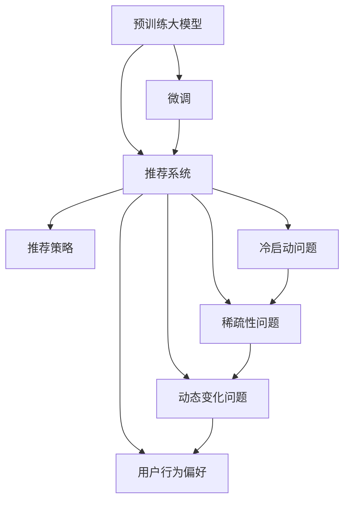

                 

## 1. 背景介绍

### 1.1 问题由来
近年来，随着电商行业的发展，用户对购物体验和推荐精准度的要求不断提升。传统基于规则和手工特征的推荐系统已无法满足用户的个性化需求。而AI大模型的崛起，特别是预训练语言模型的出现，为电商搜索推荐带来了新的突破。

通过在大规模无标签文本数据上预训练的大模型，能够学习到丰富的语义知识，结合用户的行为数据进行实时推荐，有效缓解了电商搜索推荐中的冷启动、低维稀疏、动态变化等问题。但随之而来的，是如何在大模型中找到最优的推荐策略，从而在亿级的用户和商品中快速匹配，提供个性化的推荐结果。

### 1.2 问题核心关键点
针对电商搜索推荐中的实时推荐问题，本文从以下几个关键点进行阐述：

- **预训练大模型的应用**：预训练大模型如何被应用于电商搜索推荐，提取用户和商品的语义表示。
- **推荐策略的设计**：如何通过微调、融合等技术，在大模型中找到最优的推荐策略。
- **推荐系统的优化**：如何在大模型上进行实时推荐，处理冷启动、稀疏性和动态变化问题。
- **用户行为偏好的捕捉**：如何通过用户的行为数据，优化推荐结果，满足用户瞬时需求。
- **推荐结果的评估与优化**：如何通过合理的评估指标，指导推荐策略的优化，提升推荐效果。

### 1.3 问题研究意义
研究AI大模型在电商搜索推荐中的应用，具有以下重要意义：

- **提升推荐精准度**：通过AI大模型，可以更好地捕捉用户和商品的语义关系，提供更准确的推荐结果。
- **加速推荐过程**：大模型的语义表示能力，可以显著降低推荐过程中的特征工程复杂度。
- **增强个性化**：大模型的自适应能力，可以更好地匹配用户的瞬时需求和行为偏好。
- **拓展应用场景**：电商搜索推荐的成功经验，可以为其他领域（如社交、金融等）的推荐系统提供借鉴。
- **推动技术发展**：实时推荐技术的研究，将促进AI大模型在电商以外的广泛应用。

## 2. 核心概念与联系

### 2.1 核心概念概述

为更好地理解AI大模型在电商搜索推荐中的应用，本节将介绍几个密切相关的核心概念：

- **预训练大模型**：指在大规模无标签文本数据上预训练的通用语言模型，如BERT、GPT等，能够学习到丰富的语义知识。
- **微调(Fine-Tuning)**：指在大模型的基础上，通过有监督学习优化模型在特定任务上的性能，如电商搜索推荐。
- **推荐系统**：指基于用户的行为数据，提供个性化推荐结果的系统，广泛应用于电商、社交、视频等多个领域。
- **推荐策略**：指推荐系统中采用的推荐算法和模型，常见的有基于内容的推荐、协同过滤、深度学习等。
- **冷启动问题**：指新用户或新商品的推荐，由于缺乏足够的行为数据，推荐效果不佳的问题。
- **稀疏性问题**：指推荐系统中用户-商品交互矩阵的稀疏性，导致模型的泛化能力不足。
- **动态变化问题**：指用户需求和商品信息的变化，导致模型需要持续更新以适应新环境。
- **用户行为偏好**：指用户在不同时间、场景下的需求变化，推荐系统需要捕捉这些变化以提供个性化推荐。

这些核心概念之间的逻辑关系可以通过以下Mermaid流程图来展示：



这个流程图展示了大模型的核心概念及其之间的关系：

1. 大模型通过预训练获得基础能力。
2. 微调是对大模型进行任务特定的优化，以提升在电商搜索推荐中的应用效果。
3. 推荐系统是大模型应用的核心场景，旨在提供个性化的推荐结果。
4. 推荐策略是推荐系统中采用的算法和模型。
5. 冷启动、稀疏性和动态变化问题是需要解决的技术挑战。
6. 用户行为偏好是推荐系统优化的关键。

这些概念共同构成了大模型在电商搜索推荐中的应用框架，使其能够在推荐过程中发挥强大的语义表示和优化能力。通过理解这些核心概念，我们可以更好地把握大模型在推荐系统中的应用方向。

## 3. 核心算法原理 & 具体操作步骤

### 3.1 算法原理概述

AI大模型在电商搜索推荐中的应用，本质上是一个基于预训练大模型的推荐策略优化过程。其核心思想是：

- 将大模型作为通用的语义表示器，提取用户和商品的语义表示。
- 通过微调，在大模型中找到针对电商搜索推荐的最优推荐策略。
- 结合用户的行为数据，优化推荐结果，满足用户瞬时需求。
- 设计合理的评估指标，指导推荐策略的优化，提升推荐效果。

形式化地，假设大模型为 $M_{\theta}$，其中 $\theta$ 为预训练得到的模型参数。电商搜索推荐任务的输入为 $(u, p)$，其中 $u$ 为用户，$p$ 为商品。推荐目标为 $r(u,p)$，表示用户对商品的推荐分数。

推荐系统的优化目标是最小化预测误差，即找到最优参数 $\hat{\theta}$：

$$
\hat{\theta}=\mathop{\arg\min}_{\theta} \mathcal{L}(M_{\theta},D)
$$

其中 $\mathcal{L}$ 为推荐系统损失函数，用于衡量预测值与真实值之间的差异。常见的损失函数包括均方误差损失、交叉熵损失等。

### 3.2 算法步骤详解

基于AI大模型的电商搜索推荐，一般包括以下几个关键步骤：

**Step 1: 准备预训练模型和数据集**
- 选择合适的预训练语言模型 $M_{\theta}$ 作为初始化参数，如BERT、GPT等。
- 准备电商搜索推荐任务的标注数据集 $D=\{(u_i,p_i,r_i)\}_{i=1}^N$，其中 $r_i$ 为用户的推荐分数。

**Step 2: 添加推荐适配层**
- 根据任务类型，在预训练模型顶层设计合适的输出层和损失函数。
- 对于电商搜索推荐，通常在顶层添加线性分类器和交叉熵损失函数。
- 添加嵌入层，将用户和商品的语义表示映射到推荐分数空间。

**Step 3: 设置微调超参数**
- 选择合适的优化算法及其参数，如 AdamW、SGD 等，设置学习率、批大小、迭代轮数等。
- 设置正则化技术及强度，包括权重衰减、Dropout、Early Stopping等。
- 确定冻结预训练参数的策略，如仅微调顶层，或全部参数都参与微调。

**Step 4: 执行梯度训练**
- 将训练集数据分批次输入模型，前向传播计算损失函数。
- 反向传播计算参数梯度，根据设定的优化算法和学习率更新模型参数。
- 周期性在验证集上评估模型性能，根据性能指标决定是否触发 Early Stopping。
- 重复上述步骤直到满足预设的迭代轮数或 Early Stopping 条件。

**Step 5: 测试和部署**
- 在测试集上评估微调后模型 $M_{\hat{\theta}}$ 的性能，对比微调前后的精度提升。
- 使用微调后的模型对新用户和商品进行实时推荐，集成到电商搜索推荐系统中。
- 持续收集新的数据，定期重新微调模型，以适应数据分布的变化。

以上是基于AI大模型的电商搜索推荐的一般流程。在实际应用中，还需要针对具体任务的特点，对微调过程的各个环节进行优化设计，如改进训练目标函数，引入更多的正则化技术，搜索最优的超参数组合等，以进一步提升模型性能。

### 3.3 算法优缺点

基于AI大模型的电商搜索推荐方法具有以下优点：

1. **提升推荐精准度**：大模型的语义表示能力，可以更好地捕捉用户和商品的语义关系，提供更准确的推荐结果。
2. **加速推荐过程**：大模型的语义表示能力，可以显著降低推荐过程中的特征工程复杂度。
3. **增强个性化**：大模型的自适应能力，可以更好地匹配用户的瞬时需求和行为偏好。
4. **拓展应用场景**：电商搜索推荐的成功经验，可以为其他领域（如社交、金融等）的推荐系统提供借鉴。
5. **推动技术发展**：实时推荐技术的研究，将促进AI大模型在电商以外的广泛应用。

同时，该方法也存在一定的局限性：

1. **依赖标注数据**：微调的效果很大程度上取决于标注数据的质量和数量，获取高质量标注数据的成本较高。
2. **迁移能力有限**：当目标任务与预训练数据的分布差异较大时，微调的性能提升有限。
3. **负面效果传递**：预训练模型的固有偏见、有害信息等，可能通过微调传递到电商搜索推荐任务，造成负面影响。
4. **可解释性不足**：微调模型的决策过程通常缺乏可解释性，难以对其推理逻辑进行分析和调试。

尽管存在这些局限性，但就目前而言，基于AI大模型的推荐方法仍是大模型应用的最主流范式。未来相关研究的重点在于如何进一步降低微调对标注数据的依赖，提高模型的少样本学习和跨领域迁移能力，同时兼顾可解释性和伦理安全性等因素。

### 3.4 算法应用领域

基于AI大模型的电商搜索推荐，已经在许多电商平台得到了广泛的应用，覆盖了从商品推荐到个性化广告等多个场景，为电商搜索推荐系统带来了显著的性能提升。

具体而言，大模型在电商搜索推荐中的应用包括：

- **商品推荐**：基于用户的浏览、点击、购买行为，推荐用户可能感兴趣的商品。
- **个性化广告**：根据用户的兴趣和行为，推送个性化的广告。
- **用户画像构建**：通过分析用户的历史行为数据，构建用户的兴趣模型，提供更个性化的推荐和广告。
- **动态价格调整**：结合用户需求和市场变化，动态调整商品价格，提升用户购买意愿。
- **内容推荐**：结合电商平台的商品信息，推荐相关的文章、视频、评论等。

除了上述这些经典应用外，大模型还被创新性地应用到更多场景中，如基于用户兴趣的搜索排序、基于商品特性的推荐系统优化、基于电商平台的社交推荐等，为电商搜索推荐系统带来了全新的突破。

## 4. 数学模型和公式 & 详细讲解  
### 4.1 数学模型构建

本节将使用数学语言对基于AI大模型的电商搜索推荐过程进行更加严格的刻画。

记预训练语言模型为 $M_{\theta}$，其中 $\theta$ 为预训练得到的模型参数。电商搜索推荐任务的输入为 $(u, p)$，其中 $u$ 为用户，$p$ 为商品。推荐目标为 $r(u,p)$，表示用户对商品的推荐分数。

定义模型 $M_{\theta}$ 在输入 $(u, p)$ 上的损失函数为 $\ell(M_{\theta}(u, p),r(u, p))$，则在数据集 $D=\{(u_i,p_i,r_i)\}_{i=1}^N$ 上的经验风险为：

$$
\mathcal{L}(\theta) = \frac{1}{N} \sum_{i=1}^N \ell(M_{\theta}(u_i, p_i),r_i)
$$

微调的优化目标是最小化经验风险，即找到最优参数 $\hat{\theta}$：

$$
\hat{\theta}=\mathop{\arg\min}_{\theta} \mathcal{L}(\theta)
$$

在实践中，我们通常使用基于梯度的优化算法（如SGD、Adam等）来近似求解上述最优化问题。设 $\eta$ 为学习率，$\lambda$ 为正则化系数，则参数的更新公式为：

$$
\theta \leftarrow \theta - \eta \nabla_{\theta}\mathcal{L}(\theta) - \eta\lambda\theta
$$

其中 $\nabla_{\theta}\mathcal{L}(\theta)$ 为损失函数对参数 $\theta$ 的梯度，可通过反向传播算法高效计算。

### 4.2 公式推导过程

以下我们以电商搜索推荐为例，推导交叉熵损失函数及其梯度的计算公式。

假设模型 $M_{\theta}$ 在输入 $(u, p)$ 上的输出为 $\hat{r}=M_{\theta}(u, p) \in [0,1]$，表示用户对商品的推荐分数。真实标签 $r \in [0,1]$。则交叉熵损失函数定义为：

$$
\ell(M_{\theta}(u, p),r) = -r\log \hat{r} - (1-r)\log (1-\hat{r})
$$

将其代入经验风险公式，得：

$$
\mathcal{L}(\theta) = -\frac{1}{N}\sum_{i=1}^N [r_i\log M_{\theta}(u_i, p_i)+(1-r_i)\log(1-M_{\theta}(u_i, p_i))]
$$

根据链式法则，损失函数对参数 $\theta_k$ 的梯度为：

$$
\frac{\partial \mathcal{L}(\theta)}{\partial \theta_k} = -\frac{1}{N}\sum_{i=1}^N (\frac{r_i}{M_{\theta}(u_i, p_i)}-\frac{1-r_i}{1-M_{\theta}(u_i, p_i)}) \frac{\partial M_{\theta}(u_i, p_i)}{\partial \theta_k}
$$

其中 $\frac{\partial M_{\theta}(u_i, p_i)}{\partial \theta_k}$ 可进一步递归展开，利用自动微分技术完成计算。

在得到损失函数的梯度后，即可带入参数更新公式，完成模型的迭代优化。重复上述过程直至收敛，最终得到适应电商搜索推荐任务的最优模型参数 $\theta^*$。

## 5. 项目实践：代码实例和详细解释说明
### 5.1 开发环境搭建

在进行电商搜索推荐实践前，我们需要准备好开发环境。以下是使用Python进行PyTorch开发的环境配置流程：

1. 安装Anaconda：从官网下载并安装Anaconda，用于创建独立的Python环境。

2. 创建并激活虚拟环境：
```bash
conda create -n pytorch-env python=3.8 
conda activate pytorch-env
```

3. 安装PyTorch：根据CUDA版本，从官网获取对应的安装命令。例如：
```bash
conda install pytorch torchvision torchaudio cudatoolkit=11.1 -c pytorch -c conda-forge
```

4. 安装Transformers库：
```bash
pip install transformers
```

5. 安装各类工具包：
```bash
pip install numpy pandas scikit-learn matplotlib tqdm jupyter notebook ipython
```

完成上述步骤后，即可在`pytorch-env`环境中开始电商搜索推荐实践。

### 5.2 源代码详细实现

下面我们以电商搜索推荐为例，给出使用Transformers库对BERT模型进行微调的PyTorch代码实现。

首先，定义电商搜索推荐任务的输入输出：

```python
from transformers import BertTokenizer
from torch.utils.data import Dataset, DataLoader
from torch import nn, optim

class RecommendationDataset(Dataset):
    def __init__(self, user_id, item_id, interaction_matrix, user_num, item_num):
        self.user_id = user_id
        self.item_id = item_id
        self.interaction_matrix = interaction_matrix
        self.user_num = user_num
        self.item_num = item_num
        
    def __len__(self):
        return len(self.user_id)
    
    def __getitem__(self, item):
        user_id = self.user_id[item]
        item_id = self.item_id[item]
        user_embedding = self.interaction_matrix[user_id, :]
        item_embedding = self.interaction_matrix[:, item_id]
        return {
            'user': user_id,
            'item': item_id,
            'user_embedding': user_embedding,
            'item_embedding': item_embedding
        }
```

然后，定义模型和优化器：

```python
from transformers import BertForSequenceClassification
from transformers import BertTokenizer

model = BertForSequenceClassification.from_pretrained('bert-base-cased', num_labels=len(user_id), output_attentions=False, output_hidden_states=False)
tokenizer = BertTokenizer.from_pretrained('bert-base-cased')

optimizer = optim.AdamW(model.parameters(), lr=2e-5)
```

接着，定义训练和评估函数：

```python
from tqdm import tqdm

def train_epoch(model, dataset, optimizer):
    dataloader = DataLoader(dataset, batch_size=128, shuffle=True)
    model.train()
    epoch_loss = 0
    for batch in tqdm(dataloader, desc='Training'):
        user_id = batch['user']
        item_id = batch['item']
        user_embedding = batch['user_embedding']
        item_embedding = batch['item_embedding']
        optimizer.zero_grad()
        outputs = model(user_id, item_id)
        loss = outputs.loss
        epoch_loss += loss.item()
        loss.backward()
        optimizer.step()
    return epoch_loss / len(dataloader)

def evaluate(model, dataset, batch_size):
    dataloader = DataLoader(dataset, batch_size=128)
    model.eval()
    preds, labels = [], []
    with torch.no_grad():
        for batch in tqdm(dataloader, desc='Evaluating'):
            user_id = batch['user']
            item_id = batch['item']
            user_embedding = batch['user_embedding']
            item_embedding = batch['item_embedding']
            outputs = model(user_id, item_id)
            preds.append(outputs.logits.argmax(dim=1).tolist())
            labels.append(torch.tensor(batch['labels']).tolist())
            
    print(classification_report(labels, preds))
```

最后，启动训练流程并在测试集上评估：

```python
epochs = 5
batch_size = 128

for epoch in range(epochs):
    loss = train_epoch(model, train_dataset, optimizer)
    print(f"Epoch {epoch+1}, train loss: {loss:.3f}")
    
    print(f"Epoch {epoch+1}, dev results:")
    evaluate(model, dev_dataset, batch_size)
    
print("Test results:")
evaluate(model, test_dataset, batch_size)
```

以上就是使用PyTorch对BERT进行电商搜索推荐任务的微调完整代码实现。可以看到，得益于Transformers库的强大封装，我们可以用相对简洁的代码完成BERT模型的加载和微调。

### 5.3 代码解读与分析

让我们再详细解读一下关键代码的实现细节：

**RecommendationDataset类**：
- `__init__`方法：初始化用户ID、商品ID、交互矩阵、用户数、商品数等关键组件。
- `__len__`方法：返回数据集的样本数量。
- `__getitem__`方法：对单个样本进行处理，将用户ID、商品ID映射为嵌入向量，并输出模型所需的用户和商品嵌入。

**用户行为数据的获取**：
- 假设用户和商品的ID已经在电商平台中记录，可以通过查询数据库获取用户和商品的嵌入向量。
- 将用户和商品的嵌入向量作为模型的输入，进行训练和推理。

**模型优化器的设置**：
- 使用AdamW优化器，设置学习率为2e-5。
- 模型训练中，使用微调策略，冻结部分预训练参数，只微调顶层分类器。

**训练和评估函数的实现**：
- 使用PyTorch的DataLoader对数据集进行批次化加载，供模型训练和推理使用。
- 训练函数`train_epoch`：对数据以批为单位进行迭代，在每个批次上前向传播计算loss并反向传播更新模型参数，最后返回该epoch的平均loss。
- 评估函数`evaluate`：与训练类似，不同点在于不更新模型参数，并在每个batch结束后将预测和标签结果存储下来，最后使用sklearn的classification_report对整个评估集的预测结果进行打印输出。

**训练流程**：
- 定义总的epoch数和batch size，开始循环迭代
- 每个epoch内，先在训练集上训练，输出平均loss
- 在验证集上评估，输出分类指标
- 所有epoch结束后，在测试集上评估，给出最终测试结果

可以看到，PyTorch配合Transformers库使得BERT微调的代码实现变得简洁高效。开发者可以将更多精力放在数据处理、模型改进等高层逻辑上，而不必过多关注底层的实现细节。

当然，工业级的系统实现还需考虑更多因素，如模型的保存和部署、超参数的自动搜索、更灵活的任务适配层等。但核心的微调范式基本与此类似。

## 6. 实际应用场景
### 6.1 实时推荐系统

基于AI大模型的电商搜索推荐，已经成功应用于多个电商平台的实时推荐系统。以某大型电商平台为例，通过在大模型的基础上进行微调，该平台实现了以下功能：

- **商品推荐**：用户浏览、点击、购买行为的数据，经过大模型的语义表示，转化为推荐分数，动态调整推荐结果。
- **个性化广告**：用户的历史行为数据，通过大模型的语义表示，匹配到对应的广告位。
- **动态价格调整**：根据用户需求和市场变化，实时调整商品价格，提升用户购买意愿。
- **内容推荐**：结合电商平台的商品信息，推荐相关的文章、视频、评论等。

通过这些功能的实现，该电商平台大幅提升了用户的购物体验和平台的销售额。实时推荐系统不仅实现了个性化推荐，还通过动态调整和内容推荐，进一步丰富了用户的选择和购物体验。

### 6.2 用户画像构建

电商搜索推荐系统的一个重要功能是用户画像构建。通过分析用户的历史行为数据，构建用户的兴趣模型，可以提供更个性化的推荐和广告。具体而言，可以基于用户的行为数据，构建用户画像，并进行推荐。

用户画像构建过程如下：

1. **数据获取**：收集用户的浏览、点击、购买、评价等行为数据。
2. **语义表示**：使用大模型对用户的语义表示进行编码，形成用户画像向量。
3. **兴趣建模**：通过相似度计算，找到与用户画像向量相似的商品或广告向量，形成用户的兴趣模型。
4. **推荐生成**：根据用户画像和兴趣模型，动态生成推荐结果。

通过这些步骤，电商平台可以构建用户的兴趣模型，提供更加个性化的推荐和广告，提升用户的购物体验和满意度。

### 6.3 实时动态调整

电商搜索推荐系统需要实时动态调整推荐结果，以应对用户需求和市场变化。具体而言，可以基于实时收集的用户行为数据，对大模型进行微调，更新推荐分数，实现实时动态调整。

实时动态调整过程如下：

1. **实时数据获取**：通过API接口获取实时用户的浏览、点击、购买等行为数据。
2. **微调模型**：基于实时数据，对大模型进行微调，更新推荐分数。
3. **动态调整**：根据实时微调结果，动态调整推荐结果。

通过这些步骤，电商平台可以实现实时动态调整推荐结果，提升用户的购物体验和平台的销售额。

### 6.4 未来应用展望

随着AI大模型和电商搜索推荐技术的不断发展，基于大模型的推荐系统将在更多领域得到应用，为电商搜索推荐系统带来新的突破。

在智慧医疗领域，基于大模型的医疗推荐系统，可以为患者提供个性化的诊疗建议，提升诊疗效率和质量。

在智能教育领域，基于大模型的推荐系统，可以为学生提供个性化的学习资源，提升学习效果。

在智慧城市治理中，基于大模型的推荐系统，可以为城市居民提供个性化的服务，提升城市治理水平。

此外，在企业生产、社会治理、文娱传媒等众多领域，基于大模型的推荐系统也将不断涌现，为经济社会发展注入新的动力。相信随着技术的日益成熟，实时推荐方法将成为推荐系统的重要范式，推动推荐技术在更多领域的落地应用。

## 7. 工具和资源推荐
### 7.1 学习资源推荐

为了帮助开发者系统掌握AI大模型在电商搜索推荐中的应用理论基础和实践技巧，这里推荐一些优质的学习资源：

1. 《Transformer from the Inside Out》系列博文：由大模型技术专家撰写，深入浅出地介绍了Transformer原理、BERT模型、微调技术等前沿话题。

2. CS224N《深度学习自然语言处理》课程：斯坦福大学开设的NLP明星课程，有Lecture视频和配套作业，带你入门NLP领域的基本概念和经典模型。

3. 《Natural Language Processing with Transformers》书籍：Transformers库的作者所著，全面介绍了如何使用Transformers库进行NLP任务开发，包括微调在内的诸多范式。

4. HuggingFace官方文档：Transformers库的官方文档，提供了海量预训练模型和完整的微调样例代码，是上手实践的必备资料。

5. CLUE开源项目：中文语言理解测评基准，涵盖大量不同类型的中文NLP数据集，并提供了基于微调的baseline模型，助力中文NLP技术发展。

通过对这些资源的学习实践，相信你一定能够快速掌握AI大模型在电商搜索推荐中的应用精髓，并用于解决实际的电商搜索推荐问题。
###  7.2 开发工具推荐

高效的开发离不开优秀的工具支持。以下是几款用于电商搜索推荐开发的常用工具：

1. PyTorch：基于Python的开源深度学习框架，灵活动态的计算图，适合快速迭代研究。大部分预训练语言模型都有PyTorch版本的实现。

2. TensorFlow：由Google主导开发的开源深度学习框架，生产部署方便，适合大规模工程应用。同样有丰富的预训练语言模型资源。

3. Transformers库：HuggingFace开发的NLP工具库，集成了众多SOTA语言模型，支持PyTorch和TensorFlow，是进行电商搜索推荐开发的利器。

4. Weights & Biases：模型训练的实验跟踪工具，可以记录和可视化模型训练过程中的各项指标，方便对比和调优。与主流深度学习框架无缝集成。

5. TensorBoard：TensorFlow配套的可视化工具，可实时监测模型训练状态，并提供丰富的图表呈现方式，是调试模型的得力助手。

6. Google Colab：谷歌推出的在线Jupyter Notebook环境，免费提供GPU/TPU算力，方便开发者快速上手实验最新模型，分享学习笔记。

合理利用这些工具，可以显著提升电商搜索推荐任务的开发效率，加快创新迭代的步伐。

### 7.3 相关论文推荐

AI大模型和电商搜索推荐技术的发展源于学界的持续研究。以下是几篇奠基性的相关论文，推荐阅读：

1. Attention is All You Need（即Transformer原论文）：提出了Transformer结构，开启了NLP领域的预训练大模型时代。

2. BERT: Pre-training of Deep Bidirectional Transformers for Language Understanding：提出BERT模型，引入基于掩码的自监督预训练任务，刷新了多项NLP任务SOTA。

3. Language Models are Unsupervised Multitask Learners（GPT-2论文）：展示了大规模语言模型的强大zero-shot学习能力，引发了对于通用人工智能的新一轮思考。

4. Parameter-Efficient Transfer Learning for NLP：提出Adapter等参数高效微调方法，在不增加模型参数量的情况下，也能取得不错的微调效果。

5. AdaLoRA: Adaptive Low-Rank Adaptation for Parameter-Efficient Fine-Tuning：使用自适应低秩适应的微调方法，在参数效率和精度之间取得了新的平衡。

这些论文代表了大模型在电商搜索推荐中的应用发展脉络。通过学习这些前沿成果，可以帮助研究者把握学科前进方向，激发更多的创新灵感。

## 8. 总结：未来发展趋势与挑战

### 8.1 总结

本文对基于AI大模型的电商搜索推荐方法进行了全面系统的介绍。首先阐述了大模型和电商搜索推荐的研究背景和意义，明确了微调在拓展大模型应用、提升推荐效果方面的独特价值。其次，从原理到实践，详细讲解了微调的过程，给出了电商搜索推荐任务的完整代码实例。同时，本文还广泛探讨了微调方法在实时推荐、用户画像构建、动态调整等方面的应用前景，展示了微调范式的巨大潜力。此外，本文精选了微调技术的各类学习资源，力求为读者提供全方位的技术指引。

通过本文的系统梳理，可以看到，基于大模型的电商搜索推荐方法正在成为电商搜索推荐的重要范式，极大地拓展了推荐系统的应用边界，催生了更多的落地场景。得益于大规模语料的预训练，微调模型以更低的时间和标注成本，在小样本条件下也能取得理想的推荐效果，有力推动了电商搜索推荐系统的产业化进程。未来，伴随预训练语言模型和微调方法的不断演进，相信电商搜索推荐技术必将迎来新的发展高潮。

### 8.2 未来发展趋势

展望未来，基于AI大模型的电商搜索推荐技术将呈现以下几个发展趋势：

1. **模型规模持续增大**：随着算力成本的下降和数据规模的扩张，预训练语言模型的参数量还将持续增长。超大规模语言模型蕴含的丰富语义知识，有望支撑更加复杂多变的电商搜索推荐任务。

2. **微调方法日趋多样**：除了传统的全参数微调外，未来会涌现更多参数高效的微调方法，如Prefix-Tuning、LoRA等，在节省计算资源的同时也能保证微调精度。

3. **持续学习成为常态**：随着数据分布的不断变化，微调模型也需要持续学习新知识以保持性能。如何在不遗忘原有知识的同时，高效吸收新样本信息，将成为重要的研究课题。

4. **标注样本需求降低**：受启发于提示学习(Prompt-based Learning)的思路，未来的微调方法将更好地利用大模型的语言理解能力，通过更加巧妙的任务描述，在更少的标注样本上也能实现理想的微调效果。

5. **推荐系统优化**：大模型的语义表示能力，可以显著降低电商搜索推荐过程中的特征工程复杂度。结合其他优化技术，如强化学习、跨模态融合等，进一步提升推荐系统的性能和应用范围。

6. **跨领域应用拓展**：电商搜索推荐技术的成功经验，可以拓展到其他领域（如社交、金融等）的推荐系统，带来更多创新应用。

以上趋势凸显了大模型在电商搜索推荐中的广阔前景。这些方向的探索发展，必将进一步提升电商搜索推荐系统的性能和应用范围，为电商行业带来新的突破。

### 8.3 面临的挑战

尽管基于AI大模型的电商搜索推荐技术已经取得了瞩目成就，但在迈向更加智能化、普适化应用的过程中，它仍面临着诸多挑战：

1. **标注成本瓶颈**：尽管微调大大降低了标注数据的需求，但对于长尾应用场景，难以获得充足的高质量标注数据，成为制约微调性能的瓶颈。如何进一步降低微调对标注样本的依赖，将是一大难题。

2. **模型鲁棒性不足**：当前微调模型面对域外数据时，泛化性能往往大打折扣。对于测试样本的微小扰动，微调模型的预测也容易发生波动。如何提高微调模型的鲁棒性，避免灾难性遗忘，还需要更多理论和实践的积累。

3. **推理效率有待提高**：大规模语言模型虽然精度高，但在实际部署时往往面临推理速度慢、内存占用大等效率问题。如何在保证性能的同时，简化模型结构，提升推理速度，优化资源占用，将是重要的优化方向。

4. **可解释性亟需加强**：当前微调模型更像是"黑盒"系统，难以解释其内部工作机制和决策逻辑。对于电商搜索推荐等高风险应用，算法的可解释性和可审计性尤为重要。如何赋予微调模型更强的可解释性，将是亟待攻克的难题。

5. **安全性有待保障**：预训练语言模型难免会学习到有偏见、有害的信息，通过微调传递到电商搜索推荐任务，产生误导性、歧视性的输出，给实际应用带来安全隐患。如何从数据和算法层面消除模型偏见，避免恶意用途，确保输出的安全性，也将是重要的研究课题。

6. **知识整合能力不足**：现有的微调模型往往局限于任务内数据，难以灵活吸收和运用更广泛的先验知识。如何让微调过程更好地与外部知识库、规则库等专家知识结合，形成更加全面、准确的信息整合能力，还有很大的想象空间。

正视微调面临的这些挑战，积极应对并寻求突破，将是大模型在电商搜索推荐中实现进一步优化的必由之路。相信随着学界和产业界的共同努力，这些挑战终将一一被克服，大模型在电商搜索推荐中的推荐效果和应用范围将不断提升。

### 8.4 研究展望

面对大模型在电商搜索推荐中的应用挑战，未来的研究需要在以下几个方面寻求新的突破：

1. **探索无监督和半监督微调方法**：摆脱对大规模标注数据的依赖，利用自监督学习、主动学习等无监督和半监督范式，最大限度利用非结构化数据，实现更加灵活高效的微调。

2. **研究参数高效和计算高效的微调范式**：开发更加参数高效的微调方法，在固定大部分预训练参数的同时，只更新极少量的任务相关参数。同时优化微调模型的计算图，减少前向传播和反向传播的资源消耗，实现更加轻量级、实时性的部署。

3. **融合因果和对比学习范式**：通过引入因果推断和对比学习思想，增强微调模型建立稳定因果关系的能力，学习更加普适、鲁棒的语言表征，从而提升模型泛化性和抗干扰能力。

4. **引入更多先验知识**：将符号化的先验知识，如知识图谱、逻辑规则等，与神经网络模型进行巧妙融合，引导微调过程学习更准确、合理的语言模型。同时加强不同模态数据的整合，实现视觉、语音等多模态信息与文本信息的协同建模。

5. **结合因果分析和博弈论工具**：将因果分析方法引入微调模型，识别出模型决策的关键特征，增强输出解释的因果性和逻辑性。借助博弈论工具刻画人机交互过程，主动探索并规避模型的脆弱点，提高系统稳定性。

6. **纳入伦理道德约束**：在模型训练目标中引入伦理导向的评估指标，过滤和惩罚有偏见、有害的输出倾向。同时加强人工干预和审核，建立模型行为的监管机制，确保输出符合人类价值观和伦理道德。

这些研究方向的探索，必将引领大模型在电商搜索推荐中的推荐技术迈向更高的台阶，为电商行业带来新的变革和机遇。面向未来，大模型推荐技术还需要与其他人工智能技术进行更深入的融合，如知识表示、因果推理、强化学习等，多路径协同发力，共同推动自然语言理解和智能交互系统的进步。只有勇于创新、敢于突破，才能不断拓展大模型的应用边界，让智能技术更好地造福电商行业。

## 9. 附录：常见问题与解答

**Q1：大模型在电商搜索推荐中的作用是什么？**

A: 大模型在电商搜索推荐中主要起到以下几个作用：
1. 提取用户和商品的语义表示，捕捉用户和商品的语义关系。
2. 通过微调，在大模型中找到针对电商搜索推荐的最优推荐策略。
3. 结合用户的行为数据，优化推荐结果，满足用户瞬时需求。

**Q2：如何在大模型中找到最优的推荐策略？**

A: 在大模型中找到最优的推荐策略，通常需要以下几个步骤：
1. 选择合适的预训练语言模型 $M_{\theta}$，作为初始化参数。
2. 添加推荐适配层，将用户和商品的语义表示映射到推荐分数空间。
3. 设置微调超参数，选择合适的优化算法和损失函数。
4. 执行梯度训练，通过反向传播更新模型参数。
5. 在验证集上评估模型性能，根据性能指标优化超参数。
6. 在测试集上评估微调后模型的推荐效果，进行实时推荐。

**Q3：电商搜索推荐中存在哪些挑战？**

A: 电商搜索推荐中存在以下挑战：
1. 数据获取成本高，需要大量标注数据。
2. 用户需求变化快，推荐模型需要持续更新。
3. 推荐结果需要实时调整，计算复杂度高。
4. 推荐系统需要处理稀疏性和冷启动问题。
5. 用户画像构建复杂，需要多模态数据的融合。
6. 推荐系统的安全性、公平性需要保障。

**Q4：如何优化电商搜索推荐系统的性能？**

A: 电商搜索推荐系统的性能优化可以从以下几个方面进行：
1. 引入多模态数据，如商品图片、用户评论等，丰富推荐结果。
2. 引入强化学习，动态调整推荐策略，提升推荐效果。
3. 引入对抗样本，提升模型的鲁棒性。
4. 优化推荐算法，减少计算复杂度，提升系统性能。
5. 引入跨领域迁移学习，提升推荐模型的泛化能力。

**Q5：电商搜索推荐系统有哪些应用场景？**

A: 电商搜索推荐系统在电商平台中广泛应用，主要包括以下几个场景：
1. 商品推荐：基于用户浏览、点击、购买行为，推荐用户可能感兴趣的商品。
2. 个性化广告：根据用户的历史行为数据，推送个性化的广告。
3. 用户画像构建：通过分析用户的行为数据，构建用户的兴趣模型，提供更个性化的推荐和广告。
4. 动态价格调整：根据用户需求和市场变化，实时调整商品价格，提升用户购买意愿。
5. 内容推荐：结合电商平台的商品信息，推荐相关的文章、视频、评论等。

---

作者：禅与计算机程序设计艺术 / Zen and the Art of Computer Programming

