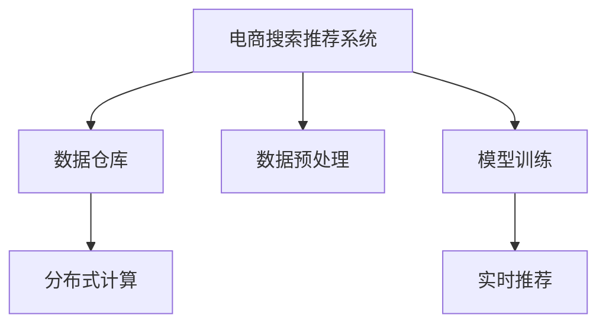

                 

## 1. 背景介绍

电商搜索推荐系统是电子商务平台的重要组成部分，旨在帮助用户快速找到其感兴趣的商品，提升用户体验和平台销售额。随着电商市场竞争加剧，个性化推荐系统的复杂度日益增加，如何有效处理大规模、高实时性的数据，成为系统性能和用户体验的关键因素。

在大数据时代，电商平台生成的数据量呈指数级增长，如何高效处理和分析这些数据，提取用户兴趣和行为特征，并生成精准的推荐结果，是大数据应用的一个核心挑战。本文将探讨大模型在电商搜索推荐中数据处理能力的要求，涵盖数据存储、数据预处理、模型训练和推理等关键环节。

## 2. 核心概念与联系

### 2.1 核心概念概述

为更好地理解大模型在电商搜索推荐中的数据处理能力要求，本节将介绍几个密切相关的核心概念：

- **电商搜索推荐系统（E-commerce Search and Recommendation System）**：基于用户行为数据和商品特征，推荐符合用户兴趣的商品系统。该系统通过分析用户浏览、点击、购买等行为数据，挖掘用户兴趣，并推荐相关商品。

- **数据仓库（Data Warehouse）**：用于集中存储电商交易、用户行为等数据的复杂数据库系统。数据仓库能够高效支持大规模数据的存储、查询和分析，是电商搜索推荐系统的数据源。

- **数据预处理（Data Preprocessing）**：对原始数据进行清洗、转换、整合等操作，提取有价值的信息和特征。数据预处理通常包括缺失值处理、异常值检测、特征工程等步骤。

- **模型训练（Model Training）**：通过优化算法（如梯度下降）更新模型参数，使得模型能够拟合训练数据，并产生推荐结果。模型训练通常需要大量标注数据和计算资源。

- **实时推荐（Real-time Recommendation）**：在用户操作时，快速响应用户请求，生成并推送个性化推荐结果。实时推荐要求系统具备高效的推理计算能力。

- **分布式计算（Distributed Computing）**：通过多台计算资源协同工作，处理大规模数据集。分布式计算能够提升数据处理的效率和扩展性。

这些核心概念之间的逻辑关系可以通过以下Mermaid流程图来展示：



这个流程图展示了电商搜索推荐系统的核心组件及其关系：数据仓库提供数据源，数据预处理提取特征，模型训练得到推荐模型，实时推荐产生推荐结果。同时，分布式计算保证了数据处理的效率和扩展性。

## 3. 核心算法原理 & 具体操作步骤

### 3.1 算法原理概述

电商搜索推荐系统中的数据处理能力，涉及数据采集、存储、清洗、特征提取、模型训练和推理等多个环节。其核心算法原理包括以下几个方面：

- **数据采集与存储**：从电商平台采集用户行为和商品信息，并存储到数据仓库中。
- **数据预处理**：对数据仓库中的原始数据进行清洗、转换和整合，提取有价值的用户行为和商品特征。
- **特征工程**：设计并提取有效特征，如用户兴趣、商品属性、时间等，为模型训练提供输入。
- **模型训练**：使用优化算法（如深度学习框架中的梯度下降算法）训练推荐模型，学习用户和商品的表示和关系。
- **实时推荐**：在用户操作时，实时响应请求，根据用户行为和模型预测，生成推荐结果。

### 3.2 算法步骤详解

大模型在电商搜索推荐系统中的应用，通常包括以下几个关键步骤：

**Step 1: 数据采集与存储**

- **数据采集**：从电商平台的各个业务系统（如订单系统、用户行为系统、商品系统等）中，采集用户行为数据、商品信息、交易记录等。
- **数据存储**：将采集到的数据存储到分布式数据仓库中，如Hadoop、Spark等。数据仓库应具备高效的读写能力和可扩展性，支持大规模数据的存储和查询。

**Step 2: 数据预处理**

- **数据清洗**：检测并处理数据中的缺失值、异常值和噪声，确保数据质量。
- **特征工程**：设计并提取有效特征，如用户兴趣、商品属性、时间等，为模型训练提供输入。常用的特征工程方法包括One-Hot编码、标准化、归一化等。
- **数据转换**：将原始数据转换为模型所需的格式，如将文本数据转换为向量表示。

**Step 3: 特征表示与模型训练**

- **特征表示**：将清洗和转换后的特征输入到大模型中进行表示学习，如BERT、GPT等。大模型能够学习到丰富的特征表示，捕获复杂的用户和商品关系。
- **模型训练**：使用标注数据集训练推荐模型，常用的优化算法包括Adam、SGD等。模型训练应设置合适的超参数，如学习率、批大小等。

**Step 4: 实时推荐**

- **推理计算**：在用户操作时，将用户行为数据输入到模型中进行推理计算，生成推荐结果。
- **响应处理**：对推荐结果进行排序和筛选，根据用户行为和模型预测，产生最终的推荐列表。

### 3.3 算法优缺点

大模型在电商搜索推荐系统中的应用，具有以下优点：

1. **高性能**：大模型能够高效处理和分析大规模数据，提取复杂的用户和商品关系，生成高质量的推荐结果。
2. **灵活性**：大模型具有很强的泛化能力，适用于多种电商搜索推荐场景，能够灵活应对不同用户和商品特征。
3. **可解释性**：大模型能够提供推荐结果的解释，帮助用户理解推荐的原因，提升用户满意度。

同时，大模型也存在一些缺点：

1. **资源消耗大**：大模型通常需要大量的计算资源和存储空间，对系统硬件要求较高。
2. **训练时间长**：大模型的训练通常需要大量的标注数据和计算资源，训练时间较长。
3. **过拟合风险**：在大规模数据训练时，模型容易过拟合，需要采用正则化等技术进行控制。

### 3.4 算法应用领域

大模型在电商搜索推荐系统中的应用，不仅限于商品推荐，还可以扩展到以下领域：

1. **搜索排序**：根据用户查询词，生成最相关的搜索结果，提升搜索体验。
2. **内容推荐**：推荐新闻、文章、视频等用户感兴趣的内容，提高内容消费体验。
3. **价格优化**：通过分析用户行为和市场需求，优化商品价格策略，提升销售收益。
4. **库存管理**：预测商品需求和库存变化，优化库存水平，减少库存积压和缺货现象。
5. **个性化营销**：针对不同用户群体，设计个性化营销策略，提升营销效果。

## 4. 数学模型和公式 & 详细讲解 & 举例说明

### 4.1 数学模型构建

本节将使用数学语言对大模型在电商搜索推荐系统中的应用进行更加严格的刻画。

记电商搜索推荐系统中的用户行为数据为 $\mathcal{U}=\{u_1, u_2, \ldots, u_N\}$，商品信息为 $\mathcal{I}=\{i_1, i_2, \ldots, i_M\}$。设用户 $u$ 对商品 $i$ 的评分向量为 $\mathbf{r}_u^i$，即：

$$
\mathbf{r}_u^i = [r_{u, i}^{(1)}, r_{u, i}^{(2)}, \ldots, r_{u, i}^{(K)}]
$$

其中 $r_{u, i}^{(k)}$ 表示用户 $u$ 对商品 $i$ 的评分在维度 $k$ 上的值。

设大模型在输入 $\mathbf{r}_u^i$ 时的输出为 $\mathbf{p}_u^i$，即：

$$
\mathbf{p}_u^i = \text{Model}(\mathbf{r}_u^i)
$$

大模型通过学习用户行为和商品特征之间的关系，预测用户对商品的评分。

### 4.2 公式推导过程

假设大模型为 BERT，输入为用户的评分向量 $\mathbf{r}_u^i$，输出为评分预测向量 $\mathbf{p}_u^i$。则模型的训练目标为最小化预测评分与真实评分之间的差距：

$$
\mathcal{L}(\theta) = \frac{1}{N}\sum_{u=1}^N\frac{1}{M}\sum_{i=1}^M \sum_{k=1}^K (r_{u, i}^{(k)} - p_{u, i}^{(k)})^2
$$

其中 $\theta$ 为大模型的参数。通过优化算法（如Adam、SGD等）更新模型参数，使得模型预测的评分尽可能接近真实评分。

### 4.3 案例分析与讲解

以一个简单的电商搜索推荐系统为例，分析大模型在其中的数据处理能力。假设系统记录了10000个用户的浏览和购买行为，每个用户对1000个商品的评分。使用大模型（如BERT）进行训练和推理，对每个用户的评分进行预测，并生成推荐结果。

**数据采集与存储**：从电商平台的订单系统、用户行为系统和商品系统采集用户行为数据、商品信息和交易记录，存储到Hadoop分布式数据仓库中。

**数据预处理**：对数据进行清洗，处理缺失值和异常值，提取用户兴趣、商品属性和交易时间等特征。

**特征表示与模型训练**：使用BERT对用户评分向量进行表示学习，生成评分预测向量。使用标注数据集（如用户购买行为）训练模型，学习用户和商品的关系。

**实时推荐**：在用户搜索商品时，将用户的搜索词和浏览行为输入到模型中进行推理计算，生成推荐列表。

## 5. 项目实践：代码实例和详细解释说明

### 5.1 开发环境搭建

在进行项目实践前，我们需要准备好开发环境。以下是使用Python进行PyTorch开发的环境配置流程：

1. 安装Anaconda：从官网下载并安装Anaconda，用于创建独立的Python环境。

2. 创建并激活虚拟环境：
```bash
conda create -n pytorch-env python=3.8 
conda activate pytorch-env
```

3. 安装PyTorch：根据CUDA版本，从官网获取对应的安装命令。例如：
```bash
conda install pytorch torchvision torchaudio cudatoolkit=11.1 -c pytorch -c conda-forge
```

4. 安装Transformers库：
```bash
pip install transformers
```

5. 安装各类工具包：
```bash
pip install numpy pandas scikit-learn matplotlib tqdm jupyter notebook ipython
```

完成上述步骤后，即可在`pytorch-env`环境中开始项目实践。

### 5.2 源代码详细实现

下面我们以电商搜索推荐系统为例，给出使用Transformers库对BERT模型进行训练和推理的PyTorch代码实现。

首先，定义数据集：

```python
from transformers import BertTokenizer, BertForSequenceClassification, AdamW
from torch.utils.data import Dataset, DataLoader
import torch

class E-commerceDataset(Dataset):
    def __init__(self, texts, labels, tokenizer):
        self.texts = texts
        self.labels = labels
        self.tokenizer = tokenizer
        
    def __len__(self):
        return len(self.texts)
    
    def __getitem__(self, item):
        text = self.texts[item]
        label = self.labels[item]
        
        encoding = self.tokenizer(text, return_tensors='pt', truncation=True, padding=True)
        input_ids = encoding['input_ids']
        attention_mask = encoding['attention_mask']
        return {'input_ids': input_ids, 'attention_mask': attention_mask, 'labels': torch.tensor(label)}
        
# 创建数据集
tokenizer = BertTokenizer.from_pretrained('bert-base-cased')
train_dataset = E-commerceDataset(train_texts, train_labels, tokenizer)
test_dataset = E-commerceDataset(test_texts, test_labels, tokenizer)
```

然后，定义模型和优化器：

```python
from transformers import BertForSequenceClassification

model = BertForSequenceClassification.from_pretrained('bert-base-cased', num_labels=2, output_attentions=False, output_hidden_states=False)

optimizer = AdamW(model.parameters(), lr=2e-5, eps=1e-8)
```

接着，定义训练和评估函数：

```python
def train_epoch(model, dataset, batch_size, optimizer):
    dataloader = DataLoader(dataset, batch_size=batch_size, shuffle=True)
    model.train()
    epoch_loss = 0
    for batch in dataloader:
        input_ids = batch['input_ids'].to(device)
        attention_mask = batch['attention_mask'].to(device)
        labels = batch['labels'].to(device)
        model.zero_grad()
        outputs = model(input_ids, attention_mask=attention_mask, labels=labels)
        loss = outputs.loss
        epoch_loss += loss.item()
        loss.backward()
        optimizer.step()
    return epoch_loss / len(dataloader)

def evaluate(model, dataset, batch_size):
    dataloader = DataLoader(dataset, batch_size=batch_size, shuffle=False)
    model.eval()
    preds, labels = [], []
    with torch.no_grad():
        for batch in dataloader:
            input_ids = batch['input_ids'].to(device)
            attention_mask = batch['attention_mask'].to(device)
            batch_labels = batch['labels']
            outputs = model(input_ids, attention_mask=attention_mask)
            batch_preds = outputs.logits.argmax(dim=1).to('cpu').tolist()
            batch_labels = batch_labels.to('cpu').tolist()
            for pred, label in zip(batch_preds, batch_labels):
                preds.append(pred)
                labels.append(label)
    
    accuracy = (np.array(preds) == np.array(labels)).mean()
    print(f"Accuracy: {accuracy:.2f}")
```

最后，启动训练流程并在测试集上评估：

```python
epochs = 5
batch_size = 16

device = torch.device('cuda' if torch.cuda.is_available() else 'cpu')
model.to(device)

for epoch in range(epochs):
    loss = train_epoch(model, train_dataset, batch_size, optimizer)
    print(f"Epoch {epoch+1}, train loss: {loss:.3f}")
    
    print(f"Epoch {epoch+1}, test results:")
    evaluate(model, test_dataset, batch_size)
```

以上就是使用PyTorch对BERT进行电商搜索推荐系统训练和推理的完整代码实现。可以看到，得益于Transformers库的强大封装，我们可以用相对简洁的代码完成BERT模型的加载和微调。

### 5.3 代码解读与分析

让我们再详细解读一下关键代码的实现细节：

**E-commerceDataset类**：
- `__init__`方法：初始化数据集中的文本、标签和分词器。
- `__len__`方法：返回数据集的样本数量。
- `__getitem__`方法：对单个样本进行处理，将文本输入编码为token ids，同时处理标签。

**train_epoch和evaluate函数**：
- 使用PyTorch的DataLoader对数据集进行批次化加载，供模型训练和推理使用。
- `train_epoch`函数：在每个批次上前向传播计算loss并反向传播更新模型参数。
- `evaluate`函数：在测试集上评估模型性能，计算准确率。

**训练流程**：
- 定义总的epoch数和batch size，开始循环迭代。
- 每个epoch内，先在训练集上训练，输出平均loss。
- 在测试集上评估，输出准确率。
- 所有epoch结束后，在测试集上评估，给出最终测试结果。

可以看到，PyTorch配合Transformers库使得BERT微调的代码实现变得简洁高效。开发者可以将更多精力放在数据处理、模型改进等高层逻辑上，而不必过多关注底层的实现细节。

当然，工业级的系统实现还需考虑更多因素，如模型的保存和部署、超参数的自动搜索、更灵活的任务适配层等。但核心的微调范式基本与此类似。

## 6. 实际应用场景

### 6.1 智能客服系统

基于大模型微调的对话技术，可以广泛应用于智能客服系统的构建。传统客服往往需要配备大量人力，高峰期响应缓慢，且一致性和专业性难以保证。而使用微调后的对话模型，可以7x24小时不间断服务，快速响应客户咨询，用自然流畅的语言解答各类常见问题。

在技术实现上，可以收集企业内部的历史客服对话记录，将问题和最佳答复构建成监督数据，在此基础上对预训练对话模型进行微调。微调后的对话模型能够自动理解用户意图，匹配最合适的答案模板进行回复。对于客户提出的新问题，还可以接入检索系统实时搜索相关内容，动态组织生成回答。如此构建的智能客服系统，能大幅提升客户咨询体验和问题解决效率。

### 6.2 金融舆情监测

金融机构需要实时监测市场舆论动向，以便及时应对负面信息传播，规避金融风险。传统的人工监测方式成本高、效率低，难以应对网络时代海量信息爆发的挑战。基于大语言模型微调的文本分类和情感分析技术，为金融舆情监测提供了新的解决方案。

具体而言，可以收集金融领域相关的新闻、报道、评论等文本数据，并对其进行主题标注和情感标注。在此基础上对预训练语言模型进行微调，使其能够自动判断文本属于何种主题，情感倾向是正面、中性还是负面。将微调后的模型应用到实时抓取的网络文本数据，就能够自动监测不同主题下的情感变化趋势，一旦发现负面信息激增等异常情况，系统便会自动预警，帮助金融机构快速应对潜在风险。

### 6.3 个性化推荐系统

当前的推荐系统往往只依赖用户的历史行为数据进行物品推荐，无法深入理解用户的真实兴趣偏好。基于大语言模型微调技术，个性化推荐系统可以更好地挖掘用户行为背后的语义信息，从而提供更精准、多样的推荐内容。

在实践中，可以收集用户浏览、点击、评论、分享等行为数据，提取和用户交互的物品标题、描述、标签等文本内容。将文本内容作为模型输入，用户的后续行为（如是否点击、购买等）作为监督信号，在此基础上微调预训练语言模型。微调后的模型能够从文本内容中准确把握用户的兴趣点。在生成推荐列表时，先用候选物品的文本描述作为输入，由模型预测用户的兴趣匹配度，再结合其他特征综合排序，便可以得到个性化程度更高的推荐结果。

### 6.4 未来应用展望

随着大语言模型和微调方法的不断发展，基于微调范式将在更多领域得到应用，为传统行业带来变革性影响。

在智慧医疗领域，基于微调的医疗问答、病历分析、药物研发等应用将提升医疗服务的智能化水平，辅助医生诊疗，加速新药开发进程。

在智能教育领域，微调技术可应用于作业批改、学情分析、知识推荐等方面，因材施教，促进教育公平，提高教学质量。

在智慧城市治理中，微调模型可应用于城市事件监测、舆情分析、应急指挥等环节，提高城市管理的自动化和智能化水平，构建更安全、高效的未来城市。

此外，在企业生产、社会治理、文娱传媒等众多领域，基于大模型微调的人工智能应用也将不断涌现，为NLP技术带来了全新的突破。相信随着预训练语言模型和微调方法的持续演进，NLP技术将在更广阔的应用领域大放异彩，深刻影响人类的生产生活方式。

## 7. 工具和资源推荐

### 7.1 学习资源推荐

为了帮助开发者系统掌握大语言模型微调的理论基础和实践技巧，这里推荐一些优质的学习资源：

1. 《Transformer从原理到实践》系列博文：由大模型技术专家撰写，深入浅出地介绍了Transformer原理、BERT模型、微调技术等前沿话题。

2. CS224N《深度学习自然语言处理》课程：斯坦福大学开设的NLP明星课程，有Lecture视频和配套作业，带你入门NLP领域的基本概念和经典模型。

3. 《Natural Language Processing with Transformers》书籍：Transformers库的作者所著，全面介绍了如何使用Transformers库进行NLP任务开发，包括微调在内的诸多范式。

4. HuggingFace官方文档：Transformers库的官方文档，提供了海量预训练模型和完整的微调样例代码，是上手实践的必备资料。

5. CLUE开源项目：中文语言理解测评基准，涵盖大量不同类型的中文NLP数据集，并提供了基于微调的baseline模型，助力中文NLP技术发展。

通过对这些资源的学习实践，相信你一定能够快速掌握大语言模型微调的精髓，并用于解决实际的NLP问题。

### 7.2 开发工具推荐

高效的开发离不开优秀的工具支持。以下是几款用于大语言模型微调开发的常用工具：

1. PyTorch：基于Python的开源深度学习框架，灵活动态的计算图，适合快速迭代研究。大部分预训练语言模型都有PyTorch版本的实现。

2. TensorFlow：由Google主导开发的开源深度学习框架，生产部署方便，适合大规模工程应用。同样有丰富的预训练语言模型资源。

3. Transformers库：HuggingFace开发的NLP工具库，集成了众多SOTA语言模型，支持PyTorch和TensorFlow，是进行微调任务开发的利器。

4. Weights & Biases：模型训练的实验跟踪工具，可以记录和可视化模型训练过程中的各项指标，方便对比和调优。与主流深度学习框架无缝集成。

5. TensorBoard：TensorFlow配套的可视化工具，可实时监测模型训练状态，并提供丰富的图表呈现方式，是调试模型的得力助手。

6. Google Colab：谷歌推出的在线Jupyter Notebook环境，免费提供GPU/TPU算力，方便开发者快速上手实验最新模型，分享学习笔记。

合理利用这些工具，可以显著提升大语言模型微调任务的开发效率，加快创新迭代的步伐。

### 7.3 相关论文推荐

大语言模型和微调技术的发展源于学界的持续研究。以下是几篇奠基性的相关论文，推荐阅读：

1. Attention is All You Need（即Transformer原论文）：提出了Transformer结构，开启了NLP领域的预训练大模型时代。

2. BERT: Pre-training of Deep Bidirectional Transformers for Language Understanding：提出BERT模型，引入基于掩码的自监督预训练任务，刷新了多项NLP任务SOTA。

3. Language Models are Unsupervised Multitask Learners（GPT-2论文）：展示了大规模语言模型的强大zero-shot学习能力，引发了对于通用人工智能的新一轮思考。

4. Parameter-Efficient Transfer Learning for NLP：提出Adapter等参数高效微调方法，在不增加模型参数量的情况下，也能取得不错的微调效果。

5. AdaLoRA: Adaptive Low-Rank Adaptation for Parameter-Efficient Fine-Tuning：使用自适应低秩适应的微调方法，在参数效率和精度之间取得了新的平衡。

6. Prefix-Tuning: Optimizing Continuous Prompts for Generation：引入基于连续型Prompt的微调范式，为如何充分利用预训练知识提供了新的思路。

这些论文代表了大语言模型微调技术的发展脉络。通过学习这些前沿成果，可以帮助研究者把握学科前进方向，激发更多的创新灵感。

## 8. 总结：未来发展趋势与挑战

### 8.1 总结

本文对大模型在电商搜索推荐系统中的应用进行了系统介绍。首先阐述了电商搜索推荐系统的背景和重要性，明确了数据处理能力在大模型应用中的核心作用。其次，从原理到实践，详细讲解了数据处理各环节的实现方法，并给出了完整的代码实现示例。同时，本文还探讨了大模型在电商搜索推荐系统中的应用前景和面临的挑战。

通过本文的系统梳理，可以看到，大模型在电商搜索推荐系统中的应用，不仅能够处理大规模、高实时性的数据，还能提取复杂的用户和商品关系，生成高质量的推荐结果。但面对庞大的数据量和复杂的系统架构，大模型应用过程中仍存在一些挑战，需要不断优化和改进。

### 8.2 未来发展趋势

展望未来，大模型在电商搜索推荐系统中的应用将呈现以下几个发展趋势：

1. **多模态融合**：除了文本数据，未来系统将更多地融合图像、视频等多模态信息，构建多模态推荐系统，提升推荐效果。
2. **实时性提升**：随着硬件设施的进步和算法优化，系统将进一步提升实时推荐能力，实现毫秒级的响应时间。
3. **个性化增强**：通过更复杂的模型结构和更精确的特征工程，系统将更深入地挖掘用户行为和商品特征，提升个性化推荐质量。
4. **分布式优化**：随着系统规模的扩大，分布式计算和优化技术将进一步提升系统的处理能力和扩展性。
5. **数据隐私保护**：在系统设计中，将更加注重数据隐私和安全，如差分隐私、联邦学习等技术将得到广泛应用。

### 8.3 面临的挑战

尽管大模型在电商搜索推荐系统中的应用已经取得了显著成果，但在迈向更加智能化、普适化应用的过程中，仍面临以下挑战：

1. **数据质量问题**：电商平台生成的数据质量参差不齐，需要有效的数据清洗和处理技术，确保数据的一致性和准确性。
2. **模型过拟合**：在大规模数据训练时，模型容易过拟合，需要采用正则化、Dropout等技术进行控制。
3. **硬件资源限制**：大模型需要大量的计算资源和存储空间，对系统硬件要求较高，如何优化资源消耗是关键问题。
4. **实时性要求高**：实时推荐对系统延迟有较高要求，如何在保证性能的同时，降低系统响应时间，是一个重要挑战。
5. **隐私和安全**：电商搜索推荐系统涉及大量敏感数据，如何保护用户隐私，防止数据泄露，是一个严峻的挑战。

### 8.4 研究展望

面对大模型在电商搜索推荐系统中的应用所面临的挑战，未来的研究需要在以下几个方面寻求新的突破：

1. **优化数据处理流程**：研究和开发高效的数据清洗和预处理技术，提升数据质量。
2. **提升模型泛化能力**：通过引入更多先验知识，如知识图谱、逻辑规则等，增强模型的泛化能力和鲁棒性。
3. **优化模型结构**：研究和开发更高效的模型结构，如自适应低秩表示方法，提升模型的参数效率和计算效率。
4. **提升实时推荐能力**：研究和开发更高效的推理算法和优化技术，实现更快速的实时推荐。
5. **增强隐私保护**：研究和开发基于差分隐私、联邦学习等技术的隐私保护方法，确保用户数据安全。

这些研究方向将引领大模型在电商搜索推荐系统中的应用迈向更高的台阶，为构建更智能、更普适、更安全的推荐系统提供新的思路和技术支持。

## 9. 附录：常见问题与解答

**Q1：电商搜索推荐系统中的数据处理能力要求是什么？**

A: 电商搜索推荐系统中的数据处理能力，主要体现在以下几个方面：
1. **大规模数据处理**：系统需要高效处理海量电商数据，如订单数据、用户行为数据、商品数据等。
2. **实时数据处理**：系统需要能够快速响应用户的操作，提供实时的推荐结果。
3. **高维度特征处理**：系统需要处理高维度的特征，如用户兴趣、商品属性、时间等，提取有价值的信息和特征。
4. **多模态数据融合**：除了文本数据，系统还需要融合图像、视频等多模态信息，构建多模态推荐系统。

**Q2：如何优化电商搜索推荐系统中的数据处理流程？**

A: 电商搜索推荐系统中的数据处理流程主要包括以下几个环节：
1. **数据采集**：从电商平台的各个业务系统（如订单系统、用户行为系统、商品系统等）中，采集用户行为数据、商品信息、交易记录等。
2. **数据清洗**：检测并处理数据中的缺失值、异常值和噪声，确保数据质量。
3. **特征提取**：设计并提取有效特征，如用户兴趣、商品属性、时间等，为模型训练提供输入。
4. **数据整合**：将多源数据进行整合，构建统一的视图。
5. **数据存储**：将处理后的数据存储到分布式数据仓库中，如Hadoop、Spark等。

优化数据处理流程可以从以下几个方面入手：
1. **高效的数据采集工具**：使用高性能的数据采集工具，如Apache Kafka、Apache Flink等，提升数据采集效率。
2. **分布式数据处理技术**：使用分布式数据处理技术，如Apache Hadoop、Apache Spark等，提升数据处理能力。
3. **高效的特征提取方法**：研究和开发高效的特征提取方法，如TF-IDF、Word2Vec等，提升特征提取效率和准确性。
4. **数据整合工具**：使用数据整合工具，如ETL工具，提升数据整合效率。
5. **数据压缩和存储技术**：研究和开发高效的数据压缩和存储技术，减少数据存储成本，提升数据存储效率。

**Q3：如何在电商搜索推荐系统中实现高效的实时推荐？**

A: 实现高效的实时推荐，可以从以下几个方面入手：
1. **高效的推理算法**：使用高效的推理算法，如深度学习框架中的TensorRT、ONNX Runtime等，提升推理计算效率。
2. **分布式推理框架**：使用分布式推理框架，如TensorFlow Serving、Tune等，实现多台计算资源的协同工作，提升推理处理能力。
3. **缓存技术**：使用缓存技术，如Redis、Memcached等，缓存经常使用的推荐数据，提升推荐效率。
4. **异步数据处理**：使用异步数据处理技术，如消息队列、事件驱动架构等，提升数据处理效率。
5. **硬件优化**：使用高性能的硬件设备，如GPU、TPU等，提升推理计算性能。

**Q4：如何保护电商搜索推荐系统中的用户隐私？**

A: 电商搜索推荐系统中的用户隐私保护，可以从以下几个方面入手：
1. **差分隐私**：使用差分隐私技术，对用户数据进行扰动处理，保护用户隐私。
2. **联邦学习**：使用联邦学习技术，在用户端进行模型训练，避免用户数据泄露。
3. **数据匿名化**：使用数据匿名化技术，如K-匿名、L-多样性等，保护用户数据隐私。
4. **访问控制**：使用访问控制技术，限制对用户数据的访问权限，保护用户数据安全。
5. **加密技术**：使用加密技术，对用户数据进行加密处理，保护用户数据隐私。

通过以上方法，可以有效保护电商搜索推荐系统中的用户隐私，确保用户数据安全。

---

作者：禅与计算机程序设计艺术 / Zen and the Art of Computer Programming

