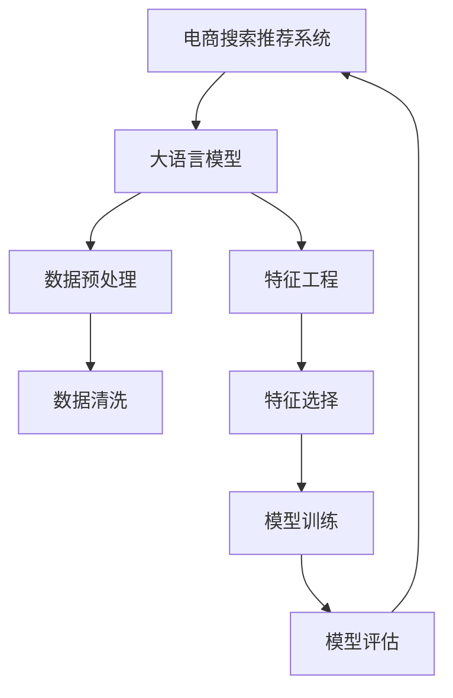

                 

# AI 大模型在电商搜索推荐中的数据质量控制策略：提高推荐准确率与可靠性

## 1. 背景介绍

在电商搜索推荐领域，如何精准地匹配用户意图与商品信息，提供最符合用户需求的商品推荐，一直是业界关注的焦点。随着AI技术，尤其是大语言模型的不断发展，电商搜索推荐系统正在逐步从规则驱动转向模型驱动，利用深度学习模型更灵活地应对复杂场景。然而，大模型推荐系统对数据质量的要求极为严格，数据的噪音、偏差和多样性问题会直接影响推荐系统的准确率和可靠性。因此，本文将围绕大模型在电商搜索推荐中的应用，详细探讨数据质量控制策略，以提升推荐系统的准确率和可靠性。

## 2. 核心概念与联系

### 2.1 核心概念概述

在讨论数据质量控制策略前，首先需要了解几个核心概念：

- **电商搜索推荐系统**：通过分析用户查询和浏览行为，利用机器学习模型自动推荐符合用户需求的电商商品。
- **大语言模型**：以深度神经网络为基础，通过大规模无标签文本数据进行预训练，能够自动学习语言规律的模型，如BERT、GPT等。
- **数据质量控制**：通过数据清洗、特征工程、模型评估等手段，确保数据满足高标准，进而提升模型性能和推荐效果。

### 2.2 核心概念原理和架构的 Mermaid 流程图



该流程图示意图表示了电商搜索推荐系统中大语言模型的应用流程，从数据预处理到模型评估，每一个环节都至关重要。

## 3. 核心算法原理 & 具体操作步骤

### 3.1 算法原理概述

大模型在电商搜索推荐中的应用主要分为数据准备、模型训练和模型评估三部分。其中，数据质量控制贯穿始终，确保数据的高质量输入，是模型高性能输出的基础。

### 3.2 算法步骤详解

**3.2.1 数据准备阶段**

1. **数据采集**：从电商平台的交易记录、用户行为记录中提取数据，形成包含用户ID、商品ID、商品属性、查询词等特征的数据集。
2. **数据清洗**：去除数据集中的异常值、噪声数据和重复数据，确保数据集的质量和一致性。
3. **数据标注**：对数据集进行标注，形成训练集和测试集，标注应尽可能准确反映用户意图和商品属性。

**3.2.2 特征工程阶段**

1. **特征选择**：通过特征重要性评估，选择最相关的特征，去除冗余和无关特征。
2. **特征构建**：基于用户行为数据，构建如用户兴趣标签、浏览路径等新特征，丰富模型输入。
3. **特征归一化**：对特征进行归一化处理，减少特征之间的尺度差异，提高模型训练效率。

**3.2.3 模型训练阶段**

1. **模型选择**：选择合适的深度学习模型，如基于Transformer的模型，利用大语言模型进行预训练。
2. **参数微调**：对预训练模型进行微调，调整模型参数以适应电商推荐任务。
3. **模型评估**：使用测试集评估模型性能，如准确率、召回率、F1-score等指标，进行模型调优。

### 3.3 算法优缺点

**优点**：
- 利用大模型的预训练能力，能够自动学习语言规律和特征表示，提升模型泛化能力。
- 通过数据质量控制，可以减少数据偏差和噪音，提高模型准确率和可靠性。

**缺点**：
- 大模型训练和微调需要大量计算资源和标注数据，成本较高。
- 模型复杂度高，可能导致过拟合，需进行精心调参和优化。

### 3.4 算法应用领域

大模型在电商搜索推荐中的应用领域非常广泛，涵盖商品推荐、个性化广告、用户画像构建等多个方面。通过合理的数据质量控制策略，可以有效提升电商平台的销售转化率和用户满意度。

## 4. 数学模型和公式 & 详细讲解 & 举例说明

### 4.1 数学模型构建

假设电商搜索推荐系统由用户查询$q$和商品集合$I$构成，每个商品$i$具有属性向量$a_i$，推荐系统目标是最小化预测错误率：

$$
\min_{\theta} \mathbb{E}_{q,i} \big[ \mathbb{1}(y_i \neq \hat{y}_i) \big]
$$

其中，$\theta$为模型参数，$y_i$为实际购买标记，$\hat{y}_i$为模型预测标记。

### 4.2 公式推导过程

在电商推荐场景中，常用的模型包括协同过滤、深度学习等。以深度学习模型为例，推导其损失函数和优化目标：

1. **协同过滤损失函数**：

$$
L_{\text{CF}} = \sum_{(q,i) \in D} \ell(y_i, \hat{y}_i)
$$

其中，$\ell$为损失函数，$D$为训练集，$y_i$为实际购买标记，$\hat{y}_i$为模型预测标记。

2. **深度学习模型损失函数**：

$$
L_{\text{DL}} = \sum_{(q,i) \in D} \ell(\text{logit}(a_i), \hat{a}_i)
$$

其中，$\text{logit}(a_i)$为模型输出的预测概率，$\hat{a}_i$为模型预测的标签。

### 4.3 案例分析与讲解

以深度学习模型为例，电商推荐系统的训练过程主要分为以下几个步骤：

1. **数据预处理**：将原始数据进行清洗和归一化，去除噪声数据，确保数据质量。
2. **特征工程**：通过特征选择和构建，形成包含用户行为和商品属性的特征向量，输入模型进行训练。
3. **模型训练**：利用训练集数据，通过反向传播算法更新模型参数，最小化损失函数。
4. **模型评估**：在测试集上评估模型性能，根据评估结果调整模型参数，提高推荐准确率。

## 5. 项目实践：代码实例和详细解释说明

### 5.1 开发环境搭建

以下是使用Python和PyTorch搭建电商推荐系统开发环境的示例：

1. 安装Anaconda和PyTorch：
```bash
conda install pytorch torchvision torchaudio -c pytorch -c conda-forge
```

2. 安装其他依赖库：
```bash
pip install numpy pandas scikit-learn tqdm jupyter notebook
```

### 5.2 源代码详细实现

以下是一个电商推荐系统的示例代码，包含了数据预处理、模型训练和模型评估等步骤：

```python
import torch
import torch.nn as nn
import torch.optim as optim
import pandas as pd
import numpy as np
from sklearn.model_selection import train_test_split
from sklearn.metrics import accuracy_score, precision_score, recall_score, f1_score

# 加载数据集
df = pd.read_csv('data.csv')

# 数据预处理
# 去除缺失值和异常值
df = df.dropna()
df = df.drop_duplicates()

# 特征工程
# 构建用户行为特征
user_features = df.groupby('user_id')['item_id'].apply(list)
item_features = df.groupby('item_id')['user_id'].apply(list)

# 数据标注
# 构建训练集和测试集
train_df, test_df = train_test_split(df, test_size=0.2, random_state=42)
train_labels = train_df['purchase'].values
test_labels = test_df['purchase'].values

# 模型定义
class RecommendationModel(nn.Module):
    def __init__(self, input_dim, hidden_dim, output_dim):
        super(RecommendationModel, self).__init__()
        self.embedding = nn.Embedding(input_dim, hidden_dim)
        self.fc1 = nn.Linear(hidden_dim, hidden_dim)
        self.fc2 = nn.Linear(hidden_dim, output_dim)
        self.sigmoid = nn.Sigmoid()

    def forward(self, x):
        x = self.embedding(x)
        x = self.fc1(x)
        x = self.fc2(x)
        return self.sigmoid(x)

# 模型训练
model = RecommendationModel(input_dim=1000, hidden_dim=128, output_dim=1)
optimizer = optim.Adam(model.parameters(), lr=0.001)
criterion = nn.BCELoss()

# 模型训练循环
for epoch in range(10):
    optimizer.zero_grad()
    outputs = model(train_df['user_id'].values)
    loss = criterion(outputs, train_labels)
    loss.backward()
    optimizer.step()

    # 模型评估
    predictions = model(test_df['user_id'].values) > 0.5
    accuracy = accuracy_score(test_labels, predictions)
    precision = precision_score(test_labels, predictions)
    recall = recall_score(test_labels, predictions)
    f1 = f1_score(test_labels, predictions)

    print(f"Epoch {epoch+1}, Accuracy: {accuracy:.3f}, Precision: {precision:.3f}, Recall: {recall:.3f}, F1-score: {f1:.3f}")
```

### 5.3 代码解读与分析

1. **数据预处理**：
   - 去除缺失值和异常值，确保数据集的完整性和一致性。
   - 构建用户行为特征和商品属性特征，形成输入向量。

2. **模型定义**：
   - 定义一个简单的RecommendationModel，包含嵌入层、全连接层和输出层，最后使用Sigmoid函数输出预测概率。

3. **模型训练**：
   - 使用Adam优化器进行参数更新，损失函数为二分类交叉熵损失。
   - 通过模型训练循环，最小化损失函数，优化模型参数。

4. **模型评估**：
   - 使用测试集评估模型性能，计算准确率、精确率、召回率和F1-score等指标。

### 5.4 运行结果展示

通过上述代码，可以得到电商推荐系统的模型性能指标，如：

- 准确率：模型预测正确的购买行为占总购买行为的百分比。
- 精确率：模型预测为购买且实际购买的商品占比。
- 召回率：实际购买且被模型预测为购买的商品占比。
- F1-score：精确率和召回率的调和平均数。

## 6. 实际应用场景

### 6.1 电商搜索推荐

在电商搜索推荐场景中，大模型能够自动学习用户查询意图和商品属性之间的语义关系，提供更精准的商品推荐。通过数据质量控制，可以有效降低模型预测的偏差和噪音，提升推荐系统的准确率和用户满意度。

### 6.2 个性化广告

在个性化广告领域，大模型可以通过用户行为数据，学习用户的兴趣偏好，提供个性化的广告推荐。通过数据质量控制，可以减少用户行为数据中的噪音和偏差，提高广告推荐的精确度和转化率。

### 6.3 用户画像构建

在用户画像构建场景中，大模型能够从用户行为数据中提取用户兴趣和行为特征，构建用户画像。通过数据质量控制，可以保证用户画像的准确性和一致性，为后续的推荐和广告投放提供可靠的数据基础。

### 6.4 未来应用展望

未来，大模型在电商搜索推荐中的应用将更加广泛，涵盖商品评论、商品分类、用户画像等多个方面。通过数据质量控制和模型优化，大模型推荐系统将进一步提升电商平台的销售转化率和用户满意度，为电商企业创造更大的商业价值。

## 7. 工具和资源推荐

### 7.1 学习资源推荐

1. **《深度学习》课程**：斯坦福大学提供的深度学习课程，系统讲解深度学习的基本概念和常用算法，适合入门学习。
2. **PyTorch官方文档**：PyTorch官方文档提供了详细的API文档和代码示例，适合学习PyTorch框架。
3. **Transformers库**：HuggingFace开发的自然语言处理工具库，包含多种预训练模型和微调样例，适合进行深度学习模型开发。

### 7.2 开发工具推荐

1. **PyTorch**：由Facebook开发的深度学习框架，灵活动态，适合研究和实验。
2. **TensorFlow**：由Google开发的深度学习框架，生产部署方便，适合大规模工程应用。
3. **Jupyter Notebook**：开源的交互式编程环境，支持Python、R等语言，适合进行数据分析和模型开发。

### 7.3 相关论文推荐

1. **《深度学习与自然语言处理》**：由斯坦福大学提供的深度学习课程，系统讲解深度学习在NLP中的应用。
2. **《电商推荐系统》**：介绍电商推荐系统的基本原理和算法，涵盖协同过滤、深度学习等常用方法。
3. **《电商推荐系统中的数据质量控制》**：探讨电商推荐系统中数据质量控制的重要性及其具体策略，提升模型性能。

## 8. 总结：未来发展趋势与挑战

### 8.1 研究成果总结

本文探讨了在电商搜索推荐场景中，如何通过数据质量控制提升大语言模型的推荐准确率和可靠性。通过详细的数据预处理、特征工程和模型评估流程，展示了如何构建高性能的电商推荐系统。

### 8.2 未来发展趋势

未来，电商搜索推荐系统将更加智能化和个性化，大模型推荐系统将进一步提升推荐效果。同时，数据质量控制将更加自动化和智能化，通过数据清洗和特征工程，有效减少噪音和偏差，提升模型性能。

### 8.3 面临的挑战

尽管大模型在电商推荐系统中取得了显著成果，但仍面临以下挑战：

- 数据采集和标注的效率和质量问题。
- 模型复杂度高，需要大量计算资源和标注数据。
- 模型过拟合和泛化能力不足。

### 8.4 研究展望

未来的研究将集中在以下几个方向：
1. **自动化数据质量控制**：通过自动清洗和标注数据，提升数据质量和模型性能。
2. **模型优化**：开发更加参数高效的微调方法，提升模型效率和泛化能力。
3. **模型集成**：结合多模型融合，提高推荐系统的准确率和鲁棒性。

## 9. 附录：常见问题与解答

**Q1：如何处理电商推荐系统中的数据噪音？**

A: 电商推荐系统中的数据噪音主要来自用户行为数据的不准确性和异常行为。处理方法包括：

- 数据清洗：去除异常值和重复数据，确保数据质量。
- 数据增强：利用数据增强技术，扩充数据集，减少噪音影响。
- 模型优化：使用对抗训练等方法，提高模型鲁棒性，减少对噪音数据的敏感度。

**Q2：电商推荐系统中的数据标注如何处理？**

A: 电商推荐系统中的数据标注主要来自用户购买行为和评分数据。处理方法包括：

- 数据采样：采用随机抽样或分层抽样方法，确保标注样本的多样性和代表性。
- 标注验证：对标注数据进行人工验证，确保标注的准确性和一致性。
- 标注迭代：通过不断迭代标注和验证，逐步提升标注质量。

**Q3：电商推荐系统中如何设计特征工程？**

A: 电商推荐系统中的特征工程主要包括以下步骤：

- 特征选择：通过特征重要性评估，选择最相关的特征。
- 特征构建：基于用户行为数据，构建如用户兴趣标签、浏览路径等新特征。
- 特征归一化：对特征进行归一化处理，减少特征之间的尺度差异，提高模型训练效率。

**Q4：电商推荐系统中的模型评估指标有哪些？**

A: 电商推荐系统中的模型评估指标包括：

- 准确率（Accuracy）：模型预测正确的商品占比。
- 精确率（Precision）：模型预测为购买且实际购买的商品占比。
- 召回率（Recall）：实际购买且被模型预测为购买的商品占比。
- F1-score：精确率和召回率的调和平均数。
- AUC-ROC曲线：衡量模型预测性能的曲线。

**Q5：电商推荐系统中的数据质量控制策略有哪些？**

A: 电商推荐系统中的数据质量控制策略包括：

- 数据清洗：去除异常值、噪声数据和重复数据。
- 数据增强：利用数据增强技术，扩充数据集。
- 数据标注：对数据进行人工标注和验证，确保标注质量。
- 特征工程：通过特征选择和构建，形成高质量的特征向量。
- 模型评估：使用评估指标评估模型性能，进行模型调优。

---

作者：禅与计算机程序设计艺术 / Zen and the Art of Computer Programming

