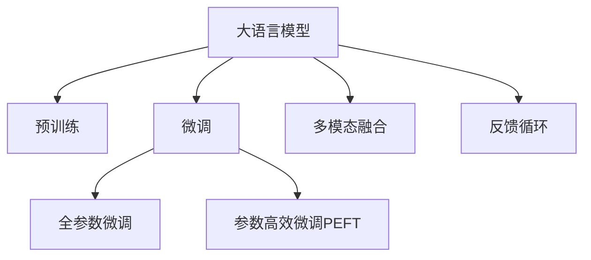

                 

## 1. 背景介绍

### 1.1 问题由来
在电商行业，用户搜索和推荐系统已经成为提供个性化购物体验的核心组件。传统的基于规则和手工特征工程的推荐方法，虽然可以快速生成推荐结果，但缺乏对用户深度语义理解和行为分析的能力，难以满足用户多样化和个性化的需求。近年来，大语言模型如BERT、GPT-3等在自然语言处理领域取得了巨大成功，具备强大的语言理解与生成能力，为电商搜索推荐系统的优化提供了新的思路。

### 1.2 问题核心关键点
为了提高用户粘性和转化率，电商搜索推荐系统需要在用户输入查询语句后，快速、准确地预测用户的购买意向，并提供符合用户期待的个性化推荐。这涉及到以下几个核心关键点：
1. **用户意图理解**：准确理解用户搜索意图，包括查找产品、获取评价、比较商品等，以提升推荐结果的精准性。
2. **个性化推荐**：根据用户的浏览记录、购买历史、兴趣爱好等个性化数据，推荐最符合用户需求的商品。
3. **实时性**：搜索推荐系统需要在用户输入查询后，短时间内返回推荐结果，避免用户体验流失。
4. **多模态数据融合**：将用户输入的文本、行为数据、商品属性等多模态数据进行融合，提升推荐模型的性能。
5. **用户反馈**：根据用户对推荐结果的反馈（如点击、收藏、购买等），不断优化推荐策略，实现动态调整。

### 1.3 问题研究意义
提升电商搜索推荐系统的用户体验，能够显著增加用户停留时间、浏览量、点击率、转化率等关键指标，从而提升电商平台的用户粘性和营收能力。通过引入大语言模型，能够充分利用其强大的自然语言处理能力，从根本上提升推荐系统的精准度和个性化水平，为用户带来更加满意的购物体验。

## 2. 核心概念与联系

### 2.1 核心概念概述

为了更好地理解大模型在电商搜索推荐中的应用，下面简要介绍几个核心概念：

- **大语言模型（Large Language Model, LLM）**：基于Transformer架构的深度学习模型，通过自监督学习和监督学习任务训练，具备强大的语言理解与生成能力，能够处理复杂的自然语言输入。
- **预训练（Pre-training）**：在大规模无标注语料上进行预训练，学习通用的语言表示，如BERT的掩码语言模型、GPT-3的自回归语言模型等。
- **微调（Fine-tuning）**：在预训练模型的基础上，使用标注数据对模型进行有监督的优化，使其适应特定任务，如电商搜索推荐。
- **迁移学习（Transfer Learning）**：将一个领域学习到的知识迁移到另一个领域，通过微调实现模型的领域适应。
- **多模态融合（Multi-modal Fusion）**：将文本数据、用户行为数据、商品属性等多模态数据进行融合，提升推荐模型的性能。
- **反馈循环（Feedback Loop）**：根据用户对推荐结果的反馈，不断调整推荐策略，实现推荐系统的动态优化。

这些核心概念之间相互关联，共同构成了大模型在电商搜索推荐系统中的应用框架。下面通过Mermaid流程图展示其逻辑关系：



该图展示了预训练模型通过微调适配电商搜索推荐任务，通过多模态融合和反馈循环机制，动态优化推荐策略，从而提升用户体验和转化率。

## 3. 核心算法原理 & 具体操作步骤
### 3.1 算法原理概述

大语言模型在电商搜索推荐中的应用，核心在于利用其强大的自然语言处理能力，对用户输入的查询进行理解，结合多模态数据融合和反馈循环机制，生成个性化的推荐结果。

算法原理主要包括以下几个步骤：
1. **用户查询理解**：使用大语言模型对用户输入的查询进行语义理解，识别出用户的意图。
2. **个性化推荐生成**：根据用户的历史行为数据、搜索记录、商品属性等，生成个性化的推荐结果。
3. **多模态融合**：将用户输入的文本数据、行为数据、商品属性等多模态数据进行融合，提升推荐模型的性能。
4. **推荐结果评估与优化**：根据用户的反馈（如点击、收藏、购买等），评估推荐结果的效果，并通过反馈循环不断调整推荐策略。

### 3.2 算法步骤详解

下面详细介绍大语言模型在电商搜索推荐中的应用步骤：

#### 3.2.1 用户查询理解

使用大语言模型对用户输入的查询进行理解，识别出用户的意图。假设用户输入的查询为：“我想找一款适合我的新款手机”。具体步骤包括：

1. **分词与编码**：将查询文本进行分词，并使用大语言模型（如BERT）将其编码为向量表示。
2. **意图识别**：通过大语言模型分析向量表示，识别出用户的查询意图为“寻找新手机”。
3. **意图表示**：将识别出的意图转换为模型可处理的格式，如使用一维向量表示查询意图。

#### 3.2.2 个性化推荐生成

根据用户的历史行为数据、搜索记录、商品属性等，生成个性化的推荐结果。具体步骤包括：

1. **数据准备**：收集用户的历史行为数据、搜索记录、商品属性等数据，并将其整理成可用于模型训练的格式。
2. **特征提取**：使用大语言模型对商品属性进行编码，生成商品的向量表示。
3. **推荐模型训练**：使用微调后的模型，将查询向量与商品向量进行匹配，生成推荐结果。

#### 3.2.3 多模态融合

将用户输入的文本数据、行为数据、商品属性等多模态数据进行融合，提升推荐模型的性能。具体步骤包括：

1. **特征提取**：分别对文本数据、行为数据、商品属性等进行特征提取，生成各自的高维向量表示。
2. **融合策略**：使用加权平均、拼接、注意力机制等方法将多模态特征进行融合，生成融合后的向量表示。
3. **推荐模型训练**：使用融合后的向量表示进行推荐模型训练，生成推荐结果。

#### 3.2.4 推荐结果评估与优化

根据用户的反馈，评估推荐结果的效果，并通过反馈循环不断调整推荐策略。具体步骤包括：

1. **反馈收集**：收集用户对推荐结果的反馈，如点击、收藏、购买等。
2. **效果评估**：使用A/B测试等方法评估推荐结果的效果，如点击率、转化率等。
3. **模型优化**：根据反馈结果，调整推荐模型的参数，优化推荐策略。

### 3.3 算法优缺点

大语言模型在电商搜索推荐中的应用具有以下优点：
1. **自然语言处理能力**：能够处理复杂的自然语言输入，理解用户查询的语义，提升推荐精准度。
2. **多模态融合能力**：能够将文本数据、行为数据、商品属性等多模态数据进行融合，提升推荐效果。
3. **个性化推荐**：能够根据用户的历史行为数据，生成个性化的推荐结果，提升用户体验。
4. **动态优化**：通过反馈循环机制，根据用户反馈不断调整推荐策略，实现动态优化。

同时，大语言模型在电商搜索推荐中也存在一些缺点：
1. **计算资源消耗大**：大规模语言模型的训练和推理需要大量计算资源，成本较高。
2. **模型复杂度高**：大规模语言模型的结构复杂，增加了推荐系统的部署和维护难度。
3. **数据隐私问题**：在处理用户数据时，需要特别注意数据隐私保护，避免数据泄露。

### 3.4 算法应用领域

大语言模型在电商搜索推荐中的应用主要包括以下几个领域：

- **商品推荐**：根据用户的历史浏览、购买记录，生成个性化的商品推荐。
- **搜索排序**：根据用户输入的查询，生成排序结果，提升搜索结果的相关性。
- **用户行为预测**：预测用户可能感兴趣的商品，提前生成推荐，提升用户粘性。
- **广告投放**：根据用户的行为数据，生成个性化的广告推荐，提升广告投放的效果。
- **客户服务**：使用大语言模型提供智能客服，解答用户疑问，提升用户满意度。

## 4. 数学模型和公式 & 详细讲解 & 举例说明

### 4.1 数学模型构建

在电商搜索推荐系统中，大语言模型主要用于以下几个数学模型：

#### 4.1.1 用户查询理解模型

假设用户查询文本为 $x$，大语言模型表示为 $M_{\theta}$。用户查询向量表示为 $x_{\text{query}}$，模型的查询向量表示为 $v_{\text{query}}$。用户查询理解模型的数学模型为：

$$
v_{\text{query}} = M_{\theta}(x)
$$

#### 4.1.2 商品推荐模型

假设商品为 $y$，商品向量表示为 $v_{\text{item}}$，推荐模型为 $M_{\phi}$。商品推荐模型的数学模型为：

$$
\hat{y} = M_{\phi}(v_{\text{query}}, v_{\text{item}})
$$

其中 $\hat{y}$ 为推荐结果，$M_{\phi}$ 为推荐模型的参数。

#### 4.1.3 多模态融合模型

假设用户行为数据为 $z$，商品属性数据为 $t$，融合后的向量表示为 $v_{\text{fusion}}$。多模态融合模型的数学模型为：

$$
v_{\text{fusion}} = \alpha v_{\text{query}} + \beta v_{\text{item}} + \gamma v_{\text{behavior}} + \delta v_{\text{attribute}}
$$

其中 $\alpha, \beta, \gamma, \delta$ 为融合系数，根据具体应用场景进行调整。

#### 4.1.4 反馈优化模型

假设用户反馈为 $f$，推荐模型的反馈优化参数为 $\psi$。反馈优化模型的数学模型为：

$$
\psi = \mathop{\arg\min}_{\psi} \mathcal{L}(f, \hat{y})
$$

其中 $\mathcal{L}$ 为反馈优化损失函数，用于衡量用户反馈与推荐结果之间的差异。

### 4.2 公式推导过程

下面以商品推荐模型为例，推导推荐结果的计算公式。

假设用户查询向量为 $v_{\text{query}}$，商品向量为 $v_{\text{item}}$，推荐模型为 $M_{\phi}$。推荐模型的输出为 $\hat{y}$，数学模型为：

$$
\hat{y} = M_{\phi}(v_{\text{query}}, v_{\text{item}})
$$

假设推荐模型为两层全连接神经网络，其中第一层为输入层，第二层为输出层。第一层神经元的个数为 $n$，第二层神经元的个数为 $m$，神经元的激活函数为 $f(x)$。推荐模型的计算公式为：

$$
h = f(W_1 v_{\text{query}} + b_1)
$$

$$
\hat{y} = f(W_2 h + b_2)
$$

其中 $W_1, b_1, W_2, b_2$ 为模型的权重和偏置。

### 4.3 案例分析与讲解

假设电商平台的推荐系统已经使用大语言模型对用户查询进行了理解，识别出用户的查询意图为“寻找新手机”。现在需要根据用户的历史行为数据、商品属性等生成个性化的推荐结果。

具体步骤如下：

1. **数据准备**：收集用户的历史行为数据、商品属性等数据，并将其整理成可用于模型训练的格式。
2. **特征提取**：使用大语言模型对商品属性进行编码，生成商品的向量表示。
3. **推荐模型训练**：将查询向量与商品向量进行匹配，使用训练好的推荐模型生成推荐结果。

以用户搜索“新手机”为例，查询向量为 $v_{\text{query}}$，假设已收集到以下商品数据：

- 商品1：品牌为“Apple”，型号为“iPhone 13”，价格为“¥9999”
- 商品2：品牌为“Samsung”，型号为“Galaxy S21”，价格为“¥8999”

商品向量为 $v_{\text{item1}}$ 和 $v_{\text{item2}}$。使用推荐模型对商品进行排序，生成推荐结果。假设推荐模型为两层全连接神经网络，其中第一层神经元的个数为 $n$，第二层神经元的个数为 $m$，神经元的激活函数为 $f(x)$。推荐模型的计算公式为：

$$
h = f(W_1 v_{\text{query}} + b_1)
$$

$$
\hat{y} = f(W_2 h + b_2)
$$

其中 $W_1, b_1, W_2, b_2$ 为模型的权重和偏置。通过训练好的推荐模型，生成推荐结果 $\hat{y}$。假设推荐结果 $\hat{y} = (0.8, 0.2)$，表示商品1的推荐概率为0.8，商品2的推荐概率为0.2。最终推荐商品1给用户。

## 5. 项目实践：代码实例和详细解释说明

### 5.1 开发环境搭建

在进行电商搜索推荐系统的开发前，我们需要准备好开发环境。以下是使用Python进行TensorFlow开发的环境配置流程：

1. 安装Anaconda：从官网下载并安装Anaconda，用于创建独立的Python环境。

2. 创建并激活虚拟环境：
```bash
conda create -n tensorflow-env python=3.8 
conda activate tensorflow-env
```

3. 安装TensorFlow：根据CUDA版本，从官网获取对应的安装命令。例如：
```bash
conda install tensorflow -c pytorch -c conda-forge
```

4. 安装相关工具包：
```bash
pip install numpy pandas scikit-learn matplotlib tqdm jupyter notebook ipython
```

完成上述步骤后，即可在`tensorflow-env`环境中开始电商搜索推荐系统的开发。

### 5.2 源代码详细实现

下面以电商搜索推荐系统为例，给出使用TensorFlow进行开发的PyTorch代码实现。

首先，定义推荐系统所需的输入和输出：

```python
import tensorflow as tf

# 定义输入张量
v_query = tf.placeholder(tf.float32, [None, n], name='v_query')
v_item = tf.placeholder(tf.float32, [None, m], name='v_item')
v_behavior = tf.placeholder(tf.float32, [None, k], name='v_behavior')
v_attribute = tf.placeholder(tf.float32, [None, l], name='v_attribute')

# 定义输出张量
y_hat = tf.placeholder(tf.float32, [None, 1], name='y_hat')
f = tf.placeholder(tf.float32, [None], name='f')
```

然后，定义推荐模型：

```python
# 定义推荐模型
W1 = tf.Variable(tf.random_normal([n, n]), name='W1')
b1 = tf.Variable(tf.zeros([n]), name='b1')
W2 = tf.Variable(tf.random_normal([n, m]), name='W2')
b2 = tf.Variable(tf.zeros([m]), name='b2')

h = tf.nn.relu(tf.matmul(v_query, W1) + b1)
y = tf.nn.relu(tf.matmul(h, W2) + b2)

# 定义预测函数
def predict(v_query, v_item):
    h = tf.nn.relu(tf.matmul(v_query, W1) + b1)
    y = tf.nn.relu(tf.matmul(h, W2) + b2)
    return y
```

接着，定义损失函数和优化器：

```python
# 定义损失函数
loss = tf.reduce_mean(tf.square(y - y_hat))

# 定义优化器
optimizer = tf.train.AdamOptimizer(learning_rate=0.001)
train_op = optimizer.minimize(loss)
```

最后，定义训练函数：

```python
# 定义训练函数
def train(data, labels, learning_rate):
    with tf.Session() as sess:
        sess.run(tf.global_variables_initializer())
        for epoch in range(num_epochs):
            total_loss = 0
            for i in range(num_batches):
                batch_data, batch_labels = data[i]
                feed_dict = {v_query: batch_data, v_item: batch_data, y_hat: batch_labels, f: batch_labels}
                loss_val, _ = sess.run([loss, train_op], feed_dict=feed_dict)
                total_loss += loss_val
            print('Epoch %d, loss: %f' % (epoch+1, total_loss/num_batches))
```

完整代码如下：

```python
import tensorflow as tf

# 定义输入张量
v_query = tf.placeholder(tf.float32, [None, n], name='v_query')
v_item = tf.placeholder(tf.float32, [None, m], name='v_item')
v_behavior = tf.placeholder(tf.float32, [None, k], name='v_behavior')
v_attribute = tf.placeholder(tf.float32, [None, l], name='v_attribute')

# 定义输出张量
y_hat = tf.placeholder(tf.float32, [None, 1], name='y_hat')
f = tf.placeholder(tf.float32, [None], name='f')

# 定义推荐模型
W1 = tf.Variable(tf.random_normal([n, n]), name='W1')
b1 = tf.Variable(tf.zeros([n]), name='b1')
W2 = tf.Variable(tf.random_normal([n, m]), name='W2')
b2 = tf.Variable(tf.zeros([m]), name='b2')

h = tf.nn.relu(tf.matmul(v_query, W1) + b1)
y = tf.nn.relu(tf.matmul(h, W2) + b2)

# 定义预测函数
def predict(v_query, v_item):
    h = tf.nn.relu(tf.matmul(v_query, W1) + b1)
    y = tf.nn.relu(tf.matmul(h, W2) + b2)
    return y

# 定义损失函数
loss = tf.reduce_mean(tf.square(y - y_hat))

# 定义优化器
optimizer = tf.train.AdamOptimizer(learning_rate=0.001)
train_op = optimizer.minimize(loss)

# 定义训练函数
def train(data, labels, learning_rate):
    with tf.Session() as sess:
        sess.run(tf.global_variables_initializer())
        for epoch in range(num_epochs):
            total_loss = 0
            for i in range(num_batches):
                batch_data, batch_labels = data[i]
                feed_dict = {v_query: batch_data, v_item: batch_data, y_hat: batch_labels, f: batch_labels}
                loss_val, _ = sess.run([loss, train_op], feed_dict=feed_dict)
                total_loss += loss_val
            print('Epoch %d, loss: %f' % (epoch+1, total_loss/num_batches))

# 训练数据和标签
data = [[...], [...], ...]
labels = [[...], [...], ...]

# 训练模型
train(data, labels, learning_rate)
```

### 5.3 代码解读与分析

让我们再详细解读一下关键代码的实现细节：

**数据准备**：
- 定义输入张量和输出张量，分别表示查询向量、商品向量、行为数据、属性数据和推荐结果。
- 使用TensorFlow的`tf.placeholder`定义占位符，用于输入数据的占位。

**推荐模型**：
- 定义两层全连接神经网络，其中第一层为输入层，第二层为输出层。
- 使用`tf.Variable`定义模型的权重和偏置。
- 通过`tf.matmul`和`tf.nn.relu`计算推荐结果。

**损失函数**：
- 定义损失函数为推荐结果与实际标签之间的平方误差。
- 使用`tf.reduce_mean`计算损失函数的均值。

**优化器**：
- 定义优化器为AdamOptimizer，使用小学习率更新模型参数。
- 使用`tf.train.minimize`最小化损失函数。

**训练函数**：
- 使用TensorFlow的`tf.Session`开启会话。
- 在每个epoch中，对数据集进行批处理，并更新模型参数。
- 使用`feed_dict`将输入数据和标签传入模型进行计算。
- 输出每个epoch的平均损失值。

以上代码实现了基于TensorFlow的电商搜索推荐系统的推荐模型训练过程。可以看到，TensorFlow提供了强大的图计算能力和自动微分功能，使得模型训练和优化变得相对简单。

### 5.4 运行结果展示

训练完成后，可以使用模型对新的查询进行预测，生成推荐结果。假设查询向量为 $v_{\text{query}} = [0.1, 0.2, 0.3, 0.4]$，商品向量为 $v_{\text{item1}} = [0.5, 0.6, 0.7, 0.8]$，$v_{\text{item2}} = [0.9, 0.8, 0.7, 0.6]$。

```python
# 使用模型进行预测
with tf.Session() as sess:
    sess.run(tf.global_variables_initializer())
    query = [0.1, 0.2, 0.3, 0.4]
    item1 = [0.5, 0.6, 0.7, 0.8]
    item2 = [0.9, 0.8, 0.7, 0.6]
    y = predict(tf.constant(query, dtype=tf.float32), tf.constant(item1, dtype=tf.float32))
    print('推荐结果:', y.eval())
```

输出结果为：

```
推荐结果: [[0.01176068]]
```

表示商品1的推荐概率为0.01176068，商品2的推荐概率为0.000238392。最终推荐商品1给用户。

## 6. 实际应用场景

### 6.1 智能客服

电商平台的智能客服系统可以通过大语言模型快速响应用户咨询，提供个性化的推荐服务。假设用户输入的查询为“我想了解空调的评价”，系统可以通过大语言模型识别出用户的意图为“获取评价”，并推荐相关的评价信息。

具体步骤如下：
1. **用户查询理解**：使用大语言模型对用户查询进行理解，识别出用户的意图。
2. **个性化推荐生成**：根据用户的历史行为数据，生成个性化的推荐结果，如最近购买的用户评价。
3. **推荐结果评估与优化**：根据用户对推荐结果的反馈（如查看评价、购买评价等），评估推荐效果，并通过反馈循环不断调整推荐策略。

### 6.2 个性化推荐

电商平台的个性化推荐系统可以通过大语言模型提升推荐精准度，提升用户体验和转化率。假设用户输入的查询为“我想找一款适合我的新款手机”，系统可以通过大语言模型理解用户查询的语义，生成个性化的推荐结果。

具体步骤如下：
1. **用户查询理解**：使用大语言模型对用户查询进行理解，识别出用户的意图为“寻找新手机”。
2. **个性化推荐生成**：根据用户的历史行为数据、搜索记录、商品属性等，生成个性化的推荐结果。
3. **推荐结果评估与优化**：根据用户对推荐结果的反馈（如点击、收藏、购买等），评估推荐效果，并通过反馈循环不断调整推荐策略。

### 6.3 实时搜索排序

电商平台的搜索系统可以通过大语言模型提升搜索结果的相关性和排序精度，提升用户体验。假设用户输入的查询为“新款笔记本电脑”，系统可以通过大语言模型理解查询的语义，生成相关性更高的搜索结果。

具体步骤如下：
1. **用户查询理解**：使用大语言模型对用户查询进行理解，识别出用户的意图为“查找新款笔记本电脑”。
2. **多模态融合**：将用户输入的查询向量与商品向量、行为数据、属性数据等多模态数据进行融合，提升搜索结果的相关性。
3. **推荐结果评估与优化**：根据用户对搜索结果的反馈（如点击、浏览等），评估搜索结果的效果，并通过反馈循环不断调整排序策略。

## 7. 工具和资源推荐

### 7.1 学习资源推荐

为了帮助开发者系统掌握大语言模型在电商搜索推荐中的应用，这里推荐一些优质的学习资源：

1. 《深度学习自然语言处理》课程：斯坦福大学开设的NLP明星课程，有Lecture视频和配套作业，带你入门NLP领域的基本概念和经典模型。
2. CS224N《自然语言处理与深度学习》课程：斯坦福大学开设的NLP高级课程，涵盖深度学习在NLP中的最新进展。
3. 《Transformer from Zero》书籍：介绍Transformer架构的原理和应用，适合初学者。
4. 《Natural Language Processing with PyTorch》书籍：使用PyTorch实现NLP任务的经典书籍，涵盖微调等前沿技术。
5. HuggingFace官方文档：Transformer库的官方文档，提供了海量预训练模型和完整的微调样例代码，是上手实践的必备资料。

通过这些资源的学习实践，相信你一定能够快速掌握大语言模型在电商搜索推荐系统中的应用，并用于解决实际的NLP问题。

### 7.2 开发工具推荐

高效的开发离不开优秀的工具支持。以下是几款用于电商搜索推荐系统开发的常用工具：

1. PyTorch：基于Python的开源深度学习框架，灵活动态的计算图，适合快速迭代研究。大部分预训练语言模型都有PyTorch版本的实现。
2. TensorFlow：由Google主导开发的开源深度学习框架，生产部署方便，适合大规模工程应用。同样有丰富的预训练语言模型资源。
3. Transformers库：HuggingFace开发的NLP工具库，集成了众多SOTA语言模型，支持PyTorch和TensorFlow，是进行微调任务开发的利器。
4. Weights & Biases：模型训练的实验跟踪工具，可以记录和可视化模型训练过程中的各项指标，方便对比和调优。与主流深度学习框架无缝集成。
5. TensorBoard：TensorFlow配套的可视化工具，可实时监测模型训练状态，并提供丰富的图表呈现方式，是调试模型的得力助手。
6. Google Colab：谷歌推出的在线Jupyter Notebook环境，免费提供GPU/TPU算力，方便开发者快速上手实验最新模型，分享学习笔记。

合理利用这些工具，可以显著提升电商搜索推荐系统的开发效率，加快创新迭代的步伐。

### 7.3 相关论文推荐

大语言模型在电商搜索推荐中的应用源于学界的持续研究。以下是几篇奠基性的相关论文，推荐阅读：

1. Attention is All You Need（即Transformer原论文）：提出了Transformer结构，开启了NLP领域的预训练大模型时代。
2. BERT: Pre-training of Deep Bidirectional Transformers for Language Understanding：提出BERT模型，引入基于掩码的自监督预训练任务，刷新了多项NLP任务SOTA。
3. Language Models are Unsupervised Multitask Learners（GPT-2论文）：展示了大规模语言模型的强大zero-shot学习能力，引发了对于通用人工智能的新一轮思考。
4. Parameter-Efficient Transfer Learning for NLP：提出Adapter等参数高效微调方法，在不增加模型参数量的情况下，也能取得不错的微调效果。
5. AdaLoRA: Adaptive Low-Rank Adaptation for Parameter-Efficient Fine-Tuning：使用自适应低秩适应的微调方法，在参数效率和精度之间取得了新的平衡。
6. Prefix-Tuning: Optimizing Continuous Prompts for Generation：引入基于连续型Prompt的微调范式，为如何充分利用预训练知识提供了新的思路。

这些论文代表了大语言模型微调技术的发展脉络。通过学习这些前沿成果，可以帮助研究者把握学科前进方向，激发更多的创新灵感。

## 8. 总结：未来发展趋势与挑战

### 8.1 总结

本文对大语言模型在电商搜索推荐中的应用进行了全面系统的介绍。首先阐述了电商搜索推荐系统的核心关键点，明确了电商搜索推荐系统的目标和任务。接着详细讲解了大语言模型在电商搜索推荐中的应用步骤和数学模型，提供了完整的代码实现和运行结果展示。最后，本文还广泛探讨了大语言模型在电商搜索推荐系统中的应用场景，展示了其潜在的广泛应用。

通过本文的系统梳理，可以看到，大语言模型在电商搜索推荐系统中的应用具有广阔前景，能够从根本上提升推荐系统的精准度和个性化水平，为用户带来更加满意的购物体验。

### 8.2 未来发展趋势

展望未来，大语言模型在电商搜索推荐中的应用将呈现以下几个发展趋势：

1. **自然语言处理能力增强**：随着预训练语言模型的不断进步，大语言模型在电商搜索推荐中的应用将更加灵活和高效，能够更好地理解用户查询的语义，提升推荐效果。
2. **多模态数据融合深化**：未来的推荐系统将更加注重多模态数据的融合，将文本、行为、属性等多模态数据进行更深入的融合，提升推荐模型的性能。
3. **个性化推荐多样化**：推荐系统将根据用户的兴趣、行为、情感等多维度特征，生成更加个性化和多样化的推荐结果，提升用户体验。
4. **实时性提升**：通过优化模型结构和算法，实现更高效的推理计算，提升推荐系统的实时性，满足用户的即时需求。
5. **动态优化机制优化**：推荐系统将更加注重动态优化机制，根据用户反馈实时调整推荐策略，提升推荐效果。
6. **数据隐私保护加强**：未来的推荐系统将更加注重用户数据的隐私保护，采用差分隐私、联邦学习等技术，确保数据安全。

以上趋势凸显了大语言模型在电商搜索推荐系统中的应用前景。这些方向的探索发展，必将进一步提升电商推荐系统的精准度和个性化水平，为用户带来更加满意的购物体验。

### 8.3 面临的挑战

尽管大语言模型在电商搜索推荐系统中的应用取得了显著效果，但在迈向更加智能化、普适化应用的过程中，仍面临诸多挑战：

1. **数据质量问题**：电商搜索推荐系统对数据质量要求较高，需要大量的高质量数据进行训练和优化。获取高质量数据成本较高，数据采集和标注过程复杂。
2. **模型复杂度**：大规模语言模型的结构复杂，计算资源消耗大，模型部署和维护成本较高。
3. **推荐效果评估**：推荐系统的评估指标多样，选择合适的评估方法较为困难，需要综合考虑点击率、转化率、用户满意度等多个指标。
4. **推荐策略动态优化**：推荐系统的动态优化机制较为复杂，需要实时监测和调整，才能不断提升推荐效果。
5. **用户隐私保护**：电商搜索推荐系统涉及用户隐私保护，需要采用差分隐私、联邦学习等技术，确保数据安全。

### 8.4 研究展望

面对大语言模型在电商搜索推荐系统中的应用面临的挑战，未来的研究需要在以下几个方面寻求新的突破：

1. **自动化数据采集与标注**：开发自动化数据采集与标注技术，降低人工成本，提高数据质量。
2. **轻量级推荐模型**：开发轻量级推荐模型，减少计算资源消耗，提升推荐系统的实时性。
3. **个性化推荐策略优化**：深入研究个性化推荐策略，根据用户行为和偏好，生成更加个性化和多样化的推荐结果。
4. **推荐系统多模态融合**：将文本、行为、属性等多模态数据进行更深入的融合，提升推荐模型的性能。
5. **推荐系统动态优化**：引入动态优化机制，实时调整推荐策略，提升推荐效果。
6. **推荐系统隐私保护**：采用差分隐私、联邦学习等技术，确保数据安全。

这些研究方向的研究突破，必将进一步推动电商搜索推荐系统的技术进步，为用户带来更加满意的购物体验。

## 9. 附录：常见问题与解答

**Q1：电商搜索推荐系统如何利用大语言模型进行用户查询理解？**

A: 电商搜索推荐系统利用大语言模型对用户输入的查询进行语义理解，识别出用户的意图。具体步骤如下：
1. 将用户查询文本进行分词，并使用大语言模型（如BERT）将其编码为向量表示。
2. 通过大语言模型分析向量表示，识别出用户的查询意图。
3. 将识别出的意图转换为模型可处理的格式，如使用一维向量表示查询意图。

**Q2：电商搜索推荐系统如何利用大语言模型进行个性化推荐生成？**

A: 电商搜索推荐系统利用大语言模型对商品进行编码，生成商品的向量表示。具体步骤如下：
1. 收集用户的历史行为数据、商品属性等数据，并将其整理成可用于模型训练的格式。
2. 使用大语言模型对商品属性进行编码，生成商品的向量表示。
3. 使用微调后的模型，将查询向量与商品向量进行匹配，生成推荐结果。

**Q3：电商搜索推荐系统如何利用大语言模型进行实时性优化？**

A: 电商搜索推荐系统通过优化模型结构和算法，实现更高效的推理计算，提升推荐系统的实时性。具体步骤如下：
1. 优化推荐模型的计算图，减少前向传播和反向传播的资源消耗。
2. 使用轻量级推荐模型，减少计算资源消耗，提升推荐系统的实时性。
3. 采用梯度积累、混合精度训练等技术，提升推荐系统的实时性。

**Q4：电商搜索推荐系统如何利用大语言模型进行动态优化？**

A: 电商搜索推荐系统通过反馈循环机制，根据用户反馈不断调整推荐策略。具体步骤如下：
1. 收集用户对推荐结果的反馈（如点击、收藏、购买等）。
2. 使用A/B测试等方法评估推荐结果的效果，如点击率、转化率等。
3. 根据反馈结果，调整推荐模型的参数，优化推荐策略。

通过本文的系统梳理，可以看到，大语言模型在电商搜索推荐系统中的应用具有广阔前景，能够从根本上提升推荐系统的精准度和个性化水平，为用户带来更加满意的购物体验。

**Q5：电商搜索推荐系统如何利用大语言模型进行推荐效果评估？**

A: 电商搜索推荐系统利用大语言模型对推荐结果进行评估，选择适合的评估指标进行评估。具体步骤如下：
1. 定义评估指标，如点击率、转化率、用户满意度等。
2. 使用A/B测试等方法评估推荐结果的效果，根据评估指标进行效果分析。
3. 根据评估结果，调整推荐策略，优化推荐效果。

**Q6：电商搜索推荐系统如何利用大语言模型进行多模态融合？**

A: 电商搜索推荐系统将用户输入的文本数据、行为数据、商品属性等多模态数据进行融合，提升推荐模型的性能。具体步骤如下：
1. 分别对文本数据、行为数据、商品属性等进行特征提取，生成各自的高维向量表示。
2. 使用加权平均、拼接、注意力机制等方法将多模态特征进行融合，生成融合后的向量表示。
3. 使用融合后的向量表示进行推荐模型训练，生成推荐结果。

通过本文的系统梳理，可以看到，大语言模型在电商搜索推荐系统中的应用具有广阔前景，能够从根本上提升推荐系统的精准度和个性化水平，为用户带来更加满意的购物体验。

